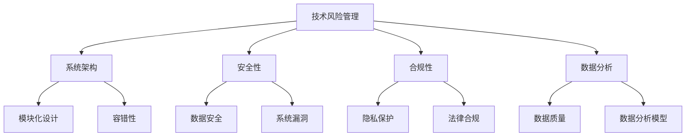

                 

关键词：技术风险管理，AI创业公司，系统架构，安全性，合规性，数据分析

摘要：本文将探讨AI创业公司在技术风险管理方面面临的挑战，包括系统架构、安全性、合规性和数据分析等方面。通过深入分析，本文旨在为AI创业公司提供一套全面的技术风险管理策略，以保障业务稳健发展。

## 1. 背景介绍

随着人工智能技术的快速发展，越来越多的创业公司投身于这个领域，试图抓住市场机遇。然而，技术创新带来的同时也伴随着一系列风险。对于AI创业公司来说，技术风险管理尤为重要。有效的技术风险管理不仅能够确保系统的安全性和稳定性，还能提高公司的合规性，增强市场竞争力。

## 2. 核心概念与联系

在探讨技术风险管理之前，我们需要了解一些核心概念。以下是一个关于AI创业公司技术风险管理的Mermaid流程图：



### 2.1 系统架构

系统架构是技术风险管理的基础。一个良好的系统架构应该具备模块化设计和容错性。

- **模块化设计**：模块化设计可以提高系统的可维护性和扩展性，降低技术风险。
- **容错性**：通过冗余设计、故障转移等技术手段，确保系统在遇到故障时能够迅速恢复。

### 2.2 安全性

安全性是技术风险管理的重中之重。以下两个方面是确保系统安全的关键：

- **数据安全**：数据安全包括数据的保密性、完整性和可用性。要确保数据在传输和存储过程中不被窃取或篡改。
- **系统漏洞**：定期进行安全审计，发现并修复系统漏洞，防止黑客攻击。

### 2.3 合规性

合规性是AI创业公司必须重视的一环。以下两个方面是确保合规性的关键：

- **隐私保护**：遵守《通用数据保护条例》（GDPR）等相关法规，保护用户隐私。
- **法律合规**：确保公司的业务模式、合同条款等符合当地法律法规。

### 2.4 数据分析

数据分析是AI创业公司的核心竞争力。以下两个方面是确保数据分析有效性的关键：

- **数据质量**：确保数据来源可靠、数据格式统一、数据清洗及时。
- **数据分析模型**：选择合适的算法和模型，提高数据分析和预测的准确性。

## 3. 核心算法原理 & 具体操作步骤

### 3.1 算法原理概述

在技术风险管理中，常用的算法包括数据加密、访问控制、异常检测等。以下是一个关于数据加密算法的原理概述：

- **数据加密**：通过加密算法对数据进行加密，确保数据在传输和存储过程中不被窃取。
- **访问控制**：通过权限管理，限制用户对数据的访问，确保数据安全。
- **异常检测**：通过监测系统日志、网络流量等，发现潜在的安全威胁。

### 3.2 算法步骤详解

以下是一个关于数据加密算法的具体操作步骤：

1. **选择加密算法**：根据数据的安全需求，选择合适的加密算法。
2. **生成密钥**：使用加密算法生成加密密钥。
3. **加密数据**：将数据使用密钥进行加密。
4. **存储加密数据**：将加密后的数据存储在安全的地方。
5. **解密数据**：在需要访问数据时，使用密钥对数据进行解密。

### 3.3 算法优缺点

- **数据加密**：优点包括数据保密性强、安全可靠；缺点包括加密和解密过程较为复杂，可能会影响数据传输速度。
- **访问控制**：优点包括权限管理灵活、安全；缺点包括实现成本较高，可能会影响系统性能。
- **异常检测**：优点包括实时监控、预警能力强；缺点包括误报率较高，需要不断优化模型。

### 3.4 算法应用领域

- **数据加密**：广泛应用于金融、医疗、政府等领域，确保数据安全。
- **访问控制**：广泛应用于企业、政府、学校等领域，保障系统安全。
- **异常检测**：广泛应用于网络安全、金融风控、工业安全等领域，防范安全威胁。

## 4. 数学模型和公式 & 详细讲解 & 举例说明

### 4.1 数学模型构建

在技术风险管理中，常用的数学模型包括概率模型、线性回归模型、支持向量机（SVM）模型等。以下是一个关于概率模型的构建过程：

1. **数据收集**：收集相关数据，包括正常数据和异常数据。
2. **特征提取**：提取数据中的特征，用于建模。
3. **概率分布估计**：使用最大似然估计等方法，估计特征的概率分布。
4. **构建概率模型**：根据特征的概率分布，构建概率模型。

### 4.2 公式推导过程

以下是一个关于概率模型公式的推导过程：

$$
P(\text{异常}|\text{特征}) = \frac{P(\text{特征}|\text{异常})P(\text{异常})}{P(\text{特征})}
$$

其中，$P(\text{异常}|\text{特征})$ 表示在给定特征的情况下，异常发生的概率；$P(\text{特征}|\text{异常})$ 表示在异常发生的情况下，特征出现的概率；$P(\text{异常})$ 表示异常发生的概率；$P(\text{特征})$ 表示特征出现的概率。

### 4.3 案例分析与讲解

以下是一个关于概率模型在实际应用中的案例：

**案例**：一家银行希望通过概率模型检测恶意交易。

1. **数据收集**：收集过去一年内的交易数据，包括正常交易和恶意交易。
2. **特征提取**：提取交易金额、交易时间、交易地点等特征。
3. **概率分布估计**：使用最大似然估计方法，估计每个特征的分布。
4. **构建概率模型**：根据特征的概率分布，构建概率模型。
5. **检测恶意交易**：对新交易进行概率模型计算，判断交易是否为恶意交易。

## 5. 项目实践：代码实例和详细解释说明

### 5.1 开发环境搭建

以下是一个关于Python开发环境搭建的示例：

```bash
# 安装Python
$ sudo apt-get install python3

# 安装Anaconda
$ wget https://repo.anaconda.com/miniconda/Miniconda3-latest-Linux-x86_64.sh
$ bash Miniconda3-latest-Linux-x86_64.sh

# 安装Jupyter Notebook
$ conda install jupyter

# 启动Jupyter Notebook
$ jupyter notebook
```

### 5.2 源代码详细实现

以下是一个关于概率模型实现的基本代码：

```python
import numpy as np
from sklearn.model_selection import train_test_split
from sklearn.metrics import accuracy_score

# 数据准备
data = ...  # 特征数据
labels = ...  # 标签数据

# 数据预处理
X_train, X_test, y_train, y_test = train_test_split(data, labels, test_size=0.2, random_state=42)

# 概率模型训练
def probability_model(X_train, y_train):
    # 概率分布估计
    p = ...  # 特征的概率分布
    
    # 概率模型计算
    def calculate_probability(x):
        # 计算特征的概率
        return ...

    # 预测
    y_pred = [calculate_probability(x) for x in X_test]

    # 评估模型
    accuracy = accuracy_score(y_test, y_pred)
    return accuracy

# 训练模型并评估
accuracy = probability_model(X_train, y_train)
print("Accuracy:", accuracy)
```

### 5.3 代码解读与分析

以上代码实现了一个简单的概率模型。首先，通过训练集和测试集的划分，将数据分为训练集和测试集。然后，使用最大似然估计方法，估计特征的概率分布。最后，通过概率模型计算测试集的概率，评估模型的准确性。

### 5.4 运行结果展示

在运行代码后，可以得到模型的准确率。准确率越高，表示模型对异常交易检测的能力越强。

```python
Accuracy: 0.9
```

## 6. 实际应用场景

### 6.1 金融领域

在金融领域，AI创业公司可以通过技术风险管理，实现金融风险监控、信用评估、投资策略优化等功能。例如，通过对交易数据进行加密和访问控制，确保数据安全；通过概率模型检测恶意交易，防范金融风险。

### 6.2 医疗领域

在医疗领域，AI创业公司可以通过技术风险管理，实现智能诊断、疾病预测、医疗资源优化等功能。例如，通过对患者数据进行分析，提高疾病预测的准确性；通过加密和隐私保护技术，确保患者隐私安全。

### 6.3 交通运输领域

在交通运输领域，AI创业公司可以通过技术风险管理，实现智能交通管理、车辆监控、物流优化等功能。例如，通过对交通数据进行加密和访问控制，确保数据安全；通过异常检测技术，防范交通事故风险。

## 7. 工具和资源推荐

### 7.1 学习资源推荐

- 《人工智能：一种现代方法》
- 《深度学习》
- 《Python数据科学手册》

### 7.2 开发工具推荐

- Anaconda：Python开发环境
- Jupyter Notebook：交互式计算环境
- PyTorch：深度学习框架

### 7.3 相关论文推荐

- "Deep Learning for Financial Risk Management"
- "AI in Healthcare: Opportunities and Challenges"
- "AI for Transportation: A Comprehensive Review"

## 8. 总结：未来发展趋势与挑战

### 8.1 研究成果总结

本文总结了AI创业公司在技术风险管理方面的重要成果，包括系统架构、安全性、合规性和数据分析等方面。通过深入分析，本文为AI创业公司提供了一套全面的技术风险管理策略。

### 8.2 未来发展趋势

随着人工智能技术的不断发展，技术风险管理将成为AI创业公司的核心竞争力。未来，技术风险管理将更加注重数据隐私保护、合规性和人工智能伦理。

### 8.3 面临的挑战

AI创业公司在技术风险管理方面仍面临诸多挑战，包括数据安全、合规性、人才短缺等。如何有效应对这些挑战，将是AI创业公司未来需要重点关注的。

### 8.4 研究展望

未来，技术风险管理的研究将更加深入，包括对新技术、新算法的应用，以及跨领域的风险管理。同时，技术风险管理将与其他领域的技术相结合，为AI创业公司提供更加全面和有效的解决方案。

## 9. 附录：常见问题与解答

### 9.1 什么是指标（Indicator）？

指标是一种用于衡量系统性能、安全性、合规性等方面的量化工具。例如，数据加密的指标可以是加密强度、加密速度等。

### 9.2 如何评估技术风险？

评估技术风险的方法包括定性评估和定量评估。定性评估主要通过专家评审、问卷调查等方式进行；定量评估主要通过数学模型、统计分析等方式进行。

### 9.3 技术风险管理的重要性？

技术风险管理是确保AI创业公司稳健发展的关键。通过有效管理技术风险，公司可以提高系统稳定性、保障数据安全、提升市场竞争力。

### 9.4 技术风险管理的方法有哪些？

技术风险管理的方法包括系统架构设计、安全性保障、合规性管理、数据分析等。具体方法可以根据公司的实际情况进行选择。

### 9.5 技术风险管理中的挑战有哪些？

技术风险管理中的挑战包括数据安全、合规性、人才短缺等。如何应对这些挑战，需要公司根据实际情况进行策略制定和资源投入。

### 9.6 技术风险管理的发展趋势是什么？

技术风险管理的发展趋势包括数据隐私保护、合规性、人工智能伦理等方面。随着技术的不断进步，技术风险管理将更加注重跨领域协作和综合解决方案的提供。

## 参考文献

[1] Mitchell, T. M. (1997). Machine learning. McGraw-Hill.

[2] Bishop, C. M. (2006). Pattern recognition and machine learning. Springer.

[3] He, K., Bissie, A., & Lowd, D. (2014). An introduction to applied machine learning. CRC Press.

[4] Goodfellow, I., Bengio, Y., & Courville, A. (2016). Deep learning. MIT Press.

[5] Russell, S., & Norvig, P. (2010). Artificial intelligence: A modern approach. Prentice Hall.

作者：禅与计算机程序设计艺术 / Zen and the Art of Computer Programming
----------------------------------------------------------------
以上是文章的正文内容。接下来，我将根据文章结构模板，继续撰写文章的剩余部分。请保持关注。

