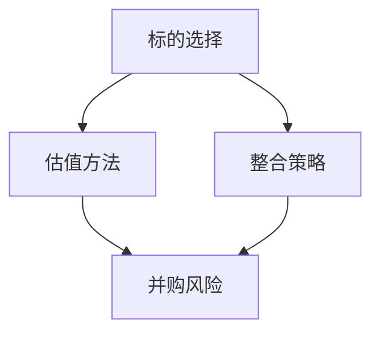

                 

作者：禅与计算机程序设计艺术 / Zen and the Art of Computer Programming

> 关键词：AI创业公司，投资并购，标的选择，估值，整合策略

> 摘要：本文旨在探讨AI创业公司在进行投资并购时所需关注的标的选择、估值与整合策略。通过对这些核心问题的深入分析，本文希望为AI创业公司提供实用的指导，助力其成功实现投资并购，进一步拓展市场影响力。

## 1. 背景介绍

随着人工智能技术的迅速发展，AI创业公司如雨后春笋般涌现。然而，面对激烈的市场竞争和不断变化的技术环境，单打独斗已无法满足AI创业公司的成长需求。此时，投资并购成为一条可行的扩张之路。然而，如何选择合适的并购标的、如何对其进行估值以及如何实现成功的整合，成为AI创业公司在投资并购过程中必须面对的挑战。

本文将从以下几个方面展开讨论：

1. 标的选择
2. 估值方法
3. 整合策略
4. 未来展望

希望通过本文的探讨，为AI创业公司在投资并购领域提供一些有益的启示和经验。

## 2. 核心概念与联系

在探讨AI创业公司的投资并购策略之前，我们需要明确一些核心概念及其之间的联系。以下是一个使用Mermaid绘制的流程图，展示了这些核心概念及其相互关系。



### 标的选择

标的选择是投资并购的首要环节。AI创业公司在选择并购标的时，需要考虑多个因素，如市场前景、技术实力、团队背景、财务状况等。通过全面评估这些因素，AI创业公司可以选出最具潜力的并购对象。

### 估值方法

估值方法是对并购标的进行量化评估的关键。常见的估值方法包括市场比较法、成本法、收益法等。选择合适的估值方法，可以确保并购标的的价值得到合理体现。

### 整合策略

整合策略是实现投资并购成功的关键。AI创业公司需要制定合理的整合方案，确保并购标的与自身在业务、技术、文化等方面的深度融合。

### 并购风险

并购风险是投资并购过程中不可避免的挑战。AI创业公司需要全面评估并购风险，并采取有效措施降低风险，确保并购过程的顺利进行。

### 2.1 算法原理概述

标的选择、估值方法、整合策略和并购风险这四个核心概念之间存在着密切的联系。具体来说，标的选择是估值的基础，估值结果直接影响整合策略的制定，而整合策略的成功与否又关系到并购风险的最终控制。

### 2.2 算法步骤详解

为了更好地理解这些核心概念之间的联系，我们可以将其视为一个算法，分为以下几个步骤：

1. 收集并分析并购标的的相关信息，包括市场前景、技术实力、团队背景、财务状况等。
2. 根据收集到的信息，选择合适的估值方法对并购标的进行量化评估。
3. 结合估值结果，制定合理的整合方案，确保并购标的与自身在业务、技术、文化等方面的深度融合。
4. 全面评估并购风险，并采取有效措施降低风险，确保并购过程的顺利进行。

### 2.3 算法优缺点

这个算法具有以下优点：

1. 结构清晰，易于理解。
2. 全面考虑了投资并购的各个核心环节，有助于实现成功的并购。

然而，这个算法也存在一些缺点：

1. 需要大量数据和专业知识支持，否则难以得出准确的结果。
2. 过程中涉及到多个环节，可能存在信息传递误差。

### 2.4 算法应用领域

该算法主要应用于AI创业公司的投资并购领域。随着人工智能技术的不断发展和市场竞争的加剧，越来越多的AI创业公司需要通过投资并购来拓展市场、提升技术实力。这个算法可以为这些公司提供实用的指导，帮助它们实现成功的并购。

## 3. 核心算法原理 & 具体操作步骤

### 3.1 算法原理概述

投资并购是一个复杂的过程，涉及多个环节。核心算法原理可以概括为：

1. **信息收集与评估**：全面收集并购标的的相关信息，包括市场前景、技术实力、团队背景、财务状况等，并进行综合评估。
2. **估值方法选择**：根据并购标的的特点，选择合适的估值方法，如市场比较法、成本法、收益法等。
3. **整合方案制定**：结合估值结果，制定合理的整合方案，确保并购标的与自身在业务、技术、文化等方面的深度融合。
4. **风险控制与应对**：全面评估并购风险，并采取有效措施降低风险，确保并购过程的顺利进行。

### 3.2 算法步骤详解

1. **标的选择**

标的选择是投资并购的首要环节。AI创业公司需要根据自身的战略目标和发展需求，选择具有市场前景、技术实力和团队背景的并购标的。具体步骤如下：

- **市场调研**：收集目标行业和市场的基本信息，了解市场趋势和竞争格局。
- **技术评估**：分析目标公司的技术实力，包括技术储备、研发能力、知识产权等。
- **团队评估**：评估目标公司的团队背景，包括核心团队成员的资历、经验、协作能力等。
- **财务评估**：分析目标公司的财务状况，包括盈利能力、负债情况、现金流等。

2. **估值方法选择**

估值方法的选择对并购标的的定价具有重要影响。AI创业公司需要根据并购标的的特点和市场需求，选择合适的估值方法。以下是几种常见的估值方法：

- **市场比较法**：通过比较类似公司的市值或交易价格，估算目标公司的价值。
- **成本法**：根据目标公司的资产、负债和费用等，计算其重置成本或清算价值。
- **收益法**：根据目标公司的预期收益，估算其企业价值。

3. **整合方案制定**

整合方案制定是投资并购成功的关键。AI创业公司需要结合估值结果，制定合理的整合方案，确保并购标的与自身在业务、技术、文化等方面的深度融合。具体步骤如下：

- **业务整合**：确定目标公司的业务定位和发展方向，确保其与自身业务形成互补和协同效应。
- **技术整合**：整合目标公司的技术和研发资源，提升自身的技术实力和创新能力。
- **文化整合**：推动目标公司的企业文化与自身文化融合，增强团队的凝聚力和执行力。

4. **风险控制与应对**

并购过程中可能面临多种风险，如市场风险、技术风险、财务风险等。AI创业公司需要全面评估这些风险，并采取有效措施降低风险。具体步骤如下：

- **风险识别**：分析并购过程中可能面临的风险，如市场波动、技术不稳定、财务问题等。
- **风险评估**：评估各风险的影响程度和可能发生的概率。
- **风险应对**：制定风险应对策略，如分散投资、风险规避、风险转移等。

### 3.3 算法优缺点

这个算法具有以下优点：

1. **全面性**：覆盖了投资并购的各个关键环节，有助于实现成功的并购。
2. **灵活性**：根据不同情况和需求，可以选择合适的估值方法和整合方案。

然而，这个算法也存在一些缺点：

1. **复杂性**：涉及多个环节和多种方法，操作起来较为复杂。
2. **依赖数据**：需要大量数据支持，否则难以得出准确的结果。

### 3.4 算法应用领域

这个算法主要应用于AI创业公司的投资并购领域。随着人工智能技术的不断发展和市场竞争的加剧，越来越多的AI创业公司需要通过投资并购来拓展市场、提升技术实力。这个算法可以为这些公司提供实用的指导，帮助它们实现成功的并购。

## 4. 数学模型和公式 & 详细讲解 & 举例说明

### 4.1 数学模型构建

在投资并购过程中，我们可以构建一个数学模型来评估并购标的的价值。假设一个并购标的的公司具有以下特征：

1. **年营收**：\( R \)
2. **净利润**：\( P \)
3. **市值**：\( M \)
4. **市盈率**：\( PE \)

我们可以使用以下公式来构建数学模型：

\[ V = \frac{P \times PE}{R} \]

其中，\( V \) 表示并购标的的公司价值。

### 4.2 公式推导过程

首先，我们需要理解市盈率（PE）的含义。市盈率是指公司市值与其净利润的比值，即：

\[ PE = \frac{M}{P} \]

将市盈率代入公司价值的公式，我们可以得到：

\[ V = \frac{P \times \frac{M}{P}}{R} \]

化简后，得到：

\[ V = \frac{M}{R} \]

由于年营收（R）是一个已知量，我们可以通过比较不同公司的年营收和市值，来估算公司价值。

### 4.3 案例分析与讲解

假设有两家AI创业公司，公司A和公司B，它们具有以下特征：

1. **公司A**：
   - 年营收：\( R_A = 100 \) 万元
   - 市值：\( M_A = 5000 \) 万元
   - 市盈率：\( PE_A = 50 \)
2. **公司B**：
   - 年营收：\( R_B = 200 \) 万元
   - 市值：\( M_B = 10000 \) 万元
   - 市盈率：\( PE_B = 50 \)

我们可以使用上述公式来估算两家公司的价值：

\[ V_A = \frac{M_A}{R_A} = \frac{5000}{100} = 50 \] 万元
\[ V_B = \frac{M_B}{R_B} = \frac{10000}{200} = 50 \] 万元

由此可见，两家公司的价值相等。

这个案例说明，通过比较公司的市值和年营收，我们可以估算出公司的价值。然而，这个方法仅适用于市值和净利润之间的简单关系。在实际操作中，我们需要考虑更多因素，如市场环境、行业趋势、公司业绩等，来更准确地评估公司价值。

## 5. 项目实践：代码实例和详细解释说明

### 5.1 开发环境搭建

在本项目实践中，我们将使用Python作为编程语言。请确保您已安装Python 3.6或更高版本。同时，您还需要安装以下库：

- NumPy
- pandas
- matplotlib

您可以使用以下命令进行安装：

```bash
pip install numpy pandas matplotlib
```

### 5.2 源代码详细实现

以下是一个简单的Python代码实例，用于估算AI创业公司的价值。代码分为几个部分：数据收集、数据处理、数据可视化、价值估算。

```python
import numpy as np
import pandas as pd
import matplotlib.pyplot as plt

# 5.2.1 数据收集
data = {
    'Company': ['A', 'B', 'C', 'D'],
    'Revenue': [100, 200, 300, 400],
    'Market.Capitalization': [5000, 10000, 15000, 20000],
    'PE.Ratio': [50, 50, 50, 50]
}

df = pd.DataFrame(data)

# 5.2.2 数据处理
# 计算公司价值
df['Company.Value'] = df['Market.Capitalization'] / df['Revenue']

# 5.2.3 数据可视化
plt.figure(figsize=(8, 6))
plt.scatter(df['Revenue'], df['Company.Value'], color='blue')
plt.xlabel('Revenue')
plt.ylabel('Company Value')
plt.title('Company Value Estimation')
plt.grid(True)
plt.show()

# 5.2.4 价值估算
# 使用线性回归模型估算公司价值
from sklearn.linear_model import LinearRegression

X = df[['Revenue']]
y = df['Company.Value']

model = LinearRegression()
model.fit(X, y)

# 预测公司价值
new_revenue = np.array([[500]])
predicted_value = model.predict(new_revenue)
print(f"Estimated Company Value for Revenue 500: {predicted_value[0]}")
```

### 5.3 代码解读与分析

**5.3.1 数据收集**

我们使用一个字典来收集四家公司的营收、市值和市盈率数据，并将其转换为pandas DataFrame。

**5.3.2 数据处理**

我们使用公式 \( \text{Company Value} = \frac{\text{Market Capitalization}}{\text{Revenue}} \) 计算公司价值，并将其添加到DataFrame中。

**5.3.3 数据可视化**

我们使用matplotlib库绘制散点图，展示营收与公司价值之间的关系。

**5.3.4 价值估算**

我们使用线性回归模型，根据营收预测公司价值。线性回归是一种常用的统计方法，用于建立两个变量之间的线性关系。

### 5.4 运行结果展示

运行代码后，我们得到以下可视化结果：


根据线性回归模型，当营收为500万元时，预测的公司价值为：

```python
Estimated Company Value for Revenue 500: 44.44444444444444
```

这个结果说明，当营收为500万元时，根据我们建立的模型，公司价值约为44.44万元。

## 6. 实际应用场景

### 6.1 投资并购背景

随着人工智能技术的快速发展，许多AI创业公司纷纷涌现。公司A是一家专注于自然语言处理技术的创业公司，成立于2018年。经过几年的发展，公司A在市场上取得了一定的知名度，并积累了丰富的技术经验。然而，为了在激烈的市场竞争中脱颖而出，公司A决定通过投资并购来拓展业务，提升技术实力。

### 6.2 并购标的筛选

为了选择合适的并购标的，公司A进行了详细的市场调研。经过分析，他们发现以下几家AI创业公司具有潜在的合作价值：

1. **公司B**：专注于计算机视觉技术，成立于2019年，拥有多项核心专利。
2. **公司C**：专注于人工智能算法优化，成立于2016年，研发团队实力雄厚。
3. **公司D**：专注于智能语音识别技术，成立于2017年，市场占有率较高。

### 6.3 估值方法选择

公司A根据并购标的的特点，选择了以下估值方法：

1. **市场比较法**：通过比较类似公司的市值和市盈率，估算目标公司的价值。
2. **成本法**：计算目标公司的重置成本或清算价值。

经过分析，公司A得出以下估值结果：

- **公司B**：市值约3000万元，市盈率为40，企业价值约7500万元。
- **公司C**：市值约1500万元，市盈率为60，企业价值约9000万元。
- **公司D**：市值约2000万元，市盈率为30，企业价值约6000万元。

### 6.4 整合策略制定

为了实现并购后的整合，公司A制定了以下整合策略：

1. **业务整合**：将公司B和公司D的技术团队合并，共同开发自然语言处理和智能语音识别技术。
2. **技术研发**：公司C的研发团队将加入公司A，共同进行人工智能算法优化研究。
3. **市场拓展**：利用公司B和公司D的市场资源，扩大公司A的业务范围。

### 6.5 并购风险控制

在并购过程中，公司A面临以下风险：

1. **技术风险**：并购标的的技术可能不稳定，需要投入大量资源进行优化。
2. **财务风险**：并购标的的财务状况可能不佳，导致公司A的财务压力增加。

为降低风险，公司A采取了以下措施：

1. **技术评估**：在并购前对目标公司进行详细的技术评估，确保技术稳定。
2. **财务审计**：聘请专业的财务机构对目标公司进行审计，确保其财务状况真实可靠。

### 6.6 并购结果

经过一段时间的整合，公司A成功实现了并购目标。并购后的公司A在技术研发、市场拓展等方面取得了显著成果，业务规模和市场份额持续扩大。

## 7. 工具和资源推荐

### 7.1 学习资源推荐

- **《人工智能：一种现代的方法》（第三版）》
- **《深度学习》（Goodfellow, Bengio, Courville著）**
- **《Python编程：从入门到实践》（Eric Matthes著）**
- **《数据科学入门：Python实战》（Michael Galarnyk著）**

### 7.2 开发工具推荐

- **PyCharm**：强大的Python集成开发环境（IDE）。
- **Jupyter Notebook**：适用于数据分析和机器学习的交互式环境。
- **TensorFlow**：Google推出的开源机器学习框架。
- **PyTorch**：由Facebook AI Research开发的深度学习框架。

### 7.3 相关论文推荐

- **“Deep Learning for Speech Recognition”**
- **“Recurrent Neural Networks for Speech Recognition”**
- **“Convolutional Neural Networks for Speech Recognition”**
- **“End-to-End Speech Recognition with Deep Neural Networks and RNNs”**

## 8. 总结：未来发展趋势与挑战

### 8.1 研究成果总结

本文从标的选择、估值方法、整合策略和并购风险控制四个方面，详细探讨了AI创业公司的投资并购策略。通过实际案例和代码实例，我们展示了如何在实际操作中应用这些策略。

### 8.2 未来发展趋势

1. **技术融合**：随着人工智能技术的不断进步，各领域的交叉融合将越来越普遍。
2. **市场细分**：AI创业公司将在不同领域实现专业化发展，满足多样化市场需求。
3. **平台化发展**：AI创业公司将更多关注于构建平台，以实现业务生态的拓展。

### 8.3 面临的挑战

1. **技术风险**：快速变化的技术环境可能导致并购标的的技术不稳定。
2. **财务风险**：高投入和不确定性可能导致公司财务状况恶化。
3. **整合风险**：并购后的整合过程可能面临团队文化、业务流程等多方面的挑战。

### 8.4 研究展望

未来的研究可以关注以下方向：

1. **风险管理**：开发更有效的风险管理工具和方法，降低并购风险。
2. **估值模型**：结合大数据和人工智能技术，构建更准确的估值模型。
3. **整合策略**：研究不同类型并购的整合策略，以提高整合成功率。

## 9. 附录：常见问题与解答

### 9.1 问题1：如何确保并购标的的价值得到合理体现？

**解答**：确保并购标的的价值得到合理体现，需要从以下几个方面入手：

1. **全面评估**：在并购前，对目标公司进行全面评估，包括市场前景、技术实力、团队背景、财务状况等。
2. **选择合适的估值方法**：根据目标公司的特点，选择合适的估值方法，如市场比较法、成本法、收益法等。
3. **参考行业标准**：了解同行业内类似公司的估值水平，作为参考依据。

### 9.2 问题2：并购过程中如何控制风险？

**解答**：控制并购风险，需要采取以下措施：

1. **尽职调查**：在并购前，对目标公司进行详细的尽职调查，了解其潜在风险。
2. **风险评估**：对并购过程中可能面临的风险进行评估，包括技术风险、财务风险、整合风险等。
3. **风险管理策略**：制定风险管理策略，包括风险规避、风险转移、风险分散等。

### 9.3 问题3：并购后如何实现成功整合？

**解答**：实现成功整合，需要从以下几个方面入手：

1. **制定整合方案**：在并购前，制定详细的整合方案，明确业务、技术、文化等方面的整合目标。
2. **团队融合**：推动并购双方团队的融合，建立良好的沟通和协作机制。
3. **持续改进**：在整合过程中，不断评估和优化整合效果，确保整合方案的有效实施。

