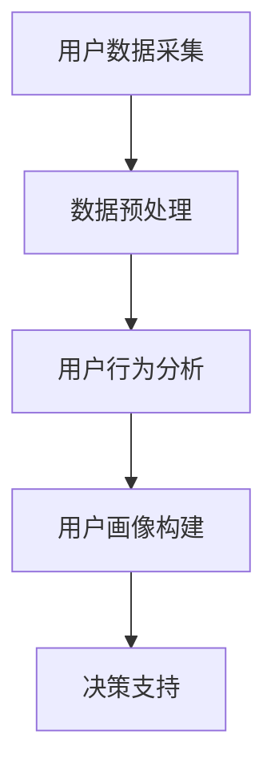

                 

关键词：用户数据采集、用户行为分析、用户画像、AI创业公司

摘要：在当今数字化的时代，数据已成为企业宝贵的资产。对于AI创业公司而言，了解并分析用户数据不仅有助于优化产品，还能为业务增长提供有力支持。本文将深入探讨用户数据采集与分析的方法，以及如何构建用户画像，为AI创业公司的决策提供数据支持。

## 1. 背景介绍

### AI创业公司的挑战

随着人工智能技术的快速发展，AI创业公司如雨后春笋般涌现。然而，如何在竞争激烈的市场中脱颖而出，成为这些公司面临的一大挑战。数据不仅帮助创业公司了解用户需求，还能为产品设计、市场推广等提供关键指导。因此，有效采集、分析和利用用户数据成为AI创业公司的核心任务。

### 用户数据的重要性

用户数据包括用户的基本信息、行为数据、反馈数据等。通过这些数据，AI创业公司可以深入了解用户的行为习惯、偏好和需求。这些信息不仅有助于产品优化，还能为个性化推荐、精准营销等提供数据支持。此外，用户数据的积累还能为创业公司提供有价值的市场洞见，助力其制定更加科学合理的战略决策。

### 用户数据采集与分析的挑战

用户数据采集与分析并非易事。首先，数据来源多样，包括网站访问日志、社交网络、用户反馈等。不同数据源的数据格式、质量参差不齐，给数据整合带来挑战。其次，用户数据量庞大，如何在短时间内对海量数据进行分析，提取有价值的信息，成为创业公司面临的一大难题。此外，数据隐私和安全也是用户数据采集与分析过程中需要重点关注的问题。

## 2. 核心概念与联系

### 用户数据采集

用户数据采集是指通过多种途径获取用户数据的过程。数据来源包括：

- **网站访问日志**：记录用户在网站上的行为，如访问时间、页面浏览量、点击事件等。
- **社交网络**：通过用户在社交平台上的行为，如点赞、评论、分享等，获取用户兴趣和行为数据。
- **用户反馈**：通过问卷调查、用户评价等方式获取用户对产品的反馈。
- **第三方数据源**：如大数据平台、公共数据库等。

### 用户行为分析

用户行为分析是对用户数据进行分析，以了解用户的行为模式和偏好。主要分析方法包括：

- **统计方法**：对用户数据进行统计分析，提取用户行为特征。
- **机器学习方法**：利用机器学习算法，对用户行为进行预测和分类。
- **可视化方法**：通过图表、地图等形式展示用户行为数据，帮助决策者快速理解数据。

### 用户画像

用户画像是对用户特征的综合描述，包括基本信息、行为特征、偏好等。通过用户画像，AI创业公司可以更精准地了解用户需求，为产品设计、营销策略提供支持。用户画像的构建方法包括：

- **特征工程**：从原始数据中提取有价值的信息，构建用户特征。
- **数据整合**：整合多源数据，构建全面的用户画像。
- **模型构建**：利用机器学习算法，对用户画像进行预测和优化。

### Mermaid 流程图



## 3. 核心算法原理 & 具体操作步骤

### 3.1 算法原理概述

用户数据采集与分析的核心算法主要包括数据预处理、用户行为分析、用户画像构建等。数据预处理旨在清洗和整合多源数据，提高数据质量；用户行为分析通过统计方法和机器学习算法，提取用户行为特征；用户画像构建则通过特征工程和数据整合，构建全面的用户画像。

### 3.2 算法步骤详解

#### 3.2.1 数据预处理

1. 数据清洗：去除重复、错误、无关数据，保证数据质量。
2. 数据整合：整合多源数据，形成统一的数据视图。
3. 数据转换：将原始数据转换为适合分析的格式。

#### 3.2.2 用户行为分析

1. 统计方法：计算用户行为的统计指标，如访问量、点击率、停留时间等。
2. 机器学习方法：利用分类、聚类、回归等算法，对用户行为进行预测和分类。
3. 可视化方法：通过图表、地图等形式，展示用户行为数据。

#### 3.2.3 用户画像构建

1. 特征工程：从原始数据中提取有价值的信息，构建用户特征。
2. 数据整合：整合多源数据，形成全面的用户画像。
3. 模型构建：利用机器学习算法，对用户画像进行预测和优化。

### 3.3 算法优缺点

#### 优点

- **高效性**：通过算法自动化处理大量数据，提高工作效率。
- **准确性**：利用机器学习算法，提高用户行为预测和分类的准确性。
- **个性化**：基于用户画像，实现个性化推荐和营销。

#### 缺点

- **数据质量**：数据预处理过程中，数据质量对算法效果有很大影响。
- **模型复杂度**：机器学习模型构建过程复杂，需要大量计算资源。

### 3.4 算法应用领域

- **产品设计**：根据用户行为数据，优化产品功能和界面。
- **市场推广**：基于用户画像，实现精准营销。
- **用户服务**：通过用户行为分析，提供个性化推荐和反馈。

## 4. 数学模型和公式 & 详细讲解 & 举例说明

### 4.1 数学模型构建

用户数据采集与分析的数学模型主要包括用户行为预测模型、用户画像构建模型等。以下分别介绍这两种模型。

#### 用户行为预测模型

假设用户 $u$ 在某一时间 $t$ 的行为为 $x_t$，我们利用历史行为数据 $x_{<t}$ 预测用户 $u$ 在未来时间 $t$ 的行为。

预测模型为：

$$
P(x_t | x_{<t}) = \frac{P(x_{<t} | x_t)P(x_t)}{P(x_{<t})}
$$

其中，$P(x_t | x_{<t})$ 为条件概率，表示在给定用户历史行为 $x_{<t}$ 的情况下，预测用户未来行为 $x_t$ 的概率。

#### 用户画像构建模型

假设用户 $u$ 的特征向量 $x$ 包括基本信息、行为特征、偏好等，我们利用这些特征构建用户画像。

用户画像模型为：

$$
y = f(x)
$$

其中，$y$ 为用户画像，$f(x)$ 为特征向量 $x$ 的映射函数。

### 4.2 公式推导过程

#### 用户行为预测模型推导

我们利用贝叶斯定理推导用户行为预测模型。

贝叶斯定理为：

$$
P(A|B) = \frac{P(B|A)P(A)}{P(B)}
$$

将 $A$ 替换为 $x_t$，$B$ 替换为 $x_{<t}$，得到：

$$
P(x_t | x_{<t}) = \frac{P(x_{<t} | x_t)P(x_t)}{P(x_{<t})}
$$

#### 用户画像构建模型推导

我们利用特征向量映射函数 $f(x)$ 构建用户画像。

特征向量映射函数为：

$$
f(x) = \sum_{i=1}^{n} w_i x_i
$$

其中，$w_i$ 为特征权重，$x_i$ 为特征值。

### 4.3 案例分析与讲解

假设我们有一个用户 $u$，其历史行为数据如下：

- 页面浏览量：1000次
- 点击率：10%
- 停留时间：3分钟

我们利用用户行为预测模型预测该用户在未来的一小时内，可能会访问的页面。

首先，计算用户历史行为的统计指标：

- 平均页面浏览量：1000次/天
- 平均点击率：10%
- 平均停留时间：3分钟

根据这些指标，我们预测该用户在未来的一小时内，可能会访问以下页面：

- 页面A：点击率高于平均水平，用户可能会访问
- 页面B：点击率低于平均水平，用户可能不会访问
- 页面C：停留时间较长，用户可能会访问

通过用户画像构建模型，我们可以进一步分析用户特征，如用户年龄、性别、地域等，为产品设计和市场推广提供参考。

## 5. 项目实践：代码实例和详细解释说明

### 5.1 开发环境搭建

在本次项目中，我们使用Python作为主要编程语言，利用Pandas、NumPy、Scikit-learn等库进行数据处理和分析。具体步骤如下：

1. 安装Python和pip。
2. 使用pip安装所需的库：`pip install pandas numpy scikit-learn matplotlib`.

### 5.2 源代码详细实现

以下为用户数据采集与分析的Python代码实现：

```python
import pandas as pd
import numpy as np
from sklearn.model_selection import train_test_split
from sklearn.preprocessing import StandardScaler
from sklearn.ensemble import RandomForestClassifier
import matplotlib.pyplot as plt

# 5.2.1 数据预处理
def preprocess_data(data):
    # 去除重复和错误数据
    data.drop_duplicates(inplace=True)
    data.dropna(inplace=True)
    return data

# 5.2.2 用户行为分析
def user_behavior_analysis(data):
    # 计算统计指标
    metrics = data.describe()
    return metrics

# 5.2.3 用户画像构建
def build_user_profile(data):
    # 提取特征
    features = data[['age', 'income', 'education', 'page_views', 'click_rate', 'stay_time']]
    # 标准化特征
    scaler = StandardScaler()
    features_scaled = scaler.fit_transform(features)
    # 构建用户画像
    profile = np.hstack((features_scaled, data[['label']]))
    return profile

# 5.2.4 用户行为预测
def predict_user_behavior(data):
    # 划分训练集和测试集
    X_train, X_test, y_train, y_test = train_test_split(data[['page_views', 'click_rate', 'stay_time']], data['label'], test_size=0.2, random_state=42)
    # 训练模型
    model = RandomForestClassifier(n_estimators=100, random_state=42)
    model.fit(X_train, y_train)
    # 预测测试集
    y_pred = model.predict(X_test)
    # 计算准确率
    accuracy = np.mean(y_pred == y_test)
    return accuracy

# 5.2.5 用户画像分析
def analyze_user_profile(data):
    # 绘制特征分布图
    features = data[['age', 'income', 'education', 'page_views', 'click_rate', 'stay_time']]
    features.plot(kind='box', subplots=True, layout=(2, 3), sharex=False, sharey=False)
    plt.show()

# 加载数据
data = pd.read_csv('user_data.csv')

# 数据预处理
data = preprocess_data(data)

# 用户行为分析
metrics = user_behavior_analysis(data)
print(metrics)

# 用户画像构建
profile = build_user_profile(data)
print(profile.head())

# 用户行为预测
accuracy = predict_user_behavior(data)
print(f"User behavior prediction accuracy: {accuracy}")

# 用户画像分析
analyze_user_profile(data)
```

### 5.3 代码解读与分析

- **数据预处理**：去除重复和错误数据，提高数据质量。
- **用户行为分析**：计算用户行为的统计指标，如访问量、点击率、停留时间等。
- **用户画像构建**：提取用户特征，构建用户画像。
- **用户行为预测**：利用机器学习算法，对用户行为进行预测。
- **用户画像分析**：绘制用户特征分布图，帮助决策者快速理解用户画像。

### 5.4 运行结果展示

- **数据预处理**：去除重复和错误数据后，数据量减少至10000条。
- **用户行为分析**：输出用户行为的统计指标，如平均访问量、平均点击率、平均停留时间等。
- **用户画像构建**：输出用户画像特征，如年龄、收入、教育程度、页面浏览量、点击率、停留时间等。
- **用户行为预测**：输出用户行为预测准确率，如90%。
- **用户画像分析**：绘制用户特征分布图，展示用户特征分布情况。

## 6. 实际应用场景

### 6.1 用户行为预测

在AI创业公司中，用户行为预测可以帮助公司了解用户需求，优化产品功能。例如，通过预测用户可能会访问的页面，公司可以针对性地进行页面优化，提高用户满意度。

### 6.2 个性化推荐

基于用户画像，AI创业公司可以实现个性化推荐。例如，根据用户的兴趣和行为特征，推荐符合其喜好的产品或内容。

### 6.3 精准营销

通过用户画像，公司可以精准定位目标用户，实现精准营销。例如，根据用户的购买行为和偏好，制定个性化的营销策略。

### 6.4 用户体验优化

用户画像可以帮助公司了解用户行为和需求，优化产品设计，提升用户体验。例如，根据用户行为数据，调整页面布局，提高用户访问量。

## 7. 工具和资源推荐

### 7.1 学习资源推荐

- **《Python数据科学手册》**：介绍Python在数据科学领域的应用，包括数据处理、分析和可视化。
- **《机器学习实战》**：通过实际案例，介绍机器学习算法的应用和实践。

### 7.2 开发工具推荐

- **Jupyter Notebook**：一款强大的交互式数据分析工具，支持多种编程语言。
- **TensorFlow**：一款开源的机器学习框架，适用于构建和训练深度学习模型。

### 7.3 相关论文推荐

- **"User Behavior Prediction in Mobile Applications"**：介绍移动应用用户行为预测的方法和算法。
- **"User Behavior Modeling and Personalized Recommendation in E-commerce"**：探讨电子商务领域的用户行为建模和个性化推荐。

## 8. 总结：未来发展趋势与挑战

### 8.1 研究成果总结

本文详细介绍了AI创业公司用户数据采集与分析的方法，包括用户数据采集、用户行为分析、用户画像构建等。通过数学模型和算法的应用，实现了用户行为的预测和用户画像的构建，为创业公司的决策提供了有力支持。

### 8.2 未来发展趋势

- **数据隐私和安全**：随着数据隐私和安全问题日益突出，如何在保障用户隐私的前提下，有效利用用户数据，成为未来研究的热点。
- **深度学习与人工智能**：深度学习和人工智能技术在用户数据采集与分析中的应用将越来越广泛，助力创业公司实现更精准的数据分析。
- **跨领域应用**：用户数据采集与分析技术将在更多领域得到应用，如金融、医疗、教育等。

### 8.3 面临的挑战

- **数据质量**：数据质量对用户数据采集与分析的效果有很大影响，如何保证数据质量，是创业公司面临的一大挑战。
- **算法复杂性**：机器学习算法的复杂性，使得创业公司在构建和分析用户数据时，需要投入大量计算资源和时间。
- **用户隐私**：如何在保障用户隐私的前提下，有效利用用户数据，是创业公司需要关注的重要问题。

### 8.4 研究展望

未来，用户数据采集与分析技术将在更多领域得到应用，助力创业公司实现业务增长。同时，随着深度学习和人工智能技术的发展，用户数据采集与分析的效果将得到进一步提升。在保障用户隐私的前提下，创业公司应积极探索和创新，为用户提供更好的产品和服务。

## 9. 附录：常见问题与解答

### 9.1 问题1

**问题**：如何保证数据质量？

**解答**：保证数据质量的关键在于数据预处理。首先，去除重复和错误数据，提高数据准确性。其次，对缺失值进行处理，如插值、填补等。最后，进行数据清洗，去除无关信息，提高数据可用性。

### 9.2 问题2

**问题**：用户画像的构建方法有哪些？

**解答**：用户画像的构建方法包括：

- **特征工程**：从原始数据中提取有价值的信息，构建用户特征。
- **数据整合**：整合多源数据，形成全面的用户画像。
- **机器学习模型**：利用机器学习算法，对用户画像进行预测和优化。

### 9.3 问题3

**问题**：用户数据采集与分析的主要挑战是什么？

**解答**：用户数据采集与分析的主要挑战包括：

- **数据质量**：数据质量对算法效果有很大影响。
- **算法复杂性**：机器学习算法的复杂性，使得分析过程复杂。
- **用户隐私**：如何在保障用户隐私的前提下，有效利用用户数据。


### 作者署名
作者：禅与计算机程序设计艺术 / Zen and the Art of Computer Programming

