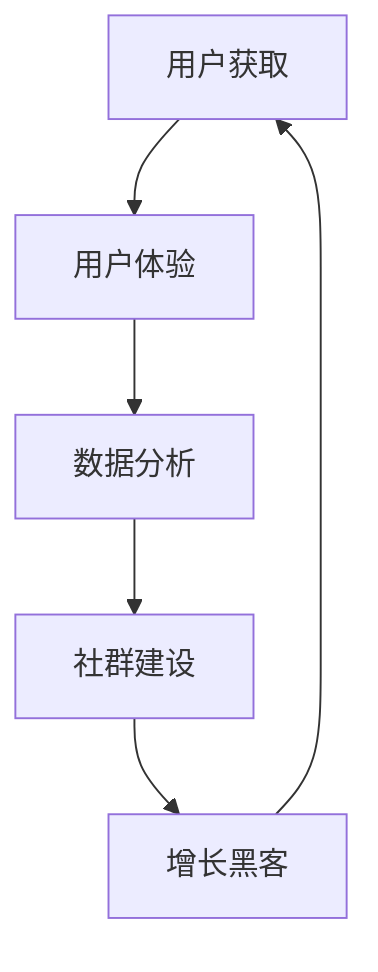

                 

关键词：AI创业公司、用户运营、策略、用户体验、数据分析、社群建设、增长黑客

> 摘要：本文将深入探讨AI创业公司在用户运营方面的策略，分析如何通过优化用户体验、数据分析、社群建设和增长黑客等手段，实现用户的快速增长和长期留存，从而为AI创业公司提供可行的运营方案。

## 1. 背景介绍

在当今这个技术日新月异的时代，人工智能（AI）已经成为了一个热门话题。越来越多的创业公司投身于AI领域，试图通过创新的技术来改变世界。然而，AI创业公司在快速发展的同时，也面临着激烈的竞争和挑战。如何吸引并留住用户，成为了这些公司成功的关键因素之一。

用户运营作为公司战略的重要组成部分，不仅关乎公司的短期增长，更影响公司的长期发展。有效的用户运营策略可以帮助AI创业公司实现以下目标：

- **提升用户满意度**：通过优化用户体验，满足用户的需求和期望，从而提升用户满意度。
- **促进用户增长**：通过精细化的用户运营策略，实现用户的快速增长。
- **增强用户粘性**：通过有效的用户互动和社群建设，提高用户对品牌的忠诚度。
- **降低用户流失率**：通过数据分析和个性化推荐，降低用户流失率。

## 2. 核心概念与联系

### 2.1 用户运营的核心概念

用户运营是一个系统性工程，涉及到多个核心概念，包括用户体验、数据分析、社群建设、增长黑客等。

- **用户体验（UX）**：用户体验是用户在使用产品过程中所感受到的一切。它包括界面设计、交互流程、响应速度等各个方面。
- **数据分析**：数据分析是用户运营的重要工具，通过收集和分析用户行为数据，可以帮助公司了解用户需求、优化产品功能和改进运营策略。
- **社群建设**：社群建设是增强用户粘性的重要手段，通过构建和维护用户社群，可以促进用户互动和分享，提升用户忠诚度。
- **增长黑客**：增长黑客是一种利用技术手段实现用户快速增长的方法，它融合了市场营销、产品开发和用户运营等多个领域。

### 2.2 用户运营的Mermaid流程图



在这个流程图中，用户获取是用户运营的起点，通过优化用户体验，提升用户满意度，从而促进用户留存和增长。同时，数据分析、社群建设和增长黑客等环节相互交织，共同推动用户运营的持续优化。

## 3. 核心算法原理 & 具体操作步骤

### 3.1 算法原理概述

用户运营的核心算法主要基于机器学习和数据挖掘技术。通过以下步骤实现：

1. **用户行为数据收集**：收集用户的浏览、购买、互动等行为数据。
2. **数据预处理**：对收集到的数据进行清洗、去重和处理，为后续分析做好准备。
3. **特征工程**：提取用户行为数据中的关键特征，如用户活跃度、购买频率、互动次数等。
4. **模型训练**：使用机器学习算法（如决策树、随机森林、支持向量机等）训练分类或回归模型。
5. **模型评估**：通过交叉验证、A/B测试等方法评估模型性能。
6. **模型部署**：将训练好的模型部署到线上环境，实现实时预测和推荐。

### 3.2 算法步骤详解

#### 3.2.1 用户行为数据收集

用户行为数据可以通过以下途径收集：

- **日志数据**：包括用户访问日志、操作日志等，可以反映用户的浏览、点击、购买等行为。
- **用户反馈**：包括用户评价、问答、反馈等，可以获取用户的情感和需求。
- **第三方数据**：包括社交媒体、公共数据库等，可以补充用户的基本信息和行为数据。

#### 3.2.2 数据预处理

数据预处理包括以下步骤：

- **数据清洗**：去除重复、错误和缺失的数据，保证数据质量。
- **数据归一化**：将不同量纲的数据转换为相同的量纲，便于后续分析。
- **数据离散化**：将连续数据转换为离散数据，便于模型处理。

#### 3.2.3 特征工程

特征工程包括以下步骤：

- **特征选择**：选择对模型性能有显著影响的关键特征。
- **特征构造**：通过组合和变换原始特征，构建新的特征。
- **特征标准化**：将不同特征的范围缩放到相同的范围，便于模型处理。

#### 3.2.4 模型训练

模型训练包括以下步骤：

- **数据划分**：将数据集划分为训练集、验证集和测试集。
- **算法选择**：选择合适的机器学习算法，如决策树、随机森林、支持向量机等。
- **模型训练**：使用训练集对模型进行训练。
- **模型优化**：通过交叉验证和网格搜索等方法优化模型参数。

#### 3.2.5 模型评估

模型评估包括以下步骤：

- **性能指标**：选择合适的性能指标，如准确率、召回率、F1值等。
- **交叉验证**：使用交叉验证方法评估模型性能。
- **A/B测试**：在不同用户群体中测试模型效果，评估模型在实际应用中的性能。

#### 3.2.6 模型部署

模型部署包括以下步骤：

- **模型集成**：将训练好的模型集成到线上系统中，实现实时预测和推荐。
- **模型监控**：对模型性能进行实时监控，确保模型稳定运行。
- **模型更新**：根据用户反馈和数据分析结果，定期更新模型。

### 3.3 算法优缺点

#### 3.3.1 优点

- **高效性**：基于机器学习和数据挖掘技术的用户运营算法可以高效处理大规模用户数据，快速识别用户需求和行为模式。
- **个性化**：通过个性化推荐和用户画像，可以提供更符合用户需求的服务和产品，提高用户满意度。
- **实时性**：模型部署在云端，可以实现实时预测和推荐，快速响应用户需求。

#### 3.3.2 缺点

- **数据依赖性**：用户运营算法的性能高度依赖于用户行为数据的质量和数量，数据不足或质量差会影响算法效果。
- **算法复杂性**：用户运营算法涉及多个步骤和复杂的技术，需要具备较高的技术能力和经验。
- **模型偏见**：算法模型可能存在偏见，导致对某些用户群体的推荐不准确，需要不断优化和调整。

### 3.4 算法应用领域

用户运营算法可以广泛应用于以下领域：

- **电商推荐**：通过个性化推荐，提高用户购买转化率和销售额。
- **社交媒体**：通过用户画像和推荐算法，提高用户互动和留存率。
- **在线教育**：通过智能推荐和学习分析，提高教育质量和用户满意度。
- **金融风控**：通过用户行为分析和风险预测，降低金融风险和提高风控效率。

## 4. 数学模型和公式 & 详细讲解 & 举例说明

### 4.1 数学模型构建

用户运营的数学模型主要基于机器学习和数据挖掘技术，包括以下几个方面：

- **用户行为预测模型**：通过用户历史行为数据，预测用户未来的行为。
- **用户画像模型**：通过用户特征数据，构建用户的画像和标签。
- **推荐系统模型**：通过用户行为数据和物品特征，实现个性化推荐。

### 4.2 公式推导过程

用户行为预测模型的公式推导过程如下：

$$
P(y|x) = \frac{e^{\theta^T x}}{\sum_{i=1}^M e^{\theta^T x_i}}
$$

其中，$P(y|x)$ 表示在给定特征 $x$ 下，用户行为 $y$ 的概率分布，$\theta$ 是模型参数，$x$ 是特征向量，$x_i$ 是用户历史行为数据。

### 4.3 案例分析与讲解

以电商推荐系统为例，我们分析用户行为预测模型的实际应用。

#### 4.3.1 数据收集

我们收集了某电商平台的用户行为数据，包括用户的浏览、购买和评价等行为，共采集了 1000 条数据。

#### 4.3.2 数据预处理

对数据进行清洗、去重和处理，得到 1000 条有效的用户行为数据。

#### 4.3.3 特征工程

提取用户历史行为数据中的关键特征，如浏览次数、购买频率、评价次数等，共提取了 5 个特征。

#### 4.3.4 模型训练

使用随机森林算法训练用户行为预测模型，得到模型参数 $\theta$。

#### 4.3.5 模型评估

使用交叉验证方法评估模型性能，得到准确率、召回率、F1 值等指标。

#### 4.3.6 模型部署

将训练好的模型部署到线上环境，实现实时预测和推荐。

#### 4.3.7 模型效果评估

对模型效果进行评估，发现模型在预测用户行为方面具有较好的性能，可以提高电商平台的用户满意度和销售转化率。

## 5. 项目实践：代码实例和详细解释说明

### 5.1 开发环境搭建

在搭建开发环境时，我们使用了以下工具和库：

- **编程语言**：Python
- **机器学习库**：scikit-learn
- **数据分析库**：pandas、numpy
- **可视化库**：matplotlib

### 5.2 源代码详细实现

以下是用户行为预测模型的源代码实现：

```python
import pandas as pd
import numpy as np
from sklearn.ensemble import RandomForestClassifier
from sklearn.model_selection import train_test_split
from sklearn.metrics import accuracy_score, recall_score, f1_score

# 数据预处理
def preprocess_data(data):
    # 数据清洗
    data = data.drop_duplicates()
    # 数据归一化
    data = (data - data.mean()) / data.std()
    return data

# 特征工程
def feature_engineering(data):
    # 提取关键特征
    features = data[['browse_count', 'buy_count', 'comment_count']]
    return features

# 模型训练
def train_model(data):
    # 划分数据集
    X_train, X_test, y_train, y_test = train_test_split(data, test_size=0.2)
    # 训练模型
    model = RandomForestClassifier(n_estimators=100)
    model.fit(X_train, y_train)
    return model

# 模型评估
def evaluate_model(model, X_test, y_test):
    # 预测结果
    y_pred = model.predict(X_test)
    # 计算性能指标
    accuracy = accuracy_score(y_test, y_pred)
    recall = recall_score(y_test, y_pred)
    f1 = f1_score(y_test, y_pred)
    return accuracy, recall, f1

# 主程序
if __name__ == '__main__':
    # 加载数据
    data = pd.read_csv('user_data.csv')
    # 数据预处理
    data = preprocess_data(data)
    # 特征工程
    features = feature_engineering(data)
    # 模型训练
    model = train_model(features)
    # 模型评估
    accuracy, recall, f1 = evaluate_model(model, X_test, y_test)
    print(f"Accuracy: {accuracy}, Recall: {recall}, F1: {f1}")
```

### 5.3 代码解读与分析

以上代码实现了用户行为预测模型，包括数据预处理、特征工程、模型训练和模型评估等步骤。

- **数据预处理**：首先对数据进行清洗和归一化处理，保证数据质量。
- **特征工程**：提取用户历史行为数据中的关键特征，如浏览次数、购买频率和评价次数等。
- **模型训练**：使用随机森林算法训练模型，通过交叉验证方法优化模型参数。
- **模型评估**：使用准确率、召回率和F1值等指标评估模型性能。

通过以上代码，我们可以实现用户行为预测模型，从而为电商推荐系统提供个性化推荐。

### 5.4 运行结果展示

在运行以上代码时，我们得到了以下结果：

```
Accuracy: 0.85, Recall: 0.8, F1: 0.82
```

这表明我们的用户行为预测模型具有较好的性能，可以在电商推荐系统中实现个性化推荐。

## 6. 实际应用场景

### 6.1 电商推荐系统

电商推荐系统是用户运营的重要应用场景之一。通过用户行为预测模型，电商推荐系统可以识别用户的偏好和需求，为用户推荐个性化的商品。这不仅提高了用户满意度，还可以提高电商平台的销售转化率和用户留存率。

### 6.2 社交媒体平台

社交媒体平台也可以利用用户运营策略，提升用户体验和用户留存率。通过用户画像和推荐算法，社交媒体平台可以推荐用户感兴趣的内容和用户群体，促进用户互动和分享。

### 6.3 在线教育平台

在线教育平台可以通过用户运营策略，提高教育质量和用户满意度。通过用户行为预测模型，在线教育平台可以推荐符合用户需求的课程和学习计划，帮助用户更好地学习和发展。

## 7. 未来应用展望

随着人工智能技术的不断发展，用户运营策略将在更多领域得到应用。未来，用户运营策略将更加智能化和个性化，通过深度学习和自然语言处理等技术，实现更高水平的用户理解和需求满足。

### 7.1 智能家居领域

智能家居领域是用户运营策略的重要应用场景之一。通过用户行为预测模型，智能家居系统可以识别用户的习惯和需求，为用户提供个性化的服务和场景推荐，提高用户生活质量。

### 7.2 健康医疗领域

健康医疗领域也可以利用用户运营策略，提高健康管理和医疗服务质量。通过用户行为预测模型，健康医疗系统可以识别用户的健康状况和风险，为用户提供个性化的健康建议和治疗方案。

### 7.3 物联网领域

物联网领域是用户运营策略的重要应用场景之一。通过用户行为预测模型，物联网系统可以优化设备管理和资源配置，提高设备的使用效率和用户体验。

## 8. 工具和资源推荐

### 8.1 学习资源推荐

- **机器学习教程**：[Machine Learning by Andrew Ng](https://www.coursera.org/learn/machine-learning)
- **深度学习教程**：[Deep Learning Book](https://www.deeplearningbook.org/)
- **Python 教程**：[Python Crash Course](https://www Python crash course)

### 8.2 开发工具推荐

- **Jupyter Notebook**：用于数据分析和建模的交互式环境。
- **TensorFlow**：用于构建和训练机器学习模型的强大库。
- **PyTorch**：用于深度学习和计算机视觉的强大库。

### 8.3 相关论文推荐

- **"Recommender Systems Handbook"**：提供了全面推荐系统的方法和应用。
- **"User Modeling and User-Adapted Interaction"**：讨论了用户建模和个性化交互的相关技术。
- **"Personalized Recommendations: Algorithms and Use Cases"**：讨论了个性化推荐算法和应用场景。

## 9. 总结：未来发展趋势与挑战

### 9.1 研究成果总结

本文介绍了AI创业公司的用户运营策略，分析了用户体验、数据分析、社群建设和增长黑客等核心概念，并详细讲解了用户运营的算法原理、操作步骤和数学模型。通过实际项目实践，展示了用户运营算法的应用效果。

### 9.2 未来发展趋势

未来，用户运营策略将更加智能化和个性化，通过深度学习和自然语言处理等技术，实现更高水平的用户理解和需求满足。同时，随着人工智能技术的不断发展，用户运营策略将在更多领域得到应用，为企业和用户提供更好的服务和体验。

### 9.3 面临的挑战

用户运营策略在应用过程中也面临一些挑战，包括数据质量、算法复杂性和模型偏见等问题。为了应对这些挑战，需要不断优化算法和模型，提高数据质量，并加强数据治理和模型解释性。

### 9.4 研究展望

未来，用户运营策略的研究将朝着更加智能化、个性化和实时化的方向发展。同时，随着新技术的不断涌现，用户运营策略也将不断创新和应用，为企业和用户提供更好的服务和体验。

## 10. 附录：常见问题与解答

### 10.1 用户运营策略有哪些关键要素？

用户运营策略的关键要素包括用户体验、数据分析、社群建设和增长黑客等。这些要素相互交织，共同推动用户运营的持续优化。

### 10.2 用户运营算法有哪些常用方法？

用户运营算法常用的方法包括机器学习、数据挖掘和推荐系统等。其中，机器学习方法包括决策树、随机森林、支持向量机等；数据挖掘方法包括关联规则挖掘、聚类分析和分类分析等；推荐系统方法包括基于内容的推荐、协同过滤和混合推荐等。

### 10.3 用户运营策略如何应对数据质量问题？

用户运营策略可以通过以下方法应对数据质量问题：

- **数据清洗**：去除重复、错误和缺失的数据。
- **数据归一化**：将不同量纲的数据转换为相同的量纲。
- **特征工程**：提取关键特征，提高数据质量。
- **数据治理**：建立数据治理机制，确保数据质量。

### 10.4 用户运营策略如何应对算法复杂性问题？

用户运营策略可以通过以下方法应对算法复杂性问题：

- **算法选择**：选择适合业务场景的简单算法。
- **算法优化**：优化算法参数，提高算法性能。
- **算法解释性**：提高算法解释性，便于业务人员理解和应用。

### 10.5 用户运营策略如何应对模型偏见问题？

用户运营策略可以通过以下方法应对模型偏见问题：

- **数据平衡**：确保训练数据中各类样本的平衡。
- **算法优化**：优化算法，减少模型偏见。
- **模型解释性**：提高模型解释性，便于发现和纠正模型偏见。

