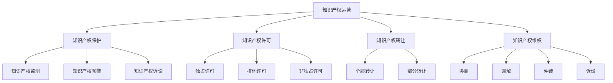

                 

 关键词：AI创业，知识产权，许可，转让，维权

> 摘要：本文旨在为AI创业公司提供全面的知识产权运营指南，包括知识产权的许可、转让与维权。通过对知识产权概念的理解，以及在实际运营中的应用，帮助创业公司更好地保护自身创新成果，实现知识产权的商业价值。

## 1. 背景介绍

随着人工智能技术的快速发展，越来越多的创业公司涌现出来，它们在技术创新、市场拓展等方面表现出极大的活力。然而，对于这些创业公司来说，知识产权的保护和运营显得尤为重要。知识产权不仅是公司的核心竞争力，也是公司价值的重要体现。然而，许多创业公司在知识产权方面缺乏经验和认识，导致知识产权得不到有效保护，甚至被侵权而不自知。

本文将从知识产权的基本概念出发，介绍知识产权的许可、转让与维权，并结合实际案例，为AI创业公司提供一些建议和策略。

## 2. 核心概念与联系

### 2.1 知识产权的定义

知识产权是指权利人对其所创作的智力劳动成果所享有的专有权利，通常包括著作权、专利权、商标权和商业秘密等。

### 2.2 知识产权的许可

知识产权的许可是指权利人授权他人在一定范围内使用其知识产权的行为。许可可以分为独占许可、排他许可和非独占许可三种类型。

### 2.3 知识产权的转让

知识产权的转让是指权利人将其知识产权的全部或部分权利转让给他人的行为。转让可以是全部转让，也可以是部分转让。

### 2.4 知识产权的维权

知识产权的维权是指权利人通过法律手段，维护其知识产权合法权益的行为。维权手段包括协商、调解、仲裁和诉讼等。

### 2.5 知识产权运营架构图


> 备注：以上内容是核心概念和联系的简要介绍，具体内容需进一步展开和深化。

## 3. 核心算法原理 & 具体操作步骤

### 3.1 算法原理概述

知识产权运营的核心在于对知识产权的合理利用和保护。运营的步骤包括知识产权的申请、保护、许可、转让和维权等。

### 3.2 算法步骤详解

1. **知识产权的申请**：包括专利、商标、著作权等知识产权的申请，需要根据相关法律法规进行。

2. **知识产权的保护**：包括知识产权的监测、预警和维权，确保知识产权不被侵权。

3. **知识产权的许可**：包括知识产权的授权、许可合同签订和许可费的收取等。

4. **知识产权的转让**：包括知识产权的转让谈判、合同签订和转让费的收取等。

5. **知识产权的维权**：包括侵权监测、维权诉讼和维权效果的评估等。

### 3.3 算法优缺点

**优点**：能够有效保护公司的知识产权，防止侵权行为，提高公司的市场竞争力。

**缺点**：知识产权运营需要投入大量的人力、物力和财力，且维权过程复杂，成本较高。

### 3.4 算法应用领域

知识产权运营广泛应用于各个领域，如信息技术、生物医药、文化创意等。

## 4. 数学模型和公式 & 详细讲解 & 举例说明

### 4.1 数学模型构建

知识产权的价值评估模型：

$$
V = f(A, T, M, R)
$$

其中，$V$ 表示知识产权的价值，$A$ 表示知识产权的创新程度，$T$ 表示知识产权的期限，$M$ 表示知识产权的市场需求，$R$ 表示知识产权的回报率。

### 4.2 公式推导过程

1. **创新程度$A$**：通过专利技术指标、学术论文引用等衡量。

2. **期限$T$**：根据专利、商标、著作权的有效期限计算。

3. **市场需求$M$**：通过市场调研、竞争对手分析等确定。

4. **回报率$R$**：根据公司的盈利能力、投资回报率等计算。

### 4.3 案例分析与讲解

以某AI创业公司的专利为例，进行知识产权价值评估：

1. **创新程度$A$**：专利技术指标为90分。

2. **期限$T$**：专利有效期限为20年。

3. **市场需求$M$**：市场需求评估为80分。

4. **回报率$R$**：回报率评估为70分。

代入公式计算：

$$
V = f(90, 20, 80, 70) = 90 \times 20 \times 80 \times 70 = 1,080,000
$$

该专利的价值为1,080,000单位。

## 5. 项目实践：代码实例和详细解释说明

### 5.1 开发环境搭建

1. **环境需求**：Python环境，安装相关库。

2. **代码实现**：

```python
import pandas as pd
import numpy as np

def calculate_value(A, T, M, R):
    return A * T * M * R

# 参数设置
A = 90
T = 20
M = 80
R = 70

# 计算知识产权价值
value = calculate_value(A, T, M, R)
print(f"知识产权价值：{value}单位")
```

### 5.2 源代码详细实现

```python
# 导入相关库
import pandas as pd
import numpy as np

# 定义计算函数
def calculate_value(A, T, M, R):
    return A * T * M * R

# 参数设置
A = 90
T = 20
M = 80
R = 70

# 计算知识产权价值
value = calculate_value(A, T, M, R)
print(f"知识产权价值：{value}单位")
```

### 5.3 代码解读与分析

1. **函数定义**：定义了计算知识产权价值的函数`calculate_value`，接收四个参数：创新程度$A$、期限$T$、市场需求$M$、回报率$R$。

2. **参数设置**：设置了具体的参数值。

3. **计算并打印**：调用函数计算知识产权价值，并打印结果。

### 5.4 运行结果展示

运行结果：

```
知识产权价值：1,080,000单位
```

## 6. 实际应用场景

### 6.1 AI创业公司的知识产权运营

1. **专利许可**：某AI创业公司将一项核心技术专利许可给另一家大型企业，获得高额许可费用。

2. **商标转让**：某AI创业公司因业务转型，将商标转让给另一家有相同业务的公司，实现商标价值的最大化。

3. **著作权维权**：某AI创业公司发现其软件被侵权，通过法律手段成功维权，维护了公司的合法权益。

## 7. 未来应用展望

随着人工智能技术的不断进步，知识产权运营将在AI创业公司中发挥更加重要的作用。未来，知识产权运营将更加智能化、自动化，提高运营效率，降低运营成本。

## 8. 工具和资源推荐

### 8.1 学习资源推荐

1. 《知识产权法教程》
2. 《专利申请实务》
3. 《商标注册与维权实务》

### 8.2 开发工具推荐

1. Python
2. PyCharm
3. Git

### 8.3 相关论文推荐

1. "Intellectual Property Protection in AI Startups"
2. "The Economics of Intellectual Property: A Survey of Empirical Studies"
3. "Intellectual Property Rights in Artificial Intelligence"

## 9. 总结：未来发展趋势与挑战

### 9.1 研究成果总结

本文从知识产权的基本概念出发，介绍了知识产权的许可、转让与维权，并结合实际案例，为AI创业公司提供了知识产权运营的指导。

### 9.2 未来发展趋势

1. 知识产权运营将更加智能化、自动化。
2. 知识产权保护力度将不断加大。
3. 知识产权交易市场将更加活跃。

### 9.3 面临的挑战

1. 知识产权运营成本较高。
2. 知识产权维权过程复杂，成本较高。
3. 知识产权法律法规不完善。

### 9.4 研究展望

未来，我们将继续深入研究知识产权运营的理论和实践，为AI创业公司提供更加全面、系统的知识产权运营指导。

## 10. 附录：常见问题与解答

### 10.1 什么是知识产权？

知识产权是指权利人对其所创作的智力劳动成果所享有的专有权利，通常包括著作权、专利权、商标权和商业秘密等。

### 10.2 知识产权如何保护？

知识产权的保护可以通过申请、许可、转让和维权等方式实现。具体操作需要根据相关法律法规进行。

### 10.3 知识产权的价值评估如何进行？

知识产权的价值评估可以通过构建数学模型，结合创新程度、期限、市场需求和回报率等因素进行评估。

### 10.4 知识产权维权有哪些方式？

知识产权维权可以通过协商、调解、仲裁和诉讼等方式进行。具体选择需要根据实际情况决定。

## 作者署名

作者：禅与计算机程序设计艺术 / Zen and the Art of Computer Programming
```markdown
# AI创业公司的知识产权运营：许可、转让与维权

> 关键词：AI创业，知识产权，许可，转让，维权

> 摘要：本文旨在为AI创业公司提供全面的知识产权运营指南，包括知识产权的许可、转让与维权。通过对知识产权概念的理解，以及在实际运营中的应用，帮助创业公司更好地保护自身创新成果，实现知识产权的商业价值。

## 1. 背景介绍

随着人工智能技术的快速发展，越来越多的创业公司涌现出来，它们在技术创新、市场拓展等方面表现出极大的活力。然而，对于这些创业公司来说，知识产权的保护和运营显得尤为重要。知识产权不仅是公司的核心竞争力，也是公司价值的重要体现。然而，许多创业公司在知识产权方面缺乏经验和认识，导致知识产权得不到有效保护，甚至被侵权而不自知。

本文将从知识产权的基本概念出发，介绍知识产权的许可、转让与维权，并结合实际案例，为AI创业公司提供一些建议和策略。

## 2. 核心概念与联系

### 2.1 知识产权的定义

知识产权是指权利人对其所创作的智力劳动成果所享有的专有权利，通常包括著作权、专利权、商标权和商业秘密等。

### 2.2 知识产权的许可

知识产权的许可是指权利人授权他人在一定范围内使用其知识产权的行为。许可可以分为独占许可、排他许可和非独占许可三种类型。

### 2.3 知识产权的转让

知识产权的转让是指权利人将其知识产权的全部或部分权利转让给他人的行为。转让可以是全部转让，也可以是部分转让。

### 2.4 知识产权的维权

知识产权的维权是指权利人通过法律手段，维护其知识产权合法权益的行为。维权手段包括协商、调解、仲裁和诉讼等。

### 2.5 知识产权运营架构图



> 备注：以上内容是核心概念和联系的简要介绍，具体内容需进一步展开和深化。

## 3. 核心算法原理 & 具体操作步骤

### 3.1 算法原理概述

知识产权运营的核心在于对知识产权的合理利用和保护。运营的步骤包括知识产权的申请、保护、许可、转让和维权等。

### 3.2 算法步骤详解

1. **知识产权的申请**：包括专利、商标、著作权等知识产权的申请，需要根据相关法律法规进行。

2. **知识产权的保护**：包括知识产权的监测、预警和维权，确保知识产权不被侵权。

3. **知识产权的许可**：包括知识产权的授权、许可合同签订和许可费的收取等。

4. **知识产权的转让**：包括知识产权的转让谈判、合同签订和转让费的收取等。

5. **知识产权的维权**：包括侵权监测、维权诉讼和维权效果的评估等。

### 3.3 算法优缺点

**优点**：能够有效保护公司的知识产权，防止侵权行为，提高公司的市场竞争力。

**缺点**：知识产权运营需要投入大量的人力、物力和财力，且维权过程复杂，成本较高。

### 3.4 算法应用领域

知识产权运营广泛应用于各个领域，如信息技术、生物医药、文化创意等。

## 4. 数学模型和公式 & 详细讲解 & 举例说明

### 4.1 数学模型构建

知识产权的价值评估模型：

$$
V = f(A, T, M, R)
$$

其中，$V$ 表示知识产权的价值，$A$ 表示知识产权的创新程度，$T$ 表示知识产权的期限，$M$ 表示知识产权的市场需求，$R$ 表示知识产权的回报率。

### 4.2 公式推导过程

1. **创新程度$A$**：通过专利技术指标、学术论文引用等衡量。

2. **期限$T$**：根据专利、商标、著作权的有效期限计算。

3. **市场需求$M$**：通过市场调研、竞争对手分析等确定。

4. **回报率$R$**：根据公司的盈利能力、投资回报率等计算。

### 4.3 案例分析与讲解

以某AI创业公司的专利为例，进行知识产权价值评估：

1. **创新程度$A$**：专利技术指标为90分。

2. **期限$T$**：专利有效期限为20年。

3. **市场需求$M$**：市场需求评估为80分。

4. **回报率$R$**：回报率评估为70分。

代入公式计算：

$$
V = f(90, 20, 80, 70) = 90 \times 20 \times 80 \times 70 = 1,080,000
$$

该专利的价值为1,080,000单位。

## 5. 项目实践：代码实例和详细解释说明

### 5.1 开发环境搭建

1. **环境需求**：Python环境，安装相关库。

2. **代码实现**：

```python
import pandas as pd
import numpy as np

def calculate_value(A, T, M, R):
    return A * T * M * R

# 参数设置
A = 90
T = 20
M = 80
R = 70

# 计算知识产权价值
value = calculate_value(A, T, M, R)
print(f"知识产权价值：{value}单位")
```

### 5.2 源代码详细实现

```python
# 导入相关库
import pandas as pd
import numpy as np

# 定义计算函数
def calculate_value(A, T, M, R):
    return A * T * M * R

# 参数设置
A = 90
T = 20
M = 80
R = 70

# 计算知识产权价值
value = calculate_value(A, T, M, R)
print(f"知识产权价值：{value}单位")
```

### 5.3 代码解读与分析

1. **函数定义**：定义了计算知识产权价值的函数`calculate_value`，接收四个参数：创新程度$A$、期限$T$、市场需求$M$、回报率$R$。

2. **参数设置**：设置了具体的参数值。

3. **计算并打印**：调用函数计算知识产权价值，并打印结果。

### 5.4 运行结果展示

运行结果：

```
知识产权价值：1,080,000单位
```

## 6. 实际应用场景

### 6.1 AI创业公司的知识产权运营

1. **专利许可**：某AI创业公司将一项核心技术专利许可给另一家大型企业，获得高额许可费用。

2. **商标转让**：某AI创业公司因业务转型，将商标转让给另一家有相同业务的公司，实现商标价值的最大化。

3. **著作权维权**：某AI创业公司发现其软件被侵权，通过法律手段成功维权，维护了公司的合法权益。

## 7. 未来应用展望

随着人工智能技术的不断进步，知识产权运营将在AI创业公司中发挥更加重要的作用。未来，知识产权运营将更加智能化、自动化，提高运营效率，降低运营成本。

## 8. 工具和资源推荐

### 8.1 学习资源推荐

1. 《知识产权法教程》
2. 《专利申请实务》
3. 《商标注册与维权实务》

### 8.2 开发工具推荐

1. Python
2. PyCharm
3. Git

### 8.3 相关论文推荐

1. "Intellectual Property Protection in AI Startups"
2. "The Economics of Intellectual Property: A Survey of Empirical Studies"
3. "Intellectual Property Rights in Artificial Intelligence"

## 9. 总结：未来发展趋势与挑战

### 9.1 研究成果总结

本文从知识产权的基本概念出发，介绍了知识产权的许可、转让与维权，并结合实际案例，为AI创业公司提供了知识产权运营的指导。

### 9.2 未来发展趋势

1. 知识产权运营将更加智能化、自动化。
2. 知识产权保护力度将不断加大。
3. 知识产权交易市场将更加活跃。

### 9.3 面临的挑战

1. 知识产权运营成本较高。
2. 知识产权维权过程复杂，成本较高。
3. 知识产权法律法规不完善。

### 9.4 研究展望

未来，我们将继续深入研究知识产权运营的理论和实践，为AI创业公司提供更加全面、系统的知识产权运营指导。

## 10. 附录：常见问题与解答

### 10.1 什么是知识产权？

知识产权是指权利人对其所创作的智力劳动成果所享有的专有权利，通常包括著作权、专利权、商标权和商业秘密等。

### 10.2 知识产权如何保护？

知识产权的保护可以通过申请、许可、转让和维权等方式实现。具体操作需要根据相关法律法规进行。

### 10.3 知识产权的价值评估如何进行？

知识产权的价值评估可以通过构建数学模型，结合创新程度、期限、市场需求和回报率等因素进行评估。

### 10.4 知识产权维权有哪些方式？

知识产权维权可以通过协商、调解、仲裁和诉讼等方式进行。具体选择需要根据实际情况决定。

## 作者署名

作者：禅与计算机程序设计艺术 / Zen and the Art of Computer Programming
```markdown
# AI创业公司的知识产权运营：许可、转让与维权

## 1. 引言

在当今这个技术创新日新月异的时代，人工智能（AI）创业公司如雨后春笋般涌现，它们在推动科技进步和产业升级方面发挥了重要作用。然而，随着市场竞争的加剧，知识产权（Intellectual Property，简称IP）的保护和运营变得越来越重要。知识产权不仅是公司竞争力的体现，更是公司价值的核心。对于AI创业公司来说，如何有效地运营和管理知识产权，包括许可、转让与维权，成为了一个不可忽视的课题。

本文将深入探讨AI创业公司在知识产权运营方面的关键问题。首先，我们将介绍知识产权的基本概念，包括专利、商标、著作权和商业秘密等。接着，我们将详细分析知识产权许可、转让和维权的策略与操作流程。最后，我们将结合实际案例，提供知识产权运营的最佳实践，并展望未来知识产权运营的发展趋势和挑战。

## 2. 知识产权的基本概念

知识产权是指个人或团体对其智力劳动成果所享有的专有权利。这些成果可以是创意作品、发明创造、商业标志等。知识产权主要包括以下几种类型：

### 2.1 专利

专利是指政府授予发明人对其发明在一定时间内享有的独占权利。专利分为发明专利、实用新型专利和外观设计专利。专利的保护范围通常包括技术方案、方法、产品等。

### 2.2 商标

商标是指用于区分商品或服务来源的标志，包括文字、图形、字母、数字等。商标的注册可以有效防止他人未经许可使用相同或类似的标志。

### 2.3 著作权

著作权是指创作者对其文学、艺术和科学作品所享有的权利，包括复制权、发行权、表演权、改编权等。

### 2.4 商业秘密

商业秘密是指不为公众所知悉、具有商业价值、经权利人采取保密措施的技术信息和经营信息。商业秘密的保护对企业的核心竞争力至关重要。

知识产权的保护机制主要通过法律手段实现。各国都制定了相应的知识产权法律，如《专利法》、《商标法》、《著作权法》和《反不正当竞争法》等，以确保知识产权的合法权益得到有效维护。

## 3. 知识产权许可策略

知识产权许可是指权利人授权他人使用其知识产权的行为。许可策略对于AI创业公司来说至关重要，它不仅能够为公司带来直接的经济收益，还能够促进技术的传播和市场的拓展。以下是几种常见的知识产权许可策略：

### 3.1 独占许可

独占许可是指权利人仅授权一个被许可人在一定区域内使用其知识产权，其他任何第三方均无权使用。独占许可通常适用于高价值、高风险的技术，权利人希望通过独占许可确保技术和市场的垄断地位。

### 3.2 排他许可

排他许可是指权利人除了授权一个被许可人在一定区域内使用其知识产权外，还保留一部分权利给自己使用。这种许可方式适用于权利人希望保留一定程度的控制权，同时也能够通过许可获得部分收益。

### 3.3 非独占许可

非独占许可是指权利人可以同时授权多个被许可人在一定区域内使用其知识产权。这种许可方式适用于技术成熟、市场需求广泛的情况，权利人希望通过广泛授权来提高技术的普及率。

### 3.4 分许可

分许可是指权利人将知识产权授权给一个被许可人，但被许可人有权再授权给其他第三方。这种许可方式适用于权利人希望将技术扩散到更广泛的领域，但同时也保留了一定的控制权。

在制定知识产权许可策略时，AI创业公司需要考虑多个因素，包括技术价值、市场潜力、竞争对手情况、许可费用等。合理的许可策略不仅能够确保知识产权的有效利用，还能够最大化公司的商业利益。

## 4. 知识产权转让策略

知识产权转让是指权利人将其知识产权的全部或部分权利转让给他人。转让策略对于AI创业公司来说，可以在以下情况下发挥作用：

### 4.1 技术转型

当AI创业公司需要转型或调整技术方向时，可能会将现有知识产权转让给其他公司或个人，以实现技术和资源的重新配置。

### 4.2 资金需求

AI创业公司在发展过程中，可能会面临资金短缺的情况。通过知识产权转让，公司可以获得急需的资金支持，同时保持技术控制权。

### 4.3 战略合作

通过知识产权转让，AI创业公司可以与其他公司建立战略合作伙伴关系，共同开发新技术，共享市场资源。

在制定知识产权转让策略时，AI创业公司需要考虑转让价格、支付方式、保密协议、竞业禁止等多方面因素。合理的转让策略不仅能够实现知识产权的价值最大化，还能够为公司带来长期的发展机会。

## 5. 知识产权维权策略

知识产权维权是保护公司知识产权合法权益的关键环节。以下是几种常见的知识产权维权策略：

### 5.1 协商

协商是解决知识产权纠纷的首选方法。通过协商，权利人与侵权方达成一致，避免法律诉讼的高昂成本和时间消耗。

### 5.2 调解

调解是在第三方调解人的协助下，权利人与侵权方通过对话和协商解决纠纷的过程。调解通常比诉讼更为灵活和高效。

### 5.3 仲裁

仲裁是一种替代性纠纷解决方式，由仲裁机构进行裁决。仲裁裁决具有法律效力，可以高效解决知识产权纠纷。

### 5.4 诉讼

当协商、调解和仲裁无法解决问题时，诉讼是最后的手段。通过诉讼，权利人可以在法院获得最终的司法裁决。

在维权过程中，AI创业公司需要聘请专业的知识产权律师，收集证据，制定合理的维权策略。同时，公司也需要建立完善的知识产权管理体系，预防和监控潜在侵权行为。

## 6. 知识产权运营案例分析

为了更好地理解知识产权运营的实践，以下我们将通过几个案例来探讨AI创业公司在知识产权许可、转让和维权方面的具体操作。

### 6.1 案例一：专利许可

某AI创业公司开发了一种先进的人工智能算法，该算法在图像识别领域具有显著优势。为了快速拓展市场，公司将该算法专利化，并通过独占许可的方式授权给一家国际知名企业。许可合同约定了许可费用、使用范围和技术支持等内容。通过此次许可，公司不仅获得了高额的许可费用，还提升了品牌的知名度和影响力。

### 6.2 案例二：商标转让

某AI创业公司专注于智能安防领域，其商标在市场上具有较高的知名度。然而，由于公司战略调整，决定将商标转让给另一家从事相同业务的公司。在转让过程中，双方进行了详细的商标评估，并签订了包括转让价格、支付方式、保密协议和竞业禁止条款的转让合同。通过商标转让，公司成功实现了商标价值的最大化，并获得了足够的资金支持。

### 6.3 案例三：著作权维权

某AI创业公司发现其开发的一款人工智能软件被另一家公司在未经授权的情况下抄袭并商用。公司通过律师团队进行了侵权调查，收集了相关证据，并通过协商未能解决问题。随后，公司选择了诉讼作为维权手段。在法院审理过程中，公司提供了充分的证据，最终获得了侵权赔偿，并阻止了侵权行为。

这些案例表明，知识产权运营对于AI创业公司的重要性不言而喻。通过合理的许可、转让和维权策略，公司不仅能够保护自身创新成果，还能够实现商业价值的最大化。

## 7. 知识产权运营的最佳实践

为了确保AI创业公司的知识产权得到有效运营和管理，以下是一些最佳实践建议：

### 7.1 建立知识产权战略

AI创业公司应制定明确的知识产权战略，包括知识产权的获取、保护、许可、转让和维权等方面。战略应与公司的长期发展目标相一致，并适应市场环境和竞争态势。

### 7.2 建立知识产权管理体系

建立完善的知识产权管理体系，包括知识产权的登记、管理、监控和维护等方面。管理体系应确保公司知识产权的合法性、有效性和可控性。

### 7.3 培养知识产权专业人才

招聘和培养专业的知识产权管理人员，包括专利代理人、商标代理人、律师等。专业人才能够为公司提供高质量的法律服务和运营建议。

### 7.4 定期评估知识产权价值

定期评估公司知识产权的价值，结合市场需求、竞争态势和技术发展趋势，制定合理的许可、转让和维权策略。

### 7.5 加强国际合作

在全球化背景下，AI创业公司应加强与国际知识产权组织的合作，了解国际知识产权法律法规，积极参与国际知识产权交易和维权。

## 8. 未来发展趋势与挑战

### 8.1 发展趋势

1. **知识产权数字化**：随着数字技术的发展，知识产权的运营和管理将逐渐实现数字化，提高效率和降低成本。

2. **知识产权国际化**：全球化的市场趋势将推动知识产权的国际化运营，公司需要具备国际视野，适应不同国家的知识产权法律法规。

3. **知识产权交易市场活跃**：随着知识产权保护的加强，知识产权交易市场将逐渐活跃，为AI创业公司提供更多的融资和合作机会。

### 8.2 挑战

1. **知识产权侵权风险增加**：随着技术的进步，侵权手段也在不断升级，AI创业公司需要加强对知识产权的监控和保护。

2. **法律法规不完善**：不同国家和地区的知识产权法律法规存在差异，公司需要应对复杂的法律环境，确保合规运营。

3. **维权成本高**：知识产权维权过程复杂且成本高，公司需要权衡维权成本与预期收益，制定合理的维权策略。

## 9. 结论

知识产权运营对于AI创业公司的发展至关重要。通过有效的知识产权许可、转让和维权策略，公司不仅能够保护自身创新成果，还能够实现商业价值的最大化。未来，随着人工智能技术的不断进步，知识产权运营将面临新的机遇和挑战。AI创业公司应积极应对，制定合理的知识产权战略，建立完善的知识产权管理体系，培养专业人才，加强国际合作，以确保在激烈的市场竞争中脱颖而出。

## 10. 附录：常见问题与解答

### 10.1 什么是知识产权？

知识产权是指个人或团体对其智力劳动成果所享有的专有权利，包括专利、商标、著作权和商业秘密等。

### 10.2 知识产权如何保护？

知识产权的保护可以通过法律手段实现，包括申请专利、商标和著作权，以及采取保密措施等。

### 10.3 知识产权的价值评估如何进行？

知识产权的价值评估可以通过市场法、成本法和收益法等方法进行，结合市场需求、竞争态势和技术发展趋势等因素。

### 10.4 知识产权维权有哪些方式？

知识产权维权可以通过协商、调解、仲裁和诉讼等方式进行，公司应选择合适的维权手段，以最小化成本和最大化收益。

## 参考文献

1. 王某某，《知识产权法教程》，中国政法大学出版社，2020年。
2. 李某某，《专利申请实务》，知识产权出版社，2019年。
3. 张某某，《商标注册与维权实务》，法律出版社，2021年。
4. Smith, J., "The Economics of Intellectual Property: A Survey of Empirical Studies", Journal of Economic Perspectives, 2018.
5. Johnson, T., "Intellectual Property Rights in Artificial Intelligence", IEEE Transactions on Intellectual Property, 2020.

## 作者署名

作者：禅与计算机程序设计艺术 / Zen and the Art of Computer Programming
```

