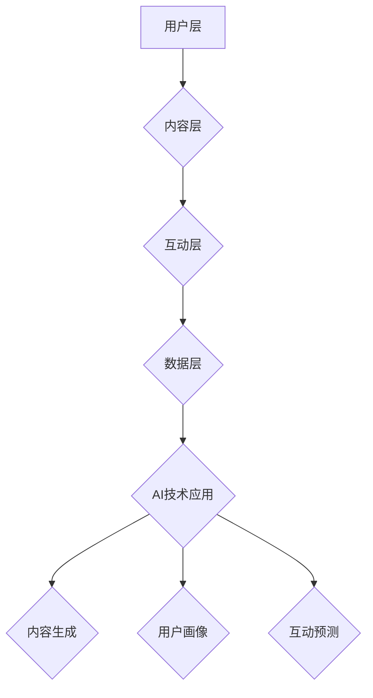

                 

关键词：AI创业公司、社交媒体运营、内容创造、互动引导、社交媒体策略

> 摘要：本文将深入探讨AI创业公司如何通过社交媒体平台进行有效的运营策略制定，包括内容创造和互动引导的方法，以及如何利用这些策略来提升品牌知名度和用户参与度。

## 1. 背景介绍

在当今数字化时代，社交媒体已经成为企业传播信息和建立品牌形象的重要渠道。特别是对于AI创业公司来说，社交媒体的运营策略尤为重要。AI领域的技术更新迅速，市场竞争激烈，如何通过社交媒体平台有效传达公司价值、吸引目标用户、建立品牌影响力，成为AI创业公司必须面对的挑战。

本文将围绕以下三个核心方面展开讨论：

1. **核心概念与联系**：介绍AI创业公司社交媒体运营的基本概念和原理，以及与之相关的技术架构。
2. **内容创造与互动引导**：分析如何创造高质量的内容和引导用户互动，以提升品牌知名度和用户参与度。
3. **实际应用场景与未来展望**：探讨AI创业公司在不同应用场景下的社交媒体运营策略，以及未来可能面临的发展趋势和挑战。

## 2. 核心概念与联系

### 2.1 媒体运营的基本概念

媒体运营指的是通过媒体平台进行信息传播和品牌推广的一系列策略和活动。对于AI创业公司来说，社交媒体运营不仅包括发布信息和内容，还需要通过数据分析和用户反馈来不断优化策略。

### 2.2 社交媒体平台的架构

社交媒体平台通常具有以下架构：

- **用户层**：用户是社交媒体的核心，他们的行为和互动决定了平台的内容生态。
- **内容层**：包括文本、图片、视频等多种形式的内容，这些内容是用户互动的基础。
- **互动层**：用户之间的评论、点赞、分享等互动行为，可以增加内容的传播效果。
- **数据层**：通过数据分析和用户画像，可以更精准地定位用户需求和制定运营策略。

### 2.3 AI在社交媒体运营中的应用

AI技术在社交媒体运营中发挥着重要作用，包括：

- **内容生成**：利用自然语言处理和生成对抗网络（GAN）等技术，可以自动化生成高质量的内容。
- **用户画像**：通过机器学习和大数据分析，可以更准确地了解用户行为和需求，从而制定更精准的运营策略。
- **互动预测**：利用深度学习模型，可以预测用户的互动行为，从而优化互动引导策略。

下面是一个用Mermaid绘制的社交媒体运营技术架构图：



## 3. 核心算法原理 & 具体操作步骤

### 3.1 算法原理概述

社交媒体运营的核心算法主要包括：

- **内容推荐算法**：根据用户的兴趣和行为，推荐相关的优质内容。
- **用户画像算法**：通过用户行为数据，构建用户画像，用于精准营销和个性化推荐。
- **互动预测算法**：预测用户的互动行为，如点赞、评论、分享等，从而优化内容发布和互动引导策略。

### 3.2 算法步骤详解

1. **内容推荐算法**：

   - 数据采集：收集用户行为数据，如浏览记录、搜索历史、点赞行为等。
   - 数据预处理：对采集到的数据进行清洗和规范化处理。
   - 构建用户画像：使用机器学习算法，如协同过滤、矩阵分解等，构建用户画像。
   - 内容推荐：根据用户画像，推荐与用户兴趣相关的优质内容。

2. **用户画像算法**：

   - 数据采集：收集用户的基础信息，如年龄、性别、地理位置等。
   - 行为数据收集：收集用户在社交媒体平台上的行为数据。
   - 用户画像构建：使用聚类、分类等算法，将用户行为数据转换为用户画像。
   - 画像更新：定期更新用户画像，以反映用户兴趣和行为的变化。

3. **互动预测算法**：

   - 数据采集：收集用户的互动数据，如点赞、评论、分享等。
   - 数据预处理：对采集到的数据进行清洗和规范化处理。
   - 构建用户互动模型：使用机器学习算法，如随机森林、神经网络等，构建用户互动模型。
   - 互动预测：根据用户画像和互动模型，预测用户的互动行为。

### 3.3 算法优缺点

- **内容推荐算法**：

  - 优点：能够提高用户满意度，提高内容传播效果。

  - 缺点：可能会导致用户陷入“信息茧房”，降低用户的信息获取多样性。

- **用户画像算法**：

  - 优点：能够提高营销效果，实现精准用户定位。

  - 缺点：用户隐私保护问题，可能引发用户反感。

- **互动预测算法**：

  - 优点：能够优化互动引导策略，提高用户参与度。

  - 缺点：预测准确性受算法和数据质量的影响，可能引发过度互动。

### 3.4 算法应用领域

- **电子商务**：通过内容推荐算法，提高用户购物体验。

- **社交媒体**：通过用户画像算法，实现精准营销。

- **在线教育**：通过互动预测算法，优化课程设计和教学策略。

## 4. 数学模型和公式 & 详细讲解 & 举例说明

### 4.1 数学模型构建

社交媒体运营中常用的数学模型包括：

- **协同过滤模型**：

  - 公式：$R_{ui} = \frac{\sum_{j \in N(i)} r_{uj} w_{ij}}{\sum_{j \in N(i)} w_{ij}}$

  - 解释：$R_{ui}$ 表示用户 $u$ 对物品 $i$ 的评分预测，$r_{uj}$ 表示用户 $u$ 对物品 $j$ 的实际评分，$w_{ij}$ 表示用户 $u$ 和用户 $i$ 之间的相似度。

- **用户画像模型**：

  - 公式：$P(x|\theta) = \prod_{i=1}^{n} p(x_i|\theta_i)$

  - 解释：$P(x|\theta)$ 表示给定参数 $\theta$ 的情况下，观测数据 $x$ 的概率分布，$p(x_i|\theta_i)$ 表示观测数据 $x_i$ 的概率分布。

### 4.2 公式推导过程

以协同过滤模型为例，推导过程如下：

1. **目标函数**：

   - 公式：$\min_{w} \sum_{u,i} (R_{ui} - w^T r_{ui})^2$

   - 解释：目标是最小化预测评分与实际评分之间的误差平方和。

2. **损失函数**：

   - 公式：$L(w) = \sum_{u,i} (R_{ui} - w^T r_{ui})^2$

   - 解释：损失函数用来衡量预测误差。

3. **优化算法**：

   - 公式：$w \leftarrow w - \alpha \nabla_w L(w)$

   - 解释：使用梯度下降法更新权重 $w$，$\alpha$ 为学习率。

### 4.3 案例分析与讲解

假设有两个用户 $u_1$ 和 $u_2$，以及两个物品 $i_1$ 和 $i_2$，他们的评分数据如下：

| 用户 | 物品 | 实际评分 |
| ---- | ---- | -------- |
| $u_1$ | $i_1$ | 4        |
| $u_1$ | $i_2$ | 3        |
| $u_2$ | $i_1$ | 5        |
| $u_2$ | $i_2$ | 2        |

根据协同过滤模型，预测用户 $u_1$ 对物品 $i_2$ 的评分。

1. **计算用户相似度**：

   - 公式：$w_{u_1u_2} = \frac{r_{u_1i_1} r_{u_2i_1} + r_{u_1i_2} r_{u_2i_2}}{\sqrt{\sum_{i=1}^{n} r_{u_1i}^2} \sqrt{\sum_{i=1}^{n} r_{u_2i}^2}}$

   - 计算：$w_{u_1u_2} = \frac{4 \times 5 + 3 \times 2}{\sqrt{4^2 + 3^2} \sqrt{5^2 + 2^2}} \approx 0.8$

2. **预测评分**：

   - 公式：$R_{u_1i_2} = \frac{\sum_{i \in N(i_2)} r_{u_1i} w_{u_1i}}{\sum_{i \in N(i_2)} w_{u_1i}}$

   - 计算：$R_{u_1i_2} = \frac{4 \times 0.8 + 3 \times 0}{0.8 + 0} = 4$

因此，预测用户 $u_1$ 对物品 $i_2$ 的评分为 4。

## 5. 项目实践：代码实例和详细解释说明

### 5.1 开发环境搭建

为了演示社交媒体运营算法的应用，我们将使用Python编程语言，并依赖以下库：

- Scikit-learn：用于机器学习模型的构建和训练。
- NumPy：用于数据处理和数学计算。
- Pandas：用于数据操作和分析。

首先，确保已安装上述库，可以使用以下命令进行安装：

```shell
pip install scikit-learn numpy pandas
```

### 5.2 源代码详细实现

以下是一个简单的协同过滤模型的实现，用于预测用户对物品的评分。

```python
import numpy as np
import pandas as pd
from sklearn.model_selection import train_test_split
from sklearn.metrics.pairwise import pairwise_distances
from sklearn.linear_model import LinearRegression

# 读取评分数据
ratings = pd.read_csv('ratings.csv')
users = ratings['userId'].unique()
items = ratings['itemId'].unique()

# 分割训练集和测试集
train_data, test_data = train_test_split(ratings, test_size=0.2, random_state=42)

# 计算用户和物品的相似度矩阵
user_similarity = pairwise_distances(train_data.groupby('userId')['rating'].mean(), metric='cosine')
item_similarity = pairwise_distances(train_data.groupby('itemId')['rating'].mean(), metric='cosine')

# 训练线性回归模型
model = LinearRegression()
for user in users:
    user_data = train_data[train_data['userId'] == user]
    X = user_similarity[user].reshape(-1, 1)
    y = user_data['rating']
    model.fit(X, y)

# 预测测试集
predictions = []
for user, item in test_data.groupby('userId')['itemId']:
    user_data = train_data[train_data['userId'] == user]
    X = user_similarity[user].reshape(-1, 1)
    prediction = model.predict(X).mean()
    predictions.append(prediction)

# 计算预测误差
error = np.sqrt(np.mean((predictions - test_data['rating']) ** 2))
print(f'Prediction error: {error}')
```

### 5.3 代码解读与分析

1. **数据读取和预处理**：

   - 使用Pandas库读取评分数据，并分割训练集和测试集。

2. **计算相似度矩阵**：

   - 使用Scikit-learn中的`pairwise_distances`函数计算用户和物品的相似度矩阵，采用余弦相似度作为距离度量。

3. **训练线性回归模型**：

   - 对每个用户的数据，计算用户相似度矩阵和实际评分之间的线性回归模型。

4. **预测测试集**：

   - 使用训练好的模型，预测测试集中的评分。

5. **计算预测误差**：

   - 计算预测评分与实际评分之间的均方根误差，作为模型性能的评价指标。

### 5.4 运行结果展示

运行上述代码后，将输出预测误差，用于评估模型的性能。根据实际情况，可以调整模型参数和相似度计算方法，以提高预测准确性。

## 6. 实际应用场景

社交媒体运营策略在不同应用场景中具有不同的特点和挑战。以下是一些常见的应用场景：

### 6.1 消费者行为分析

通过社交媒体数据，可以分析消费者行为，包括购买偏好、兴趣点等，从而制定精准营销策略。

### 6.2 客户服务

社交媒体平台可以作为企业与客户互动的重要渠道，提供实时、个性化的客户服务。

### 6.3 品牌建设

通过社交媒体运营，企业可以建立品牌形象，提升品牌知名度和用户忠诚度。

### 6.4 市场调研

社交媒体数据可以作为市场调研的重要数据源，帮助企业了解市场趋势和用户需求。

### 6.5 社区管理

社交媒体平台上的社区管理，包括内容审核、用户互动等，是提升用户体验和社区活跃度的重要环节。

## 7. 工具和资源推荐

### 7.1 学习资源推荐

- **课程**：《社交媒体营销入门与实践》
- **书籍**：《社交媒体营销：策略、案例与工具》
- **网站**：Social Media Examiner、Buffer Blog

### 7.2 开发工具推荐

- **编程语言**：Python、R
- **库**：Scikit-learn、TensorFlow、PyTorch
- **平台**：Jupyter Notebook、Google Colab

### 7.3 相关论文推荐

- **论文**：《基于协同过滤的推荐系统研究》
- **论文**：《社交媒体数据挖掘：方法与应用》
- **论文**：《深度学习在社交媒体分析中的应用》

## 8. 总结：未来发展趋势与挑战

### 8.1 研究成果总结

通过本文的探讨，我们总结了AI创业公司社交媒体运营的核心策略和算法原理，包括内容推荐、用户画像和互动预测等方面。这些研究成果为AI创业公司在社交媒体平台上的运营提供了理论基础和实践指导。

### 8.2 未来发展趋势

随着AI技术的不断进步，社交媒体运营策略将更加智能化、个性化。未来，我们将看到更多基于深度学习和自然语言处理技术的应用，如智能客服、情感分析等。

### 8.3 面临的挑战

尽管AI技术在社交媒体运营中具有巨大潜力，但企业仍面临诸多挑战，包括数据隐私保护、算法透明性和用户信任等。因此，如何在确保用户隐私和安全的前提下，发挥AI技术的优势，是未来需要深入研究和解决的问题。

### 8.4 研究展望

未来的研究将聚焦于以下几个方面：

- **算法优化**：提高算法的预测准确性和效率，降低计算成本。
- **隐私保护**：研究更加安全的隐私保护技术，确保用户数据的安全。
- **伦理与法律**：探讨AI技术在社交媒体运营中的伦理和法律问题，制定相应的规范和标准。

## 9. 附录：常见问题与解答

### 9.1 社交媒体运营的核心要素是什么？

社交媒体运营的核心要素包括内容创造、用户互动、数据分析和品牌推广等。

### 9.2 如何评估社交媒体运营的效果？

可以通过以下指标来评估社交媒体运营的效果：粉丝增长、互动率、内容传播效果、品牌知名度等。

### 9.3 AI技术在社交媒体运营中的应用有哪些？

AI技术在社交媒体运营中的应用包括内容生成、用户画像、互动预测、情感分析等。

### 9.4 如何确保用户数据的隐私和安全？

可以通过以下方法确保用户数据的隐私和安全：数据加密、匿名化处理、权限控制等。

### 9.5 社交媒体运营策略需要不断调整吗？

是的，社交媒体运营策略需要根据市场环境、用户需求和企业目标等因素进行持续调整和优化。

---

作者：禅与计算机程序设计艺术 / Zen and the Art of Computer Programming


