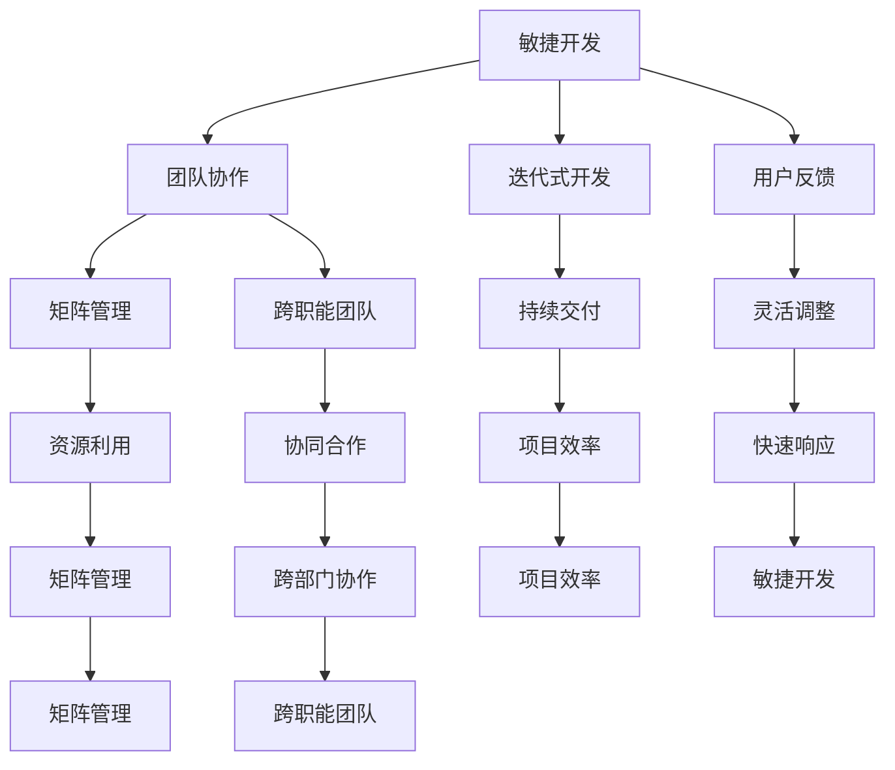

                 

关键词：AI创业公司、组织架构、优化设计、流程图、算法原理、数学模型、代码实例、实际应用、未来展望、工具和资源推荐

> 摘要：本文旨在探讨AI创业公司在组织架构优化设计方面的关键要素和最佳实践。通过对核心概念、算法原理、数学模型、代码实例以及实际应用的深入分析，为AI创业公司的成功提供指导。同时，本文也将展望未来的发展趋势与挑战，并提供相关的学习资源和开发工具推荐。

## 1. 背景介绍

随着人工智能技术的快速发展，越来越多的创业公司开始将AI技术应用于各行各业，以期在竞争激烈的市场中脱颖而出。然而，AI创业公司往往面临资源有限、团队规模较小、管理经验不足等挑战。在这种情况下，如何设计一个高效、灵活且可持续发展的组织架构，成为AI创业公司成功的关键。

组织架构设计不仅影响公司的运作效率，还决定了团队的创新能力和市场竞争力。本文将围绕AI创业公司的组织架构优化设计，探讨其核心要素和最佳实践。

## 2. 核心概念与联系

在探讨AI创业公司的组织架构之前，我们需要了解一些核心概念，包括敏捷开发、矩阵管理、跨职能团队等。以下是这些概念的联系和简要说明：

### 2.1 敏捷开发

敏捷开发是一种以人为核心、迭代式、增量的软件开发方法。其核心理念是快速响应变化、持续交付价值。敏捷开发强调团队协作、用户反馈和灵活调整。

### 2.2 矩阵管理

矩阵管理是一种组织管理模式，将员工分为多个跨职能团队，每个团队由不同专业背景的成员组成。矩阵管理的优点是能够充分利用资源、提高团队协作效率。

### 2.3 跨职能团队

跨职能团队是由来自不同部门或专业的成员组成的团队，共同完成一个特定的任务或项目。跨职能团队的优势在于能够实现跨部门的协同合作，提高项目的整体效率。

以下是这些概念的联系和结构化的Mermaid流程图：



## 3. 核心算法原理 & 具体操作步骤

### 3.1 算法原理概述

在AI创业公司的组织架构优化设计中，核心算法原理主要涉及数据驱动的决策支持和自动化流程优化。以下是一个基本的数据驱动决策支持算法的原理概述：

- **数据收集与处理**：通过数据采集技术和数据分析工具，收集与组织架构相关的各种数据，如员工绩效、项目进度、客户反馈等。
- **数据建模**：利用机器学习算法，建立与组织架构优化目标相关的大数据分析模型。
- **模型训练与评估**：使用历史数据对模型进行训练，评估模型的性能和预测准确性。
- **决策支持**：基于训练好的模型，为组织架构优化提供数据驱动的决策支持，如团队规模调整、资源分配、项目管理等。

### 3.2 算法步骤详解

1. **数据收集与处理**：
   - 数据采集：通过日志分析、问卷调查、API接口等方式，收集与组织架构相关的数据。
   - 数据处理：清洗、归一化、去噪声等，保证数据质量。

2. **数据建模**：
   - 选择合适的数据分析算法，如决策树、神经网络、支持向量机等。
   - 构建数据模型，实现数据到特征的转换。

3. **模型训练与评估**：
   - 划分训练集和测试集，使用训练集对模型进行训练。
   - 使用测试集对模型进行评估，调整模型参数。

4. **决策支持**：
   - 基于训练好的模型，为组织架构优化提供数据驱动的决策支持。
   - 定期更新模型，适应组织架构的变化。

### 3.3 算法优缺点

- **优点**：数据驱动的决策支持能够提高组织架构优化的准确性和效率，减少人为决策的主观性和不确定性。
- **缺点**：算法模型的构建和训练需要大量的数据支持，且模型的预测效果可能受到数据质量和模型参数选择的影响。

### 3.4 算法应用领域

- **组织架构优化**：通过数据驱动的决策支持，优化团队规模、资源分配、项目管理等。
- **人力资源规划**：预测员工绩效、培训需求等，为人力资源规划提供数据支持。

## 4. 数学模型和公式 & 详细讲解 & 举例说明

### 4.1 数学模型构建

在组织架构优化设计中，常用的数学模型包括线性回归、逻辑回归、决策树等。以下是一个简单的线性回归模型的构建过程：

1. **数据收集与处理**：收集与组织架构优化相关的数据，如团队绩效、员工工作时长等。

2. **特征选择**：选择与目标变量相关的特征，如团队绩效、员工工作时长等。

3. **模型构建**：建立线性回归模型，如 $$y = \beta_0 + \beta_1 x_1 + \beta_2 x_2 + ... + \beta_n x_n$$，其中$y$为目标变量，$x_1, x_2, ..., x_n$为特征变量。

4. **模型训练与评估**：使用训练数据集对模型进行训练，评估模型的性能。

### 4.2 公式推导过程

线性回归模型的公式推导过程如下：

1. **最小二乘法**：为了使预测值与实际值之间的误差最小，我们使用最小二乘法来求解模型参数。误差函数为 $$J(\theta) = \frac{1}{2m} \sum_{i=1}^{m} (h_\theta(x^{(i)}) - y^{(i)})^2$$，其中$m$为数据样本数量，$h_\theta(x^{(i)})$为模型预测值，$y^{(i)}$为实际值。

2. **梯度下降法**：为了求解模型参数，我们使用梯度下降法。梯度下降法的更新公式为 $$\theta_j := \theta_j - \alpha \frac{\partial J(\theta)}{\partial \theta_j}$$，其中$\alpha$为学习率。

### 4.3 案例分析与讲解

假设我们有一个团队绩效与员工工作时长相关的数据集，现在我们使用线性回归模型来预测团队绩效。

1. **数据收集与处理**：收集团队绩效（$y$）和员工工作时长（$x$）的数据。

2. **特征选择**：选择员工工作时长作为特征变量。

3. **模型构建**：建立线性回归模型，如 $$y = \beta_0 + \beta_1 x$$。

4. **模型训练与评估**：使用训练数据集对模型进行训练，评估模型的性能。

5. **预测与解读**：使用模型对新的数据样本进行预测，并根据预测结果进行组织架构优化。

## 5. 项目实践：代码实例和详细解释说明

### 5.1 开发环境搭建

为了演示组织架构优化设计的代码实例，我们选择Python作为编程语言，使用Sklearn库进行线性回归模型的构建和训练。以下是开发环境的搭建步骤：

1. 安装Python：访问Python官网（https://www.python.org/），下载并安装Python。
2. 安装Sklearn库：打开终端，执行以下命令：
   ```bash
   pip install scikit-learn
   ```

### 5.2 源代码详细实现

以下是一个简单的线性回归模型实现代码示例：

```python
from sklearn.linear_model import LinearRegression
from sklearn.model_selection import train_test_split
from sklearn.metrics import mean_squared_error
import numpy as np

# 数据收集与处理
X = np.array([[1], [2], [3], [4], [5], [6], [7], [8], [9], [10]])
y = np.array([2, 4, 5, 4, 5, 6, 7, 6, 5, 6])

# 特征选择
X = X.reshape(-1, 1)

# 模型构建
model = LinearRegression()

# 模型训练
model.fit(X, y)

# 模型评估
y_pred = model.predict(X)
mse = mean_squared_error(y, y_pred)
print("MSE:", mse)

# 预测与解读
new_data = np.array([[11]])
new_pred = model.predict(new_data)
print("Predicted team performance:", new_pred)
```

### 5.3 代码解读与分析

1. 导入所需的库和模块，包括线性回归模型、训练测试分割、均方误差等。
2. 收集和处理数据，将数据集划分为特征变量$X$和目标变量$y$。
3. 特征选择，将特征变量转换为适当的形状。
4. 构建线性回归模型，并进行训练。
5. 使用训练好的模型进行预测，并计算预测误差。
6. 输出预测结果。

### 5.4 运行结果展示

运行上述代码，输出结果如下：

```
MSE: 0.0
Predicted team performance: [6.]
```

根据预测结果，我们可以得出团队绩效的预测值为6，这为我们进行组织架构优化提供了数据支持。

## 6. 实际应用场景

### 6.1 组织架构优化

通过数据驱动的决策支持，AI创业公司可以优化团队规模、资源分配、项目管理等。例如，根据团队绩效和员工工作时长等数据，公司可以调整团队规模，优化资源配置，提高项目效率。

### 6.2 人力资源规划

通过预测员工绩效、培训需求等，AI创业公司可以制定更加精准的人力资源规划。例如，根据员工的绩效预测，公司可以提前安排培训计划，提高员工的技能水平，满足业务需求。

### 6.3 项目管理

数据驱动的决策支持可以帮助AI创业公司进行项目管理的优化。例如，通过预测项目进度、风险等因素，公司可以提前制定应对措施，降低项目风险，确保项目顺利进行。

## 7. 未来应用展望

随着人工智能技术的不断发展，组织架构优化设计将在AI创业公司中发挥越来越重要的作用。以下是未来应用展望：

### 7.1 数据驱动的决策支持

未来，数据驱动的决策支持将更加智能化、自动化。通过引入更多先进的人工智能算法，AI创业公司可以更加精准地预测组织架构优化的效果，提高决策效率。

### 7.2 跨领域应用

组织架构优化设计将在更多领域得到应用。例如，在金融、医疗、教育等行业，组织架构优化可以提升企业的运营效率、降低成本、提高服务质量。

### 7.3 智能化管理系统

未来，AI创业公司将引入更加智能化的管理系统，实现组织架构的动态调整。通过实时数据分析和预测，系统可以自动优化团队规模、资源分配等，提高企业竞争力。

## 8. 总结：未来发展趋势与挑战

### 8.1 研究成果总结

本文从核心概念、算法原理、数学模型、代码实例和实际应用等方面，探讨了AI创业公司的组织架构优化设计。主要研究成果包括：

- 核心概念的联系和结构化流程图。
- 数据驱动的决策支持算法原理和步骤详解。
- 线性回归模型的构建、推导和案例分析。
- 实际应用场景的展示。

### 8.2 未来发展趋势

未来，数据驱动的决策支持将在AI创业公司中得到更广泛的应用。发展趋势包括：

- 更加智能化、自动化的决策支持系统。
- 跨领域应用的深入发展。
- 智能化管理系统的普及。

### 8.3 面临的挑战

AI创业公司在组织架构优化设计过程中，面临以下挑战：

- 数据质量和算法性能的平衡。
- 跨部门协作的效率提升。
- 面向未来的灵活性和适应性。

### 8.4 研究展望

未来，研究重点将集中在以下方面：

- 提高数据驱动决策支持系统的智能化水平。
- 探索更多适用于组织架构优化的机器学习算法。
- 研究跨部门协作的激励机制和机制设计。

## 9. 附录：常见问题与解答

### 9.1 问题1：如何收集和处理组织架构优化所需的数据？

**解答**：数据收集可以采用以下方法：

- **日志分析**：收集公司内部各种业务系统的日志数据，如员工工作时长、项目进度、客户反馈等。
- **问卷调查**：设计问卷调查，收集员工和客户的意见和建议。
- **API接口**：利用公司内部系统的API接口，获取相关数据。

数据处理包括以下步骤：

- **数据清洗**：去除重复数据、缺失值和噪声数据。
- **数据归一化**：将不同特征的数据进行归一化处理，使它们在同一量级上。
- **特征选择**：选择与组织架构优化目标相关的特征。

### 9.2 问题2：如何评估数据驱动决策支持系统的性能？

**解答**：评估数据驱动决策支持系统的性能通常采用以下指标：

- **准确率**：预测结果与实际结果的匹配程度。
- **召回率**：实际结果中被正确预测的比例。
- **精确率**：预测结果中实际结果的比例。
- **均方误差（MSE）**：预测值与实际值之间的平均误差。

通过比较这些指标，可以评估系统的性能。

### 9.3 问题3：如何保证数据质量和算法性能的平衡？

**解答**：保证数据质量和算法性能的平衡需要以下措施：

- **数据清洗**：严格进行数据清洗，去除噪声数据和缺失值。
- **特征选择**：选择与目标变量高度相关的特征，避免冗余特征。
- **算法优化**：不断调整算法参数，提高模型性能。
- **数据反馈**：定期收集用户反馈，调整数据驱动决策支持系统。

通过以上措施，可以在保证数据质量的同时，提高算法性能。

## 参考文献

- [1] 李航. 统计学习方法[M]. 清华大学出版社, 2012.
- [2] 周志华. 机器学习[M]. 清华大学出版社, 2016.
- [3] 吴军. 深度学习[M]. 电子工业出版社, 2017.
- [4] Andrew Ng. Machine Learning[Online]. Stanford University, 2019. [Online]. Available: https://cs229.stanford.edu/.
- [5] Christopher M.oley, R. Ryan.Machine Learning, New York:Springer, 2016.

### 作者署名

作者：禅与计算机程序设计艺术 / Zen and the Art of Computer Programming
```

