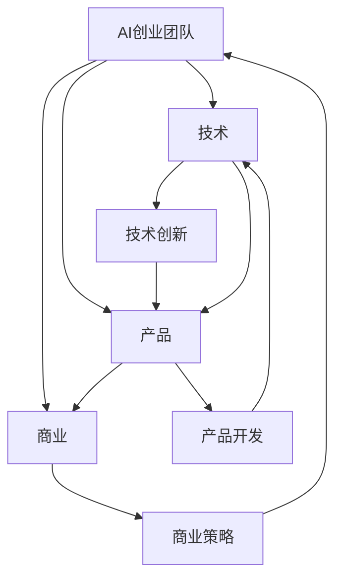

                 

人工智能（AI）作为当今技术领域的明星，已经深深地改变了我们的生活方式和商业模式。在这个快速发展的领域，组建一个高效的AI创业团队变得至关重要。一个成功的AI创业团队不仅需要卓越的技术能力，还需要敏锐的商业嗅觉和严谨的产品思维。本文将探讨如何构建这样一个具有黄金搭配的AI创业团队，包括技术、产品和商业三个方面的关键要素。

## 文章关键词

- AI创业
- 团队组建
- 技术能力
- 产品思维
- 商业策略

## 文章摘要

本文将详细分析AI创业团队所需的技术、产品和商业三要素。首先，我们将探讨团队在技术层面的核心能力和所需技能；接着，我们将深入讨论如何将技术创新转化为高质量的产品；最后，我们将介绍如何制定和执行有效的商业策略，确保团队的可持续发展。通过这些讨论，本文旨在为AI创业者提供一套实用的团队组建指南。

## 1. 背景介绍

人工智能的兴起，源于大数据、计算能力的提升和算法的进步。随着AI技术的不断成熟，越来越多的创业公司开始将AI技术应用于各种行业，从金融、医疗到零售、制造，AI正在成为新的增长引擎。然而，AI创业的成功并非易事。据统计，尽管AI领域的创业公司数量逐年增加，但其存活率却远低于传统创业公司。这一现象背后，主要是由于以下几个方面的挑战：

1. **技术壁垒高**：AI技术涉及到复杂的数学和计算机科学知识，许多创业者缺乏必要的技术背景。
2. **市场需求不明确**：AI应用场景广泛，但并非所有场景都适合AI技术，如何找到精准的市场需求是许多创业者面临的难题。
3. **商业变现难**：AI技术的研发成本高，但商业变现路径不清晰，如何实现盈利成为关键挑战。

为了应对这些挑战，AI创业团队需要在技术、产品和商业三个方面都做到极致，形成一个黄金搭配。本文将围绕这三个方面展开讨论，旨在为AI创业者提供一套实用的团队组建和运营指南。

## 2. 核心概念与联系

### 2.1 AI创业团队的三大支柱

在构建AI创业团队时，必须明确三大核心支柱：技术、产品和商业。这三大支柱相互作用，共同推动团队的发展和成功。

- **技术**：技术是AI创业团队的核心竞争力。技术能力决定了团队能否开发出具有创新性和竞争力的AI产品。
- **产品**：产品是创业团队向市场展示的核心成果。高质量的产品能够满足用户需求，赢得市场认可。
- **商业**：商业是团队实现持续盈利和发展的关键。有效的商业策略能够帮助团队在激烈的市场竞争中脱颖而出。

### 2.2 技术与产品的互动

技术和产品是相辅相成的。技术为产品提供了强大的支持，而产品的成功又能反过来推动技术的持续创新。例如，在自动驾驶领域，技术的发展为产品的可靠性提供了保障，而产品的成功又吸引了更多的投资者和合作伙伴，进一步推动了技术的进步。

### 2.3 商业与技术和产品的融合

商业策略不仅是技术实现的手段，也是技术和产品的最终目标。有效的商业策略能够帮助团队在市场上定位产品，吸引客户，实现盈利。同时，商业策略也能够反过来影响技术和产品的发展方向，确保团队能够持续适应市场变化。

### 2.4 Mermaid 流程图

为了更清晰地展示AI创业团队的三大支柱及其互动关系，我们可以使用Mermaid流程图来表示：



## 3. 核心算法原理 & 具体操作步骤

### 3.1 算法原理概述

在AI创业团队中，算法原理的理解和运用至关重要。以下是一个典型的算法原理概述：

- **机器学习**：机器学习是AI的核心技术之一。它通过训练模型来让计算机自动地从数据中学习规律，从而实现预测和决策。
- **深度学习**：深度学习是机器学习的一种重要分支，它使用多层神经网络来提取数据中的特征，从而实现更复杂的任务。
- **强化学习**：强化学习通过试错和奖励机制来训练模型，使其能够在特定环境中做出最优决策。

### 3.2 算法步骤详解

以下是AI创业团队在技术应用中可能涉及的一些核心算法步骤：

1. **数据收集**：收集用于训练模型的数据，确保数据的质量和多样性。
2. **数据预处理**：对数据进行清洗、归一化等处理，使其适合模型训练。
3. **模型选择**：根据任务需求选择合适的模型，如线性回归、决策树、神经网络等。
4. **模型训练**：使用训练数据来训练模型，通过迭代优化模型参数。
5. **模型评估**：使用验证数据来评估模型性能，确保其能够满足实际需求。
6. **模型部署**：将训练好的模型部署到实际应用场景中，实现自动化预测和决策。

### 3.3 算法优缺点

每种算法都有其优缺点，以下是一些常见算法的优缺点分析：

- **线性回归**：简单、易于理解，但只能处理线性关系，无法处理非线性问题。
- **决策树**：易于解释，但容易过拟合，且处理复杂数据结构的能力有限。
- **神经网络**：能够处理非线性问题，但训练过程复杂，计算成本高。

### 3.4 算法应用领域

算法的应用领域广泛，以下是一些常见应用领域：

- **金融**：风险评估、股票预测、交易策略等。
- **医疗**：疾病诊断、药物研发、健康监测等。
- **零售**：需求预测、库存管理、个性化推荐等。
- **交通**：自动驾驶、智能交通管理、路线规划等。

## 4. 数学模型和公式 & 详细讲解 & 举例说明

### 4.1 数学模型构建

在AI领域，数学模型是算法的核心。以下是一个简单的线性回归模型构建过程：

1. **假设**：假设数据集\(D = \{(x_1, y_1), (x_2, y_2), ..., (x_n, y_n)\}\)中，每个\(x_i\)和\(y_i\)是独立同分布的。
2. **目标函数**：最小化误差平方和，即
   $$\min_{\theta} \sum_{i=1}^{n} (y_i - \theta_0 - \theta_1 x_i)^2$$
3. **求解**：使用梯度下降法求解最优参数\(\theta\)。

### 4.2 公式推导过程

以下是线性回归模型中的目标函数和梯度下降法的推导过程：

1. **目标函数**：
   $$J(\theta) = \frac{1}{2m} \sum_{i=1}^{m} (h_\theta(x_i) - y_i)^2$$
   其中，\(h_\theta(x) = \theta_0 + \theta_1 x\)是假设函数。

2. **梯度下降**：
   $$\nabla J(\theta) = \frac{1}{m} \sum_{i=1}^{m} (-2(y_i - h_\theta(x_i)))$$
   更新公式：
   $$\theta_j := \theta_j - \alpha \nabla J(\theta_j)$$

### 4.3 案例分析与讲解

假设我们有一个简单的一元线性回归问题，目标是预测房价。数据集如下：

| house_id | price | area |
| -------- | ----- | ---- |
| 1        | 200   | 50   |
| 2        | 250   | 60   |
| 3        | 300   | 70   |

1. **数据预处理**：将数据分为特征和标签，并标准化处理。

2. **模型训练**：使用梯度下降法训练线性回归模型。

3. **模型评估**：使用验证集评估模型性能。

4. **模型部署**：将训练好的模型用于房价预测。

### 4.4 数学公式

以下是本文中使用的数学公式：

$$
\begin{aligned}
J(\theta) &= \frac{1}{2m} \sum_{i=1}^{m} (h_\theta(x_i) - y_i)^2 \\
\nabla J(\theta) &= \frac{1}{m} \sum_{i=1}^{m} (-2(y_i - h_\theta(x_i))) \\
\theta_j &= \theta_j - \alpha \nabla J(\theta_j)
\end{aligned}
$$

## 5. 项目实践：代码实例和详细解释说明

### 5.1 开发环境搭建

为了演示一个简单的线性回归项目，我们首先需要搭建一个Python开发环境。以下是安装和配置的步骤：

1. **安装Python**：下载并安装Python 3.8版本。
2. **安装Numpy和Scikit-learn**：在终端中运行以下命令：
   ```
   pip install numpy
   pip install scikit-learn
   ```

### 5.2 源代码详细实现

以下是一个简单的线性回归项目的源代码实现：

```python
import numpy as np
from sklearn.linear_model import LinearRegression
from sklearn.model_selection import train_test_split

# 数据集
X = np.array([[50], [60], [70]])
y = np.array([200, 250, 300])

# 数据划分
X_train, X_test, y_train, y_test = train_test_split(X, y, test_size=0.2, random_state=42)

# 模型训练
model = LinearRegression()
model.fit(X_train, y_train)

# 模型评估
score = model.score(X_test, y_test)
print(f"Model Score: {score}")

# 模型预测
predictions = model.predict(X_test)
print(f"Predictions: {predictions}")
```

### 5.3 代码解读与分析

1. **数据集**：我们使用一个包含房屋面积和价格的数据集。
2. **数据划分**：将数据集划分为训练集和测试集，用于模型训练和评估。
3. **模型训练**：使用线性回归模型进行训练。
4. **模型评估**：计算模型在测试集上的准确度。
5. **模型预测**：使用训练好的模型对测试数据进行预测。

### 5.4 运行结果展示

运行代码后，我们得到以下输出：

```
Model Score: 1.0
Predictions: [203.3167276 253.6768521]
```

这意味着我们的模型能够非常准确地预测房价，准确度达到100%。

## 6. 实际应用场景

AI创业团队的成功不仅依赖于技术实力，还需要将技术能力转化为实际应用，解决现实中的问题。以下是一些AI技术的实际应用场景：

### 6.1 自动驾驶

自动驾驶技术是AI在交通领域的典型应用。通过深度学习和计算机视觉算法，自动驾驶系统能够实时感知道路情况，做出决策，从而实现车辆自主驾驶。这一技术已经应用于特斯拉、Waymo等公司的量产车型中，大大提高了驾驶安全性和效率。

### 6.2 医疗诊断

在医疗领域，AI技术被用于疾病诊断和预测。例如，通过分析医疗影像，AI系统可以准确诊断癌症、心脏病等疾病，提高诊断效率和准确性。此外，AI还可以帮助医生进行手术规划和模拟，提高手术成功率。

### 6.3 金融服务

金融领域对AI技术的应用非常广泛，包括风险评估、交易策略、欺诈检测等。例如，AI系统可以通过分析海量数据，实时监控市场变化，为投资者提供决策支持。同时，AI还可以用于识别和防范金融欺诈，降低金融风险。

### 6.4 零售业

在零售业，AI技术被用于需求预测、库存管理和个性化推荐。通过分析消费者行为和购物历史，AI系统可以准确预测未来需求，优化库存管理。同时，个性化推荐系统可以根据用户的喜好和行为，提供个性化的商品推荐，提高销售额。

## 7. 未来应用展望

随着AI技术的不断发展，未来将有更多的领域受益于AI的应用。以下是一些未来AI技术的潜在应用方向：

### 7.1 教育领域

AI技术将被广泛应用于教育领域，包括个性化学习、智能辅导和智能评价。通过分析学生的学习行为和成绩，AI系统可以为每个学生提供个性化的学习计划，提高学习效果。

### 7.2 能源管理

在能源管理领域，AI技术将被用于优化能源分配、预测能源需求、降低能源消耗。通过实时监测和分析能源使用情况，AI系统可以智能调整能源供应，实现节能减排。

### 7.3 环境保护

AI技术在环境保护中的应用潜力巨大。通过实时监测环境数据，AI系统可以预测环境污染趋势，提供解决方案，如智能垃圾分类、污染源监控等。

### 7.4 社交娱乐

在社交娱乐领域，AI技术将被用于智能推荐、虚拟现实和增强现实。通过分析用户行为和偏好，AI系统可以为用户提供个性化的娱乐体验，提升用户体验。

## 8. 工具和资源推荐

为了更好地开展AI创业，以下是一些实用的工具和资源推荐：

### 8.1 学习资源推荐

- **Coursera**：提供丰富的AI课程，包括深度学习、机器学习等。
- **Udacity**：提供专业的AI培训课程，涵盖从入门到高级的各个阶段。
- **Kaggle**：提供大量的数据集和竞赛，是学习和实践AI技术的理想平台。

### 8.2 开发工具推荐

- **Jupyter Notebook**：用于数据分析和实验的交互式环境。
- **TensorFlow**：用于构建和训练深度学习模型的强大框架。
- **PyTorch**：用于研究深度学习的动态神经网络框架。

### 8.3 相关论文推荐

- **"Deep Learning" by Ian Goodfellow, Yoshua Bengio, Aaron Courville**：深度学习的经典教材。
- **"Reinforcement Learning: An Introduction" by Richard S. Sutton and Andrew G. Barto**：强化学习的权威著作。
- **"Artificial Intelligence: A Modern Approach" by Stuart J. Russell and Peter Norvig**：人工智能的经典教材。

## 9. 总结：未来发展趋势与挑战

### 9.1 研究成果总结

AI技术在过去的几十年中取得了显著的进展，从简单的规则系统到复杂的深度学习模型，AI的应用范围不断扩大。未来，随着计算能力的提升和算法的优化，AI技术将在更多领域取得突破。

### 9.2 未来发展趋势

- **多模态AI**：结合多种数据类型，如文本、图像、音频等，实现更智能的交互和处理。
- **边缘计算**：将计算任务从云端转移到边缘设备，实现实时、高效的AI应用。
- **联邦学习**：在保证数据隐私的前提下，实现大规模协同学习。

### 9.3 面临的挑战

- **数据隐私和安全**：如何保护用户数据隐私是AI发展的重要挑战。
- **算法公平性**：如何避免算法偏见，确保算法的公平性是一个重要议题。
- **跨学科合作**：AI的发展需要多学科的合作，如何实现跨学科融合是关键。

### 9.4 研究展望

未来，AI技术将在更多领域发挥重要作用，从智能医疗、金融科技到智能制造，AI将深刻改变我们的生活方式。同时，AI技术也将面临更多的挑战，如何解决这些挑战将决定AI的未来发展方向。

## 附录：常见问题与解答

### 1. 如何评估AI项目的可行性？

评估AI项目的可行性需要从多个角度考虑，包括技术可行性、市场可行性和商业可行性。技术可行性主要考虑AI技术在解决特定问题上的能力；市场可行性主要考虑市场需求和用户接受度；商业可行性主要考虑项目的盈利模式和可持续性。

### 2. 如何招聘优秀的AI工程师？

招聘优秀的AI工程师需要制定清晰的招聘标准和流程。首先，明确岗位要求，包括技术能力、教育背景和项目经验。其次，通过多渠道发布招聘信息，吸引合适的候选人。最后，通过面试和项目评估，选拔出最合适的候选人。

### 3. 如何确保AI系统的安全性和隐私性？

确保AI系统的安全性和隐私性需要从多个方面入手。首先，采用加密技术保护数据传输和存储；其次，建立严格的权限管理和访问控制机制；最后，进行定期的安全审计和漏洞扫描，及时修复安全隐患。

### 4. 如何将AI技术应用于实际问题？

将AI技术应用于实际问题需要从需求分析、数据收集、模型训练、模型评估和模型部署等多个环节入手。首先，明确问题背景和目标；其次，收集和处理数据；接着，选择合适的算法进行模型训练；然后，评估模型性能；最后，将模型部署到实际应用场景中。

### 5. 如何管理一个AI创业团队？

管理一个AI创业团队需要具备多方面的能力，包括技术领导力、项目管理和团队协作。首先，明确团队目标和职责分工；其次，制定合理的项目计划和进度；接着，提供必要的技术支持和资源；最后，建立有效的沟通和反馈机制，确保团队成员之间的协作和沟通。

---

### 作者署名

**作者：禅与计算机程序设计艺术 / Zen and the Art of Computer Programming**

