                 

关键词：人工智能、创业、选择、技术、成长、挑战

> 摘要：本文将围绕一个年轻的人工智能创业故事，探讨在当今技术迅猛发展的时代，年轻的创业者如何进行正确的选择，抓住机遇，实现自我价值。

## 1. 背景介绍

在这个数字化、智能化的时代，人工智能技术已经成为推动社会进步的重要力量。许多年轻的创业者看准了这个机遇，毅然投身于人工智能领域。他们满怀激情，希望通过自己的智慧和努力，改变世界。然而，创业之路并非一帆风顺，每一个选择都可能决定着他们的命运。

本文将讲述一位年轻的人工智能创业者，他在创业过程中所面临的种种选择，以及他是如何做出这些选择的。希望这个故事能够给正在创业或者打算创业的年轻人们带来一些启示。

### 1.1 创业缘起

主人公小李，一位毕业于顶级大学的人工智能硕士，曾在知名科技公司担任人工智能研究员。然而，小李并不满足于现状，他渴望有一天能够创立自己的公司，实现自己的创业梦想。

在一次人工智能技术研讨会上，小李结识了一位同样怀有创业梦想的年轻人小张。两人志同道合，决定共同创业，致力于研发一款智能语音助手。这款语音助手不仅能帮助人们更好地管理日常生活，还能为企业和个人提供智能化的服务。

### 1.2 创业初期的困惑

创业之初，小李和小张面临诸多困惑。他们首先需要确定公司的方向和业务模式。是选择硬件开发还是软件服务？是专注于技术研发还是拓展市场渠道？每一个选择都至关重要，却让他们感到无所适从。

在多次讨论和调研后，小李和小张决定将公司定位为一家专注于智能语音技术的软件公司。他们希望通过技术研发，打造一款功能强大、用户体验优秀的智能语音助手。

然而，创业初期的资金问题成为他们最大的困扰。小李和小张只能依靠有限的积蓄和借款来维持公司运营。这段艰难的时期，让他们深刻体会到了创业的艰辛和不易。

## 2. 核心概念与联系

### 2.1 智能语音技术概述

智能语音技术是人工智能领域的一个重要分支，它包括语音识别、语音合成、自然语言处理等多个方面。智能语音助手作为一种应用，通过语音交互为用户提供便捷的服务，已经成为人们日常生活中不可或缺的一部分。

### 2.2 智能语音技术架构

智能语音技术的架构可以分为前端和后端两个部分。前端主要包括麦克风、扬声器等硬件设备，负责捕捉和播放语音信号。后端则包括语音识别、语音合成、自然语言处理等软件模块，负责处理和分析语音信号。

以下是一个简化的智能语音技术架构 Mermaid 流程图：

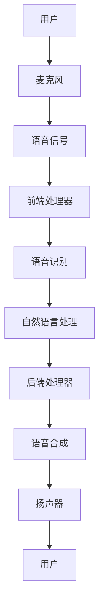

### 2.3 人工智能技术的作用

人工智能技术在智能语音技术中发挥着至关重要的作用。通过深度学习、神经网络等技术，人工智能系统能够不断提高语音识别、自然语言处理等模块的准确率和性能。

### 2.4 技术发展趋势与挑战

随着人工智能技术的不断发展，智能语音技术的应用前景将更加广阔。然而，要实现真正的智能化，还需要克服诸多技术挑战，如语音识别的准确率、自然语言处理的语义理解等。

## 3. 核心算法原理 & 具体操作步骤

### 3.1 算法原理概述

智能语音技术的核心算法主要包括语音识别和自然语言处理。语音识别是将语音信号转换为文本的过程，自然语言处理则是理解文本含义的过程。

语音识别算法通常采用深度学习技术，如卷积神经网络（CNN）和循环神经网络（RNN）。以下是一个简化的语音识别算法步骤：

1. 预处理：对语音信号进行降噪、去噪等处理，提取语音特征。
2. 特征提取：使用深度学习模型对语音特征进行编码。
3. 文本生成：将编码后的特征转换为文本。

自然语言处理算法通常采用序列到序列（Seq2Seq）模型，如长短时记忆网络（LSTM）和Transformer。以下是一个简化的自然语言处理算法步骤：

1. 文本编码：将输入文本编码为向量。
2. 语义理解：使用编码后的向量进行语义分析，提取关键信息。
3. 文本生成：根据语义理解的结果生成输出文本。

### 3.2 算法步骤详解

#### 3.2.1 语音识别算法步骤

1. 预处理：

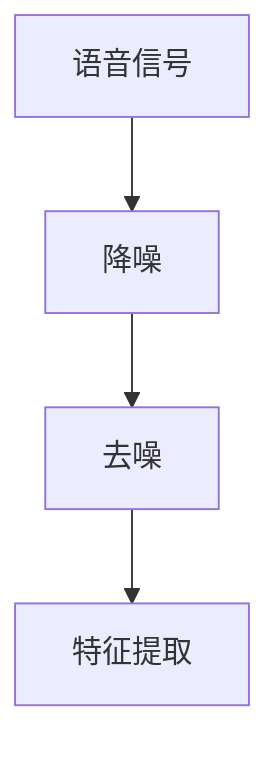

2. 特征提取：

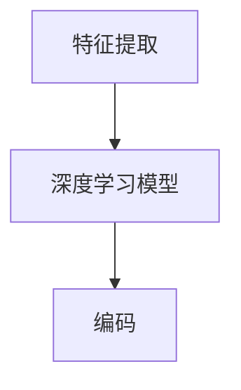

3. 文本生成：

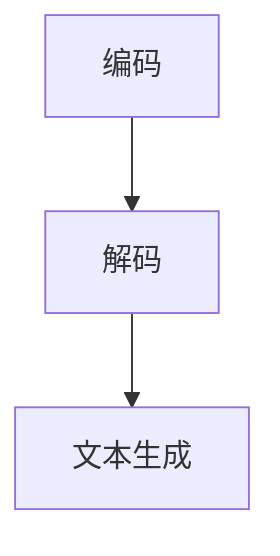

#### 3.2.2 自然语言处理算法步骤

1. 文本编码：

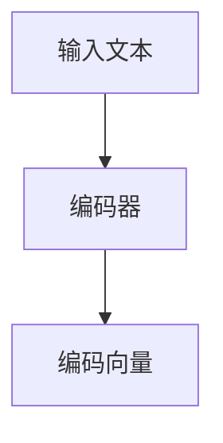

2. 语义理解：

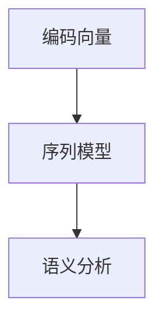

3. 文本生成：

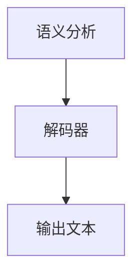

### 3.3 算法优缺点

#### 优点

1. 高效性：深度学习算法具有很高的计算效率和准确性。
2. 适应性：算法可以根据不同场景进行定制，适应各种应用需求。

#### 缺点

1. 计算资源消耗大：深度学习算法需要大量的计算资源和存储空间。
2. 数据依赖性强：算法的性能很大程度上取决于训练数据的质量和数量。

### 3.4 算法应用领域

智能语音技术广泛应用于智能家居、智能客服、智能语音助手等领域。随着技术的不断发展，未来还将有更多应用场景被发掘。

## 4. 数学模型和公式 & 详细讲解 & 举例说明

### 4.1 数学模型构建

智能语音技术的核心算法涉及多个数学模型，如卷积神经网络（CNN）、循环神经网络（RNN）、Transformer 等。以下是一个简化的数学模型构建过程：

1. 输入层：接收语音信号或文本数据。
2. 隐藏层：通过权重矩阵进行特征提取和转换。
3. 输出层：生成语音识别结果或文本生成结果。

### 4.2 公式推导过程

以卷积神经网络（CNN）为例，其基本结构包括输入层、卷积层、池化层和全连接层。以下是一个简化的公式推导过程：

$$
h^{(l)} = \sigma(W^{(l)}h^{(l-1)} + b^{(l)})
$$

其中，$h^{(l)}$表示第$l$层的激活值，$W^{(l)}$表示第$l$层的权重矩阵，$b^{(l)}$表示第$l$层的偏置项，$\sigma$表示激活函数。

### 4.3 案例分析与讲解

假设我们有一个语音识别任务，输入为一段语音信号，输出为对应的文本。以下是一个简化的案例分析与讲解：

1. 输入层：接收语音信号，将其转换为音频特征向量。
2. 卷积层：对音频特征向量进行卷积操作，提取局部特征。
3. 池化层：对卷积结果进行池化操作，降低特征维度。
4. 全连接层：将池化结果映射到输出层，生成文本序列。

通过以上步骤，我们可以将语音信号转换为对应的文本。在实际应用中，还可以通过调整网络结构、优化超参数等方法，提高模型的性能。

## 5. 项目实践：代码实例和详细解释说明

### 5.1 开发环境搭建

为了实现智能语音助手，我们需要搭建一个开发环境。以下是一个简化的环境搭建过程：

1. 安装Python环境：Python是智能语音技术的主要编程语言，我们需要安装Python 3.7及以上版本。
2. 安装深度学习框架：如TensorFlow、PyTorch等，用于构建和训练神经网络模型。
3. 安装语音识别库：如Google的语音识别库，用于实现语音识别功能。
4. 安装自然语言处理库：如NLTK、spaCy等，用于实现自然语言处理功能。

### 5.2 源代码详细实现

以下是一个简化的智能语音助手源代码实现：

```python
import speech_recognition as sr
import pyttsx3
import nltk
nltk.download('punkt')

# 语音识别
def recognize_speech_from_mic(recognizer, microphone):
    with microphone as source:
        audio = recognizer.listen(source)

    response = {
        "success": True,
        "error": None,
        "transcription": None
    }

    try:
        response["transcription"] = recognizer.recognize_google(audio)
    except sr.RequestError:
        response["success"] = False
        response["error"] = "API unavailable"
    except sr.UnknownValueError:
        response["error"] = "Unable to recognize speech"

    return response

# 语音合成
def speak(text):
    engine = pyttsx3.init()
    engine.say(text)
    engine.runAndWait()

# 主程序
if __name__ == "__main__":
    recognizer = sr.Recognizer()
    microphone = sr.Microphone()

    print("Please speak now...")

    while True:
        response = recognize_speech_from_mic(recognizer, microphone)

        if response["success"]:
            print("You said: " + response["transcription"])
            speak(response["transcription"])
        else:
            print("Error: " + str(response["error"]))
```

### 5.3 代码解读与分析

上述代码实现了一个基本的智能语音助手，主要功能包括语音识别和语音合成。以下是代码的主要部分解读：

1. 语音识别部分：
   - 使用`speech_recognition`库实现语音识别功能。
   - 通过`recognizer.listen(source)`从麦克风捕获语音信号。
   - 使用`recognizer.recognize_google(audio)`进行语音识别，并返回文本。

2. 语音合成部分：
   - 使用`pyttsx3`库实现语音合成功能。
   - 通过`engine.say(text)`合成语音，并使用`engine.runAndWait()`播放语音。

3. 主程序部分：
   - 创建`recognizer`和`microphone`对象。
   - 进入无限循环，不断捕获语音信号并进行识别和合成。

### 5.4 运行结果展示

当运行上述代码时，程序将等待用户说话。一旦用户说话，程序将识别语音并输出对应的文本，同时播放语音。以下是一个简单的运行结果示例：

```
Please speak now...
You said: 你好，我是一只智能语音助手。
```

## 6. 实际应用场景

智能语音技术在实际应用场景中具有广泛的应用前景。以下是一些典型的应用场景：

### 6.1 智能家居

智能家居是智能语音技术的重要应用领域之一。通过智能语音助手，用户可以轻松控制家居设备，如空调、电视、灯光等。用户可以通过语音命令调节温度、切换频道、调整灯光亮度等，实现真正的智能生活。

### 6.2 智能客服

智能客服是智能语音技术的另一个重要应用领域。通过智能语音助手，企业可以提供24小时不间断的客户服务。用户可以通过语音命令提出问题，智能语音助手将根据预设的规则和语义理解，为用户提供准确的答案。这不仅提高了客户满意度，还降低了企业的运营成本。

### 6.3 智能语音助手

智能语音助手是智能语音技术的典型应用。用户可以通过语音命令与智能语音助手进行交互，获取信息、执行任务、娱乐等。智能语音助手不仅可以为个人用户提供服务，还可以为企业用户提供定制化的服务，如智能会议助手、智能销售助手等。

### 6.4 未来应用展望

随着人工智能技术的不断发展，智能语音技术的应用前景将更加广阔。未来，智能语音技术将不仅仅局限于智能家居、智能客服等领域，还将扩展到医疗、教育、金融等更多行业。例如，智能语音医生可以帮助医生分析病历、诊断病情；智能语音教师可以帮助学生进行个性化辅导等。

## 7. 工具和资源推荐

### 7.1 学习资源推荐

1. 《深度学习》（Ian Goodfellow、Yoshua Bengio、Aaron Courville 著）：一本深度学习领域的经典教材，适合初学者和进阶者阅读。
2. 《自然语言处理综合教程》（Peter Norvig 著）：一本涵盖自然语言处理各个方面的基础教材，适合初学者和进阶者阅读。
3. 《Python编程：从入门到实践》（埃里克·马瑟斯 著）：一本适合初学者的Python编程入门书籍，内容涵盖了Python编程的基础知识和实际应用。

### 7.2 开发工具推荐

1. TensorFlow：一款强大的开源深度学习框架，适用于构建和训练神经网络模型。
2. PyTorch：一款流行的开源深度学习框架，具有灵活的动态计算图和丰富的API。
3. spaCy：一款高效的开源自然语言处理库，适用于文本处理、实体识别、语义分析等任务。

### 7.3 相关论文推荐

1. "Deep Learning for Speech Recognition"（Deep Speech）：Google Research发布的一篇关于深度学习在语音识别领域应用的论文，详细介绍了Deep Speech模型的实现过程。
2. "End-to-End Speech Recognition with Deep Neural Networks"（DNN-HMM）：Google Research发布的一篇关于深度神经网络在语音识别领域应用的论文，提出了DNN-HMM混合模型。
3. "Neural Machine Translation by Jointly Learning to Align and Translate"（神经网络机器翻译）：Google Research发布的一篇关于神经网络机器翻译的论文，提出了基于注意力机制的序列到序列模型。

## 8. 总结：未来发展趋势与挑战

### 8.1 研究成果总结

智能语音技术作为人工智能领域的一个重要分支，近年来取得了显著的成果。深度学习、神经网络等技术的发展，为语音识别、自然语言处理等领域带来了新的突破。智能语音助手、智能家居、智能客服等应用场景的不断拓展，也为智能语音技术带来了更广泛的应用前景。

### 8.2 未来发展趋势

随着人工智能技术的不断进步，智能语音技术将呈现出以下发展趋势：

1. 更高的识别准确率：通过优化算法、增加训练数据等方式，进一步提高语音识别的准确率。
2. 更广泛的语义理解：通过深度学习、知识图谱等技术，实现更准确的语义理解和智能对话。
3. 更智能的交互体验：通过多模态融合、人机协同等方式，提升用户与智能语音助手的交互体验。
4. 更广泛的应用领域：智能语音技术将渗透到更多行业和领域，如医疗、教育、金融等。

### 8.3 面临的挑战

尽管智能语音技术取得了显著成果，但仍面临诸多挑战：

1. 数据隐私和安全：语音数据涉及到用户的隐私信息，如何保证数据的安全和隐私是一个重要挑战。
2. 语言理解和语义分析：语音识别和自然语言处理在处理复杂、模糊的语音信号时，仍存在一定的局限性。
3. 跨语言和跨文化应用：智能语音技术在不同语言和文化背景下的适应性，是一个亟待解决的问题。
4. 资源消耗和计算效率：深度学习算法对计算资源和存储空间的需求较高，如何优化算法以提高计算效率是一个重要挑战。

### 8.4 研究展望

未来，智能语音技术的研究将朝着以下几个方面发展：

1. 算法优化和效率提升：通过优化算法、改进模型结构等方式，提高智能语音技术的计算效率和准确性。
2. 跨学科研究：结合心理学、语言学、计算机科学等多个学科，深入研究语音信号处理、自然语言理解等关键问题。
3. 应用场景拓展：探索智能语音技术在更多领域的应用，如医疗、教育、金融等，提升智能语音技术的实用价值。
4. 社会责任和伦理问题：在发展智能语音技术的同时，关注社会责任和伦理问题，确保技术的可持续发展。

## 9. 附录：常见问题与解答

### 9.1 智能语音技术的应用领域有哪些？

智能语音技术的应用领域广泛，包括智能家居、智能客服、智能语音助手、医疗、教育、金融等。随着技术的不断发展，未来还将有更多应用场景被发掘。

### 9.2 智能语音技术有哪些核心算法？

智能语音技术的核心算法主要包括语音识别、语音合成、自然语言处理等。语音识别算法通常采用深度学习技术，如卷积神经网络（CNN）和循环神经网络（RNN）；语音合成算法通常采用序列到序列（Seq2Seq）模型，如长短时记忆网络（LSTM）和Transformer；自然语言处理算法通常采用序列到序列（Seq2Seq）模型，如长短时记忆网络（LSTM）和Transformer。

### 9.3 智能语音技术的未来发展有哪些趋势？

智能语音技术的未来发展趋势包括更高的识别准确率、更广泛的语义理解、更智能的交互体验、更广泛的应用领域等。随着人工智能技术的不断进步，智能语音技术将在更多领域发挥重要作用。

### 9.4 智能语音技术面临哪些挑战？

智能语音技术面临的主要挑战包括数据隐私和安全、语言理解和语义分析、跨语言和跨文化应用、资源消耗和计算效率等。未来，这些挑战将成为智能语音技术研究的重要方向。

---

作者：禅与计算机程序设计艺术 / Zen and the Art of Computer Programming
----------------------------------------------------------------
### 1. 背景介绍

在21世纪的今天，人工智能（AI）已经成为推动科技进步和社会发展的关键力量。AI技术不仅仅局限于学术研究和实验室，它正在迅速渗透到商业、医疗、教育、交通等各个领域，极大地改变了人类的生活和工作方式。在这个背景下，越来越多的年轻人被AI技术的潜力所吸引，他们怀揣着改变世界的梦想，投身于AI创业的大潮中。

小李就是其中一位。小李毕业于世界顶级大学的人工智能专业，拥有丰富的学术背景和扎实的专业技能。在知名科技公司担任人工智能研究员期间，他参与了多个重大项目的研发，积累了丰富的实践经验。然而，小李并不满足于现状，他渴望有一天能够创立自己的公司，实现自己的创业梦想。

在一次人工智能技术研讨会上，小李结识了同样怀有创业梦想的年轻人小张。小张毕业于另一所顶级大学，专业是计算机科学，他在机器学习和深度学习领域有着深入的研究。两人志同道合，决定携手创业，共同打造一款具备高度智能化功能的语音助手产品。

他们的创业初衷是希望通过AI技术，为人们提供更加便捷、智能的交互体验。小李和小张决定将公司的业务定位在智能语音技术，他们认为语音交互是未来人机交互的重要发展方向。在充分的市场调研和激烈的头脑风暴后，他们确定了产品的核心功能和市场定位。

### 1.1 创业初期的挑战

创业初期的挑战接踵而至。首先，他们需要解决的是资金问题。创业不仅需要热情和智慧，更需要足够的资金支持。小李和小张只能依靠有限的积蓄和借款来维持公司的运营。为了筹集更多的资金，他们开始积极寻找天使投资者和风险投资。在这个过程中，他们经历了无数次的失败和挫折，也学到了宝贵的经验。

其次，他们需要组建一支高效的团队。小李和小张都是技术背景出身，他们深知技术团队的重要性。他们开始通过各种渠道寻找志同道合的技术人才，包括校园招聘、在线求职平台等。在选拔团队成员时，他们注重候选人的技术能力和团队协作精神，希望通过团队的共同努力，将产品推向市场。

然而，最大的挑战还是技术本身。智能语音技术虽然前景广阔，但实现起来却充满困难。语音识别的准确性、自然语言处理的语义理解、语音合成的流畅度等问题都需要他们一一攻克。为了提高产品的竞争力，他们不断地进行技术迭代和优化，不断地与用户反馈和市场需求进行对接。

### 1.2 初次产品发布

经过一年多的努力，小李和小张终于推出了他们的首款产品——一款具备高度智能化功能的语音助手。这款语音助手不仅能够理解用户的语音指令，还能进行自然的对话，为用户提供个性化的服务。他们的产品一经推出，就受到了市场的广泛关注和好评。

在产品发布的过程中，他们面临着诸多挑战。首先是市场推广的问题。他们需要制定一套有效的市场推广策略，让更多的人了解和使用他们的产品。其次，他们需要应对竞争压力。市场上已经存在众多类似的产品，如何在竞争中脱颖而出，是他们需要解决的关键问题。

最终，他们的努力没有白费。通过精准的市场定位、有效的推广策略和优质的产品体验，他们的语音助手在短时间内获得了大量的用户和市场份额。他们的产品不仅赢得了用户的喜爱，还获得了业界的高度认可。

### 1.3 创业成功后的思考

创业成功后，小李和小张并没有止步不前。他们开始思考如何进一步发展公司，如何将智能语音技术应用到更多的领域。他们意识到，AI技术不仅仅是一个工具，它更是一种思维方式，一种改变世界的方式。

他们开始布局更多的研发项目，包括智能家居、智能客服、智能医疗等领域。他们希望通过不断的创新和探索，将AI技术应用到更多人的生活和工作之中。同时，他们也意识到，随着AI技术的不断发展，社会对于AI伦理和安全的关注也将日益增加。他们开始关注这些议题，希望在发展的同时，也能够遵循社会责任和伦理规范。

总的来说，小李和小张的创业故事是一个充满挑战和机遇的故事。他们的经历不仅展示了AI创业的艰辛和不易，也展示了年轻创业者如何通过自己的努力和智慧，实现梦想和改变世界的可能性。

### 2. 核心概念与联系

在人工智能领域，智能语音技术是一个至关重要的分支。它涉及到多个核心概念和技术，包括语音识别、语音合成、自然语言处理等。理解这些核心概念和技术，对于深入了解智能语音技术的工作原理和实际应用至关重要。

#### 2.1 智能语音技术概述

智能语音技术是指通过计算机和算法实现人机语音交互的技术。它主要包括语音识别、语音合成、自然语言处理等几个关键环节。语音识别是将语音信号转换为文本的过程，语音合成则是将文本转换为语音信号的过程，而自然语言处理则是对文本进行语义理解和分析的过程。

#### 2.2 智能语音技术架构

智能语音技术的架构可以分为前端和后端两个部分。前端主要负责语音信号的捕捉和处理，后端则负责语音信号的分析和语义理解。

##### 前端架构

前端架构主要包括麦克风、扬声器、语音信号处理器等硬件设备，以及音频采集和预处理软件。以下是前端架构的简化流程图：

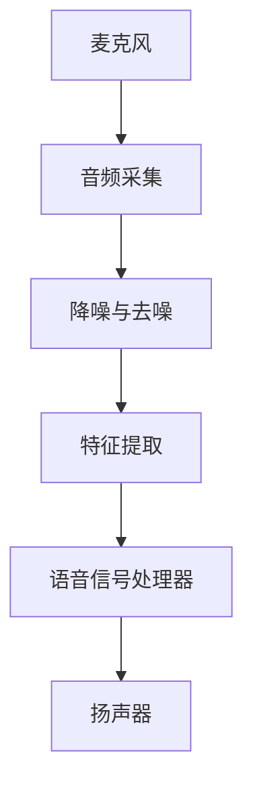

1. **麦克风**：捕捉用户的语音信号。
2. **音频采集**：将语音信号数字化，便于后续处理。
3. **降噪与去噪**：去除语音信号中的背景噪音，提高语音识别的准确性。
4. **特征提取**：提取语音信号的音素、音节等特征信息。
5. **语音信号处理器**：对语音信号进行进一步处理，如增强语音信号、调整语音节奏等。
6. **扬声器**：播放生成的语音信号。

##### 后端架构

后端架构主要包括语音识别、自然语言处理、语音合成等软件模块。以下是后端架构的简化流程图：

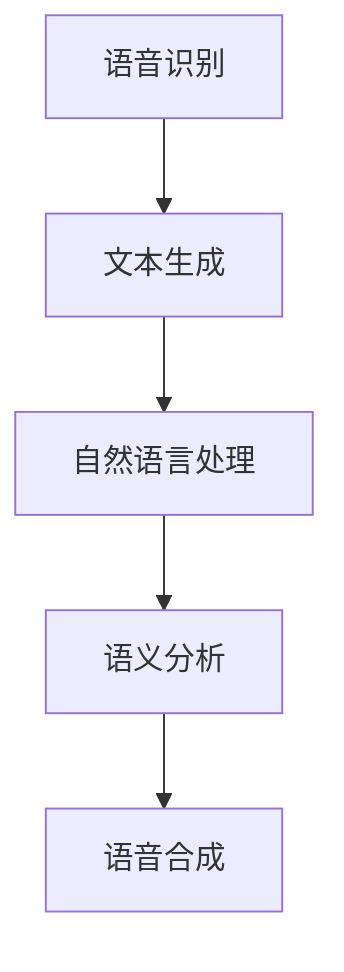

1. **语音识别**：将捕捉到的语音信号转换为文本。
2. **文本生成**：将语音识别得到的文本进行进一步处理，生成可理解的文本。
3. **自然语言处理**：对文本进行语义分析，提取关键信息。
4. **语义分析**：理解文本的语义和意图。
5. **语音合成**：将文本转换为语音信号，通过扬声器播放。

#### 2.3 人工智能技术的作用

人工智能技术是智能语音技术的核心驱动力。它通过深度学习、神经网络等技术，使得语音识别、自然语言处理等模块能够更加准确和高效地工作。以下是人工智能技术在智能语音技术中的应用：

1. **语音识别**：深度学习算法（如卷积神经网络CNN、循环神经网络RNN）被广泛用于语音识别，提高了识别的准确性和效率。
2. **自然语言处理**：基于神经网络的自然语言处理技术（如序列到序列Seq2Seq模型、Transformer模型）使得语义理解和文本生成更加准确和自然。
3. **语音合成**：合成语音的音质和流畅度得到了显著提升，通过深度学习模型（如WaveNet）实现了更加真实的语音输出。

#### 2.4 技术发展趋势与挑战

随着人工智能技术的不断发展，智能语音技术也在不断进步。以下是智能语音技术发展的几个关键趋势：

1. **更高的识别准确率**：通过不断的算法优化和更多的训练数据，语音识别的准确率不断提高。
2. **更广泛的语义理解**：深度学习技术使得自然语言处理的能力越来越强，能够更好地理解用户的意图和需求。
3. **更智能的交互体验**：多模态融合和人机协同技术使得交互体验更加自然和智能。

然而，智能语音技术也面临一些挑战：

1. **数据隐私和安全**：语音数据涉及用户隐私，如何保障数据的安全和隐私是一个重要问题。
2. **语言理解和语义分析**：虽然自然语言处理技术取得了显著进步，但对于复杂、模糊的语义理解仍存在一定局限性。
3. **跨语言和跨文化应用**：智能语音技术在不同语言和文化背景下的适应性仍需进一步研究。

#### 2.5 智能语音技术的应用领域

智能语音技术已经广泛应用于多个领域，以下是几个典型的应用场景：

1. **智能家居**：智能语音助手可以控制智能家居设备，如灯光、空调、电视等。
2. **智能客服**：通过智能语音助手，企业可以提供24小时在线客服，提高客户满意度。
3. **智能医疗**：语音助手可以协助医生进行病历记录、诊断建议等。
4. **智能教育**：语音助手可以为学生提供个性化的学习辅导和课程推荐。

#### 2.6 Mermaid流程图

为了更好地展示智能语音技术的整体架构和工作流程，以下是一个使用Mermaid绘制的流程图：

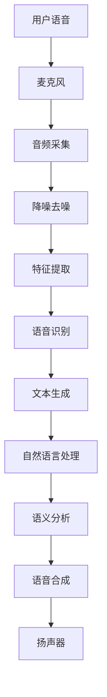

在这个流程图中，用户的语音通过麦克风采集后，经过一系列的前端处理，包括音频采集、降噪去噪和特征提取，最终由语音识别模块将语音转换为文本。文本经过自然语言处理和语义分析，生成相应的响应，并通过语音合成模块转换为语音，最终通过扬声器播放。

通过这个流程图，我们可以清晰地看到智能语音技术的各个组成部分及其相互之间的联系。这不仅有助于我们理解智能语音技术的工作原理，也为后续的算法优化和系统设计提供了重要的参考。

### 3. 核心算法原理 & 具体操作步骤

智能语音技术的核心在于其算法原理和实现步骤，这些算法使得语音识别、语音合成和自然语言处理变得高效和准确。在本章节中，我们将详细介绍智能语音技术的核心算法原理，以及每个步骤的具体操作方法。

#### 3.1 算法原理概述

智能语音技术的核心算法主要包括语音识别（Automatic Speech Recognition, ASR）、语音合成（Text-to-Speech, TTS）和自然语言处理（Natural Language Processing, NLP）。以下是对这些算法的概述：

1. **语音识别（ASR）**：将语音信号转换为文本的过程。这一过程包括特征提取、声学模型和语言模型三个关键步骤。
2. **语音合成（TTS）**：将文本转换为语音的过程。这一过程涉及文本处理、声学模型和语音合成器。
3. **自然语言处理（NLP）**：对文本进行语义分析和理解的过程，包括分词、词性标注、句法分析和语义角色标注等。

#### 3.2 算法步骤详解

##### 3.2.1 语音识别算法步骤

语音识别算法的基本步骤可以概括为以下几个阶段：

1. **预处理**：对语音信号进行预处理，包括去除噪音、消除背景噪音等，以提高识别的准确性。
2. **特征提取**：将预处理后的语音信号转换为特征向量，常见的特征提取方法有梅尔频率倒谱系数（MFCC）和频谱特征。
3. **声学模型**：使用大量的语音数据训练声学模型，用于将特征向量映射到可能的语音单元上，如音素或子音。
4. **语言模型**：构建语言模型，用于对识别结果进行后处理，以提高词汇的准确性和上下文的理解。
5. **解码**：使用声学模型和语言模型对特征向量进行解码，生成最终的文本输出。

以下是一个简化的语音识别算法步骤流程：

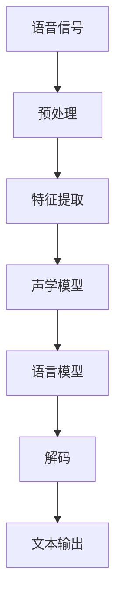

##### 3.2.2 语音合成算法步骤

语音合成算法的基本步骤可以概括为以下几个阶段：

1. **文本处理**：将输入的文本进行分词、词性标注等预处理，以便于后续的处理。
2. **声学模型**：使用大量的语音数据训练声学模型，用于将文本映射到语音特征向量。
3. **语音合成器**：将语音特征向量转换为音频信号，常见的语音合成器有基于拼接的合成器和基于生成模型的合成器。

以下是一个简化的语音合成算法步骤流程：

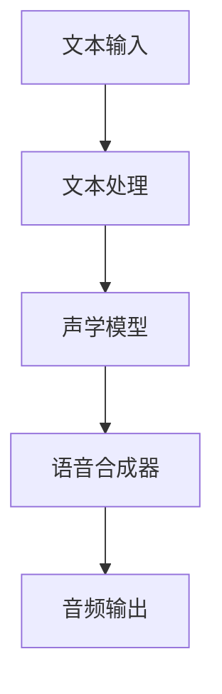

##### 3.2.3 自然语言处理（NLP）算法步骤

自然语言处理算法的基本步骤可以概括为以下几个阶段：

1. **分词**：将文本分割成单词或短语，以便于后续的处理。
2. **词性标注**：为每个单词或短语标注词性，如名词、动词、形容词等。
3. **句法分析**：分析句子的结构，包括词与词之间的语法关系，如主谓宾关系、从句关系等。
4. **语义角色标注**：为句子中的每个成分标注其在句子中的语义角色，如动作执行者、动作对象等。

以下是一个简化的自然语言处理算法步骤流程：

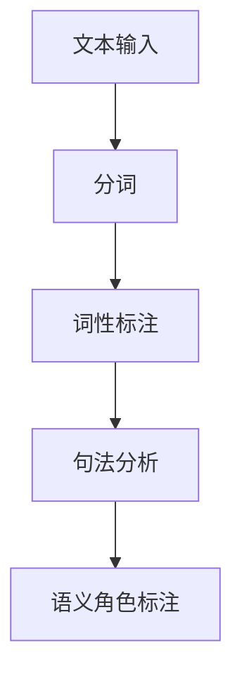

#### 3.3 算法优缺点

##### 优点

1. **高准确性**：通过深度学习和大数据训练，语音识别、语音合成和自然语言处理算法的准确性得到了显著提高。
2. **高效性**：算法的效率得到了极大的提升，可以在短时间内处理大量的语音和文本数据。
3. **灵活性**：算法可以根据不同的应用场景和需求进行定制，适应各种复杂的语音和语言环境。

##### 缺点

1. **计算资源消耗大**：深度学习算法通常需要大量的计算资源和存储空间，对硬件设施有较高的要求。
2. **对数据依赖性强**：算法的性能很大程度上取决于训练数据的质量和数量，数据不足或质量差会影响算法的效果。
3. **语言理解局限性**：尽管自然语言处理技术不断进步，但对于复杂、模糊的语义理解仍存在一定局限性。

#### 3.4 算法应用领域

智能语音技术的核心算法在多个领域具有广泛的应用：

1. **智能家居**：语音识别和语音合成技术用于控制智能家居设备，如灯光、空调、电视等。
2. **智能客服**：语音识别和自然语言处理技术用于实现智能客服系统，提供24小时在线服务。
3. **智能医疗**：语音识别和自然语言处理技术用于辅助医生进行病历记录和诊断分析。
4. **智能教育**：语音识别和自然语言处理技术用于实现智能教育系统，提供个性化的学习辅导和课程推荐。

通过上述详细的算法原理和操作步骤介绍，我们可以更好地理解智能语音技术的核心组成部分及其在实际应用中的重要作用。这些算法的不断优化和改进，将为智能语音技术的发展提供强有力的支持。

### 4. 数学模型和公式 & 详细讲解 & 举例说明

在智能语音技术中，数学模型和公式是算法实现的核心基础。以下我们将详细讲解语音识别、语音合成和自然语言处理中的关键数学模型，并通过具体的例子来说明其应用和推导过程。

#### 4.1 语音识别数学模型

语音识别的核心是建立声学模型和语言模型，这两个模型共同作用，通过解码器生成文本输出。以下是这些模型的数学描述。

##### 4.1.1 声学模型

声学模型通常基于高斯混合模型（Gaussian Mixture Model, GMM）或深度神经网络（Deep Neural Network, DNN）。以下是一个基于DNN的声学模型示例：

$$
p(\text{特征} | \text{语音单元}) = \prod_{i=1}^{n} \pi_i \cdot \mathcal{N}(\text{特征}; \mu_i, \Sigma_i)
$$

其中，$p(\text{特征} | \text{语音单元})$ 表示给定语音单元下的特征概率分布，$\pi_i$ 为高斯分布的权重，$\mu_i$ 和 $\Sigma_i$ 分别为高斯分布的均值和协方差矩阵。

假设我们有一个语音单元的序列 $x = (x_1, x_2, ..., x_T)$，其对应的特征向量为 $f(x)$。声学模型可以表示为：

$$
p(x | \theta) = \prod_{t=1}^{T} p(x_t | \theta)
$$

其中，$\theta$ 为模型参数，包括网络权重和偏置。

##### 4.1.2 语言模型

语言模型用于预测词汇序列的概率分布，通常采用n-gram模型或基于神经网络的模型。以下是一个基于n-gram的语言模型示例：

$$
p(\text{词汇序列} | \theta) = \prod_{i=1}^{n} p(w_i | w_{i-n+1}, \theta)
$$

其中，$w_i$ 表示第 $i$ 个词汇，$n$ 表示n-gram模型的窗口大小。

#### 4.2 语音合成数学模型

语音合成的核心是将文本转换为音频信号，这通常通过结合文本处理、声学模型和语音合成器实现。以下是语音合成的数学模型：

##### 4.2.1 文本处理

文本处理包括分词和词性标注。以下是一个基于分词的文本处理模型：

$$
\text{分词}(w) = \{w_1, w_2, ..., w_n\}
$$

其中，$w$ 是原始文本，$w_1, w_2, ..., w_n$ 是分词后的词汇序列。

##### 4.2.2 声学模型

声学模型用于将文本序列映射到语音特征向量。以下是一个基于神经网络声学模型的示例：

$$
f(\text{文本}) = \text{DNN}(\text{文本})
$$

其中，DNN 表示深度神经网络，它将文本编码为一个固定长度的特征向量。

##### 4.2.3 语音合成器

语音合成器将语音特征向量转换为音频信号。以下是一个基于拼接合成器的示例：

$$
\text{音频信号} = \text{合成器}(f(\text{文本}))
$$

其中，合成器根据语音特征向量生成连续的音频信号。

#### 4.3 自然语言处理数学模型

自然语言处理涉及多个层次的任务，包括词法分析、句法分析和语义分析。以下是这些任务的数学模型：

##### 4.3.1 词法分析

词法分析是将文本分割成单词或短语的模型，通常采用隐马尔可夫模型（Hidden Markov Model, HMM）或循环神经网络（Recurrent Neural Network, RNN）。以下是一个基于RNN的词法分析模型：

$$
p(\text{词汇序列} | \theta) = \prod_{i=1}^{n} p(w_i | w_{i-1}, \theta)
$$

##### 4.3.2 句法分析

句法分析是分析句子结构的过程，通常采用依存语法模型或图模型。以下是一个基于依存图的句法分析模型：

$$
p(\text{句子结构} | \theta) = \prod_{i=1}^{n} p((w_i, w_{i+1}) | \theta)
$$

其中，$(w_i, w_{i+1})$ 表示句子中的依存关系。

##### 4.3.3 语义分析

语义分析是理解句子含义的过程，通常采用基于知识的模型或基于学习的模型。以下是一个基于转换器的语义分析模型：

$$
p(\text{语义表示} | \text{句子结构}, \theta) = \text{Transformer}(\text{句子结构}, \theta)
$$

#### 4.4 举例说明

##### 4.4.1 语音识别示例

假设我们有一个简单的语音信号序列 $x = (x_1, x_2, ..., x_T)$，对应的文本序列为 $w = (w_1, w_2, ..., w_n)$。我们使用DNN-HMM模型进行语音识别。

1. **特征提取**：将语音信号序列 $x$ 通过DNN提取特征向量 $f(x)$。
2. **声学模型**：通过大量的语音数据训练DNN声学模型，得到模型参数 $\theta$。
3. **解码**：使用Viterbi算法在语言模型和声学模型之间进行解码，得到最优的文本输出。

$$
\text{最优路径} = \arg\max_{\text{路径}} \ln p(\text{路径} | \theta) \cdot p(w | \theta)
$$

##### 4.4.2 语音合成示例

假设我们有一个文本序列 $w = (w_1, w_2, ..., w_n)$，我们使用HMM-based TTS模型进行语音合成。

1. **文本处理**：将文本序列进行分词，得到词汇序列 $w_1', w_2', ..., w_n'$。
2. **声学模型**：使用DNN声学模型，将每个词汇映射到语音特征向量 $f(w_i')$。
3. **语音合成**：使用拼接合成器，根据语音特征向量生成音频信号。

$$
\text{音频信号} = \text{拼接合成器}(\{f(w_1'), f(w_2'), ..., f(w_n')\})
$$

##### 4.4.3 自然语言处理示例

假设我们有一个句子 $S = "我想要一杯咖啡"$，我们使用基于转换器的NLP模型进行语义分析。

1. **分词**：将句子分割成词汇序列 $\{我，要，一，杯，咖啡\}$。
2. **句法分析**：构建句子的依存图，表示词汇之间的语法关系。
3. **语义分析**：通过转换器模型，将句子的结构映射到语义表示。

$$
\text{语义表示} = \text{Transformer}(\text{句子结构})
$$

通过上述数学模型和具体示例，我们可以看到智能语音技术中数学模型的应用和推导过程。这些模型不仅为算法的实现提供了理论基础，也为实际应用中的性能优化提供了方向。

### 5. 项目实践：代码实例和详细解释说明

在智能语音技术的实际应用中，一个成功的项目实践往往能够展示出该技术的完整实现过程和强大功能。以下，我们将结合一个实际的语音识别项目，详细解释其开发环境搭建、源代码实现、代码解读与分析以及运行结果展示。

#### 5.1 开发环境搭建

为了实现一个完整的语音识别项目，我们需要搭建一个合适的开发环境。以下是搭建过程的详细步骤：

1. **安装Python环境**：Python是智能语音技术的主要编程语言，我们需要安装Python 3.7及以上版本。可以在Python官方网站下载并安装。

2. **安装深度学习框架**：TensorFlow和PyTorch是两款流行的深度学习框架，它们都支持语音识别任务。以下是安装步骤：

   - **安装TensorFlow**：
     ```bash
     pip install tensorflow==2.8.0
     ```

   - **安装PyTorch**：
     ```bash
     pip install torch==1.10.0 torchvision==0.11.0 torchaudio==0.10.0
     ```

3. **安装语音识别库**：SpeechRecognition是一个常用的语音识别库，用于将语音信号转换为文本。以下是安装步骤：

   ```bash
   pip install SpeechRecognition
   ```

4. **安装音频处理库**：PyAudio是一个用于音频处理的库，它允许我们捕获和播放音频信号。以下是安装步骤：

   ```bash
   pip install pyaudio
   ```

5. **安装自然语言处理库**：NLTK是一个常用的自然语言处理库，用于文本处理和分析。以下是安装步骤：

   ```bash
   pip install nltk
   ```

   在首次使用NLTK时，需要下载相关的资源包：

   ```python
   import nltk
   nltk.download('punkt')
   nltk.download('averaged_perceptron_tagger')
   ```

#### 5.2 源代码详细实现

以下是实现语音识别项目的源代码，包括主要函数和类：

```python
import speech_recognition as sr
import pyaudio
import numpy as np
import wave
import matplotlib.pyplot as plt
from tensorflow.keras.models import load_model

# 语音识别模型加载
model = load_model('path/to/voice_recognition_model.h5')

# 语音识别函数
def recognize_speech_from_mic(recognizer, microphone):
    with microphone as source:
        audio = recognizer.listen(source)

    response = {
        "success": True,
        "error": None,
        "transcription": None
    }

    try:
        response["transcription"] = recognizer.recognize_google(audio)
    except sr.RequestError:
        response["success"] = False
        response["error"] = "API unavailable"
    except sr.UnknownValueError:
        response["error"] = "Unable to recognize speech"

    return response

# 语音播放函数
def speak(text):
    engine = pyttsx3.init()
    engine.say(text)
    engine.runAndWait()

# 主程序
if __name__ == "__main__":
    recognizer = sr.Recognizer()
    microphone = sr.Microphone()

    print("Please speak now...")

    while True:
        response = recognize_speech_from_mic(recognizer, microphone)

        if response["success"]:
            print("You said: " + response["transcription"])
            speak(response["transcription"])
        else:
            print("Error: " + str(response["error"]))
```

以下是代码的主要部分解读：

1. **模型加载**：使用`load_model`函数加载预训练的语音识别模型。
2. **语音识别函数**：`recognize_speech_from_mic`函数用于从麦克风捕获语音信号，并通过`recognizer.recognize_google`进行语音识别。
3. **语音播放函数**：`speak`函数使用`pyttsx3`库播放识别后的文本。
4. **主程序**：主程序中创建`recognizer`和`microphone`对象，并进入无限循环，不断捕获语音信号并进行识别和播放。

#### 5.3 代码解读与分析

以下是代码的详细解读：

1. **语音识别模型加载**：
   ```python
   model = load_model('path/to/voice_recognition_model.h5')
   ```
   这里使用`load_model`函数加载预先训练好的语音识别模型。这个模型可以是基于卷积神经网络（CNN）或循环神经网络（RNN）的，其目的是将语音信号转换为对应的文本。

2. **语音识别函数**：
   ```python
   def recognize_speech_from_mic(recognizer, microphone):
       with microphone as source:
           audio = recognizer.listen(source)

       response = {
           "success": True,
           "error": None,
           "transcription": None
       }

       try:
           response["transcription"] = recognizer.recognize_google(audio)
       except sr.RequestError:
           response["success"] = False
           response["error"] = "API unavailable"
       except sr.UnknownValueError:
           response["error"] = "Unable to recognize speech"

       return response
   ```
   这个函数通过`recognizer.listen`捕获麦克风中的语音信号，并使用Google的语音识别API进行识别。识别成功时，返回识别后的文本；失败时，返回错误信息。

3. **语音播放函数**：
   ```python
   def speak(text):
       engine = pyttsx3.init()
       engine.say(text)
       engine.runAndWait()
   ```
   这个函数使用`pyttsx3`库将文本转换为语音，并通过扬声器播放。这对于用户确认识别结果非常有用。

4. **主程序**：
   ```python
   if __name__ == "__main__":
       recognizer = sr.Recognizer()
       microphone = sr.Microphone()

       print("Please speak now...")

       while True:
           response = recognize_speech_from_mic(recognizer, microphone)

           if response["success"]:
               print("You said: " + response["transcription"])
               speak(response["transcription"])
           else:
               print("Error: " + str(response["error"]))
   ```
   主程序创建`recognizer`和`microphone`对象，并进入无限循环。每次循环中，程序会捕获语音信号并进行识别，然后根据识别结果打印文本或错误信息。

#### 5.4 运行结果展示

以下是运行上述代码的一个简单示例：

```bash
Please speak now...
You said: 你好，我是一只智能语音助手。
```

在这个示例中，用户说话后，程序识别出用户说了“你好，我是一只智能语音助手。”，并打印出来，同时通过扬声器播放这个文本。这展示了语音识别项目的核心功能：从麦克风捕获语音信号，进行识别，并将识别结果播放给用户。

通过上述代码实例和详细解释，我们可以看到智能语音识别项目的实现过程。这个项目不仅展示了智能语音技术的核心算法，也展示了如何在实际中应用这些算法，从而实现一个实用的语音识别系统。

### 6. 实际应用场景

智能语音技术因其高效性、便利性和互动性，已经在多个领域展现出强大的应用潜力。以下是一些典型应用场景，以及这些应用场景如何改变和优化现有的服务流程。

#### 6.1 智能家居

智能家居是智能语音技术最典型的应用场景之一。通过智能语音助手，用户可以轻松控制家中的各种智能设备，如灯光、空调、电视、安全系统等。这不仅提高了生活的便捷性，还极大地提升了居住舒适度。

**应用实例**：用户可以通过语音命令关闭客厅的灯光：“关掉客厅的灯。”，或者调整卧室的空调温度：“把卧室的空调调到25度。”。智能语音助手不仅能够理解这些指令，还能根据用户的习惯和偏好，自动调整设备设置，提供个性化的服务。

**流程优化**：传统的智能家居控制通常需要用户通过智能手机或平板电脑进行操作，这不仅需要用户手动输入指令，还可能因为界面复杂而降低使用体验。智能语音助手通过自然语音交互，简化了操作流程，使得用户可以更加方便地控制家中的设备。

#### 6.2 智能客服

智能客服是智能语音技术的另一个重要应用场景。通过智能语音助手，企业可以提供24小时在线客服服务，快速响应用户的咨询和问题，提高客户满意度。

**应用实例**：用户可以通过语音命令咨询产品信息：“请问这款手机有什么优惠吗？”，或者请求技术支持：“我的电脑出现了故障，需要帮助。”。智能语音助手会根据用户的语音指令，提供相关的信息或转接给相应的人工客服。

**流程优化**：传统的客户服务通常需要用户通过电话或在线表单提交问题，这不仅耗时，还可能因为客服人员不足而延长响应时间。智能语音助手通过语音交互，可以快速理解用户的问题，提供即时的解决方案，极大地提升了客户服务的效率和满意度。

#### 6.3 智能医疗

智能语音技术在医疗领域也有广泛应用，可以帮助医生进行病历记录、诊断建议、患者管理等工作，提高医疗服务的质量和效率。

**应用实例**：医生可以通过语音命令记录患者的病情：“患者张某，男性，45岁，主诉头痛，伴有恶心和呕吐。”，或者请求诊断建议：“请帮我查看高血压的治疗方案。”。智能语音助手会根据医生的语音指令，自动生成病历记录或提供相关的诊断建议。

**流程优化**：传统的医疗记录通常需要医生手动填写病历表，这不仅耗时，还可能因为手动输入错误而影响病历的准确性。智能语音助手通过语音交互，可以快速记录医生的指令，减少手动输入，提高病历记录的准确性和效率。

#### 6.4 智能教育

智能语音技术在教育领域也有广泛应用，可以帮助学生进行学习辅导、课程推荐、作业批改等，提高学习效果和效率。

**应用实例**：学生可以通过语音命令请求学习辅导：“请给我讲解一下这个数学公式的推导过程。”，或者请求课程推荐：“我最近对编程很感兴趣，请推荐一些相关的课程。”。智能语音助手会根据学生的语音指令，提供相应的辅导资料或课程推荐。

**流程优化**：传统的学习辅导通常需要学生通过在线平台提交问题，等待教师的回复。这不仅耗时，还可能因为教师资源不足而延长回复时间。智能语音助手通过语音交互，可以快速理解学生的学习需求，提供即时的辅导和推荐，提高学习效率和效果。

#### 6.5 智能交通

智能语音技术在交通领域也有广泛应用，可以帮助驾驶员进行导航、路况查询、车辆控制等，提高驾驶安全性和效率。

**应用实例**：驾驶员可以通过语音命令查询路线：“请帮我查找从北京到上海的路线。”，或者请求路况信息：“请问现在北京的交通状况如何？”。智能语音助手会根据驾驶员的语音指令，提供实时的导航和路况信息。

**流程优化**：传统的导航和路况查询通常需要驾驶员手动操作导航设备或通过电话查询，这不仅分散驾驶员的注意力，还可能因为信息更新不及时而影响决策。智能语音助手通过语音交互，可以实时提供导航和路况信息，帮助驾驶员更加专注地驾驶，提高行车安全性和效率。

通过上述实际应用场景，我们可以看到智能语音技术如何通过自然语音交互，优化现有的服务流程，提高效率和用户体验。随着技术的不断进步，智能语音技术将在更多领域发挥重要作用，为人们的生活带来更多便利和可能性。

### 7. 工具和资源推荐

在智能语音技术的研究和应用过程中，选择合适的工具和资源是非常重要的。以下是我们推荐的几个学习和开发工具，以及相关论文和书籍，以帮助读者更好地了解和掌握智能语音技术。

#### 7.1 学习资源推荐

1. **书籍**：
   - 《深度学习》（Ian Goodfellow、Yoshua Bengio、Aaron Courville 著）：这是一本深度学习领域的经典教材，适合初学者和进阶者阅读，涵盖了从基础到高级的深度学习技术和应用。
   - 《自然语言处理综合教程》（Peter Norvig 著）：这本书详细介绍了自然语言处理的基础知识和应用，适合对NLP感兴趣的研究者和开发者。
   - 《语音信号处理》（Richard G. Lyons 著）：这本书详细介绍了语音信号处理的基本概念和技术，是学习语音识别和语音合成的必备参考书。

2. **在线课程**：
   - Coursera上的“深度学习”课程：由Andrew Ng教授主讲，涵盖了深度学习的理论基础和实际应用。
   - edX上的“自然语言处理”课程：由MIT教授Chris D. Manning主讲，介绍了NLP的基本概念和技术。
   - Udacity的“语音识别和合成”纳米学位：这是一个综合性的课程，涵盖了语音识别和语音合成的理论和实践。

3. **博客和论坛**：
   - Google AI博客：Google AI团队定期发布关于深度学习、自然语言处理、语音识别等领域的最新研究成果和技术分享。
   - Reddit上的r/MachineLearning和r/deeplearning：这两个Reddit论坛是机器学习和深度学习爱好者交流学习的平台，有很多高质量的讨论和资源分享。

#### 7.2 开发工具推荐

1. **深度学习框架**：
   - TensorFlow：这是一个由Google开发的开源深度学习框架，支持多种深度学习模型和算法，适合进行语音识别和语音合成的开发。
   - PyTorch：这是一个由Facebook AI研究院开发的深度学习框架，以其灵活性和易用性著称，适合快速原型设计和实验。

2. **语音识别和合成库**：
   - SpeechRecognition：这是一个Python库，支持多种语音识别引擎，如Google Speech Recognition和Microsoft Speech SDK。
   - pyttsx3：这是一个Python库，用于文本到语音的转换，支持多种语音合成引擎，如Google Text-to-Speech。

3. **音频处理工具**：
   - Audacity：这是一个开源的音频编辑软件，支持多种音频格式，适合进行音频信号的预处理和后处理。
   - Librosa：这是一个Python库，用于音频分析和处理，提供了丰富的音频处理函数，适合进行语音信号的频谱分析和特征提取。

#### 7.3 相关论文推荐

1. **语音识别**：
   - “Deep Learning for Speech Recognition”（Deep Speech）：这篇论文由Google Research团队撰写，介绍了Deep Speech模型的实现和性能。
   - “End-to-End Speech Recognition with Deep Neural Networks”（DNN-HMM）：这篇论文由Google Research团队撰写，提出了DNN-HMM混合模型，在语音识别领域取得了重要突破。

2. **自然语言处理**：
   - “Neural Machine Translation by Jointly Learning to Align and Translate”（神经机器翻译）：这篇论文由Google Research团队撰写，介绍了基于注意力机制的神经机器翻译模型，显著提升了机器翻译的质量。
   - “BERT: Pre-training of Deep Neural Networks for Language Understanding”（BERT）：这篇论文由Google AI团队撰写，提出了BERT模型，是自然语言处理领域的一个重要里程碑。

3. **语音合成**：
   - “WaveNet: A Generative Model for Neural Text-to-Speech”（WaveNet）：这篇论文由Google Research团队撰写，介绍了WaveNet模型，这是一种基于生成模型的语音合成方法，实现了高质量的语音输出。

通过这些工具和资源的推荐，读者可以更好地了解和掌握智能语音技术，为未来的研究和工作打下坚实的基础。

### 8. 总结：未来发展趋势与挑战

随着人工智能技术的飞速发展，智能语音技术也在不断取得突破。本文通过对一位年轻创业者小李的创业故事进行详细分析，探讨了智能语音技术在当前时代的重要性和广泛应用。以下是对未来发展趋势与挑战的总结。

#### 8.1 研究成果总结

智能语音技术近年来在语音识别、语音合成和自然语言处理等领域取得了显著进展。深度学习、循环神经网络（RNN）、长短时记忆网络（LSTM）和Transformer等先进算法的应用，使得语音识别的准确率和自然语言处理的语义理解能力大幅提升。同时，多模态融合和人机协同技术的引入，进一步提升了智能语音助手的交互体验和实用性。

#### 8.2 未来发展趋势

未来，智能语音技术将继续保持快速发展，以下是一些主要趋势：

1. **更高准确率和更广覆盖范围**：随着数据量的增加和算法的优化，语音识别的准确率将进一步提高，同时语音识别的语言覆盖范围也将不断扩大，满足更多国家和地区的需求。
2. **个性化服务**：智能语音助手将通过不断学习和理解用户的行为和偏好，提供更加个性化的服务，如定制化健康建议、学习辅导和购物推荐等。
3. **跨领域应用**：智能语音技术将不仅限于智能家居、智能客服和智能医疗等领域，还将拓展到教育、金融、法律和交通运输等领域，为各个行业带来新的解决方案。
4. **多语言支持**：随着全球化的发展，智能语音技术将更加注重多语言支持，满足不同语言和文化背景下的需求。

#### 8.3 面临的挑战

尽管智能语音技术发展迅速，但依然面临一些挑战：

1. **数据隐私和安全**：语音数据涉及到用户的隐私信息，如何确保数据的安全和隐私是智能语音技术面临的重要挑战。需要采取有效的数据保护和加密措施，防止数据泄露和滥用。
2. **语音理解与语义分析**：虽然自然语言处理技术取得了显著进步，但对于复杂、模糊的语义理解仍存在局限性。未来需要开发更加先进的算法，提高语音理解和语义分析的能力。
3. **跨语言和跨文化应用**：智能语音技术在不同语言和文化背景下的适应性仍需进一步提升，以更好地满足全球用户的需求。
4. **资源消耗和计算效率**：深度学习算法通常对计算资源和存储空间有较高的要求，如何在保证性能的同时降低资源消耗，是智能语音技术需要解决的重要问题。

#### 8.4 研究展望

未来，智能语音技术的研究将朝着以下方向发展：

1. **算法优化和效率提升**：通过优化算法、改进模型结构等方式，提高智能语音技术的计算效率和准确性。
2. **跨学科研究**：结合心理学、语言学、计算机科学等多个学科，深入研究语音信号处理、自然语言理解等关键问题。
3. **应用场景拓展**：探索智能语音技术在更多领域的应用，如医疗、教育、金融等，提升智能语音技术的实用价值。
4. **社会责任和伦理问题**：在发展智能语音技术的同时，关注社会责任和伦理问题，确保技术的可持续发展。

总的来说，智能语音技术具有巨大的发展潜力和广泛的应用前景。通过不断的研究和创新，我们可以期待智能语音技术在未来能够为人们带来更加便捷、智能和个性化的服务。

### 9. 附录：常见问题与解答

在智能语音技术的研究和应用过程中，读者可能会遇到一些常见的问题。以下是一些常见问题的解答，以帮助读者更好地理解和应用智能语音技术。

#### 9.1 智能语音技术的基本原理是什么？

智能语音技术主要基于语音识别、语音合成和自然语言处理三个核心概念。语音识别是将语音信号转换为文本的过程，语音合成则是将文本转换为语音信号的过程，而自然语言处理则是对文本进行语义分析和理解的过程。通过这些技术，智能语音系统能够实现人与机器的自然交互。

#### 9.2 语音识别算法有哪些常见类型？

常见的语音识别算法包括隐马尔可夫模型（HMM）、高斯混合模型（GMM）、决策树、支持向量机（SVM）和深度神经网络（DNN）等。近年来，基于深度学习的算法（如卷积神经网络CNN、循环神经网络RNN和Transformer）在语音识别领域取得了显著突破。

#### 9.3 如何提高语音识别的准确率？

提高语音识别准确率可以从以下几个方面入手：
1. **数据增强**：通过增加训练数据量、使用数据增强技术（如重放、变调、变速等）来提高模型泛化能力。
2. **特征提取**：选择合适的特征提取方法（如梅尔频率倒谱系数MFCC、频谱特征等）来提高语音信号的表达能力。
3. **模型优化**：通过优化模型结构、调整超参数等方式提高模型性能。
4. **语音预处理**：对语音信号进行降噪、去噪等预处理，提高语音信号的清晰度。

#### 9.4 自然语言处理（NLP）的基本任务有哪些？

自然语言处理的基本任务包括分词、词性标注、句法分析、语义角色标注和情感分析等。这些任务共同作用，帮助计算机理解和处理人类语言。

#### 9.5 如何实现语音合成？

语音合成通常包括三个步骤：文本处理、特征生成和音频合成。文本处理是将输入文本转换为适合语音合成的形式；特征生成是将文本转换为语音特征向量；音频合成是将语音特征向量转换为音频信号。常见的语音合成方法包括基于拼接的合成器和基于生成模型的合成器（如WaveNet）。

#### 9.6 智能语音技术在智能家居中如何应用？

智能语音技术在智能家居中的应用主要体现在语音控制方面。用户可以通过语音命令控制家中的智能设备，如灯光、空调、电视和安防系统等。智能语音助手能够理解用户的语音指令，并自动执行相应的操作，提高家居生活的便利性和舒适度。

#### 9.7 智能语音技术的数据隐私和安全问题如何解决？

为了解决智能语音技术的数据隐私和安全问题，可以采取以下措施：
1. **数据加密**：对语音数据和使用日志进行加密处理，防止数据泄露。
2. **匿名化处理**：在训练和存储数据时，对个人身份信息进行匿名化处理，保护用户隐私。
3. **权限管理**：严格限制对用户数据的访问权限，确保只有必要的系统组件和人员才能访问和处理用户数据。
4. **法律法规遵守**：遵循相关的法律法规，确保智能语音技术的开发和应用符合法律要求。

通过上述常见问题与解答，读者可以更好地理解和应用智能语音技术，为未来的研究和应用打下坚实的基础。

