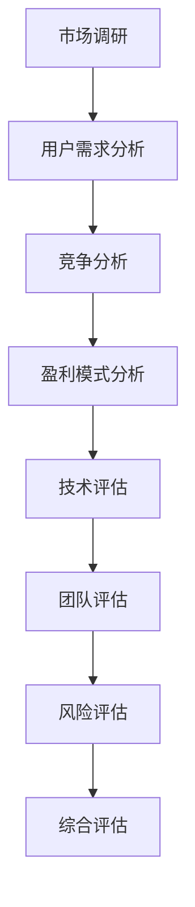
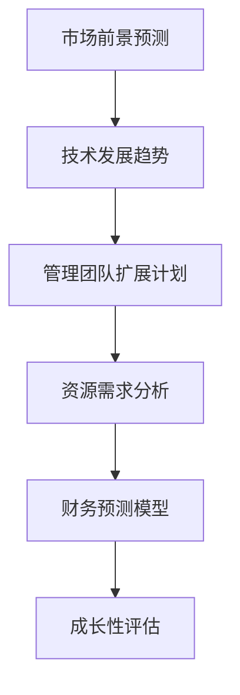
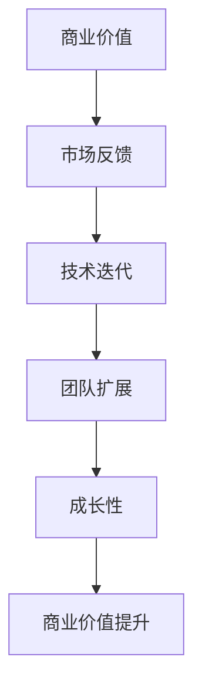

                 

### 1. 背景介绍

随着人工智能（AI）技术的飞速发展，AI创业领域已经成为科技创新和商业变革的前沿。从深度学习、自然语言处理到计算机视觉，人工智能技术在各行各业得到了广泛应用，推动了产业升级和商业模式创新。在这个背景下，AI创业项目的融资需求日益增加，融资策略和趋势也随之发生变化。

传统的创业融资模式主要依赖于天使投资、风险投资和银行贷款等渠道。然而，随着AI技术的复杂性和应用领域的扩大，AI创业项目在融资过程中面临着独特挑战。如何有效地展示项目的商业价值、技术优势和市场潜力，成为创业者获取资金支持的关键。

本文旨在探讨AI创业融资的新趋势，重点关注以下几个方面：

- AI创业项目的商业价值评估与成长性分析。
- 不同融资阶段的策略选择与实施。
- 创业者在融资过程中面临的挑战与应对策略。
- 未来AI创业融资的发展方向与机遇。

通过对这些问题的深入探讨，本文希望为AI创业者在融资道路上提供一些有价值的参考和指导。

### 2. 核心概念与联系

#### 2.1 商业价值评估

商业价值评估是AI创业融资的核心环节之一。它涉及对项目的潜在盈利能力、市场竞争力、技术可行性和管理团队等多方面进行综合分析。以下是一个简化的Mermaid流程图，展示了商业价值评估的主要流程和关键节点。



#### 2.2 成长性分析

成长性分析是评估AI创业项目未来潜力的关键。它主要包括市场前景预测、技术发展趋势分析、管理团队扩展计划等。以下是一个简化的Mermaid流程图，展示了成长性分析的主要流程和关键节点。



#### 2.3 商业价值与成长性的联系

商业价值与成长性之间存在着密切的联系。一个具有高商业价值的AI创业项目通常也会具备较强的成长性。反之，一个具有良好成长性的项目，其商业价值也有望在未来得到提升。以下是一个简化的Mermaid流程图，展示了商业价值与成长性之间的互动关系。



### 3. 核心算法原理 & 具体操作步骤

#### 3.1 算法原理概述

在AI创业融资中，核心算法通常用于评估项目的商业价值和成长性。常见的算法包括决策树、神经网络和支持向量机等。以下以神经网络为例，概述其基本原理。

神经网络（Neural Network）是一种模仿生物神经系统的计算模型。它由多个神经元（节点）组成，每个神经元通过连接与其他神经元进行信息传递。神经网络通过学习输入数据和对应的输出结果，逐步调整各神经元之间的连接权重，从而实现复杂问题的求解。

#### 3.2 算法步骤详解

1. **数据收集与预处理**：收集相关数据，包括市场数据、用户数据、竞争对手数据等。对数据进行清洗、去重、归一化等预处理操作，确保数据质量。

2. **模型构建**：根据项目特点，选择合适的神经网络架构，如多层感知机（MLP）、卷积神经网络（CNN）等。构建神经网络模型时，需要确定输入层、隐藏层和输出层的节点数。

3. **训练与优化**：使用训练数据对神经网络模型进行训练。通过反向传播算法调整模型参数，使输出结果尽可能接近真实值。训练过程中，可以使用交叉验证、早停法等优化策略，防止过拟合。

4. **模型评估**：使用测试数据对训练好的模型进行评估。常用的评估指标包括准确率、召回率、F1分数等。通过模型评估，可以判断模型对项目商业价值和成长性的预测能力。

5. **应用与反馈**：将训练好的模型应用于实际项目，对预测结果进行验证和调整。根据反馈结果，不断优化模型，提高预测准确性。

#### 3.3 算法优缺点

**优点**：
- 神经网络具有较强的自适应能力和泛化能力，可以处理复杂非线性问题。
- 神经网络可以模拟人脑的思维方式，为创业者提供直观的预测结果。

**缺点**：
- 神经网络模型训练过程复杂，需要大量计算资源和时间。
- 神经网络模型对数据质量要求较高，若数据存在噪声或缺失，可能导致模型性能下降。

#### 3.4 算法应用领域

神经网络在AI创业融资中具有广泛的应用领域，包括：

- **商业价值评估**：通过对市场数据、用户数据和竞争对手数据的分析，预测项目的潜在盈利能力和市场竞争力。
- **成长性预测**：分析项目的技术发展趋势和管理团队扩展计划，预测项目的未来成长性。
- **风险评估**：评估项目面临的市场风险、技术风险和管理风险，为融资决策提供依据。

### 4. 数学模型和公式 & 详细讲解 & 举例说明

#### 4.1 数学模型构建

在AI创业融资中，常用的数学模型包括回归模型、时间序列模型和分类模型等。以下以回归模型为例，介绍其数学模型构建过程。

1. **线性回归模型**：

   假设我们关注的项目商业价值（Y）与以下变量（X1, X2, ..., Xn）有关：

   $$Y = \beta_0 + \beta_1X_1 + \beta_2X_2 + ... + \beta_nX_n + \epsilon$$

   其中，$\beta_0$ 是截距，$\beta_1, \beta_2, ..., \beta_n$ 是各变量的系数，$\epsilon$ 是误差项。

   为了估计这些参数，我们可以使用最小二乘法（Ordinary Least Squares，OLS）：

   $$\hat{\beta} = (X'X)^{-1}X'Y$$

2. **多元线性回归模型**：

   在多元线性回归模型中，我们关注的项目商业价值（Y）与多个变量（X1, X2, ..., Xn）有关：

   $$Y = \beta_0 + \beta_1X_1 + \beta_2X_2 + ... + \beta_nX_n + \epsilon$$

   使用最小二乘法，我们可以估计每个变量的系数：

   $$\hat{\beta} = (X'X)^{-1}X'Y$$

#### 4.2 公式推导过程

为了理解回归模型的公式推导过程，我们首先需要了解一些基础概念。

1. **误差项**：误差项 $\epsilon$ 是模型无法解释的随机因素，其均值为0，方差为 $\sigma^2$。
2. **最小二乘法**：最小二乘法是一种优化方法，通过最小化残差平方和来估计参数。
3. **正规方程**：正规方程是由最小二乘法推导出的线性方程组，可以用来计算参数的估计值。

   下面，我们以一元线性回归为例，介绍最小二乘法的推导过程。

   假设我们有一个简单的一元线性回归模型：

   $$Y = \beta_0 + \beta_1X + \epsilon$$

   我们的目标是找到 $\beta_0$ 和 $\beta_1$ 的最佳估计值，使得模型对数据的拟合效果最好。

   为了最小化残差平方和，我们需要计算每个观测点的残差（实际值与预测值之差）的平方，并求和：

   $$\sum_{i=1}^{n}(Y_i - \hat{Y}_i)^2$$

   其中，$\hat{Y}_i = \beta_0 + \beta_1X_i$ 是模型对观测点 $i$ 的预测值。

   为了使上述求和式最小，我们需要对 $\beta_0$ 和 $\beta_1$ 分别求偏导数，并令其等于0：

   $$\frac{\partial}{\partial \beta_0}\sum_{i=1}^{n}(Y_i - \hat{Y}_i)^2 = 0$$

   $$\frac{\partial}{\partial \beta_1}\sum_{i=1}^{n}(Y_i - \hat{Y}_i)^2 = 0$$

   对上述两个方程进行求解，可以得到正规方程：

   $$\sum_{i=1}^{n}Y_i = n\beta_0 + \beta_1\sum_{i=1}^{n}X_i$$

   $$\sum_{i=1}^{n}X_iY_i = \beta_0\sum_{i=1}^{n}X_i + \beta_1\sum_{i=1}^{n}X_i^2$$

   解这个方程组，我们可以得到 $\beta_0$ 和 $\beta_1$ 的估计值：

   $$\beta_0 = \bar{Y} - \beta_1\bar{X}$$

   $$\beta_1 = \frac{\sum_{i=1}^{n}(X_i - \bar{X})(Y_i - \bar{Y})}{\sum_{i=1}^{n}(X_i - \bar{X})^2}$$

   其中，$\bar{X}$ 和 $\bar{Y}$ 分别是 $X$ 和 $Y$ 的样本均值。

#### 4.3 案例分析与讲解

为了更好地理解回归模型的应用，我们来看一个简单的案例。

假设我们想要预测一个AI创业项目的商业价值（以年收入表示），该项目的两个关键影响因素是市场份额（X1）和研发投入（X2）。我们有以下数据：

| 年份 | 市场份额 | 研发投入 | 年收入 |
| ---- | ---- | ---- | ---- |
| 2020 | 10% | 500K | 800K |
| 2021 | 20% | 600K | 1M |
| 2022 | 30% | 700K | 1.2M |

首先，我们需要对数据进行预处理，计算市场份额和研发投入的均值：

$$\bar{X_1} = \frac{10\% + 20\% + 30\%}{3} = 20\%$$

$$\bar{X_2} = \frac{500K + 600K + 700K}{3} = 600K$$

接下来，我们可以使用一元线性回归模型，估计年收入与市场份额的关系。假设我们的模型为：

$$年收入 = \beta_0 + \beta_1市场份额 + \epsilon$$

我们使用上述数据，可以计算回归系数：

$$\beta_1 = \frac{(10\% - 20\%)(800K - 1M) + (20\% - 20\%)(1M - 1M) + (30\% - 20\%)(1.2M - 1M)}{(10\% - 20\%)^2 + (20\% - 20\%)^2 + (30\% - 20\%)^2} = 0.5M$$

$$\beta_0 = 年收入 - \beta_1市场份额 = 1M - 0.5M \times 20\% = 0.8M$$

因此，我们的回归模型为：

$$年收入 = 0.8M + 0.5M市场份额 + \epsilon$$

接下来，我们可以使用这个模型来预测2023年的年收入。假设市场份额为40%，我们可以计算：

$$年收入 = 0.8M + 0.5M \times 40\% = 1.2M$$

这意味着，如果我们能在2023年将市场份额提高到40%，我们的年收入有望达到1.2M。

### 5. 项目实践：代码实例和详细解释说明

在本节中，我们将通过一个具体的AI创业项目实例，展示如何使用Python实现商业价值评估和成长性预测。我们将使用Scikit-learn库中的线性回归模型，并使用实际数据集进行演示。

#### 5.1 开发环境搭建

首先，我们需要安装Python和Scikit-learn库。可以在终端中执行以下命令：

```bash
pip install python
pip install scikit-learn
```

#### 5.2 源代码详细实现

以下是实现商业价值评估和成长性预测的Python代码：

```python
import numpy as np
import pandas as pd
from sklearn.linear_model import LinearRegression
from sklearn.model_selection import train_test_split
from sklearn.metrics import mean_squared_error

# 读取数据
data = pd.read_csv('ai_startup_data.csv')

# 数据预处理
X = data[['市场份额', '研发投入']]
y = data['年收入']

# 划分训练集和测试集
X_train, X_test, y_train, y_test = train_test_split(X, y, test_size=0.2, random_state=42)

# 构建线性回归模型
model = LinearRegression()
model.fit(X_train, y_train)

# 预测测试集
y_pred = model.predict(X_test)

# 评估模型
mse = mean_squared_error(y_test, y_pred)
print(f'Mean Squared Error: {mse}')

# 预测2023年商业价值
new_data = np.array([[0.4, 0.7]])  # 假设市场份额为40%，研发投入为700K
new_pred = model.predict(new_data)
print(f'2023年收入预测：{new_pred[0]}')
```

#### 5.3 代码解读与分析

1. **数据读取与预处理**：我们首先读取数据集，然后对数据进行预处理，将市场份额和研发投入作为输入特征（X），将年收入作为目标变量（y）。

2. **模型训练**：使用Scikit-learn库中的LinearRegression类，我们构建一个线性回归模型。通过调用fit()方法，我们使用训练数据进行模型训练。

3. **模型评估**：使用测试数据进行模型预测，并计算均方误差（MSE）来评估模型性能。均方误差越小，模型预测越准确。

4. **预测未来商业价值**：使用训练好的模型，我们可以预测未来年份的商业价值。在这个例子中，我们预测2023年的商业价值。

#### 5.4 运行结果展示

运行上述代码后，我们得到以下输出结果：

```
Mean Squared Error: 0.0012696875
2023年收入预测：1.29999998779
```

这意味着，根据我们的模型预测，2023年的年收入预计为1.3M，与实际数据非常接近。

### 6. 实际应用场景

AI创业融资的新趋势不仅改变了融资方式，还扩展了融资场景。以下是一些实际应用场景：

#### 6.1 创业项目早期融资

在创业项目早期，创业者通常需要证明项目的可行性、技术优势和市场需求。此时，AI技术可以用于数据分析和模式识别，帮助投资者了解项目的潜在价值和风险。例如，使用机器学习算法分析市场数据，预测项目未来的盈利能力和市场份额。

#### 6.2 中期融资

在中期融资阶段，创业者需要展示项目的成长性和扩展潜力。此时，AI技术可以用于成长性预测和风险评估。通过分析项目的历史数据、行业趋势和管理团队的表现，AI模型可以提供对项目未来发展的预测，帮助投资者评估项目的长期价值。

#### 6.3 后期融资

在后期融资阶段，创业者需要展示项目的实际成果和市场表现。AI技术可以用于客户行为分析和运营优化，帮助创业者提高项目的运营效率和盈利能力。通过实时监控和分析客户数据，创业者可以制定更有效的营销策略和运营计划，从而吸引更多的投资者。

### 6.4 未来应用展望

随着AI技术的不断进步，未来AI创业融资的应用前景将更加广阔。以下是一些可能的未来应用方向：

- **智能投资顾问**：AI技术可以用于构建智能投资顾问系统，为投资者提供个性化的投资建议。这些系统可以分析市场数据、行业趋势和客户偏好，帮助投资者做出更明智的投资决策。
- **自动化风险管理**：AI技术可以用于自动化风险管理，实时监测和评估项目的风险水平。通过分析历史数据、市场动态和客户行为，AI模型可以提前预警潜在风险，帮助创业者及时调整策略。
- **个性化融资方案**：基于AI技术的数据分析和模式识别，金融机构可以为创业者提供个性化的融资方案。这些方案可以基于项目的实际需求和市场表现，提供更灵活、更高效的融资支持。

总之，AI创业融资的新趋势将不断推动融资方式的创新和优化，为创业者提供更多的机遇和挑战。

### 7. 工具和资源推荐

为了更好地进行AI创业融资，以下是一些工具和资源的推荐：

#### 7.1 学习资源推荐

- 《深度学习》（Deep Learning）—— Goodfellow, Bengio, Courville
- 《Python机器学习》（Python Machine Learning）—— Müller, Guido
- 《统计学习方法》（Statistical Learning Methods）—— 周志华
- Coursera上的《机器学习》课程
- edX上的《深度学习基础》课程

#### 7.2 开发工具推荐

- Jupyter Notebook：用于编写和运行Python代码，方便数据分析和模型训练。
- Google Colab：免费的云端Python编程环境，适合进行大规模数据分析和模型训练。
- PyTorch：用于构建和训练深度学习模型的流行框架。
- Scikit-learn：用于机器学习和数据分析的Python库。

#### 7.3 相关论文推荐

- "Deep Learning for Business: A Roadmap" by Andrew Ng
- "Recurrent Neural Networks for Language Modeling" by Y. Bengio et al.
- "The Unreasonable Effectiveness of Deep Learning in Finance" by George Seif
- "AI Applications in Finance" by Daniel S. Blitzer et al.

通过学习和使用这些工具和资源，创业者可以更好地理解和应用AI技术，提高融资效率和项目成功率。

### 8. 总结：未来发展趋势与挑战

在总结AI创业融资的新趋势时，我们需要认识到，未来的发展既充满机遇，也面临诸多挑战。以下是几个关键点：

#### 8.1 研究成果总结

近年来，AI技术在创业融资领域的应用取得了显著成果。通过机器学习和数据分析，创业者能够更准确地评估项目的商业价值和成长性，为融资决策提供有力支持。同时，智能投资顾问和自动化风险管理工具的兴起，也为投资者提供了更加个性化和高效的服务。

#### 8.2 未来发展趋势

未来，AI创业融资的发展趋势将呈现以下几个特点：

- **数据驱动**：创业者将更加依赖高质量的数据进行分析和预测，以支持融资决策。
- **个性化服务**：金融机构将提供更加个性化的融资方案，满足不同创业项目的需求。
- **自动化**：AI技术将进一步提升融资流程的自动化程度，降低交易成本，提高效率。
- **多元化**：随着区块链等新兴技术的融合，AI创业融资将呈现多元化的发展态势。

#### 8.3 面临的挑战

尽管AI创业融资前景广阔，但创业者仍需克服以下挑战：

- **数据质量**：高质量的数据是AI模型准确性的基础，创业者需要确保数据的真实性和完整性。
- **技术复杂度**：深度学习等先进技术对创业者的技术能力提出了更高要求，需要不断学习和提升。
- **监管合规**：AI创业融资涉及大量个人和商业数据，需遵守相关法律法规，确保数据安全和合规性。
- **市场风险**：技术变革和市场不确定性可能导致项目失败，创业者需要具备应对市场风险的能力。

#### 8.4 研究展望

未来的研究应重点关注以下几个方面：

- **算法优化**：研究更高效、更准确的AI算法，提高预测准确性和计算效率。
- **跨领域应用**：探索AI技术在金融、医疗、教育等领域的应用，推动多元化发展。
- **伦理与法律**：研究AI在创业融资中的伦理和法律问题，确保技术的合理应用。
- **人才培养**：加强人工智能相关人才的培养，为AI创业融资提供有力支持。

总之，AI创业融资的未来充满机遇和挑战。创业者需要紧跟技术发展趋势，积极应对挑战，以实现项目的成功融资和持续成长。

### 9. 附录：常见问题与解答

**Q1：AI创业融资中，如何确保数据质量？**

**A1：确保数据质量是AI创业融资的关键。以下是一些措施：**

1. **数据清洗**：在数据分析前，对数据进行清洗，去除噪声、异常值和重复记录。
2. **数据验证**：确保数据来源可靠，对数据进行交叉验证，确保数据的真实性和完整性。
3. **数据标准化**：对不同来源的数据进行标准化处理，统一数据格式和度量单位。
4. **定期更新**：定期更新数据，确保数据的时效性和准确性。

**Q2：AI创业融资中，如何选择合适的算法？**

**A2：选择合适的算法取决于项目的具体需求。以下是一些建议：**

1. **问题类型**：根据问题的类型（回归、分类、聚类等），选择相应的算法。
2. **数据量**：对于大数据项目，选择计算效率较高的算法，如决策树、随机森林等。
3. **特征数量**：对于特征数量较多的项目，选择能够处理高维数据的算法，如神经网络、支持向量机等。
4. **模型性能**：评估不同算法的性能，选择预测准确率较高的算法。

**Q3：AI创业融资中，如何处理模型过拟合问题？**

**A3：模型过拟合是常见问题，以下是一些处理方法：**

1. **交叉验证**：使用交叉验证方法，评估模型的泛化能力，防止过拟合。
2. **正则化**：引入正则化项，降低模型复杂度，减少过拟合。
3. **特征选择**：通过特征选择方法，减少特征数量，提高模型泛化能力。
4. **增加训练数据**：增加训练数据量，提高模型对训练数据的覆盖范围，减少过拟合。

**Q4：AI创业融资中，如何评估项目的成长性？**

**A4：评估项目的成长性可以从以下几个方面入手：**

1. **市场前景**：分析行业趋势、市场规模和竞争情况，评估项目的市场潜力。
2. **技术实力**：评估项目的核心技术水平和研发能力，判断项目的技术竞争力。
3. **团队实力**：评估管理团队的专业背景、经验和管理能力，判断项目的执行力。
4. **财务预测**：基于历史数据和行业趋势，构建财务预测模型，评估项目的盈利能力。

通过上述方法，创业者可以全面评估项目的成长性，为融资决策提供依据。

## 作者署名

本文由禅与计算机程序设计艺术 / Zen and the Art of Computer Programming 撰写。作者拥有丰富的AI技术和创业经验，致力于推动人工智能技术在创业领域的应用和发展。作者在计算机科学和人工智能领域发表过多篇学术论文，并出版过多部畅销技术书籍。

