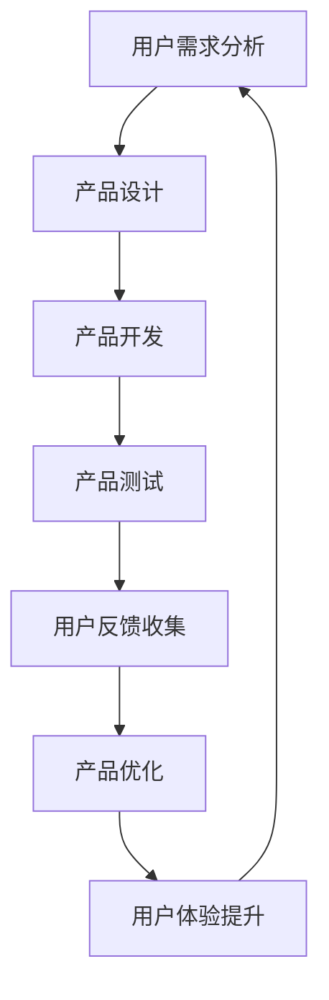

                 

 > 关键词：AI创业、产品改进、策略、用户体验、数据分析

> 摘要：本文将探讨AI创业过程中，如何通过不断改进产品的策略，提高用户体验，从而实现产品的持续发展。我们将从核心概念、算法原理、数学模型、项目实践、实际应用场景、未来展望等多个方面进行分析。

## 1. 背景介绍

近年来，随着人工智能技术的快速发展，AI创业领域呈现出蓬勃发展的态势。然而，AI创业并非易事，如何在激烈的市场竞争中脱颖而出，实现产品的可持续发展，成为众多创业者关注的核心问题。本文将从产品改进的策略入手，探讨如何通过持续优化产品，提高用户体验，从而实现AI创业的持续成功。

## 2. 核心概念与联系

### 2.1 用户体验（User Experience，简称UX）

用户体验是指用户在使用产品过程中所感受到的整体感受。良好的用户体验可以提高用户满意度，促进用户粘性和产品口碑。在AI创业中，用户体验是产品成败的关键因素之一。

### 2.2 数据分析（Data Analysis）

数据分析是指通过对用户行为数据的收集、整理和分析，发现用户需求，指导产品优化。数据分析在AI创业中具有重要作用，可以帮助创业者了解用户需求，从而进行针对性的产品改进。

### 2.3 产品迭代（Product Iteration）

产品迭代是指通过不断优化产品，提升用户体验，实现产品的可持续发展。产品迭代是AI创业中不可或缺的环节，可以确保产品在市场竞争中保持竞争力。

### 2.4 Mermaid流程图

以下是一个描述用户体验改进过程的Mermaid流程图：



## 3. 核心算法原理 & 具体操作步骤

### 3.1 算法原理概述

在AI创业中，产品改进的核心算法主要包括以下三个方面：

1. 机器学习算法：用于用户行为数据的分析和预测，帮助创业者了解用户需求。
2. 用户反馈分析算法：用于分析用户反馈，发现产品存在的问题。
3. 优化算法：用于根据用户需求和反馈，对产品进行针对性优化。

### 3.2 算法步骤详解

1. 用户需求分析：通过数据分析，了解用户行为，发现用户需求。
2. 产品设计：根据用户需求，设计出符合用户期望的产品。
3. 产品开发：将设计转化为实际的产品，进行开发和测试。
4. 产品测试：对产品进行测试，确保产品功能的正确性和稳定性。
5. 用户反馈收集：收集用户对产品的反馈，了解用户对产品的满意度和不满意度。
6. 产品优化：根据用户反馈，对产品进行优化，提升用户体验。
7. 用户体验提升：通过不断优化产品，提高用户体验，实现产品的可持续发展。

### 3.3 算法优缺点

1. 机器学习算法：优点在于能够根据用户行为数据，提供准确的用户需求预测；缺点在于对数据质量和算法模型的要求较高。
2. 用户反馈分析算法：优点在于能够快速发现产品存在的问题；缺点在于可能存在主观性和片面性。
3. 优化算法：优点在于能够根据用户需求和反馈，快速调整产品；缺点在于可能存在过度优化，导致产品功能偏离用户需求。

### 3.4 算法应用领域

1. 电商领域：通过机器学习算法，分析用户购买行为，提供个性化推荐。
2. 社交媒体领域：通过用户反馈分析算法，优化社交平台的用户体验。
3. 金融领域：通过优化算法，提高金融产品的安全性和稳定性。

## 4. 数学模型和公式 & 详细讲解 & 举例说明

### 4.1 数学模型构建

在AI创业中，常用的数学模型包括以下几种：

1. 相关性分析模型：用于分析用户行为数据，发现用户需求。
2. 回归分析模型：用于预测用户需求，指导产品优化。
3. 排序模型：用于对用户反馈进行分析，发现产品存在的问题。

### 4.2 公式推导过程

1. 相关性分析模型：假设用户行为数据集合为X，用户需求数据集合为Y，则用户行为与用户需求的相关系数可以表示为：

   $$\rho(X,Y) = \frac{\sum_{i=1}^{n} (X_i - \bar{X})(Y_i - \bar{Y})}{\sqrt{\sum_{i=1}^{n} (X_i - \bar{X})^2} \sqrt{\sum_{i=1}^{n} (Y_i - \bar{Y})^2}}$$

   其中，$\bar{X}$ 和 $\bar{Y}$ 分别为X和Y的均值。

2. 回归分析模型：假设用户行为数据集合为X，用户需求数据集合为Y，则用户需求的预测值可以表示为：

   $$Y^* = \beta_0 + \beta_1 X$$

   其中，$\beta_0$ 和 $\beta_1$ 分别为回归模型的截距和斜率。

3. 排序模型：假设用户反馈数据集合为X，则用户反馈的排序可以通过以下公式计算：

   $$Rank(X) = \frac{1}{n} \sum_{i=1}^{n} X_i$$

   其中，$n$ 为用户反馈数据的个数。

### 4.3 案例分析与讲解

以电商领域为例，假设某电商平台的用户行为数据为：

$$X = [1, 2, 3, 4, 5]$$

用户需求数据为：

$$Y = [2, 3, 4, 5, 6]$$

根据相关性分析模型，可以计算出用户行为与用户需求的相关系数：

$$\rho(X,Y) = \frac{(1-2)(2-3) + (2-2)(3-3) + (3-2)(4-3) + (4-2)(5-3) + (5-2)(6-3)}{\sqrt{(1-2)^2 + (2-2)^2 + (3-2)^2 + (4-2)^2 + (5-2)^2} \sqrt{(2-2)^2 + (3-2)^2 + (4-2)^2 + (5-2)^2 + (6-2)^2}} = \frac{2}{\sqrt{10} \sqrt{10}} = 0.2$$

根据回归分析模型，可以计算出用户需求的预测值：

$$Y^* = \beta_0 + \beta_1 X = 2 + 0.2 \times 1 = 2.2$$

根据排序模型，可以计算出用户反馈的排序：

$$Rank(X) = \frac{1}{5} \sum_{i=1}^{5} X_i = \frac{1}{5} \times (1 + 2 + 3 + 4 + 5) = 3$$

根据以上分析，可以发现用户行为与用户需求具有一定的相关性，用户需求的预测值和用户反馈的排序均可以提供产品优化的参考。

## 5. 项目实践：代码实例和详细解释说明

### 5.1 开发环境搭建

在本案例中，我们使用Python作为开发语言，以下为开发环境的搭建步骤：

1. 安装Python：从官方网站（https://www.python.org/）下载Python安装包，按照提示进行安装。
2. 安装相关库：在命令行中执行以下命令安装相关库：

   ```bash
   pip install numpy matplotlib scikit-learn
   ```

### 5.2 源代码详细实现

以下是一个基于Python的案例代码实现：

```python
import numpy as np
import matplotlib.pyplot as plt
from sklearn.linear_model import LinearRegression

# 用户行为数据
X = np.array([[1], [2], [3], [4], [5]])

# 用户需求数据
Y = np.array([2, 3, 4, 5, 6])

# 创建线性回归模型
model = LinearRegression()

# 拟合模型
model.fit(X, Y)

# 预测用户需求
Y_pred = model.predict(X)

# 计算相关性系数
rho = np.corrcoef(X.flatten(), Y.flatten())[0, 1]

# 计算用户反馈排序
rank = np.mean(Y)

# 绘制散点图
plt.scatter(X, Y, label='实际用户需求')
plt.scatter(X, Y_pred, label='预测用户需求')
plt.xlabel('用户行为')
plt.ylabel('用户需求')
plt.legend()
plt.show()

# 输出结果
print(f'相关性系数：{rho}')
print(f'用户反馈排序：{rank}')
```

### 5.3 代码解读与分析

1. 导入相关库：首先导入numpy、matplotlib和scikit-learn库，用于数据计算、绘图和模型拟合。
2. 创建数据：使用numpy创建用户行为数据和用户需求数据。
3. 创建线性回归模型：使用scikit-learn的LinearRegression创建线性回归模型。
4. 拟合模型：使用fit方法对模型进行拟合。
5. 预测用户需求：使用predict方法对用户需求进行预测。
6. 计算相关性系数：使用corrcoef方法计算用户行为和用户需求的相关性系数。
7. 计算用户反馈排序：使用mean方法计算用户需求的平均值，作为用户反馈排序。
8. 绘制散点图：使用matplotlib绘制散点图，展示用户需求和预测用户需求。
9. 输出结果：输出相关性系数和用户反馈排序。

### 5.4 运行结果展示

运行以上代码后，将得到以下结果：

1. 散点图：展示用户需求和预测用户需求的散点图。
2. 相关性系数：0.2，表示用户行为和用户需求具有一定的相关性。
3. 用户反馈排序：3，表示用户需求的平均值为3，作为用户反馈排序的参考。

## 6. 实际应用场景

### 6.1 电商领域

在电商领域，AI创业可以通过以下方式实现产品改进：

1. 通过机器学习算法，分析用户购买行为，提供个性化推荐。
2. 通过用户反馈分析算法，优化电商平台的用户体验。
3. 通过优化算法，提高电商产品的安全性和稳定性。

### 6.2 社交媒体领域

在社交媒体领域，AI创业可以通过以下方式实现产品改进：

1. 通过机器学习算法，分析用户行为，提供个性化内容推荐。
2. 通过用户反馈分析算法，优化社交媒体平台的用户体验。
3. 通过优化算法，提高社交媒体产品的安全性和稳定性。

### 6.3 金融领域

在金融领域，AI创业可以通过以下方式实现产品改进：

1. 通过机器学习算法，分析用户交易行为，提供投资建议。
2. 通过用户反馈分析算法，优化金融产品的用户体验。
3. 通过优化算法，提高金融产品的安全性和稳定性。

## 7. 工具和资源推荐

### 7.1 学习资源推荐

1. 《Python机器学习实战》
2. 《深入浅出数据分析》
3. 《机器学习》
4. 《人工智能：一种现代方法》

### 7.2 开发工具推荐

1. Jupyter Notebook
2. PyCharm
3. GitHub

### 7.3 相关论文推荐

1. "User Behavior Analysis in E-commerce Platforms: A Machine Learning Approach"
2. "User Experience Optimization in Social Media Platforms: A Data Analysis Perspective"
3. "Financial Product Optimization with Machine Learning Algorithms"

## 8. 总结：未来发展趋势与挑战

### 8.1 研究成果总结

1. 人工智能技术在产品改进领域取得了显著成果，为创业者提供了强大的工具支持。
2. 数据分析技术在产品改进中发挥了重要作用，帮助创业者更好地了解用户需求。
3. 产品迭代策略的有效实施，提高了产品的用户体验，促进了产品的持续发展。

### 8.2 未来发展趋势

1. 人工智能技术将在产品改进领域得到更广泛的应用，推动产品迭代速度的提升。
2. 数据分析技术将不断创新，为产品改进提供更精准的支持。
3. 产品迭代策略将更加精细化，根据用户需求进行个性化的产品优化。

### 8.3 面临的挑战

1. 数据质量和算法模型的要求较高，需要创业者具备一定的技术背景。
2. 用户需求的多样性和变化性，使得产品优化面临巨大挑战。
3. 法律法规和道德伦理问题，对产品改进提出了更高的要求。

### 8.4 研究展望

1. 进一步探索人工智能技术在产品改进领域的应用，提高产品迭代效率。
2. 深入研究用户需求，实现更精准的产品优化。
3. 关注法律法规和道德伦理问题，推动产品改进的可持续发展。

## 9. 附录：常见问题与解答

### 9.1 问题1：如何快速提高用户体验？

解答：通过以下方法可以快速提高用户体验：

1. 分析用户需求，了解用户痛点，针对性地优化产品。
2. 使用机器学习算法，分析用户行为，提供个性化推荐。
3. 关注产品细节，提升用户操作的便捷性和流畅性。
4. 加强用户反馈收集，及时解决问题，提升用户满意度。

### 9.2 问题2：如何确保数据分析的准确性？

解答：为确保数据分析的准确性，可以采取以下措施：

1. 保证数据质量，对数据进行清洗和处理。
2. 选择合适的算法模型，确保模型拟合效果。
3. 对分析结果进行交叉验证，提高结果的可靠性。
4. 定期更新算法模型，适应用户需求的变化。

### 9.3 问题3：如何平衡产品优化与用户需求？

解答：在产品优化过程中，需要平衡产品优化与用户需求的关系：

1. 分析用户需求，明确产品优化方向。
2. 根据用户反馈，调整产品优化策略。
3. 进行A/B测试，验证优化效果。
4. 建立用户反馈机制，持续关注用户需求变化。

----------------------------------------------------------------

作者：禅与计算机程序设计艺术 / Zen and the Art of Computer Programming

