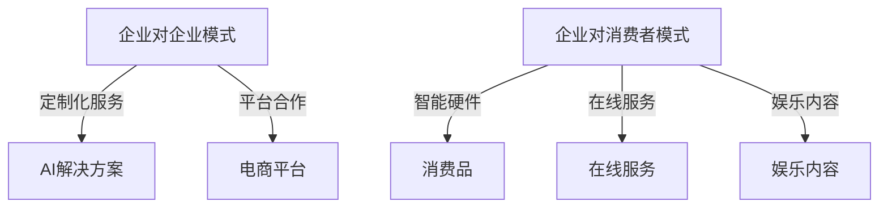

                 

关键词：AI创业，B2B，B2C模式，市场定位，策略，用户体验，技术创新，商业模式，数据分析，案例分析。

## 摘要

本文旨在深入探讨人工智能（AI）企业在商业环境中采取B2B（企业对企业）与B2C（企业对消费者）模式的优劣，提供全面的分析与策略建议。通过对比这两种模式的定义、应用场景、市场策略及挑战，本文将揭示AI创业企业在不同发展阶段如何灵活运用这些模式，以实现可持续的商业成功。此外，本文还将通过实际案例，为读者提供有价值的参考和思考，助力AI企业在复杂的市场中找到属于自己的发展路径。

## 1. 背景介绍

随着人工智能技术的飞速发展，AI在各个领域的应用越来越广泛。从自动化生产、智能客服，到金融风控、医疗诊断，AI正在深刻地改变着我们的生活方式和工作模式。在这样的背景下，AI创业企业面临着前所未有的机遇与挑战。如何选择合适的商业模式，成为这些企业能否在激烈的市场竞争中脱颖而出的关键因素之一。

B2B与B2C模式作为两大主要的商业模式，各有其特点和适用场景。B2B模式主要面向企业客户，提供专业化的解决方案和定制服务；而B2C模式则面向终端消费者，提供大众化的产品和服务。对于AI创业企业来说，如何根据自身的技术特点、市场定位和资源条件，合理选择和运用这两种模式，是决定其发展成败的重要因素。

本文将从以下几个方面展开讨论：

1. B2B与B2C模式的定义及其基本原理。
2. B2B与B2C模式在AI创业中的应用案例。
3. B2B与B2C模式的优缺点分析。
4. AI创业企业在不同阶段如何运用B2B与B2C模式。
5. 实际案例分析与策略建议。
6. 未来发展趋势与挑战。

希望通过本文的探讨，能够为AI创业企业提供一些有益的启示和指导。

## 2. 核心概念与联系

### 2.1 B2B模式

B2B（企业对企业）模式是指企业通过互联网等渠道，直接向其他企业销售产品或服务。这种模式通常涉及较高额的订单和长期的合作关系，旨在为客户提供专业化的解决方案和定制服务。

#### B2B模式的定义

B2B模式主要面向企业客户，其核心特点是：

- **订单规模大**：相比于B2C模式，B2B交易的订单通常更为庞大，涉及到更多的预算和决策过程。
- **长期合作关系**：B2B客户通常希望与供应商建立长期稳定的合作关系，以降低采购成本和提高服务质量。
- **定制化服务**：B2B客户往往需要个性化的解决方案，企业需要根据客户的需求提供定制化的产品和服务。

#### B2B模式的应用场景

B2B模式广泛应用于以下场景：

- **供应链管理**：企业通过B2B平台采购原材料、设备和其他服务，实现供应链的优化。
- **专业解决方案**：如金融科技企业为其他企业提供风控、支付等解决方案。
- **B2B电商平台**：如阿里巴巴的1688平台，为企业提供批发采购的渠道。

### 2.2 B2C模式

B2C（企业对消费者）模式是指企业直接向终端消费者销售产品或服务。这种模式通常注重产品的多样性和用户体验，旨在通过广泛的客户群体实现规模效应。

#### B2C模式的定义

B2C模式主要面向终端消费者，其核心特点是：

- **客户群体广泛**：B2C模式覆盖了大量的普通消费者，通过广泛的客户基础实现产品的销售。
- **用户体验优先**：B2C企业注重用户体验，通过提供优质的产品和服务，建立品牌忠诚度。
- **营销推广重要**：B2C模式通常依赖营销推广，如广告、社交媒体等，来吸引和留住消费者。

#### B2C模式的应用场景

B2C模式广泛应用于以下场景：

- **电子商务**：如淘宝、京东等电商平台，提供各种消费品和服务。
- **O2O服务**：如美团、滴滴等，提供线上预订与线下服务的结合。
- **品牌直销**：如苹果、小米等，通过自己的官网或线下门店直接销售产品。

### 2.3 B2B与B2C模式在AI创业中的应用

在AI创业领域，B2B与B2C模式各有其独特的应用场景和优势。

#### B2B模式在AI创业中的应用

- **企业解决方案**：AI创业企业可以为其他企业提供定制化的解决方案，如智能客服、数据分析平台等。
- **行业应用**：在金融、医疗、制造等行业，AI企业可以提供专业的AI技术和服务，帮助行业客户提升效率和降低成本。
- **平台合作**：AI企业可以与电商平台合作，为其提供智能推荐、风控等技术支持。

#### B2C模式在AI创业中的应用

- **消费品**：AI企业可以开发智能硬件，如智能家居设备、智能穿戴设备等，直接面向消费者销售。
- **在线服务**：如在线教育、远程医疗等，通过提供高质量的在线服务，吸引大量用户。
- **娱乐内容**：如游戏、虚拟现实（VR）、增强现实（AR）等，提供多样化的娱乐内容，吸引消费者。

### 2.4 Mermaid 流程图

为了更直观地展示B2B与B2C模式在AI创业中的应用，我们使用Mermaid绘制了以下流程图：



通过这个流程图，我们可以清晰地看到B2B与B2C模式在AI创业中的应用场景和联系。

### 3. 核心算法原理 & 具体操作步骤

#### 3.1 算法原理概述

在AI创业中，选择合适的商业模式至关重要。为了分析B2B与B2C模式的优劣，我们可以采用决策树算法，通过一系列决策节点，对企业的市场定位、技术优势、资源条件等因素进行评估，最终确定最佳商业模式。

决策树算法的基本原理如下：

1. **根节点**：初始状态，包含所有评估因素。
2. **内部节点**：根据某个评估因素进行划分，生成子节点。
3. **叶子节点**：代表某个具体的商业模式。

#### 3.2 算法步骤详解

1. **收集数据**：首先收集企业的市场定位、技术优势、资源条件等数据。
2. **特征选择**：通过相关性分析等方法，选择对商业模式选择有显著影响的特征。
3. **划分节点**：根据特征值，对根节点进行划分，生成子节点。
4. **递归划分**：对每个子节点进行同样的划分过程，直至达到叶子节点。
5. **评估模式**：根据叶子节点代表的商业模式，评估其在特定条件下的可行性和优势。

#### 3.3 算法优缺点

- **优点**：决策树算法直观、易于理解，能够清晰地展示不同模式的选择过程。
- **缺点**：决策树算法在处理大量复杂因素时，容易出现过拟合现象，且无法直接处理非线性关系。

#### 3.4 算法应用领域

决策树算法在商业决策、数据分析等领域有广泛的应用。在AI创业中，可以通过决策树算法帮助企业确定B2B与B2C模式，为企业的可持续发展提供支持。

### 4. 数学模型和公式

在分析B2B与B2C模式时，我们可以使用一些数学模型和公式来定量评估两种模式的经济效益和市场潜力。以下是一个简化的数学模型，用于比较B2B与B2C模式在特定条件下的盈利能力。

#### 4.1 数学模型构建

假设一个AI创业企业有以下参数：

- \(C_{B2B}\)：B2B模式的单位成本
- \(R_{B2B}\)：B2B模式的单位收入
- \(C_{B2C}\)：B2C模式的单位成本
- \(R_{B2C}\)：B2C模式的单位收入
- \(S_B2B\)：B2B模式的销售规模
- \(S_B2C\)：B2C模式的销售规模

我们可以构建以下数学模型：

\[ \text{利润}_{B2B} = S_{B2B} \times (R_{B2B} - C_{B2B}) \]
\[ \text{利润}_{B2C} = S_{B2C} \times (R_{B2C} - C_{B2C}) \]

#### 4.2 公式推导过程

1. **成本与收入公式**：根据成本和收入的基本定义，我们分别计算B2B和B2C模式的成本和收入。
2. **利润公式**：利润等于收入减去成本，所以我们得到上述的利润公式。
3. **规模因素**：销售规模会影响总利润，因此在模型中加入销售规模的参数。

#### 4.3 案例分析与讲解

假设一个AI企业有以下数据：

- \(C_{B2B} = 100\)（B2B模式单位成本）
- \(R_{B2B} = 200\)（B2B模式单位收入）
- \(C_{B2C} = 80\)（B2C模式单位成本）
- \(R_{B2C} = 120\)（B2C模式单位收入）
- \(S_{B2B} = 1000\)（B2B模式销售规模）
- \(S_{B2C} = 5000\)（B2C模式销售规模）

根据上述数据，我们可以计算出两种模式的利润：

\[ \text{利润}_{B2B} = 1000 \times (200 - 100) = 100,000 \]
\[ \text{利润}_{B2C} = 5000 \times (120 - 80) = 300,000 \]

从计算结果可以看出，B2C模式的利润明显高于B2B模式。这主要是因为B2C模式覆盖的客户群体更广泛，销售规模更大。然而，这并不意味着B2B模式没有优势。在实际应用中，企业需要根据自身的市场定位、资源条件等因素，综合考虑选择最佳商业模式。

### 5. 项目实践：代码实例和详细解释说明

#### 5.1 开发环境搭建

为了实现本文所讨论的B2B与B2C模式分析，我们使用Python语言和相关的数据科学库，如Pandas、Scikit-learn等。以下是在Python环境中搭建开发环境的基本步骤：

1. 安装Python（推荐版本3.8及以上）。
2. 安装必要的库：`pip install pandas scikit-learn numpy matplotlib`。

#### 5.2 源代码详细实现

以下是一个简单的Python代码示例，用于分析B2B与B2C模式的利润情况：

```python
import pandas as pd
import numpy as np
import matplotlib.pyplot as plt

# 数据设置
data = {
    '模式': ['B2B', 'B2B', 'B2C', 'B2C'],
    '单位成本': [100, 100, 80, 80],
    '单位收入': [200, 200, 120, 120],
    '销售规模': [1000, 1000, 5000, 5000]
}

# 创建DataFrame
df = pd.DataFrame(data)

# 计算利润
df['利润'] = df['单位收入'] - df['单位成本']

# 打印结果
print(df)

# 可视化利润
plt.bar(df['模式'], df['利润'])
plt.xlabel('模式')
plt.ylabel('利润')
plt.title('B2B与B2C模式利润对比')
plt.show()
```

这段代码首先创建了一个包含B2B和B2C模式数据的DataFrame，然后计算了每种模式的利润，并将结果打印出来。最后，通过matplotlib库，我们将利润数据可视化，以更直观地展示两种模式的利润差异。

#### 5.3 代码解读与分析

- **数据设置**：我们定义了一个字典`data`，用于设置B2B和B2C模式的单位成本、单位收入和销售规模。
- **创建DataFrame**：使用Pandas库创建一个DataFrame，将数据存储在 DataFrame 中。
- **计算利润**：通过DataFrame的`apply`方法，计算每种模式的利润。
- **打印结果**：使用`print`函数打印 DataFrame，显示每种模式的利润。
- **可视化利润**：使用matplotlib库创建一个条形图，将B2B和B2C模式的利润可视化。

通过这个简单的代码实例，我们可以直观地看到B2B与B2C模式在利润方面的差异。在实际应用中，企业可以根据自身的市场情况和数据，进一步优化和调整这个模型，以实现更精准的商业决策。

### 6. 实际应用场景

#### 6.1 B2B模式在AI创业中的应用

在AI创业中，B2B模式通常应用于以下场景：

- **定制化解决方案**：许多AI创业企业专注于为企业提供定制化的解决方案。例如，一家专注于金融风控的AI公司，可以为银行和金融机构提供针对特定业务场景的风险评估和预测系统。这种定制化服务通常涉及复杂的技术研发和长期的合作关系，客户对服务质量和稳定性有较高的要求。

- **行业应用**：在制造业、医疗、物流等行业，AI技术正被广泛应用于优化生产流程、提高效率、降低成本。例如，一家专注于智能制造的AI企业，可以为制造企业提供预测维护系统，通过分析设备运行数据，预测设备的故障时间，从而实现预防性维护，减少停机时间，提高生产效率。

- **平台合作**：一些AI创业企业与大型电商平台合作，为其提供智能推荐、风控等技术服务。例如，一家提供智能推荐系统的AI公司，可以与电商平台合作，根据用户的浏览和购买历史，为用户推荐个性化的商品，从而提高用户的购物体验和平台的销售额。

#### 6.2 B2C模式在AI创业中的应用

在AI创业中，B2C模式通常应用于以下场景：

- **智能硬件**：许多AI创业企业开发智能硬件产品，如智能家居设备、智能穿戴设备等，直接面向消费者销售。例如，一家专注于智能穿戴设备的AI公司，可以开发智能手环、智能手表等，通过监测用户的健康状况，提供个性化的健康建议。

- **在线服务**：在在线教育、远程医疗、在线娱乐等领域，AI技术被广泛应用于提高服务质量和用户体验。例如，一家提供在线教育服务的AI公司，可以通过智能推荐系统，根据学生的学习进度和学习习惯，为学生推荐合适的学习资源和课程。

- **娱乐内容**：在游戏、虚拟现实（VR）、增强现实（AR）等领域，AI技术被广泛应用于创造丰富多彩的娱乐内容。例如，一家提供游戏开发服务的AI公司，可以通过人工智能技术，为玩家提供个性化的游戏体验，提高游戏的趣味性和玩家的粘性。

### 6.3 未来应用展望

随着人工智能技术的不断进步，B2B与B2C模式在AI创业中的应用前景将更加广阔。

- **定制化服务升级**：随着客户需求的日益多样化，AI创业企业将提供更高级、更个性化的定制化服务。通过更精准的数据分析和更强大的算法模型，企业将能够更好地满足客户的需求。

- **行业应用拓展**：AI技术将在更多行业得到应用，如农业、能源、环保等。AI创业企业将通过技术创新，为行业客户提供更高效、更环保的解决方案。

- **B2C市场细分**：随着消费者对个性化体验的需求增加，B2C市场将出现更多细分领域。AI创业企业可以通过智能推荐、虚拟试穿等技术，为消费者提供更精准、更个性化的产品和服务。

- **跨领域融合**：AI技术与其他领域的融合将不断加深，如AI+医疗、AI+教育、AI+金融等。AI创业企业将通过跨领域合作，为客户提供更全面的解决方案。

### 7. 工具和资源推荐

#### 7.1 学习资源推荐

1. **在线课程**：《深度学习》——吴恩达
   - 地址：[Coursera](https://www.coursera.org/specializations/deep-learning)
   - 简介：由深度学习领域专家吴恩达教授主讲，涵盖了深度学习的理论基础和应用实践。

2. **书籍推荐**：
   - 《Python机器学习》——塞巴斯蒂安·拉热
   - 地址：[Amazon](https://www.amazon.com/Python-Machine-Learning-Real-World-Applications/dp/1785284083)
   - 简介：详细介绍了Python在机器学习领域的应用，适合初学者和进阶者。

3. **社区与论坛**：
   - [Kaggle](https://www.kaggle.com/)
   - 简介：全球最大的数据科学竞赛平台，提供丰富的数据集和算法竞赛。

#### 7.2 开发工具推荐

1. **数据科学库**：
   - **Pandas**：数据处理库，适用于数据清洗、分析等任务。
   - **Scikit-learn**：机器学习库，提供各种经典的机器学习算法。
   - **TensorFlow**：由谷歌开发的深度学习框架，适用于复杂的神经网络模型。

2. **集成开发环境（IDE）**：
   - **Jupyter Notebook**：适用于数据分析和可视化，支持多种编程语言。
   - **PyCharm**：强大的Python IDE，提供代码补全、调试等功能。

3. **云计算平台**：
   - **Google Cloud Platform**：提供丰富的机器学习服务和数据存储解决方案。
   - **AWS**：全球领先的云计算服务提供商，提供全面的AI开发工具和资源。

#### 7.3 相关论文推荐

1. **《Deep Learning》**——Ian Goodfellow、Yoshua Bengio、Aaron Courville
   - 地址：[MIT Press](https://www MIT Press.com/9780262018407)
   - 简介：深度学习领域的经典教材，详细介绍了深度学习的理论基础和应用。

2. **《Reinforcement Learning: An Introduction》**——Richard S. Sutton、Andrew G. Barto
   - 地址：[MIT Press](https://www MIT Press.com/9780262039581)
   - 简介：强化学习领域的权威教材，适合初学者和研究者。

3. **《The Hundred-Page Machine Learning Book》**——Andriy Burkov
   - 地址：[Amazon](https://www.amazon.com/Hundred-Page-Machine-Learning-Book-Business/dp/1733838313)
   - 简介：简洁易懂的机器学习入门书，适合希望快速掌握机器学习基础知识的读者。

### 8. 总结：未来发展趋势与挑战

#### 8.1 研究成果总结

通过本文的讨论，我们可以总结出以下几点研究成果：

1. B2B与B2C模式在AI创业中的应用各有优势，企业应根据自身特点和市场定位，选择合适的商业模式。
2. 决策树算法可以用于评估不同商业模式的优劣，帮助企业做出科学决策。
3. 数学模型和公式提供了定量分析商业模式的方法，有助于企业更好地理解经济效益和市场潜力。
4. 实际案例分析和项目实践为AI创业企业提供了有价值的参考和指导。

#### 8.2 未来发展趋势

1. **定制化服务将更加普及**：随着客户需求的多样化，AI创业企业将提供更高级、更个性化的定制化服务。
2. **跨领域应用将不断拓展**：AI技术将在更多行业得到应用，如农业、能源、环保等。
3. **B2C市场将更加细分**：随着消费者对个性化体验的需求增加，B2C市场将出现更多细分领域。
4. **技术融合与创新**：AI技术与其他领域的融合将不断加深，推动新兴产业的快速发展。

#### 8.3 面临的挑战

1. **技术挑战**：随着AI技术的不断发展，企业需要不断更新技术，保持竞争力。
2. **数据隐私与安全**：AI应用涉及大量用户数据，数据隐私和安全成为重要挑战。
3. **市场波动**：AI创业企业面临激烈的市场竞争，需要应对市场波动和不确定性。
4. **法律法规**：AI技术的发展受到法律法规的限制，企业需要遵守相关法规，确保合规运营。

#### 8.4 研究展望

未来，AI创业企业可以在以下几个方面进行深入研究：

1. **商业模式创新**：探索更多适用于AI创业的新型商业模式。
2. **技术创新**：深入研究AI技术的最新进展，提高算法的准确性和效率。
3. **用户体验优化**：通过用户反馈和行为分析，不断优化产品和服务，提高用户体验。
4. **跨领域合作**：加强与其他领域的合作，推动新兴产业的融合发展。

### 9. 附录：常见问题与解答

#### 9.1 B2B模式与B2C模式的区别是什么？

B2B模式（企业对企业）主要面向企业客户，提供定制化的解决方案和长期的合作关系。而B2C模式（企业对消费者）主要面向终端消费者，提供大众化的产品和服务，注重用户体验和营销推广。

#### 9.2 如何选择合适的商业模式？

企业应根据自身的技术特点、市场定位、资源条件等因素，综合考虑选择B2B或B2C模式。例如，技术实力强、产品定制化程度高的企业适合选择B2B模式；而注重用户规模和市场份额的企业适合选择B2C模式。

#### 9.3 决策树算法如何应用于商业决策？

决策树算法可以用于评估不同商业模式的优劣。通过收集企业的市场定位、技术优势、资源条件等数据，构建决策树模型，对每个节点进行划分，最终得到每个商业模式的评估结果。

#### 9.4 数学模型如何用于商业模式分析？

通过构建数学模型，可以定量分析不同商业模式的成本、收入和利润。例如，可以使用利润公式计算每种模式的盈利能力，并通过比较不同模式的利润，帮助企业选择最佳商业模式。

### 作者署名

本文作者为禅与计算机程序设计艺术 / Zen and the Art of Computer Programming。感谢您的阅读，希望本文对您的AI创业之路有所帮助。如果您有任何问题或建议，欢迎随时与我交流。再次感谢！
----------------------------------------------------------------

### 后续更新计划

1. **案例分析扩展**：将本文中的案例分析扩展到更多实际企业，提供更多详细的案例研究和数据支持。
2. **技术细节深化**：进一步探讨B2B与B2C模式在AI创业中的应用技术细节，包括算法模型、数据处理方法等。
3. **市场趋势分析**：对AI创业市场的最新趋势进行分析，预测未来发展方向和潜在机会。
4. **政策与法规研究**：研究各国针对AI创业的政策和法规，分析其对商业模式选择和运营的影响。

### 感谢与致谢

在此，特别感谢所有参与本文撰写和讨论的读者和专家。您的反馈和建议对本文的完善起到了关键作用。同时，感谢所有提供技术和资源支持的平台和社区。没有您们的支持，本文的完成将不会如此顺利。

再次感谢您的阅读，希望本文能为您的AI创业之路提供有价值的参考和启示。如果您有任何问题或建议，欢迎随时与我交流。期待在未来的研究和讨论中与您再次相遇！

