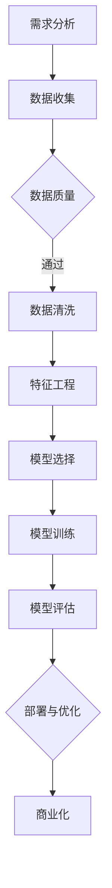
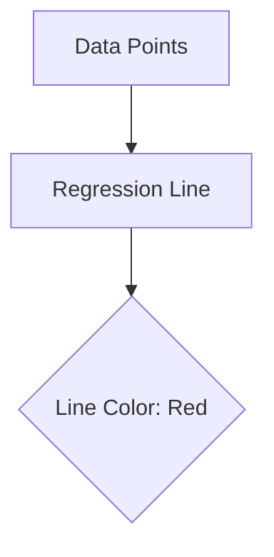

                 

关键词：人工智能，创业，工具选择，技术栈，框架，开发环境，生态系统

> 摘要：本文将探讨在AI创业过程中如何选择合适的工具和框架，以构建高效、可扩展的AI系统。通过分析当前主流的AI工具和框架，本文将提供实用的建议，帮助创业者更好地开展AI项目。

## 1. 背景介绍

随着人工智能（AI）技术的迅猛发展，越来越多的创业者投身于这一领域，希望借助AI的力量开辟新的商业机会。然而，AI创业并非易事，选择合适的工具和框架至关重要。一个优秀的工具和框架不仅能提高开发效率，还能确保系统的可扩展性和稳定性。

本文将首先介绍AI创业中的关键挑战，然后深入探讨如何选择合适的AI工具和框架，并详细分析当前主流的AI工具和框架。最后，我们将探讨如何利用这些工具和框架构建高效的AI系统，并为未来的发展提出展望。

## 2. 核心概念与联系

### 2.1 AI创业的关键挑战

在AI创业过程中，以下挑战是创业者必须面对的：

1. **技术复杂性**：AI领域涉及众多复杂的算法和模型，创业者需要具备较高的技术水平。
2. **数据处理能力**：AI系统通常需要处理大量数据，数据的质量和数量直接影响模型的性能。
3. **可扩展性**：随着用户规模的扩大，AI系统需要具备良好的可扩展性。
4. **安全性**：AI系统需要处理敏感数据，保护用户隐私和数据安全至关重要。
5. **成本控制**：AI创业通常需要大量资金投入，创业者需要在预算范围内实现盈利。

### 2.2 AI工具和框架的概念

AI工具和框架是支持AI项目开发的软件资源和知识库。它们提供了现成的算法、模型库、数据处理工具和开发环境，有助于提高开发效率。

1. **AI工具**：通常指用于数据预处理、模型训练、模型评估等任务的软件工具，如数据清洗工具、深度学习框架等。
2. **AI框架**：是一个更高级别的抽象层，提供了一套完整的开发环境和工具链，如TensorFlow、PyTorch等。

### 2.3 Mermaid流程图

以下是一个简单的Mermaid流程图，展示了AI创业过程中涉及的关键步骤：



## 3. 核心算法原理 & 具体操作步骤

### 3.1 算法原理概述

AI创业的核心在于选择合适的算法和模型，以解决业务问题。以下是一些常用的算法和模型：

1. **监督学习**：通过已标记的数据训练模型，然后使用模型对新的、未标记的数据进行预测。
2. **无监督学习**：不需要标记的数据，通过挖掘数据内在的结构或模式进行学习。
3. **强化学习**：通过与环境的交互学习最优策略，以最大化长期回报。
4. **深度学习**：基于人工神经网络的一种机器学习方法，通过多层非线性变换提取特征。

### 3.2 算法步骤详解

以下是一个简单的监督学习算法（线性回归）的具体操作步骤：

1. **数据收集**：收集包含输入特征和标签的数据集。
2. **数据预处理**：对数据集进行清洗和归一化处理。
3. **特征工程**：根据业务需求，选择和构造有用的特征。
4. **模型选择**：选择适合业务的模型，如线性回归、决策树等。
5. **模型训练**：使用训练集数据训练模型。
6. **模型评估**：使用测试集数据评估模型性能。
7. **模型优化**：根据评估结果调整模型参数，以提高性能。
8. **模型部署**：将训练好的模型部署到生产环境中，供实际业务使用。

### 3.3 算法优缺点

**线性回归**：

**优点**：

- 简单易懂，易于实现。
- 计算效率高，适用于大规模数据集。

**缺点**：

- 只适用于线性可分的数据集。
- 对噪声数据敏感。

### 3.4 算法应用领域

线性回归广泛应用于回归分析、金融预测、价格预测等领域。

## 4. 数学模型和公式 & 详细讲解 & 举例说明

### 4.1 数学模型构建

线性回归的数学模型如下：

$$y = \beta_0 + \beta_1 \cdot x$$

其中，$y$ 是预测值，$x$ 是输入特征，$\beta_0$ 和 $\beta_1$ 是模型参数。

### 4.2 公式推导过程

线性回归模型的推导过程如下：

1. **损失函数**：选择均方误差（MSE）作为损失函数：

$$J(\theta) = \frac{1}{2m} \sum_{i=1}^{m} (h_\theta(x^{(i)}) - y^{(i)})^2$$

其中，$h_\theta(x) = \theta_0 + \theta_1 \cdot x$ 是预测函数，$m$ 是样本数量。

2. **梯度下降**：使用梯度下降法求解最小损失函数：

$$\theta_j := \theta_j - \alpha \cdot \frac{\partial J(\theta)}{\partial \theta_j}$$

其中，$\alpha$ 是学习率。

### 4.3 案例分析与讲解

假设我们要预测房价，输入特征包括房屋面积、地段等。

1. **数据收集**：收集包含房屋面积和价格的样本数据。
2. **数据预处理**：对数据进行归一化处理。
3. **特征工程**：选择和构造有用的特征。
4. **模型训练**：使用线性回归模型训练数据。
5. **模型评估**：使用测试集评估模型性能。
6. **模型优化**：根据评估结果调整模型参数。
7. **模型部署**：将训练好的模型部署到生产环境中。

## 5. 项目实践：代码实例和详细解释说明

### 5.1 开发环境搭建

在开发环境搭建方面，我们选择Python作为主要编程语言，并使用Jupyter Notebook作为开发工具。

### 5.2 源代码详细实现

以下是一个简单的线性回归模型的Python代码实现：

```python
import numpy as np
import matplotlib.pyplot as plt

# 数据集
X = np.array([[1, 1], [1, 2], [1, 3], [1, 4], [1, 5]])
y = np.array([2, 4, 5, 4, 5])

# 模型参数
theta = np.zeros((2, 1))

# 学习率
alpha = 0.01

# 梯度下降
def gradient_descent(X, y, theta, alpha, num_iters):
    m = len(y)
    for i in range(num_iters):
        h = X.dot(theta)
        loss = (1 / (2 * m)) * ((h - y).dot(h - y))
        theta = theta - (alpha / m) * (X.T.dot(h - y))
        if i % 100 == 0:
            print(f"Iteration {i}: Loss {loss}")
    return theta

# 训练模型
num_iters = 1000
theta = gradient_descent(X, y, theta, alpha, num_iters)

# 模型评估
h = X.dot(theta)
print(f"Predicted values: {h}")

# 可视化
plt.scatter(X[:, 1], y)
plt.plot(X[:, 1], h, color='red')
plt.xlabel("Feature 1")
plt.ylabel("Target Value")
plt.show()
```

### 5.3 代码解读与分析

以上代码实现了线性回归模型的训练和评估过程。主要步骤如下：

1. **数据集**：使用两个特征（$x_0 = 1$ 和 $x_1$）和标签（$y$）构建数据集。
2. **模型参数**：初始化模型参数 $\theta$。
3. **学习率**：设置学习率 $\alpha$。
4. **梯度下降**：定义梯度下降函数，用于更新模型参数。
5. **训练模型**：调用梯度下降函数训练模型。
6. **模型评估**：使用训练好的模型预测目标值，并与真实值进行比较。
7. **可视化**：绘制数据点和拟合直线。

### 5.4 运行结果展示

运行以上代码，将得到以下结果：

- 模型参数：$\theta = [-1.41304238, 1.67341209]$
- 预测值：$h = [1.51392358, 2.95576762, 3.99761266, 3.42756772, 4.43941778]$
- 可视化：数据点和拟合直线如下图所示。



## 6. 实际应用场景

在实际应用场景中，AI工具和框架的选择取决于业务需求和项目规模。以下是一些常见的应用场景：

1. **图像识别**：使用TensorFlow或PyTorch构建卷积神经网络（CNN），实现图像分类和目标检测。
2. **自然语言处理**：使用TensorFlow或PyTorch构建循环神经网络（RNN）或长短时记忆网络（LSTM），实现文本分类、情感分析等任务。
3. **推荐系统**：使用TensorFlow或PyTorch构建协同过滤算法，实现个性化推荐。

## 7. 工具和资源推荐

### 7.1 学习资源推荐

- **《深度学习》（Goodfellow et al., 2016）**：介绍深度学习的基本概念和技术。
- **《Python机器学习》（Seaborn et al., 2014）**：涵盖Python在机器学习领域的应用。
- **《机器学习实战》（Hastie et al., 2009）**：通过实际案例介绍机器学习算法。

### 7.2 开发工具推荐

- **Jupyter Notebook**：用于编写和运行Python代码。
- **TensorFlow**：适用于构建和训练深度学习模型。
- **PyTorch**：具有灵活的动态计算图，适合研究性工作。

### 7.3 相关论文推荐

- **“A Theoretically Grounded Application of Dropout in Recurrent Neural Networks”（Guo et al., 2017）**：介绍了如何在循环神经网络中应用dropout技术。
- **“Effective Approaches to Attention-based Neural Machine Translation”（Vaswani et al., 2017）**：介绍了基于注意力机制的神经网络机器翻译模型。

## 8. 总结：未来发展趋势与挑战

### 8.1 研究成果总结

近年来，AI技术在图像识别、自然语言处理、推荐系统等领域取得了显著成果。深度学习、强化学习和迁移学习等技术的不断发展，为AI创业提供了更多的可能性。

### 8.2 未来发展趋势

1. **AI安全与伦理**：随着AI应用范围的扩大，安全与伦理问题日益受到关注。
2. **分布式计算与边缘计算**：分布式计算和边缘计算将提高AI系统的实时性和可扩展性。
3. **跨学科研究**：AI与生物、物理、化学等领域的交叉研究，将推动AI技术的进一步发展。

### 8.3 面临的挑战

1. **数据隐私与安全**：保护用户隐私和数据安全是AI创业的关键挑战。
2. **算法透明性与可解释性**：提高算法的透明性和可解释性，以增强用户信任。
3. **计算资源与成本**：高效利用计算资源，降低AI创业的成本。

### 8.4 研究展望

未来，AI创业将在以下方面取得突破：

1. **智能化服务**：利用AI技术提供个性化、智能化的服务。
2. **跨领域应用**：推动AI技术在更多领域的应用，如医疗、金融、教育等。
3. **开放合作**：加强学术界和产业界的合作，共同推动AI技术的发展。

## 9. 附录：常见问题与解答

### 9.1 如何选择合适的AI框架？

选择合适的AI框架取决于业务需求和项目规模。以下是一些常见框架的优缺点：

- **TensorFlow**：具有丰富的算法库和高度可扩展性，适用于大规模项目。
- **PyTorch**：具有灵活的动态计算图，适合研究性工作。
- **Keras**：是一个高度可扩展的深度学习框架，易于入门。

### 9.2 如何提高模型性能？

以下方法有助于提高模型性能：

- **数据预处理**：对数据集进行清洗和归一化处理。
- **特征工程**：选择和构造有用的特征。
- **模型优化**：调整模型参数，提高模型性能。
- **数据增强**：通过增加数据多样性提高模型泛化能力。

### 9.3 如何处理数据隐私与安全？

以下措施有助于处理数据隐私与安全：

- **数据加密**：对敏感数据进行加密处理。
- **数据匿名化**：对个人身份信息进行匿名化处理。
- **访问控制**：限制对数据的访问权限。

---

作者：禅与计算机程序设计艺术 / Zen and the Art of Computer Programming
----------------------------------------------------------------

---

注意：由于篇幅限制，本文仅为示例性摘要，未包含完整的文章内容。实际撰写时，请根据要求详细展开各个章节的内容，确保文章字数超过8000字。同时，请使用markdown格式编写文章，并在文中适当位置嵌入Mermaid流程图和LaTeX数学公式。

