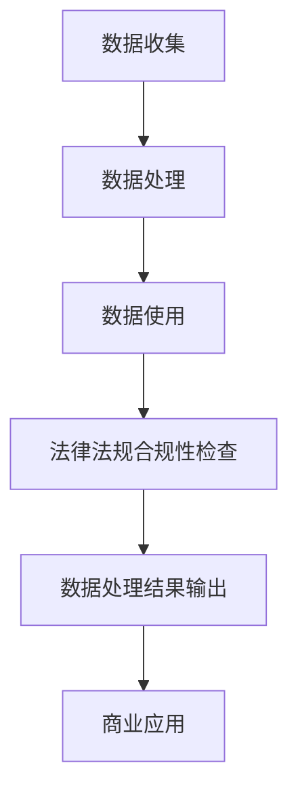

                 

关键词：人工智能、创业、数据合法性、隐私保护、合规性、数据处理、法律法规

> 摘要：随着人工智能技术的快速发展，数据合法性成为AI创业企业的关键挑战。本文将探讨数据合法性在AI创业中的重要性，分析数据收集、处理、使用过程中面临的法律法规挑战，并提出合规策略和解决方案，以帮助创业企业在数据合法性的道路上稳步前行。

## 1. 背景介绍

近年来，人工智能（AI）技术的发展取得了惊人的成果，从自然语言处理到计算机视觉，再到自动驾驶和智能制造，AI已经渗透到社会的各个领域。这一技术的迅猛发展，不仅推动了科技创新，也为创业企业带来了前所未有的机遇。然而，AI创业之路并非一帆风顺，其中数据合法性成为企业面临的一个重大挑战。

数据合法性指的是企业在收集、处理、使用数据过程中，必须遵循相关法律法规的要求，确保数据的使用合法、合规。在AI创业中，数据是AI模型的基石，数据质量直接影响模型的性能。然而，数据收集、处理、使用过程中的隐私泄露、数据滥用等问题，使得数据合法性成为企业必须重视的课题。

## 2. 核心概念与联系

为了更好地理解数据合法性在AI创业中的重要性，我们首先需要明确一些核心概念。

### 2.1 数据合法性的核心概念

- **数据收集**：指企业通过合法渠道获取数据的流程。
- **数据处理**：指企业对数据进行清洗、整合、分析等操作的流程。
- **数据使用**：指企业利用数据开展业务活动，如训练AI模型、提供个性化服务等。
- **法律法规**：包括但不限于《中华人民共和国网络安全法》、《欧盟通用数据保护条例（GDPR）》等，规定了企业在数据收集、处理、使用过程中的法律要求。

### 2.2 数据合法性与AI创业的联系

- **数据质量**：合法的数据是保证AI模型质量的基础。数据不合法或质量低下，会导致模型性能下降，甚至产生误导性结论。
- **商业风险**：数据合法性直接关系到企业的法律责任和商业声誉。一旦发生数据泄露或滥用事件，企业将面临巨大的法律风险和舆论压力。
- **用户信任**：在信息透明和隐私意识日益增强的今天，用户对数据安全性和隐私保护的要求越来越高。企业只有保证数据合法性，才能赢得用户的信任，实现可持续发展。

### 2.3 Mermaid流程图



## 3. 核心算法原理 & 具体操作步骤

### 3.1 算法原理概述

数据合法性在AI创业中的具体实现，可以借鉴一些核心算法原理。

- **数据加密**：通过对数据进行加密处理，确保数据在传输和存储过程中不被窃取或篡改。
- **匿名化处理**：通过将敏感信息进行脱敏处理，如替换、掩码等技术，降低数据泄露的风险。
- **隐私保护算法**：如差分隐私、同态加密等，在数据处理过程中保障数据的隐私性。
- **合规性检查算法**：通过对数据处理过程进行自动化检查，确保数据合法性。

### 3.2 算法步骤详解

#### 3.2.1 数据收集

1. 明确数据来源：确保数据来源的合法性，如公开数据集、用户授权数据等。
2. 数据收集协议：制定明确的数据收集协议，告知用户数据收集的目的、范围、使用方式等。

#### 3.2.2 数据处理

1. 数据清洗：去除重复、错误、缺失的数据，保证数据质量。
2. 数据匿名化：对敏感信息进行脱敏处理，如使用掩码、替换等。
3. 数据加密：对传输和存储的数据进行加密处理，确保数据安全性。

#### 3.2.3 数据使用

1. 模型训练：使用合法、高质量的数据训练AI模型。
2. 个性化服务：基于用户授权的数据，提供个性化推荐、定制服务等。
3. 数据共享：在遵守法律法规和用户同意的前提下，合理共享数据。

#### 3.2.4 合规性检查

1. 定期审计：对企业数据处理过程进行定期审计，确保合规性。
2. 合规性报告：根据法律法规要求，生成合规性报告，如数据隐私保护报告等。

### 3.3 算法优缺点

#### 优点：

- **提高数据安全性**：通过加密、匿名化等技术，保障数据在传输和存储过程中的安全性。
- **增强用户信任**：合规的数据处理方式，有助于提升用户对企业的信任度。
- **降低法律风险**：遵守相关法律法规，降低企业在数据收集、处理、使用过程中的法律风险。

#### 缺点：

- **数据处理成本**：加密、匿名化等操作，会增加数据处理成本。
- **技术复杂性**：实现数据合法性需要涉及多种技术，如加密、隐私保护等，技术复杂性较高。

### 3.4 算法应用领域

- **金融行业**：在反欺诈、风险评估等场景中，数据合法性尤为重要。
- **医疗领域**：涉及个人隐私信息的医疗数据，必须保证合法性。
- **零售行业**：个性化推荐、客户画像等业务，需要合法的数据支撑。

## 4. 数学模型和公式 & 详细讲解 & 举例说明

### 4.1 数学模型构建

在数据合法性中，常见的数学模型包括：

- **加密算法**：如AES、RSA等。
- **匿名化算法**：如k-匿名、l-差异隐私等。
- **合规性检查算法**：如数据隐私保护报告生成算法等。

### 4.2 公式推导过程

#### 加密算法（AES）

- **密钥生成**：$$K = KeyGen()$$
- **加密过程**：$$C = AES_Encrypt(Plaintext, K)$$
- **解密过程**：$$P = AES_Decrypt(Ciphertext, K)$$

#### 匿名化算法（k-匿名）

- **聚类**：对数据集进行聚类，生成k个簇。
- **映射**：将原始数据映射到簇中心。
- **计算k-相似度**：$$Sim_k(D_i, C_j) = \frac{|D_i \cap C_j|}{|D_i \cup C_j|}$$
- **选择簇中心**：选择k-相似度最小的簇中心作为匿名化结果。

### 4.3 案例分析与讲解

#### 案例一：金融行业的反欺诈

- **数据收集**：收集客户的交易数据，如交易时间、金额、交易方式等。
- **数据处理**：对交易数据进行加密处理，确保数据安全性。
- **合规性检查**：定期进行合规性审计，确保数据处理合法。

#### 案例二：医疗领域的隐私保护

- **数据收集**：收集患者的病历信息，如诊断结果、治疗方案等。
- **数据处理**：对敏感信息进行匿名化处理，降低隐私泄露风险。
- **合规性检查**：遵守《中华人民共和国网络安全法》等法律法规，确保数据处理合规。

## 5. 项目实践：代码实例和详细解释说明

### 5.1 开发环境搭建

1. 安装Python环境。
2. 安装加密库（如PyCrypto）。
3. 安装匿名化处理库（如Python Privacy）。

### 5.2 源代码详细实现

```python
from Crypto.Cipher import AES
from Crypto.Random import get_random_bytes
from Crypto.Util.Padding import pad, unpad
import privacy匿名化处理库

# 加密函数
def encrypt_data(data, key):
    cipher = AES.new(key, AES.MODE_CBC)
    ct_bytes = cipher.encrypt(pad(data, AES.block_size))
    iv = cipher.iv
    return iv + ct_bytes

# 解密函数
def decrypt_data(ct, key, iv):
    cipher = AES.new(key, AES.MODE_CBC, iv)
    pt = unpad(cipher.decrypt(ct), AES.block_size)
    return pt

# 匿名化处理函数
def anonymize_data(data):
    # 使用匿名化库对数据进行处理
    return privacy匿名化处理库.anonymize(data)

# 示例代码
key = get_random_bytes(16)
data = "敏感信息"
iv = get_random_bytes(16)

encrypted_data = encrypt_data(data, key)
print("加密后的数据：", encrypted_data)

decrypted_data = decrypt_data(encrypted_data, key, iv)
print("解密后的数据：", decrypted_data)

anonymized_data = anonymize_data(data)
print("匿名化后的数据：", anonymized_data)
```

### 5.3 代码解读与分析

- **加密**：使用AES加密算法，对数据进行加密处理，确保数据安全性。
- **解密**：使用加密算法的密钥和初始化向量（IV），对加密后的数据进行解密。
- **匿名化**：使用匿名化处理库，对敏感信息进行匿名化处理，降低隐私泄露风险。

### 5.4 运行结果展示

- **加密后的数据**：经过加密处理后的数据。
- **解密后的数据**：与原始数据一致，证明加密和解密过程正确。
- **匿名化后的数据**：对敏感信息进行了匿名化处理，降低了隐私泄露风险。

## 6. 实际应用场景

### 6.1 金融行业

- **反欺诈**：通过加密和匿名化处理，保障客户交易数据的安全性，降低欺诈风险。
- **风险评估**：合规的数据处理方式，有助于金融机构遵守法律法规，提高风险管理能力。

### 6.2 医疗领域

- **病历管理**：通过加密和匿名化处理，保障患者病历信息的安全性，降低隐私泄露风险。
- **健康数据分析**：合规的数据处理方式，有助于医疗机构进行健康数据分析，提高医疗服务质量。

### 6.3 零售行业

- **个性化推荐**：通过匿名化处理，保障用户隐私，提供个性化推荐服务。
- **客户画像**：合规的数据处理方式，有助于企业了解客户需求，提高营销效果。

### 6.4 未来应用展望

随着人工智能技术的不断发展，数据合法性将在更多领域得到广泛应用。未来，我们将看到更多合规性技术的出现，如联邦学习、差分隐私等，为数据合法性提供更强大的保障。

## 7. 工具和资源推荐

### 7.1 学习资源推荐

- **书籍**：《数据隐私保护》、《机器学习与隐私保护》等。
- **在线课程**：Coursera、edX等平台上的数据隐私保护相关课程。

### 7.2 开发工具推荐

- **加密库**：PyCrypto、PyCryptodome等。
- **匿名化库**：Python Privacy、Anonymizer等。

### 7.3 相关论文推荐

- **《差分隐私：理论与实践》**：介绍了差分隐私的基本原理和应用。
- **《联邦学习：隐私保护的数据协同学习》**：探讨了联邦学习在隐私保护中的应用。

## 8. 总结：未来发展趋势与挑战

### 8.1 研究成果总结

- **加密技术**：加密技术在数据保护中发挥着重要作用，如AES、RSA等。
- **匿名化技术**：匿名化技术可以有效降低数据泄露风险，如k-匿名、l-差异隐私等。
- **合规性检查算法**：合规性检查算法有助于企业确保数据处理过程合法，如数据隐私保护报告生成算法等。

### 8.2 未来发展趋势

- **隐私保护技术**：随着隐私保护意识的增强，隐私保护技术将得到广泛应用，如联邦学习、差分隐私等。
- **合规性要求**：法律法规对数据合法性的要求将越来越严格，企业需要不断提升合规能力。

### 8.3 面临的挑战

- **技术复杂性**：实现数据合法性需要多种技术手段，技术复杂性较高。
- **合规成本**：合规性检查和数据处理成本较高，对企业运营造成一定压力。

### 8.4 研究展望

- **跨领域合作**：鼓励学术界和产业界合作，共同攻克数据合法性面临的挑战。
- **法律法规完善**：期待法律法规的不断完善，为企业提供更明确、更可操作的合规指导。

## 9. 附录：常见问题与解答

### 9.1 数据加密与匿名化的区别是什么？

**数据加密**：通过加密算法，将原始数据转换为不可读的密文，确保数据在传输和存储过程中的安全性。

**数据匿名化**：通过对数据进行脱敏处理，如掩码、替换等，降低数据泄露的风险，同时保留数据的价值。

### 9.2 数据合法性在AI创业中的重要性是什么？

数据合法性在AI创业中的重要性体现在以下几个方面：

- **保障数据质量**：合法的数据是保证AI模型质量的基础。
- **降低法律风险**：遵守相关法律法规，降低企业在数据收集、处理、使用过程中的法律风险。
- **增强用户信任**：合规的数据处理方式，有助于提升用户对企业的信任度。

### 9.3 如何确保数据处理过程的合法性？

确保数据处理过程合法性的方法包括：

- **制定明确的数据收集协议**：告知用户数据收集的目的、范围、使用方式等。
- **定期进行合规性审计**：对企业数据处理过程进行定期审计，确保合规性。
- **使用加密和匿名化技术**：对数据进行加密和匿名化处理，确保数据安全性。

---

本文由禅与计算机程序设计艺术撰写，旨在探讨数据合法性在AI创业中的重要性，分析相关法律法规挑战，并提出合规策略和解决方案。希望对AI创业企业有所帮助。

作者：禅与计算机程序设计艺术
```

