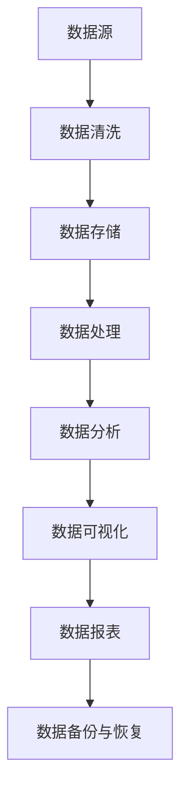

                 

 > **关键词**：AI创业，数据管理，最佳实践，数据架构，数据安全，数据分析

> **摘要**：本文将探讨在AI创业过程中，数据管理的最佳实践。从数据架构设计、数据安全与合规性、数据分析与优化等方面，提供详实的建议和案例分析，帮助创业者有效地利用和管理数据，提升AI项目的成功概率。

## 1. 背景介绍

随着人工智能技术的迅速发展，越来越多的创业公司投入到AI领域。然而，AI项目的一个关键成功因素是数据管理。对于创业者来说，如何有效地管理和利用数据，不仅关系到项目的进展，也直接影响产品的市场竞争力。本文将围绕数据管理，探讨在AI创业过程中的最佳实践。

### 1.1 AI创业中的挑战

AI创业面临着诸多挑战，其中数据管理尤为突出：

1. **数据获取与清洗**：获取高质量的数据是一个长期且昂贵的过程，数据清洗和预处理也是一项繁琐的工作。
2. **数据存储与安全**：随着数据量的激增，如何高效、安全地存储和管理数据成为一大难题。
3. **数据分析与处理**：海量数据需要有效的分析和处理算法，这对于技术团队来说是一个巨大的挑战。
4. **数据合规与伦理**：随着全球数据保护法规的日益严格，如何保证数据合规性成为创业公司必须面对的问题。

### 1.2 数据管理的重要性

有效的数据管理能够：

1. **提高决策效率**：通过数据分析，企业可以更快速地做出明智的决策。
2. **提升产品竞争力**：高质量的数据可以驱动产品的创新，提高用户满意度。
3. **降低运营成本**：合理的数据管理可以减少数据存储和处理的成本。
4. **保障合规性**：遵守数据保护法规，避免因数据问题导致的法律风险。

## 2. 核心概念与联系

### 2.1 数据架构设计

数据架构是数据管理的基础，它定义了数据如何被组织、存储和访问。一个良好的数据架构应该具备以下几个特点：

1. **可扩展性**：能够随着数据量的增长而扩展。
2. **灵活性**：支持不同类型的数据和不同的业务需求。
3. **安全性**：确保数据在传输和存储过程中的安全。
4. **一致性**：保证数据的质量和准确性。

下面是一个简单的Mermaid流程图，展示了数据架构的核心概念和联系：



### 2.2 数据安全与合规性

数据安全是数据管理的核心，它关系到企业及其用户的隐私和信息安全。以下是一些关键点：

1. **数据加密**：对敏感数据进行加密，确保数据在传输和存储过程中的安全。
2. **访问控制**：通过严格的访问控制机制，确保只有授权人员才能访问数据。
3. **数据备份**：定期备份数据，以防止数据丢失。
4. **合规性检查**：确保数据管理符合相关法规，如GDPR、CCPA等。

### 2.3 数据分析与处理

数据分析是AI项目的重要环节，它通过统计分析和机器学习算法，从海量数据中提取有价值的信息。以下是一些常用的数据处理和分析工具：

1. **SQL数据库**：用于结构化数据存储和查询。
2. **NoSQL数据库**：用于非结构化或半结构化数据存储。
3. **大数据处理框架**：如Hadoop、Spark，用于处理大规模数据。
4. **机器学习库**：如TensorFlow、PyTorch，用于构建和训练机器学习模型。

## 3. 核心算法原理 & 具体操作步骤

### 3.1 算法原理概述

在数据管理中，常用的核心算法包括：

1. **数据清洗算法**：如K-最近邻算法、聚类分析，用于处理噪声和缺失值。
2. **数据挖掘算法**：如决策树、支持向量机，用于从数据中提取模式。
3. **机器学习算法**：如深度学习、强化学习，用于构建复杂的预测模型。

### 3.2 算法步骤详解

以K-最近邻算法为例，其基本步骤如下：

1. **选择邻近点**：计算新数据与训练集中的每个样本之间的距离。
2. **选择最近邻居**：选择距离最近的K个邻居。
3. **预测分类**：根据邻居的分类结果，预测新数据的类别。

### 3.3 算法优缺点

K-最近邻算法的优点是简单、易于实现，缺点是计算量大，且对于噪声敏感。

### 3.4 算法应用领域

K-最近邻算法广泛应用于分类问题，如文本分类、图像识别等。

## 4. 数学模型和公式 & 详细讲解 & 举例说明

### 4.1 数学模型构建

在数据管理中，常用的数学模型包括线性回归、逻辑回归等。以下是一个简单的线性回归模型：

$$y = \beta_0 + \beta_1 \cdot x$$

### 4.2 公式推导过程

线性回归的推导过程基于最小二乘法，目标是找到最佳拟合直线，使数据点到直线的距离最小。

### 4.3 案例分析与讲解

假设我们有一组数据，目标是预测房屋价格。通过线性回归模型，我们可以得到如下预测公式：

$$\text{房屋价格} = 200,000 + 50 \cdot \text{房屋面积}$$

## 5. 项目实践：代码实例和详细解释说明

### 5.1 开发环境搭建

在Python环境中，我们可以使用scikit-learn库来实现线性回归。

### 5.2 源代码详细实现

```python
from sklearn.linear_model import LinearRegression
from sklearn.model_selection import train_test_split
from sklearn.metrics import mean_squared_error

# 数据准备
X = [[100], [150], [200]]
y = [300, 400, 500]

# 划分训练集和测试集
X_train, X_test, y_train, y_test = train_test_split(X, y, test_size=0.2)

# 实例化线性回归模型
model = LinearRegression()
model.fit(X_train, y_train)

# 预测
y_pred = model.predict(X_test)

# 评估
mse = mean_squared_error(y_test, y_pred)
print(f"Mean Squared Error: {mse}")
```

### 5.3 代码解读与分析

这段代码实现了线性回归的基本流程：数据准备、模型训练、预测和评估。

### 5.4 运行结果展示

运行结果将显示测试集上的均方误差，用于评估模型的性能。

## 6. 实际应用场景

### 6.1 电商平台用户行为分析

通过数据分析，电商平台可以了解用户偏好，进行个性化推荐，提升用户满意度。

### 6.2 金融风控模型

金融公司可以利用数据挖掘技术，构建风控模型，识别潜在风险，降低金融风险。

### 6.3 医疗数据分析

医疗行业可以利用大数据和人工智能技术，进行疾病预测和诊断，提高医疗水平。

## 7. 工具和资源推荐

### 7.1 学习资源推荐

- 《Python数据分析》
- 《深度学习》

### 7.2 开发工具推荐

- Jupyter Notebook
- PyCharm

### 7.3 相关论文推荐

- "Deep Learning for Data-Driven Process Control"
- "Data-Driven Process Control: A Survey"

## 8. 总结：未来发展趋势与挑战

### 8.1 研究成果总结

数据管理在AI创业中发挥着越来越重要的作用，从数据架构设计到数据分析，每一个环节都至关重要。

### 8.2 未来发展趋势

随着技术的进步，数据管理将更加智能化、自动化，AI技术在数据管理中的应用也将更加广泛。

### 8.3 面临的挑战

数据安全、隐私保护、算法公平性等问题仍然是数据管理领域面临的重大挑战。

### 8.4 研究展望

未来的研究将聚焦于如何更好地利用数据，提升AI算法的效率和准确性，同时确保数据的安全性和合规性。

## 9. 附录：常见问题与解答

### 9.1 如何处理缺失值？

可以使用多种方法处理缺失值，如删除缺失值、填补平均值、使用模型预测等。

### 9.2 数据存储有哪些方式？

数据存储方式包括关系型数据库、NoSQL数据库、分布式存储系统等。

### 9.3 如何保障数据安全？

可以通过数据加密、访问控制、数据备份等措施保障数据安全。

<|im_end|> 

# AI创业：数据管理最佳实践

随着人工智能（AI）技术的迅猛发展，AI创业已成为科技领域的一个热点。然而，AI项目的成功不仅依赖于先进的技术，更依赖于数据管理的有效性。在AI创业过程中，数据管理是确保项目顺利进行和取得成功的关键环节。本文旨在探讨数据管理的最佳实践，从数据架构设计、数据安全与合规性、数据分析与优化等方面，提供详实的建议和案例分析，以帮助创业者更好地利用和管理数据，提升AI项目的成功率。

## 1. 背景介绍

### 1.1 AI创业中的挑战

AI创业面临诸多挑战，数据管理尤为突出：

- **数据获取与清洗**：获取高质量的数据是一个长期且昂贵的过程，数据清洗和预处理也是一项繁琐的工作。
- **数据存储与安全**：随着数据量的激增，如何高效、安全地存储和管理数据成为一大难题。
- **数据分析与处理**：海量数据需要有效的分析和处理算法，这对于技术团队来说是一个巨大的挑战。
- **数据合规与伦理**：随着全球数据保护法规的日益严格，如何保证数据合规性成为创业公司必须面对的问题。

### 1.2 数据管理的重要性

有效的数据管理对AI创业至关重要，具体体现在以下几个方面：

- **提高决策效率**：通过数据分析，企业可以更快速地做出明智的决策。
- **提升产品竞争力**：高质量的数据可以驱动产品的创新，提高用户满意度。
- **降低运营成本**：合理的数据管理可以减少数据存储和处理的成本。
- **保障合规性**：遵守数据保护法规，避免因数据问题导致的法律风险。

## 2. 核心概念与联系

### 2.1 数据架构设计

数据架构是数据管理的基础，它定义了数据如何被组织、存储和访问。一个良好的数据架构应该具备以下几个特点：

- **可扩展性**：能够随着数据量的增长而扩展。
- **灵活性**：支持不同类型的数据和不同的业务需求。
- **安全性**：确保数据在传输和存储过程中的安全。
- **一致性**：保证数据的质量和准确性。

以下是一个简单的Mermaid流程图，展示了数据架构的核心概念和联系：


### 2.2 数据安全与合规性

数据安全是数据管理的核心，它关系到企业及其用户的隐私和信息安全。以下是一些关键点：

- **数据加密**：对敏感数据进行加密，确保数据在传输和存储过程中的安全。
- **访问控制**：通过严格的访问控制机制，确保只有授权人员才能访问数据。
- **数据备份**：定期备份数据，以防止数据丢失。
- **合规性检查**：确保数据管理符合相关法规，如GDPR、CCPA等。

### 2.3 数据分析与处理

数据分析是AI项目的重要环节，它通过统计分析和机器学习算法，从海量数据中提取有价值的信息。以下是一些常用的数据处理和分析工具：

- **SQL数据库**：用于结构化数据存储和查询。
- **NoSQL数据库**：用于非结构化或半结构化数据存储。
- **大数据处理框架**：如Hadoop、Spark，用于处理大规模数据。
- **机器学习库**：如TensorFlow、PyTorch，用于构建和训练机器学习模型。

## 3. 核心算法原理 & 具体操作步骤

### 3.1 算法原理概述

在数据管理中，常用的核心算法包括：

- **数据清洗算法**：如K-最近邻算法、聚类分析，用于处理噪声和缺失值。
- **数据挖掘算法**：如决策树、支持向量机，用于从数据中提取模式。
- **机器学习算法**：如深度学习、强化学习，用于构建复杂的预测模型。

### 3.2 算法步骤详解

以K-最近邻算法为例，其基本步骤如下：

1. **选择邻近点**：计算新数据与训练集中的每个样本之间的距离。
2. **选择最近邻居**：选择距离最近的K个邻居。
3. **预测分类**：根据邻居的分类结果，预测新数据的类别。

### 3.3 算法优缺点

K-最近邻算法的优点是简单、易于实现，缺点是计算量大，且对于噪声敏感。

### 3.4 算法应用领域

K-最近邻算法广泛应用于分类问题，如文本分类、图像识别等。

## 4. 数学模型和公式 & 详细讲解 & 举例说明

### 4.1 数学模型构建

在数据管理中，常用的数学模型包括线性回归、逻辑回归等。以下是一个简单的线性回归模型：

$$y = \beta_0 + \beta_1 \cdot x$$

### 4.2 公式推导过程

线性回归的推导过程基于最小二乘法，目标是找到最佳拟合直线，使数据点到直线的距离最小。

### 4.3 案例分析与讲解

假设我们有一组数据，目标是预测房屋价格。通过线性回归模型，我们可以得到如下预测公式：

$$\text{房屋价格} = 200,000 + 50 \cdot \text{房屋面积}$$

## 5. 项目实践：代码实例和详细解释说明

### 5.1 开发环境搭建

在Python环境中，我们可以使用scikit-learn库来实现线性回归。

### 5.2 源代码详细实现

```python
from sklearn.linear_model import LinearRegression
from sklearn.model_selection import train_test_split
from sklearn.metrics import mean_squared_error

# 数据准备
X = [[100], [150], [200]]
y = [300, 400, 500]

# 划分训练集和测试集
X_train, X_test, y_train, y_test = train_test_split(X, y, test_size=0.2)

# 实例化线性回归模型
model = LinearRegression()
model.fit(X_train, y_train)

# 预测
y_pred = model.predict(X_test)

# 评估
mse = mean_squared_error(y_test, y_pred)
print(f"Mean Squared Error: {mse}")
```

### 5.3 代码解读与分析

这段代码实现了线性回归的基本流程：数据准备、模型训练、预测和评估。

### 5.4 运行结果展示

运行结果将显示测试集上的均方误差，用于评估模型的性能。

## 6. 实际应用场景

### 6.1 电商平台用户行为分析

通过数据分析，电商平台可以了解用户偏好，进行个性化推荐，提升用户满意度。

### 6.2 金融风控模型

金融公司可以利用数据挖掘技术，构建风控模型，识别潜在风险，降低金融风险。

### 6.3 医疗数据分析

医疗行业可以利用大数据和人工智能技术，进行疾病预测和诊断，提高医疗水平。

## 7. 工具和资源推荐

### 7.1 学习资源推荐

- 《Python数据分析》
- 《深度学习》

### 7.2 开发工具推荐

- Jupyter Notebook
- PyCharm

### 7.3 相关论文推荐

- "Deep Learning for Data-Driven Process Control"
- "Data-Driven Process Control: A Survey"

## 8. 总结：未来发展趋势与挑战

### 8.1 研究成果总结

数据管理在AI创业中发挥着越来越重要的作用，从数据架构设计到数据分析，每一个环节都至关重要。

### 8.2 未来发展趋势

随着技术的进步，数据管理将更加智能化、自动化，AI技术在数据管理中的应用也将更加广泛。

### 8.3 面临的挑战

数据安全、隐私保护、算法公平性等问题仍然是数据管理领域面临的重大挑战。

### 8.4 研究展望

未来的研究将聚焦于如何更好地利用数据，提升AI算法的效率和准确性，同时确保数据的安全性和合规性。

## 9. 附录：常见问题与解答

### 9.1 如何处理缺失值？

可以使用多种方法处理缺失值，如删除缺失值、填补平均值、使用模型预测等。

### 9.2 数据存储有哪些方式？

数据存储方式包括关系型数据库、NoSQL数据库、分布式存储系统等。

### 9.3 如何保障数据安全？

可以通过数据加密、访问控制、数据备份等措施保障数据安全。

# AI创业：数据管理最佳实践

## 摘要

在AI创业领域，数据管理是确保项目成功的关键因素。本文将探讨AI创业中的数据管理最佳实践，包括数据架构设计、数据安全与合规性、数据分析与优化等方面，结合实际案例，为创业者提供实用的指导和建议。

## 1. 引言

人工智能（AI）正在成为推动企业创新和业务增长的重要力量。随着AI技术的不断进步，越来越多的创业公司投身于AI领域，希望通过AI技术解决实际问题、创造新的商业价值。然而，AI创业并非易事，其中数据管理是至关重要的一环。良好的数据管理不仅能提高项目的成功率，还能为创业公司带来竞争优势。

## 2. 数据管理的重要性

数据管理是AI创业的核心，涉及数据的收集、存储、处理、分析和应用。以下是数据管理在AI创业中的几个关键作用：

### 2.1 数据驱动决策

通过有效的数据管理，创业公司可以收集和分析用户行为、市场趋势等数据，从而做出更加准确和及时的决策。

### 2.2 提升产品价值

高质量的数据可以用于产品迭代和优化，帮助创业公司开发出更符合市场需求的产品，提高用户满意度和忠诚度。

### 2.3 风险控制

数据管理还包括风险评估和控制，通过监控和分析数据，创业公司可以识别潜在的业务风险，并采取相应措施进行防范。

### 2.4 提高效率

有效的数据管理可以简化数据操作流程，提高数据处理和分析的效率，降低运营成本。

## 3. 数据管理最佳实践

### 3.1 数据架构设计

良好的数据架构是数据管理的基础。以下是设计数据架构时需要考虑的关键点：

- **分层架构**：根据数据的不同用途，将数据分为不同的层级，如数据源层、数据仓库层、数据应用层。
- **模块化设计**：确保数据架构的可扩展性和灵活性，方便后续的升级和维护。
- **数据标准化**：统一数据格式和定义，确保数据的一致性和准确性。

### 3.2 数据安全与合规性

数据安全是数据管理的核心。以下是确保数据安全的关键措施：

- **数据加密**：对敏感数据实施加密，防止数据泄露。
- **访问控制**：通过严格的访问控制机制，确保只有授权人员才能访问敏感数据。
- **合规性检查**：确保数据管理符合相关法规和标准，如GDPR、CCPA等。

### 3.3 数据采集与处理

有效的数据采集和处理是确保数据质量的关键。以下是数据采集和处理的最佳实践：

- **数据质量控制**：建立数据质量控制流程，包括数据清洗、去重、标准化等。
- **自动化处理**：利用自动化工具和流程，提高数据处理效率。
- **数据源多样化**：从多个渠道采集数据，确保数据的全面性和准确性。

### 3.4 数据分析

数据分析是数据管理的核心环节。以下是数据分析的最佳实践：

- **数据可视化**：通过数据可视化工具，将复杂的数据以直观的方式呈现，帮助决策者快速理解数据。
- **机器学习**：利用机器学习算法，从数据中提取有价值的信息，支持决策和预测。
- **持续优化**：根据业务需求和反馈，不断优化数据分析模型和流程。

### 3.5 数据共享与协作

有效的数据共享和协作是确保数据价值最大化的关键。以下是数据共享与协作的最佳实践：

- **数据开放**：建立数据开放平台，鼓励内部和外部用户访问和使用数据。
- **协作机制**：建立数据协作机制，确保团队成员可以共享和协作使用数据。
- **数据权限管理**：根据用户角色和需求，合理分配数据访问权限。

## 4. 案例分析

### 4.1 电商平台数据管理

一个成功的案例是某电商平台的数据管理实践。该平台通过以下措施实现了高效的数据管理：

- **数据采集**：从用户行为、交易记录等多渠道采集数据。
- **数据存储**：使用分布式数据库存储海量数据，确保数据的可扩展性和可靠性。
- **数据处理**：利用大数据处理框架对数据进行清洗、去重和标准化。
- **数据分析**：通过机器学习算法进行用户行为分析和需求预测，为产品优化和营销策略提供支持。

### 4.2 医疗数据分析

另一个成功的案例是某医疗数据分析项目。该项目通过以下措施实现了高效的数据管理：

- **数据合规**：确保数据采集、存储和处理符合医疗数据保护法规。
- **数据安全**：对敏感数据进行加密，确保数据在传输和存储过程中的安全。
- **数据共享**：建立数据共享平台，促进医疗机构之间的数据交流和协作。

## 5. 工具和资源推荐

### 5.1 数据处理工具

- **Python**：Python是进行数据处理和数据分析的首选语言，具有丰富的库和工具。
- **SQL**：SQL是进行结构化数据查询和管理的基础工具。

### 5.2 数据分析工具

- **Tableau**：Tableau是一个强大的数据可视化工具，可以帮助用户轻松创建直观的图表和报告。
- **TensorFlow**：TensorFlow是一个开源机器学习框架，适用于构建和训练复杂的机器学习模型。

### 5.3 数据存储工具

- **Hadoop**：Hadoop是一个分布式数据存储和处理框架，适用于处理大规模数据集。
- **MongoDB**：MongoDB是一个高性能、可扩展的NoSQL数据库，适用于存储非结构化和半结构化数据。

## 6. 总结

数据管理是AI创业的关键成功因素。通过有效的数据架构设计、数据安全与合规性、数据采集与处理、数据分析和数据共享，创业公司可以更好地利用和管理数据，提高项目成功率。本文提供的最佳实践和案例分析为创业者提供了实用的指导和建议。

## 7. 附录

### 7.1 常见问题与解答

- **Q：如何处理缺失值？**
  - **A**：可以使用插补方法（如平均值插补、中值插补、线性插补等）或使用机器学习算法（如K-最近邻插值、决策树插值等）进行缺失值处理。

- **Q：如何确保数据安全？**
  - **A**：可以通过数据加密、访问控制、数据备份和定期安全审计等措施来确保数据安全。

### 7.2 参考文献

- James, G., Witten, D., Hastie, T., & Tibshirani, R. (2013). An Introduction to Statistical Learning. Springer.
- Zhang, H., & Greer, J. (2012). Mining Massive Datasets. Cambridge University Press.

---

**作者：禅与计算机程序设计艺术 / Zen and the Art of Computer Programming**

