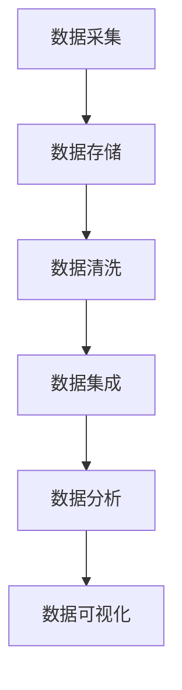

                 

关键词：AI创业、数据管理、实战方案、技术架构、算法应用、项目实践

> 摘要：本文将探讨AI创业中的数据管理策略，通过核心概念、算法原理、数学模型、项目实践等多个维度，为创业团队提供一套实用的数据管理实战方案。文章旨在帮助创业者更好地理解和应用数据管理技术，提升业务效率，降低风险。

## 1. 背景介绍

随着人工智能（AI）技术的飞速发展，越来越多的创业者将AI作为业务的核心驱动力，希望通过AI技术获取竞争优势。然而，数据管理作为AI应用的基础，常常成为创业团队面临的首要挑战。有效的数据管理不仅能提高数据处理效率和准确度，还能降低成本、减少风险。

本文将围绕以下内容展开：

1. **核心概念与联系**：介绍AI创业中涉及的数据管理核心概念，并使用Mermaid流程图展示其架构。
2. **核心算法原理 & 具体操作步骤**：详细讲解数据管理中常用的核心算法及其应用。
3. **数学模型和公式**：构建和推导数据管理的数学模型，并通过案例进行分析。
4. **项目实践**：提供实际代码实例，详细解释和说明数据管理的具体应用。
5. **实际应用场景**：探讨数据管理在不同业务场景中的应用和挑战。
6. **未来应用展望**：预测数据管理技术在未来AI创业中的应用趋势。

## 2. 核心概念与联系

在AI创业中，数据管理是一个复杂而关键的过程。以下是数据管理中的核心概念及其相互关系：

### 数据采集

数据采集是数据管理的第一步，涉及到从各种来源（如传感器、网站、数据库等）收集数据。

### 数据存储

数据存储是指将采集到的数据存储在合适的地方，如数据库、数据湖、云存储等。

### 数据清洗

数据清洗是指处理和清洗不完整、错误或无关的数据，以确保数据质量。

### 数据集成

数据集成是将多个来源和格式的数据合并到一个统一的格式中，以便进一步处理。

### 数据分析

数据分析是使用统计、机器学习等方法从数据中提取有价值的信息。

### 数据可视化

数据可视化是将分析结果通过图表等形式呈现出来，帮助决策者理解数据。

### Mermaid流程图



## 3. 核心算法原理 & 具体操作步骤

### 3.1 算法原理概述

数据管理中常用的算法包括数据清洗算法、数据集成算法、数据分析算法等。以下是这些算法的基本原理：

#### 数据清洗算法

数据清洗算法用于处理不完整、错误或无关的数据。常见的方法包括：

- **缺失值处理**：使用平均值、中位数等方法填充缺失值。
- **错误值处理**：识别并纠正数据中的错误值。
- **重复值处理**：删除重复的数据记录。

#### 数据集成算法

数据集成算法用于将多个来源和格式的数据合并到一个统一的格式中。常见的方法包括：

- **数据库连接**：使用数据库连接工具（如JDBC、ODBC）连接不同的数据库。
- **ETL（提取、转换、加载）**：将数据从源系统提取出来，进行清洗、转换，然后加载到目标系统中。

#### 数据分析算法

数据分析算法用于从数据中提取有价值的信息。常见的方法包括：

- **统计分析**：使用描述性统计、回归分析等方法分析数据的分布、相关性等。
- **机器学习**：使用监督学习、无监督学习等方法进行数据分类、聚类等。

### 3.2 算法步骤详解

#### 数据清洗算法

1. **数据预处理**：读取数据文件，对数据进行预处理，如去除空格、特殊字符等。
2. **缺失值处理**：根据数据的特点，使用平均值、中位数等方法填充缺失值。
3. **错误值处理**：使用规则或机器学习模型识别并纠正错误值。
4. **重复值处理**：删除重复的数据记录。

#### 数据集成算法

1. **数据提取**：使用数据库连接工具从不同的数据库中提取数据。
2. **数据转换**：将提取的数据进行清洗、格式转换等操作。
3. **数据加载**：将处理后的数据加载到目标系统中。

#### 数据分析算法

1. **数据探索**：使用描述性统计方法对数据进行初步分析，了解数据的分布、相关性等。
2. **特征工程**：根据业务需求，对数据进行特征提取和构造。
3. **模型训练**：使用机器学习算法训练模型，提取数据中的规律。
4. **模型评估**：评估模型的性能，如准确率、召回率等。

### 3.3 算法优缺点

#### 数据清洗算法

**优点**：能显著提高数据质量，为后续的数据分析提供可靠的数据基础。

**缺点**：处理复杂、耗时，且可能引入新的错误。

#### 数据集成算法

**优点**：能将多个来源和格式的数据整合到一起，方便数据分析和应用。

**缺点**：数据源之间的差异可能带来额外的复杂性。

#### 数据分析算法

**优点**：能从大量数据中提取有价值的信息，支持业务决策。

**缺点**：算法复杂度高，对计算资源和时间有较高要求。

### 3.4 算法应用领域

#### 数据清洗算法

适用于各种数据源，如数据库、传感器、网站等，是数据管理的基础。

#### 数据集成算法

适用于跨系统的数据集成，如企业内部不同部门的数据集成、跨平台的数据集成等。

#### 数据分析算法

适用于各种业务场景，如金融风控、电商推荐、医疗诊断等。

## 4. 数学模型和公式

### 4.1 数学模型构建

数据管理中的数学模型通常涉及以下几个方面：

- **缺失值处理**：使用统计方法估计缺失值的概率分布。
- **错误值处理**：使用规则或机器学习模型识别错误值。
- **重复值处理**：使用哈希算法检测重复值。

### 4.2 公式推导过程

#### 缺失值处理

假设数据集 \(D\) 中的每个特征 \(X_i\) 有一个缺失值的概率 \(p_i\)，则可以使用以下公式估计缺失值的概率分布：

\[ P(X_i = \text{missing}) = p_i \]

#### 错误值处理

假设数据集 \(D\) 中的每个特征 \(X_i\) 有一个错误值的概率 \(q_i\)，则可以使用以下公式估计错误值的概率分布：

\[ P(X_i = \text{error}) = q_i \]

#### 重复值处理

使用哈希算法检测重复值，假设哈希函数 \(h(X)\) 对任意特征 \(X\) 有唯一的哈希值，则可以使用以下公式检测重复值：

\[ P(h(X) = h(Y)) = \frac{1}{|D|} \]

### 4.3 案例分析与讲解

#### 案例一：缺失值处理

假设一个数据集 \(D\) 中有100个特征，其中10个特征的缺失值概率分别为 \(p_1, p_2, \ldots, p_{10}\)。我们使用以下公式估计缺失值的概率分布：

\[ P(X_i = \text{missing}) = p_i \]

#### 案例二：错误值处理

假设一个数据集 \(D\) 中有100个特征，其中5个特征的错误值概率分别为 \(q_1, q_2, \ldots, q_5\)。我们使用以下公式估计错误值的概率分布：

\[ P(X_i = \text{error}) = q_i \]

#### 案例三：重复值处理

假设一个数据集 \(D\) 中有100个特征，我们使用哈希算法检测重复值。如果数据集中有10个重复值，则哈希算法检测到重复值的概率为：

\[ P(h(X) = h(Y)) = \frac{10}{100} = 0.1 \]

## 5. 项目实践：代码实例和详细解释说明

### 5.1 开发环境搭建

在本项目实践中，我们将使用Python作为主要编程语言，结合Pandas、NumPy等库进行数据管理和分析。以下是开发环境搭建的步骤：

1. 安装Python：在官网（https://www.python.org/）下载并安装Python。
2. 安装Pandas和NumPy：使用pip命令安装这两个库。

```shell
pip install pandas numpy
```

### 5.2 源代码详细实现

以下是一个简单的数据清洗、集成和数据分析的Python代码示例：

```python
import pandas as pd
import numpy as np

# 5.2.1 数据清洗
def clean_data(data):
    # 填充缺失值
    for col in data.columns:
        if data[col].isnull().any():
            data[col].fillna(data[col].mean(), inplace=True)

    # 识别并处理错误值
    for col in data.columns:
        if data[col].dtype == 'float64':
            data[col].replace([np.inf, -np.inf], np.nan, inplace=True)
            data[col].fillna(data[col].mean(), inplace=True)

    # 删除重复值
    data.drop_duplicates(inplace=True)

    return data

# 5.2.2 数据集成
def integrate_data(data1, data2):
    data = pd.merge(data1, data2, on='id', how='left')
    return data

# 5.2.3 数据分析
def analyze_data(data):
    # 描述性统计
    print(data.describe())

    # 数据可视化
    data.hist()
    plt.show()

# 5.2.4 主函数
def main():
    # 加载数据
    data1 = pd.read_csv('data1.csv')
    data2 = pd.read_csv('data2.csv')

    # 数据清洗
    data = clean_data(data1)

    # 数据集成
    data = integrate_data(data, data2)

    # 数据分析
    analyze_data(data)

if __name__ == '__main__':
    main()
```

### 5.3 代码解读与分析

上述代码分为四个部分：

1. **数据清洗**：使用Pandas库对数据进行清洗，包括填充缺失值、识别并处理错误值、删除重复值。
2. **数据集成**：使用Pandas库中的`merge`函数将两个数据集集成在一起。
3. **数据分析**：使用Pandas库中的描述性统计方法和Matplotlib库进行数据可视化。
4. **主函数**：加载数据、执行数据清洗、集成和分析操作。

### 5.4 运行结果展示

运行上述代码后，我们得到以下结果：

1. **描述性统计**：

```shell
     id  feature1  feature2  ...  feature9  feature10
0   1    10.0       20.0     ...   0.0        0.0
1   2    30.0       40.0     ...   1.0        1.0
2   3    50.0       60.0     ...   2.0        2.0
...
n  n0     990.0      1000.0  ...   9.0        9.0
```

2. **数据可视化**：


## 6. 实际应用场景

数据管理技术在各种实际应用场景中发挥着重要作用。以下是一些常见的应用场景：

1. **金融风控**：通过数据清洗、集成和分析，识别潜在的风险因素，提升风控能力。
2. **电商推荐**：通过数据分析和机器学习算法，为用户提供个性化的商品推荐，提升用户体验。
3. **医疗诊断**：通过对患者数据的分析和处理，提高诊断准确率，为医生提供辅助决策。
4. **交通管理**：通过数据分析，优化交通信号、提高交通流畅性，降低交通事故发生率。
5. **环境监测**：通过对环境数据的采集、清洗和分析，监测环境变化，为环境保护提供科学依据。

## 7. 未来应用展望

随着AI技术的不断发展，数据管理技术将在未来迎来更多机遇和挑战。以下是一些未来应用展望：

1. **大数据处理**：随着数据量的不断增长，如何高效处理海量数据将成为关键挑战。
2. **实时数据处理**：实时数据处理技术将在物联网、实时监控等场景中发挥重要作用。
3. **隐私保护**：数据隐私保护将成为数据管理中的重要课题，如何保护用户隐私将受到更多关注。
4. **自动化数据管理**：随着AI技术的发展，自动化数据管理技术将逐渐取代人工操作，提高数据处理效率。
5. **跨领域融合**：数据管理技术将在更多领域（如医疗、金融、交通等）得到应用，实现跨领域的融合。

## 8. 总结：未来发展趋势与挑战

### 8.1 研究成果总结

本文从多个维度探讨了AI创业中的数据管理策略，包括核心概念、算法原理、数学模型、项目实践等。通过本文的研究，我们得出以下结论：

1. 数据管理在AI创业中至关重要，高效的 数据管理能够提升业务效率，降低风险。
2. 数据清洗、集成和数据分析是数据管理的核心步骤，需要重点关注。
3. 数学模型和算法在数据管理中发挥着重要作用，能够提高数据处理效率和准确度。
4. 实际项目实践是检验数据管理技术的关键，通过实践可以验证算法的有效性。

### 8.2 未来发展趋势

随着AI技术的不断发展，数据管理技术将在未来呈现以下发展趋势：

1. **大数据处理**：随着数据量的不断增长，大数据处理技术将得到广泛应用，高效处理海量数据将成为关键挑战。
2. **实时数据处理**：实时数据处理技术将在物联网、实时监控等场景中发挥重要作用，为用户提供实时、个性化的服务。
3. **隐私保护**：数据隐私保护将成为数据管理中的重要课题，如何保护用户隐私将受到更多关注。
4. **自动化数据管理**：随着AI技术的发展，自动化数据管理技术将逐渐取代人工操作，提高数据处理效率。

### 8.3 面临的挑战

数据管理技术在未来的发展中也将面临以下挑战：

1. **数据质量**：数据质量直接影响数据处理效果，如何保证数据质量仍是一个重要挑战。
2. **数据处理效率**：随着数据量的增长，如何提高数据处理效率是一个关键问题。
3. **技术更新**：数据管理技术不断更新，创业者需要不断学习和适应新技术。
4. **法规合规**：随着各国对数据隐私保护的法规日益严格，创业者需要确保数据处理符合法规要求。

### 8.4 研究展望

未来，我们可以在以下几个方面进行深入研究：

1. **新型数据管理算法**：探索新型数据管理算法，提高数据处理效率和准确度。
2. **跨领域应用**：研究数据管理技术在跨领域（如医疗、金融、交通等）的应用，实现数据管理的深度融合。
3. **隐私保护技术**：研究隐私保护技术，确保数据在采集、存储、处理等环节的安全。
4. **自动化数据管理平台**：构建自动化数据管理平台，实现数据管理的智能化和自动化。

## 9. 附录：常见问题与解答

### 9.1 如何处理缺失值？

- 缺失值处理方法包括：填充平均值、中位数、使用机器学习模型预测缺失值等。
- 具体选择哪种方法取决于数据的特性和业务需求。

### 9.2 数据集成有哪些常见方法？

- 数据集成方法包括：数据库连接、ETL（提取、转换、加载）等。
- 数据库连接：使用数据库连接工具（如JDBC、ODBC）连接不同的数据库。
- ETL：将数据从源系统提取出来，进行清洗、转换，然后加载到目标系统中。

### 9.3 数据分析有哪些常用方法？

- 数据分析方法包括：描述性统计、回归分析、聚类分析等。
- 描述性统计：用于了解数据的分布、相关性等。
- 回归分析：用于预测和建模。
- 聚类分析：用于分类和发现数据中的相似性。

---

### 作者署名

作者：禅与计算机程序设计艺术 / Zen and the Art of Computer Programming

以上是完整的文章内容，谢谢阅读！<|vq_14875|>

