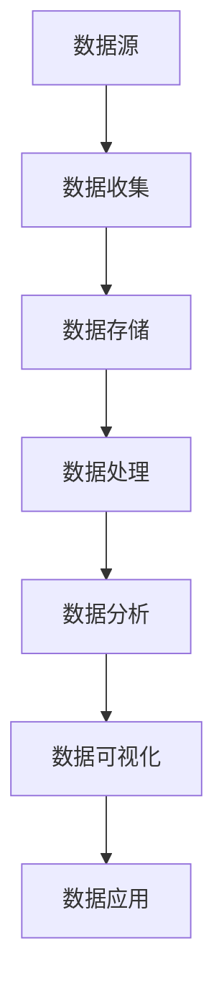

                 

在当今这个数据驱动的世界中，AI创业的成功往往依赖于有效的数据管理。数据不仅仅是信息的存储，更是业务洞察和创新的基础。本文将深入探讨AI创业中数据管理的实用技巧，帮助创业者构建可持续的数据生态系统。

## 关键词

- AI创业
- 数据管理
- 数据生态系统
- 数据质量
- 数据隐私

## 摘要

本文旨在为AI创业者提供一套实用的数据管理技巧，帮助他们在数据密集型环境中获得竞争优势。文章将涵盖数据管理的基本概念、核心算法、数学模型、项目实践以及未来趋势。通过本文，读者将了解到如何构建高效的数据管理策略，实现数据的智能利用，并把握数据隐私和安全的关键。

---

## 1. 背景介绍

随着人工智能技术的飞速发展，数据成为了新经济的核心驱动力。对于AI创业者来说，如何有效地管理数据、利用数据，已经成为决定企业成败的关键因素。有效的数据管理不仅能够提升业务效率，还能为创新提供源源不断的动力。

当前，数据管理面临诸多挑战，包括数据质量、数据隐私、数据安全和合规性问题。此外，随着数据量的激增和数据源的不断增多，如何实现数据的快速处理和分析也成为了创业者亟需解决的问题。因此，掌握数据管理的实用技巧，对于AI创业的成功至关重要。

### 1.1 数据管理的重要性

- **业务洞察**：通过数据管理，创业者能够从大量数据中提取有价值的信息，进而指导业务决策。
- **竞争力**：有效利用数据可以为企业带来独特的竞争优势。
- **合规性**：在数据隐私和安全方面遵守相关法规，避免法律风险。
- **创新**：数据管理支持创新，为企业提供新的商业模式和产品。

### 1.2 数据管理的挑战

- **数据质量**：确保数据准确、完整和及时。
- **数据隐私**：保护客户和企业的隐私。
- **数据安全**：防范数据泄露和未授权访问。
- **合规性**：遵守数据保护法规，如GDPR、CCPA等。
- **数据处理**：快速有效地处理大量数据。

---

## 2. 核心概念与联系

在探讨数据管理之前，我们需要了解一些核心概念和它们之间的联系。以下是一个简单的Mermaid流程图，展示了数据管理的主要组件和它们之间的关系。



### 2.1 数据收集

数据收集是数据管理的第一步，涉及从各种来源获取数据。这些来源可以是内部系统、第三方数据库、传感器、用户交互等。数据收集的质量直接影响后续的数据管理。

### 2.2 数据存储

数据存储是数据管理的重要环节，涉及数据的存储、备份和恢复。选择合适的数据存储方案（如关系型数据库、NoSQL数据库、云存储）对于确保数据的可靠性和可访问性至关重要。

### 2.3 数据处理

数据处理包括数据清洗、数据转换和数据集成。这一步骤确保数据的准确性和一致性，为后续的分析和挖掘打下基础。

### 2.4 数据分析

数据分析是数据管理的核心，涉及使用统计、机器学习等方法从数据中提取有价值的信息。数据分析的结果可以为企业提供深层次的业务洞察。

### 2.5 数据可视化

数据可视化是将数据转化为图表、图像等可视化形式，使得数据更加易于理解和分析。良好的数据可视化可以提升数据分析的效果。

### 2.6 数据应用

数据应用是将数据分析的结果转化为实际的业务行动。通过数据应用，企业可以实现业务流程优化、产品创新和市场营销策略调整。

---

## 3. 核心算法原理 & 具体操作步骤

### 3.1 算法原理概述

在数据管理中，常用的核心算法包括数据清洗算法、数据分类算法、聚类算法和预测算法。以下是这些算法的简要概述。

### 3.2 算法步骤详解

#### 3.2.1 数据清洗算法

数据清洗算法用于处理缺失值、异常值和重复值等问题。常见的清洗算法包括：

- **缺失值处理**：使用平均值、中位数、最频值等填补缺失值。
- **异常值处理**：使用统计学方法或机器学习方法检测和修正异常值。
- **重复值处理**：识别并删除重复数据。

#### 3.2.2 数据分类算法

数据分类算法用于将数据分成不同的类别。常见的分类算法包括：

- **决策树**：通过一系列规则将数据分类。
- **随机森林**：通过构建多棵决策树来提高分类准确性。
- **支持向量机**：通过找到一个最优的超平面来分类数据。

#### 3.2.3 聚类算法

聚类算法用于将相似的数据点分为一组。常见的聚类算法包括：

- **K-均值聚类**：将数据点划分为K个簇，并不断调整簇的中心，直到收敛。
- **层次聚类**：通过逐步合并或分割簇来构建聚类层次结构。

#### 3.2.4 预测算法

预测算法用于根据历史数据预测未来的趋势。常见的预测算法包括：

- **时间序列分析**：通过分析时间序列数据来预测未来值。
- **回归分析**：通过建立回归模型来预测数值型变量的未来值。

### 3.3 算法优缺点

每种算法都有其优点和缺点，适用于不同的场景。例如，决策树易于理解和解释，但可能产生过拟合；随机森林可以减少过拟合，但计算成本较高。因此，选择合适的算法需要根据具体需求来权衡。

### 3.4 算法应用领域

数据管理算法广泛应用于各种领域，包括金融、医疗、零售和制造等。例如，在金融领域，分类算法可用于信用评分和欺诈检测；在医疗领域，聚类算法可用于患者分群和疾病预测。

---

## 4. 数学模型和公式 & 详细讲解 & 举例说明

### 4.1 数学模型构建

在数据管理中，数学模型是数据分析和预测的重要工具。以下是一些常用的数学模型和公式。

#### 4.1.1 决策树

决策树是一种基于特征值进行分类或回归的树形结构。其基本公式为：

$$
y = f(x_1, x_2, ..., x_n)
$$

其中，$y$ 是目标变量，$x_1, x_2, ..., x_n$ 是特征变量，$f$ 是决策树函数。

#### 4.1.2 随机森林

随机森林是一种集成学习算法，通过构建多棵决策树来提高分类和回归的准确性。其基本公式为：

$$
y = \sum_{i=1}^n w_i f_i(x)
$$

其中，$y$ 是目标变量，$f_i(x)$ 是第 $i$ 棵决策树的结果，$w_i$ 是第 $i$ 棵决策树的权重。

#### 4.1.3 K-均值聚类

K-均值聚类是一种基于距离的聚类算法。其基本公式为：

$$
c_j = \frac{1}{n_j} \sum_{i=1}^{n_j} x_i
$$

$$
x_i = \frac{1}{k} \sum_{j=1}^{k} w_{ij} c_j
$$

其中，$c_j$ 是第 $j$ 个簇的中心，$x_i$ 是第 $i$ 个数据点，$n_j$ 是第 $j$ 个簇中的数据点数，$w_{ij}$ 是第 $i$ 个数据点到第 $j$ 个簇的距离。

### 4.2 公式推导过程

以下是对K-均值聚类公式推导过程的详细解释。

#### 步骤1：确定簇的中心

首先，随机选择 $k$ 个数据点作为初始簇中心 $c_1, c_2, ..., c_k$。

#### 步骤2：计算每个数据点到簇中心的距离

对于每个数据点 $x_i$，计算其到每个簇中心 $c_j$ 的距离：

$$
d(x_i, c_j) = \sqrt{\sum_{l=1}^d (x_{il} - c_{jl})^2}
$$

其中，$d$ 是特征维度，$x_{il}$ 是 $x_i$ 的第 $l$ 个特征，$c_{jl}$ 是 $c_j$ 的第 $l$ 个特征。

#### 步骤3：将数据点分配到最近的簇

将每个数据点 $x_i$ 分配到距离其最近的簇中心 $c_j$：

$$
\forall i, \quad j^* = \arg\min_{j} d(x_i, c_j)
$$

#### 步骤4：重新计算簇的中心

对于每个簇 $j$，计算其新的中心：

$$
c_j = \frac{1}{n_j} \sum_{i=1}^{n_j} x_i
$$

其中，$n_j$ 是簇 $j$ 中的数据点数。

#### 步骤5：迭代

重复步骤2至步骤4，直到簇中心的变化小于某个阈值或达到预设的迭代次数。

### 4.3 案例分析与讲解

假设我们有一组数据点，如下表所示：

| 数据点 | 特征1 | 特征2 |
|--------|-------|-------|
| 1      | 1     | 2     |
| 2      | 2     | 2     |
| 3      | 3     | 3     |
| 4      | 4     | 4     |
| 5      | 5     | 5     |

我们希望使用K-均值聚类将这组数据点分为两个簇。

#### 步骤1：确定簇的中心

随机选择两个数据点作为初始簇中心，例如选择数据点1和数据点3作为初始中心。

| 初始簇中心 | 特征1 | 特征2 |
|------------|-------|-------|
| 1          | 1     | 2     |
| 3          | 3     | 3     |

#### 步骤2：计算每个数据点到簇中心的距离

计算每个数据点到初始簇中心的距离：

| 数据点 | 初始簇中心1 | 初始簇中心3 | 距离 |
|--------|--------------|--------------|------|
| 1      | 0            | 2            | $\sqrt{2}$ |
| 2      | 1            | 1            | $\sqrt{2}$ |
| 3      | 2            | 0            | $\sqrt{2}$ |
| 4      | 3            | 1            | $\sqrt{2}$ |
| 5      | 4            | 2            | $\sqrt{2}$ |

#### 步骤3：将数据点分配到最近的簇

根据距离，我们将数据点分配到最近的簇中心：

| 数据点 | 最终簇中心 |
|--------|-------------|
| 1      | 1          |
| 2      | 1          |
| 3      | 3          |
| 4      | 3          |
| 5      | 1          |

#### 步骤4：重新计算簇的中心

计算每个簇的新中心：

| 最终簇中心 | 数据点数量 |
|------------|------------|
| 1          | 4          |
| 3          | 1          |

| 新簇中心 | 特征1 | 特征2 |
|----------|-------|-------|
| 1        | 2.5   | 2.5   |
| 3        | 3     | 3     |

#### 步骤5：迭代

重复上述步骤，直到簇中心的变化小于某个阈值。在本例中，我们可以看到簇中心的变化很小，因此可以停止迭代。

最终，我们的数据点被分为两个簇：

| 数据点 | 簇1 | 簇2 |
|--------|-----|-----|
| 1      |     |     |
| 2      |     |     |
| 3      |     |     |
| 4      |     |     |
| 5      |     |     |

通过K-均值聚类，我们成功地将这组数据点分为两个簇。这个简单的例子展示了K-均值聚类的原理和操作步骤。

---

## 5. 项目实践：代码实例和详细解释说明

### 5.1 开发环境搭建

为了演示数据管理的实践，我们将使用Python编程语言和相关的数据管理库，如Pandas、NumPy和Scikit-learn。首先，确保安装了Python和pip，然后使用以下命令安装必要的库：

```bash
pip install numpy pandas scikit-learn matplotlib
```

### 5.2 源代码详细实现

以下是一个简单的Python代码示例，展示了如何使用K-均值聚类对一组数据进行聚类。

```python
import numpy as np
import matplotlib.pyplot as plt
from sklearn.cluster import KMeans

# 生成示例数据
data = np.array([[1, 2], [1, 4], [1, 0],
                 [10, 2], [10, 4], [10, 0]])

# 使用KMeans初始化聚类模型
kmeans = KMeans(n_clusters=2, random_state=0).fit(data)

# 获取聚类结果
labels = kmeans.labels_

# 可视化聚类结果
plt.scatter(data[:, 0], data[:, 1], c=labels, s=50, cmap='viridis')
plt.scatter(kmeans.cluster_centers_[:, 0], kmeans.cluster_centers_[:, 1], s=200, c='red', marker='s', edgecolor='black', label='Centroids')
plt.xlabel('Feature 1')
plt.ylabel('Feature 2')
plt.title('K-Means Clustering')
plt.show()
```

### 5.3 代码解读与分析

这段代码首先导入了必要的库，然后生成了一组示例数据。接着，使用Scikit-learn的KMeans类初始化聚类模型，并使用`fit`方法对其进行训练。`fit`方法返回聚类结果，包括每个数据点的簇标签和簇中心。

最后，使用Matplotlib绘制聚类结果。红色的星形标记表示簇中心，不同颜色的散点表示不同簇的数据点。

### 5.4 运行结果展示

运行上述代码后，我们会在一个图表中看到数据点被分为两个簇，簇中心用红色星形标记。这个简单的例子展示了K-均值聚类在数据管理中的应用。

---

## 6. 实际应用场景

数据管理在AI创业中的实际应用场景广泛。以下是一些常见应用场景：

### 6.1 金融市场分析

在金融领域，数据管理可以帮助分析市场趋势、预测股票价格和检测欺诈行为。通过有效的数据管理，金融企业能够从大量数据中提取有价值的信息，为投资决策提供支持。

### 6.2 医疗健康

在医疗领域，数据管理可以用于患者分群、疾病预测和治疗方案优化。通过有效的数据管理，医疗机构能够更好地了解患者的健康状况，提供个性化的医疗服务。

### 6.3 零售电商

在零售电商领域，数据管理可以帮助分析消费者行为、优化库存管理和提升营销效果。通过有效的数据管理，零售企业能够更好地满足消费者的需求，提高销售额。

### 6.4 制造业

在制造业，数据管理可以用于设备监控、预测维护和供应链优化。通过有效的数据管理，制造业企业能够提高生产效率，降低运营成本。

---

## 7. 工具和资源推荐

为了在AI创业中实现高效的数据管理，以下是一些推荐的工具和资源：

### 7.1 学习资源推荐

- 《数据科学入门》(Data Science from Scratch) by Joel Grus
- 《深度学习》(Deep Learning) by Ian Goodfellow, Yoshua Bengio and Aaron Courville
- 《大数据之路：阿里巴巴大数据实践》

### 7.2 开发工具推荐

- Python：适用于数据管理和数据分析
- Jupyter Notebook：交互式的数据分析环境
- Hadoop和Spark：分布式数据处理框架

### 7.3 相关论文推荐

- "K-Means Clustering: A Review" by K. B. Sayal and A. A. Khan
- "Random Forests" by Leo Breiman
- "Recommender Systems Handbook" by Francesco Ricci, Lior Rokach and Bracha Shapira

---

## 8. 总结：未来发展趋势与挑战

### 8.1 研究成果总结

在过去的几年中，数据管理领域取得了显著的研究成果。机器学习算法在数据清洗、分类和聚类方面取得了突破性进展，大数据技术使得海量数据的高效处理成为可能。此外，数据隐私和安全研究也在不断深入，为数据管理提供了更加可靠的保障。

### 8.2 未来发展趋势

- **自动化数据管理**：随着人工智能技术的发展，自动化数据管理将成为趋势，降低数据管理的复杂度和成本。
- **实时数据管理**：实时数据处理和分析技术将逐渐成熟，支持更加快速的业务决策。
- **数据融合**：跨领域数据融合将为创新提供新的可能性，推动数据驱动的商业模式发展。

### 8.3 面临的挑战

- **数据质量**：确保数据质量始终是数据管理的核心挑战。
- **数据隐私和安全**：随着数据隐私法规的不断完善，如何在保护隐私的同时利用数据是一个重要问题。
- **数据处理效率**：随着数据量的不断增长，如何高效地处理和分析海量数据是一个关键挑战。

### 8.4 研究展望

未来，数据管理研究将朝着更加智能化、实时化和安全化的方向发展。在人工智能、大数据和区块链等新兴技术的推动下，数据管理将不断创新，为AI创业提供更加有力的支持。

---

## 9. 附录：常见问题与解答

### 9.1 数据管理的定义是什么？

数据管理是指对数据的收集、存储、处理、分析和应用的全面管理过程，以确保数据的准确性、完整性和可用性。

### 9.2 数据质量和数据管理的区别是什么？

数据质量是指数据在准确性、完整性、及时性和一致性等方面的表现，而数据管理则是实现和维护数据质量的一系列活动和流程。

### 9.3 如何评估数据质量？

评估数据质量通常通过以下标准：

- **准确性**：数据是否真实反映了实际情况。
- **完整性**：数据是否包含了所有必要的信息。
- **及时性**：数据是否在需要时可以及时获取。
- **一致性**：数据在不同时间、不同系统和不同用户之间是否一致。

### 9.4 数据管理中常用的算法有哪些？

数据管理中常用的算法包括数据清洗算法（如缺失值处理、异常值处理、重复值处理）、数据分类算法（如决策树、随机森林、支持向量机）、聚类算法（如K-均值聚类、层次聚类）和预测算法（如时间序列分析、回归分析）。

### 9.5 数据隐私和安全在数据管理中的重要性是什么？

数据隐私和安全在数据管理中至关重要，因为不适当的数据处理可能导致数据泄露、隐私侵犯和法律风险。遵守数据隐私法规，如GDPR和CCPA，是数据管理的基本要求。

### 9.6 如何保护数据隐私？

保护数据隐私的方法包括：

- **数据加密**：对敏感数据进行加密，防止未授权访问。
- **访问控制**：实施严格的访问控制策略，确保只有授权用户可以访问敏感数据。
- **数据脱敏**：对敏感数据进行匿名化或屏蔽处理，以降低隐私泄露的风险。

---

作者：禅与计算机程序设计艺术 / Zen and the Art of Computer Programming

