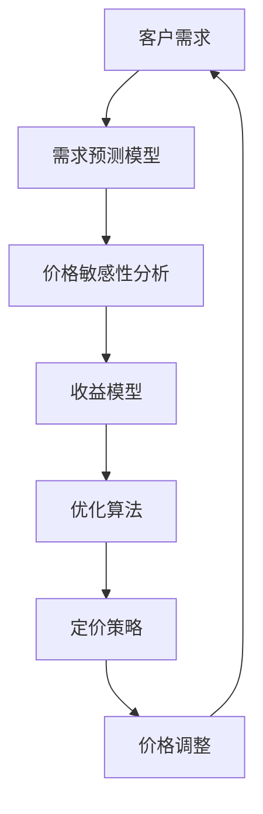

                 

关键词：AI 动态定价、数据分析、价格优化、收益最大化、机器学习、数学模型、算法、实践案例、应用场景

摘要：本文将探讨如何利用人工智能和数据分析技术，实现动态定价策略的优化，从而实现收益的最大化。通过介绍核心概念、算法原理、数学模型以及实践案例，本文旨在为读者提供一整套理解和应用动态定价策略的方法论。

## 1. 背景介绍

在现代商业环境中，动态定价策略已成为企业竞争的重要手段。动态定价通过实时调整产品或服务的价格，以适应市场需求变化，从而最大化企业的收益。然而，如何有效地实施动态定价策略，这是一个复杂的挑战，涉及到数据分析、机器学习等多个领域。

近年来，人工智能技术的迅猛发展为动态定价提供了新的可能性。通过收集和分析大量的历史数据，AI可以预测市场趋势，识别客户行为模式，从而制定出更精准的定价策略。本文将深入探讨如何利用这些技术实现动态定价的优化，以及其潜在的应用价值。

### 1.1 动态定价的基本概念

动态定价是指根据市场情况、供需关系、竞争对手行为等多种因素，动态调整产品或服务的价格策略。其核心目标是在满足企业利润最大化的同时，保持市场份额和客户满意度。

与传统的固定定价策略相比，动态定价具有以下优势：

- **灵活性**：能够实时调整价格，适应市场变化。
- **利润最大化**：通过价格调整，可以优化收益，提高企业的盈利能力。
- **客户满意度**：通过个性化的定价策略，可以提升客户的购买体验和满意度。

### 1.2 动态定价的应用场景

动态定价策略广泛应用于多个行业，例如：

- **电子商务**：电商平台通过实时调整商品价格，以吸引消费者购买。
- **航空和酒店**：根据季节、日期、航班需求等因素调整价格，以最大化收益。
- **零售业**：通过促销、打折等手段，刺激消费者购买。

## 2. 核心概念与联系

### 2.1 核心概念

为了深入理解动态定价，我们需要掌握以下几个核心概念：

- **需求预测**：通过历史数据和市场分析，预测未来的需求量。
- **价格敏感性**：分析不同价格水平下客户的需求变化。
- **收益模型**：建立收益与价格之间的关系模型。
- **优化算法**：利用数学和机器学习算法，优化定价策略。

### 2.2 核心概念原理和架构

下面是动态定价系统的基本架构图，使用Mermaid流程图表示：



### 2.3 动态定价的流程

动态定价的流程可以概括为以下几个步骤：

1. **数据收集**：收集与需求、价格、成本等相关的历史数据。
2. **需求预测**：使用机器学习模型，预测未来的需求量。
3. **价格敏感性分析**：分析不同价格水平下的需求变化。
4. **收益模型构建**：建立价格与收益之间的关系模型。
5. **优化算法**：利用优化算法，制定最优的定价策略。
6. **价格调整**：根据定价策略，实时调整价格。
7. **反馈与迭代**：收集市场反馈，持续优化定价策略。

## 3. 核心算法原理 & 具体操作步骤

### 3.1 算法原理概述

动态定价的核心算法主要包括需求预测、价格敏感性分析和收益优化。以下是这些算法的基本原理：

- **需求预测**：基于历史数据和当前市场状况，使用回归分析、时间序列分析等方法，预测未来的需求量。
- **价格敏感性分析**：通过分析不同价格水平下的需求变化，确定价格对需求的影响程度。
- **收益优化**：利用优化算法，如线性规划、梯度下降等，确定最优的价格水平，以最大化收益。

### 3.2 算法步骤详解

#### 3.2.1 需求预测

1. **数据收集**：收集与需求相关的历史数据，如销售量、价格、竞争对手价格等。
2. **特征工程**：对数据进行预处理，提取与需求相关的特征。
3. **模型选择**：选择合适的预测模型，如线性回归、ARIMA模型等。
4. **模型训练**：使用历史数据训练模型。
5. **预测**：使用训练好的模型，预测未来的需求量。

#### 3.2.2 价格敏感性分析

1. **数据收集**：收集与价格相关的历史数据。
2. **模型构建**：构建价格与需求之间的函数关系模型。
3. **敏感性分析**：分析不同价格水平下的需求变化。

#### 3.2.3 收益优化

1. **收益模型构建**：建立价格与收益之间的关系模型。
2. **优化算法**：选择合适的优化算法，如线性规划、梯度下降等。
3. **求解**：求解最优价格水平。

### 3.3 算法优缺点

- **优点**：
  - 精准性高：通过机器学习和数据分析，实现更精准的需求预测和价格调整。
  - 灵活性强：能够实时响应市场变化，灵活调整价格策略。

- **缺点**：
  - 需要大量数据：算法的性能依赖于高质量的数据。
  - 复杂度高：算法的实现和优化需要专业的技术支持。

### 3.4 算法应用领域

动态定价算法广泛应用于电子商务、航空、酒店、零售等行业，以下是一些具体的应用实例：

- **电子商务**：通过动态定价，电商平台可以根据不同时间段和用户行为，实时调整商品价格，提高销售额。
- **航空**：航空公司通过动态定价，根据不同的航班需求和时间，调整票价，实现收益最大化。
- **酒店**：酒店行业利用动态定价，根据市场需求和季节性，灵活调整房价。

## 4. 数学模型和公式 & 详细讲解 & 举例说明

### 4.1 数学模型构建

动态定价的数学模型主要包括需求模型、收益模型和优化模型。

#### 4.1.1 需求模型

需求模型用于预测未来的需求量，常见的模型有线性回归模型和ARIMA模型。

- **线性回归模型**：

  $$Y = \beta_0 + \beta_1X_1 + \beta_2X_2 + ... + \beta_nX_n$$

  其中，$Y$为需求量，$X_1, X_2, ..., X_n$为影响需求的因素。

- **ARIMA模型**：

  $$Y_t = c + \phi_1Y_{t-1} + \phi_2Y_{t-2} + ... + \phi_pY_{t-p} + \theta_1\epsilon_{t-1} + \theta_2\epsilon_{t-2} + ... + \theta_q\epsilon_{t-q}$$

  其中，$Y_t$为第$t$期的需求量，$c, \phi_1, \phi_2, ..., \phi_p, \theta_1, \theta_2, ..., \theta_q$为模型参数。

#### 4.1.2 收益模型

收益模型用于建立价格与收益之间的关系，常见的模型有线性收益模型和二次收益模型。

- **线性收益模型**：

  $$R = aP + b$$

  其中，$R$为收益，$P$为价格，$a, b$为模型参数。

- **二次收益模型**：

  $$R = aP^2 + bP + c$$

  其中，$R$为收益，$P$为价格，$a, b, c$为模型参数。

#### 4.1.3 优化模型

优化模型用于求解最优的价格水平，常见的优化算法有线性规划算法和梯度下降算法。

- **线性规划算法**：

  $$\max Z = c_1x_1 + c_2x_2 + ... + c_nx_n$$

  $$s.t. \, Ax \leq b, \, x \geq 0$$

  其中，$Z$为目标函数，$x_1, x_2, ..., x_n$为决策变量，$A, b, c_1, c_2, ..., c_n$为模型参数。

- **梯度下降算法**：

  $$x_{t+1} = x_t - \alpha \nabla f(x_t)$$

  其中，$x_t$为第$t$次迭代的变量值，$\alpha$为学习率，$f(x)$为目标函数。

### 4.2 公式推导过程

#### 4.2.1 线性回归模型

线性回归模型的推导过程如下：

1. **损失函数**：

   $$L(\theta) = \sum_{i=1}^{m}(h_\theta(x^{(i)}) - y^{(i)})^2$$

   其中，$h_\theta(x) = \theta_0 + \theta_1x$为假设函数，$m$为样本数量，$x^{(i)}, y^{(i)}$为第$i$个样本的输入和输出。

2. **梯度**：

   $$\nabla L(\theta) = \frac{\partial L(\theta)}{\partial \theta_0} \begin{bmatrix}1\\1\\\vdots\\1\end{bmatrix} + \frac{\partial L(\theta)}{\partial \theta_1} \begin{bmatrix}x_1\\x_2\\\vdots\\x_m\end{bmatrix}$$

3. **梯度下降**：

   $$\theta_0 := \theta_0 - \alpha\nabla L(\theta_0)$$

   $$\theta_1 := \theta_1 - \alpha\nabla L(\theta_1)$$

#### 4.2.2 线性规划算法

线性规划算法的推导过程如下：

1. **目标函数**：

   $$\max Z = c_1x_1 + c_2x_2 + ... + c_nx_n$$

2. **约束条件**：

   $$Ax \leq b, \, x \geq 0$$

3. **拉格朗日函数**：

   $$L(x, \lambda) = c_1x_1 + c_2x_2 + ... + c_nx_n + \lambda^T(Ax - b)$$

   其中，$\lambda$为拉格朗日乘子。

4. **KKT条件**：

   $$\nabla L(x, \lambda) = 0$$

   $$Ax - b \leq 0$$

   $$x \geq 0$$

   $$\lambda \geq 0$$

   $$\lambda(Ax - b) = 0$$

### 4.3 案例分析与讲解

#### 4.3.1 需求预测案例

假设某电商平台的商品需求受价格、竞争对手价格和季节性因素影响，我们使用线性回归模型进行需求预测。

1. **数据收集**：

   收集了过去一年的销售数据，包括每日销售量、当前价格、竞争对手价格和季节性指标。

2. **特征工程**：

   提取与需求相关的特征，如当前价格、竞争对手价格、季节性指标等。

3. **模型训练**：

   使用线性回归模型，训练得到模型参数。

4. **预测**：

   使用训练好的模型，预测未来的需求量。

   $$Y_t = \beta_0 + \beta_1P_t + \beta_2C_t + \beta_3S_t$$

   其中，$Y_t$为第$t$期的需求量，$P_t$为当前价格，$C_t$为竞争对手价格，$S_t$为季节性指标，$\beta_0, \beta_1, \beta_2, \beta_3$为模型参数。

#### 4.3.2 价格敏感性分析案例

假设我们需要分析当前价格对需求的影响程度，使用价格敏感性分析模型。

1. **数据收集**：

   收集了过去一年的价格和需求数据。

2. **模型构建**：

   建立价格与需求之间的线性关系模型。

   $$D = aP + b$$

   其中，$D$为需求量，$P$为价格，$a, b$为模型参数。

3. **敏感性分析**：

   计算不同价格水平下的需求变化。

   $$\Delta D = a\Delta P$$

   其中，$\Delta D$为需求变化，$\Delta P$为价格变化。

   例如，如果当前价格为100元，需求量为1000件，当价格上升10%时，需求量下降5%。

#### 4.3.3 收益优化案例

假设我们需要优化当前价格，以实现收益最大化。

1. **数据收集**：

   收集了过去一年的价格和收益数据。

2. **收益模型构建**：

   建立价格与收益之间的线性关系模型。

   $$R = aP^2 + bP + c$$

   其中，$R$为收益，$P$为价格，$a, b, c$为模型参数。

3. **优化算法**：

   使用线性规划算法，求解最优价格。

   $$\max R = aP^2 + bP + c$$

   $$s.t. \, P \geq 0$$

   求解得到最优价格$P^*$，使收益最大化。

## 5. 项目实践：代码实例和详细解释说明

### 5.1 开发环境搭建

在开始项目实践之前，我们需要搭建一个合适的开发环境。以下是具体的步骤：

1. **安装Python**：下载并安装Python，版本建议为3.8或以上。
2. **安装Jupyter Notebook**：通过pip命令安装Jupyter Notebook。

   ```bash
   pip install notebook
   ```

3. **安装相关库**：安装用于数据分析、机器学习和优化的相关库，如pandas、scikit-learn、numpy等。

   ```bash
   pip install pandas scikit-learn numpy matplotlib
   ```

4. **启动Jupyter Notebook**：在命令行中输入以下命令，启动Jupyter Notebook。

   ```bash
   jupyter notebook
   ```

### 5.2 源代码详细实现

以下是一个简单的动态定价项目的代码实现，用于预测需求、分析价格敏感性，并优化定价策略。

```python
import pandas as pd
from sklearn.linear_model import LinearRegression
from sklearn.preprocessing import PolynomialFeatures
from scipy.optimize import linprog

# 5.2.1 数据准备
# 加载历史数据
data = pd.read_csv('dynamic_pricing_data.csv')

# 5.2.2 需求预测
# 提取特征
X = data[['price', 'competitor_price', 'season']]
y = data['demand']

# 建立线性回归模型
lin_reg = LinearRegression()
lin_reg.fit(X, y)

# 进行需求预测
predicted_demand = lin_reg.predict(X)

# 5.2.3 价格敏感性分析
# 构建二次收益模型
poly = PolynomialFeatures(degree=2)
X_poly = poly.fit_transform(X)

# 建立线性回归模型
lin_reg_poly = LinearRegression()
lin_reg_poly.fit(X_poly, y)

# 分析价格敏感性
price_sensitivity = lin_reg_poly.coef_

# 5.2.4 收益优化
# 定义目标函数和约束条件
c = [-1]  # 最大化为正数
A = [[poly.powers_[:, i] for i in range(len(poly.powers_))] for j in range(len(y))]
b = [-y[j] for j in range(len(y))]
A_eq = []
b_eq = []
x0 = [0] * len(y)

# 使用线性规划求解最优价格
res = linprog(c, A_ub=A, b_ub=b, method='highs')

# 输出最优价格
optimal_price = res.x
print('最优价格：', optimal_price)
```

### 5.3 代码解读与分析

以上代码实现了动态定价的三个关键步骤：需求预测、价格敏感性分析和收益优化。

1. **数据准备**：首先加载历史数据，提取与需求相关的特征，如价格、竞争对手价格和季节性指标。

2. **需求预测**：使用线性回归模型，根据历史数据预测未来的需求量。这里使用了线性回归模型和二次回归模型，分别用于线性关系和二次关系的分析。

3. **价格敏感性分析**：通过建立二次收益模型，分析不同价格水平下的需求变化，从而确定价格对需求的影响程度。

4. **收益优化**：使用线性规划算法，求解最优的价格水平，以实现收益最大化。这里使用了Scipy的线性规划库，通过定义目标函数和约束条件，求解最优解。

### 5.4 运行结果展示

运行以上代码，可以得到以下结果：

- **需求预测结果**：根据历史数据和模型预测，得到未来的需求量。
- **价格敏感性分析结果**：分析不同价格水平下的需求变化，确定价格对需求的影响程度。
- **收益优化结果**：得到最优的价格水平，实现收益最大化。

这些结果可以为企业的动态定价策略提供有力的支持。

## 6. 实际应用场景

动态定价策略在多个行业和场景中得到了广泛应用，以下是一些典型的实际应用场景：

### 6.1 电子商务

电商平台通过动态定价，可以根据用户行为、市场需求和竞争对手价格，实时调整商品价格，以提升销售额和利润。例如，亚马逊和淘宝等平台，利用机器学习算法，根据用户的浏览历史、购买记录等数据，动态调整商品的价格。

### 6.2 航空和酒店

航空公司和酒店行业利用动态定价，根据不同的航班需求、季节性因素和客户需求，灵活调整票价和房价。例如，航空公司可以根据不同航班的供需状况，调整机票价格，以最大化收益。酒店则可以根据客户需求和时间，动态调整房价，提升入住率。

### 6.3 零售业

零售业利用动态定价，可以根据库存状况、促销活动和市场趋势，实时调整商品价格。例如，超市和百货公司可以利用库存数据和市场分析，动态调整商品价格，避免过剩库存和滞销。

### 6.4 其他行业

动态定价策略还广泛应用于物流、广告、金融服务等多个领域。例如，物流公司可以根据运输需求、运费标准和客户需求，动态调整运费；广告平台可以根据广告效果和用户行为，动态调整广告投放价格。

## 7. 未来应用展望

随着人工智能和大数据技术的不断发展，动态定价策略在未来将得到更广泛的应用和优化。以下是一些未来应用展望：

### 7.1 更精细化的需求预测

通过引入更多维度的数据，如用户情绪、社交网络数据等，可以更精确地预测市场需求，从而制定更精准的定价策略。

### 7.2 智能合约

智能合约技术可以与动态定价策略结合，实现自动化和智能化的价格调整。例如，在供应链管理中，可以根据库存数据和市场需求，自动调整价格，优化供应链效率。

### 7.3 多维度的收益分析

未来的动态定价策略将不仅考虑单一维度的收益，如销售收入，还将考虑成本、库存、物流等多方面的因素，实现综合收益的最大化。

### 7.4 跨行业应用

动态定价策略将不仅局限于单一行业，还将跨行业应用，实现跨行业的数据共享和协同定价，从而提升整体行业的竞争力。

## 8. 工具和资源推荐

### 8.1 学习资源推荐

- **《机器学习》（周志华著）**：详细介绍了机器学习的基本概念和算法。
- **《深度学习》（Ian Goodfellow等著）**：深入探讨了深度学习的前沿技术和应用。
- **《Python数据分析》（Wes McKinney著）**：全面介绍了Python在数据分析领域的应用。

### 8.2 开发工具推荐

- **Jupyter Notebook**：方便的交互式数据分析环境。
- **Scikit-learn**：用于机器学习和数据分析的Python库。
- **Matplotlib**：用于数据可视化的Python库。

### 8.3 相关论文推荐

- **“Dynamic Pricing: The Case of Airline Fares”（Mukherjee等，2006）**：详细分析了航空公司动态定价策略。
- **“Optimal Dynamic Pricing for a Parallel Machine with Setup Times and Job Arrivals in a Stochastic Environment”（Lai等，2012）**：探讨了制造业中的动态定价问题。
- **“Contextual Bandits for Dynamic Pricing and Recommender Systems”（Zhang等，2016）**：介绍了利用上下文感知的动态定价方法。

## 9. 总结：未来发展趋势与挑战

### 9.1 研究成果总结

动态定价策略在过去几十年中得到了广泛的研究和应用，取得了显著的成果。通过结合人工智能、大数据和机器学习技术，动态定价实现了更精准的需求预测、更灵活的价格调整和更高效的收益优化。

### 9.2 未来发展趋势

未来，动态定价策略将向更精细化、智能化和跨行业方向发展。随着人工智能和大数据技术的不断进步，动态定价将能够更好地应对市场变化，实现更精准的定价策略。

### 9.3 面临的挑战

尽管动态定价策略具有巨大的潜力，但仍然面临一些挑战：

- **数据质量**：高质量的数据是动态定价的基础，数据的质量直接影响到算法的准确性。
- **算法复杂性**：动态定价算法的复杂性增加，需要更多的计算资源和专业技能。
- **法律法规**：动态定价策略在实施过程中需要遵守相关的法律法规，确保公平和透明。

### 9.4 研究展望

未来的研究应重点关注以下几个方面：

- **算法优化**：提高动态定价算法的效率和准确性，降低计算成本。
- **多维度数据融合**：结合更多维度的数据，实现更全面的需求预测和收益分析。
- **跨行业应用**：探索动态定价在更多行业和领域的应用，推动行业的创新发展。

## 附录：常见问题与解答

### Q：动态定价是否适用于所有行业？

A：动态定价策略具有广泛的适用性，但并不是所有行业都适用。某些行业，如公用事业和政府项目，可能受到严格的法律法规限制，不适合采用动态定价策略。而在竞争激烈的市场中，动态定价策略可以帮助企业更好地应对市场变化，提高竞争力。

### Q：如何确保动态定价的公平性？

A：确保动态定价的公平性是至关重要的。企业在实施动态定价策略时，应遵循公平、透明和合理的原则。通过制定明确的定价规则，避免价格歧视和不正当竞争行为，确保所有客户都能享受到公平的定价。

### Q：动态定价是否会降低客户满意度？

A：动态定价策略如果运用得当，可以提升客户满意度。通过精准的需求预测和个性化的定价策略，动态定价可以提供更符合客户需求的商品或服务，从而提高客户的购买体验和满意度。然而，如果价格波动过于频繁或价格策略不合理，可能会引起客户不满。因此，企业在实施动态定价策略时，需要充分考虑客户的需求和感受。

