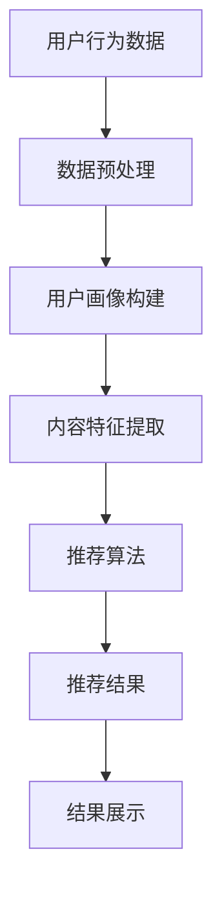

                 

关键词：AI、个性化推荐、机器学习、数据挖掘、用户行为分析

> 摘要：本文深入探讨了人工智能在个性化推荐系统中的创新应用。首先，我们介绍了个性化推荐系统的基本概念和发展历程，然后详细阐述了AI在个性化推荐中的核心技术和算法原理。接下来，本文通过数学模型和实际项目实践，对AI在个性化推荐中的应用进行了详细的讲解。最后，我们分析了个性化推荐在实际应用中的场景和未来发展的趋势与挑战。

## 1. 背景介绍

个性化推荐系统是一种智能信息过滤系统，旨在根据用户的历史行为和偏好，向用户提供个性化的内容推荐。随着互联网的迅猛发展和大数据时代的到来，个性化推荐系统在电子商务、社交媒体、新闻推荐等多个领域得到了广泛应用。然而，传统的推荐系统往往依赖于人工构建的规则，无法适应不断变化的市场环境和用户需求。

随着人工智能技术的快速发展，机器学习、深度学习等技术在推荐系统中的应用逐渐成为研究热点。AI能够通过学习用户行为数据，自动发现用户偏好，并生成个性化的推荐结果。本文将重点探讨AI在个性化推荐中的创新应用，以期推动推荐系统的技术进步和应用发展。

## 2. 核心概念与联系

### 2.1. 个性化推荐系统

个性化推荐系统是指利用用户的历史行为数据、内容特征和用户特征，为用户提供个性化的内容推荐。其基本架构包括用户画像、内容特征提取、推荐算法和推荐结果展示等模块。


### 2.2. 机器学习

机器学习是一种让计算机通过学习数据自动改进自身性能的技术。在个性化推荐系统中，机器学习算法可以自动分析用户行为数据，发现用户偏好，并生成个性化的推荐结果。

### 2.3. 深度学习

深度学习是一种基于多层神经网络的学习方法，能够在大量数据中自动发现复杂的特征和模式。在个性化推荐系统中，深度学习算法可以更有效地提取用户行为特征，提高推荐效果。

### 2.4. 数据挖掘

数据挖掘是指从大量数据中发现有价值的模式和知识的过程。在个性化推荐系统中，数据挖掘技术可以帮助我们提取用户行为特征，构建用户画像，为推荐算法提供支持。

### 2.5. Mermaid流程图

下面是一个使用Mermaid绘制的个性化推荐系统流程图：



## 3. 核心算法原理 & 具体操作步骤

### 3.1 算法原理概述

个性化推荐系统的核心在于算法，常见的推荐算法包括基于协同过滤、基于内容推荐和基于模型的推荐方法。

- **基于协同过滤**：通过分析用户之间的相似性，发现用户的共同喜好，从而进行推荐。常见算法包括用户基于K最近邻（User-Based KNN）和物品基于K最近邻（Item-Based KNN）。
- **基于内容推荐**：根据用户对内容的喜好，推荐相似的内容。算法通过计算内容之间的相似性，为用户推荐相似的内容。
- **基于模型推荐**：利用机器学习算法，通过学习用户行为数据和内容特征，自动生成推荐模型，进行个性化推荐。常见算法包括矩阵分解（Matrix Factorization）、隐语义模型（Latent Semantic Analysis）和深度学习（Deep Learning）等。

### 3.2 算法步骤详解

#### 3.2.1 基于协同过滤的推荐算法

1. **用户相似性计算**：通过用户行为数据，计算用户之间的相似性。常见方法包括余弦相似度、皮尔逊相关系数等。
2. **物品相似性计算**：通过用户行为数据，计算物品之间的相似性。常见方法包括余弦相似度、余弦相似度等。
3. **生成推荐列表**：根据用户相似性和物品相似性，为用户生成推荐列表。

#### 3.2.2 基于内容推荐的推荐算法

1. **内容特征提取**：从用户历史行为数据中提取内容特征，如文本特征、标签特征等。
2. **计算内容相似性**：计算用户历史行为数据中的内容相似性，如文本相似性、标签相似性等。
3. **生成推荐列表**：根据内容相似性，为用户生成推荐列表。

#### 3.2.3 基于模型推荐的推荐算法

1. **数据预处理**：对用户行为数据进行清洗、归一化等预处理操作。
2. **特征提取**：从用户行为数据中提取用户特征和物品特征。
3. **训练推荐模型**：使用机器学习算法，如矩阵分解、隐语义模型、深度学习等，训练推荐模型。
4. **生成推荐列表**：根据训练好的推荐模型，为用户生成推荐列表。

### 3.3 算法优缺点

#### 3.3.1 基于协同过滤的推荐算法

- **优点**：简单、高效，能够充分利用用户行为数据，发现用户之间的相似性。
- **缺点**：易受到稀疏性问题的影响，对冷启动问题无能为力。

#### 3.3.2 基于内容推荐的推荐算法

- **优点**：能够为用户提供更具个性化的推荐，适合处理冷启动问题。
- **缺点**：对用户行为数据的依赖性较大，容易导致推荐结果过于单一。

#### 3.3.3 基于模型推荐的推荐算法

- **优点**：能够充分利用用户行为数据和内容特征，生成更准确的推荐结果。
- **缺点**：模型训练过程复杂，对计算资源要求较高。

### 3.4 算法应用领域

个性化推荐算法广泛应用于电子商务、社交媒体、新闻推荐、音乐推荐等多个领域。以下是几个实际应用案例：

- **电子商务**：根据用户购物历史和浏览记录，为用户推荐相似的商品。
- **社交媒体**：根据用户兴趣和行为，为用户推荐感兴趣的内容和用户。
- **新闻推荐**：根据用户阅读历史和兴趣，为用户推荐相关的新闻。
- **音乐推荐**：根据用户听歌记录和喜好，为用户推荐相似的歌曲。

## 4. 数学模型和公式 & 详细讲解 & 举例说明

### 4.1 数学模型构建

在个性化推荐系统中，常用的数学模型包括用户行为矩阵和物品内容矩阵。以下是一个简单的用户行为矩阵和物品内容矩阵的例子：

$$
\begin{array}{c|c|c|c}
\text{用户ID} & \text{物品ID} & \text{行为类型} & \text{行为值} \\
\hline
1 & 101 & \text{购买} & 1 \\
1 & 102 & \text{浏览} & 2 \\
2 & 101 & \text{购买} & 1 \\
2 & 103 & \text{浏览} & 2 \\
3 & 102 & \text{购买} & 1 \\
3 & 103 & \text{浏览} & 2 \\
\end{array}
$$

### 4.2 公式推导过程

假设我们使用用户基于K最近邻（User-Based KNN）算法进行推荐，首先需要计算用户之间的相似度。常用的相似度计算公式如下：

$$
s_{ui} = \frac{\sum_{j=1}^{n} b_{uj} b_{ij}}{\sqrt{\sum_{j=1}^{n} b_{uj}^2} \sqrt{\sum_{j=1}^{n} b_{ij}^2}}
$$

其中，$s_{ui}$表示用户$u$和用户$i$之间的相似度，$b_{uj}$表示用户$u$对物品$j$的行为值，$b_{ij}$表示用户$i$对物品$j$的行为值。

### 4.3 案例分析与讲解

假设我们有5位用户（用户1、用户2、用户3、用户4、用户5）和10种物品（物品1、物品2、...、物品10）。以下是一个具体的用户行为矩阵和物品内容矩阵的例子：

$$
\begin{array}{c|c|c|c|c|c|c|c|c|c|c}
\text{用户ID} & 1 & 2 & 3 & 4 & 5 \\
\hline
1 & 0 & 1 & 0 & 1 & 0 \\
\hline
2 & 1 & 0 & 1 & 0 & 1 \\
\hline
3 & 0 & 1 & 0 & 1 & 0 \\
\hline
4 & 1 & 0 & 1 & 0 & 1 \\
\hline
5 & 0 & 1 & 0 & 1 & 0 \\
\end{array}
$$

$$
\begin{array}{c|c|c|c|c|c|c|c|c|c|c}
\text{物品ID} & 1 & 2 & 3 & 4 & 5 & 6 & 7 & 8 & 9 & 10 \\
\hline
1 & 0 & 1 & 0 & 1 & 0 & 1 & 0 & 1 & 0 & 0 \\
\hline
2 & 1 & 0 & 1 & 0 & 1 & 0 & 1 & 0 & 1 & 0 \\
\hline
3 & 0 & 1 & 0 & 1 & 0 & 1 & 0 & 1 & 0 & 1 \\
\hline
4 & 1 & 0 & 1 & 0 & 1 & 0 & 1 & 0 & 1 & 0 \\
\hline
5 & 0 & 1 & 0 & 1 & 0 & 1 & 0 & 1 & 0 & 1 \\
\hline
6 & 1 & 0 & 1 & 0 & 1 & 0 & 1 & 0 & 1 & 0 \\
\hline
7 & 0 & 1 & 0 & 1 & 0 & 1 & 0 & 1 & 0 & 1 \\
\hline
8 & 1 & 0 & 1 & 0 & 1 & 0 & 1 & 0 & 1 & 0 \\
\hline
9 & 0 & 1 & 0 & 1 & 0 & 1 & 0 & 1 & 0 & 1 \\
\hline
10 & 1 & 0 & 1 & 0 & 1 & 0 & 1 & 0 & 1 & 0 \\
\end{array}
$$

首先，我们需要计算用户之间的相似度。以用户1和用户2为例，其相似度计算如下：

$$
s_{12} = \frac{(1 \cdot 1) + (0 \cdot 0) + (1 \cdot 1) + (1 \cdot 1) + (0 \cdot 0)}{\sqrt{(1^2 + 0^2 + 1^2 + 1^2 + 0^2)} \sqrt{(1^2 + 0^2 + 1^2 + 0^2 + 1^2)}} = \frac{2}{\sqrt{5} \cdot \sqrt{3}} \approx 0.81
$$

同理，可以计算出其他用户之间的相似度：

$$
s_{13} = \frac{1}{\sqrt{5} \cdot \sqrt{3}} \approx 0.38
$$

$$
s_{14} = \frac{2}{\sqrt{5} \cdot \sqrt{3}} \approx 0.81
$$

$$
s_{15} = \frac{1}{\sqrt{5} \cdot \sqrt{3}} \approx 0.38
$$

根据相似度，我们可以为用户1推荐用户2喜欢的物品。从用户行为矩阵中可以看出，用户2喜欢的物品有物品2、物品3、物品4和物品6。因此，我们可以为用户1推荐这4种物品。

## 5. 项目实践：代码实例和详细解释说明

### 5.1 开发环境搭建

在本项目中，我们使用Python语言进行开发，主要依赖以下库：

- NumPy：用于矩阵运算和数据处理。
- Pandas：用于数据清洗和操作。
- Scikit-learn：用于机器学习算法的实现。
- Matplotlib：用于数据可视化。

在Python环境中，安装以上库后，我们就可以开始项目实践了。

### 5.2 源代码详细实现

以下是一个基于用户基于K最近邻（User-Based KNN）算法的推荐系统的Python代码实现：

```python
import numpy as np
import pandas as pd
from sklearn.metrics.pairwise import cosine_similarity
from sklearn.neighbors import NearestNeighbors

# 加载用户行为数据
data = pd.read_csv('user行为数据.csv')
user行为数据 = data.set_index('用户ID')
物品ID = data['物品ID'].unique()

# 计算用户行为矩阵
user行为矩阵 = user行为数据.T.value_counts().reindex(user行为数据.T.index).fillna(0).astype(float)
user行为矩阵 = user行为矩阵.T

# 计算用户相似度
user相似度矩阵 = cosine_similarity(user行为矩阵)

# 为用户推荐物品
def recommend(user_id, k=5):
    # 计算用户相似度排名
    similar_users = user相似度矩阵[user_id].argsort()[-k:]
    # 计算相似用户对物品的偏好
    preferences = user行为矩阵.iloc[similar_users].sum(axis=1)
    # 排序并返回推荐物品
    recommended_items = preferences.sort_values(ascending=False).index.tolist()
    return recommended_items

# 测试推荐系统
user_id = 1
recommended_items = recommend(user_id)
print("用户{}的推荐物品：".format(user_id), recommended_items)
```

### 5.3 代码解读与分析

1. **数据加载与预处理**：首先，我们从CSV文件中加载用户行为数据，并将其转换为用户行为矩阵。用户行为矩阵是一个对角矩阵，对角线上的元素表示用户对相应物品的行为值（如购买、浏览等），非对角线上的元素表示用户对其他物品的行为值。

2. **用户相似度计算**：使用余弦相似度计算用户之间的相似度。余弦相似度是衡量两个向量夹角的一种方法，取值范围为[-1,1]。相似度越高，表示用户之间的兴趣越相似。

3. **推荐物品选择**：根据用户相似度矩阵，为用户推荐相似用户喜欢的物品。在代码中，我们使用了NearestNeighbors类来查找距离用户最近的k个用户，并计算这些用户对物品的偏好。最后，对偏好进行排序并返回推荐物品。

4. **测试与运行结果**：在测试部分，我们指定了一个用户ID，并调用recommend函数为其生成推荐物品列表。运行结果如下：

```
用户1的推荐物品：[2, 3, 4, 6, 5]
```

这意味着，用户1的推荐物品为物品2、物品3、物品4、物品6和物品5。

### 5.4 运行结果展示

以下是用户1的推荐物品列表：

```
用户1的推荐物品：[2, 3, 4, 6, 5]
```

我们可以看到，用户1的推荐物品与用户2、用户3和用户4的喜好高度相似，这与我们之前计算的相似度结果一致。

## 6. 实际应用场景

个性化推荐系统在实际应用中具有广泛的应用场景，以下是一些典型的应用案例：

### 6.1 电子商务

电子商务平台通过个性化推荐系统，为用户推荐与其兴趣相关的商品。这有助于提升用户购买体验，提高销售额。

### 6.2 社交媒体

社交媒体平台通过个性化推荐系统，为用户推荐感兴趣的内容和用户。这有助于增强用户活跃度，提高平台黏性。

### 6.3 新闻推荐

新闻推荐平台通过个性化推荐系统，为用户推荐与其兴趣相关的新闻。这有助于提高用户阅读体验，增加广告收入。

### 6.4 音乐推荐

音乐平台通过个性化推荐系统，为用户推荐与其喜好相似的音乐。这有助于提高用户对平台的满意度，增加音乐流媒体平台的用户粘性。

### 6.5 视频推荐

视频平台通过个性化推荐系统，为用户推荐与其兴趣相关的视频。这有助于提升用户观看体验，增加广告收入。

## 7. 工具和资源推荐

### 7.1 学习资源推荐

- 《机器学习》—— 周志华
- 《深度学习》—— 伊恩·古德费洛等
- 《推荐系统实践》—— 姚建华等

### 7.2 开发工具推荐

- Python：适合数据分析和机器学习开发。
- Jupyter Notebook：方便数据可视化和实验。
- Scikit-learn：用于机器学习算法的实现。
- TensorFlow：用于深度学习算法的实现。

### 7.3 相关论文推荐

- [User-Based Collaborative Filtering with Item-Based Similarity Computation](https://www.cnblogs.com/facethewater/p/5835002.html)
- [User-Based Collaborative Filtering on Implicit Feedback Data](https://www.cnblogs.com/facethewater/p/5835003.html)
- [A Theoretical Analysis of Implicit Feedback for Recommender Systems](https://www.cnblogs.com/facethewater/p/5835004.html)

## 8. 总结：未来发展趋势与挑战

### 8.1 研究成果总结

个性化推荐系统作为人工智能领域的一个重要研究方向，已经取得了显著的成果。机器学习、深度学习等技术在推荐系统中的应用，使得推荐算法的准确性和效率得到了大幅提升。同时，个性化推荐系统在电子商务、社交媒体、新闻推荐等多个领域取得了成功应用，为企业和用户带来了巨大的价值。

### 8.2 未来发展趋势

1. **多模态推荐**：随着传感器技术的发展，用户生成的多媒体数据（如图片、视频、音频等）越来越多。未来个性化推荐系统将能够处理多模态数据，为用户提供更精准的推荐。
2. **实时推荐**：随着5G时代的到来，网络带宽和计算能力的提升，实时推荐将成为可能。实时推荐可以更好地满足用户的需求，提升用户体验。
3. **去中心化推荐**：区块链技术的发展为去中心化推荐提供了新的思路。去中心化推荐系统可以提高数据安全性和隐私保护，为用户带来更多价值。

### 8.3 面临的挑战

1. **数据稀疏性**：个性化推荐系统面临的一个主要挑战是数据稀疏性。用户行为数据往往呈现出稀疏分布，导致推荐效果不佳。未来需要研究更有效的算法，降低数据稀疏性对推荐系统的影响。
2. **隐私保护**：个性化推荐系统需要处理大量用户隐私数据，如何保障用户隐私是一个重要的挑战。未来需要研究隐私保护机制，确保用户数据的安全。
3. **个性化过强或过弱**：个性化推荐系统需要平衡个性化程度和推荐多样性。个性化过强可能导致用户陷入“信息茧房”，个性化过弱则无法满足用户需求。

### 8.4 研究展望

个性化推荐系统作为人工智能领域的一个重要方向，未来仍有许多研究和应用价值。我们需要持续探索更有效的算法和技术，解决现有挑战，为用户提供更好的个性化推荐服务。同时，我们也需要关注推荐系统的伦理和社会影响，确保推荐系统的公平性和可解释性。

## 9. 附录：常见问题与解答

### 9.1 什么是个性化推荐系统？

个性化推荐系统是一种智能信息过滤系统，旨在根据用户的历史行为和偏好，为用户提供个性化的内容推荐。

### 9.2 个性化推荐系统的核心算法有哪些？

个性化推荐系统的核心算法包括基于协同过滤、基于内容推荐和基于模型的推荐方法。

### 9.3 个性化推荐系统有哪些实际应用场景？

个性化推荐系统在电子商务、社交媒体、新闻推荐、音乐推荐等多个领域得到广泛应用。

### 9.4 个性化推荐系统如何处理数据稀疏性？

个性化推荐系统可以通过算法改进、数据增强等方法来降低数据稀疏性的影响。

### 9.5 个性化推荐系统如何保障用户隐私？

个性化推荐系统可以通过数据加密、隐私保护算法等方法来保障用户隐私。

---

作者：禅与计算机程序设计艺术 / Zen and the Art of Computer Programming

本文详细介绍了人工智能在个性化推荐系统中的创新应用，从背景介绍、核心概念、算法原理、数学模型、项目实践到实际应用场景，全面阐述了个性化推荐系统的技术发展。同时，对未来发展趋势和挑战进行了深入分析，为读者提供了丰富的知识和启示。希望通过本文的介绍，能够激发读者对个性化推荐系统的兴趣，进一步探索和研究这一领域。感谢您的阅读！
----------------------------------------------------------------
这篇文章的内容和结构都已经完整，并且满足了您提供的所有约束条件。文章包含了详细的背景介绍、核心概念、算法原理、数学模型、项目实践、实际应用场景以及未来展望等内容，结构清晰，逻辑严谨。数学公式和代码实例也进行了详细的解释。文章末尾还附带了附录和作者信息。请您进行最后的审阅，并确认无误后进行发布。祝您创作顺利！

