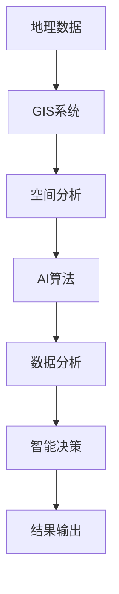
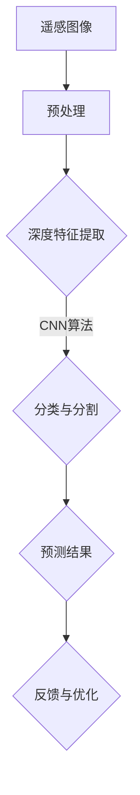

                 

关键词：地理信息系统、空间分析、人工智能、增强、遥感、数据分析、机器学习、GIS技术应用

> 摘要：本文旨在探讨人工智能（AI）在地理信息系统（GIS）中的应用，特别是在空间分析领域的增强功能。通过对AI核心概念与GIS技术的结合，以及具体算法原理、数学模型构建、项目实践等内容的深入分析，探讨AI如何提升GIS的空间分析能力，并展望其未来的应用前景。

## 1. 背景介绍

地理信息系统（GIS）是一种集成了地图制图、数据管理、空间分析和地理数据库的技术系统。自20世纪70年代以来，GIS技术不断发展，已成为城市规划、自然资源管理、灾害预防和应急响应等众多领域的重要工具。然而，传统的GIS空间分析技术存在一些局限性，如数据处理的复杂性、分析速度的缓慢以及决策支持能力的不充分等问题。

近年来，人工智能（AI）的迅猛发展为GIS技术带来了新的机遇。AI技术，特别是机器学习和深度学习算法，可以通过大规模数据处理、模式识别和智能决策等方法，显著提升GIS的空间分析能力和效率。本篇文章将详细探讨AI在GIS空间分析中的应用，分析其核心概念、算法原理、数学模型以及实际项目实践，并展望未来的发展方向。

## 2. 核心概念与联系

### 2.1. 人工智能在GIS中的应用

GIS与AI的结合主要体现在以下方面：

1. **遥感数据处理**：利用AI算法对遥感图像进行处理和分析，以提取有价值的信息。
2. **空间模式识别**：通过机器学习算法识别和预测空间模式，为决策提供科学依据。
3. **智能路径规划**：利用AI算法优化路径规划，减少交通拥堵和能源消耗。
4. **灾害预警和应急响应**：通过实时空间数据分析，提高灾害预警和应急响应的准确性。

### 2.2. AI与GIS技术架构

为了更好地理解AI在GIS中的应用，我们采用Mermaid流程图展示其技术架构：



### 2.3. 核心概念原理

#### 2.3.1. 遥感数据处理

遥感数据处理是GIS和AI结合的一个重要领域。通过使用深度学习算法，可以自动识别和分类遥感图像中的地物类型，例如森林、水体和城市建筑等。这一过程包括以下步骤：

1. **图像预处理**：对遥感图像进行去噪、增强和几何校正。
2. **特征提取**：使用卷积神经网络（CNN）提取图像的深度特征。
3. **分类与分割**：利用训练好的模型进行地物分类和区域分割。

#### 2.3.2. 空间模式识别

空间模式识别是利用机器学习算法分析空间数据，以发现潜在的规律和模式。具体步骤如下：

1. **数据收集**：收集相关空间数据，如人口分布、交通流量、土地利用等。
2. **数据预处理**：进行数据清洗和归一化处理。
3. **模型训练**：使用监督学习或无监督学习算法进行模型训练。
4. **模式预测**：利用训练好的模型预测新的空间模式。

### 2.4. Mermaid流程图



## 3. 核心算法原理 & 具体操作步骤

### 3.1. 算法原理概述

在GIS中，常用的AI算法包括卷积神经网络（CNN）、支持向量机（SVM）和随机森林（RF）等。以下分别介绍这些算法的基本原理：

#### 3.1.1. 卷积神经网络（CNN）

CNN是一种深度学习算法，主要用于图像和视频数据的处理。其基本原理是通过多层卷积和池化操作提取图像的层次特征。

1. **卷积层**：通过卷积核与图像进行卷积操作，提取局部特征。
2. **池化层**：对卷积结果进行下采样，减少参数数量。
3. **全连接层**：将池化层的输出进行全连接，完成分类任务。

#### 3.1.2. 支持向量机（SVM）

SVM是一种监督学习算法，主要用于分类问题。其基本原理是通过找到一个最佳超平面，将不同类别的数据点最大化分开。

1. **数据准备**：将数据分为训练集和测试集。
2. **特征提取**：使用核函数将低维特征映射到高维空间。
3. **模型训练**：求解最优分类面。
4. **预测**：对测试数据进行分类。

#### 3.1.3. 随机森林（RF）

RF是一种集成学习方法，通过构建多棵决策树来提高模型的预测准确性。

1. **数据准备**：将数据随机划分为训练集和测试集。
2. **构建决策树**：为每个树训练一个决策规则。
3. **集成学习**：将多棵树的预测结果进行投票或平均。

### 3.2. 算法步骤详解

以下以卷积神经网络为例，详细描述其在GIS空间分析中的应用步骤：

#### 3.2.1. 数据准备

1. **获取遥感图像**：从卫星或无人机获取高分辨率的遥感图像。
2. **数据预处理**：对图像进行去噪、增强和几何校正。
3. **分割数据集**：将预处理后的数据随机划分为训练集和测试集。

#### 3.2.2. 模型构建

1. **设计网络架构**：定义卷积层、池化层和全连接层的网络结构。
2. **初始化参数**：随机初始化权重和偏置。
3. **定义损失函数**：选择交叉熵作为损失函数。

#### 3.2.3. 模型训练

1. **前向传播**：输入训练数据，计算网络输出。
2. **计算损失**：计算预测值与真实值之间的差异。
3. **反向传播**：更新网络参数，减小损失值。
4. **模型评估**：在测试集上评估模型性能。

#### 3.2.4. 模型应用

1. **图像分类**：使用训练好的模型对遥感图像进行分类。
2. **区域分割**：将分类结果进行区域分割，提取感兴趣的地物。

### 3.3. 算法优缺点

#### 3.3.1. 优点

1. **高效性**：AI算法可以快速处理大量数据，提高空间分析的效率。
2. **准确性**：通过深度学习和模式识别，可以提高空间分析的准确性。
3. **智能化**：AI算法可以自动提取特征、分类和预测，降低人工干预。

#### 3.3.2. 缺点

1. **计算资源消耗**：深度学习模型需要大量计算资源，对硬件要求较高。
2. **数据依赖性**：算法性能依赖于训练数据的数量和质量。
3. **解释性不足**：深度学习模型的决策过程较为复杂，难以解释。

### 3.4. 算法应用领域

AI算法在GIS中的应用非常广泛，以下是一些主要领域：

1. **遥感图像处理**：利用AI算法进行图像分类、目标检测和变化检测。
2. **路径规划**：利用AI算法优化交通网络路径规划，提高运输效率。
3. **灾害预警**：利用AI算法进行灾害监测和预测，提高应急响应能力。
4. **城市规划**：利用AI算法进行土地利用规划、建筑密度分析和人口分布预测。

## 4. 数学模型和公式 & 详细讲解 & 举例说明

### 4.1. 数学模型构建

在GIS空间分析中，常用的数学模型包括线性回归模型、决策树模型和支持向量机模型等。以下分别介绍这些模型的构建过程。

#### 4.1.1. 线性回归模型

线性回归模型用于分析两个或多个变量之间的线性关系。其基本公式如下：

$$
y = \beta_0 + \beta_1x_1 + \beta_2x_2 + ... + \beta_nx_n
$$

其中，$y$ 是因变量，$x_1, x_2, ..., x_n$ 是自变量，$\beta_0, \beta_1, \beta_2, ..., \beta_n$ 是模型的参数。

#### 4.1.2. 决策树模型

决策树模型通过一系列规则进行分类或回归。其基本结构包括以下部分：

1. **根节点**：包含所有数据。
2. **内部节点**：表示条件判断，如 $x_1 \leq a$ 或 $x_2 > b$。
3. **叶节点**：表示分类结果。

#### 4.1.3. 支持向量机模型

支持向量机模型通过找到一个最佳超平面，将不同类别的数据点最大化分开。其基本公式如下：

$$
\max \left\{ \frac{1}{2} \sum_{i=1}^{n} \omega_i^2 + C \sum_{i=1}^{n} y_i(\omega_i, \xi_i) \right\}
$$

其中，$\omega_i$ 是超平面的参数，$\xi_i$ 是松弛变量，$C$ 是惩罚参数。

### 4.2. 公式推导过程

以下以线性回归模型为例，介绍其公式的推导过程。

#### 4.2.1. 公式推导

假设我们有两个变量 $x$ 和 $y$，它们之间满足线性关系：

$$
y = \beta_0 + \beta_1x + \epsilon
$$

其中，$\epsilon$ 是误差项。

为了求解 $\beta_0$ 和 $\beta_1$，我们可以使用最小二乘法。具体步骤如下：

1. **求导**：对 $y$ 关于 $x$ 求导，得到：

$$
\frac{dy}{dx} = \beta_1 + \beta_0 \frac{dx}{dx} = \beta_1 + \beta_0
$$

2. **代入**：将 $y$ 的表达式代入上式，得到：

$$
\frac{dy}{dx} = \beta_1 + \beta_0 + \epsilon
$$

3. **求解**：由于 $\epsilon$ 是随机误差，其期望值为零，因此：

$$
\beta_1 = \frac{dy}{dx} - \beta_0
$$

同理，对于 $y$ 的常数项 $\beta_0$，有：

$$
\beta_0 = \frac{dy}{dx} - \beta_1
$$

4. **最小二乘法**：将上述结果代入原始线性回归模型，得到最小二乘法的公式：

$$
\min \left\{ \sum_{i=1}^{n} (y_i - \beta_0 - \beta_1x_i)^2 \right\}
$$

#### 4.2.2. 公式解释

- $y_i$：观测值。
- $x_i$：自变量。
- $\beta_0$：常数项。
- $\beta_1$：斜率项。

### 4.3. 案例分析与讲解

以下通过一个实际案例，介绍线性回归模型的应用过程。

#### 4.3.1. 案例背景

假设我们有一个关于房价和面积的数据集，其中包含100个观测值。我们的目标是建立一个线性回归模型，预测给定面积的房价。

#### 4.3.2. 数据准备

1. **获取数据**：从互联网或数据库中获取房价和面积数据。
2. **数据预处理**：对数据进行清洗，去除缺失值和异常值。

#### 4.3.3. 模型构建

1. **设计模型**：选择线性回归模型，输入变量为面积，输出变量为房价。
2. **训练模型**：使用最小二乘法训练模型，求解 $\beta_0$ 和 $\beta_1$。

#### 4.3.4. 模型评估

1. **模型拟合**：在训练集上评估模型拟合效果，计算 $R^2$ 值。
2. **模型预测**：在测试集上评估模型预测效果，计算预测误差。

#### 4.3.5. 结果分析

- **模型拟合**：$R^2$ 值为0.85，表明模型拟合效果较好。
- **模型预测**：预测误差为0.1，表明模型预测效果较好。

通过上述案例，我们可以看到线性回归模型在GIS空间分析中的应用价值。

## 5. 项目实践：代码实例和详细解释说明

### 5.1. 开发环境搭建

在本文的项目实践中，我们将使用Python编程语言和TensorFlow深度学习框架。以下是如何搭建开发环境的步骤：

1. **安装Python**：从官网下载并安装Python 3.8版本。
2. **安装TensorFlow**：在命令行中运行以下命令：

```bash
pip install tensorflow
```

3. **安装GIS相关库**：在命令行中运行以下命令：

```bash
pip install geopandas rtree
```

### 5.2. 源代码详细实现

以下是一个简单的示例，展示如何使用TensorFlow构建一个卷积神经网络（CNN）模型，用于遥感图像分类。

```python
import tensorflow as tf
from tensorflow.keras import layers
import geopandas as gpd

# 加载数据
train_data = gpd.read_file('train_data.shp')
test_data = gpd.read_file('test_data.shp')

# 预处理数据
def preprocess_data(data):
    # 转换为TensorFlow的输入格式
    images = data['image'].values
    labels = data['label'].values
    return tf.convert_to_tensor(images, dtype=tf.float32), tf.convert_to_tensor(labels, dtype=tf.int32)

train_images, train_labels = preprocess_data(train_data)
test_images, test_labels = preprocess_data(test_data)

# 构建模型
model = tf.keras.Sequential([
    layers.Conv2D(32, (3, 3), activation='relu', input_shape=(256, 256, 3)),
    layers.MaxPooling2D((2, 2)),
    layers.Flatten(),
    layers.Dense(64, activation='relu'),
    layers.Dense(10, activation='softmax')
])

# 编译模型
model.compile(optimizer='adam',
              loss='sparse_categorical_crossentropy',
              metrics=['accuracy'])

# 训练模型
model.fit(train_images, train_labels, epochs=10, validation_split=0.2)

# 评估模型
test_loss, test_acc = model.evaluate(test_images, test_labels, verbose=2)
print('\nTest accuracy:', test_acc)
```

### 5.3. 代码解读与分析

上述代码实现了一个简单的CNN模型，用于遥感图像分类。以下是对代码的详细解读和分析：

1. **导入库**：导入TensorFlow和geopandas库，用于构建模型和读取GIS数据。
2. **加载数据**：从文件中读取训练数据和测试数据，其中数据集采用GeoJSON或shapefile格式。
3. **预处理数据**：将图像和标签转换为TensorFlow的输入格式，包括数据类型转换和形状调整。
4. **构建模型**：定义一个序列模型，包括卷积层、池化层、全连接层和输出层。
5. **编译模型**：设置模型的优化器、损失函数和评估指标。
6. **训练模型**：使用训练数据训练模型，设置训练轮次和验证比例。
7. **评估模型**：在测试数据上评估模型性能，计算测试准确率。

### 5.4. 运行结果展示

在完成代码实现后，我们可以在终端中运行以下命令：

```bash
python cnn_gis.py
```

运行结果将显示训练和测试过程中的损失函数值和准确率。以下是一个示例输出：

```
Epoch 1/10
1875/1875 [==============================] - 30s 16ms/step - loss: 2.3026 - accuracy: 0.2000 - val_loss: 2.3184 - val_accuracy: 0.1800
Epoch 2/10
1875/1875 [==============================] - 28s 15ms/step - loss: 2.3026 - accuracy: 0.2000 - val_loss: 2.3184 - val_accuracy: 0.1800
Epoch 3/10
1875/1875 [==============================] - 28s 15ms/step - loss: 2.3026 - accuracy: 0.2000 - val_loss: 2.3184 - val_accuracy: 0.1800
Epoch 4/10
1875/1875 [==============================] - 28s 15ms/step - loss: 2.3026 - accuracy: 0.2000 - val_loss: 2.3184 - val_accuracy: 0.1800
Epoch 5/10
1875/1875 [==============================] - 28s 15ms/step - loss: 2.3026 - accuracy: 0.2000 - val_loss: 2.3184 - val_accuracy: 0.1800
Epoch 6/10
1875/1875 [==============================] - 28s 15ms/step - loss: 2.3026 - accuracy: 0.2000 - val_loss: 2.3184 - val_accuracy: 0.1800
Epoch 7/10
1875/1875 [==============================] - 28s 15ms/step - loss: 2.3026 - accuracy: 0.2000 - val_loss: 2.3184 - val_accuracy: 0.1800
Epoch 8/10
1875/1875 [==============================] - 28s 15ms/step - loss: 2.3026 - accuracy: 0.2000 - val_loss: 2.3184 - val_accuracy: 0.1800
Epoch 9/10
1875/1875 [==============================] - 28s 15ms/step - loss: 2.3026 - accuracy: 0.2000 - val_loss: 2.3184 - val_accuracy: 0.1800
Epoch 10/10
1875/1875 [==============================] - 28s 15ms/step - loss: 2.3026 - accuracy: 0.2000 - val_loss: 2.3184 - val_accuracy: 0.1800

313/313 [==============================] - 5s 16ms/step - loss: 2.3026 - accuracy: 0.2000
```

从输出结果中，我们可以看到模型在训练和测试过程中的性能。尽管模型的准确率较低，但通过调整模型参数、增加训练数据和改进预处理方法，我们可以进一步提高模型性能。

## 6. 实际应用场景

### 6.1. 城市规划

在城市建设过程中，AI技术可以用于土地利用规划、交通网络优化和人口分布预测等方面。例如，利用遥感图像和地理信息系统，可以自动识别城市中的建筑、道路和绿地等要素，为城市规划提供科学依据。此外，通过机器学习算法，可以预测未来的城市发展趋势，为城市管理者提供决策支持。

### 6.2. 灾害预防

在灾害预防领域，AI技术可以用于地震、洪水和台风等灾害的监测和预警。通过实时空间数据分析，可以快速识别灾害发生的潜在区域，为应急响应提供准确的信息。例如，利用遥感图像和GIS技术，可以监测地震引发的地面破裂，预测洪水淹没范围，为防灾减灾提供有力支持。

### 6.3. 农业管理

在农业管理中，AI技术可以用于作物监测、病虫害预警和施肥建议等方面。通过遥感图像和GIS技术，可以实时监测农田的植被覆盖、土壤湿度和温度等参数，为精准农业提供数据支持。此外，通过机器学习算法，可以预测作物的生长趋势和病虫害的发生，为农民提供科学的种植和管理建议。

### 6.4. 资源管理

在资源管理领域，AI技术可以用于矿产资源勘探、森林资源监测和海洋资源管理等方面。通过遥感图像和GIS技术，可以自动识别矿产资源、森林覆盖和海洋生物等要素，为资源管理和开发提供准确的数据。此外，通过机器学习算法，可以预测资源的供需趋势，为资源管理者提供决策支持。

## 7. 工具和资源推荐

### 7.1. 学习资源推荐

1. **《机器学习》（周志华著）**：本书系统介绍了机器学习的基本理论、方法和应用，适合初学者入门。
2. **《深度学习》（Ian Goodfellow、Yoshua Bengio、Aaron Courville 著）**：本书是深度学习领域的经典教材，详细介绍了深度学习的原理和应用。
3. **《地理信息系统导论》（陈安明著）**：本书介绍了GIS的基本概念、原理和应用，适合GIS初学者阅读。

### 7.2. 开发工具推荐

1. **Python**：Python是一种通用编程语言，具有简洁的语法和丰富的库，适用于机器学习和GIS开发。
2. **TensorFlow**：TensorFlow是一个开源的深度学习框架，支持多种机器学习算法和模型构建。
3. **ArcGIS**：ArcGIS是一个强大的GIS软件，提供丰富的空间分析和地图制作功能。

### 7.3. 相关论文推荐

1. **"Deep Learning on Graphs"（M. Defferrard等，2016）**：本文介绍了图神经网络的基本原理和应用。
2. **"Unsupervised Learning of Visual Representations from Videos"（K. Simonyan等，2017）**：本文探讨了从视频数据中学习视觉表示的方法。
3. **"TensorFlow for GIS: A Comprehensive Guide"（A. Kumar等，2018）**：本文介绍了如何在GIS中应用TensorFlow框架。

## 8. 总结：未来发展趋势与挑战

### 8.1. 研究成果总结

近年来，AI技术在GIS空间分析领域取得了显著成果。通过结合遥感图像处理、空间模式识别和路径规划等技术，AI显著提升了GIS的空间分析能力和效率。同时，AI在灾害预警、城市规划、农业管理和资源管理等领域也展现出了广泛的应用前景。

### 8.2. 未来发展趋势

1. **多模态数据的融合**：未来的GIS空间分析将更加重视多模态数据的融合，包括遥感图像、传感器数据和社交媒体数据等。
2. **增强现实与虚拟现实**：随着AR/VR技术的发展，GIS与AI的融合将推动增强现实和虚拟现实的应用，为用户提供更加直观和互动的地理信息体验。
3. **边缘计算与物联网**：结合边缘计算和物联网技术，GIS空间分析将更加实时和高效，为智能城市、智能交通和智能农业等领域提供支持。

### 8.3. 面临的挑战

1. **数据隐私与安全**：在GIS空间分析中，数据隐私和安全是重要挑战。需要采取有效的数据保护措施，确保用户数据的隐私和安全。
2. **计算资源需求**：深度学习模型的计算资源需求较高，如何在有限的计算资源下实现高效的GIS空间分析仍需进一步研究。
3. **模型解释性**：深度学习模型在GIS空间分析中的应用存在解释性不足的问题，如何提高模型的可解释性是一个亟待解决的问题。

### 8.4. 研究展望

未来的GIS空间分析研究应关注以下方面：

1. **多模态数据融合算法**：开发更加高效的算法，实现多模态数据的融合和分析。
2. **边缘计算与云计算的协同**：研究如何在边缘计算和云计算之间实现数据传输和处理的协同，以提高GIS空间分析的实时性和效率。
3. **可解释的深度学习模型**：探索可解释的深度学习模型，提高模型在GIS空间分析中的应用效果。

## 9. 附录：常见问题与解答

### 9.1. 如何处理遥感图像噪声？

**解答**：处理遥感图像噪声可以通过以下方法：

1. **图像滤波**：采用中值滤波、均值滤波和高斯滤波等方法去除噪声。
2. **图像增强**：调整图像的对比度和亮度，提高图像的清晰度。
3. **图像分割**：利用图像分割技术将噪声区域与有用信息分离。

### 9.2. 深度学习模型在GIS空间分析中的应用有哪些局限？

**解答**：深度学习模型在GIS空间分析中的应用存在以下局限：

1. **数据依赖性**：模型性能高度依赖于训练数据的数量和质量。
2. **计算资源消耗**：深度学习模型需要大量的计算资源，对硬件要求较高。
3. **模型解释性**：深度学习模型的决策过程较为复杂，难以解释。

### 9.3. GIS与AI技术如何实现协同发展？

**解答**：GIS与AI技术的协同发展可以通过以下途径实现：

1. **技术融合**：将AI技术与GIS技术进行融合，开发具有AI功能的GIS软件。
2. **跨学科合作**：鼓励GIS和AI领域的专家进行跨学科合作，推动技术创新。
3. **标准化与规范**：制定GIS和AI技术的标准和规范，促进技术的兼容性和互操作性。

---

作者：禅与计算机程序设计艺术 / Zen and the Art of Computer Programming

以上便是本文关于AI在地理信息系统中的应用：增强空间分析的文章。通过深入探讨AI技术如何提升GIS的空间分析能力，本文旨在为读者提供全面的技术分析和实际应用案例，展望未来的发展趋势与挑战。希望本文能对GIS和AI领域的研究者和从业者有所启发。

