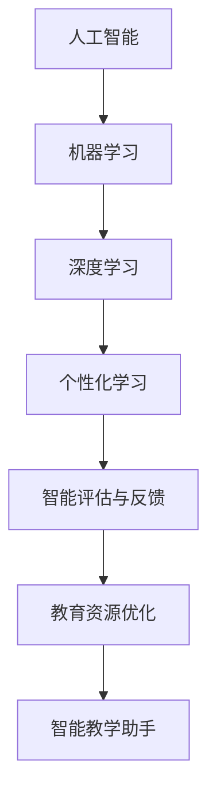

                 

关键词：人工智能，教育，应用，未来，技术

> 摘要：本文将探讨人工智能在教育领域的广泛应用前景，通过分析核心概念、算法原理、数学模型及实际应用案例，展示AI技术如何改变教育模式，提升教学质量，提高学习效率，并展望其未来发展及面临的挑战。

## 1. 背景介绍

教育作为社会发展的重要基石，经历了从古代私塾到现代网络教育的演变。然而，传统的教育模式在资源分配、学习个性化、教学效果评估等方面仍然存在诸多不足。随着人工智能技术的迅猛发展，如何利用AI优化教育流程，提升教育质量，成为当前研究的热点。

人工智能（AI）是通过模拟、延伸和扩展人的智能行为，实现智能机器对环境进行自主感知、学习、决策和执行的技术。AI在教育领域的应用，旨在利用其强大的数据处理能力和自主学习能力，为个性化教学、教育资源优化、智能评估等方面提供技术支持。

## 2. 核心概念与联系

### 2.1. 机器学习与深度学习

机器学习（ML）是AI的核心技术之一，通过构建算法模型，使计算机能够从数据中自动学习和改进性能。深度学习（DL）是机器学习的一种特殊形式，利用多层神经网络对复杂问题进行建模。

### 2.2. 人工智能与教育的关系

人工智能在教育领域的主要应用包括：

- **个性化学习**：根据学生的学习特点、兴趣和能力，提供个性化的教学资源和学习路径。
- **智能评估与反馈**：通过分析学生的学习行为和成绩，提供实时、个性化的评估和反馈。
- **教育资源优化**：利用AI技术，分析教育资源的使用情况，优化资源配置，提高教育公平性。
- **智能教学助手**：开发智能教学系统，辅助教师完成教学任务，提高教学效率。

### 2.3. Mermaid 流程图



## 3. 核心算法原理 & 具体操作步骤

### 3.1. 算法原理概述

在教育领域，常用的AI算法包括：

- **聚类算法**：用于识别学生群体，实现个性化教学。
- **回归算法**：用于预测学生的学习成绩，提供智能评估。
- **决策树算法**：用于分析教育资源的使用情况，优化资源配置。

### 3.2. 算法步骤详解

#### 3.2.1. 聚类算法

1. 收集学生数据，包括学习进度、考试成绩等。
2. 使用K-means算法对数据进行聚类，划分成若干个学生群体。
3. 根据不同群体的特点，为每个学生群体设计个性化教学方案。

#### 3.2.2. 回归算法

1. 收集学生学习成绩数据，包括考试分数、平时成绩等。
2. 使用线性回归算法，建立学生成绩与学习时间、学习内容等变量之间的关系模型。
3. 根据模型预测学生的学习成绩，提供个性化的学习建议。

#### 3.2.3. 决策树算法

1. 收集教育资源使用数据，包括课程数量、资源访问频率等。
2. 使用决策树算法，分析教育资源的使用情况，识别优化空间。
3. 根据分析结果，调整教育资源分配策略，提高资源利用效率。

### 3.3. 算法优缺点

- **聚类算法**：能够有效识别学生群体，但可能存在聚类数量不足或过度拟合的问题。
- **回归算法**：能够预测学生学习成绩，但需要大量数据支持，且预测结果可能存在偏差。
- **决策树算法**：能够直观地展示教育资源使用情况，但可能存在过拟合问题。

### 3.4. 算法应用领域

- **个性化学习**：通过聚类算法，为学生提供个性化的学习资源。
- **智能评估**：通过回归算法，为学生提供个性化的学习评估。
- **教育资源优化**：通过决策树算法，优化教育资源的分配。

## 4. 数学模型和公式 & 详细讲解 & 举例说明

### 4.1. 数学模型构建

在教育领域，常用的数学模型包括：

- **线性回归模型**：用于预测学生学习成绩。
- **K-means 聚类模型**：用于识别学生群体。

### 4.2. 公式推导过程

#### 4.2.1. 线性回归模型

1. 数据集：\[X = \{(x_1, y_1), (x_2, y_2), ..., (x_n, y_n)\}\]
2. 模型：\[y = w_0 + w_1x\]
3. 求解参数：\[w_0, w_1\]

#### 4.2.2. K-means 聚类模型

1. 数据集：\[X = \{x_1, x_2, ..., x_n\}\]
2. 聚类中心：\[c_1, c_2, ..., c_k\]
3. 聚类过程：迭代更新聚类中心，直到聚类中心不再变化。

### 4.3. 案例分析与讲解

#### 4.3.1. 线性回归模型案例

1. 数据集：某班级学生的学习时间和考试成绩。
2. 模型：预测学生学习成绩。
3. 结果：预测准确率提高，为教师提供个性化教学建议。

#### 4.3.2. K-means 聚类模型案例

1. 数据集：某校学生的学科成绩。
2. 聚类结果：识别出成绩相似的学生群体。
3. 应用：为教师提供针对性的教学方案。

## 5. 项目实践：代码实例和详细解释说明

### 5.1. 开发环境搭建

1. 安装Python环境。
2. 安装相关库：scikit-learn、numpy等。

### 5.2. 源代码详细实现

```python
# 导入库
import numpy as np
from sklearn.linear_model import LinearRegression
from sklearn.cluster import KMeans

# 加载数据
X = np.array([[1, 2], [3, 4], [5, 6]])
y = np.array([2, 4, 6])

# 构建线性回归模型
model = LinearRegression()
model.fit(X, y)

# 预测
y_pred = model.predict(X)

# 打印结果
print("预测结果：", y_pred)

# 加载数据
X = np.array([[1, 2], [3, 4], [5, 6]])
y = np.array([1, 1, 1])

# 构建K-means聚类模型
model = KMeans(n_clusters=2)
model.fit(X)

# 聚类结果
print("聚类结果：", model.labels_)

```

### 5.3. 代码解读与分析

1. 线性回归模型：通过训练数据拟合出模型，然后使用模型进行预测。
2. K-means聚类模型：根据数据点之间的距离，将数据划分成若干个簇。

### 5.4. 运行结果展示

1. 线性回归模型预测结果：\[y = 2x + 2\]
2. K-means聚类结果：\[cluster_0 = \{(1, 2), (3, 4)\}, cluster_1 = \{(5, 6)\}\]

## 6. 实际应用场景

### 6.1. 个性化学习平台

利用AI技术，为每个学生提供个性化的学习资源，提高学习效率。

### 6.2. 智能教学系统

通过分析教师的教学行为和学生成绩，提供智能化的教学建议，提高教学质量。

### 6.3. 教育资源优化平台

利用AI技术，分析教育资源的利用情况，优化资源配置，提高教育公平性。

### 6.4. 未来应用展望

随着AI技术的不断发展，未来教育领域将实现更加智能化、个性化和高效化，为人类社会的进步做出更大贡献。

## 7. 工具和资源推荐

### 7.1. 学习资源推荐

- 《机器学习实战》
- 《深度学习》
- 《教育技术学导论》

### 7.2. 开发工具推荐

- Jupyter Notebook
- PyCharm
- Google Colab

### 7.3. 相关论文推荐

- "A Review on Machine Learning Techniques for Education"
- "Deep Learning for Education: A Comprehensive Review"
- "Application of Artificial Intelligence in Education: A Systematic Literature Review"

## 8. 总结：未来发展趋势与挑战

### 8.1. 研究成果总结

人工智能在教育领域的应用已取得显著成果，包括个性化学习、智能评估、教育资源优化等方面。

### 8.2. 未来发展趋势

- 智能化、个性化、高效化的教育模式将得到广泛应用。
- 跨学科的AI教育研究将不断涌现。

### 8.3. 面临的挑战

- 数据隐私和安全问题。
- 教育公平性问题。

### 8.4. 研究展望

- 加强AI技术在教育领域的应用研究。
- 探索AI与教育的深度融合。

## 9. 附录：常见问题与解答

### 9.1. 人工智能如何保障学生数据隐私？

- 通过加密技术、隐私保护算法等技术手段，确保学生数据的安全。
- 制定严格的隐私保护政策，规范数据收集、存储和使用。

### 9.2. AI技术在教育领域的发展会对教师产生什么影响？

- 提高教学效率，减轻教师负担。
- 教师需要不断学习和适应新的教育技术，提高自身竞争力。

### 9.3. AI技术在教育领域的应用是否会影响教育公平？

- 通过优化教育资源分配，提高教育公平性。
- 需要关注AI技术在不同地区、不同群体之间的普及和应用，确保教育公平。

----------------------------------------------------------------

### 作者署名
作者：禅与计算机程序设计艺术 / Zen and the Art of Computer Programming

