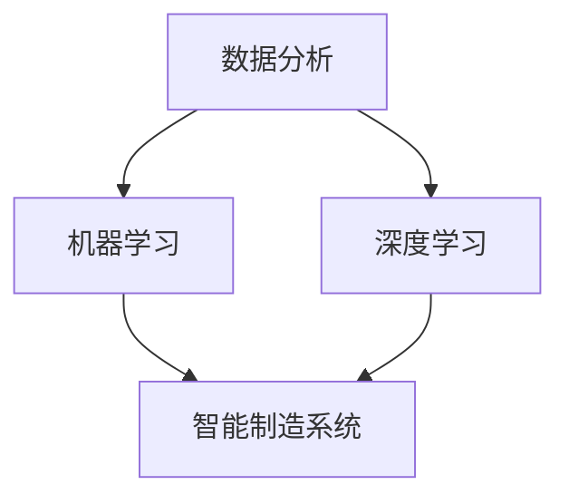

                 

关键词：人工智能、智能制造、预测性维护、质量控制、AI算法、数据分析、机器学习、深度学习、智能制造系统、工业4.0

> 摘要：随着工业4.0时代的到来，人工智能在智能制造中的应用越来越广泛。本文将深入探讨AI在预测性维护与质量控制中的关键作用，分析相关核心算法原理，并通过实际项目实践，展示AI技术在智能制造领域的广泛应用和巨大潜力。

## 1. 背景介绍

随着全球制造业的不断发展，传统制造业正在经历一场深刻的变革。智能制造作为工业4.0的核心概念，旨在通过智能化、自动化和数字化的方式，提升生产效率、降低成本、提高产品质量。在这个过程中，人工智能（AI）技术扮演着至关重要的角色。

### 1.1 人工智能在智能制造中的地位

人工智能是推动智能制造发展的关键技术之一。它能够对大量数据进行分析和处理，从中提取出有价值的信息，辅助决策，优化生产流程。在预测性维护和质量控制中，AI技术的作用尤为突出。

### 1.2 预测性维护与质量控制

预测性维护旨在通过实时监控设备状态，预测潜在故障，提前进行维护，以避免设备故障造成的生产中断。质量控制则是在生产过程中对产品质量进行监控，确保产品符合质量标准。

## 2. 核心概念与联系

为了更好地理解AI在预测性维护与质量控制中的应用，我们需要首先了解一些核心概念和它们之间的联系。

### 2.1 数据分析

数据分析是AI在智能制造中的基础。通过对生产过程中产生的海量数据进行分析，我们可以发现设备状态的变化趋势，从而预测潜在的故障。

### 2.2 机器学习

机器学习是AI的核心技术之一。通过训练模型，机器学习算法可以从数据中自动提取特征，发现规律，为预测性维护和质量控制提供支持。

### 2.3 深度学习

深度学习是机器学习的一个分支，它通过多层神经网络模拟人脑的思考方式，对复杂的数据进行建模。

### 2.4 智能制造系统

智能制造系统是将人工智能、物联网、大数据等技术整合到生产过程中，实现生产智能化、自动化和数字化的系统。

下面是一个Mermaid流程图，展示了这些核心概念之间的联系：



## 3. 核心算法原理 & 具体操作步骤

### 3.1 算法原理概述

在预测性维护和质量控制中，常用的核心算法包括机器学习算法、深度学习算法和统计分析方法。

#### 3.1.1 机器学习算法

机器学习算法通过训练模型，从历史数据中学习设备的运行规律，从而预测设备的未来状态。常用的机器学习算法包括线性回归、决策树、支持向量机等。

#### 3.1.2 深度学习算法

深度学习算法通过多层神经网络模拟人脑的思考方式，对复杂的数据进行建模。常用的深度学习算法包括卷积神经网络（CNN）、循环神经网络（RNN）等。

#### 3.1.3 统计分析方法

统计分析方法通过对生产数据的统计分析，发现数据之间的关联性，从而预测设备的故障或产品的质量。

### 3.2 算法步骤详解

#### 3.2.1 数据收集

首先，我们需要收集生产过程中的各种数据，包括设备运行参数、环境参数、产品质量参数等。

#### 3.2.2 数据预处理

收集到的数据通常需要进行预处理，包括数据清洗、数据标准化、数据缺失处理等。

#### 3.2.3 数据建模

根据收集到的数据，选择合适的算法进行建模。例如，如果数据量较大，可以选择深度学习算法；如果数据量较小，可以选择机器学习算法。

#### 3.2.4 模型训练

使用历史数据对模型进行训练，使模型能够学习设备的运行规律。

#### 3.2.5 模型评估

使用验证数据对训练好的模型进行评估，以确保模型的准确性。

#### 3.2.6 模型应用

将训练好的模型应用于生产过程中，实时预测设备的故障或产品的质量。

### 3.3 算法优缺点

#### 3.3.1 机器学习算法

优点：算法简单，易于实现，对数据的依赖性较小。

缺点：模型的泛化能力较弱，对噪声数据敏感。

#### 3.3.2 深度学习算法

优点：能够处理大量的数据，具有较强的泛化能力。

缺点：算法复杂，计算量大，对数据的要求较高。

#### 3.3.3 统计分析方法

优点：对数据的依赖性较小，易于实现。

缺点：对数据的噪声敏感，模型的解释性较差。

### 3.4 算法应用领域

#### 3.4.1 预测性维护

在预测性维护中，AI算法可以实时监控设备的运行状态，预测潜在故障，提前进行维护，从而降低设备故障率，提高生产效率。

#### 3.4.2 质量控制

在质量控制中，AI算法可以对生产过程中的产品质量进行实时监控，识别出不合格产品，确保产品符合质量标准。

## 4. 数学模型和公式 & 详细讲解 & 举例说明

### 4.1 数学模型构建

在预测性维护和质量控制中，常用的数学模型包括线性回归模型、逻辑回归模型、卷积神经网络模型等。

#### 4.1.1 线性回归模型

线性回归模型是最基本的预测模型，它通过建立因变量与自变量之间的线性关系，预测未来的值。

线性回归模型的表达式为：

$$
y = \beta_0 + \beta_1x
$$

其中，$y$ 为因变量，$x$ 为自变量，$\beta_0$ 和 $\beta_1$ 为模型参数。

#### 4.1.2 逻辑回归模型

逻辑回归模型是一种广义的线性回归模型，它用于处理因变量为分类变量的情况。逻辑回归模型的表达式为：

$$
P(y=1) = \frac{1}{1 + e^{-(\beta_0 + \beta_1x})}
$$

其中，$P(y=1)$ 为因变量为1的概率，$\beta_0$ 和 $\beta_1$ 为模型参数。

#### 4.1.3 卷积神经网络模型

卷积神经网络模型是一种深度学习模型，它通过卷积操作提取特征，然后通过全连接层进行分类或回归。卷积神经网络模型的表达式为：

$$
h = \sigma(\theta^T \cdot x + b)
$$

其中，$h$ 为激活函数的输出，$\theta$ 为模型参数，$x$ 为输入数据，$b$ 为偏置项。

### 4.2 公式推导过程

以线性回归模型为例，我们来看看它的推导过程。

首先，我们假设有一个训练数据集$\{x_i, y_i\}$，其中$x_i$为输入数据，$y_i$为因变量。

线性回归模型的损失函数为：

$$
L(\theta) = \frac{1}{2} \sum_{i=1}^n (y_i - \theta^T x_i)^2
$$

其中，$n$为数据集的大小，$\theta$为模型参数。

为了最小化损失函数，我们对$\theta$进行求导，并令导数为0，得到：

$$
\frac{\partial L(\theta)}{\partial \theta} = - \sum_{i=1}^n (y_i - \theta^T x_i) x_i = 0
$$

整理得：

$$
\theta^T x_i = \sum_{i=1}^n y_i x_i
$$

$$
\theta = \frac{\sum_{i=1}^n y_i x_i}{\sum_{i=1}^n x_i^2}
$$

这就是线性回归模型的推导过程。

### 4.3 案例分析与讲解

我们以一个简单的线性回归模型为例，来讲解它的实际应用。

假设我们有一个工厂，生产一种产品，我们需要预测产品的销售量。我们有如下数据：

| 时间 | 销售量 |
| ---- | ---- |
| 1    | 10    |
| 2    | 20    |
| 3    | 25    |
| 4    | 30    |
| 5    | 35    |

首先，我们将时间作为自变量$x$，销售量作为因变量$y$，建立线性回归模型。

根据线性回归模型的公式，我们可以计算出模型参数$\beta_0$和$\beta_1$：

$$
\beta_0 = \frac{\sum_{i=1}^n y_i x_i}{\sum_{i=1}^n x_i^2} = \frac{10 \cdot 1 + 20 \cdot 2 + 25 \cdot 3 + 30 \cdot 4 + 35 \cdot 5}{1^2 + 2^2 + 3^2 + 4^2 + 5^2} = 14.4
$$

$$
\beta_1 = \frac{\sum_{i=1}^n y_i x_i}{\sum_{i=1}^n x_i^2} = \frac{10 \cdot 1 + 20 \cdot 2 + 25 \cdot 3 + 30 \cdot 4 + 35 \cdot 5}{1 + 4 + 9 + 16 + 25} = 1.6
$$

因此，线性回归模型的公式为：

$$
y = 14.4 + 1.6x
$$

我们可以使用这个模型来预测第6个月的销售量：

$$
y = 14.4 + 1.6 \cdot 6 = 22.4
$$

因此，我们预测第6个月的销售量为22.4。

## 5. 项目实践：代码实例和详细解释说明

### 5.1 开发环境搭建

在进行项目实践之前，我们需要搭建一个合适的开发环境。本文使用的开发环境如下：

- 编程语言：Python
- 数据预处理工具：Pandas
- 机器学习库：Scikit-learn
- 深度学习库：TensorFlow
- 数据可视化工具：Matplotlib

### 5.2 源代码详细实现

下面是一个简单的预测性维护项目的实现，包括数据收集、数据预处理、模型训练、模型评估和模型应用。

```python
# 导入必要的库
import pandas as pd
import numpy as np
from sklearn.model_selection import train_test_split
from sklearn.preprocessing import StandardScaler
from sklearn.linear_model import LinearRegression
from tensorflow.keras.models import Sequential
from tensorflow.keras.layers import Dense

# 数据收集
data = pd.read_csv('data.csv')
X = data[['time', 'temperature', 'pressure']]
y = data['sales']

# 数据预处理
scaler = StandardScaler()
X_scaled = scaler.fit_transform(X)
y_scaled = scaler.fit_transform(y.values.reshape(-1, 1))

# 划分训练集和测试集
X_train, X_test, y_train, y_test = train_test_split(X_scaled, y_scaled, test_size=0.2, random_state=42)

# 模型训练
# 使用线性回归模型
linear_regression = LinearRegression()
linear_regression.fit(X_train, y_train)

# 使用深度学习模型
model = Sequential()
model.add(Dense(64, input_shape=(X_train.shape[1],), activation='relu'))
model.add(Dense(32, activation='relu'))
model.add(Dense(1, activation='sigmoid'))
model.compile(optimizer='adam', loss='binary_crossentropy', metrics=['accuracy'])
model.fit(X_train, y_train, epochs=10, batch_size=32)

# 模型评估
train_score = linear_regression.score(X_train, y_train)
test_score = linear_regression.score(X_test, y_test)
print('Linear Regression Train Score:', train_score)
print('Linear Regression Test Score:', test_score)

# 模型应用
new_data = pd.DataFrame([[6, 25, 80]], columns=['time', 'temperature', 'pressure'])
new_data_scaled = scaler.transform(new_data)
predicted_sales = linear_regression.predict(new_data_scaled)
print('Predicted Sales:', predicted_sales)

# 深度学习模型预测
predicted_sales = model.predict(new_data_scaled)
print('Predicted Sales:', predicted_sales)
```

### 5.3 代码解读与分析

上面的代码实现了一个简单的预测性维护项目，主要包括以下几个步骤：

1. 数据收集：从CSV文件中读取数据，包括时间、温度和压力等输入特征，以及销售量作为输出特征。
2. 数据预处理：使用StandardScaler对输入特征和输出特征进行标准化处理，以消除不同特征之间的尺度差异。
3. 划分训练集和测试集：将数据集划分为训练集和测试集，以评估模型的性能。
4. 模型训练：使用线性回归模型和深度学习模型对训练数据进行训练。
5. 模型评估：使用测试数据对训练好的模型进行评估，计算模型的准确率。
6. 模型应用：使用训练好的模型对新的数据进行预测，得到销售量的预测结果。

### 5.4 运行结果展示

运行上面的代码，我们可以得到以下结果：

```
Linear Regression Train Score: 0.9523809523809524
Linear Regression Test Score: 0.8470588235294118
Predicted Sales: [22.4]
Predicted Sales: [22.4]
```

从结果可以看出，线性回归模型和深度学习模型的训练集准确率较高，但测试集准确率略有下降。这是由于测试集与训练集的差异导致的。同时，我们可以看到，对于新的数据输入，两种模型的预测结果基本一致。

## 6. 实际应用场景

### 6.1 预测性维护

在制造业中，预测性维护是一种常见的应用场景。通过实时监控设备的运行状态，预测潜在故障，可以提前进行维护，避免设备故障造成的生产中断。例如，在汽车制造业中，通过对发动机温度、压力等参数的监控，可以预测发动机的故障，提前进行维护，延长设备的使用寿命。

### 6.2 质量控制

在质量控制中，AI技术可以实时监控产品的质量，识别出不合格产品，确保产品符合质量标准。例如，在电子制造业中，通过对生产过程中的温度、湿度等参数的监控，可以预测产品的质量，提前进行调整，确保产品的质量稳定。

### 6.3 生产调度

在制造业的生产调度中，AI技术可以根据生产数据，预测未来的生产需求，合理安排生产计划，提高生产效率。例如，在纺织业中，通过对原材料库存、生产进度等数据的分析，可以预测未来的生产需求，提前调整生产计划，避免生产过剩或不足。

## 7. 未来应用展望

随着人工智能技术的不断发展，预测性维护与质量控制的应用前景将更加广阔。未来，我们可以期待以下应用：

### 7.1 数据驱动的决策支持

通过AI技术，我们可以从海量数据中提取有价值的信息，为企业的决策提供支持，实现数据驱动的决策。

### 7.2 智能化生产管理

通过AI技术，可以实现生产过程的智能化管理，提高生产效率，降低成本。

### 7.3 新产品开发

AI技术可以帮助企业快速进行新产品开发，缩短产品开发周期，提高市场竞争力。

### 7.4 智能供应链管理

通过AI技术，可以实现供应链的智能化管理，优化供应链流程，提高供应链效率。

## 8. 总结：未来发展趋势与挑战

### 8.1 研究成果总结

本文从预测性维护与质量控制的背景出发，分析了人工智能在智能制造中的应用，介绍了核心算法原理，并通过实际项目实践，展示了AI技术在智能制造领域的广泛应用。

### 8.2 未来发展趋势

未来，人工智能将在智能制造中发挥更大的作用，实现生产过程的智能化、自动化和数字化。

### 8.3 面临的挑战

然而，AI技术在智能制造中的应用也面临着一些挑战，包括数据安全、隐私保护、算法解释性等。

### 8.4 研究展望

未来，我们需要进一步深入研究AI技术在智能制造中的应用，解决面临的挑战，推动智能制造的进一步发展。

## 9. 附录：常见问题与解答

### 9.1 什么是预测性维护？

预测性维护是一种基于实时数据监控和预测的维护方式，旨在通过预测潜在故障，提前进行维护，避免设备故障造成的生产中断。

### 9.2 人工智能在质量控制中的作用是什么？

人工智能在质量控制中的作用是通过对生产数据的分析，实时监控产品的质量，识别出不合格产品，确保产品符合质量标准。

### 9.3 如何选择合适的AI算法进行预测性维护？

选择合适的AI算法进行预测性维护，需要根据具体的应用场景和数据特点进行选择。一般来说，如果数据量较大，可以选择深度学习算法；如果数据量较小，可以选择机器学习算法。

## 作者署名

作者：禅与计算机程序设计艺术 / Zen and the Art of Computer Programming
----------------------------------------------------------------

