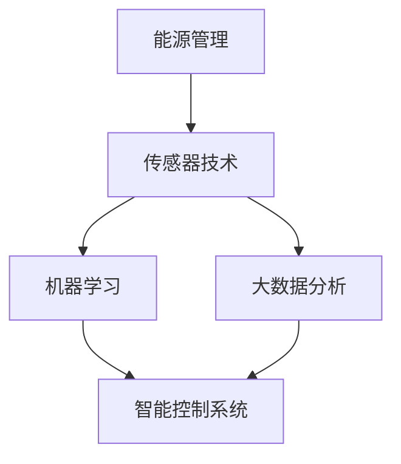

                 

### 1. 背景介绍

随着全球人口的不断增长和城市化进程的加速，能源消耗和碳排放问题日益严重。智能建筑管理作为一种新兴的技术手段，旨在通过优化建筑能源利用效率，减少能源消耗和碳排放，从而缓解环境压力。AI技术在智能建筑管理中扮演着关键角色，它不仅能够提高能源管理效率，还能为建筑提供个性化、智能化的服务。

当前，智能建筑管理主要面临以下挑战：

- **能源消耗：** 建筑是能源消耗的重要领域，尤其在城市中，建筑能耗占到了总能耗的相当比例。如何有效地降低建筑能耗成为亟待解决的问题。

- **碳排放：** 随着全球气候变化的加剧，减少碳排放成为各国政府和企业的重要目标。智能建筑管理在降低碳排放方面具有巨大潜力。

- **数据复杂度：** 建筑系统数据复杂，包括电力、供水、供暖等多个方面，如何有效地收集、分析和利用这些数据是智能建筑管理的关键。

AI技术在智能建筑管理中的应用，主要包括以下几个方面：

- **能耗预测：** 利用机器学习算法，对建筑能耗进行预测，帮助用户提前了解能源消耗情况，从而采取措施进行节能。

- **故障诊断：** 通过实时数据监测，AI可以快速诊断建筑系统中的故障，及时进行维修，避免能耗浪费。

- **优化控制：** AI可以自动调整建筑系统的运行参数，如空调、照明等，以实现最优的能源利用。

- **个性化服务：** 基于用户行为数据，AI可以为用户提供个性化的服务，如智能照明、智能温度控制等。

本文将深入探讨AI在智能建筑管理中的应用，包括核心概念、算法原理、数学模型、项目实践以及未来展望，旨在为相关领域的研究者和实践者提供有益的参考。

### 2. 核心概念与联系

在探讨AI在智能建筑管理中的应用之前，我们需要了解几个核心概念，这些概念是理解AI如何优化建筑能源管理的基础。

#### 2.1 能源管理

能源管理是指对能源的获取、传输、分配和消耗进行科学的管理，以达到节能减排的目的。在建筑领域，能源管理涉及到电力、燃气、热水等多种能源形式。有效的能源管理不仅能够降低能源消耗，还能够减少温室气体排放，对环境保护具有重要意义。

#### 2.2 传感器技术

传感器技术是智能建筑管理的重要基础，通过传感器可以实时监测建筑内部的各项环境参数，如温度、湿度、光照强度、空气质量等。这些数据为AI算法提供了丰富的输入信息，使其能够更好地理解和优化建筑系统的运行状态。

#### 2.3 机器学习

机器学习是一种通过数据驱动的方式使计算机具备自主学习能力的技术。在智能建筑管理中，机器学习算法可以用于能耗预测、故障诊断和优化控制等任务。常见的机器学习算法包括线性回归、决策树、支持向量机、神经网络等。

#### 2.4 大数据分析

大数据分析是指通过对大量复杂数据进行采集、存储、处理和分析，以发现数据背后的规律和模式。在智能建筑管理中，大数据分析可以帮助我们理解建筑系统运行中的潜在问题，并提供优化建议。

#### 2.5 智能控制系统

智能控制系统是指通过计算机技术、传感器技术和通信技术，实现对建筑设备远程监控和自动化控制的技术体系。智能控制系统可以实时调整建筑设备的运行状态，以实现最优的能源利用。

##### 2.6 Mermaid 流程图

以下是一个简化的Mermaid流程图，展示了上述核心概念之间的联系：

在智能建筑管理中，传感器技术用于收集环境数据，这些数据通过大数据分析进行处理，然后输入到机器学习模型中，用于能耗预测和故障诊断。最后，智能控制系统根据机器学习模型的输出，对建筑设备进行自动化控制，实现能源优

