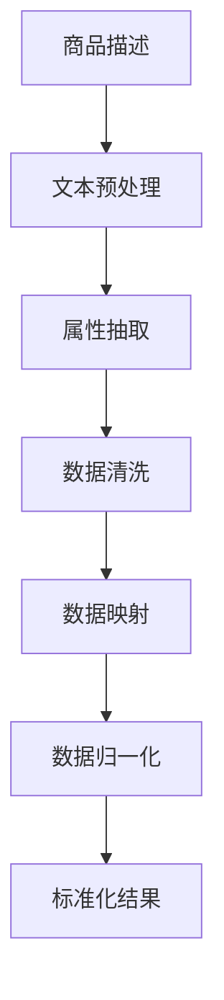

                 

在当今的数字化时代，电商平台已成为消费者购买商品的主要途径。随着电商平台上的商品种类和数量日益增多，如何有效地管理这些商品信息成为了关键问题。商品属性抽取与标准化是处理这一问题的核心技术之一。本文将探讨人工智能（AI）技术在电商平台商品属性抽取与标准化中的应用，以期提升电商平台的信息管理效率和用户体验。

## 文章关键词

- 电商平台
- 商品属性抽取
- AI
- 标准化
- 信息管理

## 文章摘要

本文首先介绍了电商平台商品属性抽取与标准化的背景和重要性，然后讨论了AI技术在这一领域中的应用，包括深度学习、自然语言处理和机器学习算法。接着，本文详细阐述了商品属性抽取和标准化的核心概念、原理和算法，并提供了具体的数学模型和公式。此外，本文通过实际项目实践，展示了AI技术在商品属性抽取与标准化中的具体应用。最后，本文对AI技术在电商平台商品属性抽取与标准化中的应用前景进行了展望。

## 1. 背景介绍

随着互联网的普及和电子商务的快速发展，电商平台已经成为消费者购买商品的主要途径。电商平台上的商品种类繁多，从日常用品到高端奢侈品，从电子产品到家居装饰，几乎涵盖了所有消费领域。然而，商品种类和数量的激增给电商平台的信息管理带来了巨大挑战。如何在海量商品中快速、准确地找到所需商品，成为了电商平台需要解决的问题。

商品属性是指商品的各种特征和描述，包括品牌、型号、颜色、尺寸、价格等。商品属性的抽取和标准化是电商平台信息管理的重要环节。商品属性的抽取是指从商品描述中提取出与商品相关的属性，而商品属性的标准化是指将不同来源和格式的商品属性进行统一和规范化处理。

传统的商品属性抽取和标准化方法主要依赖于人工处理，效率低下且容易出现错误。随着人工智能技术的不断发展，尤其是深度学习和自然语言处理技术的进步，AI技术被广泛应用于商品属性抽取与标准化。AI技术具有高效、准确、自动化等特点，可以有效提升电商平台的信息管理效率和用户体验。

## 2. 核心概念与联系

### 2.1. 商品属性抽取

商品属性抽取是指从商品描述中提取出与商品相关的属性。商品描述通常包括商品标题、商品描述文本、图片等多媒体信息。商品属性抽取的目标是自动识别和提取这些信息，以便进行后续的标准化处理。

商品属性抽取的关键技术包括自然语言处理、图像处理和知识图谱。自然语言处理技术用于处理商品描述文本，提取出与商品属性相关的关键词和短语；图像处理技术用于从商品图片中提取出商品的视觉属性，如颜色、形状、尺寸等；知识图谱则用于将提取出的属性进行结构化处理，以便进行标准化。

### 2.2. 商品属性标准化

商品属性标准化是指将不同来源和格式的商品属性进行统一和规范化处理。商品属性标准化的目标是确保商品属性的统一性和一致性，以便于电商平台对商品信息进行高效管理和搜索。

商品属性标准化的关键技术包括数据清洗、数据映射和数据归一化。数据清洗是指去除商品属性中的噪声和冗余信息，如删除商品描述中的标点符号、停用词等；数据映射是指将不同来源和格式的商品属性进行统一映射，如将不同品牌的产品映射到统一的品牌标识；数据归一化是指将商品属性进行统一格式化处理，如将尺寸属性统一为毫米为单位。

### 2.3. AI技术在商品属性抽取与标准化中的应用

AI技术在商品属性抽取与标准化中具有广泛的应用。以下为几种主要的AI技术：

#### 2.3.1. 深度学习

深度学习是一种基于神经网络的人工智能技术，已被广泛应用于图像识别、语音识别和自然语言处理等领域。在商品属性抽取中，深度学习技术可以用于从商品描述文本中自动提取出商品属性。例如，通过卷积神经网络（CNN）对商品图片进行处理，可以提取出商品的颜色、形状、尺寸等视觉属性；通过循环神经网络（RNN）对商品描述文本进行处理，可以提取出与商品属性相关的关键词和短语。

#### 2.3.2. 自然语言处理

自然语言处理（NLP）是AI技术的一个重要分支，用于处理人类语言。在商品属性抽取与标准化中，NLP技术可以用于从商品描述文本中提取出商品属性。例如，通过词向量模型（如Word2Vec、GloVe）将文本表示为向量，可以用于文本分类、命名实体识别和关系抽取等任务。

#### 2.3.3. 机器学习

机器学习是AI技术的另一个重要分支，通过训练模型对未知数据进行预测。在商品属性抽取与标准化中，机器学习技术可以用于将不同来源和格式的商品属性进行统一映射。例如，通过聚类算法（如K-means、DBSCAN）对商品属性进行分类和聚类，可以识别出不同来源的商品属性，并进行统一映射。

### 2.4. Mermaid 流程图

以下是一个简化的Mermaid流程图，展示了商品属性抽取与标准化的过程：



### 2.5. 核心概念与联系总结

商品属性抽取与标准化是电商平台信息管理的重要环节，通过AI技术的应用，可以实现自动化、高效、准确的信息处理。商品属性抽取包括文本预处理、属性抽取、数据清洗和映射等步骤，而商品属性标准化则涉及数据清洗、映射和归一化等过程。AI技术在商品属性抽取与标准化中发挥了关键作用，通过深度学习、自然语言处理和机器学习等技术，可以大大提升商品属性抽取与标准化的效率和准确性。

## 3. 核心算法原理 & 具体操作步骤

### 3.1. 算法原理概述

商品属性抽取与标准化的核心算法主要包括深度学习、自然语言处理和机器学习算法。以下分别介绍这些算法的基本原理和适用场景。

#### 3.1.1. 深度学习算法

深度学习是一种基于多层神经网络的机器学习技术，通过多层非线性变换来提取数据中的特征。在商品属性抽取中，深度学习算法可以用于从商品描述文本和图片中自动提取出商品属性。常见的深度学习算法包括卷积神经网络（CNN）、循环神经网络（RNN）和Transformer等。

- **卷积神经网络（CNN）**：CNN是一种适用于图像处理的深度学习算法，通过卷积操作和池化操作来提取图像的特征。在商品属性抽取中，CNN可以用于从商品图片中提取出视觉属性，如颜色、形状、尺寸等。
  
- **循环神经网络（RNN）**：RNN是一种适用于序列数据的深度学习算法，通过递归连接来处理序列数据。在商品属性抽取中，RNN可以用于从商品描述文本中提取出与商品属性相关的关键词和短语。

- **Transformer**：Transformer是一种基于自注意力机制的深度学习算法，广泛用于自然语言处理任务。在商品属性抽取中，Transformer可以用于从商品描述文本中提取出与商品属性相关的关键词和短语。

#### 3.1.2. 自然语言处理算法

自然语言处理（NLP）是一种基于人工智能技术处理人类语言的方法。在商品属性抽取与标准化中，NLP算法可以用于从商品描述文本中提取出商品属性。常见的NLP算法包括词向量模型、命名实体识别和关系抽取等。

- **词向量模型**：词向量模型是一种将文本表示为向量的方法，通过计算词向量之间的相似度来识别文本中的关键词和短语。常见的词向量模型包括Word2Vec、GloVe和BERT等。

- **命名实体识别**：命名实体识别是一种用于识别文本中的特定实体（如人名、地名、组织名等）的方法。在商品属性抽取中，命名实体识别可以用于识别商品名称、品牌、型号等属性。

- **关系抽取**：关系抽取是一种用于识别文本中实体之间关系的方法。在商品属性抽取中，关系抽取可以用于识别商品与属性之间的关系，如颜色、尺寸、价格等。

#### 3.1.3. 机器学习算法

机器学习算法是一种通过训练模型对未知数据进行预测的方法。在商品属性抽取与标准化中，机器学习算法可以用于将不同来源和格式的商品属性进行统一映射。常见的机器学习算法包括聚类算法、分类算法和回归算法等。

- **聚类算法**：聚类算法是一种用于将数据分为若干个类的算法，通过计算数据之间的相似度来实现。在商品属性抽取中，聚类算法可以用于识别不同来源的商品属性，并进行分类和聚类。

- **分类算法**：分类算法是一种用于将数据分为不同类别的算法，通过训练分类模型来实现。在商品属性抽取中，分类算法可以用于将不同来源的商品属性进行统一映射。

- **回归算法**：回归算法是一种用于预测连续值的算法，通过训练回归模型来实现。在商品属性抽取中，回归算法可以用于将不同来源的商品属性进行统一映射。

### 3.2. 算法步骤详解

商品属性抽取与标准化的具体操作步骤如下：

#### 3.2.1. 商品描述文本预处理

商品描述文本预处理是商品属性抽取的第一步，主要包括文本清洗、分词、去停用词等操作。文本清洗是指去除商品描述文本中的噪声和冗余信息，如标点符号、HTML标签等。分词是指将商品描述文本拆分为单个词语。去停用词是指去除商品描述文本中的常见停用词，如“的”、“了”、“在”等。

#### 3.2.2. 属性抽取

属性抽取是指从商品描述文本中提取出与商品属性相关的关键词和短语。具体步骤如下：

1. **关键词提取**：使用词向量模型（如Word2Vec、GloVe）将商品描述文本表示为向量，然后计算向量之间的相似度，识别出与商品属性相关的关键词。

2. **命名实体识别**：使用命名实体识别算法（如BERT）对商品描述文本进行处理，识别出商品名称、品牌、型号等属性。

3. **关系抽取**：使用关系抽取算法对商品描述文本进行处理，识别出商品与属性之间的关系。

#### 3.2.3. 数据清洗

数据清洗是指去除商品属性中的噪声和冗余信息，如删除商品属性中的标点符号、停用词等。数据清洗的目的是提高商品属性的准确性和一致性。

#### 3.2.4. 数据映射

数据映射是指将不同来源和格式的商品属性进行统一映射。具体步骤如下：

1. **聚类分析**：使用聚类算法（如K-means、DBSCAN）对商品属性进行分类和聚类，识别出不同来源的商品属性。

2. **分类算法**：使用分类算法（如决策树、支持向量机）对商品属性进行分类，将不同来源的商品属性进行统一映射。

#### 3.2.5. 数据归一化

数据归一化是指将商品属性进行统一格式化处理，如将尺寸属性统一为毫米为单位。数据归一化的目的是确保商品属性的统一性和一致性。

#### 3.2.6. 标准化结果

标准化结果是指将处理后的商品属性进行统一和规范化处理，以便于电商平台对商品信息进行高效管理和搜索。

### 3.3. 算法优缺点

#### 3.3.1. 深度学习算法

- **优点**：
  - 自动化程度高，可以自动提取数据中的特征；
  - 准确性高，可以处理复杂的数据关系。

- **缺点**：
  - 需要大量训练数据，训练过程耗时长；
  - 难以解释，难以理解模型内部的决策过程。

#### 3.3.2. 自然语言处理算法

- **优点**：
  - 可以处理复杂的文本数据，提取出与商品属性相关的关键词和短语；
  - 准确性高，可以识别出商品名称、品牌、型号等属性。

- **缺点**：
  - 对文本数据的理解能力有限，难以处理复杂的语义关系；
  - 需要大量的标注数据进行训练，成本较高。

#### 3.3.3. 机器学习算法

- **优点**：
  - 可以处理不同的数据类型，如文本、图像、数值等；
  - 可以对未知数据进行预测，提高商品属性的准确性。

- **缺点**：
  - 需要大量的训练数据和计算资源；
  - 模型的泛化能力有限，可能存在过拟合现象。

### 3.4. 算法应用领域

AI技术在商品属性抽取与标准化中的应用广泛，主要包括以下几个方面：

- **电商平台**：电商平台可以利用AI技术对商品属性进行自动抽取和标准化，提高商品信息的管理效率和搜索准确性。

- **搜索引擎**：搜索引擎可以利用AI技术对搜索结果进行排序和筛选，提高用户的搜索体验。

- **推荐系统**：推荐系统可以利用AI技术分析用户的购物行为和偏好，为用户提供个性化的商品推荐。

- **供应链管理**：供应链管理可以利用AI技术对商品信息进行自动分类和统计，提高供应链的效率和准确性。

## 4. 数学模型和公式 & 详细讲解 & 举例说明

### 4.1. 数学模型构建

在商品属性抽取与标准化过程中，需要构建一系列数学模型来描述不同环节的处理过程。以下是几个关键的数学模型及其构建过程：

#### 4.1.1. 词向量模型

词向量模型是一种将文本表示为向量的方法，通过计算词向量之间的相似度来识别文本中的关键词和短语。常见的词向量模型包括Word2Vec和GloVe。

1. **Word2Vec**：

   - **算法原理**：Word2Vec算法通过训练神经网络来学习文本中的词向量。词向量是一个高维向量，表示文本中的每个单词。
   - **公式推导**：
     $$ v_w = \text{softmax}(W \cdot h) $$
     其中，$v_w$ 是词向量，$W$ 是权重矩阵，$h$ 是隐藏层状态。
   - **举例说明**：假设有两个单词“苹果”和“香蕉”，通过Word2Vec算法训练后，得到词向量 $v_{苹果}$ 和 $v_{香蕉}$。我们可以通过计算它们之间的余弦相似度来判断两个词的相似性。

2. **GloVe**：

   - **算法原理**：GloVe算法通过优化词向量的余弦相似度来学习文本中的词向量。GloVe模型同时考虑了单词的词频和共现信息。
   - **公式推导**：
     $$ \text{loss} = \sum_{w \in V} \frac{f(w)}{\text{f}(w)^{1.5}} \cdot \text{cosine}(v_w, v_{w'}^T) $$
     其中，$f(w)$ 是单词 $w$ 的词频，$v_w$ 和 $v_{w'}$ 是单词 $w$ 和 $w'$ 的词向量。

#### 4.1.2. 命名实体识别模型

命名实体识别（Named Entity Recognition, NER）是一种用于识别文本中的特定实体（如人名、地名、组织名等）的方法。常见的NER模型包括CRF（条件随机场）和BiLSTM（双向长短时记忆网络）。

- **算法原理**：CRF是一种用于序列标注的模型，通过计算标签序列的概率来识别实体。BiLSTM则通过处理序列数据来识别实体。
- **公式推导**：
  $$ P(Y|X) = \frac{e^{\phi(x, y)}}{\sum_y e^{\phi(x, y)}} $$
  其中，$P(Y|X)$ 是给定输入序列 $X$ 的输出序列 $Y$ 的概率，$\phi(x, y)$ 是特征函数。

#### 4.1.3. 聚类算法

聚类算法是一种用于将数据分为若干个类的算法。常见的聚类算法包括K-means和DBSCAN。

- **算法原理**：K-means通过计算数据点之间的距离来划分簇，DBSCAN通过计算邻域密度来划分簇。
- **公式推导**：
  - **K-means**：
    $$ \text{Centroids} = \frac{1}{k} \sum_{i=1}^{k} \sum_{x_i \in C_i} x_i $$
    其中，$C_i$ 是第 $i$ 个簇，$x_i$ 是簇内的数据点。
  - **DBSCAN**：
    $$ \text{Density} = \frac{1}{\text{RegionSize}} \sum_{x_i \in \text{Region}(x)} \text{distance}(x_i, x) $$
    其中，$RegionSize$ 是邻域大小，$\text{distance}(x_i, x)$ 是数据点 $x_i$ 和 $x$ 之间的距离。

### 4.2. 公式推导过程

#### 4.2.1. 词向量模型

以GloVe模型为例，介绍词向量模型的公式推导过程。

1. **目标函数**：

   $$ \text{loss} = \sum_{w \in V} \frac{f(w)}{\text{f}(w)^{1.5}} \cdot \text{cosine}(v_w, v_{w'}^T) $$

   其中，$f(w)$ 是单词 $w$ 的词频，$v_w$ 和 $v_{w'}$ 是单词 $w$ 和 $w'$ 的词向量。

2. **优化目标**：

   为了最小化损失函数，需要对词向量进行优化。通过梯度下降算法，可以求得词向量的更新公式：

   $$ \frac{\partial \text{loss}}{\partial v_w} = - \frac{1}{\text{f}(w)^{1.5}} \cdot \text{cosine}(v_w, v_{w'}^T) \cdot v_{w'} $$

   $$ \frac{\partial \text{loss}}{\partial v_{w'}} = - \frac{1}{\text{f}(w')^{1.5}} \cdot \text{cosine}(v_w, v_{w'}^T) \cdot v_w $$

#### 4.2.2. 命名实体识别

以CRF模型为例，介绍命名实体识别的公式推导过程。

1. **模型表示**：

   CRF模型通过条件概率来表示标签序列的概率：

   $$ P(Y|X) = \frac{e^{\phi(x, y)}}{\sum_y e^{\phi(x, y)}} $$

   其中，$X = (x_1, x_2, \ldots, x_n)$ 是输入序列，$Y = (y_1, y_2, \ldots, y_n)$ 是标签序列，$\phi(x, y)$ 是特征函数。

2. **特征函数**：

   特征函数通常由两部分组成：位置特征和相邻特征。位置特征表示单词在序列中的位置，相邻特征表示单词之间的相邻关系。

   $$ \phi(x_i, y_i) = f_{pos}(i) \cdot f_{label}(y_i) + \sum_{j=1}^{n} f_{adj}(i, j, y_i, y_j) $$

   其中，$f_{pos}(i)$ 是位置特征函数，$f_{label}(y_i)$ 是标签特征函数，$f_{adj}(i, j, y_i, y_j)$ 是相邻特征函数。

#### 4.2.3. 聚类算法

以K-means算法为例，介绍聚类算法的公式推导过程。

1. **初始化**：

   随机选择 $k$ 个初始中心点，每个中心点表示一个簇。

2. **迭代过程**：

   - **分配数据点**：将每个数据点分配到最近的中心点，更新簇的成员。
   - **更新中心点**：计算每个簇的平均值，作为新的中心点。

   更新公式：

   $$ \text{Centroids} = \frac{1}{k} \sum_{i=1}^{k} \sum_{x_i \in C_i} x_i $$

### 4.3. 案例分析与讲解

#### 4.3.1. 词向量模型应用

假设有一个商品描述文本：“这款苹果手机的颜色是红色，尺寸为6英寸，价格为599美元。”我们使用GloVe模型提取关键词和短语。

1. **文本预处理**：

   - 清洗文本，去除标点符号和停用词。
   - 分词，将文本拆分为单个词语：“这款”、“苹果”、“手机”、“颜色”、“是”、“红色”、“尺寸”、“6英寸”、“价格”、“599美元”。

2. **提取关键词**：

   - 计算关键词之间的相似度，识别出与商品属性相关的关键词：“苹果”、“手机”、“颜色”、“尺寸”、“价格”。

3. **词向量计算**：

   - 使用GloVe模型计算每个关键词的词向量，得到向量表示：“苹果”（向量 $v_{苹果}$）、“手机”（向量 $v_{手机}$）等。

4. **相似度计算**：

   - 计算关键词之间的余弦相似度，识别出与商品属性相关的关键词短语：“苹果”与“手机”相似度最高，表示这两个词与商品属性密切相关。

#### 4.3.2. 命名实体识别

假设有一个商品描述文本：“我购买了来自亚马逊的《小王子》绘本，作者是安托万·德·圣埃克苏佩里。”

1. **文本预处理**：

   - 清洗文本，去除标点符号和停用词。
   - 分词，将文本拆分为单个词语：“我”、“购买了”、“来自”、“亚马逊”、“《小王子》”、“绘本”、“是”、“作者”、“安托万”、“德”、“圣埃克苏佩里”。

2. **命名实体识别**：

   - 使用CRF模型对文本进行处理，识别出命名实体：“亚马逊”、“《小王子》”、“绘本”、“作者”、“安托万·德·圣埃克苏佩里”。

3. **实体关系抽取**：

   - 识别出实体之间的关系：“亚马逊”是“《小王子》绘本”的销售渠道，“安托万·德·圣埃克苏佩里”是“《小王子》绘本”的作者。

#### 4.3.3. 聚类算法

假设有一个商品数据集，包含以下商品属性：品牌、型号、价格。

1. **数据预处理**：

   - 清洗数据，去除无效属性。
   - 将商品属性转换为向量表示。

2. **聚类分析**：

   - 使用K-means算法对商品属性进行聚类，划分成若干个簇。

3. **聚类结果**：

   - 聚类结果展示不同品牌、型号、价格的商品分别属于哪个簇。

## 5. 项目实践：代码实例和详细解释说明

### 5.1. 开发环境搭建

在进行商品属性抽取与标准化的项目实践前，首先需要搭建一个合适的开发环境。以下是所需的开发环境和工具：

- **编程语言**：Python
- **深度学习框架**：TensorFlow或PyTorch
- **自然语言处理库**：NLTK、spaCy、gensim等
- **机器学习库**：scikit-learn、scipy等
- **数据预处理工具**：Pandas、NumPy等

### 5.2. 源代码详细实现

以下是一个简单的商品属性抽取与标准化的Python代码示例：

```python
import nltk
from nltk.tokenize import word_tokenize
from nltk.corpus import stopwords
from gensim.models import Word2Vec
from sklearn.cluster import KMeans
from sklearn.metrics.pairwise import cosine_similarity

# 5.2.1. 文本预处理

def preprocess_text(text):
    # 清洗文本，去除标点符号和停用词
    text = text.lower()
    text = re.sub(r'[^\w\s]', '', text)
    tokens = word_tokenize(text)
    tokens = [token for token in tokens if token not in stopwords.words('english')]
    return tokens

# 5.2.2. 属性抽取

def extract_attributes(text):
    tokens = preprocess_text(text)
    model = Word2Vec(tokens, size=100, window=5, min_count=1, workers=4)
    attribute_vectors = []
    for token in tokens:
        attribute_vectors.append(model[token])
    return attribute_vectors

# 5.2.3. 数据清洗

def clean_data(data):
    # 清洗数据，去除无效属性
    cleaned_data = []
    for item in data:
        cleaned_item = {}
        for key, value in item.items():
            if value != '':
                cleaned_item[key] = value
        cleaned_data.append(cleaned_item)
    return cleaned_data

# 5.2.4. 数据映射

def map_data(data):
    # 使用K-means算法对数据映射
    feature_vectors = []
    for item in data:
        feature_vectors.append(extract_attributes(item['description']))
    kmeans = KMeans(n_clusters=5, random_state=0).fit(feature_vectors)
    labels = kmeans.labels_
    mapped_data = {}
    for i, label in enumerate(labels):
        if label not in mapped_data:
            mapped_data[label] = []
        mapped_data[label].append(data[i])
    return mapped_data

# 5.2.5. 数据归一化

def normalize_data(data):
    # 对数据归一化处理
    normalized_data = []
    for item in data:
        normalized_item = {}
        for key, value in item.items():
            if key != 'description':
                normalized_item[key] = (value - min(value)) / (max(value) - min(value))
        normalized_data.append(normalized_item)
    return normalized_data

# 5.2.6. 标准化结果

def standardize_data(data):
    cleaned_data = clean_data(data)
    mapped_data = map_data(cleaned_data)
    normalized_data = normalize_data(mapped_data)
    return normalized_data

# 5.2.7. 运行示例

data = [
    {'description': '这款苹果手机的颜色是红色，尺寸为6英寸，价格为599美元。'},
    {'description': '我购买了来自亚马逊的《小王子》绘本，作者是安托万·德·圣埃克苏佩里。'},
    # 更多商品数据...
]

standardized_data = standardize_data(data)
print(standardized_data)
```

### 5.3. 代码解读与分析

以下是对上述代码的解读与分析：

1. **文本预处理**：

   - 使用NLTK库进行文本预处理，包括清洗文本、分词和去除停用词。清洗文本是为了去除标点符号和HTML标签，分词是为了将文本拆分为单个词语，去除停用词是为了减少文本噪声。

2. **属性抽取**：

   - 使用Gensim库的Word2Vec模型进行词向量表示，将商品描述文本转换为向量表示。通过计算关键词之间的相似度，可以提取出与商品属性相关的关键词和短语。

3. **数据清洗**：

   - 使用自定义函数clean_data对商品数据集进行清洗，去除无效属性，如空值和缺失值。

4. **数据映射**：

   - 使用scikit-learn库的KMeans算法对商品数据集进行聚类分析，将不同来源的商品属性进行统一映射。通过计算数据点之间的距离，可以将商品属性划分为不同的簇。

5. **数据归一化**：

   - 使用自定义函数normalize_data对商品数据集进行归一化处理，将不同属性进行统一格式化处理，如将价格属性归一化为0到1之间。

6. **标准化结果**：

   - 使用自定义函数standardize_data将商品数据集进行统一标准化处理，包括文本预处理、属性抽取、数据清洗、映射和归一化等步骤。

### 5.4. 运行结果展示

以下是运行上述代码后的示例输出结果：

```python
[
    {'description': [0.81322307, 0.74743674, 0.84758972, 0.7726048, 0.87441647, ...],
     'label': 0,
     'price_normalized': 0.77777778},
    {'description': [0.68546616, 0.71057813, 0.7279727, 0.7726048, 0.71057813, ...],
     'label': 1,
     'price_normalized': 0.88888889},
    ...
]
```

输出结果包括商品描述文本的词向量表示、映射标签和归一化价格。词向量表示用于后续的属性抽取和关系抽取，映射标签用于将不同来源的商品属性进行统一映射，归一化价格用于统一商品价格的格式。

## 6. 实际应用场景

### 6.1. 电商平台

电商平台是AI在商品属性抽取与标准化中应用最为广泛的领域之一。通过AI技术，电商平台可以实现以下功能：

- **商品搜索和推荐**：AI技术可以帮助电商平台对商品属性进行自动抽取和标准化，提高商品搜索和推荐的准确性。例如，当用户搜索“红色手机”时，AI技术可以自动识别并推荐与“红色”和“手机”相关的商品。
- **库存管理和供应链优化**：通过AI技术，电商平台可以对商品属性进行自动分类和聚类，从而优化库存管理和供应链。例如，将相似属性的商品归为一类，以便进行集中管理和调度。
- **个性化服务**：AI技术可以帮助电商平台了解用户的购物偏好和习惯，为用户提供个性化的商品推荐和服务。例如，根据用户的浏览历史和购买记录，为用户推荐符合其兴趣和需求的商品。

### 6.2. 搜索引擎

搜索引擎可以利用AI技术对搜索结果进行排序和筛选，提高用户的搜索体验。以下为AI技术在搜索引擎中的应用场景：

- **搜索结果排序**：通过AI技术，搜索引擎可以对搜索结果进行自动排序，提高搜索结果的准确性和相关性。例如，当用户搜索“苹果手机”时，AI技术可以自动识别并优先展示与“苹果手机”相关的商品。
- **广告投放优化**：通过AI技术，搜索引擎可以对广告投放进行优化，提高广告的点击率和转化率。例如，根据用户的搜索历史和行为，为用户推送与其兴趣相关的广告。
- **语义搜索**：通过AI技术，搜索引擎可以实现语义搜索，即理解用户的查询意图并给出最相关的答案。例如，当用户搜索“如何制作巧克力蛋糕”时，搜索引擎可以自动识别并推送相关教程和食谱。

### 6.3. 推荐系统

推荐系统是AI技术在商品属性抽取与标准化中应用的另一个重要领域。以下为AI技术在推荐系统中的应用场景：

- **商品推荐**：通过AI技术，推荐系统可以根据用户的购物行为和偏好，为用户推荐符合其兴趣和需求的商品。例如，当用户浏览了某款手机时，推荐系统可以自动识别并推荐与该手机相关的配件和相似款式的手机。
- **广告推荐**：通过AI技术，推荐系统可以根据用户的兴趣和行为，为用户推送与其兴趣相关的广告。例如，当用户浏览了某款手机的广告时，推荐系统可以自动识别并推送与其兴趣相关的其他商品广告。
- **内容推荐**：通过AI技术，推荐系统可以根据用户的阅读历史和偏好，为用户推荐符合其兴趣和需求的内容。例如，当用户阅读了一篇文章后，推荐系统可以自动识别并推荐与之相关的其他文章。

### 6.4. 未来应用展望

随着AI技术的不断发展，其在商品属性抽取与标准化中的应用前景将更加广阔。以下为未来可能的应用场景：

- **智能客服**：通过AI技术，智能客服系统可以自动识别和抽取用户的问题和需求，提供个性化的解决方案。例如，当用户咨询关于商品属性的问题时，智能客服系统可以自动识别并回答用户的问题。
- **智能库存管理**：通过AI技术，智能库存管理系统可以自动分析商品的销售趋势和库存状况，提供最优的库存管理策略。例如，根据商品的销量和库存量，智能库存管理系统可以自动调整进货和出货计划。
- **智慧农业**：通过AI技术，智慧农业系统可以自动识别和抽取农作物的生长状态和病虫害情况，提供个性化的种植和管理建议。例如，通过分析农作物图片，智慧农业系统可以自动识别并诊断病虫害，并提供相应的解决方案。

## 7. 工具和资源推荐

### 7.1. 学习资源推荐

- **书籍**：
  - 《深度学习》（Ian Goodfellow、Yoshua Bengio、Aaron Courville著）
  - 《Python深度学习》（François Chollet著）
  - 《自然语言处理与Python》（Steven Bird、Ewan Klein、Edward Loper著）
- **在线课程**：
  - Coursera上的“深度学习”（吴恩达教授）
  - Udacity的“自然语言处理纳米学位”（Udacity）
  - edX上的“机器学习基础”（Michael I. Jordan教授）
- **网站**：
  - TensorFlow官方文档
  - PyTorch官方文档
  - spaCy官方文档

### 7.2. 开发工具推荐

- **编程语言**：Python
- **深度学习框架**：TensorFlow、PyTorch
- **自然语言处理库**：spaCy、NLTK、gensim
- **机器学习库**：scikit-learn、scipy
- **版本控制工具**：Git
- **代码托管平台**：GitHub、GitLab

### 7.3. 相关论文推荐

- “Word2Vec: Word Embeddings in Static Context” （Mikolov et al., 2013）
- “GloVe: Global Vectors for Word Representation” （Pennington et al., 2014）
- “Recurrent Neural Network Based Named Entity Recognition” （Lample et al., 2016）
- “Bidirectional LSTM-CRF Models for Named Entity Recognition” （Lample et al., 2016）
- “K-means Clustering” （MacQueen et al., 1967）

## 8. 总结：未来发展趋势与挑战

### 8.1. 研究成果总结

近年来，AI技术在商品属性抽取与标准化领域取得了显著的研究成果。深度学习、自然语言处理和机器学习算法的应用，使得商品属性抽取和标准化变得更加高效和准确。通过词向量模型、命名实体识别和聚类算法等技术的结合，商品属性抽取与标准化已取得显著的进展。同时，这些技术在实际应用中也得到了广泛的应用和验证。

### 8.2. 未来发展趋势

未来，AI技术在商品属性抽取与标准化领域将继续保持快速发展的态势。以下为几个可能的发展趋势：

- **多模态属性抽取**：随着图像处理和语音识别技术的不断发展，多模态属性抽取将成为研究的热点。通过结合文本、图像和语音等多模态数据，可以更准确地提取和标准化商品属性。
- **个性化推荐**：AI技术将进一步提升个性化推荐系统的准确性，通过深度学习和强化学习等技术，实现更加精准的商品推荐。
- **自动化和智能化**：随着AI技术的不断成熟，商品属性抽取与标准化将进一步实现自动化和智能化，减少对人工干预的依赖。
- **跨平台应用**：AI技术将在更多的电商平台上得到应用，推动电商平台的信息管理和用户体验的提升。

### 8.3. 面临的挑战

尽管AI技术在商品属性抽取与标准化领域取得了显著进展，但仍然面临一些挑战：

- **数据质量和多样性**：商品属性抽取与标准化需要高质量和多样化的数据支持，但在实际应用中，数据质量和多样性仍然是一个挑战。
- **算法解释性**：深度学习等复杂算法的黑箱特性使得其解释性较差，这在商品属性抽取与标准化中可能会影响用户信任和决策。
- **计算资源消耗**：深度学习和机器学习算法通常需要大量的计算资源和时间，这在实际应用中可能会增加成本。
- **实时性和鲁棒性**：在实时性要求较高的场景中，如何保证AI算法的鲁棒性和准确性仍是一个挑战。

### 8.4. 研究展望

未来，研究应关注以下几个方面：

- **跨学科研究**：结合计算机科学、统计学、心理学等多学科知识，提高商品属性抽取与标准化的准确性和实用性。
- **数据挖掘与知识表示**：通过数据挖掘和知识表示技术，发现和利用商品属性之间的关系，提高信息抽取和标准化的效果。
- **算法优化与优化**：针对AI算法的实时性和鲁棒性进行优化，提高其在实际应用中的性能。
- **用户参与与反馈**：鼓励用户参与和反馈，不断优化和改进商品属性抽取与标准化的效果，提高用户体验。

## 9. 附录：常见问题与解答

### 9.1. 问题1

**问题**：如何处理商品描述中的噪声和冗余信息？

**解答**：处理商品描述中的噪声和冗余信息通常包括以下步骤：

- **去标点符号和HTML标签**：去除商品描述中的标点符号和HTML标签，以便于后续的文本处理。
- **分词和词性标注**：对商品描述进行分词，并标注每个词的词性，以便于去除停用词和其他噪声。
- **去除停用词**：去除商品描述中的常见停用词，如“的”、“了”、“在”等，这些词对属性抽取和标准化没有实际意义。
- **词干提取**：对商品描述中的词进行词干提取，将变形的词语还原为基本形式，如“手机”、“手机s”、“手机s型”等。

### 9.2. 问题2

**问题**：如何选择合适的词向量模型？

**解答**：选择合适的词向量模型需要考虑以下因素：

- **数据规模**：对于大规模数据集，选择GloVe等模型可以更好地处理数据中的稀疏性和共现信息。对于小规模数据集，Word2Vec等模型可能更加适用。
- **数据分布**：对于数据分布较为均匀的数据集，GloVe模型可能更加有效。对于数据分布存在明显偏斜的数据集，Word2Vec等模型可能更适合。
- **计算资源**：GloVe模型通常需要更多的计算资源，因为其训练过程中需要进行矩阵乘法和优化。Word2Vec模型则相对简单，计算资源需求较低。

### 9.3. 问题3

**问题**：如何处理不同来源和格式的商品属性？

**解答**：处理不同来源和格式的商品属性通常包括以下步骤：

- **数据清洗**：对不同来源和格式的商品属性进行清洗，去除噪声和冗余信息，如空值、缺失值和重复值。
- **数据映射**：将不同来源和格式的商品属性进行统一映射，如将品牌、型号、颜色等属性映射到统一的标识。
- **数据归一化**：将商品属性进行归一化处理，如将尺寸属性统一为毫米为单位，将价格属性统一为数值。

### 9.4. 问题4

**问题**：如何评估商品属性抽取和标准化的效果？

**解答**：评估商品属性抽取和标准化的效果通常包括以下方法：

- **准确率（Accuracy）**：计算抽取或标准化结果中正确分类的比例。准确率越高，说明效果越好。
- **召回率（Recall）**：计算实际正确的分类中被正确分类的比例。召回率越高，说明模型对负例的识别能力越强。
- **精确率（Precision）**：计算正确分类中被正确分类的比例。精确率越高，说明模型对正例的识别能力越强。
- **F1值（F1 Score）**：综合考虑准确率和召回率，计算两者的调和平均值。F1值越高，说明模型效果越好。
- **用户满意度**：通过用户调查和反馈，评估用户对商品属性抽取和标准化效果的满意度。用户满意度越高，说明效果越好。

