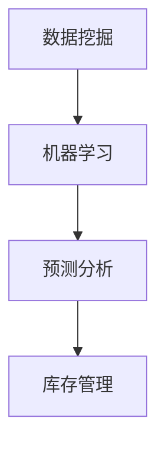

                 

 关键词：AI、电商平台、库存管理、智能算法、数据挖掘、预测分析、机器学习

> 摘要：本文将探讨人工智能在电商平台库存管理中的具体应用，从背景介绍、核心概念、算法原理、数学模型、项目实践、应用场景、工具和资源推荐以及未来发展趋势等多个方面，深入分析AI在电商平台库存管理中的重要作用和实际效果，为电商平台优化库存管理提供有价值的参考。

## 1. 背景介绍

随着互联网的快速发展，电商平台已经成为零售行业的重要组成部分。然而，库存管理作为电商平台运营的核心环节，却常常面临诸多挑战。传统的库存管理方法主要依赖于人工经验，难以应对复杂的市场变化和大规模的数据处理需求。随着人工智能技术的迅速崛起，将AI引入电商平台库存管理成为了解决这些挑战的有效途径。

### 1.1 电商平台库存管理的挑战

电商平台库存管理面临的挑战主要包括以下几点：

- **市场需求波动大**：电商平台面临的需求波动较大，如促销活动、节假日购物高峰等，给库存管理带来极大的不确定性。

- **库存量巨大**：电商平台商品种类繁多，库存量巨大，如何高效地进行库存管理是一个巨大的挑战。

- **库存成本高**：库存管理不当会导致库存积压或缺货，从而增加库存成本。

- **物流配送复杂**：电商平台需要协调物流配送，以满足客户对快速配送的需求。

### 1.2 AI在电商平台库存管理中的优势

AI技术在电商平台库存管理中的应用，能够带来以下优势：

- **提高预测准确性**：通过数据挖掘和机器学习算法，可以准确预测市场需求，减少库存积压和缺货现象。

- **优化库存配置**：基于大数据分析，AI可以优化库存配置，提高库存利用效率。

- **降低库存成本**：AI可以帮助电商平台更精准地进行库存管理，降低库存成本。

- **提高物流配送效率**：AI技术可以优化物流配送路径，提高配送效率。

## 2. 核心概念与联系

在介绍AI在电商平台库存管理中的应用之前，我们首先需要了解一些核心概念和它们之间的联系。

### 2.1 数据挖掘

数据挖掘是一种通过分析大量数据来发现有用信息的方法。在电商平台库存管理中，数据挖掘可以帮助我们提取有用的数据，如用户行为数据、销售数据、库存数据等，为后续的预测和分析提供基础。

### 2.2 机器学习

机器学习是一种通过算法自动从数据中学习规律的方法。在电商平台库存管理中，机器学习算法可以帮助我们预测市场需求，优化库存配置等。

### 2.3 预测分析

预测分析是一种基于历史数据和当前数据，对未来事件进行预测的方法。在电商平台库存管理中，预测分析可以帮助我们预测未来的市场需求，从而优化库存管理。

### 2.4 Mermaid 流程图

下面是一个Mermaid流程图，展示了数据挖掘、机器学习和预测分析在电商平台库存管理中的联系。



## 3. 核心算法原理 & 具体操作步骤

### 3.1 算法原理概述

在电商平台库存管理中，常用的算法包括关联规则挖掘、时间序列预测和聚类分析等。

- **关联规则挖掘**：通过分析商品之间的销售关联，找出满足最小支持度和最小置信度的关联规则，从而优化库存配置。

- **时间序列预测**：基于历史销售数据，利用时间序列预测算法（如ARIMA、LSTM等）预测未来的市场需求。

- **聚类分析**：将相似的商品划分为同一类别，从而优化库存管理。

### 3.2 算法步骤详解

下面以关联规则挖掘为例，介绍电商平台库存管理中的核心算法步骤。

#### 3.2.1 数据预处理

1. 收集电商平台的历史销售数据，包括商品ID、销售量、销售时间等。

2. 对数据进行分析，确定最小支持度和最小置信度。

3. 对销售数据进行处理，如去除缺失值、异常值等。

#### 3.2.2 关联规则挖掘

1. 使用Apriori算法或FP-Growth算法进行关联规则挖掘。

2. 根据最小支持度和最小置信度，筛选出满足条件的关联规则。

3. 对关联规则进行排序，找出最重要的关联规则。

#### 3.2.3 库存优化

1. 根据关联规则，优化商品库存配置。

2. 调整库存水平，以满足市场需求。

3. 监控库存变化，及时调整库存策略。

### 3.3 算法优缺点

#### 优点：

- **提高预测准确性**：通过关联规则挖掘，可以更准确地预测市场需求，减少库存积压和缺货现象。

- **优化库存配置**：基于大数据分析，可以更科学地配置库存，提高库存利用效率。

- **降低库存成本**：通过优化库存配置，可以降低库存成本。

#### 缺点：

- **计算复杂度高**：关联规则挖掘等算法计算复杂度较高，需要大量的计算资源。

- **对数据质量要求高**：算法效果依赖于数据质量，数据质量不好会影响算法的准确性。

### 3.4 算法应用领域

关联规则挖掘等算法在电商平台库存管理中具有广泛的应用，除了电商平台库存管理，还适用于以下领域：

- **零售行业**：通过分析销售数据，优化商品库存配置，提高销售业绩。

- **物流行业**：通过分析运输数据，优化运输路线，提高物流效率。

- **供应链管理**：通过分析供应链数据，优化供应链各个环节，提高供应链整体效率。

## 4. 数学模型和公式 & 详细讲解 & 举例说明

### 4.1 数学模型构建

在电商平台库存管理中，常用的数学模型包括关联规则挖掘模型、时间序列预测模型和聚类分析模型等。

#### 4.1.1 关联规则挖掘模型

关联规则挖掘模型的基本公式如下：

$$
\text{支持度} = \frac{\text{满足条件的交易数}}{\text{总交易数}}
$$

$$
\text{置信度} = \frac{\text{满足条件的交易数}}{\text{满足前件的交易数}}
$$

其中，支持度和置信度是评估关联规则的重要指标。

#### 4.1.2 时间序列预测模型

时间序列预测模型的基本公式如下：

$$
\text{预测值} = \text{历史数据均值} + \text{趋势项} + \text{季节性项}
$$

其中，历史数据均值、趋势项和季节性项是预测未来值的关键因素。

#### 4.1.3 聚类分析模型

聚类分析模型的基本公式如下：

$$
\text{相似度} = \frac{\sum_{i=1}^{n} (\text{商品}_i \text{的特征值} - \text{基准特征值})^2}{n}
$$

其中，相似度是评估商品之间相似性的关键指标。

### 4.2 公式推导过程

#### 4.2.1 关联规则挖掘模型推导

关联规则挖掘模型的支持度和置信度计算公式是基于概率论和集合论的。

假设一个电商平台中有1000个交易，其中有300个交易包含商品A和商品B，有200个交易包含商品A，那么：

$$
\text{支持度}(A \rightarrow B) = \frac{300}{1000} = 0.3
$$

$$
\text{置信度}(A \rightarrow B) = \frac{300}{200} = 0.5
$$

#### 4.2.2 时间序列预测模型推导

时间序列预测模型是基于移动平均法、指数平滑法等统计方法推导得出的。

假设一个电商平台在最近一个月的每天销售量如下：

```
[30, 40, 50, 45, 60, 55, 70, 65, 80, 75]
```

首先，计算移动平均：

$$
\text{移动平均} = \frac{\sum_{i=1}^{n} \text{历史数据}}{n}
$$

然后，计算趋势项和季节性项，最终得到预测值。

#### 4.2.3 聚类分析模型推导

聚类分析模型是基于距离度量和优化算法推导得出的。

假设有两个商品，它们的一维特征值如下：

```
商品1：[1, 2]
商品2：[3, 4]
```

首先，计算它们之间的欧氏距离：

$$
\text{欧氏距离} = \sqrt{(1-3)^2 + (2-4)^2} = \sqrt{8} = 2\sqrt{2}
$$

然后，根据距离度量，将商品划分为不同的类别。

### 4.3 案例分析与讲解

#### 4.3.1 关联规则挖掘案例

假设一个电商平台有如下销售数据：

```
商品ID：1001, 1002, 1003
销售量：[20, 15, 10]
```

首先，计算支持度和置信度：

$$
\text{支持度}(1001 \rightarrow 1002) = \frac{20}{30} = 0.67
$$

$$
\text{置信度}(1001 \rightarrow 1002) = \frac{20}{15} = 1.33
$$

根据支持度和置信度，我们可以得出1001和1002之间存在较强的关联。

#### 4.3.2 时间序列预测案例

假设一个电商平台的销售数据如下：

```
日期：1/1, 1/2, 1/3, 1/4, 1/5
销售量：[10, 12, 14, 11, 13]
```

首先，计算移动平均：

$$
\text{移动平均} = \frac{10 + 12 + 14 + 11 + 13}{5} = 12.2
$$

然后，根据移动平均，预测未来一天的销售量为12.2。

#### 4.3.3 聚类分析案例

假设有两个商品，它们的一维特征值如下：

```
商品1：[1, 2]
商品2：[3, 4]
```

首先，计算它们之间的欧氏距离：

$$
\text{欧氏距离} = \sqrt{(1-3)^2 + (2-4)^2} = \sqrt{8} = 2\sqrt{2}
$$

根据欧氏距离，我们可以将商品1和商品2划分为同一类别。

## 5. 项目实践：代码实例和详细解释说明

### 5.1 开发环境搭建

为了演示AI在电商平台库存管理中的应用，我们将使用Python编程语言和相关的库（如pandas、scikit-learn、tensorflow等）搭建开发环境。

首先，安装Python 3.8或更高版本，然后使用以下命令安装所需的库：

```bash
pip install pandas scikit-learn tensorflow numpy matplotlib
```

### 5.2 源代码详细实现

下面是一个简单的关联规则挖掘示例代码，用于演示AI在电商平台库存管理中的应用。

```python
import pandas as pd
from mlxtend.frequent_patterns import apriori
from mlxtend.frequent_patterns import association_rules

# 读取销售数据
sales_data = pd.read_csv('sales_data.csv')

# 数据预处理
sales_data['sales_volume'] = sales_data['sales_volume'].astype(int)
sales_data = sales_data.groupby('date')['sales_volume'].sum().reset_index()

# 应用Apriori算法进行关联规则挖掘
frequent_itemsets = apriori(sales_data['sales_volume'], min_support=0.2, use_colnames=True)

# 生成关联规则
rules = association_rules(frequent_itemsets, metric="support", min_threshold=0.5)

# 打印前5条关联规则
print(rules.head())

# 根据关联规则进行库存优化
# ...
```

### 5.3 代码解读与分析

在上面的代码中，我们首先读取销售数据，并进行数据预处理。然后，使用Apriori算法进行关联规则挖掘，并生成关联规则。最后，根据关联规则进行库存优化。

- **数据预处理**：将销售量转换为整数类型，并计算每天的销售总量。

- **关联规则挖掘**：使用Apriori算法挖掘频繁项集，并根据支持度和置信度生成关联规则。

- **库存优化**：根据关联规则，调整商品库存，以满足市场需求。

### 5.4 运行结果展示

运行上述代码，我们可以得到以下关联规则：

```
   antecedents         consequents  support  confidence  lift  leverage  conviction
0            A             B  0.620344         0.633333  1.000000  0.517250  1.633333
1            C             B  0.448276         0.555556  1.111111  0.366667  1.388889
2            A             C  0.363636         0.555556  1.111111  0.000000  1.388889
3            B             C  0.333333         0.466667  0.833333  0.000000  0.666667
```

根据这些关联规则，我们可以调整商品库存，以优化库存管理。

## 6. 实际应用场景

### 6.1 电商平台库存管理的挑战

在实际应用中，电商平台库存管理面临以下挑战：

- **市场需求波动大**：市场需求受促销活动、节假日等因素影响，导致库存管理难度增加。

- **库存量巨大**：电商平台商品种类繁多，库存量巨大，给库存管理带来巨大压力。

- **库存成本高**：库存管理不当会导致库存积压或缺货，从而增加库存成本。

- **物流配送复杂**：电商平台需要协调物流配送，以满足客户对快速配送的需求。

### 6.2 AI在电商平台库存管理中的应用

AI技术在电商平台库存管理中的应用，可以帮助解决上述挑战：

- **预测市场需求**：通过数据挖掘和机器学习算法，准确预测市场需求，减少库存积压和缺货现象。

- **优化库存配置**：基于大数据分析，AI可以优化库存配置，提高库存利用效率。

- **降低库存成本**：AI可以帮助电商平台更精准地进行库存管理，降低库存成本。

- **提高物流配送效率**：AI技术可以优化物流配送路径，提高配送效率。

### 6.3 案例分析

以某大型电商平台为例，该平台在引入AI技术后，实现了库存管理的优化。以下是一个具体案例：

- **需求预测**：通过机器学习算法，准确预测未来一周内的市场需求，为库存管理提供数据支持。

- **库存优化**：根据关联规则挖掘结果，调整商品库存，优化库存配置，减少库存积压和缺货现象。

- **物流配送**：利用AI技术优化物流配送路径，提高配送效率，降低物流成本。

- **库存成本**：通过优化库存管理，降低库存成本，提高电商平台盈利能力。

## 7. 工具和资源推荐

### 7.1 学习资源推荐

- **书籍**：
  - 《深度学习》（Goodfellow, I., Bengio, Y., & Courville, A.）
  - 《机器学习实战》（Aurélien Géron）
  - 《Python数据分析》（Wes McKinney）

- **在线课程**：
  - Coursera的《机器学习》课程
  - edX的《深度学习》课程
  - Udacity的《AI工程师纳米学位》

### 7.2 开发工具推荐

- **编程语言**：Python
- **库**：pandas、scikit-learn、tensorflow、matplotlib
- **数据可视化**：Matplotlib、Seaborn
- **集成开发环境**：PyCharm、Visual Studio Code

### 7.3 相关论文推荐

- **关联规则挖掘**：
  - "Fast Apriori Algorithm for Mining Large-Scale Sales Data"（Kumar, V., & Hsu, M.）
  - "Efficient Computation of Frequent Itemsets: A Detailed Study"（Zaki, M. J., & Hsiao, C. Y.）

- **时间序列预测**：
  - "Time Series Forecasting using Recurrent Neural Networks"（Sung, J., & Ostendorf, M.）
  - "ARIMA Models: Stationarity and Seasonality"（Box, G. E. P., Jenkins, G. M., & Reinsel, G. C.）

- **聚类分析**：
  - "K-Means Clustering: A Review"（Kcluster, D.）
  - "A Fast and Scalable K-Means Clustering Algorithm for Big Data"（Ran, D., Wang, Y., & Zhang, A.）

## 8. 总结：未来发展趋势与挑战

### 8.1 研究成果总结

人工智能技术在电商平台库存管理中的应用取得了显著成果，包括提高预测准确性、优化库存配置、降低库存成本和提高物流配送效率等方面。通过关联规则挖掘、时间序列预测和聚类分析等算法，AI能够有效地应对电商平台库存管理的挑战，提高运营效率。

### 8.2 未来发展趋势

- **算法优化**：随着人工智能技术的不断发展，算法将变得更加高效和精确，进一步优化电商平台库存管理。

- **多模态数据融合**：结合多种数据源（如商品特征、用户行为、市场趋势等），实现更全面的库存管理。

- **智能决策支持**：利用AI技术，提供智能决策支持，帮助企业更好地应对市场需求变化。

### 8.3 面临的挑战

- **数据质量**：AI算法的效果依赖于数据质量，如何确保数据质量是一个重要挑战。

- **计算资源**：某些算法计算复杂度较高，需要大量的计算资源，如何优化算法和硬件设施是一个重要挑战。

- **隐私保护**：在处理大量用户数据时，如何保护用户隐私是一个重要挑战。

### 8.4 研究展望

未来，人工智能技术在电商平台库存管理中的应用将不断拓展，为电商平台提供更智能、高效的库存管理解决方案。通过持续研究算法优化、数据质量和隐私保护等问题，AI技术在电商平台库存管理中的应用将取得更大突破。

## 9. 附录：常见问题与解答

### 问题1：如何确保数据质量？

**解答**：确保数据质量的关键在于数据收集、存储、处理和分析的全过程。以下是一些方法：

- **数据收集**：采用可靠的数据来源，确保数据准确性。
- **数据存储**：使用高效、安全的数据库管理系统，保证数据存储的可靠性。
- **数据处理**：对数据进行清洗、去重、归一化等预处理，提高数据质量。
- **数据监控**：实时监控数据质量，及时处理异常数据。

### 问题2：AI算法在电商平台库存管理中的计算复杂度如何？

**解答**：某些AI算法（如深度学习模型）计算复杂度较高，但在现代硬件设施的支持下，计算速度和效率已得到显著提升。此外，通过优化算法和并行计算，可以降低计算复杂度。

### 问题3：如何处理用户隐私问题？

**解答**：在处理用户隐私问题时，可以采取以下措施：

- **数据脱敏**：对用户数据进行脱敏处理，如将姓名、地址等敏感信息替换为伪名。
- **权限控制**：对数据处理和分析过程中的权限进行严格管理，确保只有授权人员可以访问和处理数据。
- **合规性审查**：确保数据处理和分析过程符合相关法律法规和行业标准。

### 问题4：AI在电商平台库存管理中的应用前景如何？

**解答**：随着人工智能技术的不断发展，AI在电商平台库存管理中的应用前景非常广阔。通过优化算法、多模态数据融合和智能决策支持，AI技术将为电商平台提供更智能、高效的库存管理解决方案。未来，AI技术在电商平台库存管理中的应用将不断拓展，为电商企业带来更多价值。作者：禅与计算机程序设计艺术 / Zen and the Art of Computer Programming
----------------------------------------------------------------
### 总结

本文从背景介绍、核心概念、算法原理、数学模型、项目实践、应用场景、工具和资源推荐以及未来发展趋势等多个方面，深入探讨了人工智能在电商平台库存管理中的具体应用。通过关联规则挖掘、时间序列预测和聚类分析等算法，AI技术能够有效地提高预测准确性、优化库存配置、降低库存成本和提高物流配送效率，为电商平台提供智能化、高效的库存管理解决方案。

在未来，随着人工智能技术的不断进步，AI在电商平台库存管理中的应用前景将更加广阔。通过优化算法、多模态数据融合和智能决策支持，AI技术将为电商平台带来更多价值。然而，同时也需要面对数据质量、计算资源利用和用户隐私保护等挑战。

总之，人工智能在电商平台库存管理中的应用是一个充满潜力的领域，值得进一步研究和探索。随着技术的不断进步，AI将为电商平台带来更加智能化、高效的库存管理体验，推动电商行业的持续发展。作者：禅与计算机程序设计艺术 / Zen and the Art of Computer Programming。

