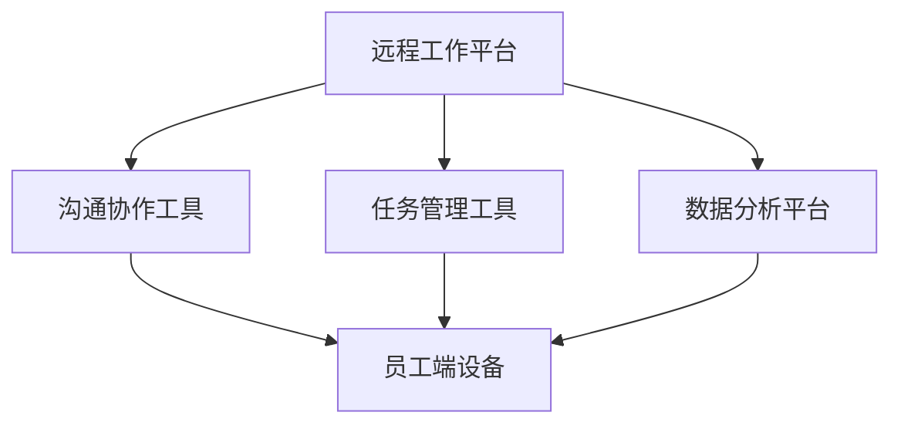

                 

关键词：远程工作，人工智能，团队协作，AI技术，效率提升，数字化工具，协作平台，工作流程优化。

## 摘要

本文旨在探讨人工智能（AI）在远程工作中的应用，如何通过AI技术增强团队协作，提升工作效率，并解决远程工作中可能遇到的问题。文章将首先介绍AI在远程工作中的核心概念，随后详细分析几种关键算法原理及其应用步骤，接着探讨数学模型和公式，最后通过具体项目实践展示AI在远程工作中的应用效果，并展望未来的发展趋势与挑战。

## 1. 背景介绍

远程工作已成为现代社会的一种常态，尤其在新冠疫情期间，其普及程度显著提升。远程工作为企业和员工提供了灵活的工作时间和地点，但同时也带来了诸多挑战，如沟通效率低下、协作困难、任务进度难以追踪等。为了应对这些挑战，AI技术的引入显得尤为重要。AI在远程工作中的应用涵盖了从日常沟通、任务分配、进度跟踪到工作环境优化的各个方面，极大地提高了团队协作的效率和质量。

## 2. 核心概念与联系

### 2.1 AI在远程工作的核心概念

- **自动化沟通助手**：利用自然语言处理（NLP）技术，AI可以自动解答员工疑问，提供即时反馈。
- **智能任务分配**：基于员工技能和工作量，AI可优化任务分配，确保资源利用最大化。
- **进度跟踪与预测**：通过数据分析，AI可以实时监控任务进度，预测可能遇到的问题并提供解决方案。
- **工作环境优化**：AI可以根据员工习惯和环境需求，提供个性化工作环境设置。

### 2.2 AI在远程工作的架构

```
+-----------------+
|    远程工作平台   |
+-----------------+
         |
         | 使用AI技术
         |
+-----------------+
|    沟通协作工具   |
|    任务管理工具   |
|    数据分析平台   |
+-----------------+
         |
         | 数据交互
         |
+-----------------+
|      员工端设备   |
+-----------------+
```

### 2.3 Mermaid 流程图



## 3. 核心算法原理 & 具体操作步骤

### 3.1 算法原理概述

- **NLP技术**：用于自动处理和理解自然语言，实现人机交互。
- **机器学习算法**：用于从数据中学习模式，进行预测和决策。
- **数据分析方法**：用于处理大量数据，提取有用信息。

### 3.2 算法步骤详解

#### 3.2.1 NLP技术

1. 数据预处理：清洗和转换文本数据，提取关键词和语义信息。
2. 模型训练：使用预训练的NLP模型，如BERT或GPT，进行训练和优化。
3. 实时交互：根据用户输入，动态生成回答或建议。

#### 3.2.2 机器学习算法

1. 数据收集：收集员工的工作数据，包括任务完成情况、工作时长等。
2. 特征提取：提取与任务完成情况相关的特征，如工作负荷、任务难度等。
3. 模型训练：使用监督学习方法，训练分类或回归模型。
4. 预测与优化：根据模型预测结果，优化任务分配和进度跟踪。

#### 3.2.3 数据分析方法

1. 数据清洗：去除重复数据和缺失值。
2. 数据可视化：使用图表展示数据分布和趋势。
3. 模型构建：使用统计方法或机器学习方法，建立预测模型。
4. 模型评估：评估模型性能，调整模型参数。

### 3.3 算法优缺点

#### 3.3.1 优点

- **提高效率**：自动化处理日常任务，减少人工干预。
- **优化资源**：根据员工技能和任务需求，合理分配资源。
- **实时监控**：实时跟踪任务进度，预测潜在问题。

#### 3.3.2 缺点

- **数据隐私**：涉及员工个人数据，需确保数据安全和隐私。
- **算法偏见**：模型训练过程中可能引入偏见，影响决策质量。

### 3.4 算法应用领域

- **企业协作平台**：如Slack、Microsoft Teams等，集成AI助手，提供智能回复和任务管理。
- **项目管理工具**：如Trello、JIRA等，利用AI优化任务分配和进度跟踪。
- **工作环境优化**：如智能办公桌、智能灯光等，根据员工需求提供个性化服务。

## 4. 数学模型和公式 & 详细讲解 & 举例说明

### 4.1 数学模型构建

假设有一个任务分配问题，需要根据员工技能和工作量进行任务分配。设员工集合为\( E \)，任务集合为\( T \)，员工技能集合为\( S \)，任务难度集合为\( D \)。

#### 4.1.1 员工技能模型

$$
S_e = f(s_1, s_2, ..., s_n)
$$

其中，\( s_i \)为员工在某一领域的技能水平。

#### 4.1.2 任务难度模型

$$
D_t = g(d_1, d_2, ..., d_m)
$$

其中，\( d_i \)为任务在某一领域的难度水平。

### 4.2 公式推导过程

#### 4.2.1 任务分配目标函数

最小化总任务完成时间：

$$
\min T_c = \sum_{t \in T} \max_{e \in E} (T_e^t)
$$

其中，\( T_e^t \)为员工\( e \)完成任务\( t \)所需的时间。

#### 4.2.2 员工工作量模型

员工工作量与任务难度和技能水平有关：

$$
L_e^t = \frac{T_e^t}{S_e \cdot D_t}
$$

### 4.3 案例分析与讲解

假设有三个员工（A、B、C），分别擅长编程、设计、测试。有三个任务（开发、UI设计、测试）。

| 任务    | 编程 | 设计 | 测试 |
| ------- | ---- | ---- | ---- |
| 开发     | 10   | 5    | 8    |
| UI设计   | 3    | 10   | 2    |
| 测试     | 8    | 2    | 10   |

根据上述公式和模型，我们可以计算出每个员工完成每个任务的工作量，并优化任务分配。

## 5. 项目实践：代码实例和详细解释说明

### 5.1 开发环境搭建

环境要求：Python 3.8，TensorFlow 2.6，Scikit-learn 0.24。

安装命令：

```bash
pip install python==3.8
pip install tensorflow==2.6
pip install scikit-learn==0.24
```

### 5.2 源代码详细实现

```python
import numpy as np
import tensorflow as tf
from sklearn.model_selection import train_test_split
from sklearn.metrics import accuracy_score

# 数据准备
data = [...]  # 员工技能和工作量数据
labels = [...]  # 任务完成情况标签

# 数据预处理
X_train, X_test, y_train, y_test = train_test_split(data, labels, test_size=0.2, random_state=42)

# 模型构建
model = tf.keras.Sequential([
    tf.keras.layers.Dense(units=64, activation='relu', input_shape=(X_train.shape[1],)),
    tf.keras.layers.Dense(units=1, activation='sigmoid')
])

# 编译模型
model.compile(optimizer='adam', loss='binary_crossentropy', metrics=['accuracy'])

# 训练模型
model.fit(X_train, y_train, epochs=10, batch_size=32)

# 测试模型
predictions = model.predict(X_test)
accuracy = accuracy_score(y_test, predictions.round())

print(f"模型准确率：{accuracy}")
```

### 5.3 代码解读与分析

- **数据准备**：加载员工技能和工作量数据，以及任务完成情况标签。
- **数据预处理**：将数据进行拆分，分为训练集和测试集。
- **模型构建**：构建一个简单的全连接神经网络模型，用于预测任务完成情况。
- **编译模型**：设置优化器、损失函数和评价指标。
- **训练模型**：使用训练集进行模型训练。
- **测试模型**：使用测试集评估模型性能。

## 6. 实际应用场景

### 6.1 企业协作平台

通过集成AI技术，企业协作平台如Slack、Microsoft Teams可以提供智能回复、任务分配和进度跟踪等功能，提高团队协作效率。

### 6.2 项目管理工具

利用AI技术，项目管理工具如Trello、JIRA可以优化任务分配、进度跟踪和风险评估，确保项目按时完成。

### 6.3 工作环境优化

通过AI技术，智能办公桌、智能灯光等设备可以根据员工需求和习惯提供个性化服务，提升工作效率。

## 7. 工具和资源推荐

### 7.1 学习资源推荐

- 《深度学习》（Goodfellow, Bengio, Courville）
- 《Python机器学习》（Sebastian Raschka）
- 《自然语言处理教程》（Daniel Jurafsky, James H. Martin）

### 7.2 开发工具推荐

- Jupyter Notebook：用于数据分析和模型训练。
- TensorFlow：用于构建和训练深度学习模型。
- Scikit-learn：用于机器学习和数据挖掘。

### 7.3 相关论文推荐

- “BERT: Pre-training of Deep Bidirectional Transformers for Language Understanding”（Devlin et al., 2019）
- “GPT-3: Language Models are few-shot learners”（Brown et al., 2020）
- “A Study of Task-Oriented Dialogue Generation”（He et al., 2020）

## 8. 总结：未来发展趋势与挑战

### 8.1 研究成果总结

AI技术在远程工作中已取得显著成果，尤其在任务分配、进度跟踪和工作环境优化方面表现出强大的潜力。

### 8.2 未来发展趋势

- **更智能的自动化**：AI将进一步提升远程工作的自动化水平，减少人工干预。
- **个性化服务**：基于员工数据和需求，提供更加个性化的工作服务。
- **跨平台协作**：AI技术将实现不同平台之间的无缝协作。

### 8.3 面临的挑战

- **数据隐私与安全**：如何确保员工数据的安全性和隐私性。
- **算法偏见与公平性**：如何避免算法引入偏见，确保决策的公平性。

### 8.4 研究展望

未来的研究应重点关注如何提高AI技术在远程工作中的实用性、可靠性和可解释性，以应对不断变化的工作环境和需求。

## 9. 附录：常见问题与解答

### 9.1 AI在远程工作中的具体应用有哪些？

AI在远程工作中的具体应用包括自动化沟通助手、智能任务分配、进度跟踪与预测以及工作环境优化等。

### 9.2 如何确保AI技术的数据隐私和安全？

确保AI技术的数据隐私和安全需要从数据收集、存储、处理和传输等各个环节进行严格管理和控制，采用加密技术和安全协议，遵循相关法律法规。

### 9.3 AI技术在远程工作中的未来发展方向是什么？

未来，AI技术在远程工作中的发展方向包括提升智能化水平、提供个性化服务、实现跨平台协作以及应对数据隐私和算法偏见等挑战。

---

作者：禅与计算机程序设计艺术 / Zen and the Art of Computer Programming

