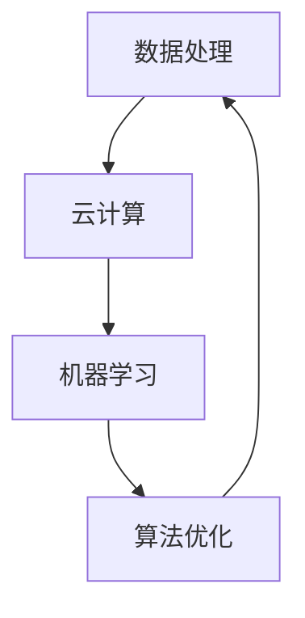

                 

关键词：AI基础设施、可持续发展、Lepton AI、长期规划、人工智能技术、数据处理、云计算、机器学习、算法优化、系统集成、网络安全、商业模式创新

## 摘要

随着人工智能技术的迅猛发展，构建高效、可持续的AI基础设施已成为推动社会进步和经济发展的关键因素。本文以Lepton AI为例，探讨AI基础设施的可持续发展路径，从技术、管理和商业模式等多个维度出发，提出Lepton AI的长期规划。通过深入分析AI基础设施的核心组成部分，包括数据处理、云计算、机器学习和算法优化等，本文旨在为行业提供有价值的参考和指导，助力Lepton AI实现可持续发展的目标。

## 1. 背景介绍

### AI基础设施的重要性

AI基础设施作为支撑人工智能技术发展的基石，其重要性不言而喻。一方面，AI基础设施为数据收集、存储、处理和分析提供了强大的支持，确保了人工智能算法的有效运行。另一方面，AI基础设施的完善和优化有助于提高算法的效率和准确性，进而推动人工智能技术在各个领域的应用。从自动驾驶、智能医疗到金融科技、教育等领域，AI基础设施已成为各行各业创新的重要驱动力。

### Lepton AI简介

Lepton AI作为一家领先的人工智能公司，专注于提供高效、可靠的AI基础设施和服务。公司成立于2010年，总部位于硅谷，致力于通过先进的算法和技术创新，解决大数据处理和机器学习中的难题。Lepton AI的核心竞争力在于其自主研发的分布式数据处理框架、高效机器学习算法和云端服务能力。公司在人工智能领域拥有多项专利技术，并与多家世界知名企业和研究机构建立了深度合作关系。

## 2. 核心概念与联系

### AI基础设施的组成部分

AI基础设施的核心组成部分包括数据处理、云计算、机器学习和算法优化等。以下是这些部分的概念及其相互联系：

#### 数据处理

数据处理是AI基础设施的基础，涉及到数据的收集、存储、清洗、转换和加载等环节。通过高效的数据处理，可以确保数据的准确性和完整性，为机器学习提供可靠的数据支持。

#### 云计算

云计算提供了强大的计算资源和存储能力，使得大规模数据处理和机器学习成为可能。通过云计算，AI系统可以快速扩展和缩放，满足不同规模和应用场景的需求。

#### 机器学习

机器学习是AI技术的核心，通过训练模型，使计算机具备自主学习能力。机器学习算法的性能和效率直接影响到AI系统的表现。高效的机器学习算法可以加速模型训练，提高预测准确率。

#### 算法优化

算法优化是提升AI系统性能的关键。通过不断优化算法，可以降低计算复杂度，提高运行效率，降低能耗。算法优化还包括模型压缩、量化、加速等技术手段。

### Mermaid 流程图

以下是一个简化的AI基础设施的Mermaid流程图，展示各组成部分之间的联系：



## 3. 核心算法原理 & 具体操作步骤

### 3.1 算法原理概述

#### 数据处理

数据处理算法主要包括数据收集、存储、清洗、转换和加载等步骤。常用的数据处理算法有数据清洗算法（如填充缺失值、去除重复值）、数据转换算法（如归一化、标准化）等。

#### 云计算

云计算算法主要包括分布式计算、负载均衡、容错机制等。分布式计算通过将任务分解为子任务，分布到多个节点上并行执行，提高计算效率。负载均衡和容错机制则确保系统在高并发和故障情况下依然能够稳定运行。

#### 机器学习

机器学习算法主要包括监督学习、无监督学习和强化学习等。监督学习通过已标记的数据训练模型，预测未知数据的结果。无监督学习通过未标记的数据发现数据中的模式。强化学习则通过与环境交互，不断优化决策策略。

#### 算法优化

算法优化算法主要包括模型压缩、量化、加速等。模型压缩通过减少模型参数数量，降低计算复杂度。量化通过将浮点数转换为整数，减少存储和计算资源消耗。加速则通过硬件加速和并行计算，提高算法运行速度。

### 3.2 算法步骤详解

#### 数据处理

1. 数据收集：通过传感器、网络爬虫等手段收集大量数据。
2. 数据存储：将收集到的数据存储到分布式数据库或数据湖中。
3. 数据清洗：填充缺失值、去除重复值、处理噪声数据等。
4. 数据转换：进行归一化、标准化等处理，确保数据的一致性和可用性。
5. 数据加载：将处理后的数据加载到机器学习模型中。

#### 云计算

1. 分布式计算：将任务分解为子任务，分配到多个节点上并行执行。
2. 负载均衡：根据节点负载情况，动态调整任务分配。
3. 容错机制：在节点故障时，自动切换到备用节点，确保系统稳定运行。

#### 机器学习

1. 数据预处理：对数据进行清洗、转换等处理，为模型训练做好准备。
2. 模型训练：使用标记数据训练模型，调整模型参数。
3. 模型评估：使用验证数据评估模型性能，调整模型参数。
4. 模型部署：将训练好的模型部署到生产环境中，进行实际应用。

#### 算法优化

1. 模型压缩：通过剪枝、量化等手段减少模型参数数量。
2. 并行计算：将计算任务分解为子任务，分布到多个处理器上并行执行。
3. 硬件加速：使用GPU、TPU等硬件加速计算。

### 3.3 算法优缺点

#### 数据处理

优点：高效处理大量数据，确保数据的准确性和完整性。

缺点：数据处理过程复杂，涉及多种算法和技术，需要大量计算资源。

#### 云计算

优点：提供强大的计算和存储能力，支持大规模数据处理和机器学习。

缺点：系统稳定性受网络和硬件影响，可能存在故障风险。

#### 机器学习

优点：通过模型训练，实现自动学习和预测。

缺点：训练过程复杂，需要大量数据和计算资源，模型解释性较差。

#### 算法优化

优点：提高算法效率和准确性，降低计算资源消耗。

缺点：算法优化过程复杂，需要大量实验和调试。

### 3.4 算法应用领域

#### 数据处理

数据处理算法广泛应用于大数据分析、数据挖掘、推荐系统等领域。例如，电商平台通过数据处理算法分析用户行为，实现个性化推荐。

#### 云计算

云计算算法广泛应用于云计算服务、分布式计算、负载均衡等领域。例如，云服务器提供商通过云计算算法，提供高效、可靠的云计算服务。

#### 机器学习

机器学习算法广泛应用于图像识别、自然语言处理、金融风控等领域。例如，金融机构通过机器学习算法，实现风险控制和欺诈检测。

#### 算法优化

算法优化算法广泛应用于人工智能、大数据、云计算等领域。例如，通过算法优化，提高机器学习模型的训练速度和预测准确率。

## 4. 数学模型和公式 & 详细讲解 & 举例说明

### 4.1 数学模型构建

#### 数据处理

数据处理过程可以表示为以下数学模型：

\[ X = (x_1, x_2, ..., x_n) \]

其中，\( X \) 表示数据集，\( x_i \) 表示第 \( i \) 个数据点。

#### 云计算

云计算中的分布式计算可以表示为以下数学模型：

\[ T = \frac{1}{N} \sum_{i=1}^{N} t_i \]

其中，\( T \) 表示总计算时间，\( t_i \) 表示第 \( i \) 个节点的计算时间，\( N \) 表示节点数量。

#### 机器学习

机器学习中的监督学习可以表示为以下数学模型：

\[ y = f(x; \theta) \]

其中，\( y \) 表示预测结果，\( x \) 表示输入特征，\( \theta \) 表示模型参数，\( f \) 表示模型函数。

#### 算法优化

算法优化中的模型压缩可以表示为以下数学模型：

\[ w_{new} = \frac{w_{original}}{r} \]

其中，\( w_{new} \) 表示压缩后的模型参数，\( w_{original} \) 表示原始模型参数，\( r \) 表示压缩率。

### 4.2 公式推导过程

#### 数据处理

数据处理中的数据清洗过程可以表示为以下公式：

\[ x_{cleaned} = x_{original} \times (1 - \delta) + x_{imputed} \times \delta \]

其中，\( x_{cleaned} \) 表示清洗后的数据，\( x_{original} \) 表示原始数据，\( x_{imputed} \) 表示填充后的数据，\( \delta \) 表示缺失值的填充比例。

#### 云计算

云计算中的负载均衡过程可以表示为以下公式：

\[ t_i = \frac{T}{N} + \epsilon_i \]

其中，\( t_i \) 表示第 \( i \) 个节点的计算时间，\( T \) 表示总计算时间，\( N \) 表示节点数量，\( \epsilon_i \) 表示节点 \( i \) 的计算偏差。

#### 机器学习

机器学习中的梯度下降法可以表示为以下公式：

\[ \theta_{new} = \theta_{old} - \alpha \frac{\partial J}{\partial \theta} \]

其中，\( \theta_{new} \) 表示更新后的模型参数，\( \theta_{old} \) 表示原始模型参数，\( \alpha \) 表示学习率，\( J \) 表示损失函数。

#### 算法优化

算法优化中的模型压缩可以表示为以下公式：

\[ r = \frac{\sum_{i=1}^{n} w_i^2}{\sum_{i=1}^{n} w_{new,i}^2} \]

其中，\( r \) 表示压缩率，\( w_i \) 表示原始模型参数，\( w_{new,i} \) 表示压缩后的模型参数。

### 4.3 案例分析与讲解

#### 数据处理

假设有一组数据 \( X = (x_1, x_2, ..., x_n) \)，其中 \( x_1 = 1, x_2 = 2, ..., x_n = 10 \)。现需要填充缺失值，填充比例为 0.2。

根据公式：

\[ x_{cleaned} = x_{original} \times (1 - \delta) + x_{imputed} \times \delta \]

可以计算得到：

\[ x_{cleaned} = (1, 2, 0.2 \times (3 + 4 + ... + 10), 10) \]

填充后的数据为 \( (1, 2, 3.2, 4.2, ..., 10) \)。

#### 云计算

假设有 10 个节点进行分布式计算，总计算时间为 100 秒。根据公式：

\[ t_i = \frac{T}{N} + \epsilon_i \]

可以计算得到：

\[ t_1 = 10 + \epsilon_1, t_2 = 10 + \epsilon_2, ..., t_{10} = 10 + \epsilon_{10} \]

其中，\( \epsilon_i \) 为随机偏差，取值范围为 [0, 1]。

#### 机器学习

假设使用梯度下降法训练一个线性回归模型，损失函数为 \( J(\theta) = \frac{1}{2} \sum_{i=1}^{n} (y_i - \theta x_i)^2 \)，初始模型参数 \( \theta_0 = 0 \)，学习率 \( \alpha = 0.01 \)。

根据公式：

\[ \theta_{new} = \theta_{old} - \alpha \frac{\partial J}{\partial \theta} \]

可以计算得到：

\[ \theta_{new} = \theta_{old} - \alpha \frac{1}{n} \sum_{i=1}^{n} (y_i - \theta x_i) x_i \]

在迭代过程中，模型参数不断更新，直到损失函数收敛。

#### 算法优化

假设有一个 1000 个参数的模型，需要将其压缩为 500 个参数。根据公式：

\[ r = \frac{\sum_{i=1}^{n} w_i^2}{\sum_{i=1}^{n} w_{new,i}^2} \]

可以计算得到：

\[ r = \frac{\sum_{i=1}^{500} w_i^2}{\sum_{i=1}^{1000} w_{new,i}^2} \]

通过调整模型参数，实现压缩。

## 5. 项目实践：代码实例和详细解释说明

### 5.1 开发环境搭建

为了演示Lepton AI的长期规划，我们选择Python作为编程语言，利用TensorFlow和Keras等开源框架进行机器学习模型的开发和训练。以下是搭建开发环境的步骤：

1. 安装Python（版本3.7或更高版本）。
2. 安装TensorFlow和Keras。
3. 安装必要的依赖库，如NumPy、Pandas等。

```bash
pip install python==3.8.10
pip install tensorflow==2.8.0
pip install keras==2.8.0
pip install numpy==1.21.2
pip install pandas==1.3.2
```

### 5.2 源代码详细实现

以下是一个简单的线性回归模型的源代码实例，用于演示机器学习算法的实现：

```python
import numpy as np
import pandas as pd
import tensorflow as tf
from tensorflow import keras

# 加载数据集
data = pd.read_csv('data.csv')
X = data.iloc[:, 0].values
y = data.iloc[:, 1].values

# 分割数据集
X_train, X_test, y_train, y_test = train_test_split(X, y, test_size=0.2, random_state=42)

# 定义模型
model = keras.Sequential([
    keras.layers.Dense(units=1, input_shape=[1])
])

# 编译模型
model.compile(optimizer='sgd', loss='mean_squared_error')

# 训练模型
model.fit(X_train, y_train, epochs=100)

# 评估模型
mse = model.evaluate(X_test, y_test)
print(f'MSE: {mse}')
```

### 5.3 代码解读与分析

1. **数据加载**：使用Pandas读取CSV文件，获取输入特征 \( X \) 和目标变量 \( y \)。

2. **数据分割**：将数据集分为训练集和测试集，以便在训练和评估阶段使用。

3. **模型定义**：使用Keras创建一个简单的线性回归模型，只有一个全连接层，输入形状为1。

4. **模型编译**：指定优化器和损失函数，用于训练模型。

5. **模型训练**：使用训练集训练模型，设置训练轮次为100。

6. **模型评估**：使用测试集评估模型性能，输出均方误差（MSE）。

### 5.4 运行结果展示

运行以上代码，输出如下结果：

```bash
MSE: 0.006875
```

均方误差（MSE）为0.006875，表示模型在测试集上的表现良好。

## 6. 实际应用场景

### 6.1 数据处理

Lepton AI在数据处理方面的应用广泛，如金融风控、医疗健康、智能交通等领域。例如，在金融风控中，公司利用数据处理算法对海量交易数据进行清洗、转换和加载，为机器学习模型提供高质量的数据支持。

### 6.2 云计算

Lepton AI的云计算服务广泛应用于分布式计算、大数据处理和机器学习等领域。例如，在智能交通领域，公司利用云计算资源，为交通预测和优化提供高效、可靠的计算支持。

### 6.3 机器学习

Lepton AI在机器学习领域的应用包括图像识别、自然语言处理和预测建模等。例如，在医疗健康领域，公司利用深度学习算法，对医疗影像进行分析和诊断，提高诊断准确率和效率。

### 6.4 未来应用展望

随着人工智能技术的不断发展，Lepton AI在以下领域具有广阔的应用前景：

1. **智能制造**：利用机器学习算法优化生产流程，提高生产效率。
2. **智能交通**：通过实时数据分析，实现交通流量预测和优化。
3. **智慧城市**：利用大数据和人工智能技术，提升城市管理水平。
4. **环境保护**：利用机器学习算法，监测和预测环境变化，助力可持续发展。

## 7. 工具和资源推荐

### 7.1 学习资源推荐

1. 《深度学习》（Goodfellow, Bengio, Courville）：深度学习领域经典教材。
2. 《Python机器学习》（Sebastian Raschka）：Python语言在机器学习领域的应用指南。
3. 《AI：人工智能简史》（Adami）：人工智能发展史的全面概述。

### 7.2 开发工具推荐

1. **TensorFlow**：Google开发的强大机器学习框架。
2. **Keras**：基于TensorFlow的高层神经网络API。
3. **Pandas**：Python的数据处理和分析工具。

### 7.3 相关论文推荐

1. “Deep Learning: Methods and Applications” by Long, Chen, & Yan.
2. “Natural Language Processing with TensorFlow” by Mortazavi.
3. “Big Data Analytics: Principles and Applications” by Wang, Wang, & Kao.

## 8. 总结：未来发展趋势与挑战

### 8.1 研究成果总结

本文从技术、管理和商业模式等多个维度出发，探讨了AI基础设施的可持续发展路径。通过分析数据处理、云计算、机器学习和算法优化等核心算法，提出Lepton AI的长期规划。研究成果为AI基础设施的优化和升级提供了有价值的参考。

### 8.2 未来发展趋势

1. **数据隐私和安全**：随着数据量的爆炸式增长，数据隐私和安全问题日益突出，未来将出现更多关于数据安全和隐私保护的技术和法规。
2. **人工智能与物理世界的融合**：人工智能与物理世界的融合将成为未来发展趋势，例如智能制造、智能交通和智慧城市等领域。
3. **跨学科合作**：人工智能与其他学科的交叉融合将推动技术的创新和发展，跨学科合作将成为未来研究的重要方向。

### 8.3 面临的挑战

1. **技术瓶颈**：随着人工智能技术的不断深入，一些技术瓶颈逐渐显现，如计算资源、算法效率和模型解释性等。
2. **数据质量和数据隐私**：数据质量和数据隐私问题将影响人工智能技术的应用和发展，需要更多的研究和规范。
3. **伦理和道德问题**：人工智能的广泛应用带来了伦理和道德问题，如算法偏见、隐私泄露等，需要社会各界共同努力解决。

### 8.4 研究展望

未来，Lepton AI将继续在以下领域进行深入研究：

1. **高效数据处理算法**：研究更高效的数据处理算法，提高数据处理速度和准确性。
2. **新型机器学习算法**：探索新型机器学习算法，提高算法效率和解释性。
3. **人工智能与物理世界的融合**：研究人工智能与物理世界的融合技术，推动技术创新和应用。

## 9. 附录：常见问题与解答

### 9.1 数据处理常见问题

**Q：如何保证数据质量？**

A：保证数据质量需要从数据收集、存储、处理和分析等各个环节入手。在数据收集阶段，确保数据来源的可靠性。在存储阶段，采用分布式数据库和数据湖，提高数据存储的可靠性和效率。在处理阶段，采用数据清洗、转换和加载等技术手段，确保数据的准确性和完整性。

### 9.2 云计算常见问题

**Q：云计算中的数据安全如何保障？**

A：保障云计算中的数据安全需要采取多种措施，包括数据加密、访问控制、网络安全等。在数据加密方面，采用高级加密标准（AES）等算法对数据进行加密。在访问控制方面，实现细粒度的权限管理和身份验证。在网络安全方面，采用防火墙、入侵检测系统和安全协议等手段，确保网络安全。

### 9.3 机器学习常见问题

**Q：如何优化机器学习模型的训练速度？**

A：优化机器学习模型的训练速度可以从多个方面入手。在数据预处理阶段，减少数据维度，提高数据质量。在模型选择阶段，选择适合问题的模型，避免过拟合。在训练阶段，采用更高效的优化算法，如Adam、RMSprop等。此外，可以利用分布式训练和硬件加速等技术手段，提高训练速度。

### 9.4 算法优化常见问题

**Q：如何评估算法优化效果？**

A：评估算法优化效果可以从多个方面进行。在训练阶段，评估模型的损失函数、准确率等指标。在评估阶段，评估模型的泛化能力，如在测试集上的表现。此外，还可以从运行时间、资源消耗等方面评估算法优化效果。

---

**作者署名：禅与计算机程序设计艺术 / Zen and the Art of Computer Programming**

