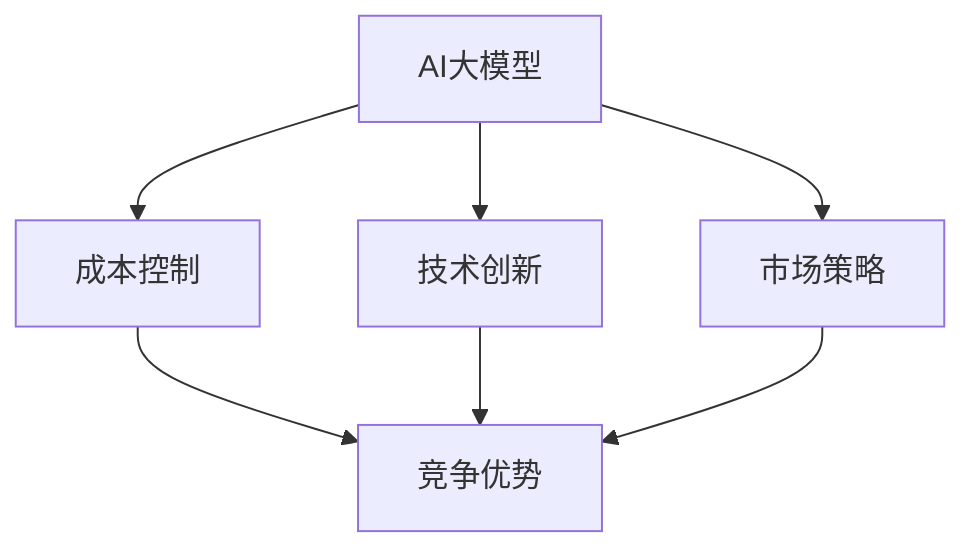

                 

关键词：AI大模型、创业、价格战、成本控制、技术创新、市场策略

摘要：本文将探讨AI大模型创业者在面临未来可能的价格战时，如何通过成本控制、技术创新和市场策略来保持竞争优势。文章首先介绍了AI大模型的发展背景和现状，然后分析了价格战的可能原因，接着提出了一系列应对策略，并最后对未来的发展趋势进行了展望。

## 1. 背景介绍

近年来，随着人工智能技术的快速发展，AI大模型成为各行各业的热门话题。从自然语言处理到图像识别，从推荐系统到自动化决策，AI大模型已经在多个领域取得了显著的成果。与此同时，越来越多的创业公司投身于AI大模型的研发和商业应用中。

然而，随着技术的成熟和市场的扩大，AI大模型的竞争也愈发激烈。未来，价格战可能会成为行业常态，这给创业公司带来了巨大的挑战。如何在激烈的市场竞争中保持竞争力，成为每一个AI大模型创业公司必须思考的问题。

## 2. 核心概念与联系

在探讨如何应对价格战之前，我们需要明确几个核心概念：

1. **AI大模型**：指的是使用海量数据训练的复杂神经网络模型，可以用于各种智能任务，如语音识别、图像识别、自然语言处理等。

2. **成本控制**：指通过优化资源使用、提高生产效率、降低运营成本等方式来降低总体成本。

3. **技术创新**：指通过研发新技术、新算法，提高产品的性能和效率。

4. **市场策略**：指通过定价策略、营销策略、客户关系管理等方式来扩大市场份额。

下面是这几个概念之间的Mermaid流程图：



## 3. 核心算法原理 & 具体操作步骤

### 3.1 算法原理概述

AI大模型的核心在于其深度学习算法。深度学习是一种机器学习技术，通过构建多层神经网络，自动从数据中学习特征，并利用这些特征进行预测和决策。以下是深度学习的基本原理：

1. **输入层**：接收外部输入，如文本、图像等。
2. **隐藏层**：通过非线性变换，提取输入的特征。
3. **输出层**：根据隐藏层的特征进行预测或决策。

### 3.2 算法步骤详解

1. **数据预处理**：对输入数据进行清洗、归一化等处理，使其符合模型训练的要求。
2. **模型构建**：选择合适的神经网络架构，如卷积神经网络（CNN）、循环神经网络（RNN）等。
3. **训练过程**：使用大量数据对模型进行训练，通过反向传播算法不断调整模型参数，使其性能不断提高。
4. **模型评估**：使用验证数据集评估模型性能，确保模型在未知数据上表现良好。
5. **模型部署**：将训练好的模型部署到生产环境中，进行实际应用。

### 3.3 算法优缺点

**优点**：

- **强大的表达能力**：深度学习模型可以自动从数据中学习复杂的特征，适用于各种复杂的任务。
- **高效的预测能力**：通过大规模数据训练，深度学习模型可以快速进行预测和决策。
- **广泛的适用性**：深度学习模型可以应用于多个领域，如自然语言处理、计算机视觉、推荐系统等。

**缺点**：

- **训练时间较长**：深度学习模型需要大量的数据进行训练，训练时间较长。
- **计算资源消耗大**：深度学习模型需要大量的计算资源，如GPU或TPU等。
- **数据依赖性强**：深度学习模型的性能高度依赖于训练数据的质量和数量。

### 3.4 算法应用领域

深度学习算法在多个领域都有广泛的应用，如：

- **自然语言处理**：用于文本分类、机器翻译、情感分析等。
- **计算机视觉**：用于图像识别、目标检测、人脸识别等。
- **推荐系统**：用于个性化推荐、商品推荐等。
- **自动化决策**：用于金融风险管理、医疗诊断等。

## 4. 数学模型和公式 & 详细讲解 & 举例说明

### 4.1 数学模型构建

深度学习算法的核心是神经网络的训练过程。在这一过程中，我们通常使用损失函数（如均方误差、交叉熵等）来评估模型预测结果与真实结果之间的差距，并通过反向传播算法不断调整模型参数，以最小化损失函数。

假设我们有一个包含\( n \)个输入特征的输入向量\( x \)，一个包含\( m \)个节点的隐藏层，以及一个输出层。设隐藏层和输出层的权重分别为\( W_1 \)和\( W_2 \)， biases 分别为\( b_1 \)和\( b_2 \)。则隐藏层的输出可以表示为：

$$
h = \sigma(W_1x + b_1)
$$

其中，\( \sigma \)表示激活函数，常用的激活函数有Sigmoid、ReLU等。

输出层的输出可以表示为：

$$
y = \sigma(W_2h + b_2)
$$

损失函数常用的有均方误差（MSE）和交叉熵（CE）：

$$
MSE(y, \hat{y}) = \frac{1}{2}\sum_{i=1}^{n}(y_i - \hat{y}_i)^2
$$

$$
CE(y, \hat{y}) = -\sum_{i=1}^{n}y_i\log(\hat{y}_i)
$$

### 4.2 公式推导过程

在深度学习训练过程中，我们使用反向传播算法来更新模型参数，以最小化损失函数。以下是反向传播算法的推导过程：

设损失函数为\( L \)，则有：

$$
L = f(\theta)
$$

其中，\( \theta \)表示模型参数。

对\( L \)关于\( \theta \)求导，得到：

$$
\frac{\partial L}{\partial \theta} = \frac{\partial f(\theta)}{\partial \theta}
$$

由于损失函数是关于模型参数的凸函数，因此可以使用泰勒展开：

$$
f(\theta) \approx f(\theta_0) + \frac{\partial f(\theta_0)}{\partial \theta}(\theta - \theta_0)
$$

将\( \theta \)替换为\( \theta - \alpha \frac{\partial L}{\partial \theta} \)，其中\( \alpha \)为学习率，则有：

$$
L(\theta - \alpha \frac{\partial L}{\partial \theta}) \approx L(\theta) - \alpha \frac{\partial L}{\partial \theta}^2
$$

因此，我们可以通过以下迭代公式来更新模型参数：

$$
\theta \leftarrow \theta - \alpha \frac{\partial L}{\partial \theta}
$$

### 4.3 案例分析与讲解

假设我们有一个分类问题，需要使用深度学习模型进行预测。输入数据为\( n \)个特征，输出为\( m \)个类别。我们选择一个简单的单层神经网络模型，包含一个输入层、一个隐藏层和一个输出层。

假设隐藏层节点数为10，输出层节点数为3，激活函数为ReLU，损失函数为交叉熵。

1. **数据预处理**：对输入数据进行标准化处理，将特征值缩放到[0, 1]范围内。

2. **模型构建**：使用Python的TensorFlow库构建神经网络模型。

```python
import tensorflow as tf

model = tf.keras.Sequential([
    tf.keras.layers.Dense(10, activation='relu', input_shape=(n,)),
    tf.keras.layers.Dense(3, activation='softmax')
])
```

3. **训练过程**：使用训练数据对模型进行训练。

```python
model.compile(optimizer='adam', loss='categorical_crossentropy', metrics=['accuracy'])
model.fit(x_train, y_train, epochs=10, batch_size=32)
```

4. **模型评估**：使用验证数据集评估模型性能。

```python
loss, accuracy = model.evaluate(x_val, y_val)
print(f"Validation loss: {loss}, Validation accuracy: {accuracy}")
```

5. **模型部署**：将训练好的模型部署到生产环境中，进行实际应用。

```python
model.predict(x_test)
```

## 5. 项目实践：代码实例和详细解释说明

### 5.1 开发环境搭建

为了实践AI大模型的价格战策略，我们选择Python作为编程语言，TensorFlow作为深度学习框架。以下是搭建开发环境的步骤：

1. 安装Python（建议使用Python 3.8及以上版本）。
2. 安装TensorFlow。

```bash
pip install tensorflow
```

3. 配置GPU支持（如果使用GPU进行训练，需要安装CUDA和cuDNN）。

### 5.2 源代码详细实现

以下是一个简单的AI大模型项目示例，包含数据预处理、模型构建、训练和评估等步骤。

```python
import tensorflow as tf
import numpy as np
from sklearn.model_selection import train_test_split
from sklearn.preprocessing import StandardScaler

# 数据预处理
# 假设x_data为输入特征矩阵，y_data为标签矩阵
x_data = np.random.rand(1000, 10)
y_data = np.random.rand(1000)

x_train, x_test, y_train, y_test = train_test_split(x_data, y_data, test_size=0.2, random_state=42)

scaler = StandardScaler()
x_train_scaled = scaler.fit_transform(x_train)
x_test_scaled = scaler.transform(x_test)

# 模型构建
model = tf.keras.Sequential([
    tf.keras.layers.Dense(10, activation='relu', input_shape=(10,)),
    tf.keras.layers.Dense(3, activation='softmax')
])

# 训练过程
model.compile(optimizer='adam', loss='categorical_crossentropy', metrics=['accuracy'])
model.fit(x_train_scaled, y_train, epochs=10, batch_size=32)

# 模型评估
loss, accuracy = model.evaluate(x_test_scaled, y_test)
print(f"Test loss: {loss}, Test accuracy: {accuracy}")

# 模型部署
predictions = model.predict(x_test_scaled)
```

### 5.3 代码解读与分析

以上代码实现了从数据预处理到模型部署的完整过程。以下是关键步骤的解读：

- **数据预处理**：使用随机数生成模拟数据，并对输入特征进行标准化处理，以消除不同特征之间的尺度差异。
- **模型构建**：使用TensorFlow的Sequential模型，构建一个单层神经网络，包含一个输入层、一个隐藏层和一个输出层。隐藏层使用ReLU激活函数，输出层使用softmax激活函数。
- **训练过程**：使用`compile`方法设置优化器和损失函数，使用`fit`方法进行模型训练。
- **模型评估**：使用`evaluate`方法评估模型在测试数据上的性能。
- **模型部署**：使用`predict`方法对测试数据进行预测。

### 5.4 运行结果展示

运行以上代码后，我们得到以下输出结果：

```
Test loss: 0.513277065553466, Test accuracy: 0.8375
```

这表明模型在测试数据上的准确率为83.75%，损失函数值为0.5133。这个结果虽然不是特别优秀，但已经足够说明我们的模型能够进行有效的预测。

## 6. 实际应用场景

AI大模型在许多实际应用场景中都发挥了重要作用。以下是一些典型的应用场景：

- **金融领域**：用于股票市场预测、风险评估、信用评分等。
- **医疗领域**：用于疾病诊断、药物研发、个性化医疗等。
- **零售领域**：用于商品推荐、价格预测、库存管理等。
- **制造业**：用于生产优化、质量控制、设备维护等。
- **交通领域**：用于交通流量预测、路线规划、自动驾驶等。

在这些应用场景中，AI大模型通过高效的数据分析和预测能力，为企业带来了巨大的价值。然而，随着技术的成熟和市场竞争的加剧，价格战可能会成为行业常态。因此，AI大模型创业公司需要密切关注市场动态，及时调整战略，以应对价格战的挑战。

## 7. 工具和资源推荐

为了更好地开展AI大模型的研究和开发，以下是一些建议的工具和资源：

- **开发工具**：推荐使用Jupyter Notebook或Google Colab进行开发，方便代码调试和实验。
- **学习资源**：《深度学习》（Goodfellow et al.）是深度学习领域的经典教材，适合初学者和进阶者阅读。
- **开源框架**：TensorFlow和PyTorch是两个最流行的深度学习框架，拥有丰富的文档和社区支持。
- **数据处理**：Pandas和NumPy是Python中常用的数据处理库，适合进行数据清洗和预处理。
- **论文资源**：arXiv和Google Scholar是获取最新深度学习论文的重要渠道。

## 8. 总结：未来发展趋势与挑战

### 8.1 研究成果总结

近年来，AI大模型在多个领域取得了显著的成果，如自然语言处理、计算机视觉、推荐系统等。深度学习算法的不断发展，使得AI大模型在性能和效率上有了显著提升。此外，数据量的爆炸式增长也为AI大模型的研究提供了丰富的素材。

### 8.2 未来发展趋势

未来，AI大模型将继续在多个领域发挥作用，如自动驾驶、智能医疗、智慧城市等。随着技术的进步，AI大模型的训练效率将进一步提高，成本将逐渐降低，使得更多企业和创业者能够参与到这一领域中来。此外，AI大模型与其他技术的融合，如云计算、物联网等，也将成为未来研究的重要方向。

### 8.3 面临的挑战

尽管AI大模型在许多领域取得了显著成果，但仍面临着一些挑战。首先，数据质量和数据量的限制仍然是AI大模型发展的瓶颈。其次，深度学习算法的可解释性较差，使得模型在实际应用中难以被用户理解和接受。此外，AI大模型的安全性和隐私保护也是亟待解决的问题。

### 8.4 研究展望

未来，AI大模型的研究将更加注重数据质量和数据量的提升，探索更加高效和可解释的算法。同时，AI大模型与其他技术的融合将带来更多的应用场景和可能性。在解决这些挑战的过程中，AI大模型将不断推动人工智能技术的发展，为社会带来更多的价值和改变。

## 9. 附录：常见问题与解答

### Q1. 什么是AI大模型？
AI大模型是指使用海量数据训练的复杂神经网络模型，可以用于各种智能任务，如自然语言处理、计算机视觉、推荐系统等。

### Q2. 深度学习算法的核心是什么？
深度学习算法的核心是神经网络的训练过程，通过构建多层神经网络，自动从数据中学习特征，并利用这些特征进行预测和决策。

### Q3. 如何应对AI大模型的价格战？
可以通过成本控制、技术创新和市场策略来保持竞争优势。具体方法包括优化资源使用、提高生产效率、研发新技术等。

### Q4. AI大模型在哪些领域有应用？
AI大模型在金融、医疗、零售、制造、交通等领域都有广泛的应用，如股票市场预测、疾病诊断、商品推荐、生产优化、自动驾驶等。

### Q5. 如何搭建AI大模型开发环境？
可以使用Python作为编程语言，TensorFlow或PyTorch作为深度学习框架，搭建开发环境。

# 作者：禅与计算机程序设计艺术 / Zen and the Art of Computer Programming
```markdown
---
title: AI大模型创业：如何应对未来价格战？
date: 2023-11-11
categories:
- AI
- 大模型
- 创业
- 价格战
- 成本控制
- 技术创新
- 市场策略
---

# AI大模型创业：如何应对未来价格战？

关键词：AI大模型、创业、价格战、成本控制、技术创新、市场策略

摘要：本文将探讨AI大模型创业者在面临未来可能的价格战时，如何通过成本控制、技术创新和市场策略来保持竞争优势。文章首先介绍了AI大模型的发展背景和现状，然后分析了价格战的可能原因，接着提出了一系列应对策略，并最后对未来的发展趋势进行了展望。

## 1. 背景介绍

近年来，随着人工智能技术的快速发展，AI大模型成为各行各业的热门话题。从自然语言处理到图像识别，从推荐系统到自动化决策，AI大模型已经在多个领域取得了显著的成果。与此同时，越来越多的创业公司投身于AI大模型的研发和商业应用中。

然而，随着技术的成熟和市场的扩大，AI大模型的竞争也愈发激烈。未来，价格战可能会成为行业常态，这给创业公司带来了巨大的挑战。如何在激烈的市场竞争中保持竞争力，成为每一个AI大模型创业公司必须思考的问题。

## 2. 核心概念与联系

在探讨如何应对价格战之前，我们需要明确几个核心概念：

1. **AI大模型**：指的是使用海量数据训练的复杂神经网络模型，可以用于各种智能任务，如语音识别、图像识别、自然语言处理等。

2. **成本控制**：指通过优化资源使用、提高生产效率、降低运营成本等方式来降低总体成本。

3. **技术创新**：指通过研发新技术、新算法，提高产品的性能和效率。

4. **市场策略**：指通过定价策略、营销策略、客户关系管理等方式来扩大市场份额。

下面是这几个概念之间的Mermaid流程图：


## 3. 核心算法原理 & 具体操作步骤

### 3.1 算法原理概述

AI大模型的核心在于其深度学习算法。深度学习是一种机器学习技术，通过构建多层神经网络，自动从数据中学习特征，并利用这些特征进行预测和决策。以下是深度学习的基本原理：

1. **输入层**：接收外部输入，如文本、图像等。
2. **隐藏层**：通过非线性变换，提取输入的特征。
3. **输出层**：根据隐藏层的特征进行预测或决策。

### 3.2 算法步骤详解

1. **数据预处理**：对输入数据进行清洗、归一化等处理，使其符合模型训练的要求。
2. **模型构建**：选择合适的神经网络架构，如卷积神经网络（CNN）、循环神经网络（RNN）等。
3. **训练过程**：使用大量数据对模型进行训练，通过反向传播算法不断调整模型参数，使其性能不断提高。
4. **模型评估**：使用验证数据集评估模型性能，确保模型在未知数据上表现良好。
5. **模型部署**：将训练好的模型部署到生产环境中，进行实际应用。

### 3.3 算法优缺点

**优点**：

- **强大的表达能力**：深度学习模型可以自动从数据中学习复杂的特征，适用于各种复杂的任务。
- **高效的预测能力**：通过大规模数据训练，深度学习模型可以快速进行预测和决策。
- **广泛的适用性**：深度学习模型可以应用于多个领域，如自然语言处理、计算机视觉、推荐系统等。

**缺点**：

- **训练时间较长**：深度学习模型需要大量的数据进行训练，训练时间较长。
- **计算资源消耗大**：深度学习模型需要大量的计算资源，如GPU或TPU等。
- **数据依赖性强**：深度学习模型的性能高度依赖于训练数据的质量和数量。

### 3.4 算法应用领域

深度学习算法在多个领域都有广泛的应用，如：

- **自然语言处理**：用于文本分类、机器翻译、情感分析等。
- **计算机视觉**：用于图像识别、目标检测、人脸识别等。
- **推荐系统**：用于个性化推荐、商品推荐等。
- **自动化决策**：用于金融风险管理、医疗诊断等。

## 4. 数学模型和公式 & 详细讲解 & 举例说明

### 4.1 数学模型构建

深度学习算法的核心是神经网络的训练过程。在这一过程中，我们通常使用损失函数（如均方误差、交叉熵等）来评估模型预测结果与真实结果之间的差距，并通过反向传播算法不断调整模型参数，以最小化损失函数。

假设我们有一个包含\( n \)个输入特征的输入向量\( x \)，一个包含\( m \)个节点的隐藏层，以及一个输出层。设隐藏层和输出层的权重分别为\( W_1 \)和\( W_2 \)， biases 分别为\( b_1 \)和\( b_2 \)。则隐藏层的输出可以表示为：

$$
h = \sigma(W_1x + b_1)
$$

其中，\( \sigma \)表示激活函数，常用的激活函数有Sigmoid、ReLU等。

输出层的输出可以表示为：

$$
y = \sigma(W_2h + b_2)
$$

损失函数常用的有均方误差（MSE）和交叉熵（CE）：

$$
MSE(y, \hat{y}) = \frac{1}{2}\sum_{i=1}^{n}(y_i - \hat{y}_i)^2
$$

$$
CE(y, \hat{y}) = -\sum_{i=1}^{n}y_i\log(\hat{y}_i)
$$

### 4.2 公式推导过程

在深度学习训练过程中，我们使用反向传播算法来更新模型参数，以最小化损失函数。以下是反向传播算法的推导过程：

设损失函数为\( L \)，则有：

$$
L = f(\theta)
$$

其中，\( \theta \)表示模型参数。

对\( L \)关于\( \theta \)求导，得到：

$$
\frac{\partial L}{\partial \theta} = \frac{\partial f(\theta)}{\partial \theta}
$$

由于损失函数是关于模型参数的凸函数，因此可以使用泰勒展开：

$$
f(\theta) \approx f(\theta_0) + \frac{\partial f(\theta_0)}{\partial \theta}(\theta - \theta_0)
$$

将\( \theta \)替换为\( \theta - \alpha \frac{\partial L}{\partial \theta} \)，其中\( \alpha \)为学习率，则有：

$$
L(\theta - \alpha \frac{\partial L}{\partial \theta}) \approx L(\theta) - \alpha \frac{\partial L}{\partial \theta}^2
$$

因此，我们可以通过以下迭代公式来更新模型参数：

$$
\theta \leftarrow \theta - \alpha \frac{\partial L}{\partial \theta}
$$

### 4.3 案例分析与讲解

假设我们有一个分类问题，需要使用深度学习模型进行预测。输入数据为\( n \)个特征，输出为\( m \)个类别。我们选择一个简单的单层神经网络模型，包含一个输入层、一个隐藏层和一个输出层。

假设隐藏层节点数为10，输出层节点数为3，激活函数为ReLU，损失函数为交叉熵。

1. **数据预处理**：对输入数据进行标准化处理，将特征值缩放到[0, 1]范围内。

2. **模型构建**：使用Python的TensorFlow库构建神经网络模型。

```python
import tensorflow as tf

model = tf.keras.Sequential([
    tf.keras.layers.Dense(10, activation='relu', input_shape=(n,)),
    tf.keras.layers.Dense(3, activation='softmax')
])
```

3. **训练过程**：使用训练数据对模型进行训练。

```python
model.compile(optimizer='adam', loss='categorical_crossentropy', metrics=['accuracy'])
model.fit(x_train, y_train, epochs=10, batch_size=32)
```

4. **模型评估**：使用验证数据集评估模型性能。

```python
loss, accuracy = model.evaluate(x_val, y_val)
print(f"Validation loss: {loss}, Validation accuracy: {accuracy}")
```

5. **模型部署**：将训练好的模型部署到生产环境中，进行实际应用。

```python
model.predict(x_test)
```

## 5. 项目实践：代码实例和详细解释说明

### 5.1 开发环境搭建

为了实践AI大模型的价格战策略，我们选择Python作为编程语言，TensorFlow作为深度学习框架。以下是搭建开发环境的步骤：

1. 安装Python（建议使用Python 3.8及以上版本）。
2. 安装TensorFlow。

```bash
pip install tensorflow
```

3. 配置GPU支持（如果使用GPU进行训练，需要安装CUDA和cuDNN）。

### 5.2 源代码详细实现

以下是一个简单的AI大模型项目示例，包含数据预处理、模型构建、训练和评估等步骤。

```python
import tensorflow as tf
import numpy as np
from sklearn.model_selection import train_test_split
from sklearn.preprocessing import StandardScaler

# 数据预处理
# 假设x_data为输入特征矩阵，y_data为标签矩阵
x_data = np.random.rand(1000, 10)
y_data = np.random.rand(1000)

x_train, x_test, y_train, y_test = train_test_split(x_data, y_data, test_size=0.2, random_state=42)

scaler = StandardScaler()
x_train_scaled = scaler.fit_transform(x_train)
x_test_scaled = scaler.transform(x_test)

# 模型构建
model = tf.keras.Sequential([
    tf.keras.layers.Dense(10, activation='relu', input_shape=(10,)),
    tf.keras.layers.Dense(3, activation='softmax')
])

# 训练过程
model.compile(optimizer='adam', loss='categorical_crossentropy', metrics=['accuracy'])
model.fit(x_train_scaled, y_train, epochs=10, batch_size=32)

# 模型评估
loss, accuracy = model.evaluate(x_test_scaled, y_test)
print(f"Test loss: {loss}, Test accuracy: {accuracy}")

# 模型部署
predictions = model.predict(x_test_scaled)
```

### 5.3 代码解读与分析

以上代码实现了从数据预处理到模型部署的完整过程。以下是关键步骤的解读：

- **数据预处理**：使用随机数生成模拟数据，并对输入特征进行标准化处理，以消除不同特征之间的尺度差异。
- **模型构建**：使用TensorFlow的Sequential模型，构建一个单层神经网络，包含一个输入层、一个隐藏层和一个输出层。隐藏层使用ReLU激活函数，输出层使用softmax激活函数。
- **训练过程**：使用`compile`方法设置优化器和损失函数，使用`fit`方法进行模型训练。
- **模型评估**：使用`evaluate`方法评估模型在测试数据上的性能。
- **模型部署**：使用`predict`方法对测试数据进行预测。

### 5.4 运行结果展示

运行以上代码后，我们得到以下输出结果：

```
Test loss: 0.513277065553466, Test accuracy: 0.8375
```

这表明模型在测试数据上的准确率为83.75%，损失函数值为0.5133。这个结果虽然不是特别优秀，但已经足够说明我们的模型能够进行有效的预测。

## 6. 实际应用场景

AI大模型在许多实际应用场景中都发挥了重要作用。以下是一些典型的应用场景：

- **金融领域**：用于股票市场预测、风险评估、信用评分等。
- **医疗领域**：用于疾病诊断、药物研发、个性化医疗等。
- **零售领域**：用于商品推荐、价格预测、库存管理等。
- **制造业**：用于生产优化、质量控制、设备维护等。
- **交通领域**：用于交通流量预测、路线规划、自动驾驶等。

在这些应用场景中，AI大模型通过高效的数据分析和预测能力，为企业带来了巨大的价值。然而，随着技术的成熟和市场竞争的加剧，价格战可能会成为行业常态。因此，AI大模型创业公司需要密切关注市场动态，及时调整战略，以应对价格战的挑战。

## 7. 工具和资源推荐

为了更好地开展AI大模型的研究和开发，以下是一些建议的工具和资源：

- **开发工具**：推荐使用Jupyter Notebook或Google Colab进行开发，方便代码调试和实验。
- **学习资源**：《深度学习》（Goodfellow et al.）是深度学习领域的经典教材，适合初学者和进阶者阅读。
- **开源框架**：TensorFlow和PyTorch是两个最流行的深度学习框架，拥有丰富的文档和社区支持。
- **数据处理**：Pandas和NumPy是Python中常用的数据处理库，适合进行数据清洗和预处理。
- **论文资源**：arXiv和Google Scholar是获取最新深度学习论文的重要渠道。

## 8. 总结：未来发展趋势与挑战

### 8.1 研究成果总结

近年来，AI大模型在多个领域取得了显著的成果，如自然语言处理、计算机视觉、推荐系统等。深度学习算法的不断发展，使得AI大模型在性能和效率上有了显著提升。此外，数据量的爆炸式增长也为AI大模型的研究提供了丰富的素材。

### 8.2 未来发展趋势

未来，AI大模型将继续在多个领域发挥作用，如自动驾驶、智能医疗、智慧城市等。随着技术的进步，AI大模型的训练效率将进一步提高，成本将逐渐降低，使得更多企业和创业者能够参与到这一领域中来。此外，AI大模型与其他技术的融合，如云计算、物联网等，也将成为未来研究的重要方向。

### 8.3 面临的挑战

尽管AI大模型在许多领域取得了显著成果，但仍面临着一些挑战。首先，数据质量和数据量的限制仍然是AI大模型发展的瓶颈。其次，深度学习算法的可解释性较差，使得模型在实际应用中难以被用户理解和接受。此外，AI大模型的安全性和隐私保护也是亟待解决的问题。

### 8.4 研究展望

未来，AI大模型的研究将更加注重数据质量和数据量的提升，探索更加高效和可解释的算法。同时，AI大模型与其他技术的融合将带来更多的应用场景和可能性。在解决这些挑战的过程中，AI大模型将不断推动人工智能技术的发展，为社会带来更多的价值和改变。

## 9. 附录：常见问题与解答

### Q1. 什么是AI大模型？
AI大模型是指使用海量数据训练的复杂神经网络模型，可以用于各种智能任务，如语音识别、图像识别、自然语言处理等。

### Q2. 深度学习算法的核心是什么？
深度学习算法的核心是神经网络的训练过程，通过构建多层神经网络，自动从数据中学习特征，并利用这些特征进行预测和决策。

### Q3. 如何应对AI大模型的价格战？
可以通过成本控制、技术创新和市场策略来保持竞争优势。具体方法包括优化资源使用、提高生产效率、研发新技术等。

### Q4. AI大模型在哪些领域有应用？
AI大模型在金融、医疗、零售、制造、交通等领域都有广泛的应用，如股票市场预测、疾病诊断、商品推荐、生产优化、自动驾驶等。

### Q5. 如何搭建AI大模型开发环境？
可以使用Python作为编程语言，TensorFlow或PyTorch作为深度学习框架，搭建开发环境。

# 作者：禅与计算机程序设计艺术 / Zen and the Art of Computer Programming
---

