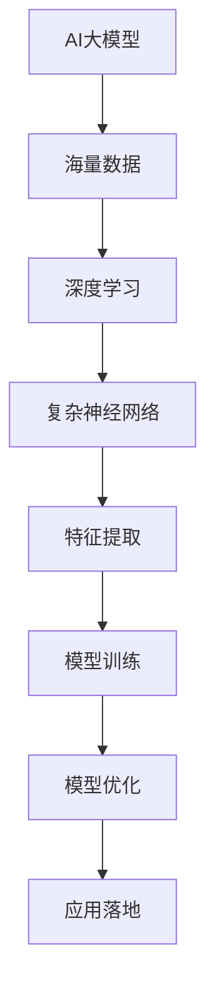

                 

关键词：人工智能，大模型，创业，市场挑战，技术战略，商业模式

>摘要：本文探讨了AI大模型创业所面临的未来市场挑战，分析了技术发展的趋势、商业模式创新的必要性以及应对策略，旨在为创业者提供有价值的指导和建议。

## 1. 背景介绍

在过去的几年中，人工智能（AI）技术取得了令人瞩目的进步，尤其是大模型（Large-scale Models）的发展，为各行各业带来了革命性的变革。从自然语言处理（NLP）到计算机视觉（CV），从语音识别到机器翻译，大模型已经在各个领域展现出了强大的能力。这也激发了众多创业者投身于AI大模型创业的浪潮。

然而，随着市场的日益成熟，AI大模型创业也面临着前所未有的挑战。如何应对技术的不确定性、市场竞争的激烈程度、商业模式的创新，以及如何在AI大模型领域获得持续竞争优势，成为每个创业者都必须面对的问题。

本文将从以下几个方面进行探讨：

- AI大模型的发展现状与趋势
- 创业者面临的未来市场挑战
- 应对市场挑战的策略与建议
- 未来AI大模型创业的发展方向

希望通过本文的探讨，能够为AI大模型创业者提供一些有益的思考和实践指导。

## 2. 核心概念与联系

### 2.1 AI大模型的概念

AI大模型，是指使用海量数据训练的复杂神经网络模型，其参数规模通常在亿级以上。这些模型通过深度学习技术，能够实现从数据中自动学习特征，进行分类、预测、生成等任务。大模型在处理大规模数据和高维度特征方面具有显著优势，成为AI研究与应用的重要方向。

### 2.2 AI大模型的架构

AI大模型的架构通常包括以下几个关键部分：

- **输入层**：接收外部输入数据，如文本、图像、音频等。
- **隐藏层**：用于处理和转换输入数据，通过多层网络结构进行特征提取和抽象。
- **输出层**：根据模型类型，产生分类、预测、生成等输出结果。


### 2.3 大模型与深度学习的联系

深度学习是AI大模型的核心技术，通过多层神经网络结构，实现从数据中自动学习特征。大模型的训练需要海量数据和强大的计算能力，深度学习提供了有效的算法框架和优化方法，使得大模型的训练成为可能。

### 2.4 大模型的应用领域

AI大模型在多个领域取得了显著的成果，包括：

- **自然语言处理（NLP）**：例如文本分类、情感分析、机器翻译等。
- **计算机视觉（CV）**：例如图像分类、目标检测、图像生成等。
- **语音识别**：例如语音到文本转换、语音合成等。
- **推荐系统**：例如基于内容的推荐、协同过滤等。

### 2.5 大模型与未来技术发展趋势

随着数据规模和计算能力的不断提升，AI大模型将越来越成为技术发展的核心。未来的发展趋势包括：

- **模型规模进一步扩大**：更大规模的模型将能处理更复杂的问题。
- **计算效率的提升**：通过模型压缩、分布式训练等方法，提高大模型的计算效率。
- **跨模态学习**：将不同类型的数据（如文本、图像、语音等）进行联合学习，实现更丰富的信息处理能力。
- **强化学习与大模型的结合**：通过强化学习算法，实现大模型在动态环境中的自主学习和优化。

### 2.6 Mermaid流程图



以上Mermaid流程图展示了AI大模型的核心概念和主要流程，包括从海量数据输入到模型训练、优化的过程。

## 3. 核心算法原理 & 具体操作步骤

### 3.1 算法原理概述

AI大模型的算法原理主要基于深度学习技术，通过多层神经网络结构，实现从数据中自动学习特征。其核心包括以下几个方面：

- **前向传播（Forward Propagation）**：输入数据通过网络向前传递，经过各层神经元的非线性变换，最终得到输出。
- **反向传播（Backpropagation）**：通过计算输出误差，反向传播误差到各层神经元，更新网络权重，实现模型优化。
- **激活函数（Activation Function）**：用于引入非线性特性，常见的有ReLU、Sigmoid、Tanh等。
- **优化算法（Optimization Algorithm）**：如SGD、Adam等，用于加速模型训练过程。

### 3.2 算法步骤详解

1. **数据预处理**：
   - **数据清洗**：去除噪声和异常值。
   - **数据归一化**：将数据缩放到相同范围，如[0, 1]或[-1, 1]。
   - **数据增强**：通过旋转、缩放、裁剪等方法增加数据多样性。

2. **构建神经网络模型**：
   - **确定网络结构**：包括层数、每层神经元数量、激活函数等。
   - **初始化参数**：随机初始化网络权重和偏置。

3. **模型训练**：
   - **前向传播**：输入数据通过网络传递，计算输出和损失函数。
   - **反向传播**：计算梯度，更新网络参数。
   - **迭代优化**：重复前向传播和反向传播，直到达到预定的训练次数或损失函数收敛。

4. **模型评估**：
   - **验证集评估**：在验证集上计算模型性能，如准确率、召回率等。
   - **测试集评估**：在测试集上评估模型泛化能力。

5. **模型部署**：
   - **模型压缩**：通过量化、剪枝等方法减小模型体积，提高部署效率。
   - **模型推理**：使用训练好的模型进行实际任务处理，如预测、生成等。

### 3.3 算法优缺点

**优点**：
- **强大的表示能力**：通过多层神经网络结构，大模型能够自动学习复杂的数据特征。
- **自动特征提取**：无需人工设计特征，减少人工干预。
- **泛化能力强**：通过海量数据训练，大模型具有良好的泛化能力。

**缺点**：
- **计算资源需求大**：大模型训练需要大量的计算资源和时间。
- **训练数据依赖性强**：模型性能依赖于训练数据的质量和多样性。
- **过拟合风险**：大模型容易受到训练数据的干扰，产生过拟合现象。

### 3.4 算法应用领域

- **自然语言处理（NLP）**：例如文本分类、情感分析、机器翻译等。
- **计算机视觉（CV）**：例如图像分类、目标检测、图像生成等。
- **语音识别**：例如语音到文本转换、语音合成等。
- **推荐系统**：例如基于内容的推荐、协同过滤等。

## 4. 数学模型和公式 & 详细讲解 & 举例说明

### 4.1 数学模型构建

AI大模型的数学模型主要基于深度学习技术，包括以下几个关键部分：

1. **神经网络模型**：
   - **输入层**：表示输入数据，如文本、图像、音频等。
   - **隐藏层**：用于处理和转换输入数据，通过多层网络结构进行特征提取和抽象。
   - **输出层**：根据模型类型，产生分类、预测、生成等输出结果。

2. **损失函数**：
   - **均方误差（MSE）**：用于回归任务，计算预测值与真实值之间的误差平方和。
   - **交叉熵（Cross-Entropy）**：用于分类任务，计算预测概率与真实标签之间的交叉熵。

3. **优化算法**：
   - **随机梯度下降（SGD）**：通过计算梯度，更新网络参数，实现模型优化。
   - **Adam优化器**：结合SGD和Momentum的方法，提高模型训练效率。

### 4.2 公式推导过程

以多层感知机（MLP）为例，推导其前向传播和反向传播的过程：

1. **前向传播**：

输入层到隐藏层的输入和输出：
\[ z^{(l)} = \sigma(W^{(l)} \cdot a^{(l-1)} + b^{(l)}) \]
\[ a^{(l)} = \sigma(z^{(l)}) \]

其中，\( a^{(l)} \) 表示第 \( l \) 层的输入，\( z^{(l)} \) 表示第 \( l \) 层的输入，\( W^{(l)} \) 和 \( b^{(l)} \) 分别表示第 \( l \) 层的权重和偏置，\( \sigma \) 表示激活函数，通常采用ReLU函数。

隐藏层到输出层的输入和输出：
\[ z^{(L)} = W^{(L)} \cdot a^{(L-1)} + b^{(L)} \]
\[ \hat{y} = \sigma(z^{(L)}) \]

其中，\( \hat{y} \) 表示预测值，\( L \) 表示层数。

2. **反向传播**：

计算输出层的误差：
\[ \delta^{(L)} = (\hat{y} - y) \cdot \sigma'(z^{(L)}) \]

计算隐藏层的误差：
\[ \delta^{(l)} = (W^{(l+1)} \cdot \delta^{(l+1)}) \cdot \sigma'(z^{(l)}) \]

更新权重和偏置：
\[ W^{(l)} \rightarrow W^{(l)} - \alpha \cdot \frac{1}{m} \cdot a^{(l-1)} \cdot \delta^{(l)} \]
\[ b^{(l)} \rightarrow b^{(l)} - \alpha \cdot \frac{1}{m} \cdot \delta^{(l)} \]

其中，\( \alpha \) 表示学习率，\( m \) 表示样本数量。

### 4.3 案例分析与讲解

以下是一个简单的例子，说明如何使用多层感知机（MLP）进行二分类任务。

假设我们有一个输入向量 \( x = [x_1, x_2, x_3] \)，需要将其分类为正类（1）或负类（0）。我们定义一个简单的MLP模型，包括一个输入层、一个隐藏层和一个输出层。

1. **模型构建**：

输入层到隐藏层的权重 \( W^{(1)} = \begin{bmatrix} w_{11} & w_{12} & w_{13} \\ w_{21} & w_{22} & w_{23} \end{bmatrix} \)，偏置 \( b^{(1)} = \begin{bmatrix} b_1 & b_2 \end{bmatrix} \)。

隐藏层到输出层的权重 \( W^{(2)} = \begin{bmatrix} w_{11} & w_{12} \end{bmatrix} \)，偏置 \( b^{(2)} = \begin{bmatrix} b_1 \end{bmatrix} \)。

2. **前向传播**：

输入 \( x = [x_1, x_2, x_3] \)。

计算隐藏层输入和输出：
\[ z^{(1)} = \sigma(W^{(1)} \cdot x + b^{(1)}) \]
\[ a^{(1)} = \sigma(z^{(1)}) \]

计算输出层输入和输出：
\[ z^{(2)} = W^{(2)} \cdot a^{(1)} + b^{(2)} \]
\[ \hat{y} = \sigma(z^{(2)}) \]

3. **反向传播**：

计算输出层误差：
\[ \delta^{(2)} = (\hat{y} - y) \cdot \sigma'(z^{(2)}) \]

计算隐藏层误差：
\[ \delta^{(1)} = (W^{(2)} \cdot \delta^{(2)}) \cdot \sigma'(z^{(1)}) \]

4. **权重更新**：

更新输入层到隐藏层的权重：
\[ W^{(1)} \rightarrow W^{(1)} - \alpha \cdot \frac{1}{m} \cdot x \cdot \delta^{(1)} \]

更新隐藏层到输出层的权重：
\[ W^{(2)} \rightarrow W^{(2)} - \alpha \cdot \frac{1}{m} \cdot a^{(1)} \cdot \delta^{(2)} \]

通过以上步骤，我们可以使用多层感知机（MLP）进行二分类任务。在实际应用中，我们可以通过调整网络结构、优化算法和超参数，提高模型的性能。

## 5. 项目实践：代码实例和详细解释说明

### 5.1 开发环境搭建

为了实现AI大模型的项目实践，我们需要搭建一个合适的开发环境。以下是一个基于Python和TensorFlow的简单开发环境搭建步骤：

1. **安装Python**：
   - 访问Python官网下载最新版本的Python安装包。
   - 运行安装程序，按照提示完成安装。

2. **安装TensorFlow**：
   - 打开终端或命令行工具。
   - 输入以下命令安装TensorFlow：
     ```python
     pip install tensorflow
     ```

3. **安装其他依赖库**：
   - 根据项目需求，安装其他依赖库，如NumPy、Pandas等。

### 5.2 源代码详细实现

以下是一个简单的AI大模型项目示例，使用TensorFlow实现一个基于多层感知机（MLP）的二分类模型。

```python
import tensorflow as tf
import numpy as np

# 设置随机种子，保证结果可重复
tf.random.set_seed(42)

# 定义参数
input_shape = (3,)
hidden_units = 10
output_shape = 1
learning_rate = 0.001
epochs = 100

# 创建模拟数据集
X = np.random.rand(100, 3)
y = np.array([0 if sum(x) < 0.5 else 1 for x in X])

# 创建输入层
inputs = tf.keras.Input(shape=input_shape)

# 创建隐藏层
x = tf.keras.layers.Dense(units=hidden_units, activation='relu')(inputs)

# 创建输出层
outputs = tf.keras.layers.Dense(units=output_shape, activation='sigmoid')(x)

# 创建模型
model = tf.keras.Model(inputs=inputs, outputs=outputs)

# 编译模型
model.compile(optimizer=tf.keras.optimizers.Adam(learning_rate=learning_rate),
              loss='binary_crossentropy',
              metrics=['accuracy'])

# 训练模型
model.fit(X, y, epochs=epochs, batch_size=10)

# 评估模型
loss, accuracy = model.evaluate(X, y)
print(f"Test accuracy: {accuracy:.4f}")

# 预测
predictions = model.predict(X)
print(f"Predictions: {predictions}")
```

### 5.3 代码解读与分析

1. **导入库和设置随机种子**：

首先，我们导入TensorFlow和NumPy库，并设置随机种子，以保证结果的可重复性。

2. **定义参数**：

接下来，我们定义模型的参数，包括输入层形状、隐藏层单元数、输出层形状、学习率以及训练轮数。

3. **创建模拟数据集**：

我们创建一个简单的模拟数据集，用于模型训练和评估。数据集包含100个样本，每个样本由3个随机生成的特征组成，标签为0或1。

4. **创建输入层**：

使用TensorFlow的`Input`函数创建输入层，形状为（3,），表示每个样本有3个特征。

5. **创建隐藏层**：

使用`Dense`函数创建一个隐藏层，单元数为10，激活函数为ReLU。

6. **创建输出层**：

使用`Dense`函数创建一个输出层，单元数为1，激活函数为sigmoid。

7. **创建模型**：

使用`Model`函数创建一个模型，输入为输入层，输出为输出层。

8. **编译模型**：

使用`compile`函数编译模型，指定优化器、损失函数和评价指标。

9. **训练模型**：

使用`fit`函数训练模型，指定训练数据、训练轮数和批大小。

10. **评估模型**：

使用`evaluate`函数评估模型在测试数据上的性能，输出损失和准确率。

11. **预测**：

使用`predict`函数对测试数据进行预测，输出预测结果。

通过以上步骤，我们可以实现一个简单的AI大模型项目。在实际应用中，我们可以根据具体需求调整模型结构、训练参数和超参数，以提高模型性能。

## 6. 实际应用场景

### 6.1 自然语言处理（NLP）

在自然语言处理领域，AI大模型已经展现出强大的能力。例如，GPT-3等语言模型在文本生成、问答系统、机器翻译等方面取得了显著的成果。创业者可以利用这些大模型，开发出智能客服、内容生成、智能写作等应用。

### 6.2 计算机视觉（CV）

计算机视觉是AI大模型的重要应用领域。例如，自动驾驶、人脸识别、图像生成等应用都依赖于大模型的强大能力。创业者可以结合大模型，开发出智能安防、医疗诊断、艺术创作等创新产品。

### 6.3 语音识别

语音识别是AI大模型在语音处理领域的应用。例如，智能助手、语音翻译、语音控制等应用都离不开大模型的支持。创业者可以开发出更智能的语音识别产品，如智能家居、车载语音系统等。

### 6.4 推荐系统

推荐系统是AI大模型在数据挖掘领域的应用。例如，电商平台、社交媒体等应用都利用大模型实现个性化推荐。创业者可以结合大模型，开发出更精准的推荐系统，提高用户体验和商业价值。

### 6.5 未来应用展望

随着AI大模型的不断发展，未来将有更多领域受益于这一技术。以下是一些潜在的应用方向：

- **智能健康**：利用大模型进行疾病预测、个性化诊疗等。
- **智能金融**：利用大模型进行风险评估、欺诈检测等。
- **智能教育**：利用大模型进行个性化教学、智能评测等。
- **智能城市**：利用大模型进行城市交通管理、环境监测等。

创业者应密切关注这些领域的发展，寻找创新应用场景，推动AI大模型技术的商业化。

## 7. 工具和资源推荐

### 7.1 学习资源推荐

1. **《深度学习》（Goodfellow et al.）**：
   - 这是一本经典的深度学习教材，涵盖了深度学习的理论基础、算法实现和应用案例。

2. **《动手学深度学习》（Dean et al.）**：
   - 这本书以Python为工具，通过大量实践案例，引导读者深入理解深度学习技术。

3. **在线课程**：
   - Coursera、Udacity、edX等在线教育平台提供了丰富的深度学习课程，适合不同水平的学员。

### 7.2 开发工具推荐

1. **TensorFlow**：
   - TensorFlow是谷歌开发的开源深度学习框架，广泛应用于AI大模型的开发。

2. **PyTorch**：
   - PyTorch是另一个流行的深度学习框架，以其灵活性和动态图特性受到开发者喜爱。

3. **Keras**：
   - Keras是一个高层神经网络API，可以方便地构建和训练深度学习模型，基于TensorFlow和Theano。

### 7.3 相关论文推荐

1. **“Deep Learning” by Ian Goodfellow, Yoshua Bengio, and Aaron Courville**：
   - 这本书详细介绍了深度学习的各种算法和技术。

2. **“The Annotated TensorFlow”**：
   - 这本书对TensorFlow框架进行了详细解读，适合初学者和进阶开发者。

3. **“Neural Networks and Deep Learning”**：
   - 这本书是神经网络和深度学习领域的经典论文集，涵盖了大量重要的研究成果。

通过学习和使用这些工具和资源，创业者可以更好地掌握AI大模型技术，为创业项目提供强大的技术支持。

## 8. 总结：未来发展趋势与挑战

### 8.1 研究成果总结

在过去几年中，AI大模型技术取得了显著的研究成果。从GPT-3、BERT等大规模语言模型，到ImageNet、COCO等大规模视觉数据集，AI大模型在各个领域展现出了强大的能力。这些成果不仅推动了AI技术的进步，也为创业提供了丰富的机会。

### 8.2 未来发展趋势

随着数据规模和计算能力的不断提升，AI大模型技术将继续发展，未来可能呈现出以下趋势：

1. **模型规模进一步扩大**：更大规模的模型将能够处理更复杂的问题，提高模型的泛化能力。
2. **计算效率的提升**：通过模型压缩、分布式训练等方法，提高大模型的计算效率，降低部署成本。
3. **跨模态学习**：将不同类型的数据进行联合学习，实现更丰富的信息处理能力。
4. **强化学习与大模型的结合**：通过强化学习算法，实现大模型在动态环境中的自主学习和优化。

### 8.3 面临的挑战

尽管AI大模型技术取得了显著成果，但创业者仍需面对一系列挑战：

1. **数据依赖性**：大模型的性能高度依赖于训练数据的质量和多样性，创业者需要确保数据来源可靠，并持续优化数据集。
2. **计算资源需求**：大模型的训练需要大量的计算资源和时间，创业者需寻找合适的计算平台和优化方法，以降低成本。
3. **模型解释性**：大模型的黑箱特性使得其解释性较差，创业者需研究如何提高模型的透明度和可解释性，增强用户信任。
4. **公平性和伦理问题**：随着AI大模型的应用日益广泛，公平性和伦理问题愈发重要，创业者需关注并遵循相关法律法规，确保技术应用合规。

### 8.4 研究展望

未来，AI大模型技术将继续在多个领域取得突破，为人类社会带来更多便利。创业者应密切关注技术发展趋势，积极探索创新应用场景，推动AI大模型技术的商业化。同时，研究者也应致力于解决现有挑战，提高大模型的性能和可解释性，为AI技术的可持续发展贡献力量。

## 9. 附录：常见问题与解答

### 9.1 问题1：AI大模型如何处理大规模数据？

解答：AI大模型处理大规模数据的关键在于数据预处理和分布式训练。在数据预处理阶段，通过数据清洗、归一化和增强等方法，提高数据的质量和多样性。在分布式训练阶段，将数据分成多个部分，分布在多个计算节点上进行并行训练，以提高训练速度和效率。

### 9.2 问题2：大模型的计算资源需求如何降低？

解答：降低大模型的计算资源需求可以通过以下方法实现：
1. **模型压缩**：通过量化、剪枝等方法减小模型体积，降低存储和计算需求。
2. **模型蒸馏**：将大模型的知识传递给小模型，使小模型能够复现大模型的主要性能，同时降低计算资源需求。
3. **分布式训练**：将训练任务分布在多个计算节点上进行并行训练，提高训练效率。

### 9.3 问题3：如何提高AI大模型的可解释性？

解答：提高AI大模型的可解释性可以从以下几个方面入手：
1. **可视化技术**：通过可视化模型的结构和权重，帮助用户理解模型的内部工作机制。
2. **解释性算法**：采用可解释性较强的算法，如决策树、规则提取等，使模型更容易解释。
3. **模型分析**：对模型的训练过程和决策过程进行详细分析，揭示模型的行为和决策依据。

### 9.4 问题4：AI大模型在哪些领域有广泛的应用？

解答：AI大模型在多个领域有广泛的应用，包括自然语言处理、计算机视觉、语音识别、推荐系统等。此外，随着技术的不断发展，AI大模型的应用领域也在不断扩展，如智能健康、智能金融、智能教育等。

### 9.5 问题5：AI大模型创业需要注意哪些问题？

解答：AI大模型创业需要注意以下问题：
1. **数据质量**：确保训练数据的质量和多样性，以提高模型的性能和泛化能力。
2. **计算资源**：合理规划计算资源，确保模型训练和部署的顺利进行。
3. **商业价值**：明确模型的应用场景和商业价值，确保项目的可持续发展。
4. **法律法规**：遵循相关法律法规，确保技术应用合规。
5. **团队建设**：构建一支具备技术实力和商业敏锐度的团队，共同推动项目发展。

通过以上解答，希望能够帮助创业者更好地理解AI大模型技术，为其创业之路提供一些有益的参考。作者：禅与计算机程序设计艺术 / Zen and the Art of Computer Programming。

