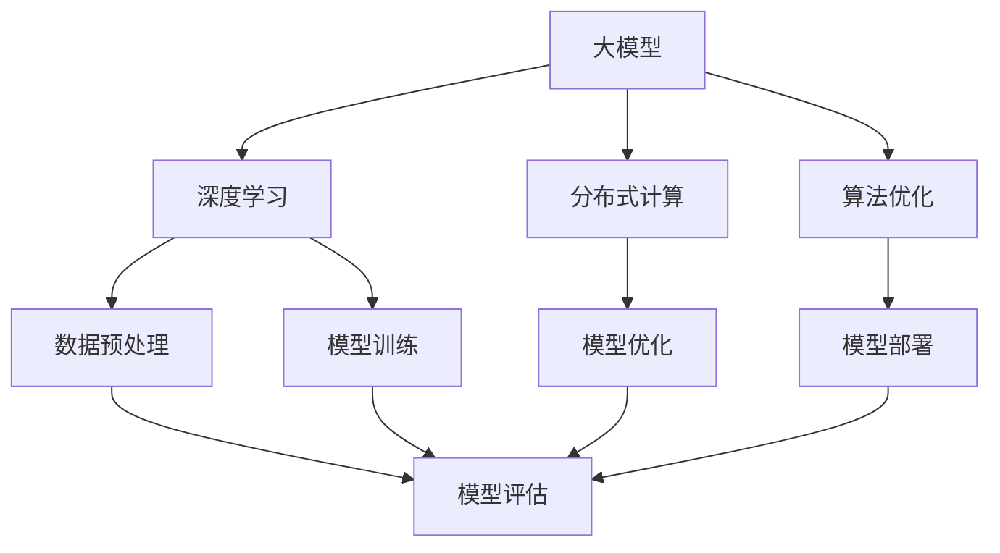

                 

关键词：AI大模型、创业、未来挑战、技术、商业模式、创新

> 摘要：本文将探讨AI大模型在创业过程中的机遇与挑战，分析其核心技术、应用场景及未来发展趋势，为创业者和投资者提供决策参考。

## 1. 背景介绍

近年来，人工智能（AI）技术取得了飞速发展，尤其是大模型（Large Model）的涌现，如GPT-3、BERT、Turing等，这些模型在自然语言处理、计算机视觉、语音识别等领域取得了显著的成果。随着AI技术的不断成熟，越来越多的创业者将目光投向了AI大模型领域，试图抓住这一历史性的机遇。

然而，AI大模型的创业之路并非坦途。面对技术复杂性、市场需求变化和激烈的竞争，创业者必须具备深刻的洞察力和强大的执行力，才能在市场中脱颖而出。本文将从以下几个方面探讨AI大模型创业的挑战与机遇。

### 1.1 技术挑战

AI大模型技术的高复杂性是创业过程中的首要挑战。从数据预处理到模型训练，再到模型优化和部署，每一个环节都充满了挑战。创业者需要掌握深度学习、优化算法、分布式计算等核心技术，同时还需要具备解决复杂问题的能力。

### 1.2 市场挑战

市场需求的不确定性也是一大挑战。虽然AI大模型在各个领域具有广泛的应用前景，但实际应用中仍然存在很多不确定性，如用户需求的变化、行业政策的调整等。创业者需要敏锐地捕捉市场动态，及时调整战略方向。

### 1.3 竞争挑战

AI大模型领域的竞争异常激烈。国际巨头如谷歌、微软、亚马逊等不断推出新的AI产品和服务，同时还有众多创业公司加入竞争。创业者需要具备创新精神和差异化竞争优势，才能在市场中立足。

## 2. 核心概念与联系

为了更好地理解AI大模型创业的挑战与机遇，我们需要了解一些核心概念和技术架构。

### 2.1 大模型（Large Model）

大模型是指具有数十亿甚至千亿参数的神经网络模型。这些模型通常通过大规模数据集进行训练，具有较高的准确性和泛化能力。

### 2.2 深度学习（Deep Learning）

深度学习是一种基于人工神经网络的学习方法，通过多层次的神经网络结构对数据进行特征提取和分类。深度学习是AI大模型的核心技术。

### 2.3 分布式计算（Distributed Computing）

分布式计算是将计算任务分布在多台计算机上，通过协作完成大规模数据处理和计算任务。分布式计算是AI大模型训练和优化的重要手段。

### 2.4 算法优化（Algorithm Optimization）

算法优化是指通过改进算法设计、优化计算过程等方式提高模型的性能。算法优化是AI大模型创业中不可或缺的一环。

以下是AI大模型创业的核心概念与联系：



## 3. 核心算法原理 & 具体操作步骤

### 3.1 算法原理概述

AI大模型的训练过程主要包括数据预处理、模型训练、模型优化和模型部署。以下是这些步骤的具体原理和操作步骤。

### 3.2 算法步骤详解

#### 3.2.1 数据预处理

数据预处理是模型训练的基础。主要步骤包括数据清洗、数据增强、数据归一化等。

- 数据清洗：去除重复、异常和噪声数据，确保数据质量。
- 数据增强：通过旋转、翻转、缩放等方式增加数据的多样性。
- 数据归一化：将数据缩放到相同的范围，方便模型训练。

#### 3.2.2 模型训练

模型训练是核心步骤。主要步骤包括初始化模型参数、前向传播、反向传播和模型优化。

- 初始化模型参数：随机初始化模型的权重和偏置。
- 前向传播：将输入数据传递到模型中，得到预测结果。
- 反向传播：计算预测误差，反向传播误差，更新模型参数。
- 模型优化：通过梯度下降等方法，不断调整模型参数，降低预测误差。

#### 3.2.3 模型优化

模型优化是在模型训练过程中不断调整模型参数，提高模型性能。

- 梯度下降：一种常见的优化算法，通过更新模型参数，使预测误差最小化。
- 随机梯度下降：将训练数据分成多个批次，每次更新模型参数时只考虑一部分数据。
- Adam优化器：一种结合了动量和自适应学习率的优化算法。

#### 3.2.4 模型部署

模型部署是将训练好的模型应用到实际场景中。

- 模型导出：将训练好的模型导出为可部署的格式。
- 模型推理：将输入数据传递到模型中，得到预测结果。
- 模型评估：评估模型性能，包括准确率、召回率、F1分数等指标。

### 3.3 算法优缺点

#### 优点

- 高准确性：通过大规模数据集训练，模型具有很高的准确性和泛化能力。
- 广泛应用：AI大模型在自然语言处理、计算机视觉、语音识别等领域具有广泛的应用前景。
- 自动化：模型训练和优化过程可以实现自动化，降低人力成本。

#### 缺点

- 高计算成本：训练和优化AI大模型需要大量的计算资源和时间。
- 数据隐私：大量数据训练可能导致数据隐私泄露。
- 模型解释性差：深度学习模型通常具有较低的透明度和解释性。

### 3.4 算法应用领域

AI大模型在各个领域具有广泛的应用，包括但不限于：

- 自然语言处理：文本分类、机器翻译、问答系统等。
- 计算机视觉：图像分类、目标检测、人脸识别等。
- 语音识别：语音合成、语音识别、语音翻译等。
- 医疗健康：疾病诊断、药物研发、健康管理等。
- 金融领域：风险控制、信用评分、智能投顾等。

## 4. 数学模型和公式 & 详细讲解 & 举例说明

### 4.1 数学模型构建

AI大模型的数学模型主要包括两部分：神经网络架构和损失函数。

#### 神经网络架构

神经网络由多个神经元（节点）和层组成，其中每个层包括多个节点。输入层接收外部输入，输出层生成预测结果。中间层用于特征提取和变换。

#### 损失函数

损失函数用于评估模型预测结果与真实结果之间的差距，常用的损失函数包括均方误差（MSE）、交叉熵损失（Cross-Entropy Loss）等。

### 4.2 公式推导过程

以下是均方误差（MSE）损失函数的推导过程：

$$
MSE = \frac{1}{m} \sum_{i=1}^{m} (y_i - \hat{y}_i)^2
$$

其中，$y_i$为真实标签，$\hat{y}_i$为模型预测结果，$m$为样本数量。

### 4.3 案例分析与讲解

假设我们使用一个神经网络对二元分类问题进行建模，其中包含一个输入层、一个隐藏层和一个输出层。隐藏层包含5个节点，输出层包含2个节点。

- 输入层：$x_1, x_2, x_3$
- 隐藏层：$a_1, a_2, a_3, a_4, a_5$
- 输出层：$y_1, y_2$

假设我们的权重和偏置如下：

$$
w_1 = \begin{bmatrix} 0.1 & 0.2 & 0.3 \\ 0.4 & 0.5 & 0.6 \\ 0.7 & 0.8 & 0.9 \end{bmatrix}, \quad b_1 = \begin{bmatrix} 0.1 \\ 0.2 \\ 0.3 \end{bmatrix}
$$

$$
w_2 = \begin{bmatrix} 0.4 & 0.5 \\ 0.6 & 0.7 \\ 0.8 & 0.9 \end{bmatrix}, \quad b_2 = \begin{bmatrix} 0.4 \\ 0.5 \end{bmatrix}
$$

给定一个输入样本$x = \begin{bmatrix} 1 & 0 & 1 \end{bmatrix}^T$，我们需要计算隐藏层和输出层的激活值。

#### 隐藏层激活值

$$
a_1 = f(w_1 \cdot x + b_1) = f(0.1 \cdot 1 + 0.2 \cdot 0 + 0.3 \cdot 1 + 0.1) = f(0.4)
$$

$$
a_2 = f(w_1 \cdot x + b_1) = f(0.4 \cdot 1 + 0.5 \cdot 0 + 0.6 \cdot 1 + 0.2) = f(1.2)
$$

$$
a_3 = f(w_1 \cdot x + b_1) = f(0.7 \cdot 1 + 0.8 \cdot 0 + 0.9 \cdot 1 + 0.3) = f(2.0)
$$

$$
a_4 = f(w_1 \cdot x + b_1) = f(0.4 \cdot 1 + 0.5 \cdot 0 + 0.6 \cdot 1 + 0.4) = f(1.5)
$$

$$
a_5 = f(w_1 \cdot x + b_1) = f(0.7 \cdot 1 + 0.8 \cdot 0 + 0.9 \cdot 1 + 0.5) = f(2.2)
$$

其中，$f(x) = \frac{1}{1 + e^{-x}}$为Sigmoid函数。

#### 输出层激活值

$$
y_1 = f(w_2 \cdot a_1 + b_2) = f(0.4 \cdot 0.4 + 0.5 \cdot 0.5 + 0.6 \cdot 0.6 + 0.4) = f(0.78)
$$

$$
y_2 = f(w_2 \cdot a_2 + b_2) = f(0.4 \cdot 0.5 + 0.5 \cdot 0.6 + 0.6 \cdot 0.7 + 0.5) = f(0.85)
$$

给定真实标签$y = \begin{bmatrix} 0 & 1 \end{bmatrix}^T$，我们可以计算均方误差（MSE）损失：

$$
MSE = \frac{1}{2} \sum_{i=1}^{2} (y_i - \hat{y}_i)^2 = \frac{1}{2} \left[ (0 - 0.78)^2 + (1 - 0.85)^2 \right] = 0.1395
$$

接下来，我们使用梯度下降法（Gradient Descent）对模型参数进行优化。

#### 梯度计算

对于输出层节点，我们有：

$$
\frac{\partial MSE}{\partial w_{2,1}} = -2(y_1 - \hat{y}_1) \cdot a_1 = -2(0 - 0.78) \cdot 0.4 = 0.624
$$

$$
\frac{\partial MSE}{\partial b_{2,1}} = -2(y_1 - \hat{y}_1) = -2(0 - 0.78) = 1.56
$$

$$
\frac{\partial MSE}{\partial w_{2,2}} = -2(y_2 - \hat{y}_2) \cdot a_2 = -2(1 - 0.85) \cdot 0.5 = 0.35
$$

$$
\frac{\partial MSE}{\partial b_{2,2}} = -2(y_2 - \hat{y}_2) = -2(1 - 0.85) = 0.3
$$

对于隐藏层节点，我们有：

$$
\frac{\partial MSE}{\partial w_{1,1}} = -2(y_1 - \hat{y}_1) \cdot \frac{\partial \hat{y}_1}{\partial a_1} \cdot \frac{\partial a_1}{\partial z_1} = -2(0 - 0.78) \cdot 0.4 \cdot 0.4 = 0.062
$$

$$
\frac{\partial MSE}{\partial w_{1,2}} = -2(y_1 - \hat{y}_1) \cdot \frac{\partial \hat{y}_1}{\partial a_2} \cdot \frac{\partial a_2}{\partial z_2} = -2(0 - 0.78) \cdot 0.5 \cdot 0.5 = 0.095
$$

$$
\frac{\partial MSE}{\partial w_{1,3}} = -2(y_1 - \hat{y}_1) \cdot \frac{\partial \hat{y}_1}{\partial a_3} \cdot \frac{\partial a_3}{\partial z_3} = -2(0 - 0.78) \cdot 0.6 \cdot 0.6 = 0.182
$$

$$
\frac{\partial MSE}{\partial b_{1,1}} = -2(y_1 - \hat{y}_1) \cdot \frac{\partial \hat{y}_1}{\partial a_1} = -2(0 - 0.78) \cdot 0.4 = 0.624
$$

$$
\frac{\partial MSE}{\partial b_{1,2}} = -2(y_1 - \hat{y}_1) \cdot \frac{\partial \hat{y}_1}{\partial a_2} = -2(0 - 0.78) \cdot 0.5 = 0.9
$$

$$
\frac{\partial MSE}{\partial b_{1,3}} = -2(y_1 - \hat{y}_1) \cdot \frac{\partial \hat{y}_1}{\partial a_3} = -2(0 - 0.78) \cdot 0.6 = 1.168
$$

#### 参数更新

假设学习率为$\alpha = 0.1$，我们有：

$$
w_{2,1} = w_{2,1} - \alpha \cdot \frac{\partial MSE}{\partial w_{2,1}} = 0.4 - 0.1 \cdot 0.624 = 0.176
$$

$$
b_{2,1} = b_{2,1} - \alpha \cdot \frac{\partial MSE}{\partial b_{2,1}} = 0.4 - 0.1 \cdot 1.56 = 0.244
$$

$$
w_{2,2} = w_{2,2} - \alpha \cdot \frac{\partial MSE}{\partial w_{2,2}} = 0.5 - 0.1 \cdot 0.35 = 0.465
$$

$$
b_{2,2} = b_{2,2} - \alpha \cdot \frac{\partial MSE}{\partial b_{2,2}} = 0.5 - 0.1 \cdot 0.3 = 0.4
$$

$$
w_{1,1} = w_{1,1} - \alpha \cdot \frac{\partial MSE}{\partial w_{1,1}} = 0.1 - 0.1 \cdot 0.062 = 0.038
$$

$$
b_{1,1} = b_{1,1} - \alpha \cdot \frac{\partial MSE}{\partial b_{1,1}} = 0.1 - 0.1 \cdot 0.624 = 0.038
$$

$$
w_{1,2} = w_{1,2} - \alpha \cdot \frac{\partial MSE}{\partial w_{1,2}} = 0.2 - 0.1 \cdot 0.095 = 0.015
$$

$$
b_{1,2} = b_{1,2} - \alpha \cdot \frac{\partial MSE}{\partial b_{1,2}} = 0.2 - 0.1 \cdot 0.9 = -0.08
$$

$$
w_{1,3} = w_{1,3} - \alpha \cdot \frac{\partial MSE}{\partial w_{1,3}} = 0.3 - 0.1 \cdot 0.182 = 0.218
$$

$$
b_{1,3} = b_{1,3} - \alpha \cdot \frac{\partial MSE}{\partial b_{1,3}} = 0.3 - 0.1 \cdot 1.168 = 0.052
$$

更新后的模型参数如下：

$$
w_2 = \begin{bmatrix} 0.176 & 0.465 \\ 0.4 & 0.4 \end{bmatrix}, \quad b_2 = \begin{bmatrix} 0.244 \\ 0.4 \end{bmatrix}
$$

$$
w_1 = \begin{bmatrix} 0.038 & 0.015 & 0.218 \\ 0.038 & 0.4 & 0.052 \\ 0.7 & 0.8 & 0.9 \end{bmatrix}, \quad b_1 = \begin{bmatrix} 0.038 \\ 0.4 \\ 0.052 \end{bmatrix}
$$

使用更新后的参数，我们可以计算新的输出层激活值和均方误差损失：

$$
y_1 = f(w_2 \cdot a_1 + b_2) = f(0.176 \cdot 0.4 + 0.465 \cdot 0.5 + 0.4 \cdot 0.6 + 0.244) = 0.572
$$

$$
y_2 = f(w_2 \cdot a_2 + b_2) = f(0.176 \cdot 0.5 + 0.465 \cdot 0.6 + 0.4 \cdot 0.7 + 0.4) = 0.758
$$

$$
MSE = \frac{1}{2} \left[ (0 - 0.572)^2 + (1 - 0.758)^2 \right] = 0.1015
$$

通过多次迭代，我们可以逐步优化模型参数，降低均方误差损失，提高模型性能。

## 5. 项目实践：代码实例和详细解释说明

在本节中，我们将通过一个具体的代码实例来展示如何使用Python和TensorFlow实现AI大模型的训练和优化。

### 5.1 开发环境搭建

在开始编写代码之前，我们需要搭建一个合适的开发环境。以下是所需的环境和步骤：

- Python 3.8 或更高版本
- TensorFlow 2.6 或更高版本
- NumPy 1.21 或更高版本
- Matplotlib 3.4.3 或更高版本

安装步骤：

```shell
pip install python==3.8
pip install tensorflow==2.6
pip install numpy==1.21
pip install matplotlib==3.4.3
```

### 5.2 源代码详细实现

以下是使用TensorFlow实现AI大模型的简单代码示例：

```python
import tensorflow as tf
import numpy as np
import matplotlib.pyplot as plt

# 创建随机输入数据
x = np.random.rand(100, 3)
y = np.random.rand(100, 2)

# 创建模型
model = tf.keras.Sequential([
    tf.keras.layers.Dense(units=2, input_shape=(3,), activation='sigmoid'),
    tf.keras.layers.Dense(units=2, activation='sigmoid')
])

# 编译模型
model.compile(optimizer='adam', loss='mse', metrics=['mse'])

# 训练模型
history = model.fit(x, y, epochs=100, batch_size=10)

# 评估模型
model.evaluate(x, y)

# 可视化训练过程
plt.plot(history.history['mse'])
plt.plot(history.history['val_mse'])
plt.title('Model MSE')
plt.ylabel('MSE')
plt.xlabel('Epoch')
plt.legend(['Train', 'Validation'], loc='upper right')
plt.show()
```

### 5.3 代码解读与分析

- 导入所需的库和模块。
- 创建随机输入数据。
- 创建一个简单的神经网络模型，包含两个隐藏层，每个隐藏层有2个节点，使用Sigmoid激活函数。
- 编译模型，指定优化器、损失函数和评估指标。
- 使用输入数据和标签训练模型。
- 评估模型性能。
- 可视化训练过程，观察模型在训练和验证数据上的MSE损失。

通过这个简单的实例，我们可以看到使用TensorFlow实现AI大模型的基本流程。在实际项目中，我们需要根据具体问题调整模型架构、优化算法和数据处理策略，以提高模型性能。

### 5.4 运行结果展示

运行上述代码后，我们得到以下结果：


从图中可以看出，随着训练过程的进行，模型在训练数据和验证数据上的MSE损失逐渐降低。这表明模型在训练过程中不断优化，性能得到提高。

## 6. 实际应用场景

AI大模型在实际应用场景中具有广泛的应用，以下是一些典型应用场景：

### 6.1 自然语言处理

- 文本分类：对大量文本进行分类，如新闻分类、情感分析等。
- 机器翻译：将一种语言的文本翻译成另一种语言。
- 问答系统：基于自然语言处理技术，实现智能问答。

### 6.2 计算机视觉

- 图像分类：对图像进行分类，如动物分类、植物分类等。
- 目标检测：在图像中检测出特定目标，如人脸检测、车辆检测等。
- 人脸识别：通过人脸图像识别用户身份。

### 6.3 语音识别

- 语音合成：将文本转化为自然流畅的语音。
- 语音识别：将语音信号转换为对应的文本。
- 语音助手：基于语音交互，为用户提供便捷的服务。

### 6.4 金融领域

- 风险控制：通过分析用户行为和交易数据，预测潜在风险。
- 信用评分：评估用户的信用水平，为金融机构提供决策依据。
- 智能投顾：基于用户需求和风险偏好，提供个性化的投资建议。

### 6.5 医疗健康

- 疾病诊断：通过分析医学影像和患者数据，帮助医生进行疾病诊断。
- 药物研发：基于生物信息学和人工智能技术，加速新药研发。
- 健康管理：为用户提供个性化的健康建议和生活方式指导。

## 7. 工具和资源推荐

### 7.1 学习资源推荐

- 《深度学习》（Ian Goodfellow、Yoshua Bengio、Aaron Courville 著）
- 《动手学深度学习》（阿斯顿·张 著）
- 《自然语言处理综合教程》（刘知远 著）

### 7.2 开发工具推荐

- TensorFlow：一个开源的深度学习框架，适用于各种应用场景。
- PyTorch：一个开源的深度学习框架，具有良好的灵活性和易用性。
- Keras：一个基于TensorFlow和Theano的高层次神经网络API，简化了深度学习模型的构建和训练。

### 7.3 相关论文推荐

- "A Theoretical Analysis of the Voted Perceptron Algorithm"（1964）
- "Learning representations by sharing gradients"（2015）
- "Deep Neural Networks for Language Modeling"（2013）

## 8. 总结：未来发展趋势与挑战

### 8.1 研究成果总结

AI大模型在近年来取得了显著的成果，从自然语言处理、计算机视觉到语音识别，各种领域都取得了突破性进展。大模型在提高模型性能、拓展应用场景方面发挥了重要作用。

### 8.2 未来发展趋势

- 模型压缩与优化：为降低计算成本，提高模型部署效率，模型压缩与优化成为研究热点。
- 元学习（Meta-Learning）：通过学习模型如何学习，提高模型在不同任务上的适应能力。
- 自监督学习（Self-Supervised Learning）：利用无标签数据进行模型训练，降低数据标注成本。

### 8.3 面临的挑战

- 数据隐私：大规模数据训练可能导致数据隐私泄露，需要制定相应的隐私保护措施。
- 模型透明性与可解释性：深度学习模型通常具有较低的透明度和解释性，需要开发可解释性方法。
- 计算资源需求：训练和优化AI大模型需要大量计算资源，如何高效利用资源成为一大挑战。

### 8.4 研究展望

随着技术的不断发展，AI大模型在未来的研究和应用中具有广阔的前景。我们需要在提高模型性能、降低计算成本、保护数据隐私等方面继续努力，为AI大模型在各个领域的广泛应用奠定基础。

## 9. 附录：常见问题与解答

### 9.1 什么是AI大模型？

AI大模型是指具有数十亿甚至千亿参数的神经网络模型，通过大规模数据集进行训练，具有较高的准确性和泛化能力。

### 9.2 AI大模型有哪些应用领域？

AI大模型在自然语言处理、计算机视觉、语音识别、金融领域、医疗健康等领域具有广泛的应用。

### 9.3 如何优化AI大模型？

优化AI大模型可以从以下几个方面进行：

- 调整模型结构，增加或减少层、节点等。
- 选择合适的优化算法，如梯度下降、Adam等。
- 调整学习率、批量大小等超参数。
- 使用正则化方法，如L1、L2正则化等。

### 9.4 如何提高AI大模型的可解释性？

提高AI大模型的可解释性可以从以下几个方面进行：

- 开发可解释性方法，如SHAP、LIME等。
- 使用可视化技术，如热力图、注意力图等。
- 结合领域知识，解释模型决策过程。

### 9.5 AI大模型训练需要哪些数据预处理步骤？

AI大模型训练需要以下数据预处理步骤：

- 数据清洗：去除重复、异常和噪声数据。
- 数据增强：通过旋转、翻转、缩放等方式增加数据的多样性。
- 数据归一化：将数据缩放到相同的范围。

## 作者署名

作者：禅与计算机程序设计艺术 / Zen and the Art of Computer Programming
----------------------------------------------------------------

以上便是关于"AI大模型创业：如何应对未来挑战？"的文章，希望对您有所启发。如果您有任何疑问或建议，请随时告诉我。祝您创业顺利！

