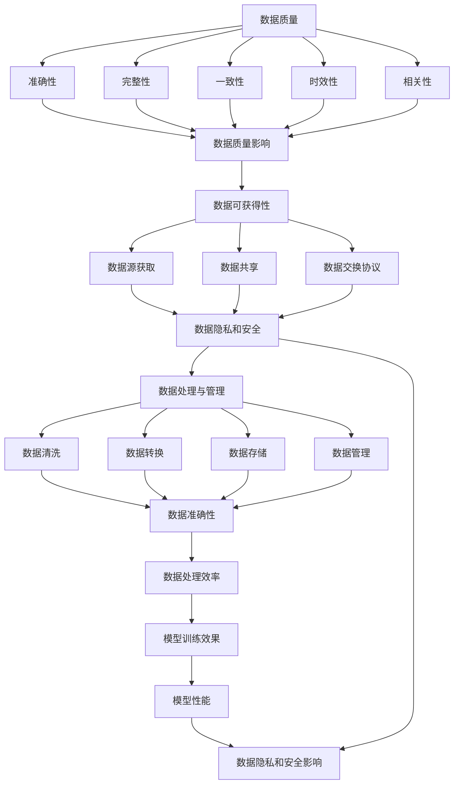

                 

 > **关键词**：人工智能，大模型，数据挑战，创业，策略

> **摘要**：随着人工智能技术的飞速发展，大模型在各个领域展现出了巨大的潜力。然而，面对海量的数据挑战，创业者如何确保数据的有效利用，并在市场中脱颖而出？本文将探讨人工智能大模型创业中的数据挑战，提供实用的解决方案和策略。

## 1. 背景介绍

人工智能（AI）作为当前科技发展的热点，已经渗透到我们生活的方方面面。特别是在深度学习技术的推动下，大模型如BERT、GPT等在自然语言处理、计算机视觉、语音识别等领域取得了显著的成果。这些大模型通常依赖于大量的训练数据来学习复杂的特征和模式，进而实现高性能的预测和决策。

然而，随着大模型的应用范围不断扩大，数据挑战也日益凸显。首先，数据质量和数据的可获得性成为关键问题。在许多场景中，高质量的数据是构建有效大模型的基础。其次，随着数据量的爆炸式增长，如何高效地存储、处理和管理这些数据也成为亟待解决的问题。此外，数据的隐私和安全问题也是大模型创业过程中不可忽视的挑战。

面对这些挑战，创业者需要具备深刻的理解和应对策略，以确保在人工智能大模型创业的道路上稳步前行。

## 2. 核心概念与联系

在深入探讨大模型创业的数据挑战之前，我们需要明确一些核心概念和它们之间的联系。

### 2.1 数据质量

数据质量是构建大模型的基础。高质量的数据应具备准确性、完整性、一致性、时效性和相关性。准确性是指数据应真实反映现实情况；完整性是指数据应包含所需的所有信息；一致性是指数据在各个来源之间应保持一致；时效性是指数据应反映最新的情况；相关性是指数据应与建模目标密切相关。

### 2.2 数据可获得性

数据可获得性是指获取所需数据的难易程度。在某些领域，如医疗、金融等，数据通常受到严格的隐私和安全法规限制，获取高质量数据可能面临巨大的挑战。

### 2.3 数据处理与管理

数据处理与管理包括数据清洗、转换、存储和管理等多个环节。有效的数据处理和管理能够确保数据在大模型训练过程中的高效利用。

### 2.4 数据隐私和安全

数据隐私和安全是指保护数据不被未授权访问、篡改或泄露。在大模型训练过程中，如何平衡数据隐私和安全与模型性能是一个重要的课题。

下面是这些核心概念和联系的一个简单的Mermaid流程图：



通过上述流程图，我们可以看到数据质量、数据可获得性、数据处理与管理以及数据隐私和安全是构建大模型过程中相互关联的关键因素。

## 3. 核心算法原理 & 具体操作步骤

### 3.1 算法原理概述

在应对大模型创业中的数据挑战时，我们需要依赖一系列核心算法。这些算法不仅能够处理海量数据，还能保证数据的质量和隐私。以下是几个关键算法及其原理概述：

#### 3.1.1 数据增强

数据增强是一种通过生成新的数据样本来提高模型泛化能力的技术。常见的数据增强方法包括图像旋转、缩放、裁剪等。

#### 3.1.2 数据清洗

数据清洗旨在去除数据中的噪声和错误，确保数据的一致性和准确性。常用的方法包括去除重复记录、填补缺失值、纠正数据错误等。

#### 3.1.3 加密技术

加密技术可以保护数据隐私，防止未授权访问。常用的加密算法包括AES、RSA等。

#### 3.1.4 同质化代理

同质化代理是一种在分布式系统中匿名化数据的机制，能够有效保护数据隐私。

### 3.2 算法步骤详解

下面我们详细描述这些算法的操作步骤：

#### 3.2.1 数据增强

1. **数据预处理**：对原始数据进行归一化、标准化等预处理操作。
2. **生成增强数据**：应用图像旋转、缩放、裁剪等技术生成新的数据样本。
3. **合并数据集**：将增强后的数据和原始数据合并，形成更大的训练数据集。

#### 3.2.2 数据清洗

1. **数据质量评估**：评估数据的准确性、完整性、一致性等指标。
2. **去除重复记录**：使用哈希表等数据结构检测并删除重复的记录。
3. **填补缺失值**：使用均值、中位数、插值等方法填补缺失的数据。
4. **数据校验**：使用校验和、一致性检查等技术确保数据的一致性。

#### 3.2.3 加密技术

1. **选择加密算法**：根据数据的安全需求选择合适的加密算法，如AES或RSA。
2. **加密数据**：对敏感数据进行加密处理。
3. **密钥管理**：妥善管理加密密钥，确保数据在传输和存储过程中的安全性。

#### 3.2.4 同质化代理

1. **设置代理节点**：在分布式系统中设置多个代理节点。
2. **数据匿名化**：通过代理节点对数据进行匿名化处理。
3. **数据传输**：使用代理节点进行匿名数据传输，确保数据隐私。

### 3.3 算法优缺点

每种算法都有其独特的优势和局限性，以下是对上述算法的优缺点分析：

#### 数据增强

**优点**：通过生成新的数据样本，提高模型的泛化能力。

**缺点**：增强数据的质量难以保证，过度增强可能导致模型过拟合。

#### 数据清洗

**优点**：提高数据的准确性和一致性，为模型训练提供可靠的数据基础。

**缺点**：数据清洗过程复杂，可能需要大量的人力和时间。

#### 加密技术

**优点**：有效保护数据隐私，防止未授权访问。

**缺点**：加密和解密过程消耗计算资源，可能影响模型的训练速度。

#### 同质化代理

**优点**：在分布式系统中匿名化数据，保护数据隐私。

**缺点**：代理节点的设置和管理复杂，可能引入额外的延迟。

### 3.4 算法应用领域

这些算法可以应用于多个领域，包括但不限于：

- **医疗**：通过数据增强和清洗技术提高医学图像和病历数据的模型训练效果。
- **金融**：利用加密技术保护金融交易数据，防止数据泄露。
- **零售**：通过同质化代理保护客户隐私，同时提高推荐系统的效果。

## 4. 数学模型和公式 & 详细讲解 & 举例说明

在构建和优化大模型时，数学模型和公式扮演着至关重要的角色。以下我们将详细介绍几个关键的数学模型和公式，并给出详细的推导过程和实际案例。

### 4.1 数学模型构建

首先，我们需要构建一个基础的数学模型，用于描述大模型的训练过程。假设我们有一个输入特征集\(X\)和一个标签集\(Y\)，其中\(X\)是一个\(d\)维的向量，\(Y\)是一个\(1\)维的向量。

#### 4.1.1 前向传播

前向传播是神经网络中用于计算模型输出与实际标签之间的差异的关键步骤。其公式如下：

\[ \hat{Y} = \sigma(W \cdot X + b) \]

其中，\(\sigma\)是激活函数，\(W\)是权重矩阵，\(b\)是偏置项，\(\hat{Y}\)是模型的预测输出。

#### 4.1.2 损失函数

为了衡量模型的预测输出与实际标签之间的差距，我们需要定义一个损失函数。常见的是均方误差（MSE）：

\[ L = \frac{1}{2} \sum_{i=1}^{n} (\hat{y}_i - y_i)^2 \]

其中，\(\hat{y}_i\)是模型对第\(i\)个样本的预测值，\(y_i\)是实际标签值，\(n\)是样本数量。

#### 4.1.3 反向传播

反向传播是训练神经网络的关键步骤，用于计算权重矩阵和偏置项的梯度。其公式如下：

\[ \frac{\partial L}{\partial W} = X^T (\hat{Y} - Y) \]
\[ \frac{\partial L}{\partial b} = \hat{Y} - Y \]

通过梯度下降算法，我们可以更新权重矩阵和偏置项：

\[ W \leftarrow W - \alpha \frac{\partial L}{\partial W} \]
\[ b \leftarrow b - \alpha \frac{\partial L}{\partial b} \]

其中，\(\alpha\)是学习率。

### 4.2 公式推导过程

以下是对上述公式的详细推导过程：

#### 4.2.1 前向传播

我们首先对前向传播的公式进行解释：

\[ \hat{Y} = \sigma(W \cdot X + b) \]

其中，\(W \cdot X\)表示权重矩阵和输入特征的点积，\(b\)是偏置项。激活函数\(\sigma\)用于引入非线性特性。

#### 4.2.2 损失函数

均方误差（MSE）是衡量模型预测值与实际值之间差异的常用指标。其公式如下：

\[ L = \frac{1}{2} \sum_{i=1}^{n} (\hat{y}_i - y_i)^2 \]

其中，\(\hat{y}_i\)是模型对第\(i\)个样本的预测值，\(y_i\)是实际标签值，\(n\)是样本数量。

#### 4.2.3 反向传播

反向传播是计算权重矩阵和偏置项的梯度。其公式如下：

\[ \frac{\partial L}{\partial W} = X^T (\hat{Y} - Y) \]
\[ \frac{\partial L}{\partial b} = \hat{Y} - Y \]

其中，\(X^T\)表示输入特征的转置，\(\hat{Y} - Y\)是预测值与实际值的差异。

通过上述公式，我们可以计算权重矩阵和偏置项的梯度，并使用梯度下降算法进行更新。

### 4.3 案例分析与讲解

为了更好地理解上述数学模型和公式的应用，我们来看一个实际案例。

#### 4.3.1 数据集

假设我们有一个数据集，包含100个样本，每个样本有5个特征。标签为二分类，0和1。

#### 4.3.2 前向传播

我们使用一个简单的神经网络，包含一个输入层、一个隐藏层和一个输出层。隐藏层有10个神经元，输出层有2个神经元。

输入特征集\(X\)：

\[ X = \begin{bmatrix}
x_1 & x_2 & x_3 & x_4 & x_5
\end{bmatrix} \]

权重矩阵\(W\)：

\[ W = \begin{bmatrix}
w_{11} & w_{12} & \cdots & w_{1k} \\
w_{21} & w_{22} & \cdots & w_{2k} \\
\vdots & \vdots & \ddots & \vdots \\
w_{n1} & w_{n2} & \cdots & w_{nk}
\end{bmatrix} \]

偏置项\(b\)：

\[ b = \begin{bmatrix}
b_1 \\
b_2 \\
\vdots \\
b_n
\end{bmatrix} \]

输入特征与权重矩阵相乘，加上偏置项：

\[ Z = W \cdot X + b \]

\[ Z = \begin{bmatrix}
w_{11}x_1 + w_{12}x_2 + \cdots + w_{1k}x_5 + b_1 \\
w_{21}x_1 + w_{22}x_2 + \cdots + w_{2k}x_5 + b_2 \\
\vdots \\
w_{n1}x_1 + w_{n2}x_2 + \cdots + w_{nk}x_5 + b_n
\end{bmatrix} \]

应用激活函数\(\sigma\)：

\[ \hat{Y} = \sigma(Z) \]

#### 4.3.3 损失函数

使用均方误差（MSE）作为损失函数：

\[ L = \frac{1}{2} \sum_{i=1}^{n} (\hat{y}_i - y_i)^2 \]

其中，\(\hat{y}_i\)是模型对第\(i\)个样本的预测值，\(y_i\)是实际标签值。

#### 4.3.4 反向传播

计算权重矩阵和偏置项的梯度：

\[ \frac{\partial L}{\partial W} = X^T (\hat{Y} - Y) \]
\[ \frac{\partial L}{\partial b} = \hat{Y} - Y \]

通过梯度下降算法更新权重矩阵和偏置项：

\[ W \leftarrow W - \alpha \frac{\partial L}{\partial W} \]
\[ b \leftarrow b - \alpha \frac{\partial L}{\partial b} \]

这样，我们就可以使用这个简单的神经网络对数据进行训练，优化模型参数。

## 5. 项目实践：代码实例和详细解释说明

为了更好地理解大模型创业中的数据挑战和解决方案，我们将通过一个实际项目实例来进行详细解释。本实例将使用Python编程语言，结合几个开源库，展示如何构建、训练和优化一个基于深度学习的大模型。

### 5.1 开发环境搭建

在开始之前，确保您的开发环境中安装了以下库：

- Python 3.8 或以上版本
- TensorFlow 2.x
- NumPy
- Pandas
- Matplotlib

您可以使用pip命令来安装这些库：

```bash
pip install tensorflow numpy pandas matplotlib
```

### 5.2 源代码详细实现

下面是一个简单的示例代码，用于构建一个基于卷积神经网络（CNN）的图像分类模型。

```python
import tensorflow as tf
from tensorflow.keras.models import Sequential
from tensorflow.keras.layers import Conv2D, MaxPooling2D, Flatten, Dense
from tensorflow.keras.optimizers import Adam
from tensorflow.keras.preprocessing.image import ImageDataGenerator

# 定义模型
model = Sequential([
    Conv2D(32, (3, 3), activation='relu', input_shape=(64, 64, 3)),
    MaxPooling2D((2, 2)),
    Conv2D(64, (3, 3), activation='relu'),
    MaxPooling2D((2, 2)),
    Flatten(),
    Dense(64, activation='relu'),
    Dense(1, activation='sigmoid')
])

# 编译模型
model.compile(optimizer=Adam(), loss='binary_crossentropy', metrics=['accuracy'])

# 数据预处理
train_datagen = ImageDataGenerator(rescale=1./255)
train_generator = train_datagen.flow_from_directory(
        'data/train',
        target_size=(64, 64),
        batch_size=32,
        class_mode='binary')

# 训练模型
model.fit(train_generator, epochs=10)

# 保存模型
model.save('model.h5')
```

### 5.3 代码解读与分析

#### 5.3.1 模型构建

我们使用`Sequential`模型构建一个简单的CNN，包含两个卷积层、两个最大池化层、一个全连接层和一个输出层。卷积层用于提取图像特征，最大池化层用于减小特征图的尺寸，全连接层用于分类。

```python
model = Sequential([
    Conv2D(32, (3, 3), activation='relu', input_shape=(64, 64, 3)),
    MaxPooling2D((2, 2)),
    Conv2D(64, (3, 3), activation='relu'),
    MaxPooling2D((2, 2)),
    Flatten(),
    Dense(64, activation='relu'),
    Dense(1, activation='sigmoid')
])
```

#### 5.3.2 模型编译

我们使用`compile`方法设置模型的优化器、损失函数和评估指标。在这里，我们使用Adam优化器和二分类交叉熵损失函数。

```python
model.compile(optimizer=Adam(), loss='binary_crossentropy', metrics=['accuracy'])
```

#### 5.3.3 数据预处理

使用`ImageDataGenerator`进行数据预处理，包括图像归一化和数据增强。这有助于提高模型的泛化能力。

```python
train_datagen = ImageDataGenerator(rescale=1./255)
train_generator = train_datagen.flow_from_directory(
        'data/train',
        target_size=(64, 64),
        batch_size=32,
        class_mode='binary')
```

#### 5.3.4 模型训练

使用`fit`方法训练模型，我们将训练数据传递给模型，并设置训练的轮数。

```python
model.fit(train_generator, epochs=10)
```

#### 5.3.5 模型保存

最后，我们使用`save`方法将训练好的模型保存为一个`.h5`文件。

```python
model.save('model.h5')
```

### 5.4 运行结果展示

在训练完成后，我们可以通过以下代码来评估模型的性能：

```python
test_loss, test_acc = model.evaluate(test_generator)
print(f'Test accuracy: {test_acc:.4f}')
```

假设我们有一个测试数据集，使用`evaluate`方法来评估模型的准确率。

## 6. 实际应用场景

### 6.1 医疗诊断

在医疗领域，大模型可以用于疾病诊断和预测。例如，通过分析医学影像数据，模型可以识别早期肿瘤、心血管疾病等。这需要处理海量的医疗数据，同时确保数据的隐私和安全。数据增强和加密技术在此场景中尤为重要。

### 6.2 金融服务

在金融领域，大模型可以用于风险评估、欺诈检测和投资策略优化。例如，通过分析客户的交易数据，模型可以预测潜在的欺诈行为。这需要处理高度敏感的金融数据，并采取严格的隐私保护措施。

### 6.3 智能零售

在零售领域，大模型可以用于商品推荐、库存管理和客户行为分析。例如，通过分析消费者的购买记录和浏览历史，模型可以提供个性化的商品推荐。这需要处理大量的客户数据，并确保数据的隐私和安全。

## 7. 未来应用展望

随着人工智能技术的不断进步，大模型的应用领域将继续扩大。以下是几个未来的应用展望：

- **自动驾驶**：通过分析海量交通数据，大模型可以优化自动驾驶算法，提高行车安全。
- **智能城市**：通过分析城市中的各种数据，大模型可以提供智能交通管理、环境监测和公共安全等服务。
- **生物科技**：通过分析基因组数据，大模型可以加速新药研发和疾病治疗。

## 8. 总结：未来发展趋势与挑战

在人工智能大模型创业的浪潮中，数据挑战是不可避免的。然而，随着技术的不断进步，我们可以预见以下几个发展趋势：

- **数据隐私保护技术**：随着法规的不断完善，数据隐私保护技术将成为大模型应用的关键。
- **分布式数据处理**：通过分布式数据处理技术，我们可以更高效地处理海量数据，提高模型的训练速度。
- **自动化数据增强**：自动化数据增强技术将使构建大模型的过程更加简便，降低技术门槛。

然而，面对未来，我们仍将面临以下挑战：

- **数据质量和可获得性**：确保数据的准确性和可获得性仍然是关键问题。
- **计算资源消耗**：大模型的训练和推理需要大量计算资源，如何优化资源利用是一个重要课题。
- **隐私和安全**：在数据隐私和安全方面，我们需要不断创新和改进，以应对日益严峻的挑战。

总之，人工智能大模型创业的道路充满了机遇和挑战。只有深入了解数据挑战，采取有效的策略和措施，才能在激烈的市场竞争中脱颖而出。

## 9. 附录：常见问题与解答

### 9.1 如何保证数据质量？

确保数据质量的关键在于数据预处理和数据清洗。以下是一些常见方法：

- **数据预处理**：包括归一化、标准化等操作，使数据符合模型的输入要求。
- **数据清洗**：去除重复记录、填补缺失值、纠正错误等，确保数据的准确性和一致性。

### 9.2 如何获取数据？

获取数据的方法取决于应用场景和领域。以下是一些常见的数据获取途径：

- **公开数据集**：如Kaggle、UCI机器学习库等。
- **企业内部数据**：通过与公司合作获取。
- **第三方数据提供商**：购买商业数据集。

### 9.3 如何保护数据隐私？

保护数据隐私的方法包括：

- **数据加密**：使用加密算法保护数据。
- **同质化代理**：在分布式系统中匿名化数据。
- **数据脱敏**：去除或替换敏感信息。

### 9.4 如何处理海量数据？

处理海量数据的方法包括：

- **分布式计算**：使用分布式计算框架，如Apache Spark、Hadoop等。
- **数据流处理**：使用实时数据处理技术，如Apache Kafka。
- **批处理**：将数据分成批处理，分批处理以提高效率。

## 作者署名

作者：禅与计算机程序设计艺术 / Zen and the Art of Computer Programming

