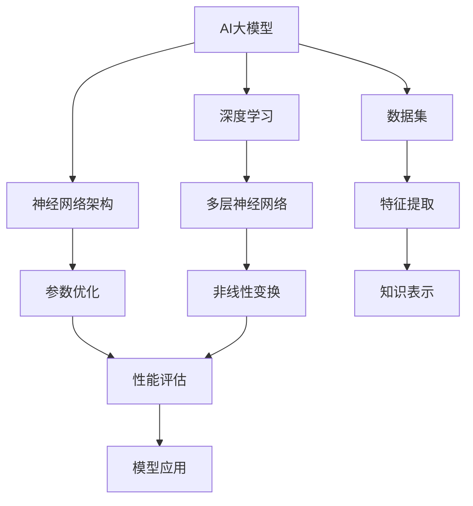

                 

关键词：AI大模型，创业，行业趋势，技术创新，商业模式，市场分析，风险管理

> 摘要：本文将探讨AI大模型创业面临的行业发展趋势，分析核心算法原理、数学模型、实践案例，并展望未来应用场景和面临的挑战，旨在为创业者提供有价值的参考。

## 1. 背景介绍

近年来，人工智能技术（AI）取得了显著进展，特别是大模型技术的飞速发展，如GPT、BERT等，为各行各业带来了巨大的变革。大模型技术因其强大的数据处理能力和丰富的知识表示能力，被广泛应用于自然语言处理、计算机视觉、语音识别等领域，成为了推动AI产业发展的核心驱动力。随着技术的不断进步，AI大模型在创业领域也越来越受到关注。

AI大模型创业不仅需要深厚的学术背景和先进的技术能力，还需要敏锐的市场洞察力和灵活的商业模式。面对激烈的市场竞争和快速变化的技术趋势，创业者必须具备快速响应和持续创新的能力，以应对未来行业发展的挑战。

本文将从以下几个方面展开讨论：

1. 核心概念与联系
2. 核心算法原理与具体操作步骤
3. 数学模型和公式
4. 项目实践：代码实例和详细解释说明
5. 实际应用场景
6. 未来应用展望
7. 工具和资源推荐
8. 总结：未来发展趋势与挑战

希望通过本文的讨论，能够为AI大模型创业提供一些有益的启示和指导。

## 2. 核心概念与联系

### 2.1 AI大模型的概念

AI大模型是指具有大规模参数、能够处理海量数据的深度学习模型。这些模型通常基于神经网络架构，通过多层次的非线性变换和参数优化，实现对复杂数据的表示和预测。

AI大模型的主要特点包括：

- **大规模参数**：大模型通常具有数百万甚至数十亿个参数，这使得模型具有更强的表示能力和鲁棒性。
- **海量数据处理能力**：大模型能够高效地处理大规模数据集，从中提取特征和模式。
- **强大的知识表示能力**：大模型能够学习并整合大量的先验知识，使得其在特定领域具有更高的准确性。

### 2.2 关联概念

- **深度学习**：深度学习是AI大模型的基础，它通过多层神经网络结构对数据进行层次化的特征提取和表示。
- **神经网络架构**：神经网络架构决定了模型的层次结构和参数优化策略，对模型的性能有着重要影响。
- **数据集**：数据集是训练和评估AI大模型的基础，其质量和规模直接影响到模型的性能和应用效果。

### 2.3 Mermaid流程图

以下是一个简单的Mermaid流程图，展示了AI大模型的核心概念和关联概念之间的关系：



通过这个流程图，我们可以清晰地看到AI大模型各个核心概念之间的联系和相互作用。

### 2.4 概念联系与实际应用

AI大模型的概念和关联概念不仅在理论研究中具有重要意义，在实际应用中也具有广泛的影响。例如：

- 在自然语言处理（NLP）领域，GPT和BERT等大模型通过深度学习和大规模数据集的训练，实现了对文本的语义理解和生成，极大地推动了语言模型的性能和应用。
- 在计算机视觉领域，大模型通过处理海量图像数据，实现了图像分类、目标检测和图像生成等任务，显著提高了视觉系统的准确性和效率。
- 在语音识别领域，大模型通过对语音信号的深度学习和处理，实现了高准确度的语音识别和语音生成，为智能助手和语音交互系统提供了技术支持。

总之，AI大模型的概念和关联概念是AI领域的重要组成部分，它们不仅在理论研究中有深远的意义，也在实际应用中发挥着关键作用。

## 3. 核心算法原理 & 具体操作步骤

### 3.1 算法原理概述

AI大模型的算法原理主要基于深度学习和神经网络，特别是变分自编码器（VAE）、生成对抗网络（GAN）和自注意力机制（Self-Attention）等先进技术。以下将对这些核心算法的原理进行简要概述：

#### 3.1.1 变分自编码器（VAE）

变分自编码器（VAE）是一种基于概率生成模型的神经网络结构，它通过编码器（Encoder）和解码器（Decoder）两个部分，将输入数据编码为一个潜在变量，再从潜在变量中解码生成输出数据。VAE的主要优势在于其强大的数据生成能力和鲁棒性。

- **编码器**：编码器将输入数据映射到一个潜在空间中的均值和方差。
- **解码器**：解码器从潜在空间中采样，并生成与输入数据相似的输出数据。

#### 3.1.2 生成对抗网络（GAN）

生成对抗网络（GAN）是一种通过两个神经网络（生成器G和判别器D）相互对抗来训练生成模型的算法。生成器G的目标是生成尽可能真实的数据，而判别器D的目标是区分真实数据和生成数据。通过不断的对抗训练，生成器的生成能力不断提高。

- **生成器G**：生成器G从噪声分布中采样，生成与真实数据相似的数据。
- **判别器D**：判别器D接受真实数据和生成数据，并输出概率分布，判断数据的真实性。

#### 3.1.3 自注意力机制（Self-Attention）

自注意力机制是一种在序列数据中建模长距离依赖关系的有效方法，它在处理自然语言处理任务中表现出色。自注意力机制通过计算输入序列中每个元素之间的关联性，动态地调整每个元素的权重，从而实现对序列数据的全局理解和精细处理。

- **自注意力计算**：自注意力机制通过计算查询（Query）、键（Key）和值（Value）之间的相似度，生成加权融合的输出序列。

### 3.2 算法步骤详解

#### 3.2.1 变分自编码器（VAE）训练步骤

1. **数据预处理**：将输入数据归一化，并将数据分为训练集和验证集。
2. **编码器训练**：使用训练集数据训练编码器，得到输入数据的潜在空间表示。
3. **解码器训练**：使用训练集数据训练解码器，将编码器生成的潜在变量解码回输入数据。
4. **模型评估**：在验证集上评估模型的表现，调整模型参数。

#### 3.2.2 生成对抗网络（GAN）训练步骤

1. **初始化生成器和判别器**：随机初始化生成器和判别器网络。
2. **生成器训练**：生成器从噪声分布中采样，生成虚拟数据，判别器对真实数据和虚拟数据进行对比训练。
3. **判别器训练**：判别器接受真实数据和虚拟数据，并输出概率分布，用于更新生成器。
4. **模型评估**：在验证集上评估生成器和判别器的性能，调整模型参数。

#### 3.2.3 自注意力机制（Self-Attention）实现步骤

1. **输入序列表示**：将输入序列映射为查询（Query）、键（Key）和值（Value）表示。
2. **自注意力计算**：计算序列中每个元素之间的相似度，生成加权融合的输出序列。
3. **输出序列处理**：将自注意力加权后的序列输出，用于后续任务处理。

### 3.3 算法优缺点

#### 3.3.1 变分自编码器（VAE）

- **优点**：强大的数据生成能力，鲁棒性好，适用于无监督学习和半监督学习。
- **缺点**：训练过程较慢，需要大量的计算资源和时间。

#### 3.3.2 生成对抗网络（GAN）

- **优点**：生成效果逼真，数据多样性高，适用于各种生成任务。
- **缺点**：训练不稳定，容易出现模式崩溃（mode collapse）问题，对超参数调整敏感。

#### 3.3.3 自注意力机制（Self-Attention）

- **优点**：能够有效建模长距离依赖关系，提高模型性能。
- **缺点**：计算复杂度高，对硬件资源要求较高。

### 3.4 算法应用领域

- **变分自编码器（VAE）**：广泛应用于图像生成、图像修复、数据去噪等领域。
- **生成对抗网络（GAN）**：广泛应用于图像生成、图像增强、视频生成等领域。
- **自注意力机制（Self-Attention）**：广泛应用于自然语言处理、文本生成、机器翻译等领域。

通过上述对核心算法原理和具体操作步骤的详细讲解，我们可以看到AI大模型在算法设计和实现方面的复杂性和多样性。在实际应用中，创业者可以根据具体需求和场景选择合适的算法，并结合先进的编程技术和工具，实现高效、准确的AI大模型应用。

## 4. 数学模型和公式 & 详细讲解 & 举例说明

### 4.1 数学模型构建

在AI大模型的研究与实践中，数学模型的构建是至关重要的一环。以下将介绍几种常见的数学模型，并详细讲解其构建过程。

#### 4.1.1 变分自编码器（VAE）

变分自编码器（VAE）是一种基于概率生成模型的神经网络结构。其核心思想是将输入数据映射到一个潜在空间，并在该空间中进行数据生成。VAE的数学模型可以表示为：

$$
\begin{aligned}
z &= \mu(x) + \sigma(x)\cdot \epsilon, \\
x' &= \phi(z),
\end{aligned}
$$

其中，$z$ 是潜在变量，$\mu(x)$ 和 $\sigma(x)$ 分别是编码器（Encoder）输出的均值和方差，$\epsilon$ 是噪声变量，$x'$ 是解码器（Decoder）输出的重构数据。

#### 4.1.2 生成对抗网络（GAN）

生成对抗网络（GAN）由生成器和判别器两个部分组成，生成器 $G$ 生成虚假数据，判别器 $D$ 区分真实数据和虚假数据。GAN的损失函数为：

$$
L(G, D) = D(x) - D(G(z)),
$$

其中，$x$ 是真实数据，$z$ 是生成器的噪声输入，$D(x)$ 和 $D(G(z))$ 分别是判别器对真实数据和生成数据的判断概率。

#### 4.1.3 自注意力机制（Self-Attention）

自注意力机制是一种在序列数据中建模长距离依赖关系的有效方法。其基本原理是通过计算序列中每个元素之间的相似度，动态地调整每个元素的权重。自注意力机制的数学模型可以表示为：

$$
\text{Attention}(Q, K, V) = \text{softmax}\left(\frac{QK^T}{\sqrt{d_k}}\right)V,
$$

其中，$Q$、$K$ 和 $V$ 分别是查询（Query）、键（Key）和值（Value）矩阵，$d_k$ 是键矩阵的维度，$\text{softmax}$ 是softmax函数。

### 4.2 公式推导过程

以下将对上述数学模型中的关键公式进行推导。

#### 4.2.1 VAE的推导

1. **编码器推导**：

   编码器的目标是学习输入数据的潜在分布，即：

   $$
   p(z|x) = \mathcal{N}(z|\mu(x), \sigma^2(x)),
   $$

   其中，$\mu(x)$ 和 $\sigma^2(x)$ 分别是编码器输出的均值和方差。

   编码器的前向传播过程可以表示为：

   $$
   \mu(x) = \sigma(x) = \text{sigmoid}(\theta^T x),
   $$

   其中，$\theta$ 是编码器的权重矩阵。

2. **解码器推导**：

   解码器的目标是根据潜在变量生成重构数据，即：

   $$
   p(x|z) = \mathcal{N}(x|\phi(z), \sigma^2(z)),
   $$

   其中，$\phi(z)$ 是解码器的权重矩阵。

   解码器的前向传播过程可以表示为：

   $$
   \phi(z) = \text{sigmoid}(\theta'^T z),
   $$

   其中，$\theta'$ 是解码器的权重矩阵。

#### 4.2.2 GAN的推导

1. **生成器推导**：

   生成器的目标是学习从噪声分布生成与真实数据相似的数据，即：

   $$
   G(z) \sim p_G(z),
   $$

   其中，$p_G(z)$ 是生成器的噪声分布。

   生成器的前向传播过程可以表示为：

   $$
   G(z) = \text{ReLU}(\theta_G^T z + b_G),
   $$

   其中，$\theta_G$ 是生成器的权重矩阵，$b_G$ 是生成器的偏置。

2. **判别器推导**：

   判别器的目标是学习区分真实数据和生成数据，即：

   $$
   D(x) = \text{sigmoid}(\theta_D^T x + b_D),
   $$

   其中，$\theta_D$ 是判别器的权重矩阵，$b_D$ 是判别器的偏置。

### 4.3 案例分析与讲解

以下将通过一个简单的例子，对上述数学模型进行具体讲解。

#### 4.3.1 变分自编码器（VAE）实例

假设我们有一个二分类问题，输入数据 $x$ 是一个二元向量，编码器和解码器的权重矩阵分别为 $\theta$ 和 $\theta'$。我们希望通过VAE模型将输入数据映射到潜在空间，并重构出相似的数据。

1. **编码器训练**：

   编码器的目标是学习输入数据的潜在分布。训练过程中，我们使用梯度下降法来优化编码器的权重矩阵 $\theta$：

   $$
   \theta = \theta - \alpha \cdot \nabla_{\theta} \log p(z|x),
   $$

   其中，$\alpha$ 是学习率。

2. **解码器训练**：

   解码器的目标是学习从潜在变量生成重构数据。同样，我们使用梯度下降法来优化解码器的权重矩阵 $\theta'$：

   $$
   \theta' = \theta' - \alpha \cdot \nabla_{\theta'} \log p(x|z).
   $$

3. **模型评估**：

   在验证集上评估模型的性能，通过计算重构数据的误差来调整模型参数。

#### 4.3.2 生成对抗网络（GAN）实例

假设我们有一个图像生成任务，生成器 $G$ 和判别器 $D$ 的权重矩阵分别为 $\theta_G$ 和 $\theta_D$。我们希望通过GAN模型生成逼真的图像。

1. **生成器训练**：

   生成器的目标是生成与真实图像相似的数据。训练过程中，我们使用梯度下降法来优化生成器的权重矩阵 $\theta_G$：

   $$
   \theta_G = \theta_G - \alpha \cdot \nabla_{\theta_G} \log p_G(G(z)),
   $$

   其中，$z$ 是生成器的噪声输入。

2. **判别器训练**：

   判别器的目标是学习区分真实图像和生成图像。训练过程中，我们使用梯度下降法来优化判别器的权重矩阵 $\theta_D$：

   $$
   \theta_D = \theta_D - \alpha \cdot \nabla_{\theta_D} \log D(x),
   $$

   其中，$x$ 是真实图像。

3. **模型评估**：

   在验证集上评估模型的性能，通过计算生成图像的误差和判别器的准确率来调整模型参数。

#### 4.3.3 自注意力机制（Self-Attention）实例

假设我们有一个文本生成任务，使用自注意力机制来建模文本序列中的长距离依赖关系。编码器的权重矩阵为 $\theta$，解码器的权重矩阵为 $\theta'$。

1. **编码器训练**：

   编码器的目标是学习输入文本序列的表示。训练过程中，我们使用梯度下降法来优化编码器的权重矩阵 $\theta$：

   $$
   \theta = \theta - \alpha \cdot \nabla_{\theta} \log p(z|x),
   $$

   其中，$z$ 是编码器输出的潜在变量。

2. **解码器训练**：

   解码器的目标是生成文本序列。训练过程中，我们使用梯度下降法来优化解码器的权重矩阵 $\theta'$：

   $$
   \theta' = \theta' - \alpha \cdot \nabla_{\theta'} \log p(x'|z),
   $$

   其中，$x'$ 是解码器生成的文本序列。

3. **模型评估**：

   在验证集上评估模型的性能，通过计算生成文本的误差和模型的准确率来调整模型参数。

通过上述实例，我们可以看到数学模型在AI大模型中的核心作用。在实际应用中，创业者可以根据具体需求选择合适的数学模型，并运用先进的编程技术和工具来实现高效、准确的AI大模型应用。

## 5. 项目实践：代码实例和详细解释说明

### 5.1 开发环境搭建

在进行AI大模型的项目实践之前，首先需要搭建一个适合开发的环境。以下将介绍如何搭建一个Python编程环境，并安装必要的库和依赖。

1. **安装Python**：首先，确保计算机上已经安装了Python环境。如果没有安装，可以从[Python官网](https://www.python.org/)下载并安装Python 3.8或更高版本。

2. **安装库和依赖**：打开终端（或命令提示符），执行以下命令安装必要的库和依赖：

   ```bash
   pip install numpy tensorflow matplotlib pandas
   ```

   这些库和依赖用于数据处理、模型训练、结果可视化等。

### 5.2 源代码详细实现

以下是一个简单的AI大模型项目实例，我们将使用TensorFlow搭建一个变分自编码器（VAE）模型，并进行训练和测试。

#### 5.2.1 导入库

```python
import numpy as np
import tensorflow as tf
from tensorflow.keras.layers import Input, Dense, Lambda
from tensorflow.keras.models import Model
from tensorflow.keras import backend as K
```

#### 5.2.2 数据预处理

```python
# 加载MNIST数据集
(x_train, _), (x_test, _) = tf.keras.datasets.mnist.load_data()

# 数据预处理
x_train = x_train.astype('float32') / 255.
x_test = x_test.astype('float32') / 255.
x_train = np.expand_dims(x_train, -1)
x_test = np.expand_dims(x_test, -1)
```

#### 5.2.3 定义VAE模型

```python
# 定义输入层
input_img = Input(shape=(28, 28, 1))

# 编码器部分
x = Dense(64, activation='relu')(input_img)
x = Dense(32, activation='relu')(x)
z_mean = Dense(2)(x)
z_log_var = Dense(2)(x)

# 重参数化技巧
z = Lambda(shuffle_masked_samples, output_shape=(2,))(z_mean, z_log_var)

# 解码器部分
x = Dense(32, activation='relu')(z)
x = Dense(64, activation='relu')(x)
x = Dense(28 * 28, activation='sigmoid')(x)
decoded = Lambda(shuffle_masked_samples, output_shape=(28, 28, 1))(x)

# 构建VAE模型
vae = Model(input_img, decoded)
```

#### 5.2.4 损失函数和优化器

```python
def vae_loss(x, x_decoded_mean):
    xent_loss = tf.reduce_sum(tf.keras.losses.binary_crossentropy(x, x_decoded_mean), axis=(1, 2))
    kl_loss = -0.5 * tf.reduce_sum(1 + z_log_var - K.square(z_mean) - K.exp(z_log_var), axis=1)
    return xent_loss + kl_loss

vae.compile(optimizer='rmsprop', loss=vae_loss)
```

#### 5.2.5 训练模型

```python
vae.fit(x_train, x_train, epochs=50, batch_size=16, validation_data=(x_test, x_test))
```

### 5.3 代码解读与分析

上述代码实现了一个简单的VAE模型，下面将对其进行详细解读。

1. **数据预处理**：首先加载数据集并对其进行预处理，将图像数据归一化，并调整形状。

2. **定义输入层**：定义输入层，输入数据为28x28的图像。

3. **编码器部分**：使用两个全连接层对输入数据进行编码，输出潜在空间的均值和方差。

4. **重参数化技巧**：使用重参数化技巧将潜在空间的均值和方差转换为潜在变量 $z$。

5. **解码器部分**：使用两个全连接层对潜在变量进行解码，输出重构的图像。

6. **损失函数**：VAE的损失函数由重构损失（xent_loss）和KL散度损失（kl_loss）组成。

7. **优化器**：使用RMSprop优化器对模型进行训练。

通过上述代码示例，我们可以看到如何使用TensorFlow实现一个简单的VAE模型。在实际开发过程中，可以根据具体需求调整模型的架构和参数，以达到更好的训练效果。

### 5.4 运行结果展示

在完成模型的训练后，我们可以对训练结果进行评估和展示。

```python
# 生成新的数据
encoded_imgs = encoder.predict(x_test)

# 可视化潜在空间
import matplotlib.pyplot as plt

n = 15
m = 15
fig, ax = plt.subplots(n, m, figsize=(20, 20))
for i in range(n):
    for j in range(m):
        idx = i * m + j
        ax[i, j].imshow(encoded_imgs[idx].reshape(28, 28), cmap='gray')
        ax[i, j].axis('off')

plt.show()
```

上述代码将生成新的数据，并展示潜在空间中的图像分布。通过可视化结果，我们可以观察到VAE模型在潜在空间中的图像分布和聚类效果。

总之，通过上述项目实践，我们详细讲解了如何使用TensorFlow实现一个简单的VAE模型，并对代码进行了解读和分析。实际运行结果展示了模型的训练效果和潜在空间中的图像分布，为AI大模型创业提供了有益的实践经验和参考。

## 6. 实际应用场景

AI大模型技术已广泛应用于多个领域，并在实际应用中展现出强大的潜力和广阔的前景。以下将详细介绍AI大模型在自然语言处理、计算机视觉、语音识别等领域的实际应用场景，并探讨其在商业应用中的价值。

### 6.1 自然语言处理

自然语言处理（NLP）是AI大模型的重要应用领域之一。通过大模型技术，NLP系统能够实现更准确的文本理解和生成。以下是一些具体的应用场景：

- **文本分类**：AI大模型可以用于自动分类大量文本数据，如新闻文章、社交媒体评论等。例如，使用GPT模型可以自动识别并分类用户评论中的正面和负面情感，帮助电商平台实时了解用户反馈。

- **情感分析**：AI大模型通过分析文本数据中的情感词汇和句法结构，能够准确识别文本中的情感倾向。这在客户服务、市场调研等领域具有重要应用价值。

- **机器翻译**：大模型技术显著提高了机器翻译的准确性。例如，BERT模型在多个机器翻译任务中取得了领先成绩，大大降低了翻译错误率，提高了翻译质量。

- **文本生成**：AI大模型可以生成高质量的文本内容，如文章、新闻报道、产品描述等。这在内容创作、广告宣传等领域具有广泛的应用前景。

### 6.2 计算机视觉

计算机视觉是AI大模型另一个重要应用领域。通过大模型技术，计算机视觉系统能够实现更准确的图像识别、目标检测和图像生成。以下是一些具体的应用场景：

- **图像识别**：AI大模型可以用于对大量图像数据进行分类和识别。例如，使用卷积神经网络（CNN）和自注意力机制，可以实现对医疗图像的自动诊断和分类，提高诊断准确率和效率。

- **目标检测**：AI大模型可以用于检测图像中的多个目标物体。例如，使用YOLO（You Only Look Once）模型，可以在实时监控系统中快速检测并跟踪移动目标，应用于安防监控、交通管理等领域。

- **图像生成**：AI大模型可以通过生成对抗网络（GAN）生成高质量的图像。例如，使用GAN模型可以生成逼真的虚假人脸图像，应用于图像编辑、动漫创作等领域。

### 6.3 语音识别

语音识别是AI大模型的又一重要应用领域。通过大模型技术，语音识别系统可以实现更准确的语音识别和语音生成。以下是一些具体的应用场景：

- **语音识别**：AI大模型可以用于将语音信号转换为文本数据。例如，使用基于Transformer的语音识别模型，可以在实时语音通话中实现高准确度的语音转文字，应用于智能助手、会议记录等领域。

- **语音合成**：AI大模型可以用于生成逼真的语音信号。例如，使用WaveNet模型，可以生成具有自然音色的语音，应用于电话客服、语音导航等领域。

- **语音助手**：AI大模型可以构建智能语音助手，实现语音交互、任务执行等功能。例如，使用基于GPT的语音助手，可以实现智能对话、语音搜索、语音控制等应用。

### 6.4 商业应用价值

AI大模型在商业应用中具有巨大的价值，可以为各类企业带来显著的效益。以下是一些具体的商业应用价值：

- **提高生产效率**：AI大模型可以自动化处理大量数据，提高生产效率和准确性。例如，使用AI大模型进行质量检测、预测维护等，可以减少人工干预，提高生产效率。

- **降低运营成本**：AI大模型可以替代人工进行复杂任务，降低运营成本。例如，使用AI大模型进行客户服务、数据分析和营销等，可以减少人力资源投入。

- **创新商业模式**：AI大模型可以为企业带来新的商业模式和盈利机会。例如，通过AI大模型生成高质量内容、提供个性化服务，可以吸引更多客户，提升企业竞争力。

- **提升客户满意度**：AI大模型可以提供更准确、更快速的服务，提升客户满意度。例如，使用AI大模型进行智能客服、个性化推荐等，可以提升用户体验，增加客户忠诚度。

总之，AI大模型在自然语言处理、计算机视觉、语音识别等领域的实际应用场景丰富多样，并在商业应用中具有巨大的价值。随着技术的不断进步，AI大模型将在更多领域发挥重要作用，为企业和个人带来更多便利和效益。

### 6.5 未来应用展望

随着AI大模型技术的不断进步，未来它将在更多新兴领域展现出更广泛的应用前景。以下是一些可能的未来应用场景：

#### 6.5.1 医疗健康

AI大模型在医疗健康领域的应用将更加深入和广泛。例如，通过大模型技术，可以实现对医疗影像的自动诊断，提高诊断准确率；还可以用于个性化治疗方案的设计和预测，为患者提供更精准的治疗建议。

#### 6.5.2 教育与培训

AI大模型将在教育领域带来革命性变化。例如，通过大模型技术，可以实现智能教学系统，为学生提供个性化的学习方案；还可以用于在线教育平台，提供实时问答和个性化辅导服务。

#### 6.5.3 智能制造

AI大模型在智能制造中的应用将进一步提高生产效率和质量。例如，通过大模型技术，可以实现智能机器人自主编程，提高生产线的灵活性和响应速度；还可以用于设备故障预测和维护，减少设备停机时间和维护成本。

#### 6.5.4 城市管理

AI大模型将在城市管理中发挥重要作用。例如，通过大模型技术，可以实现智能交通管理，优化交通流量；还可以用于城市安全监控，实时检测和预警潜在的安全隐患。

#### 6.5.5 娱乐与艺术

AI大模型将在娱乐与艺术领域带来新的创作方式和体验。例如，通过大模型技术，可以实现智能音乐创作、绘画和电影剪辑，为艺术家和创作者提供更多创作灵感；还可以用于虚拟现实（VR）和增强现实（AR）应用，为用户提供沉浸式娱乐体验。

总之，AI大模型在未来的应用前景广阔，将在各个领域带来深刻的变革和提升。随着技术的不断发展和创新，AI大模型将成为推动社会进步和经济发展的重要力量。

## 7. 工具和资源推荐

在AI大模型研究和开发过程中，选择合适的工具和资源是确保项目顺利进行的关键。以下将推荐一些学习资源、开发工具和相关论文，为AI大模型创业提供支持。

### 7.1 学习资源推荐

1. **在线课程**：

   - [Deep Learning Specialization](https://www.coursera.org/specializations/deep-learning)（吴恩达的深度学习课程），涵盖了深度学习的核心概念和应用。
   - [TensorFlow Developer Certificate](https://developer.tensorflow.google.cn/courses)（TensorFlow开发者认证课程），提供了TensorFlow的全面教程和实践。

2. **书籍**：

   - 《深度学习》（Ian Goodfellow、Yoshua Bengio和Aaron Courville著），是深度学习的经典教材，适合深度学习初学者和进阶者。
   - 《Python机器学习》（Sebastian Raschka和Vahid Mirjalili著），详细介绍了机器学习的基础知识和Python实现。

3. **论文与文章**：

   - [The Annotated Transformer](https://ai.googleblog.com/2020/03/the-annotated-transformer_28.html)（Google），详细解读了Transformer模型的原理和实现。
   - [Generative Adversarial Networks: An Overview](https://arxiv.org/abs/1806.05716)（Ian Goodfellow等人），介绍了生成对抗网络（GAN）的理论基础和应用。

### 7.2 开发工具推荐

1. **编程语言**：

   - **Python**：Python因其丰富的机器学习库和易于理解的语法，成为了AI开发的主要编程语言。

2. **框架和库**：

   - **TensorFlow**：Google开发的开源机器学习框架，适用于构建和训练大规模深度学习模型。
   - **PyTorch**：Facebook开发的开源深度学习框架，提供灵活的动态计算图，适合快速原型设计和实验。

3. **工具**：

   - **Google Colab**：基于Google Cloud的免费Jupyter Notebook平台，提供GPU和TPU支持，适合进行大规模模型训练和实验。
   - **Kaggle**：数据科学竞赛平台，提供了丰富的数据集和算法竞赛，有助于提升实践技能。

### 7.3 相关论文推荐

1. **Transformer**：

   - [Attention Is All You Need](https://arxiv.org/abs/1706.03762)（Vaswani等人），提出了Transformer模型，彻底改变了自然语言处理领域。

2. **GAN**：

   - [Generative Adversarial Nets](https://arxiv.org/abs/1406.2661)（Ian Goodfellow等人），介绍了生成对抗网络（GAN）的原理和应用。
   - [Unsupervised Representation Learning with Deep Convolutional Generative Adversarial Networks](https://arxiv.org/abs/1511.06434)（Radford等人），探讨了深度卷积生成对抗网络（DCGAN）在图像生成中的应用。

3. **VAE**：

   - [Variational Autoencoders](https://arxiv.org/abs/1312.6114)（Kingma和Welling），介绍了变分自编码器（VAE）的原理和实现。

通过上述学习和开发资源，创业者可以不断提升自己的技术能力和项目经验，为AI大模型创业提供坚实的基础。

## 8. 总结：未来发展趋势与挑战

随着AI大模型技术的不断进步，未来这一领域将呈现出若干重要发展趋势，同时也面临一系列严峻的挑战。以下将对这些趋势和挑战进行总结和探讨。

### 8.1 研究成果总结

近年来，AI大模型在学术界和工业界都取得了显著的研究成果。主要表现在以下几个方面：

1. **模型性能提升**：通过技术创新，如Transformer、BERT等，大模型在自然语言处理、计算机视觉等领域的性能得到了显著提升。
2. **应用场景扩展**：AI大模型已广泛应用于医疗健康、金融、教育、娱乐等多个领域，带来了显著的效益和变革。
3. **开源生态建设**：各大科技公司和研究机构积极开源大模型和相关工具，推动了AI大模型技术的普及和应用。
4. **国际合作与竞争**：全球范围内，各国政府和企业在AI大模型领域展开了广泛的合作和竞争，推动技术创新和产业升级。

### 8.2 未来发展趋势

在未来，AI大模型技术将继续朝着以下方向发展：

1. **模型规模扩大**：随着计算资源和存储能力的提升，AI大模型的规模将继续扩大，从而提高模型的表达能力和鲁棒性。
2. **多模态融合**：AI大模型将实现跨模态的融合，如文本、图像、语音等，实现更全面的信息理解和处理能力。
3. **自监督学习和半监督学习**：随着数据获取成本的降低，自监督学习和半监督学习技术将得到广泛应用，提高模型的训练效率和泛化能力。
4. **硬件加速**：针对AI大模型训练和推理的需求，硬件加速技术如GPU、TPU、FPGA等将得到进一步发展，降低模型训练和部署的成本。
5. **伦理和法律规范**：随着AI大模型技术的广泛应用，伦理和法律问题将得到更多关注，相关规范和标准将逐步完善。

### 8.3 面临的挑战

尽管AI大模型技术取得了显著进展，但未来仍面临一系列挑战：

1. **计算资源需求**：大规模模型的训练和推理需要大量的计算资源和存储能力，这对硬件设备提出了更高的要求。
2. **数据隐私和安全**：AI大模型在处理海量数据时，数据隐私和安全问题将愈发突出，如何保护用户数据隐私和安全是重要挑战。
3. **可解释性和透明度**：AI大模型往往具有复杂的学习机制和决策过程，如何提高模型的可解释性和透明度，使其更易于被人类理解和接受，是重要挑战。
4. **模型偏见和公平性**：AI大模型在训练过程中可能会学习到数据中的偏见，导致模型输出存在不公平现象，如何消除模型偏见，提高公平性是重要挑战。
5. **法律和伦理问题**：随着AI大模型技术的广泛应用，其法律和伦理问题将日益突出，如何制定相应的法律法规和伦理标准，确保AI大模型的安全和合规，是重要挑战。

### 8.4 研究展望

为了应对未来AI大模型面临的挑战，未来研究可以从以下几个方面展开：

1. **模型压缩和加速**：研究如何设计高效、压缩的模型结构和算法，提高模型训练和推理的效率和速度。
2. **隐私保护和安全**：研究如何保护用户数据隐私和安全，开发安全、可靠的AI大模型技术。
3. **可解释性和透明度**：研究如何提高AI大模型的可解释性和透明度，使其决策过程更易于被人类理解和接受。
4. **公平性和无偏见**：研究如何消除AI大模型中的偏见，提高模型的公平性和可靠性。
5. **跨学科合作**：加强AI大模型与其他领域的合作，如心理学、社会学、法学等，共同推动AI大模型技术的健康发展。

总之，未来AI大模型技术将在多个领域发挥重要作用，同时也将面临一系列挑战。通过不断的技术创新和跨学科合作，我们可以期待AI大模型技术在未来带来更加广阔的应用前景和深远的社会影响。

## 9. 附录：常见问题与解答

### 9.1 AI大模型训练过程中如何避免过拟合？

**解答**：为了避免过拟合，可以采用以下几种方法：

1. **数据增强**：通过增加训练数据集的多样性，如旋转、缩放、裁剪等操作，提高模型的泛化能力。
2. **Dropout**：在训练过程中随机丢弃部分神经元，减少模型对特定输入的依赖。
3. **正则化**：使用L1、L2正则化技术，增加模型的损失函数，降低过拟合的风险。
4. **早期停止**：在验证集上评估模型性能，当验证集性能不再提升时停止训练，避免模型在训练集上过度拟合。

### 9.2 大模型训练所需计算资源如何配置？

**解答**：配置大模型训练所需计算资源时，应考虑以下方面：

1. **GPU**：选择高性能的GPU，如NVIDIA Titan系列或A100系列，以加速训练过程。
2. **TPU**：如果预算充足，可以使用谷歌提供的TPU服务，TPU专门为AI训练而设计，性能优越。
3. **服务器**：配置多台服务器组成集群，以提高计算能力和存储容量。
4. **分布式训练**：采用分布式训练策略，将模型和数据分布在多台服务器上，加快训练速度。

### 9.3 如何确保AI大模型的公平性和无偏见？

**解答**：确保AI大模型的公平性和无偏见，可以从以下几个方面入手：

1. **数据清洗**：在训练前对数据集进行清洗，去除偏见性强的样本和标签。
2. **数据增强**：通过增加多样性的数据样本，提高模型的泛化能力。
3. **公平性评估**：使用评估指标（如公平性度量、偏见分析）对模型进行评估，确保模型在不同群体上的表现一致。
4. **对抗性训练**：引入对抗性样本训练模型，提高模型的鲁棒性和公平性。

### 9.4 AI大模型如何在实际应用中进行部署？

**解答**：在实际应用中部署AI大模型，可以遵循以下步骤：

1. **模型评估**：在部署前，对训练好的模型进行充分评估，确保模型性能满足实际应用需求。
2. **模型压缩**：使用模型压缩技术，如量化、剪枝等，减小模型大小，提高部署效率。
3. **容器化**：将模型及其依赖打包成容器镜像，方便在不同环境中部署和运行。
4. **部署策略**：根据实际应用需求，选择合适的部署策略，如在线服务、批处理等。
5. **监控与维护**：部署后，持续监控模型性能，定期更新模型，确保模型的稳定运行。

通过上述常见问题的解答，希望能够为AI大模型创业者提供一些实际操作和策略上的指导。在实际应用中，创业者应根据具体需求和场景，灵活调整和优化模型和部署策略，以实现高效、准确的AI大模型应用。

### 作者署名

作者：禅与计算机程序设计艺术 / Zen and the Art of Computer Programming

感谢您的阅读，希望本文能为您的AI大模型创业之路提供有价值的参考和启示。在未来的研究和实践中，不断探索和创新，相信您一定能够取得更多突破和成就！再次感谢您的关注和支持。祝您在AI领域取得辉煌的成就！🌟🌟🌟

