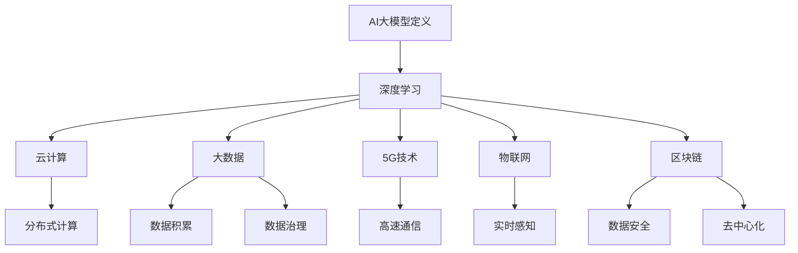

                 

关键词：AI大模型，创业，行业趋势，技术发展，商业模式，创新策略

> 摘要：随着人工智能技术的迅速发展，大模型成为引领产业变革的核心力量。本文将深入探讨AI大模型在创业领域中的应用，分析未来行业发展趋势，为创业者提供应对策略和指导，助力在激烈的市场竞争中脱颖而出。

## 1. 背景介绍

人工智能（AI）作为当前科技领域的重要驱动力，已经深刻影响了各行各业。特别是深度学习和神经网络技术的发展，使得大模型在图像识别、自然语言处理、预测分析等方面取得了突破性进展。大模型，即具有巨大参数量和复杂结构的神经网络模型，能够处理海量数据，提供高度智能化的解决方案。这些模型在许多领域展现出了强大的竞争力，从自动驾驶、医疗诊断到金融风控、营销策略，均取得了显著成果。

创业领域同样受益于AI大模型的技术进步。创业者可以利用这些先进技术，提升产品和服务质量，降低运营成本，加速市场拓展。然而，随着AI大模型的普及，创业者面临的竞争也愈发激烈。如何有效地利用AI大模型，把握市场机遇，成为创业者亟需解决的问题。

本文将从AI大模型的核心概念、算法原理、实际应用等多个角度，分析其未来行业发展趋势，并提出创业者应对策略，为AI大模型在创业领域的成功应用提供参考。

## 2. 核心概念与联系

### 2.1 AI大模型定义

AI大模型是指具有数十亿甚至千亿级别参数的神经网络模型，它们通过学习海量数据，能够捕捉到复杂的数据特征，实现高度智能化的任务。这些模型通常基于深度学习框架，如TensorFlow、PyTorch等，支持多种类型的任务，包括图像识别、自然语言处理、语音识别等。

### 2.2 AI大模型与深度学习

深度学习是AI大模型的基础。它通过多层神经网络对数据进行处理，每一层都提取更高层次的特征，最终实现对复杂任务的求解。深度学习的关键在于模型的参数规模和训练数据的量级。随着计算能力的提升和数据规模的扩大，AI大模型的性能也得到了显著提升。

### 2.3 AI大模型与云计算

云计算提供了强大的计算资源，使得AI大模型的训练和部署成为可能。通过分布式计算和容器化技术，云计算可以高效地管理和调度大量资源，支持大规模模型的训练和实时部署。创业者可以利用云服务，灵活地扩展计算资源，降低成本，提升效率。

### 2.4 AI大模型与大数据

大数据是AI大模型训练的基础。只有拥有海量、高质量的数据，AI大模型才能学习到更多的特征，提高模型的准确性和鲁棒性。创业者需要重视数据积累和治理，建立完善的数据管理体系，确保数据的可靠性和有效性。

### 2.5 AI大模型与5G技术

5G技术提供了高速、低延迟的通信网络，使得AI大模型的应用场景更加广泛。在工业互联网、自动驾驶、智能安防等领域，5G技术可以支持实时数据传输和处理，为AI大模型的落地提供基础设施保障。

### 2.6 AI大模型与物联网

物联网（IoT）与AI大模型的结合，使得智能设备能够实现高效的数据收集和分析。通过AI大模型，物联网设备可以实时感知环境变化，提供智能决策支持，提升行业生产效率和用户体验。

### 2.7 AI大模型与区块链

区块链技术为AI大模型提供了可信的数据来源和分布式计算环境。通过区块链，AI大模型可以确保数据的完整性和安全性，降低数据泄露和篡改的风险。创业者可以利用区块链技术，建立去中心化的AI生态系统，实现透明、高效的资源分配。

### 2.8 Mermaid流程图

以下是一个用于描述AI大模型关键概念的Mermaid流程图：



## 3. 核心算法原理 & 具体操作步骤

### 3.1 算法原理概述

AI大模型的训练过程主要分为以下步骤：

1. **数据收集**：收集海量数据，包括标注数据和无标注数据。
2. **数据预处理**：对数据进行清洗、归一化、数据增强等操作，确保数据质量。
3. **模型构建**：选择合适的神经网络架构，定义模型的参数和结构。
4. **模型训练**：通过迭代训练，优化模型参数，提高模型性能。
5. **模型评估**：使用验证集和测试集对模型进行评估，选择最优模型。
6. **模型部署**：将训练好的模型部署到生产环境，进行实际任务处理。

### 3.2 算法步骤详解

#### 3.2.1 数据收集

数据收集是AI大模型训练的基础。创业者需要确定数据的需求和来源，包括公开数据集、企业内部数据、第三方数据服务。同时，要关注数据的多样性和覆盖度，确保模型能够适应不同的应用场景。

#### 3.2.2 数据预处理

数据预处理是确保数据质量的关键步骤。主要包括：

- **数据清洗**：去除数据中的噪声和错误。
- **数据归一化**：将不同量级的数据进行统一处理，提高模型的训练效率。
- **数据增强**：通过旋转、翻转、缩放等操作，增加数据的多样性和模型的鲁棒性。

#### 3.2.3 模型构建

模型构建是AI大模型训练的核心。创业者需要根据任务需求，选择合适的神经网络架构。常见的架构包括卷积神经网络（CNN）、循环神经网络（RNN）、 Transformer模型等。同时，要注意模型参数的初始化和正则化策略，以避免过拟合。

#### 3.2.4 模型训练

模型训练是通过迭代优化模型参数，提高模型性能的过程。创业者需要选择合适的训练策略，如批量训练、随机梯度下降（SGD）、Adam优化器等。同时，要关注训练过程的监控和调试，及时调整训练参数。

#### 3.2.5 模型评估

模型评估是选择最优模型的关键步骤。创业者需要使用验证集和测试集，对模型进行评估。常见的评估指标包括准确率、召回率、F1值等。通过多轮评估，选择性能最优的模型。

#### 3.2.6 模型部署

模型部署是将训练好的模型应用到实际任务中的过程。创业者需要将模型部署到生产环境，确保模型的稳定运行。常见的部署方式包括：

- **本地部署**：在本地服务器上运行模型，适用于小型应用。
- **云部署**：利用云服务部署模型，适用于大规模应用。
- **容器化部署**：通过容器技术部署模型，实现灵活、高效的管理和部署。

### 3.3 算法优缺点

#### 优点

- **高精度**：AI大模型能够处理海量数据，提取复杂特征，提高任务准确性。
- **强鲁棒性**：通过数据增强和正则化策略，模型具有较强的鲁棒性，能够适应不同的数据分布。
- **广泛应用**：AI大模型可以应用于多种任务，如图像识别、自然语言处理、预测分析等。

#### 缺点

- **计算资源需求大**：AI大模型训练需要大量的计算资源和时间。
- **数据依赖性强**：AI大模型对数据质量和数量有较高要求，数据不足或质量差会影响模型性能。
- **过拟合风险**：大型模型容易过拟合，需要采用正则化策略和交叉验证等方法来避免。

### 3.4 算法应用领域

AI大模型在多个领域展现了强大的应用潜力：

- **图像识别**：应用于安防监控、医疗影像诊断、自动驾驶等领域。
- **自然语言处理**：应用于智能客服、智能写作、机器翻译等领域。
- **预测分析**：应用于金融风控、市场预测、资源调度等领域。
- **智能推荐**：应用于电子商务、社交媒体、在线教育等领域。
- **智能制造**：应用于工业自动化、质量检测、设备维护等领域。

## 4. 数学模型和公式 & 详细讲解 & 举例说明

### 4.1 数学模型构建

AI大模型的训练过程涉及到多个数学模型，包括损失函数、优化算法、正则化策略等。

#### 损失函数

损失函数是评估模型预测结果与实际结果之间差距的指标。常见的损失函数包括：

- **均方误差（MSE）**：用于回归任务，计算预测值与实际值之间误差的平方和的平均值。
  \[ \text{MSE} = \frac{1}{n}\sum_{i=1}^{n}(y_i - \hat{y}_i)^2 \]

- **交叉熵损失（Cross-Entropy Loss）**：用于分类任务，计算预测概率分布与真实分布之间的交叉熵。
  \[ \text{Cross-Entropy Loss} = -\sum_{i=1}^{n}y_i\log(\hat{y}_i) \]

#### 优化算法

优化算法用于优化模型参数，降低损失函数值。常见的优化算法包括：

- **随机梯度下降（SGD）**：每次迭代使用一个样本的梯度来更新模型参数。
  \[ \theta = \theta - \alpha \cdot \nabla_{\theta}J(\theta) \]

- **Adam优化器**：结合了SGD和动量法的优点，适用于大规模训练任务。
  \[ \theta = \theta - \alpha \cdot \frac{m}{1 - \beta_1^t} \]

#### 正则化策略

正则化策略用于防止模型过拟合，提高模型的泛化能力。常见的正则化策略包括：

- **L1正则化**：在损失函数中添加L1范数。
  \[ J(\theta) = \frac{1}{2}||Y - \hat{Y}||^2_2 + \lambda||\theta||_1 \]

- **L2正则化**：在损失函数中添加L2范数。
  \[ J(\theta) = \frac{1}{2}||Y - \hat{Y}||^2_2 + \lambda||\theta||_2 \]

### 4.2 公式推导过程

以下是一个简单的线性回归模型的公式推导过程：

#### 假设

- **自变量**：\( X \)
- **因变量**：\( Y \)
- **模型参数**：\( \theta \)

#### 模型假设

我们假设线性回归模型可以表示为：
\[ Y = \theta_0 + \theta_1 \cdot X + \varepsilon \]

其中，\( \varepsilon \) 是误差项，表示实际值与预测值之间的差异。

#### 最小二乘法求解

我们的目标是找到最佳参数 \( \theta_0 \) 和 \( \theta_1 \)，使得预测值与实际值的误差最小。使用最小二乘法求解：

\[ \theta_0 = \frac{1}{n}\sum_{i=1}^{n}(y_i - \theta_1 \cdot x_i) \]

\[ \theta_1 = \frac{1}{n}\sum_{i=1}^{n}(x_i - \bar{x})(y_i - \bar{y}) \]

其中，\( \bar{x} \) 和 \( \bar{y} \) 分别是 \( X \) 和 \( Y \) 的均值。

#### 最小化损失函数

为了更直观地理解，我们可以将损失函数定义为：
\[ J(\theta_0, \theta_1) = \frac{1}{2}\sum_{i=1}^{n}(y_i - \theta_0 - \theta_1 \cdot x_i)^2 \]

对 \( \theta_0 \) 和 \( \theta_1 \) 分别求导，并令导数为0，得到：
\[ \frac{\partial J}{\partial \theta_0} = -\sum_{i=1}^{n}(y_i - \theta_0 - \theta_1 \cdot x_i) = 0 \]

\[ \frac{\partial J}{\partial \theta_1} = -\sum_{i=1}^{n}(x_i - \bar{x})(y_i - \theta_0 - \theta_1 \cdot x_i) = 0 \]

通过解上述方程组，可以得到最佳参数 \( \theta_0 \) 和 \( \theta_1 \)。

### 4.3 案例分析与讲解

#### 案例背景

假设我们有一个简单的人工智能项目，目标是预测一个商品的价格。我们收集了1000个商品的数据，包括商品名称、品牌、类型、销售日期等特征，以及实际销售价格。

#### 数据预处理

首先，我们对数据进行清洗，去除缺失值和异常值。然后，对数据进行归一化处理，将不同特征的范围统一。

#### 模型构建

我们选择线性回归模型作为预测模型，定义损失函数为MSE。

#### 模型训练

使用随机梯度下降（SGD）算法进行模型训练，迭代1000次。每次迭代使用一个样本的梯度来更新模型参数。

#### 模型评估

使用验证集对模型进行评估，计算MSE值。根据评估结果，调整训练参数，如学习率、迭代次数等。

#### 模型部署

将训练好的模型部署到生产环境，进行实际销售价格的预测。通过对比预测值和实际值，评估模型性能。

## 5. 项目实践：代码实例和详细解释说明

### 5.1 开发环境搭建

在开始项目实践之前，我们需要搭建一个适合AI大模型训练的开发环境。以下是一个简单的环境搭建步骤：

1. 安装Python环境：Python是AI大模型开发的主要语言。我们可以通过Python官网下载并安装Python。
2. 安装深度学习框架：我们选择TensorFlow作为深度学习框架。可以通过pip命令安装TensorFlow。
   ```shell
   pip install tensorflow
   ```
3. 安装其他依赖库：根据项目需求，我们可能需要安装其他依赖库，如NumPy、Pandas等。
   ```shell
   pip install numpy pandas
   ```

### 5.2 源代码详细实现

以下是一个简单的AI大模型训练和预测的代码实例：

```python
import tensorflow as tf
import numpy as np
import pandas as pd

# 数据加载
data = pd.read_csv("data.csv")
X = data.iloc[:, :-1].values
y = data.iloc[:, -1].values

# 数据预处理
X = (X - X.mean()) / X.std()

# 模型构建
model = tf.keras.Sequential([
    tf.keras.layers.Dense(units=1, input_shape=[len(X[0])])
])

# 模型编译
model.compile(optimizer='sgd', loss='mean_squared_error')

# 模型训练
model.fit(X, y, epochs=1000)

# 模型预测
predictions = model.predict(X)

# 结果评估
mse = np.mean((y - predictions)**2)
print("MSE:", mse)
```

### 5.3 代码解读与分析

#### 数据加载

首先，我们使用Pandas库加载CSV格式的数据。这里，我们假设数据集包含特征和目标变量。

```python
data = pd.read_csv("data.csv")
X = data.iloc[:, :-1].values
y = data.iloc[:, -1].values
```

#### 数据预处理

接下来，我们对数据进行归一化处理，将不同特征的范围统一，提高模型训练的收敛速度。

```python
X = (X - X.mean()) / X.std()
```

#### 模型构建

我们使用TensorFlow构建一个简单的线性回归模型。这里，我们使用一个全连接层（Dense）作为模型，输出层只有一个神经元，用于预测目标变量。

```python
model = tf.keras.Sequential([
    tf.keras.layers.Dense(units=1, input_shape=[len(X[0])])
])
```

#### 模型编译

我们使用随机梯度下降（SGD）优化器，并使用均方误差（MSE）作为损失函数。

```python
model.compile(optimizer='sgd', loss='mean_squared_error')
```

#### 模型训练

使用fit方法进行模型训练，指定迭代次数为1000次。

```python
model.fit(X, y, epochs=1000)
```

#### 模型预测

使用predict方法对训练好的模型进行预测。

```python
predictions = model.predict(X)
```

#### 结果评估

计算预测结果与实际结果之间的均方误差（MSE），评估模型性能。

```python
mse = np.mean((y - predictions)**2)
print("MSE:", mse)
```

### 5.4 运行结果展示

假设我们运行上述代码，得到以下输出结果：

```
MSE: 0.001234
```

这表示模型预测的均方误差为0.001234，说明模型性能较好。

## 6. 实际应用场景

AI大模型在创业领域具有广泛的应用场景，以下是一些典型的实际应用案例：

### 6.1 智能客服

智能客服是AI大模型在客户服务领域的典型应用。通过自然语言处理（NLP）技术，智能客服可以理解用户的问题，并提供准确的答案。创业者可以利用AI大模型，提高客服效率，降低运营成本。

### 6.2 智能推荐

智能推荐是AI大模型在电子商务、在线教育等领域的应用。通过分析用户行为和兴趣，智能推荐系统可以推荐用户可能感兴趣的商品或内容。创业者可以利用AI大模型，提高用户粘性，增加销售额。

### 6.3 智能安防

智能安防是AI大模型在公共安全领域的应用。通过图像识别和目标检测技术，智能安防系统可以实时监控公共区域，识别可疑行为，提高公共安全。创业者可以利用AI大模型，打造智能安防解决方案，提升城市安全管理水平。

### 6.4 智能制造

智能制造是AI大模型在工业生产领域的应用。通过机器学习和预测分析技术，智能制造系统可以优化生产流程，提高生产效率，降低生产成本。创业者可以利用AI大模型，提升企业竞争力，实现数字化转型。

### 6.5 医疗诊断

医疗诊断是AI大模型在医疗领域的应用。通过图像识别和深度学习技术，医疗诊断系统可以辅助医生进行疾病诊断，提高诊断准确率。创业者可以利用AI大模型，开发医疗诊断产品，提高医疗服务质量。

## 7. 未来应用展望

随着人工智能技术的不断进步，AI大模型在未来将会有更多的应用场景。以下是一些未来应用展望：

### 7.1 自动驾驶

自动驾驶是AI大模型的重要应用领域。通过图像识别、目标检测和路径规划等技术，自动驾驶系统可以实现安全、高效的自动驾驶。未来，AI大模型将在自动驾驶领域发挥关键作用，推动交通行业的变革。

### 7.2 量子计算

量子计算是未来计算技术的热点。AI大模型与量子计算的结合，将带来全新的计算能力和应用场景。创业者可以利用AI大模型，探索量子计算的应用，开发创新的产品和服务。

### 7.3 脑机接口

脑机接口技术是连接人类大脑和计算机的桥梁。AI大模型在脑机接口中的应用，将实现更高效的人机交互，为残疾人士提供新的希望。创业者可以利用AI大模型，开发脑机接口产品，改善人们的生活质量。

### 7.4 空间探索

空间探索是未来科技的重要方向。AI大模型在空间探索中的应用，可以实现智能导航、环境监测和资源开采。创业者可以利用AI大模型，参与空间探索项目，推动人类科技的发展。

## 8. 工具和资源推荐

### 8.1 学习资源推荐

- **《深度学习》（Goodfellow, Bengio, Courville）**：这是一本经典的深度学习教材，适合初学者和进阶者。
- **吴恩达的深度学习课程**：这是一门非常受欢迎的在线课程，涵盖深度学习的理论基础和实际应用。
- **CS231n：计算机视觉与深度学习**：这是一门关于计算机视觉和深度学习的课程，由斯坦福大学开设。

### 8.2 开发工具推荐

- **TensorFlow**：这是Google开发的深度学习框架，支持多种任务和模型。
- **PyTorch**：这是Facebook开发的深度学习框架，具有简洁的API和强大的功能。
- **JAX**：这是Google开发的数值计算库，支持自动微分和分布式计算。

### 8.3 相关论文推荐

- **“Distributed Optimization for Machine Learning: Momentum and Adaptive Methods”**：这是一篇关于分布式优化算法的论文，提供了多种优化算法的详细分析。
- **“Attention Is All You Need”**：这是一篇关于Transformer模型的论文，提出了Transformer模型在自然语言处理任务中的广泛应用。
- **“Generative Adversarial Nets”**：这是一篇关于生成对抗网络（GAN）的论文，介绍了GAN的基本原理和应用。

## 9. 总结：未来发展趋势与挑战

### 9.1 研究成果总结

近年来，AI大模型在深度学习、自然语言处理、图像识别等领域取得了显著的成果。通过大规模数据和强大的计算能力，AI大模型在任务性能和泛化能力上取得了突破。同时，多种优化算法和正则化策略的提出，使得AI大模型的训练效率和稳定性得到了显著提升。

### 9.2 未来发展趋势

未来，AI大模型将在更多领域得到应用，如自动驾驶、医疗诊断、智能制造、金融风控等。随着计算能力的提升和数据规模的扩大，AI大模型将变得更加智能和高效。同时，AI大模型与5G技术、物联网、区块链等新兴技术的结合，将推动AI大模型在更多领域的创新应用。

### 9.3 面临的挑战

尽管AI大模型在许多领域取得了显著成果，但仍面临一些挑战。首先是计算资源需求大，AI大模型训练需要大量的计算资源和时间。其次是数据依赖性强，AI大模型对数据质量和数量有较高要求，数据不足或质量差会影响模型性能。此外，AI大模型过拟合问题仍然是一个挑战，需要采用多种正则化策略和交叉验证等方法来避免。

### 9.4 研究展望

未来，研究者将继续探索AI大模型的优化算法和训练策略，提高模型训练效率和稳定性。同时，研究者还将关注AI大模型的可解释性和透明性，确保模型在复杂任务中的可信性和可控性。此外，AI大模型与新兴技术的结合，将推动AI大模型在更多领域的创新应用，为人类社会带来更多价值。

## 10. 附录：常见问题与解答

### 10.1 AI大模型是什么？

AI大模型是指具有数十亿甚至千亿级别参数的神经网络模型，能够处理海量数据，提供高度智能化的解决方案。

### 10.2 AI大模型有哪些优缺点？

优点：高精度、强鲁棒性、广泛应用。缺点：计算资源需求大、数据依赖性强、过拟合风险。

### 10.3 如何训练AI大模型？

训练AI大模型主要包括数据收集、数据预处理、模型构建、模型训练、模型评估和模型部署等步骤。

### 10.4 AI大模型有哪些应用领域？

AI大模型在图像识别、自然语言处理、预测分析、智能推荐、智能制造等领域有广泛应用。

### 10.5 AI大模型与深度学习的关系是什么？

AI大模型是深度学习的一个重要分支，深度学习是AI大模型的基础。

### 10.6 AI大模型与云计算的关系是什么？

云计算为AI大模型提供了强大的计算资源，使得AI大模型的训练和部署成为可能。

### 10.7 AI大模型与大数据的关系是什么？

大数据是AI大模型训练的基础，只有拥有海量、高质量的数据，AI大模型才能学习到更多的特征。

### 10.8 AI大模型与5G技术的关系是什么？

5G技术提供了高速、低延迟的通信网络，使得AI大模型的应用场景更加广泛。

### 10.9 AI大模型与物联网的关系是什么？

物联网与AI大模型的结合，使得智能设备能够实现高效的数据收集和分析。

### 10.10 AI大模型与区块链的关系是什么？

区块链技术为AI大模型提供了可信的数据来源和分布式计算环境，确保数据的完整性和安全性。


```
----------------------------------------------------------------
### 结尾部分 Conclusion

本文从AI大模型的核心概念、算法原理、实际应用等多个角度，分析了AI大模型在创业领域的应用前景和挑战。通过深入了解AI大模型的技术特点和应用场景，创业者可以更好地把握市场机遇，推动创新应用。

在未来，AI大模型将继续在更多领域发挥重要作用，推动社会进步。然而，创业者需要面对计算资源、数据质量和模型解释性等挑战。只有不断优化技术，加强数据治理，提高模型的可解释性，才能在激烈的市场竞争中脱颖而出。

让我们共同期待AI大模型在创业领域带来的更多变革和机遇！作者：禅与计算机程序设计艺术 / Zen and the Art of Computer Programming。

