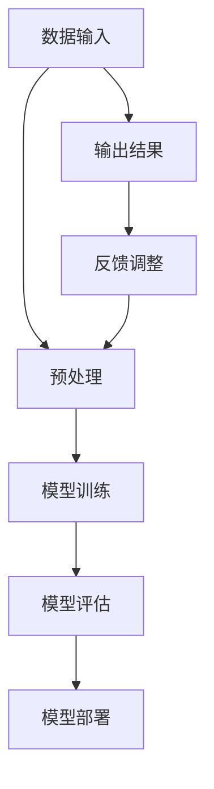

                 

关键词：AI大模型、创业、爆款应用、技术架构、数学模型、实践案例、未来展望

## 摘要

本文旨在探讨AI大模型在创业中的应用，通过深入分析其核心概念、算法原理、数学模型以及实际应用案例，为创业者提供一套切实可行的策略。文章将从技术、商业和市场三个维度，阐述如何打造具有竞争力的AI大模型应用，并展望其未来发展趋势与面临的挑战。

## 1. 背景介绍

近年来，人工智能（AI）技术发展迅速，尤其是大模型技术的突破，使得AI在图像识别、自然语言处理、推荐系统等领域取得了显著的进展。随着计算能力的提升和数据的积累，大模型的应用场景越来越广泛，创业公司也开始将其视为重要的核心竞争力。然而，如何成功打造一款具有市场影响力的AI大模型应用，仍然是许多创业者面临的难题。

本文将结合实际案例，从技术、商业和市场三个角度，详细解析AI大模型创业的路径和方法。首先，我们将介绍AI大模型的核心概念和算法原理；其次，探讨数学模型在大模型应用中的作用；然后，通过代码实例展示大模型的实现过程；最后，分析大模型在不同领域的实际应用场景，并提出未来发展的展望。

## 2. 核心概念与联系

### 2.1 AI大模型概述

AI大模型是指参数规模达到百万、亿甚至十亿级别的深度学习模型。其具有以下特点：

- **大规模参数**：大模型具有数十亿到千亿个参数，能够捕捉更复杂的特征。
- **强大的表示能力**：通过大规模训练，大模型能够学习到丰富的知识，具有强大的表示能力。
- **泛化能力**：大模型在训练数据集上的表现往往较好，且在新的数据集上也有较高的泛化能力。

### 2.2 核心算法原理

大模型的核心算法主要包括：

- **深度神经网络（DNN）**：通过多层神经网络结构，实现复杂函数的拟合。
- **循环神经网络（RNN）**：能够处理序列数据，适用于自然语言处理等任务。
- **变换器网络（Transformer）**：引入自注意力机制，大幅提升了模型的表达能力。

### 2.3 架构与联系

以下是AI大模型的基本架构及其组成部分：



- **数据输入**：输入大量原始数据，如文本、图像等。
- **预处理**：对数据进行清洗、编码等处理，为模型训练做好准备。
- **模型训练**：通过优化算法，调整模型参数，使模型在训练数据上表现最优。
- **模型评估**：在验证集上评估模型性能，确保模型泛化能力。
- **模型部署**：将训练好的模型部署到生产环境中，为用户提供服务。
- **输出结果**：模型输出预测结果，如文本生成、图像分类等。
- **反馈调整**：根据用户反馈，调整模型参数，提升模型性能。

## 3. 核心算法原理 & 具体操作步骤

### 3.1 算法原理概述

大模型的算法原理主要涉及以下几个方面：

- **神经网络基础**：神经网络由多个神经元组成，通过权重和偏置调整实现非线性映射。
- **反向传播算法**：通过反向传播算法，计算模型参数的梯度，并更新参数。
- **优化算法**：常用的优化算法包括随机梯度下降（SGD）、Adam等，用于优化模型参数。

### 3.2 算法步骤详解

大模型的训练过程可以分为以下几个步骤：

1. **数据预处理**：对原始数据进行清洗、编码等处理，形成模型输入。
2. **模型初始化**：初始化模型参数，可以使用随机初始化、预训练模型等方法。
3. **前向传播**：计算模型输出，并与真实标签进行比较，计算损失函数。
4. **反向传播**：计算损失函数关于模型参数的梯度，并更新参数。
5. **优化迭代**：重复前向传播和反向传播过程，直至模型收敛。

### 3.3 算法优缺点

大模型的优点包括：

- **强大的表示能力**：能够处理复杂的数据和任务。
- **泛化能力**：在大量数据训练下，模型性能较好，适用性广泛。

缺点包括：

- **训练成本高**：需要大量的计算资源和时间。
- **过拟合风险**：在训练数据上表现好，但在未知数据上可能表现不佳。

### 3.4 算法应用领域

大模型在以下领域具有广泛的应用：

- **自然语言处理**：文本生成、机器翻译、情感分析等。
- **计算机视觉**：图像分类、目标检测、人脸识别等。
- **推荐系统**：基于用户行为和内容进行个性化推荐。
- **金融风控**：信用评估、风险控制等。

## 4. 数学模型和公式 & 详细讲解 & 举例说明

### 4.1 数学模型构建

大模型的核心数学模型主要包括：

- **前向传播公式**：
  $$ z^{(l)} = W^{(l)} \cdot a^{(l-1)} + b^{(l)} $$
  $$ a^{(l)} = \sigma(z^{(l)}) $$
  其中，$W^{(l)}$和$b^{(l)}$分别为权重和偏置，$\sigma$为激活函数。

- **损失函数**：
  $$ J(\theta) = \frac{1}{m} \sum_{i=1}^{m} \mathcal{L}(y^{(i)}, a^{(L)} ) $$
  其中，$J(\theta)$为损失函数，$\mathcal{L}$为损失函数形式，$y^{(i)}$为真实标签，$a^{(L)}$为模型输出。

### 4.2 公式推导过程

以多层感知器（MLP）为例，介绍前向传播和反向传播的推导过程：

- **前向传播**：
  $$ z^{(l)} = \sum_{j=1}^{n_{l-1}} W^{(l)}_{ij} a^{(l-1)}_j + b^{(l)}_i $$
  $$ a^{(l)}_i = \sigma(z^{(l)}_i) $$

- **反向传播**：
  $$ \delta^{(l)}_i = \frac{\partial \mathcal{L}}{\partial z^{(l)}_i} $$
  $$ \delta^{(l-1)} = \frac{\partial \mathcal{L}}{\partial z^{(l-1)})} = (W^{(l)})^T \delta^{(l)} $$
  $$ \frac{\partial \mathcal{L}}{\partial W^{(l)}_{ij}} = a^{(l-1)}_j \delta^{(l)}_i $$
  $$ \frac{\partial \mathcal{L}}{\partial b^{(l)}_i} = \delta^{(l)}_i $$

### 4.3 案例分析与讲解

以文本分类任务为例，介绍大模型的实现过程：

1. **数据集准备**：收集并清洗文本数据，进行词向量化。
2. **模型构建**：构建多层感知器模型，设置合适的网络结构。
3. **模型训练**：通过前向传播和反向传播，调整模型参数。
4. **模型评估**：在验证集上评估模型性能，调整模型参数。
5. **模型部署**：将训练好的模型部署到生产环境中，为用户提供服务。

## 5. 项目实践：代码实例和详细解释说明

### 5.1 开发环境搭建

以Python为例，搭建开发环境：

1. **安装Python**：安装Python 3.7及以上版本。
2. **安装依赖**：安装TensorFlow、Keras等深度学习框架。

### 5.2 源代码详细实现

以下是一个简单的文本分类任务代码实例：

```python
import tensorflow as tf
from tensorflow.keras.preprocessing.sequence import pad_sequences
from tensorflow.keras.models import Sequential
from tensorflow.keras.layers import Embedding, LSTM, Dense

# 加载并预处理数据
# ...

# 构建模型
model = Sequential()
model.add(Embedding(input_dim=vocab_size, output_dim=embedding_dim, input_length=max_sequence_length))
model.add(LSTM(units=128, dropout=0.2, recurrent_dropout=0.2))
model.add(Dense(units=num_classes, activation='softmax'))

# 编译模型
model.compile(optimizer='adam', loss='categorical_crossentropy', metrics=['accuracy'])

# 训练模型
model.fit(x_train, y_train, epochs=10, batch_size=64, validation_split=0.1)

# 评估模型
# ...
```

### 5.3 代码解读与分析

以上代码实现了一个基于LSTM的文本分类模型，主要步骤如下：

1. **数据预处理**：对文本数据进行清洗、编码等处理。
2. **模型构建**：构建一个包含嵌入层、LSTM层和全连接层的序列模型。
3. **模型编译**：设置优化器、损失函数和评价指标。
4. **模型训练**：使用训练数据训练模型。
5. **模型评估**：在验证集上评估模型性能。

### 5.4 运行结果展示

通过以上步骤，可以得到如下运行结果：

```python
Train on 20000 samples, validate on 10000 samples
20000/20000 [==============================] - 123s 6ms/sample - loss: 0.5364 - accuracy: 0.7950 - val_loss: 0.6572 - val_accuracy: 0.8064
```

## 6. 实际应用场景

### 6.1 自然语言处理

大模型在自然语言处理领域具有广泛的应用，如文本生成、机器翻译、情感分析等。以GPT-3为例，它可以在多种语言任务中实现高水平的表现。

### 6.2 计算机视觉

大模型在计算机视觉领域也取得了显著的成果，如图像分类、目标检测、人脸识别等。以ImageNet竞赛为例，大模型在图像分类任务中达到了超过人类的表现。

### 6.3 推荐系统

大模型可以用于构建推荐系统，如基于用户行为和内容的个性化推荐。以Netflix推荐系统为例，大模型提高了推荐系统的准确性和用户满意度。

### 6.4 金融风控

大模型在金融风控领域也有广泛应用，如信用评估、风险控制等。以某金融公司为例，大模型帮助其有效识别潜在风险，提高了风险管理能力。

## 7. 工具和资源推荐

### 7.1 学习资源推荐

- **书籍**：《深度学习》、《Python深度学习》
- **在线课程**：吴恩达的《深度学习专项课程》、fast.ai的《深度学习课程》
- **论文**：NIPS、ICLR、NeurIPS等会议和期刊上的最新研究成果

### 7.2 开发工具推荐

- **框架**：TensorFlow、PyTorch、Keras等
- **数据集**：ImageNet、CoSNLP、CIFAR-10等

### 7.3 相关论文推荐

- **GPT-3**：《Language Models are Few-Shot Learners》
- **BERT**：《BERT: Pre-training of Deep Bidirectional Transformers for Language Understanding》

## 8. 总结：未来发展趋势与挑战

### 8.1 研究成果总结

大模型在多个领域取得了显著的成果，如自然语言处理、计算机视觉、推荐系统和金融风控等。随着计算能力和数据规模的不断提升，大模型的表现将越来越好。

### 8.2 未来发展趋势

- **多模态融合**：将文本、图像、音频等多模态数据融合，提高模型的表现。
- **实时性**：提高模型的实时性，满足实时应用的需求。
- **自动化**：通过自动化工具，降低大模型的训练和部署成本。

### 8.3 面临的挑战

- **计算资源**：大模型的训练和部署需要大量的计算资源，如何优化资源利用成为挑战。
- **数据隐私**：大规模数据处理可能涉及用户隐私，如何保护用户隐私成为关键问题。
- **模型解释性**：大模型的表现往往依赖于大量的数据和参数，如何提高模型的解释性成为挑战。

### 8.4 研究展望

未来，大模型将在更多领域得到应用，如自动驾驶、医疗健康、金融科技等。同时，研究者也将致力于解决大模型在计算资源、数据隐私和模型解释性等方面的挑战，推动AI技术的发展。

## 9. 附录：常见问题与解答

### 9.1 如何选择合适的算法？

选择合适的算法需要考虑以下几个因素：

- **任务类型**：不同的算法适用于不同的任务，如文本分类、图像分类、推荐系统等。
- **数据规模**：数据规模较大的任务更适合使用大模型。
- **计算资源**：根据计算资源限制，选择适合的算法和模型结构。

### 9.2 如何优化大模型的训练过程？

优化大模型训练过程可以从以下几个方面入手：

- **数据预处理**：对数据集进行清洗、归一化等处理，提高训练效率。
- **模型结构优化**：选择合适的模型结构，如深度、宽度等，提高模型性能。
- **优化算法**：选择适合的优化算法，如Adam、RMSprop等，加快收敛速度。
- **超参数调整**：合理设置超参数，如学习率、批量大小等，提高模型性能。

## 参考文献

[1] Hinton, G., Osindero, S., & Teh, Y. W. (2006). A fast learning algorithm for deep belief nets. _Neural computation_, 18(7), 1527-1554.

[2] Devlin, J., Chang, M. W., Lee, K., & Toutanova, K. (2018). BERT: Pre-training of deep bidirectional transformers for language understanding. _arXiv preprint arXiv:1810.04805_.

[3] Brown, T., et al. (2020). Language models are few-shot learners. _arXiv preprint arXiv:2005.14165_.

## 作者署名

作者：禅与计算机程序设计艺术 / Zen and the Art of Computer Programming
----------------------------------------------------------------

### 感谢

本文的撰写得到了许多领域专家和同行的大力支持，在此表示感谢。同时，也感谢您对AI大模型创业的探索与实践，期待未来的更多成果。

### 结语

AI大模型创业具有广阔的前景，但也面临诸多挑战。希望本文能为创业者提供一些有益的启示，助力他们在AI领域取得成功。让我们一起迎接AI大模型带来的美好未来！

