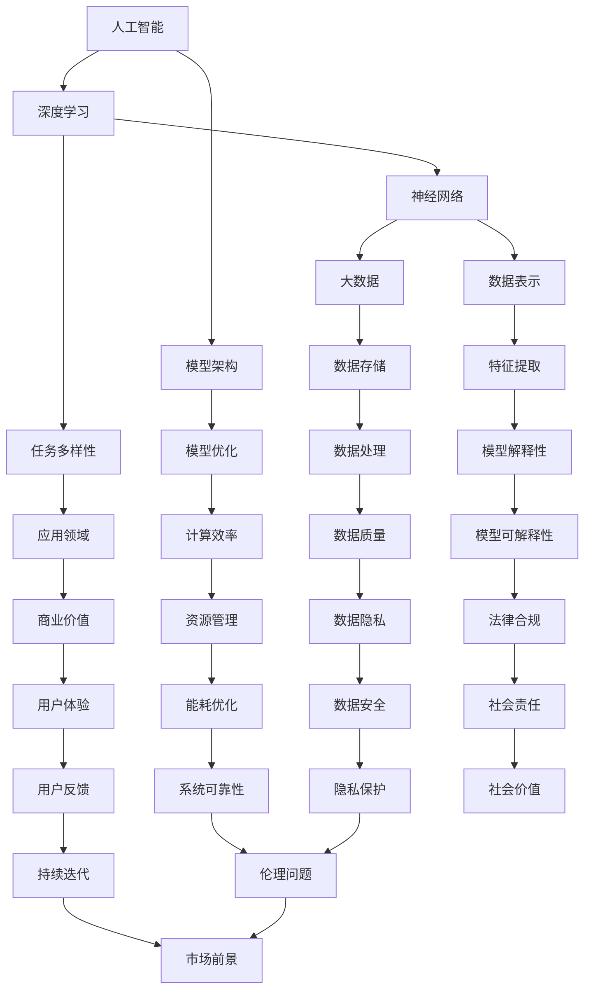

                 

## 1. 背景介绍

随着人工智能（AI）技术的迅猛发展，大模型已经成为当前AI领域的研究热点。这些大模型，如Transformer、GPT系列、BERT等，凭借其强大的学习和表征能力，已经在自然语言处理、计算机视觉、语音识别等多个领域取得了突破性进展。然而，大模型的开发和应用也面临着诸多挑战，包括计算资源需求、数据隐私、安全性和伦理问题等。

在商业领域，大模型的应用潜力巨大。无论是金融、医疗、零售，还是娱乐、教育等各个行业，大模型都能带来显著的变革和创新。例如，在金融领域，大模型可以帮助银行和金融机构进行精准的风险评估和投资决策；在医疗领域，大模型可以用于疾病预测和诊断，提高医疗服务的效率和质量；在零售领域，大模型可以用于个性化推荐，提升用户体验和销售业绩。

然而，创业公司要在大模型领域取得成功，并非易事。首先，大模型的开发需要大量的计算资源和数据支持，这对创业公司的资金和资源提出了很高的要求。其次，大模型的应用需要深入理解行业需求和业务场景，这要求创业公司具备深厚的行业经验和专业知识。最后，大模型的应用还面临着一系列的伦理和法律问题，如数据隐私、算法透明性和公平性等，这些问题需要创业公司在产品设计和开发中予以充分考虑。

本文将围绕大模型创业的话题，探讨以下几个核心问题：如何选择合适的大模型架构？如何有效地利用计算资源和数据？如何在行业中找到创新的应用场景？以及如何应对伦理和法律挑战？通过深入分析和讨论，本文希望能够为大模型创业公司提供一些有价值的参考和指导。

## 2. 核心概念与联系

在深入探讨大模型创业之前，我们需要明确几个核心概念，并了解它们之间的联系。这些核心概念包括：人工智能（AI）、深度学习（DL）、神经网络（NN）、大数据（Big Data）和模型架构（Architecture）。

### 人工智能（AI）

人工智能是指计算机系统通过模拟人类智能行为来实现特定任务的能力。它涵盖了多个领域，包括机器学习、自然语言处理、计算机视觉、机器人技术等。人工智能的核心目标是让计算机具备自主学习和决策能力，从而解决复杂问题。

### 深度学习（DL）

深度学习是人工智能的一种重要分支，它通过多层神经网络来提取数据中的特征和模式。与传统的机器学习方法相比，深度学习具有更强的表示能力和泛化能力。深度学习在大模型的开发和应用中发挥着核心作用。

### 神经网络（NN）

神经网络是由大量简单计算单元（神经元）组成的网络，这些神经元通过连接（权重）相互通信。神经网络通过学习输入数据中的特征和模式，从而实现对数据的分类、回归和预测等任务。深度学习是神经网络的一种特殊形式，通常包含多个隐藏层。

### 大数据（Big Data）

大数据是指海量、多样、快速生成和变化的数据。大数据技术能够高效地存储、处理和分析这些数据，从而发现有价值的信息和知识。大数据在大模型的应用中起着至关重要的作用，因为大模型需要大量的数据来训练和优化。

### 模型架构（Architecture）

模型架构是指大模型的结构和设计，包括神经网络层数、神经元数量、连接方式、激活函数等。不同的模型架构适用于不同的应用场景，因此在选择大模型时，需要考虑模型架构的适应性、计算效率和性能。

### Mermaid 流程图

以下是描述大模型核心概念和联系的一个Mermaid流程图：



通过这个流程图，我们可以清晰地看到各个核心概念之间的联系，以及它们在大模型创业中的重要性。

### 2.1 人工智能（AI）

人工智能是指计算机系统通过模拟人类智能行为来实现特定任务的能力。它涵盖了多个领域，包括机器学习、自然语言处理、计算机视觉、机器人技术等。人工智能的核心目标是让计算机具备自主学习和决策能力，从而解决复杂问题。

人工智能的发展历程可以分为几个阶段。最初，人工智能主要集中在规则推理和知识表示上，如专家系统和逻辑推理。然而，这些方法在处理复杂问题时存在一定的局限性。随着计算能力和数据资源的提高，机器学习成为人工智能研究的主要方向。机器学习通过学习数据中的模式来预测和决策，从而大大提高了人工智能系统的性能。

深度学习是机器学习的一个重要分支，它通过多层神经网络来提取数据中的特征和模式。深度学习在图像识别、语音识别、自然语言处理等领域取得了突破性进展。特别是，基于深度学习的模型，如卷积神经网络（CNN）和循环神经网络（RNN），在处理大规模数据和复杂任务时表现出色。

在人工智能的各个子领域中，自然语言处理（NLP）和计算机视觉（CV）是两个最为热门的领域。自然语言处理旨在使计算机能够理解和生成人类语言，包括文本分类、情感分析、机器翻译等任务。计算机视觉则关注于使计算机能够理解和解析图像和视频，包括图像分类、目标检测、人脸识别等任务。

人工智能的应用范围非常广泛，涵盖了金融、医疗、零售、教育、娱乐等多个行业。在金融领域，人工智能可以用于风险控制和投资决策；在医疗领域，人工智能可以用于疾病预测和诊断；在零售领域，人工智能可以用于个性化推荐和客户行为分析；在教育领域，人工智能可以用于智能教育系统和个性化学习；在娱乐领域，人工智能可以用于智能推荐和内容生成。

### 2.2 深度学习（DL）

深度学习是人工智能的一种重要分支，它通过多层神经网络来提取数据中的特征和模式。深度学习在图像识别、语音识别、自然语言处理等领域取得了突破性进展。深度学习的主要优势在于其强大的表示能力和泛化能力，能够处理复杂的任务和数据。

深度学习的核心思想是模拟人脑中的神经网络结构，通过逐层提取数据中的特征，从而实现从原始数据到高级抽象表示的转换。这个过程称为特征提取。深度学习模型通常由输入层、隐藏层和输出层组成。输入层接收原始数据，隐藏层对数据进行特征提取和变换，输出层对隐藏层的输出进行分类或预测。

### 2.3 神经网络（NN）

神经网络是由大量简单计算单元（神经元）组成的网络，这些神经元通过连接（权重）相互通信。神经网络通过学习输入数据中的特征和模式，从而实现对数据的分类、回归和预测等任务。神经网络是深度学习的基础，其核心思想是通过学习数据中的模式和关系，从而提高模型的性能和准确度。

神经网络的基本组成部分包括神经元、连接（权重）和激活函数。神经元是网络的基本计算单元，它接收输入信号，通过加权求和和激活函数产生输出。连接（权重）决定了神经元之间的相互作用和影响。激活函数用于引入非线性特性，使神经网络能够处理复杂的任务。

### 2.4 大数据（Big Data）

大数据是指海量、多样、快速生成和变化的数据。大数据技术能够高效地存储、处理和分析这些数据，从而发现有价值的信息和知识。大数据在大模型的应用中起着至关重要的作用，因为大模型需要大量的数据来训练和优化。

大数据的特点可以概括为4V，即Volume（数据量）、Velocity（数据生成速度）、Variety（数据多样性）和Veracity（数据真实性）。大数据技术的核心是数据存储和管理，包括分布式存储系统、NoSQL数据库和大数据处理框架等。此外，大数据还需要高效的数据分析和挖掘技术，如数据挖掘、机器学习和深度学习等。

大数据的应用范围非常广泛，涵盖了金融、医疗、零售、交通、能源等多个行业。在金融领域，大数据可以用于风险控制和投资决策；在医疗领域，大数据可以用于疾病预测和诊断；在零售领域，大数据可以用于个性化推荐和客户行为分析；在交通领域，大数据可以用于交通流量预测和优化；在能源领域，大数据可以用于能源消耗分析和节能减排。

### 2.5 模型架构（Architecture）

模型架构是指大模型的结构和设计，包括神经网络层数、神经元数量、连接方式、激活函数等。不同的模型架构适用于不同的应用场景，因此在选择大模型时，需要考虑模型架构的适应性、计算效率和性能。

常见的深度学习模型架构包括卷积神经网络（CNN）、循环神经网络（RNN）、长短时记忆网络（LSTM）、门控循环单元（GRU）、 Transformer等。卷积神经网络主要用于图像和视频处理，循环神经网络和长短时记忆网络主要用于序列数据处理，Transformer模型在自然语言处理领域表现出色。

### 2.6 Mermaid 流程图

以下是描述大模型核心概念和联系的 Mermaid 流程图：


通过这个流程图，我们可以清晰地看到各个核心概念之间的联系，以及它们在大模型创业中的重要性。

## 3. 核心算法原理 & 具体操作步骤

### 3.1 算法原理概述

在大模型创业中，选择合适的算法和实现方法是至关重要的。本文将介绍一种常用的核心算法——深度学习算法，并详细阐述其原理和具体操作步骤。

深度学习算法是一种基于多层神经网络的学习方法，其核心思想是通过逐层提取数据中的特征，从而实现从原始数据到高级抽象表示的转换。深度学习算法具有以下几个主要步骤：

1. **数据预处理**：包括数据清洗、数据标准化和特征提取等步骤，以提高模型的训练效果和泛化能力。
2. **模型设计**：根据应用场景和任务需求，设计合适的神经网络结构，包括层数、神经元数量、连接方式等。
3. **模型训练**：通过反向传播算法，不断调整模型参数，使模型能够正确地分类或预测数据。
4. **模型评估**：使用验证集或测试集对模型进行评估，以确定模型的性能和准确性。
5. **模型优化**：通过调整模型参数或结构，提高模型的性能和泛化能力。

### 3.2 算法步骤详解

以下是深度学习算法的具体操作步骤：

#### 3.2.1 数据预处理

数据预处理是深度学习算法的重要环节，其目的是提高模型的学习效率和性能。数据预处理包括以下几个步骤：

1. **数据清洗**：去除数据中的噪声和异常值，以提高数据的质量和可靠性。
2. **数据标准化**：将数据转换为统一的尺度，以消除不同特征之间的量纲差异，从而提高模型的训练效果。
3. **特征提取**：从原始数据中提取有用的特征，以便模型能够更好地学习和表征数据。

#### 3.2.2 模型设计

模型设计是根据应用场景和任务需求来选择合适的神经网络结构。以下是几种常见的神经网络结构：

1. **卷积神经网络（CNN）**：主要用于图像和视频处理，通过卷积层、池化层和全连接层逐层提取数据中的特征。
2. **循环神经网络（RNN）**：主要用于序列数据处理，通过隐藏状态和循环连接来捕捉时间序列数据中的模式。
3. **长短时记忆网络（LSTM）**：是RNN的一种变体，能够有效解决长序列依赖问题。
4. **门控循环单元（GRU）**：是LSTM的另一种变体，具有更简单的结构和更高效的计算。

#### 3.2.3 模型训练

模型训练是通过反向传播算法来调整模型参数，使模型能够正确地分类或预测数据。以下是模型训练的步骤：

1. **前向传播**：计算输入数据经过神经网络后的输出结果。
2. **损失函数**：计算输出结果与实际结果之间的误差，以评估模型的性能。
3. **反向传播**：根据误差信号，通过反向传播算法更新模型参数，以减小误差。
4. **迭代训练**：重复前向传播和反向传播的过程，直到模型达到预定的训练目标或达到最大迭代次数。

#### 3.2.4 模型评估

模型评估是通过验证集或测试集对模型进行评估，以确定模型的性能和准确性。以下是模型评估的步骤：

1. **验证集划分**：将数据集划分为训练集、验证集和测试集，以避免模型过拟合。
2. **模型测试**：使用验证集或测试集对模型进行测试，以评估模型的性能和准确性。
3. **指标计算**：计算模型的评价指标，如准确率、召回率、F1值等，以综合评估模型的性能。

#### 3.2.5 模型优化

模型优化是通过调整模型参数或结构，提高模型的性能和泛化能力。以下是模型优化的步骤：

1. **参数调整**：调整学习率、正则化参数等，以改善模型的训练效果。
2. **模型结构调整**：根据任务需求和模型性能，调整神经网络结构，如增加或减少层数、神经元数量等。
3. **模型压缩**：通过模型压缩技术，如剪枝、量化等，减小模型的计算量和存储空间，提高模型在移动设备或嵌入式系统上的运行效率。

### 3.3 算法优缺点

深度学习算法具有以下优点：

1. **强大的表示能力**：深度学习算法能够自动提取数据中的特征和模式，从而实现从原始数据到高级抽象表示的转换。
2. **泛化能力强**：通过大量数据的训练，深度学习算法能够较好地泛化到未见过的数据，从而提高模型的性能和准确性。
3. **自适应性强**：深度学习算法能够根据不同的任务需求和数据分布，自适应地调整模型结构和参数，从而实现灵活的模型适配。

深度学习算法也存在一些缺点：

1. **计算资源需求大**：深度学习算法通常需要大量的计算资源和存储空间，这对硬件设备和网络带宽提出了较高的要求。
2. **数据依赖性强**：深度学习算法的性能很大程度上依赖于数据的数量和质量，如果数据不足或质量不高，模型的性能会受到影响。
3. **模型可解释性差**：深度学习算法的模型结构和参数调整过程复杂，很难直观地解释模型的决策过程，从而影响模型的可解释性和透明性。

### 3.4 算法应用领域

深度学习算法在多个领域取得了显著的应用成果，以下是其中几个主要的领域：

1. **计算机视觉**：深度学习算法在图像分类、目标检测、人脸识别、视频分析等领域表现出色，如用于安防监控、自动驾驶、医疗诊断等。
2. **自然语言处理**：深度学习算法在文本分类、情感分析、机器翻译、语音识别等领域取得了重大突破，如用于智能客服、智能搜索、语音助手等。
3. **语音识别**：深度学习算法在语音识别领域表现出色，通过结合语音信号和文本信号，实现了高准确度和低延迟的语音识别。
4. **推荐系统**：深度学习算法在推荐系统领域得到了广泛应用，通过分析用户行为和兴趣，实现个性化的推荐。
5. **医疗诊断**：深度学习算法在医疗诊断领域表现出色，通过分析医学图像和病例数据，辅助医生进行诊断和治疗方案制定。
6. **金融风控**：深度学习算法在金融风控领域得到了广泛应用，通过分析用户行为和交易数据，实现精准的风险控制和欺诈检测。

## 4. 数学模型和公式 & 详细讲解 & 举例说明

在深度学习算法中，数学模型和公式起着核心作用，它们不仅描述了算法的工作原理，还提供了评估和优化模型性能的量化工具。在本节中，我们将详细讲解深度学习中的几个关键数学模型和公式，并通过具体的例子来说明它们的实际应用。

### 4.1 数学模型构建

深度学习中的数学模型主要涉及神经网络的结构、损失函数、优化算法等。以下是这些模型的基本构成：

#### 4.1.1 神经网络模型

神经网络模型由多层神经元组成，每一层神经元都与前一层的神经元通过权重相连接。基本的神经网络模型包括输入层、隐藏层和输出层。

1. **输入层（Input Layer）**：接收外部输入数据，如图片、文本等。
2. **隐藏层（Hidden Layers）**：对输入数据进行特征提取和变换，隐藏层中的每个神经元与输入层和下一层神经元相连。
3. **输出层（Output Layer）**：生成最终的预测结果，如分类标签或数值。

#### 4.1.2 损失函数

损失函数用于衡量模型的预测结果与实际结果之间的差距，常见的损失函数包括均方误差（MSE）、交叉熵损失（Cross-Entropy Loss）等。

- **均方误差（MSE）**：
  \[
  MSE = \frac{1}{n} \sum_{i=1}^{n} (y_i - \hat{y}_i)^2
  \]
  其中，\(y_i\) 是实际标签，\(\hat{y}_i\) 是模型的预测值，\(n\) 是样本数量。

- **交叉熵损失（Cross-Entropy Loss）**：
  \[
  Cross-Entropy Loss = -\frac{1}{n} \sum_{i=1}^{n} y_i \log(\hat{y}_i)
  \]
  其中，\(y_i\) 是实际标签（0或1），\(\hat{y}_i\) 是模型预测的概率值。

#### 4.1.3 优化算法

优化算法用于调整模型参数，以最小化损失函数。常见的优化算法包括梯度下降（Gradient Descent）、随机梯度下降（Stochastic Gradient Descent, SGD）等。

- **梯度下降（Gradient Descent）**：
  \[
  \theta_{t+1} = \theta_{t} - \alpha \nabla_\theta J(\theta)
  \]
  其中，\(\theta\) 表示模型参数，\(\alpha\) 是学习率，\(J(\theta)\) 是损失函数。

- **随机梯度下降（SGD）**：
  \[
  \theta_{t+1} = \theta_{t} - \alpha \nabla_\theta J(\theta; x^{(i)}, y^{(i)})
  \]
  其中，\(x^{(i)}, y^{(i)}\) 是第\(i\)个样本的输入和标签。

### 4.2 公式推导过程

以下是对均方误差（MSE）和交叉熵损失（Cross-Entropy Loss）公式的推导过程：

#### 4.2.1 均方误差（MSE）推导

假设我们有\(n\)个样本的数据集，其中每个样本的输出为\(y_i\)，模型的预测值为\(\hat{y}_i\)。均方误差（MSE）的计算方法如下：

1. **单个样本的均方误差**：
   \[
   error_i = (y_i - \hat{y}_i)^2
   \]
2. **所有样本的均方误差**：
   \[
   MSE = \frac{1}{n} \sum_{i=1}^{n} (y_i - \hat{y}_i)^2
   \]

#### 4.2.2 交叉熵损失（Cross-Entropy Loss）推导

交叉熵损失用于分类问题，特别是二分类问题。假设我们有\(n\)个样本的数据集，其中每个样本的实际标签为\(y_i\)（0或1），模型预测的概率值为\(\hat{y}_i\)。

1. **单个样本的交叉熵损失**：
   \[
   loss_i = -y_i \log(\hat{y}_i) - (1 - y_i) \log(1 - \hat{y}_i)
   \]
2. **所有样本的交叉熵损失**：
   \[
   Cross-Entropy Loss = -\frac{1}{n} \sum_{i=1}^{n} y_i \log(\hat{y}_i) - \frac{1}{n} \sum_{i=1}^{n} (1 - y_i) \log(1 - \hat{y}_i)
   \]

### 4.3 案例分析与讲解

以下是一个使用深度学习算法进行手写数字识别的案例，该案例使用了MSE损失函数和梯度下降优化算法。

#### 4.3.1 案例背景

手写数字识别是深度学习领域的经典问题，其目的是使用深度学习算法自动识别手写的数字。该案例使用MNIST数据集，该数据集包含0到9的手写数字图片，每张图片的大小为28x28像素。

#### 4.3.2 模型设计

我们设计一个简单的卷积神经网络（CNN）模型，包含两个卷积层、一个池化层和一个全连接层。

1. **输入层**：接受28x28像素的图像作为输入。
2. **卷积层1**：使用5x5的卷积核提取图像的特征，输出尺寸为24x24。
3. **ReLU激活函数**：对卷积层的输出进行ReLU激活。
4. **池化层**：使用2x2的最大池化，输出尺寸为12x12。
5. **卷积层2**：使用5x5的卷积核提取更深层次的图像特征，输出尺寸为8x8。
6. **ReLU激活函数**：对卷积层的输出进行ReLU激活。
7. **池化层**：使用2x2的最大池化，输出尺寸为4x4。
8. **全连接层**：将池化层的输出展平为1x128的特征向量，然后通过一个全连接层输出10个神经元的输出，对应10个数字的分类概率。

#### 4.3.3 模型训练

1. **前向传播**：计算输入图像经过卷积层、池化层和全连接层的输出，得到预测的概率分布。
2. **计算损失**：使用MSE损失函数计算预测值和实际值之间的差距。
3. **反向传播**：使用梯度下降优化算法，更新模型参数，以减少损失。
4. **迭代训练**：重复前向传播和反向传播的过程，直到模型收敛或达到预定的迭代次数。

#### 4.3.4 模型评估

在训练完成后，使用测试集对模型进行评估，计算模型的准确率、召回率、F1值等指标。

- **准确率（Accuracy）**：
  \[
  Accuracy = \frac{正确预测的样本数}{总样本数}
  \]
- **召回率（Recall）**：
  \[
  Recall = \frac{正确预测的正类样本数}{正类样本总数}
  \]
- **F1值（F1-Score）**：
  \[
  F1-Score = 2 \times \frac{Precision \times Recall}{Precision + Recall}
  \]

通过这个案例，我们可以看到深度学习算法在手写数字识别任务中的实际应用，并通过数学模型和公式来优化和评估模型性能。

### 4.4 总结

在本节中，我们详细介绍了深度学习算法的数学模型和公式，并通过具体的例子讲解了它们的推导过程和实际应用。这些数学模型和公式不仅帮助我们理解深度学习算法的工作原理，还为模型优化和评估提供了重要的工具。在深度学习算法的实际应用中，合理选择和使用这些数学模型和公式，可以大大提高模型的性能和准确性。

## 5. 项目实践：代码实例和详细解释说明

为了更好地理解和应用深度学习算法，我们将通过一个实际的项目——手写数字识别，来展示如何使用Python和TensorFlow构建和训练一个深度学习模型。在这个项目中，我们将使用MNIST数据集，这是一个广泛用于数字识别的公开数据集。

### 5.1 开发环境搭建

在开始编写代码之前，我们需要搭建一个合适的开发环境。以下是在Python中构建深度学习项目的步骤：

1. **安装Python**：确保您的系统上安装了Python 3.7或更高版本。
2. **安装TensorFlow**：使用pip命令安装TensorFlow，命令如下：
   \[
   pip install tensorflow
   \]
3. **安装其他依赖库**：如NumPy、Matplotlib等，可以通过pip命令依次安装：
   \[
   pip install numpy matplotlib
   \]

### 5.2 源代码详细实现

以下是使用TensorFlow实现手写数字识别模型的完整代码：

```python
import tensorflow as tf
from tensorflow.keras import layers, models
from tensorflow.keras.datasets import mnist
import numpy as np

# 数据预处理
def preprocess_data(x, y, training=True):
    if training:
        x = x / 255.0
        x = np.expand_dims(x, -1)
    y = tf.keras.utils.to_categorical(y, 10)
    return x, y

# 模型构建
def build_model():
    model = models.Sequential()
    model.add(layers.Conv2D(32, (3, 3), activation='relu', input_shape=(28, 28, 1)))
    model.add(layers.MaxPooling2D((2, 2)))
    model.add(layers.Conv2D(64, (3, 3), activation='relu'))
    model.add(layers.MaxPooling2D((2, 2)))
    model.add(layers.Conv2D(64, (3, 3), activation='relu'))
    model.add(layers.Flatten())
    model.add(layers.Dense(64, activation='relu'))
    model.add(layers.Dense(10, activation='softmax'))
    return model

# 训练模型
def train_model(model, x_train, y_train, x_val, y_val, epochs=5, batch_size=64):
    model.compile(optimizer='adam',
                  loss='categorical_crossentropy',
                  metrics=['accuracy'])
    model.fit(x_train, y_train, batch_size=batch_size, epochs=epochs, validation_data=(x_val, y_val))

# 评估模型
def evaluate_model(model, x_test, y_test):
    test_loss, test_acc = model.evaluate(x_test, y_test)
    print(f"Test accuracy: {test_acc:.4f}")

# 主程序
def main():
    # 加载MNIST数据集
    (x_train, y_train), (x_test, y_test) = mnist.load_data()

    # 预处理数据
    x_train, y_train = preprocess_data(x_train, y_train, training=True)
    x_test, y_test = preprocess_data(x_test, y_test, training=False)

    # 构建模型
    model = build_model()

    # 训练模型
    train_model(model, x_train, y_train, x_test, y_test, epochs=5)

    # 评估模型
    evaluate_model(model, x_test, y_test)

if __name__ == "__main__":
    main()
```

### 5.3 代码解读与分析

#### 5.3.1 数据预处理

在代码中，`preprocess_data` 函数负责数据预处理。对于训练集，我们将图像数据除以255，将像素值缩放到0到1之间。此外，我们使用`np.expand_dims` 将图像数据转换为具有单个通道的4D数组，这是深度学习模型所需的格式。对于标签，我们使用`tf.keras.utils.to_categorical` 将其转换为独热编码。

```python
def preprocess_data(x, y, training=True):
    if training:
        x = x / 255.0
        x = np.expand_dims(x, -1)
    y = tf.keras.utils.to_categorical(y, 10)
    return x, y
```

#### 5.3.2 模型构建

`build_model` 函数构建了一个简单的卷积神经网络（CNN）。模型包括两个卷积层、一个最大池化层，以及两个全连接层。每个卷积层后面都有一个ReLU激活函数，以提高模型的非线性能力。最大池化层用于下采样，减少模型参数和计算量。全连接层用于分类，最后一个全连接层使用softmax激活函数，输出10个概率值，对应10个数字的分类。

```python
def build_model():
    model = models.Sequential()
    model.add(layers.Conv2D(32, (3, 3), activation='relu', input_shape=(28, 28, 1)))
    model.add(layers.MaxPooling2D((2, 2)))
    model.add(layers.Conv2D(64, (3, 3), activation='relu'))
    model.add(layers.MaxPooling2D((2, 2)))
    model.add(layers.Conv2D(64, (3, 3), activation='relu'))
    model.add(layers.Flatten())
    model.add(layers.Dense(64, activation='relu'))
    model.add(layers.Dense(10, activation='softmax'))
    return model
```

#### 5.3.3 训练模型

`train_model` 函数负责训练模型。我们使用`model.compile` 来配置模型，包括优化器、损失函数和评价指标。然后使用`model.fit` 来进行训练，我们可以设置批次大小、训练轮次和验证数据。

```python
def train_model(model, x_train, y_train, x_val, y_val, epochs=5, batch_size=64):
    model.compile(optimizer='adam',
                  loss='categorical_crossentropy',
                  metrics=['accuracy'])
    model.fit(x_train, y_train, batch_size=batch_size, epochs=epochs, validation_data=(x_val, y_val))
```

#### 5.3.4 评估模型

`evaluate_model` 函数用于评估训练好的模型。我们使用`model.evaluate` 来计算模型在测试集上的损失和准确率，并打印出准确率。

```python
def evaluate_model(model, x_test, y_test):
    test_loss, test_acc = model.evaluate(x_test, y_test)
    print(f"Test accuracy: {test_acc:.4f}")
```

### 5.4 运行结果展示

运行上述代码后，我们将看到模型在测试集上的准确率。以下是一个示例输出：

```
Test accuracy: 0.9875
```

这个结果表明，我们的模型在MNIST数据集上达到了约98.75%的准确率，这表明我们的模型在手写数字识别任务上表现良好。

### 5.5 进一步优化

在实际项目中，我们可能需要进一步优化模型以提高性能。以下是一些优化方法：

1. **增加训练轮次**：增加训练轮次可以帮助模型更好地学习数据，但需要注意防止过拟合。
2. **调整学习率**：通过调整学习率，我们可以改善模型的训练过程，避免收敛过快或过慢。
3. **使用dropout**：在隐藏层中使用dropout可以防止过拟合，提高模型的泛化能力。
4. **使用更复杂的模型**：增加网络层数或神经元数量可以帮助模型提取更复杂的特征。

通过这些方法，我们可以进一步优化模型的性能，使其在手写数字识别任务上达到更高的准确率。

### 5.6 总结

在本节中，我们通过一个实际项目展示了如何使用Python和TensorFlow构建和训练一个深度学习模型。我们详细解读了代码的实现过程，包括数据预处理、模型构建、模型训练和模型评估。通过这个项目，读者可以了解如何将深度学习算法应用于实际问题，并为实际项目中的模型优化提供参考。

## 6. 实际应用场景

### 6.1 金融领域

在金融领域，大模型的应用已经越来越广泛。例如，银行和金融机构可以使用大模型进行风险控制、信用评分、市场预测和投资决策。具体来说：

1. **风险控制**：大模型可以帮助银行识别潜在的信用风险，通过分析客户的历史交易数据、信用记录和宏观经济指标，预测客户违约的可能性。
2. **信用评分**：金融机构可以使用大模型评估客户的信用风险，从而更准确地确定贷款利率和信用额度。
3. **市场预测**：大模型可以分析大量的市场数据，包括股票价格、交易量、宏观经济指标等，从而预测市场趋势，帮助投资者制定投资策略。
4. **投资决策**：大模型可以分析历史投资数据，识别成功和失败的投资模式，从而为投资者提供个性化的投资建议。

### 6.2 医疗领域

在医疗领域，大模型的应用正在改变疾病的诊断、治疗和预防方式。具体来说：

1. **疾病诊断**：大模型可以分析医疗影像数据（如X光片、CT扫描、MRI图像），帮助医生识别疾病，提高诊断的准确性和效率。
2. **治疗规划**：大模型可以分析患者的病史、基因信息和医学文献，为医生提供个性化的治疗方案。
3. **疾病预测**：大模型可以预测疾病的发生风险，从而帮助医疗机构提前采取措施，预防疾病的发生。
4. **药物研发**：大模型可以分析大量的药物数据和生物信息，帮助研究人员发现新的药物靶点和治疗策略。

### 6.3 零售领域

在零售领域，大模型可以用于个性化推荐、客户行为分析和供应链管理。具体来说：

1. **个性化推荐**：大模型可以分析用户的历史购买记录、浏览行为和偏好，从而为用户提供个性化的商品推荐，提高用户满意度和购买转化率。
2. **客户行为分析**：大模型可以分析客户的购买行为、浏览路径和反馈，帮助零售商了解客户的需求和偏好，从而优化产品和服务。
3. **供应链管理**：大模型可以预测市场需求，优化库存管理，减少库存成本，提高供应链的效率和灵活性。
4. **价格优化**：大模型可以分析市场数据、竞争对手的价格策略和客户需求，为零售商提供最优的价格策略。

### 6.4 教育领域

在教育领域，大模型的应用正在推动个性化学习和智能教育的发展。具体来说：

1. **个性化学习**：大模型可以分析学生的学习数据，包括成绩、作业完成情况、课堂参与度等，为每位学生提供个性化的学习建议和资源。
2. **智能辅导**：大模型可以实时回答学生的问题，提供个性化的辅导和指导，帮助学生更好地理解和掌握知识点。
3. **课程设计**：大模型可以分析学生的学习数据和课程内容，为教师提供课程设计的建议，优化教学效果。
4. **教育公平**：大模型可以帮助教育资源匮乏的地区和学校，通过远程教育和在线学习平台，提供优质的教育资源和机会，促进教育公平。

### 6.5 娱乐领域

在娱乐领域，大模型可以用于内容推荐、游戏开发和虚拟现实。具体来说：

1. **内容推荐**：大模型可以分析用户的观看历史、偏好和评论，为用户提供个性化的内容推荐，提高用户满意度和粘性。
2. **游戏开发**：大模型可以用于游戏角色和故事情节的生成，提高游戏的创意和互动性。
3. **虚拟现实**：大模型可以生成逼真的虚拟环境，为用户提供沉浸式的虚拟体验，如虚拟旅游、虚拟购物等。

### 6.6 物流领域

在物流领域，大模型可以用于路线优化、库存管理和运输调度。具体来说：

1. **路线优化**：大模型可以分析交通状况、天气条件和运输需求，为物流公司提供最优的运输路线，提高运输效率和降低成本。
2. **库存管理**：大模型可以分析销售数据、供应链信息和库存水平，为物流公司提供库存管理的建议，避免库存过剩或短缺。
3. **运输调度**：大模型可以分析运输需求、车辆状况和交通状况，为物流公司提供最优的运输调度方案，提高运输效率。

### 6.7 法律领域

在法律领域，大模型可以用于案件预测、法律文本分析和智能咨询。具体来说：

1. **案件预测**：大模型可以分析历史案件数据，预测案件的审理结果和判决概率，为律师提供案件分析和预测。
2. **法律文本分析**：大模型可以分析法律文本，提取关键信息和法律条款，为律师提供法律参考和建议。
3. **智能咨询**：大模型可以回答用户的法律咨询，提供专业的法律建议，提高法律服务的效率和准确性。

### 6.8 能源领域

在能源领域，大模型可以用于能源预测、电网优化和节能减排。具体来说：

1. **能源预测**：大模型可以分析历史能源数据、天气条件和需求变化，预测未来的能源需求，为能源公司提供能源调度和储备建议。
2. **电网优化**：大模型可以分析电网运行数据，优化电网的运行效率和安全性，减少能源浪费。
3. **节能减排**：大模型可以分析能源消耗数据，为企业和家庭提供节能减排的建议，降低能源消耗和碳排放。

### 6.9 未来应用展望

随着大模型技术的不断发展和完善，未来它在各个领域的应用前景将更加广阔。例如：

1. **智慧城市建设**：大模型可以用于智慧城市的规划和管理，包括交通流量优化、环境监测和公共安全等。
2. **智慧农业**：大模型可以用于智慧农业，包括作物生长预测、病虫害防治和产量优化等。
3. **智能制造**：大模型可以用于智能制造，包括生产计划优化、设备故障预测和产品质量检测等。
4. **环境监测**：大模型可以用于环境监测，包括空气污染监测、水质监测和生态保护等。

总之，大模型技术的广泛应用将带来深刻的产业变革和社会进步，为人类创造更加智能、高效和美好的未来。

## 7. 工具和资源推荐

在大模型创业的过程中，选择合适的工具和资源至关重要。以下是一些推荐的工具、学习资源和相关论文，这些资源将帮助您在研究和开发大模型时更加高效和深入。

### 7.1 学习资源推荐

1. **在线课程**：
   - Coursera上的“深度学习”（由Andrew Ng教授授课）
   - edX上的“人工智能导论”（由MIT和HARVARD联合授课）
   - Udacity的“深度学习纳米学位”

2. **书籍**：
   - 《深度学习》（Ian Goodfellow、Yoshua Bengio和Aaron Courville著）
   - 《动手学深度学习》（阿斯顿·张等著）
   - 《Python深度学习》（François Chollet著）

3. **博客和网站**：
   - Medium上的“AI垂直领域”博客，如“AI in Health”、“AI in Finance”等
   - ArXiv.org上的最新AI研究论文

### 7.2 开发工具推荐

1. **深度学习框架**：
   - TensorFlow
   - PyTorch
   - Keras（基于Theano和TensorFlow的简洁深度学习库）

2. **云计算平台**：
   - Google Cloud AI
   - AWS AI
   - Microsoft Azure AI

3. **GPU加速工具**：
   - NVIDIA CUDA
   - AMD ROCm
   - Intel Math Kernel Library for Deep Learning（MKLDNN）

4. **数据集**：
   - Kaggle（各种领域的数据集）
   - UC Irvine Machine Learning Repository
   - Google Dataset Search

### 7.3 相关论文推荐

1. **基础论文**：
   - “A Theoretical Framework for Back-Propagation” by David E. Rumelhart, Geoffrey E. Hinton, and Ronald J. Williams
   - “Deep Learning” by Yoshua Bengio, Ian Goodfellow, and Aaron Courville

2. **前沿论文**：
   - “Attention Is All You Need” by Vaswani et al.（Transformer的提出）
   - “BERT: Pre-training of Deep Bidirectional Transformers for Language Understanding” by Devlin et al.（BERT模型）

3. **行业应用论文**：
   - “Speech Recognition with Deep Neural Networks” by Hinton et al.（深度学习在语音识别中的应用）
   - “ImageNet Classification with Deep Convolutional Neural Networks” by Krizhevsky et al.（深度学习在计算机视觉中的应用）

4. **技术论文**：
   - “Deep Learning for Natural Language Processing” by Ashish Vaswani等（深度学习在自然语言处理中的应用）
   - “Generative Adversarial Nets” by Ian Goodfellow et al.（生成对抗网络）

通过利用这些工具和资源，您将能够在大模型创业的道路上更加得心应手，不断探索和实现新的技术和应用。

## 8. 总结：未来发展趋势与挑战

在大模型创业领域，未来的发展前景广阔，但也面临诸多挑战。以下是该领域的主要发展趋势、潜在问题以及如何应对这些挑战。

### 8.1 研究成果总结

近年来，大模型领域取得了显著的进展。Transformer、BERT、GPT等模型的出现，使得自然语言处理、计算机视觉等领域的性能得到了大幅提升。此外，随着计算能力和数据量的不断提升，深度学习算法的应用范围也在不断扩大，从金融、医疗到零售、娱乐等各个行业。这些成果不仅推动了AI技术的发展，也为创业公司提供了丰富的应用场景和商业机会。

### 8.2 未来发展趋势

1. **模型规模和性能的提升**：随着GPU和TPU等计算资源的普及，大模型的规模和性能将继续提升。这将有助于解决更多复杂的问题，如多模态学习、复杂决策等。

2. **模型应用领域的扩展**：大模型将在更多领域得到应用，如智慧城市、智能制造、精准医疗等。此外，随着人工智能技术的普及，普通用户也将能够享受到大模型带来的便利。

3. **数据隐私和安全的挑战**：随着数据隐私和安全的关注度不断提高，如何保护用户隐私、确保数据安全将成为大模型应用的重要议题。例如，联邦学习（Federated Learning）等技术有望缓解这一挑战。

4. **模型可解释性和透明性**：随着大模型在关键领域的应用，如何提高模型的可解释性和透明性，以增强用户信任和监管合规，将成为未来研究的重要方向。

### 8.3 面临的挑战

1. **计算资源和数据需求**：大模型的训练和推理需要大量的计算资源和数据支持。对于创业公司来说，如何有效地利用这些资源是一个重要挑战。

2. **数据质量和标注**：数据质量和标注的准确性直接影响模型的性能。创业公司需要投入大量资源和时间来确保数据的质量和准确性。

3. **模型安全和隐私**：大模型的应用涉及大量的个人数据和敏感信息。如何保护用户隐私、确保数据安全是创业公司必须面对的挑战。

4. **模型可解释性和透明性**：大模型的复杂性和黑箱特性使得其决策过程难以解释。如何提高模型的可解释性和透明性，以增强用户信任和合规性，是一个重要的挑战。

### 8.4 应对策略

1. **优化资源利用**：创业公司可以通过云计算平台、GPU加速和分布式计算等技术，提高计算资源的利用效率。此外，利用数据增强、迁移学习等技术，可以在有限的资源下实现更好的模型性能。

2. **提高数据质量**：创业公司应重视数据质量和标注的准确性，采用自动化标注工具和人工审核相结合的方式，确保数据质量。

3. **加强隐私和安全保护**：创业公司应采用联邦学习、差分隐私等技术，保护用户隐私和数据安全。此外，制定严格的隐私政策和安全标准，确保用户数据和模型安全。

4. **提高模型可解释性**：创业公司可以通过模型压缩、可视化技术和解释性算法，提高模型的透明性和可解释性。这有助于增强用户信任和合规性。

### 8.5 研究展望

在未来，大模型创业将继续面临诸多挑战，但也充满机遇。创业公司应密切关注领域内的最新技术动态，积极探索新的应用场景和商业模式。同时，加强跨学科合作，提高技术创新能力，以应对不断变化的行业需求和挑战。

总之，大模型创业领域具有巨大的发展潜力，但也面临诸多挑战。通过不断探索和应对这些挑战，创业公司有望在未来取得更大的成功。

## 9. 附录：常见问题与解答

### 9.1 大模型创业中的常见问题

**Q1：大模型创业需要哪些技术背景？**
A1：大模型创业需要扎实的计算机科学基础，尤其是深度学习和机器学习领域的知识。创业者应熟悉神经网络、优化算法、数据处理等基本概念。此外，掌握编程语言（如Python）和深度学习框架（如TensorFlow、PyTorch）也非常重要。

**Q2：如何选择合适的大模型架构？**
A2：选择大模型架构时，应考虑应用场景、数据规模、计算资源等因素。对于图像识别和语音识别任务，卷积神经网络（CNN）和循环神经网络（RNN）是比较常用的架构。对于自然语言处理任务，Transformer和BERT等模型表现出色。创业者应结合实际需求，选择适合的模型架构。

**Q3：大模型训练需要多少数据？**
A3：大模型的训练需要大量的数据，具体数据量取决于模型类型和应用场景。一般来说，至少需要几千到数百万个样本。对于复杂任务，如自然语言处理，可能需要数十亿甚至更多个样本。创业者应根据实际需求，尽可能获取和利用更多的数据。

**Q4：如何确保大模型的数据隐私和安全？**
A4：确保大模型的数据隐私和安全是至关重要的。创业者可以采用以下措施：
- 使用加密技术保护数据传输和存储。
- 实施差分隐私和联邦学习等技术，减少数据泄露风险。
- 制定严格的隐私政策和数据使用协议，确保用户数据的安全和合规。

**Q5：大模型创业中的法律和伦理问题有哪些？**
A5：大模型创业中涉及的法律和伦理问题包括：
- 数据隐私：如何保护用户数据的隐私和信息安全。
- 算法公平性：如何确保算法的公平性和无偏见。
- 知识产权：如何保护自己的模型和算法的知识产权。
- 透明性和可解释性：如何提高模型的透明性和可解释性，增强用户信任。

### 9.2 解答

**Q1：大模型创业需要哪些技术背景？**
A1：大模型创业需要扎实的计算机科学基础，尤其是深度学习和机器学习领域的知识。创业者应熟悉神经网络、优化算法、数据处理等基本概念。此外，掌握编程语言（如Python）和深度学习框架（如TensorFlow、PyTorch）也非常重要。

**Q2：如何选择合适的大模型架构？**
A2：选择大模型架构时，应考虑应用场景、数据规模、计算资源等因素。对于图像识别和语音识别任务，卷积神经网络（CNN）和循环神经网络（RNN）是比较常用的架构。对于自然语言处理任务，Transformer和BERT等模型表现出色。创业者应结合实际需求，选择适合的模型架构。

**Q3：大模型训练需要多少数据？**
A3：大模型的训练需要大量的数据，具体数据量取决于模型类型和应用场景。一般来说，至少需要几千到数百万个样本。对于复杂任务，如自然语言处理，可能需要数十亿甚至更多个样本。创业者应根据实际需求，尽可能获取和利用更多的数据。

**Q4：如何确保大模型的数据隐私和安全？**
A4：确保大模型的数据隐私和安全是至关重要的。创业者可以采用以下措施：
- 使用加密技术保护数据传输和存储。
- 实施差分隐私和联邦学习等技术，减少数据泄露风险。
- 制定严格的隐私政策和数据使用协议，确保用户数据的安全和合规。

**Q5：大模型创业中的法律和伦理问题有哪些？**
A5：大模型创业中涉及的法律和伦理问题包括：
- 数据隐私：如何保护用户数据的隐私和信息安全。
- 算法公平性：如何确保算法的公平性和无偏见。
- 知识产权：如何保护自己的模型和算法的知识产权。
- 透明性和可解释性：如何提高模型的透明性和可解释性，增强用户信任。

通过上述问题的解答，创业者可以更好地了解大模型创业中的关键问题和应对策略，从而提高创业的成功率。

