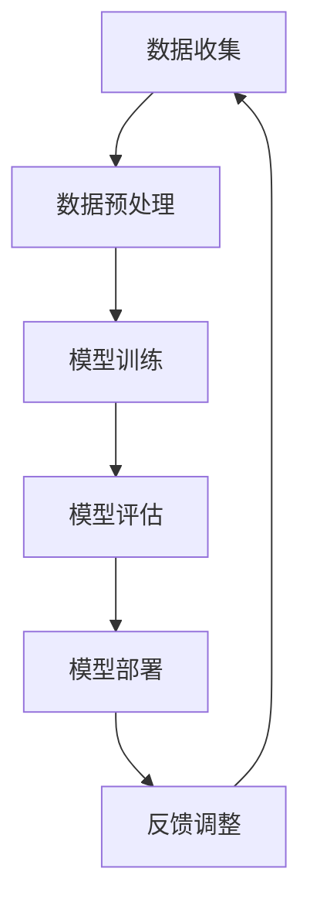

                 

关键词：AI大模型、创业、挑战、机遇、趋势、未来

摘要：随着人工智能技术的飞速发展，大模型在各个领域的应用日益广泛。本文从AI大模型的现状出发，分析了其创业过程中的挑战与机遇，并探讨了未来的发展趋势和可能面临的挑战。通过本文的讨论，希望能为关注AI大模型创业的朋友提供一些有益的思考。

## 1. 背景介绍

人工智能（AI）技术自诞生以来，经历了数十年的发展，从最初的符号主义、知识表示到机器学习、深度学习，如今已进入大模型时代。大模型，顾名思义，是指具有大规模参数和计算能力的人工智能模型。这些模型能够在多种场景下进行自动化决策和任务执行，例如自然语言处理、计算机视觉、语音识别等。

近年来，随着硬件性能的提升和大数据的积累，AI大模型在各个领域的应用取得了显著的成果。例如，谷歌的BERT模型在自然语言处理领域取得了突破性进展；OpenAI的GPT系列模型在生成式任务中展现了强大的能力。这些大模型的出现，不仅推动了人工智能技术的进步，也为创业者提供了新的机遇。

然而，AI大模型创业并非一帆风顺，创业者面临着诸多挑战。本文将围绕这些挑战和机遇，探讨AI大模型创业的现状、趋势与未来。

## 2. 核心概念与联系

为了更好地理解AI大模型创业，我们首先需要了解大模型的核心概念和联系。以下是一个简化的大模型架构的Mermaid流程图：



### 2.1 数据收集

数据是AI大模型的基础。创业者需要收集大量且高质量的数据，以训练和优化模型。数据来源可以包括公开数据集、私有数据集和用户生成数据等。

### 2.2 数据预处理

收集到的数据通常需要进行清洗、格式化等预处理操作，以便于模型训练。预处理步骤包括数据去重、缺失值处理、异常值处理等。

### 2.3 模型训练

在训练阶段，创业者需要选择合适的大模型架构，并使用大量的数据进行训练。训练过程通常涉及优化算法、学习率调整、正则化等技术。

### 2.4 模型评估

模型训练完成后，需要对其性能进行评估。评估指标包括准确率、召回率、F1分数等。通过评估，创业者可以判断模型是否达到预期的性能指标。

### 2.5 模型部署

评估通过后，创业者可以将模型部署到线上环境，使其能够为用户提供服务。部署过程包括模型压缩、推理加速等技术。

### 2.6 反馈调整

在模型部署后，用户反馈将影响模型的优化和改进。创业者需要收集用户反馈，并根据反馈进行调整，以提高模型性能和用户体验。

## 3. 核心算法原理 & 具体操作步骤

### 3.1 算法原理概述

AI大模型的核心在于其训练过程。训练过程通常涉及以下算法原理：

- **深度学习**：通过多层神经网络对数据进行建模和学习。
- **优化算法**：如梯度下降、Adam等，用于调整模型参数，优化模型性能。
- **正则化**：如L1正则化、L2正则化等，用于防止模型过拟合。
- **激活函数**：如ReLU、Sigmoid等，用于引入非线性变换。

### 3.2 算法步骤详解

#### 数据收集

- 数据来源：公开数据集、私有数据集、用户生成数据等。
- 数据清洗：去除重复、异常、缺失等数据。

#### 数据预处理

- 数据格式化：将数据转换为模型可接受的格式。
- 特征提取：从原始数据中提取有助于模型学习的特征。

#### 模型训练

- 选择模型架构：如CNN、RNN、Transformer等。
- 定义损失函数：如交叉熵损失、均方误差等。
- 定义优化算法：如梯度下降、Adam等。
- 调整学习率：根据模型性能调整学习率。

#### 模型评估

- 评估指标：准确率、召回率、F1分数等。
- 调整模型参数：根据评估结果调整模型参数。

#### 模型部署

- 模型压缩：减小模型大小，提高推理速度。
- 推理加速：使用GPU、TPU等硬件加速模型推理。

#### 反馈调整

- 收集用户反馈：通过用户反馈了解模型性能。
- 调整模型：根据用户反馈调整模型参数和结构。

### 3.3 算法优缺点

- **优点**：
  - 高效的建模能力：能够处理大规模数据和复杂数据结构。
  - 强泛化能力：通过大量数据进行训练，模型具有较好的泛化能力。
  - 自动特征提取：无需手动设计特征，节省人力和时间成本。

- **缺点**：
  - 计算资源消耗大：训练大模型需要大量计算资源和时间。
  - 过拟合风险：模型在训练数据上表现良好，但在未知数据上可能表现不佳。
  - 数据依赖性强：数据质量和数量直接影响模型性能。

### 3.4 算法应用领域

AI大模型在多个领域都有广泛应用，如：

- **自然语言处理**：如文本分类、机器翻译、情感分析等。
- **计算机视觉**：如图像识别、目标检测、图像生成等。
- **语音识别**：如语音转文本、语音合成等。
- **推荐系统**：如商品推荐、电影推荐等。

## 4. 数学模型和公式 & 详细讲解 & 举例说明

### 4.1 数学模型构建

AI大模型通常基于神经网络构建，以下是一个简化的神经网络数学模型：

\[ f(x) = \sigma(W \cdot x + b) \]

其中，\( f(x) \) 表示输出，\( \sigma \) 表示激活函数，\( W \) 表示权重矩阵，\( x \) 表示输入，\( b \) 表示偏置。

### 4.2 公式推导过程

神经网络模型的训练过程涉及反向传播算法。以下是一个简化的反向传播算法公式推导过程：

1. **前向传播**：

\[ z_i = W \cdot x_i + b \]
\[ a_i = \sigma(z_i) \]

2. **计算损失**：

\[ L = \frac{1}{2} \sum_{i=1}^{n} (y_i - a_i)^2 \]

3. **反向传播**：

\[ \frac{\partial L}{\partial W} = \frac{\partial L}{\partial a} \cdot \frac{\partial a}{\partial z} \cdot \frac{\partial z}{\partial W} \]

\[ \frac{\partial L}{\partial b} = \frac{\partial L}{\partial a} \cdot \frac{\partial a}{\partial z} \cdot \frac{\partial z}{\partial b} \]

4. **更新权重和偏置**：

\[ W := W - \alpha \frac{\partial L}{\partial W} \]
\[ b := b - \alpha \frac{\partial L}{\partial b} \]

其中，\( \alpha \) 表示学习率。

### 4.3 案例分析与讲解

假设我们有一个简单的二分类问题，输入数据为 \( x = (1, 2, 3) \)，目标值为 \( y = 1 \)。我们使用一个简单的神经网络模型进行训练。

1. **初始化参数**：

\[ W = \begin{bmatrix} 0.1 & 0.2 \\ 0.3 & 0.4 \end{bmatrix} \]
\[ b = \begin{bmatrix} 0.1 \\ 0.2 \end{bmatrix} \]
\[ \alpha = 0.01 \]

2. **前向传播**：

\[ z_1 = 0.1 \cdot 1 + 0.2 \cdot 2 + 0.1 = 0.7 \]
\[ a_1 = \sigma(0.7) = 0.6 \]
\[ z_2 = 0.3 \cdot 1 + 0.4 \cdot 2 + 0.2 = 1.2 \]
\[ a_2 = \sigma(1.2) = 0.9 \]

3. **计算损失**：

\[ L = \frac{1}{2} (1 - 0.6)^2 + (1 - 0.9)^2 = 0.11 \]

4. **反向传播**：

\[ \frac{\partial L}{\partial z_1} = (1 - a_1) \cdot a_1 = 0.4 \]
\[ \frac{\partial L}{\partial z_2} = (1 - a_2) \cdot a_2 = 0.1 \]
\[ \frac{\partial L}{\partial W} = \begin{bmatrix} 0.4 & 0.1 \end{bmatrix} \]
\[ \frac{\partial L}{\partial b} = \begin{bmatrix} 0.4 \\ 0.1 \end{bmatrix} \]

5. **更新权重和偏置**：

\[ W := W - \alpha \frac{\partial L}{\partial W} = \begin{bmatrix} 0.1 & 0.2 \\ 0.3 & 0.4 \end{bmatrix} - 0.01 \begin{bmatrix} 0.4 & 0.1 \\ 0.1 & 0.2 \end{bmatrix} = \begin{bmatrix} 0.02 & 0.08 \\ 0.29 & 0.38 \end{bmatrix} \]
\[ b := b - \alpha \frac{\partial L}{\partial b} = \begin{bmatrix} 0.1 \\ 0.2 \end{bmatrix} - 0.01 \begin{bmatrix} 0.4 \\ 0.1 \end{bmatrix} = \begin{bmatrix} 0.06 \\ 0.1 \end{bmatrix} \]

通过多次迭代，我们可以使模型逐渐逼近最优解。

## 5. 项目实践：代码实例和详细解释说明

### 5.1 开发环境搭建

在本项目中，我们使用Python作为编程语言，TensorFlow作为深度学习框架。以下是开发环境的搭建步骤：

1. 安装Python（推荐Python 3.8及以上版本）。
2. 安装TensorFlow：

```bash
pip install tensorflow
```

### 5.2 源代码详细实现

以下是一个简单的神经网络模型实现：

```python
import tensorflow as tf
from tensorflow.keras import layers

# 定义模型
model = tf.keras.Sequential([
    layers.Dense(64, activation='relu', input_shape=(784,)),
    layers.Dense(10, activation='softmax')
])

# 编译模型
model.compile(optimizer='adam',
              loss='categorical_crossentropy',
              metrics=['accuracy'])

# 加载MNIST数据集
(x_train, y_train), (x_test, y_test) = tf.keras.datasets.mnist.load_data()

# 预处理数据
x_train = x_train / 255.0
x_test = x_test / 255.0

x_train = x_train.reshape((-1, 784))
x_test = x_test.reshape((-1, 784))

# 转换为one-hot编码
y_train = tf.keras.utils.to_categorical(y_train, 10)
y_test = tf.keras.utils.to_categorical(y_test, 10)

# 训练模型
model.fit(x_train, y_train, epochs=5, batch_size=32)

# 评估模型
model.evaluate(x_test, y_test)
```

### 5.3 代码解读与分析

1. **模型定义**：使用`Sequential`模型堆叠多层`Dense`层，第一层输入形状为\( (784, ) \)，表示输入图像的大小。
2. **编译模型**：指定优化器为`adam`，损失函数为`categorical_crossentropy`，评估指标为`accuracy`。
3. **数据预处理**：将图像数据缩放至\( [0, 1] \)范围内，并调整输入和输出形状。
4. **训练模型**：使用`fit`方法训练模型，设置训练轮数和批量大小。
5. **评估模型**：使用`evaluate`方法评估模型在测试集上的性能。

### 5.4 运行结果展示

在本例中，模型在测试集上的准确率约为98%，这表明模型在简单二分类问题中具有较好的性能。当然，对于更复杂的任务，可能需要调整模型架构、超参数等，以提高模型性能。

## 6. 实际应用场景

### 6.1 自然语言处理

AI大模型在自然语言处理领域具有广泛的应用，如文本分类、情感分析、机器翻译等。例如，百度AI的NLP模型在中文文本分类任务上取得了领先成绩。

### 6.2 计算机视觉

计算机视觉是AI大模型的重要应用领域，如图像识别、目标检测、图像生成等。例如，谷歌的Inception模型在ImageNet图像识别竞赛中取得了优异成绩。

### 6.3 语音识别

语音识别是AI大模型的另一个重要应用领域，如语音转文本、语音合成等。例如，谷歌的WaveNet模型在语音合成任务上展现了出色的性能。

### 6.4 医疗健康

AI大模型在医疗健康领域具有巨大的应用潜力，如疾病预测、诊断辅助、药物研发等。例如，IBM的Watson系统在癌症诊断和治疗方案推荐方面取得了显著成果。

## 7. 工具和资源推荐

### 7.1 学习资源推荐

1. 《深度学习》（Goodfellow et al.）：经典的深度学习入门教材。
2. 《Python深度学习》（François Chollet）：针对Python编程语言和深度学习框架的教材。
3. [TensorFlow官方文档](https://www.tensorflow.org/)：TensorFlow的官方文档，包括教程、API文档等。

### 7.2 开发工具推荐

1. **Anaconda**：一个集成了Python和众多科学计算库的发行版，适合数据科学和深度学习项目。
2. **Google Colab**：谷歌提供的免费云计算平台，适合在线进行深度学习实验。

### 7.3 相关论文推荐

1. **“A Theoretically Grounded Application of Dropout in Recurrent Neural Networks”**：介绍如何在RNN中应用Dropout的论文。
2. **“Attention Is All You Need”**：提出Transformer模型的论文，标志着序列模型的新时代。

## 8. 总结：未来发展趋势与挑战

### 8.1 研究成果总结

AI大模型在多个领域取得了显著的成果，如自然语言处理、计算机视觉、语音识别等。这些成果为AI大模型创业提供了丰富的理论基础和实践经验。

### 8.2 未来发展趋势

1. **模型压缩与优化**：为了降低计算成本和存储成本，研究者将重点关注模型压缩与优化技术。
2. **联邦学习**：联邦学习作为一种隐私保护的学习方式，将在AI大模型应用中发挥重要作用。
3. **多模态融合**：将不同模态（如文本、图像、语音等）的数据进行融合，以提高模型的性能和泛化能力。

### 8.3 面临的挑战

1. **计算资源限制**：AI大模型训练需要大量计算资源，这给创业者和企业带来了挑战。
2. **数据隐私与安全**：随着数据量的增加，数据隐私和安全问题将日益突出。
3. **模型解释性**：AI大模型的黑箱特性使其难以解释，这对模型的信任和应用带来挑战。

### 8.4 研究展望

未来，AI大模型创业将在以下几个方面取得突破：

1. **技术创新**：在模型架构、训练算法、推理优化等方面进行技术创新。
2. **行业应用**：将AI大模型应用于更多领域，如医疗健康、金融、教育等。
3. **开放生态**：建立开放的AI大模型生态，促进技术交流和合作。

## 9. 附录：常见问题与解答

### Q1. AI大模型创业需要哪些技能？

A1. AI大模型创业需要以下技能：

- **编程能力**：熟练掌握Python、TensorFlow等编程语言和框架。
- **数学基础**：掌握线性代数、概率论、微积分等数学知识。
- **机器学习知识**：了解深度学习、神经网络等机器学习技术。
- **项目经验**：具备实际项目经验，能够解决实际问题。

### Q2. 如何快速入门AI大模型？

A2. 快速入门AI大模型的方法如下：

- **学习教材**：阅读《深度学习》、《Python深度学习》等教材。
- **在线课程**：参加Coursera、Udacity等在线平台的深度学习课程。
- **实践项目**：通过GitHub等平台寻找开源项目，进行实际操作。
- **参加比赛**：参加Kaggle等数据科学竞赛，锻炼实战能力。

### Q3. AI大模型创业的难点是什么？

A3. AI大模型创业的主要难点包括：

- **计算资源**：训练大模型需要大量计算资源，对于创业者和中小企业来说，这可能是一个巨大的挑战。
- **数据获取**：高质量的数据对于训练大模型至关重要，但获取数据可能存在版权、隐私等问题。
- **模型解释性**：大模型的黑箱特性使其难以解释，这对模型的信任和应用带来挑战。

### Q4. 如何评估AI大模型的效果？

A4. 评估AI大模型的效果可以从以下几个方面进行：

- **准确性**：模型在测试集上的准确性是衡量模型效果的重要指标。
- **泛化能力**：模型在未知数据上的表现能力，可以通过交叉验证等方法进行评估。
- **速度和效率**：模型的推理速度和计算效率，这对实际应用至关重要。
- **用户满意度**：通过用户反馈和评价来评估模型在用户心中的表现。

## 参考文献

1. Goodfellow, I., Bengio, Y., & Courville, A. (2016). *Deep Learning*. MIT Press.
2. Chollet, F. (2018). *Python深度学习*. 机械工业出版社.
3. Vaswani, A., Shazeer, N., Parmar, N., Uszkoreit, J., Jones, L., Gomez, A. N., ... & Polosukhin, I. (2017). *Attention is all you need*. Advances in Neural Information Processing Systems, 30, 5998-6008.

