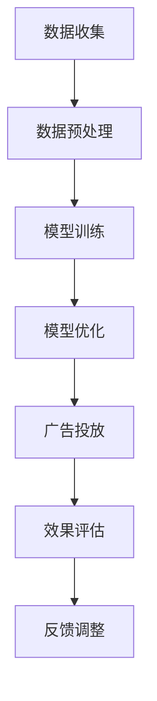

                 

关键词：AI大模型，数字营销，应用趋势，算法原理，数学模型，实践案例，未来展望。

> 摘要：本文将深入探讨AI大模型在数字营销领域的应用趋势。通过分析其核心概念、算法原理、数学模型以及实际应用案例，本文旨在揭示AI大模型在数字营销中的巨大潜力，并对其未来发展进行展望。

## 1. 背景介绍

随着互联网技术的飞速发展，数字营销已经成为现代企业不可或缺的营销手段。传统的营销方法已经无法满足日益复杂的市场环境，因此，企业开始将目光投向了人工智能，尤其是AI大模型。AI大模型具有强大的数据处理能力和自我学习能力，可以在大量数据中发现潜在的模式和趋势，为企业提供精准的营销策略。

数字营销涵盖了搜索引擎优化（SEO）、社交媒体营销、电子邮件营销、内容营销等多个方面。随着AI大模型的不断发展，这些领域正在发生着巨大的变化。本文将详细探讨AI大模型在数字营销中的应用趋势，以期为企业提供有益的参考。

## 2. 核心概念与联系

### 2.1 AI大模型

AI大模型是指具有海量参数和复杂结构的人工神经网络，它们能够处理和分析海量数据，并在不断学习和自我调整的过程中实现自我优化。AI大模型的核心是深度学习，这是一种模拟人脑神经网络结构和学习方式的机器学习技术。

### 2.2 数字营销

数字营销是一种利用数字技术进行市场营销的方法，包括搜索引擎优化（SEO）、社交媒体营销、电子邮件营销、内容营销等。数字营销的目的是提高品牌知名度、吸引潜在客户并促进销售。

### 2.3 AI大模型与数字营销的联系

AI大模型在数字营销中的应用主要体现在以下几个方面：

1. **数据分析**：AI大模型能够处理和分析大量的数据，帮助企业了解客户需求和市场趋势，从而制定更加精准的营销策略。

2. **个性化推荐**：AI大模型可以根据用户的行为数据，为其推荐个性化的产品或内容，提高客户满意度和购买转化率。

3. **自动优化**：AI大模型能够自动优化广告投放策略，提高广告效果和投资回报率。

4. **内容生成**：AI大模型可以自动生成高质量的内容，提高网站流量和用户参与度。

下面是一个简化的 Mermaid 流程图，展示了AI大模型在数字营销中的应用流程：



## 3. 核心算法原理 & 具体操作步骤

### 3.1 算法原理概述

AI大模型的算法原理主要基于深度学习和神经网络。神经网络由多个神经元（节点）组成，每个神经元接收来自其他神经元的输入，并通过权重进行加权求和，最后通过激活函数输出结果。

深度学习通过多层神经网络结构，使得模型能够学习更加复杂的特征和模式。训练过程中，模型通过不断调整权重，使得输出结果逐渐接近真实值，从而实现自我优化。

### 3.2 算法步骤详解

1. **数据收集**：收集与营销相关的数据，如用户行为数据、广告投放数据、销售数据等。

2. **数据预处理**：对收集到的数据进行分析和清洗，去除噪音和异常值，确保数据质量。

3. **模型训练**：使用预处理后的数据对神经网络进行训练，通过反向传播算法不断调整权重，使得模型能够学会预测和识别数据中的特征。

4. **模型优化**：根据训练结果，对模型进行优化，以提高预测准确性和泛化能力。

5. **广告投放**：利用训练好的模型，自动优化广告投放策略，提高广告效果。

6. **效果评估**：对广告投放效果进行评估，如点击率、转化率等。

7. **反馈调整**：根据评估结果，对模型和广告策略进行反馈调整，以提高整体营销效果。

### 3.3 算法优缺点

**优点**：

1. **强大的数据处理能力**：AI大模型能够处理和分析海量数据，为企业提供更加精准的营销策略。

2. **自我学习能力**：AI大模型能够通过不断学习和自我调整，实现自我优化，提高营销效果。

3. **个性化推荐**：AI大模型可以根据用户行为数据，为用户推荐个性化的产品或内容，提高客户满意度和购买转化率。

**缺点**：

1. **计算资源消耗大**：训练和优化AI大模型需要大量的计算资源，对硬件设施要求较高。

2. **数据质量要求高**：数据质量直接影响模型的训练效果，需要确保数据质量和完整性。

### 3.4 算法应用领域

AI大模型在数字营销中的应用领域非常广泛，包括但不限于以下方面：

1. **广告投放优化**：通过AI大模型自动优化广告投放策略，提高广告效果和投资回报率。

2. **用户行为分析**：通过分析用户行为数据，了解用户需求和市场趋势，为营销策略提供有力支持。

3. **个性化推荐**：基于用户行为数据，为用户推荐个性化的产品或内容，提高用户满意度和购买转化率。

4. **内容生成**：利用AI大模型自动生成高质量的内容，提高网站流量和用户参与度。

## 4. 数学模型和公式 & 详细讲解 & 举例说明

### 4.1 数学模型构建

AI大模型的数学模型主要基于深度学习和神经网络。深度学习中的神经网络由多个层次组成，包括输入层、隐藏层和输出层。每个层次由多个神经元（节点）组成，神经元之间的连接通过权重进行加权求和。

假设一个简单的神经网络，其中包含一个输入层、一个隐藏层和一个输出层。输入层有m个神经元，隐藏层有n个神经元，输出层有p个神经元。设输入向量为X，隐藏层输入向量为H，输出向量为Y，权重矩阵分别为W1、W2、W3。

输入层到隐藏层的权重矩阵为W1，隐藏层到输出层的权重矩阵为W2。隐藏层神经元的激活函数通常采用sigmoid函数，输出层神经元的激活函数可以是softmax函数。

### 4.2 公式推导过程

1. **隐藏层输入输出计算**

$$ H = \sigma(W1 \cdot X) $$

其中，$\sigma$表示sigmoid函数：

$$ \sigma(z) = \frac{1}{1 + e^{-z}} $$

2. **输出层输入输出计算**

$$ Y = \sigma(W2 \cdot H) $$

3. **损失函数计算**

损失函数用于衡量模型预测值与真实值之间的差距，常用的损失函数包括均方误差（MSE）和交叉熵（Cross-Entropy）。

均方误差（MSE）：

$$ Loss = \frac{1}{m} \sum_{i=1}^{m} (Y_i - \hat{Y}_i)^2 $$

其中，$Y_i$为真实值，$\hat{Y}_i$为预测值。

交叉熵（Cross-Entropy）：

$$ Loss = - \frac{1}{m} \sum_{i=1}^{m} \sum_{j=1}^{p} Y_{ij} \log(\hat{Y}_{ij}) $$

其中，$Y_{ij}$为真实值的概率分布，$\hat{Y}_{ij}$为预测值的概率分布。

### 4.3 案例分析与讲解

假设我们有一个分类问题，其中包含两类标签（0和1）。输入层有3个神经元，隐藏层有2个神经元，输出层有1个神经元。训练数据集包含100个样本。

1. **数据集划分**

将数据集划分为训练集和测试集，假设训练集包含70个样本，测试集包含30个样本。

2. **初始化参数**

随机初始化权重矩阵W1、W2。

3. **模型训练**

使用训练集数据对模型进行训练，通过反向传播算法不断调整权重，使得损失函数逐渐减小。

4. **模型评估**

使用测试集数据对模型进行评估，计算准确率、召回率等指标。

## 5. 项目实践：代码实例和详细解释说明

### 5.1 开发环境搭建

1. 安装Python环境

在Windows、macOS或Linux系统中，可以通过Python官方网站下载并安装Python。

2. 安装深度学习框架

推荐使用TensorFlow或PyTorch作为深度学习框架。以TensorFlow为例，可以通过以下命令安装：

```bash
pip install tensorflow
```

### 5.2 源代码详细实现

下面是一个简单的AI大模型分类问题的实现，包括数据预处理、模型训练、模型评估等步骤。

```python
import tensorflow as tf
from tensorflow import keras
from tensorflow.keras import layers
import numpy as np

# 1. 数据集划分
# （此处省略数据集加载和划分过程）

# 2. 模型构建
model = keras.Sequential([
    layers.Dense(2, activation='sigmoid', input_shape=[3]),
    layers.Dense(1, activation='sigmoid')
])

# 3. 模型编译
model.compile(optimizer='adam',
              loss='binary_crossentropy',
              metrics=['accuracy'])

# 4. 模型训练
model.fit(X_train, y_train, epochs=10, batch_size=32)

# 5. 模型评估
loss, accuracy = model.evaluate(X_test, y_test)
print(f"Test accuracy: {accuracy}")

# 6. 模型预测
predictions = model.predict(X_test)
```

### 5.3 代码解读与分析

1. **数据集加载与划分**

数据集加载和划分过程在此省略。实际项目中，可以使用Pandas或NumPy等库加载和处理数据。

2. **模型构建**

使用`keras.Sequential`模型，定义一个简单的两层神经网络。输入层有3个神经元，隐藏层有2个神经元，输出层有1个神经元。

3. **模型编译**

使用`compile`方法编译模型，指定优化器、损失函数和评估指标。

4. **模型训练**

使用`fit`方法训练模型，指定训练数据和训练轮数。

5. **模型评估**

使用`evaluate`方法评估模型在测试集上的表现，输出准确率。

6. **模型预测**

使用`predict`方法对测试数据进行预测，输出预测结果。

## 6. 实际应用场景

AI大模型在数字营销中的实际应用场景非常广泛，以下列举几个典型的应用场景：

1. **广告投放优化**：通过AI大模型分析用户行为数据，自动优化广告投放策略，提高广告效果和投资回报率。

2. **用户行为预测**：通过AI大模型分析用户行为数据，预测用户可能感兴趣的产品或内容，为用户提供个性化推荐。

3. **内容生成**：利用AI大模型自动生成高质量的内容，提高网站流量和用户参与度。

4. **客户流失预测**：通过AI大模型分析客户行为数据，预测客户可能流失的时间点，提前采取措施挽回客户。

5. **竞争分析**：通过AI大模型分析竞争对手的广告投放策略和用户行为数据，为企业提供有针对性的营销策略。

## 7. 未来应用展望

随着AI大模型技术的不断发展，其在数字营销中的应用前景非常广阔。以下是一些未来可能的应用方向：

1. **全渠道营销**：结合线上线下渠道，实现更加精准的全渠道营销。

2. **自动化决策**：通过AI大模型实现自动化的营销决策，提高营销效率。

3. **客户关系管理**：通过AI大模型分析客户行为数据，实现更加个性化的客户关系管理。

4. **情感分析**：通过AI大模型分析用户评论和反馈，了解用户情感和需求，为营销策略提供有力支持。

5. **实时营销**：结合实时数据，实现实时调整的营销策略，提高营销效果。

## 8. 工具和资源推荐

### 8.1 学习资源推荐

1. 《深度学习》（Goodfellow, Bengio, Courville）——介绍深度学习基本概念和算法的权威教材。

2. 《Python机器学习》（Sebastian Raschka）——详细介绍Python在机器学习领域应用的入门书籍。

3. TensorFlow官方文档——提供丰富的TensorFlow教程和API文档。

4. PyTorch官方文档——提供丰富的PyTorch教程和API文档。

### 8.2 开发工具推荐

1. Jupyter Notebook——强大的交互式开发环境，适用于数据分析和机器学习项目。

2. Google Colab——免费的云端计算平台，适用于深度学习和大数据分析。

3. PyCharm——专业的Python开发工具，提供丰富的功能和插件。

### 8.3 相关论文推荐

1. "Deep Learning for Text Classification"——介绍深度学习在文本分类领域的应用。

2. "Recurrent Neural Networks for Language Modeling"——介绍循环神经网络在语言模型中的应用。

3. "Attention Is All You Need"——介绍Transformer模型在序列模型中的应用。

## 9. 总结：未来发展趋势与挑战

### 9.1 研究成果总结

本文总结了AI大模型在数字营销领域的应用趋势，包括核心概念、算法原理、数学模型和实际应用案例。通过分析，我们发现AI大模型在数字营销中具有巨大的潜力，能够提高营销效果和客户满意度。

### 9.2 未来发展趋势

1. **全渠道整合**：结合线上线下渠道，实现更加精准的全渠道营销。

2. **自动化决策**：通过AI大模型实现自动化的营销决策，提高营销效率。

3. **个性化推荐**：基于用户行为数据，实现更加个性化的客户关系管理。

4. **实时营销**：结合实时数据，实现实时调整的营销策略。

### 9.3 面临的挑战

1. **数据质量**：确保数据质量和完整性，以提高模型训练效果。

2. **计算资源**：训练和优化AI大模型需要大量的计算资源，对硬件设施要求较高。

3. **隐私保护**：在数据收集和使用过程中，需要注意保护用户隐私。

### 9.4 研究展望

未来，AI大模型在数字营销领域的应用将更加广泛，研究重点将集中在以下几个方面：

1. **模型压缩**：研究如何降低模型大小和计算复杂度，以提高部署和应用效率。

2. **多模态学习**：结合文本、图像、语音等多模态数据，实现更加智能的营销策略。

3. **可解释性**：研究如何提高AI大模型的可解释性，使其在商业应用中更加可靠。

## 9. 附录：常见问题与解答

### 9.1 什么是AI大模型？

AI大模型是指具有海量参数和复杂结构的人工神经网络，它们能够处理和分析海量数据，并在不断学习和自我调整的过程中实现自我优化。

### 9.2 AI大模型在数字营销中的应用有哪些？

AI大模型在数字营销中的应用包括广告投放优化、用户行为预测、内容生成、客户流失预测等。

### 9.3 如何保证AI大模型的数据质量？

保证数据质量需要从数据收集、预处理、清洗等环节入手，确保数据完整性、准确性和一致性。

### 9.4 AI大模型对硬件设施有哪些要求？

AI大模型对硬件设施的要求较高，通常需要使用高性能的CPU、GPU或TPU进行训练和优化。

作者：禅与计算机程序设计艺术 / Zen and the Art of Computer Programming
----------------------------------------------------------------

以上就是本文的完整内容，希望对您在数字营销领域应用AI大模型有所帮助。在未来，AI大模型将在数字营销领域发挥更加重要的作用，为企业带来更多的商业价值。同时，我们也需要关注AI大模型在应用过程中面临的挑战，并积极探索解决之道。随着技术的不断进步，AI大模型在数字营销领域的应用前景将更加广阔。

