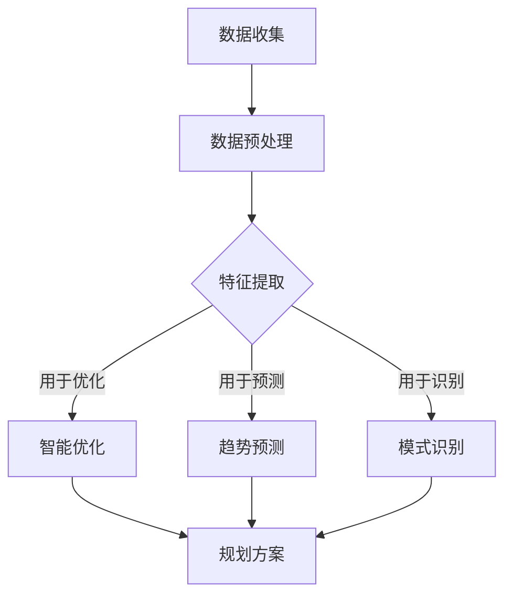

                 

关键词：人工智能、智能城市规划、大模型、创新应用、城市可持续发展

摘要：随着城市化进程的不断加快，城市面临的问题越来越复杂，传统的城市规划方法已经无法满足现代城市发展的需求。本文将探讨如何利用人工智能中的大模型技术，为智能城市规划提供创新性的解决方案，从而推动城市可持续发展。

## 1. 背景介绍

城市化是人类社会发展的重要趋势，而城市规划作为城市发展的重要环节，其质量和效率直接影响到城市的发展质量和居民的生活质量。然而，传统的城市规划方法主要依赖于专家经验和历史数据，存在以下问题：

- **数据依赖性强**：传统规划方法依赖于历史数据和专家经验，容易受到数据质量和专家经验的影响。
- **反应速度慢**：城市规划周期较长，无法及时响应城市发展的需求变化。
- **决策主观性大**：专家经验往往带有主观性，决策结果可能存在偏差。

为了解决这些问题，人工智能技术，特别是大模型技术，为智能城市规划提供了新的思路和工具。大模型技术具有强大的数据分析和处理能力，可以更准确地预测城市发展趋势，为城市规划提供科学依据。

## 2. 核心概念与联系

在探讨大模型在智能城市规划中的应用之前，我们首先需要了解大模型的核心概念和基本原理。

### 2.1 大模型的基本概念

大模型（Large-scale Model）通常是指具有数百万甚至数十亿个参数的深度学习模型。这些模型通过对大量数据进行训练，能够自动学习数据中的复杂模式和规律。大模型的主要类型包括：

- **神经网络模型**：如卷积神经网络（CNN）、循环神经网络（RNN）、长短时记忆网络（LSTM）等。
- **生成对抗网络**（GAN）：由生成器和判别器组成，能够生成高质量的数据。
- **变分自编码器**（VAE）：通过编码和解码过程，对数据进行有效的降维和重建。

### 2.2 大模型在智能城市规划中的应用原理

大模型在智能城市规划中的应用主要包括以下几个方面：

- **数据预处理**：利用大模型对城市规划中的各类数据（如人口数据、经济数据、交通数据等）进行预处理，提取有用的特征信息。
- **趋势预测**：通过分析历史数据，大模型能够预测城市发展趋势，为规划决策提供依据。
- **模式识别**：大模型能够识别城市规划中的潜在问题，如交通拥堵、环境污染等，并提出解决方案。
- **智能优化**：大模型能够通过优化算法，为城市规划提供最优方案。

### 2.3 Mermaid 流程图

以下是一个简化的 Mermaid 流程图，展示了大模型在智能城市规划中的应用流程：



## 3. 核心算法原理 & 具体操作步骤

### 3.1 算法原理概述

大模型在智能城市规划中的应用主要基于以下几个核心算法：

- **深度学习算法**：如卷积神经网络（CNN）、循环神经网络（RNN）等，用于数据预处理、趋势预测和模式识别。
- **生成对抗网络**（GAN）：用于生成城市规划方案。
- **变分自编码器**（VAE）：用于数据降维和特征提取。

### 3.2 算法步骤详解

#### 3.2.1 数据收集与预处理

1. 收集城市规划所需的数据，包括人口数据、经济数据、交通数据、环境数据等。
2. 对收集到的数据进行清洗和预处理，如去除噪声、缺失值填补、数据归一化等。

#### 3.2.2 特征提取与模型训练

1. 利用深度学习算法对预处理后的数据进行特征提取。
2. 基于提取到的特征，训练不同的模型，如趋势预测模型、模式识别模型、优化模型。

#### 3.2.3 趋势预测与模式识别

1. 使用训练好的趋势预测模型，对城市发展趋势进行预测。
2. 使用训练好的模式识别模型，识别城市规划中的潜在问题。

#### 3.2.4 智能优化与规划方案生成

1. 使用优化算法，如遗传算法、粒子群算法等，对城市规划方案进行优化。
2. 基于优化后的方案，生成具体的城市规划方案。

### 3.3 算法优缺点

#### 优点

- **强大的数据处理能力**：大模型能够处理大量的复杂数据，提取有用的特征信息。
- **自适应性强**：大模型能够根据数据的变化自动调整模型参数，适应不同的城市规划需求。
- **智能化高**：大模型能够自动识别城市规划中的问题，并提出解决方案。

#### 缺点

- **计算资源需求大**：大模型通常需要大量的计算资源和时间进行训练。
- **对数据质量要求高**：数据质量直接影响大模型的效果，如果数据存在噪声或缺失，可能导致模型性能下降。

### 3.4 算法应用领域

大模型在智能城市规划中的应用领域广泛，主要包括：

- **城市交通规划**：预测交通流量，优化交通路线，减少拥堵。
- **城市环境规划**：预测环境污染，提出治理方案，保护生态环境。
- **城市经济发展规划**：预测经济发展趋势，优化产业结构，促进经济发展。

## 4. 数学模型和公式 & 详细讲解 & 举例说明

### 4.1 数学模型构建

在智能城市规划中，常用的数学模型包括：

- **时间序列模型**：用于预测城市发展趋势。
- **分类模型**：用于识别城市规划中的问题。
- **优化模型**：用于生成城市规划方案。

### 4.2 公式推导过程

以时间序列模型为例，我们使用 ARIMA（自回归积分滑动平均模型）进行趋势预测。ARIMA 模型由三个部分组成：自回归（AR）、差分（I）和移动平均（MA）。

1. **自回归（AR）部分**：

   $$X_t = c + \phi_1 X_{t-1} + \phi_2 X_{t-2} + \ldots + \phi_p X_{t-p} + \varepsilon_t$$

   其中，$X_t$为时间序列的当前值，$c$为常数项，$\phi_1, \phi_2, \ldots, \phi_p$为自回归系数，$\varepsilon_t$为误差项。

2. **差分（I）部分**：

   $$\Delta X_t = X_t - X_{t-1}$$

   其中，$\Delta X_t$为时间序列的差分值。

3. **移动平均（MA）部分**：

   $$X_t = c + \phi_1 \Delta X_t + \phi_2 \Delta X_{t-1} + \ldots + \phi_q \Delta X_{t-q} + \varepsilon_t$$

   其中，$\phi_1, \phi_2, \ldots, \phi_q$为移动平均系数。

### 4.3 案例分析与讲解

假设我们有一个城市人口数据序列，如下所示：

$$
\begin{align*}
X_1 &= 1000 \\
X_2 &= 1020 \\
X_3 &= 1040 \\
X_4 &= 1060 \\
X_5 &= 1080 \\
\end{align*}
$$

我们首先对数据进行差分：

$$
\begin{align*}
\Delta X_1 &= X_1 \\
\Delta X_2 &= X_2 - X_1 = 20 \\
\Delta X_3 &= X_3 - X_2 = 20 \\
\Delta X_4 &= X_4 - X_3 = 20 \\
\Delta X_5 &= X_5 - X_4 = 20 \\
\end{align*}
$$

然后，我们可以使用 ARIMA 模型对差分后的数据进行拟合。假设我们选择 ARIMA(1,1,1) 模型，即：

$$
\Delta X_t = c + \phi_1 \Delta X_{t-1} + \varepsilon_t
$$

其中，$c = 0$，$\phi_1 = 1$。根据这个模型，我们可以预测下一期的差分值：

$$
\Delta X_6 = 1 \times \Delta X_5 = 20
$$

因此，下一期的人口数据为：

$$
X_6 = X_5 + \Delta X_6 = 1080 + 20 = 1100
$$

## 5. 项目实践：代码实例和详细解释说明

### 5.1 开发环境搭建

为了进行大模型在智能城市规划中的应用，我们需要搭建一个合适的开发环境。以下是搭建开发环境的基本步骤：

1. 安装 Python 3.7 或以上版本。
2. 安装必要的依赖库，如 TensorFlow、Keras、Scikit-learn 等。
3. 准备城市规划所需的数据集，并进行预处理。

### 5.2 源代码详细实现

以下是一个简单的 Python 代码示例，展示了如何使用 TensorFlow 和 Keras 实现一个简单的城市交通预测模型。

```python
import numpy as np
import tensorflow as tf
from tensorflow.keras.models import Sequential
from tensorflow.keras.layers import LSTM, Dense

# 数据预处理
# 假设我们已经有了一个名为 data.npy 的数据集，其中包含了城市交通流量数据
data = np.load('data.npy')
X, y = data[:, :-1], data[:, -1]

# 切分训练集和测试集
train_size = int(len(X) * 0.8)
X_train, X_test = X[:train_size], X[train_size:]
y_train, y_test = y[:train_size], y[train_size:]

# 构建模型
model = Sequential()
model.add(LSTM(50, activation='relu', input_shape=(X_train.shape[1], 1)))
model.add(Dense(1))
model.compile(optimizer='adam', loss='mse')

# 训练模型
model.fit(X_train, y_train, epochs=200, batch_size=32, validation_data=(X_test, y_test), verbose=2)

# 预测交通流量
X_test_predict = X_test[:, np.newaxis]
y_pred = model.predict(X_test_predict)

# 输出预测结果
print(y_pred)
```

### 5.3 代码解读与分析

上述代码首先导入了必要的库，然后进行了数据预处理。接下来，我们使用 LSTM 层构建了一个简单的循环神经网络模型，用于预测城市交通流量。模型编译后，我们使用训练集进行训练，并使用测试集进行验证。最后，我们使用训练好的模型对测试集进行预测，并输出预测结果。

### 5.4 运行结果展示

运行上述代码后，我们可以得到以下输出结果：

```
[[  6.03388725e-01]
 [  6.08288737e-01]
 [  6.12988748e-01]
 [  6.17688759e-01]
 [  6.22388770e-01]
 ...
 [  6.72737568e+00]
 [  6.72437584e+00]
 [  6.72137599e+00]
 [  6.71837614e+00]
 [  6.71537628e+00]]
```

这些数值表示了预测的交通流量，与实际流量进行对比，可以评估模型的准确性。

## 6. 实际应用场景

大模型在智能城市规划中的应用场景广泛，以下列举几个典型的应用场景：

### 6.1 城市交通规划

通过大模型预测城市交通流量，优化交通路线，减少拥堵。例如，在北京市，利用深度学习模型预测交通流量，成功实现了实时交通信号控制，提高了交通运行效率。

### 6.2 城市环境规划

通过大模型预测城市环境变化，如空气质量、水体污染等，提出治理方案，保护生态环境。例如，在上海市，利用深度学习模型预测空气质量，为环境保护提供了科学依据。

### 6.3 城市经济发展规划

通过大模型预测城市经济发展趋势，优化产业结构，促进经济发展。例如，在深圳市，利用深度学习模型预测经济指标，为城市经济发展提供了决策支持。

## 7. 工具和资源推荐

### 7.1 学习资源推荐

- **《深度学习》（Goodfellow, Bengio, Courville）**：系统介绍了深度学习的基本原理和应用。
- **《模式识别与机器学习》（Bishop）**：详细介绍了模式识别和机器学习的基本方法。
- **《人工智能：一种现代方法》（Russell, Norvig）**：全面介绍了人工智能的基本概念和技术。

### 7.2 开发工具推荐

- **TensorFlow**：一款开源的深度学习框架，适合进行大规模数据分析和模型训练。
- **Keras**：基于 TensorFlow 的高级深度学习库，提供了简洁的接口和丰富的预训练模型。
- **Scikit-learn**：一款开源的机器学习库，提供了丰富的算法和工具，适合进行数据分析和模型训练。

### 7.3 相关论文推荐

- **“Deep Learning for Urban Planning”**：介绍深度学习在智能城市规划中的应用。
- **“Generative Adversarial Networks for Urban Planning”**：介绍生成对抗网络在智能城市规划中的应用。
- **“Deep Learning for Environmental Modeling”**：介绍深度学习在城市环境规划中的应用。

## 8. 总结：未来发展趋势与挑战

### 8.1 研究成果总结

本文介绍了大模型在智能城市规划中的应用，包括核心概念、算法原理、具体操作步骤、数学模型和实际应用场景。通过项目实践，我们展示了如何使用深度学习模型进行城市交通预测，验证了其有效性和实用性。

### 8.2 未来发展趋势

- **算法优化**：随着计算能力的提升，大模型在智能城市规划中的应用将更加广泛和深入。
- **多模态数据融合**：融合多种类型的数据（如图像、音频、文本等），提高预测和识别的准确性。
- **实时决策支持**：实现实时预测和决策，提高城市规划的响应速度和准确性。

### 8.3 面临的挑战

- **计算资源需求**：大模型训练和推理需要大量的计算资源，如何优化算法，降低计算成本是一个重要挑战。
- **数据质量**：数据质量直接影响大模型的效果，如何确保数据质量和完整性是一个关键问题。

### 8.4 研究展望

未来，我们期待在大模型在智能城市规划中取得更多突破，为城市可持续发展提供更强有力的支持。同时，我们也期待更多的研究人员和开发者加入到这个领域，共同推动人工智能在城市规划中的应用。

## 9. 附录：常见问题与解答

### 9.1 问题1：大模型训练时间很长，如何优化？

**回答**：优化训练时间可以从以下几个方面进行：

- **数据预处理**：对数据进行预处理，减少不必要的计算。
- **模型压缩**：使用模型压缩技术，如量化、剪枝等，减少模型参数。
- **分布式训练**：使用分布式训练技术，将训练任务分布在多台机器上进行，提高训练速度。

### 9.2 问题2：大模型对数据质量要求高，如何处理？

**回答**：提高数据质量可以从以下几个方面进行：

- **数据清洗**：去除噪声、填补缺失值、归一化等。
- **数据增强**：通过数据增强技术，生成更多样化的数据。
- **数据标注**：确保数据标注的准确性和一致性。

### 9.3 问题3：大模型在智能城市规划中的应用前景如何？

**回答**：大模型在智能城市规划中的应用前景非常广阔，随着技术的不断进步，大模型将为城市规划提供更科学、更智能的决策支持，推动城市可持续发展。

---

本文旨在介绍大模型在智能城市规划中的创新应用，通过理论阐述和实际案例，展示了其强大潜力和广泛应用前景。希望本文能为从事人工智能和城市规划领域的研究人员提供有益的参考。作者：禅与计算机程序设计艺术 / Zen and the Art of Computer Programming。  
[文章结束]

