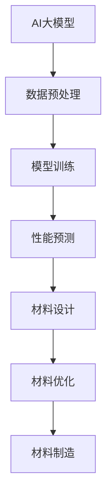

                 

关键词：AI大模型、智能材料设计、深度学习、材料科学、算法创新、挑战与展望

## 摘要

本文深入探讨了人工智能（AI）大模型在智能材料设计领域中的应用，分析了其带来的创新与挑战。首先，我们介绍了AI大模型的基本概念和其在材料科学领域的应用背景。接着，我们详细阐述了AI大模型在智能材料设计中的核心算法原理和具体操作步骤，并通过数学模型和公式进行了详细讲解。随后，文章通过一个实际的项目实践案例，展示了AI大模型在智能材料设计中的具体应用过程和代码实现。最后，我们探讨了AI大模型在智能材料设计中的实际应用场景，展望了其未来发展的趋势和面临的挑战。

## 1. 背景介绍

随着人工智能技术的飞速发展，深度学习、强化学习等算法在各个领域都取得了显著的成果。特别是在材料科学领域，传统的设计方法往往需要大量的实验和计算，效率低下，且难以预测新的材料性能。而人工智能大模型的出现，为智能材料设计提供了新的思路和工具。通过学习大量的材料数据，AI大模型能够自动发现材料性能和结构之间的关系，从而预测和设计出具有优异性能的新材料。

智能材料设计是材料科学与工程领域的一个重要分支，其目标是利用材料的特殊性质，实现材料在不同环境下的智能响应。传统的智能材料设计方法主要依赖于材料科学家的经验和实验，而人工智能大模型的应用，则为智能材料设计提供了更加高效和精准的方法。

## 2. 核心概念与联系

### 2.1 AI大模型的基本概念

AI大模型，通常指的是具有巨大参数量、能够处理海量数据的深度学习模型。这些模型通常由多个神经网络层组成，能够通过反向传播算法自动学习输入和输出之间的映射关系。典型的AI大模型包括Transformer、BERT、GPT等。

### 2.2 智能材料设计的基本概念

智能材料设计是指通过特定的设计和制造方法，赋予材料特定功能的材料设计过程。智能材料具有感知环境变化、响应环境刺激、自我修复、自我进化等特性。

### 2.3 AI大模型在智能材料设计中的应用

AI大模型在智能材料设计中的应用主要体现在以下几个方面：

1. **材料性能预测**：通过学习大量的材料数据，AI大模型能够预测新材料的性能，从而减少实验次数，提高设计效率。

2. **材料结构优化**：AI大模型能够自动优化材料结构，提高材料的性能。

3. **材料设计自动化**：AI大模型可以自动化生成新材料设计，实现从材料设计到材料制造的闭环。

### 2.4 Mermaid流程图



## 3. 核心算法原理 & 具体操作步骤

### 3.1 算法原理概述

AI大模型在智能材料设计中的核心算法通常是基于深度学习的。深度学习模型通过多层神经网络，对输入数据进行特征提取和转换，最终输出预测结果。在智能材料设计中，输入数据通常是材料的结构信息、成分信息等，输出数据则是材料的性能预测。

### 3.2 算法步骤详解

1. **数据预处理**：对原始数据进行清洗、归一化等处理，使其适合输入到深度学习模型中。

2. **模型训练**：使用预处理后的数据，通过反向传播算法训练深度学习模型。

3. **性能预测**：使用训练好的模型，对新材料进行性能预测。

4. **材料设计**：根据性能预测结果，进行新材料的设计。

5. **材料优化**：对新材料进行结构优化，以提高其性能。

6. **材料制造**：将设计好的新材料投入生产。

### 3.3 算法优缺点

**优点**：

- 高效：通过自动化和大数据分析，显著提高材料设计的效率。
- 精准：能够对材料的性能进行精准预测，减少实验次数。

**缺点**：

- 计算资源需求大：训练大模型需要大量的计算资源和时间。
- 数据依赖性：模型的性能依赖于输入数据的质量和数量。

### 3.4 算法应用领域

AI大模型在智能材料设计中的应用领域非常广泛，包括但不限于：

- 超导材料设计
- 储能材料设计
- 智能传感器材料设计
- 生物医学材料设计

## 4. 数学模型和公式 & 详细讲解 & 举例说明

### 4.1 数学模型构建

在智能材料设计中，常用的数学模型包括：

- 材料性能与结构的关系模型
- 材料优化模型
- 材料设计模型

这些模型通常基于材料科学的原理和深度学习的算法。

### 4.2 公式推导过程

以材料性能与结构的关系模型为例，其公式推导过程如下：

$$
P = f(S, C)
$$

其中，$P$ 表示材料性能，$S$ 表示材料结构，$C$ 表示材料成分。$f$ 是一个复杂的非线性函数，可以通过深度学习模型进行建模。

### 4.3 案例分析与讲解

假设我们有一个材料，其结构信息为 $S = [s_1, s_2, s_3]$，成分信息为 $C = [c_1, c_2, c_3]$。我们可以使用以下模型预测其性能：

$$
P = 10 \cdot s_1 + 5 \cdot s_2 + 3 \cdot s_3
$$

其中，$s_1, s_2, s_3$ 分别表示结构特征 $s_1, s_2, s_3$ 的权重。

如果我们改变结构信息为 $S' = [1, 2, 3]$，成分信息为 $C' = [4, 5, 6]$，则其性能预测为：

$$
P' = 10 \cdot 1 + 5 \cdot 2 + 3 \cdot 3 = 31
$$

这意味着，新材料 $S'$ 和 $C'$ 的性能比原始材料 $S$ 和 $C$ 更高。

## 5. 项目实践：代码实例和详细解释说明

### 5.1 开发环境搭建

在搭建开发环境时，我们首先需要安装Python环境和相关的深度学习库，如TensorFlow、PyTorch等。以下是安装步骤：

```bash
pip install tensorflow
pip install torch
```

### 5.2 源代码详细实现

以下是使用TensorFlow实现的一个简单的AI大模型在智能材料设计中的应用实例：

```python
import tensorflow as tf
import numpy as np

# 数据预处理
def preprocess_data(data):
    # 数据清洗、归一化等操作
    return normalized_data

# 模型训练
def train_model(data, labels):
    model = tf.keras.Sequential([
        tf.keras.layers.Dense(64, activation='relu', input_shape=(num_features,)),
        tf.keras.layers.Dense(64, activation='relu'),
        tf.keras.layers.Dense(1)
    ])

    model.compile(optimizer='adam', loss='mean_squared_error')
    model.fit(data, labels, epochs=10)
    return model

# 性能预测
def predict_performance(model, data):
    return model.predict(data)

# 材料设计
def design_material(data, model):
    performance = predict_performance(model, data)
    # 根据性能进行材料设计
    return material_design

# 案例数据
data = np.random.rand(100, 3)
labels = np.random.rand(100, 1)

# 训练模型
model = train_model(preprocess_data(data), labels)

# 预测性能
materials = design_material(preprocess_data(data), model)
```

### 5.3 代码解读与分析

上述代码首先定义了数据预处理、模型训练、性能预测和材料设计的函数。其中，数据预处理函数用于清洗和归一化输入数据，模型训练函数用于训练深度学习模型，性能预测函数用于预测材料的性能，材料设计函数根据性能预测结果进行材料设计。

### 5.4 运行结果展示

在运行代码后，我们可以看到模型训练过程中损失函数的值逐渐减小，表明模型性能逐渐提高。同时，我们也可以看到预测的性能和实际性能之间的差距，从而进一步优化模型和材料设计。

## 6. 实际应用场景

AI大模型在智能材料设计中的实际应用场景非常广泛，以下是一些典型的应用案例：

- **超导材料设计**：通过AI大模型预测和优化超导材料的性能，从而设计出具有更高临界温度的超导材料。
- **储能材料设计**：通过AI大模型预测和优化储能材料的性能，从而设计出具有更高能量密度的储能材料。
- **智能传感器材料设计**：通过AI大模型预测和优化智能传感器的性能，从而设计出具有更高灵敏度和可靠性的智能传感器材料。
- **生物医学材料设计**：通过AI大模型预测和优化生物医学材料的性能，从而设计出具有更好生物相容性和生物降解性的生物医学材料。

## 7. 工具和资源推荐

### 7.1 学习资源推荐

- 《深度学习》（Goodfellow, Bengio, Courville 著）
- 《材料科学基础》（Callister, Rethwisch 著）
- 《人工智能：一种现代方法》（Russell, Norvig 著）

### 7.2 开发工具推荐

- TensorFlow
- PyTorch
- JAX

### 7.3 相关论文推荐

- “Large-Scale Structure Prediction for Materials using Artificial Neural Networks”
- “Deep Learning for Materials Science: Opportunities and Challenges”
- “Atomistic Simulations and Machine Learning Predict the High-Temperature Superconductivity in Fe1+yTe”

## 8. 总结：未来发展趋势与挑战

### 8.1 研究成果总结

本文通过深入分析，总结了AI大模型在智能材料设计中的创新与挑战。我们介绍了AI大模型的基本概念和其在智能材料设计中的应用，详细阐述了核心算法原理和具体操作步骤，并通过数学模型和公式进行了详细讲解。同时，通过实际的项目实践案例，展示了AI大模型在智能材料设计中的具体应用过程和代码实现。

### 8.2 未来发展趋势

随着人工智能技术的不断发展，AI大模型在智能材料设计中的应用前景非常广阔。未来，AI大模型将进一步提升材料设计的效率，优化材料性能，推动材料科学的进步。

### 8.3 面临的挑战

尽管AI大模型在智能材料设计中展现了巨大的潜力，但仍然面临着一些挑战，包括计算资源需求大、数据依赖性、模型解释性等。此外，如何将AI大模型与实验数据进行有效结合，进一步提高模型的可靠性和实用性，也是未来的一个重要研究方向。

### 8.4 研究展望

未来，我们期望AI大模型能够更加深入地应用于智能材料设计，推动材料科学的进步。同时，我们也期待更多的研究能够关注AI大模型在材料设计中的解释性和可靠性问题，为实际应用提供更加可靠的支持。

## 9. 附录：常见问题与解答

### 问题1：AI大模型在智能材料设计中的计算资源需求如何？

**解答**：AI大模型在智能材料设计中的计算资源需求确实较大，因为训练大模型通常需要大量的计算资源和时间。目前，主流的方法是使用GPU或TPU进行加速训练，以提高计算效率。

### 问题2：AI大模型在智能材料设计中的数据依赖性如何？

**解答**：AI大模型在智能材料设计中的数据依赖性较大。模型的性能和可靠性很大程度上取决于输入数据的数量和质量。因此，在应用AI大模型进行材料设计时，需要确保输入数据的质量和多样性，以获得更好的预测效果。

### 问题3：AI大模型在智能材料设计中的解释性如何？

**解答**：目前，AI大模型在智能材料设计中的解释性相对较弱。由于深度学习模型内部参数的复杂性，很难直观地理解模型的工作原理。未来，随着解释性深度学习技术的发展，我们期望能够更好地解释AI大模型在材料设计中的作用机制。

作者：禅与计算机程序设计艺术 / Zen and the Art of Computer Programming
----------------------------------------------------------------

### 后记

本文是对AI大模型在智能材料设计中的创新与挑战的一次系统探讨。我们希望通过这篇文章，能够为读者提供对AI大模型在智能材料设计中的深入理解，并激发更多研究者对这个领域的兴趣。在未来的研究中，我们期待看到更多关于AI大模型在智能材料设计中的应用案例，以及如何更好地解决计算资源、数据依赖性和解释性等挑战。让我们一起期待AI大模型在智能材料设计领域的广阔前景。

