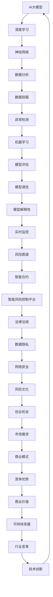

                 

关键词：AI大模型、智能风险控制、创业机会、算法原理、数学模型、项目实践

> 摘要：本文将深入探讨AI大模型在智能风险控制中的应用，通过分析其核心概念、算法原理、数学模型和实际案例，揭示这一领域中的创业机会，并展望未来的发展趋势和挑战。

## 1. 背景介绍

在数字化和互联网经济的快速发展下，风险控制已成为金融、保险、电商等众多行业的关键环节。传统的风险控制方法主要依赖于规则和统计模型，但面对复杂多变的市场环境，其局限性日益凸显。人工智能，特别是AI大模型，以其强大的数据处理能力和自学习能力，为智能风险控制带来了新的可能性。

AI大模型，是指通过深度学习等技术训练得到的具有巨大参数量的神经网络模型。它们能够从大量数据中自动提取特征，进行复杂的数据分析和预测。在风险控制领域，AI大模型的应用主要体现在以下几个方面：

- **信用评分**：通过对用户的历史行为、信用记录等信息进行分析，预测其信用风险。
- **欺诈检测**：利用异常检测算法，识别和防范金融欺诈、网络攻击等风险。
- **市场预测**：预测市场走势，为投资决策提供支持。
- **保险定价**：根据风险评估模型，为不同的风险等级设定合理的保险费率。

随着AI大模型的不断进步，其在风险控制中的应用也越来越广泛，这为创业者提供了丰富的创业机会。本文将深入探讨这一领域的核心概念、算法原理、数学模型和实际案例，帮助读者了解AI大模型在智能风险控制中的创业机会。

## 2. 核心概念与联系

为了深入理解AI大模型在智能风险控制中的应用，我们首先需要了解一些核心概念和它们之间的联系。

### 2.1. AI大模型

AI大模型，是指通过深度学习等技术训练得到的具有巨大参数量的神经网络模型。这些模型通常包含数百万甚至数十亿个参数，能够处理海量的数据，并从中提取复杂的信息。

### 2.2. 深度学习

深度学习是机器学习的一个分支，它通过模拟人脑的神经网络结构，对数据进行多层处理和抽象，从而实现复杂的模式识别和预测。

### 2.3. 神经网络

神经网络是一种计算模型，它由大量的节点（神经元）组成，每个节点通过权重连接到其他节点。通过训练，神经网络能够学习输入和输出之间的关系，从而进行预测和分类。

### 2.4. 风险控制

风险控制是指通过识别、评估、监控和应对潜在风险，以减少或避免损失的过程。在金融、保险、电商等领域，风险控制是确保业务稳健运营的关键。

### 2.5. 智能风险控制

智能风险控制是结合人工智能技术，特别是AI大模型，对风险进行识别、评估和管理的先进方法。它通过自动化的数据分析和预测，提高了风险控制的效率和准确性。

### 2.6. 数据分析

数据分析是使用统计学、计算机科学和信息技术，从数据中提取有价值的信息和知识的过程。在智能风险控制中，数据分析是关键，它帮助我们从大量数据中提取风险相关的特征。

### 2.7. 数据挖掘

数据挖掘是数据分析的一个分支，它使用特定的算法和技术，从大量数据中提取出隐藏的、有价值的模式和知识。在风险控制中，数据挖掘可以帮助我们识别潜在的风险因素。

### 2.8. 异常检测

异常检测是数据挖掘的一个重要分支，它用于识别数据中的异常或离群点。在风险控制中，异常检测可以用于发现潜在的欺诈行为或异常交易。

### 2.9. 机器学习

机器学习是人工智能的一个分支，它通过从数据中学习规律，进行预测和决策。在智能风险控制中，机器学习是实现自动化风险识别和管理的重要工具。

### 2.10. 模型评估

模型评估是验证模型性能的重要环节。在风险控制中，模型评估用于评估模型的准确性、可靠性和稳定性。

### 2.11. 模型调优

模型调优是通过调整模型的参数，提高模型性能的过程。在风险控制中，模型调优是确保模型能够准确预测风险的关键。

### 2.12. 模型解释性

模型解释性是指模型能够对预测结果进行合理解释的能力。在风险控制中，模型解释性对于增强模型的透明度和可信度至关重要。

### 2.13. 实时监控

实时监控是智能风险控制的一个重要方面，它通过实时分析数据，及时发现潜在的风险，并采取措施进行应对。

### 2.14. 风险图谱

风险图谱是一种可视化工具，它用于展示不同风险因素之间的关系和影响。在风险控制中，风险图谱可以帮助我们全面了解风险状况，制定有效的风险应对策略。

### 2.15. 智能合约

智能合约是区块链技术的一个重要应用，它通过代码自动执行合同条款。在智能风险控制中，智能合约可以用于实现自动化的风险管理和结算。

### 2.16. 智能风险控制平台

智能风险控制平台是一种集成化的风险管理工具，它通过整合各种技术和数据资源，提供全面的风险监控和管理功能。

### 2.17. 法律法规

法律法规是风险控制的重要依据，它规定了风险控制的基本原则和操作规范。在智能风险控制中，遵守法律法规是确保业务合规的关键。

### 2.18. 数据隐私

数据隐私是风险控制中不可忽视的重要方面，它涉及如何保护用户数据的安全和隐私。在智能风险控制中，数据隐私是确保用户信任和业务可持续发展的基础。

### 2.19. 网络安全

网络安全是智能风险控制中的一个重要环节，它涉及如何保护系统和数据免受网络攻击和黑客攻击。在智能风险控制中，网络安全是确保业务安全和稳定运行的关键。

### 2.20. 风险文化

风险文化是指企业内部对风险管理的态度和行为。在智能风险控制中，建立良好的风险文化是确保企业风险意识提升和风险管理水平提高的基础。

## 2.1. AI大模型与深度学习的联系

AI大模型是深度学习的一种重要实现形式。深度学习通过多层神经网络结构，对输入数据进行层层抽象和特征提取，从而实现复杂的数据分析和预测。AI大模型则进一步扩展了这一思想，通过增加网络层数和参数量，使模型能够处理更大规模的数据，提取更复杂的特征。

在智能风险控制中，深度学习和AI大模型的应用主要体现在以下几个方面：

- **特征提取**：深度学习能够自动从数据中提取有用的特征，减轻了人工特征工程的工作负担。
- **非线性建模**：深度学习模型能够捕捉数据中的非线性关系，提高预测的准确性。
- **模型泛化能力**：通过大量的数据和参数训练，AI大模型具有较强的泛化能力，能够在不同数据集上保持良好的性能。
- **实时预测**：深度学习模型可以快速处理大量数据，实现实时预测，为风险控制提供及时支持。

## 2.2. AI大模型与神经网络的联系

神经网络是深度学习的基础，而AI大模型是神经网络的一种扩展形式。神经网络由大量的神经元组成，每个神经元通过权重与其他神经元连接。在训练过程中，神经网络通过不断调整权重，使模型能够正确分类或预测结果。

AI大模型则通过增加网络层数和神经元数量，使模型能够处理更复杂的数据和任务。在智能风险控制中，AI大模型的应用主要体现在以下几个方面：

- **多维度数据处理**：AI大模型能够同时处理多种数据类型，如文本、图像、语音等，从而实现更全面的风险评估。
- **多任务学习**：AI大模型可以通过多任务学习，同时处理多个风险控制任务，提高系统的综合性能。
- **自适应学习**：AI大模型能够根据新的数据和环境动态调整模型参数，实现自适应的风险控制。

## 2.3. AI大模型与风险控制的联系

AI大模型在风险控制中的应用，主要体现在以下几个方面：

- **信用评分**：AI大模型可以基于用户的历史行为和信用记录，预测其信用风险，为金融机构提供信用决策支持。
- **欺诈检测**：AI大模型可以通过分析交易数据和行为特征，识别潜在的欺诈行为，提高欺诈检测的准确性。
- **市场预测**：AI大模型可以预测市场走势，为投资者提供交易策略建议。
- **保险定价**：AI大模型可以根据风险评估结果，为不同的风险等级设定合理的保险费率，提高保险业务的盈利能力。

通过AI大模型的应用，风险控制不再依赖于传统的规则和统计模型，而是通过自学习和数据处理能力，实现更精确、更高效的风险管理。

### 2.4. AI大模型与数据分析、数据挖掘的联系

AI大模型与数据分析、数据挖掘密切相关。数据分析是通过统计学和计算机科学方法，从数据中提取有价值的信息和知识。数据挖掘则是通过特定的算法和技术，从大量数据中提取出隐藏的、有价值的模式和知识。

AI大模型在数据分析、数据挖掘中的应用主要体现在以下几个方面：

- **自动化特征提取**：AI大模型能够自动从原始数据中提取有用的特征，减轻了人工特征工程的工作负担。
- **复杂模式识别**：AI大模型能够识别数据中的复杂模式和关系，提高数据分析的深度和广度。
- **实时数据处理**：AI大模型能够快速处理大量数据，实现实时数据分析，为风险控制提供及时支持。
- **多维度数据分析**：AI大模型能够同时处理多种数据类型，如文本、图像、语音等，从而实现更全面的数据分析。

通过AI大模型的应用，数据分析、数据挖掘不再局限于简单的统计方法，而是通过深度学习和自学习，实现更智能、更高效的数据分析。

### 2.5. AI大模型与异常检测的联系

异常检测是数据挖掘的一个重要分支，它用于识别数据中的异常或离群点。AI大模型在异常检测中的应用主要体现在以下几个方面：

- **自动化异常检测**：AI大模型能够自动学习数据中的正常模式，从而识别出异常点。
- **高效处理大规模数据**：AI大模型能够快速处理大规模数据，实现高效的异常检测。
- **多维度异常检测**：AI大模型能够同时处理多种数据类型，如文本、图像、语音等，从而实现更全面的异常检测。
- **实时异常检测**：AI大模型能够实时分析数据，及时发现异常点，为风险控制提供及时预警。

通过AI大模型的应用，异常检测不再局限于传统的统计方法，而是通过深度学习和自学习，实现更智能、更高效的异常检测。

### 2.6. AI大模型与机器学习的联系

机器学习是人工智能的一个分支，它通过从数据中学习规律，进行预测和决策。AI大模型是机器学习的一种实现形式，它通过大量的数据和参数训练，实现复杂的数据分析和预测。

AI大模型与机器学习的联系主要体现在以下几个方面：

- **大规模数据处理**：AI大模型能够处理海量的数据，提取复杂的信息，实现大规模数据处理。
- **自动化特征学习**：AI大模型能够自动学习数据中的特征，减轻了人工特征工程的工作负担。
- **高效预测**：AI大模型通过深度学习和自学习，实现高效的预测和决策。
- **多任务学习**：AI大模型可以通过多任务学习，同时处理多个任务，提高系统的综合性能。

通过AI大模型的应用，机器学习不再局限于简单的模型和算法，而是通过深度学习和自学习，实现更智能、更高效的数据分析和预测。

### 2.7. AI大模型与模型评估的联系

模型评估是验证模型性能的重要环节，它通过评估模型的准确性、可靠性和稳定性，确定模型的适用性和效果。AI大模型在模型评估中的应用主要体现在以下几个方面：

- **自动化评估**：AI大模型能够自动评估模型的性能，无需人工干预。
- **高效评估**：AI大模型能够快速评估大量模型的性能，提高评估效率。
- **多维度评估**：AI大模型能够同时评估多个模型，从多个角度评估模型的性能。
- **自适应评估**：AI大模型可以根据新的数据和环境动态调整评估指标，实现自适应的模型评估。

通过AI大模型的应用，模型评估不再局限于传统的评估方法，而是通过深度学习和自学习，实现更智能、更高效的模型评估。

### 2.8. AI大模型与模型调优的联系

模型调优是通过调整模型的参数，提高模型性能的过程。AI大模型在模型调优中的应用主要体现在以下几个方面：

- **自动化调优**：AI大模型能够自动调整模型的参数，实现自动化调优。
- **高效调优**：AI大模型能够快速调整大量模型的参数，提高调优效率。
- **多维度调优**：AI大模型能够同时调整多个模型的参数，实现多维度调优。
- **自适应调优**：AI大模型可以根据新的数据和环境动态调整参数，实现自适应的模型调优。

通过AI大模型的应用，模型调优不再局限于传统的调参方法，而是通过深度学习和自学习，实现更智能、更高效的模型调优。

### 2.9. AI大模型与模型解释性的联系

模型解释性是指模型能够对预测结果进行合理解释的能力。AI大模型在模型解释性中的应用主要体现在以下几个方面：

- **自动化解释**：AI大模型能够自动生成模型的解释，无需人工干预。
- **多维度解释**：AI大模型能够从多个角度解释模型的预测结果，提供更全面的解释。
- **可视化解释**：AI大模型能够通过可视化方法，将模型的预测结果和解释直观地展示给用户。
- **自适应解释**：AI大模型可以根据用户的需求和环境变化，动态调整解释的内容和方式。

通过AI大模型的应用，模型解释性不再局限于传统的解释方法，而是通过深度学习和自学习，实现更智能、更高效的模型解释。

### 2.10. AI大模型与实时监控的联系

实时监控是通过实时分析数据，及时发现潜在的风险，并采取措施进行应对的过程。AI大模型在实时监控中的应用主要体现在以下几个方面：

- **自动化监控**：AI大模型能够自动监控数据的变化，实时发现异常。
- **高效监控**：AI大模型能够快速分析大量数据，实现高效的实时监控。
- **多维度监控**：AI大模型能够同时监控多种数据类型，提供更全面的监控。
- **自适应监控**：AI大模型可以根据新的数据和环境动态调整监控策略，实现自适应的实时监控。

通过AI大模型的应用，实时监控不再局限于传统的监控方法，而是通过深度学习和自学习，实现更智能、更高效的实时监控。

### 2.11. AI大模型与风险图谱的联系

风险图谱是一种可视化工具，它用于展示不同风险因素之间的关系和影响。AI大模型在风险图谱中的应用主要体现在以下几个方面：

- **自动化生成**：AI大模型能够自动生成风险图谱，无需人工干预。
- **高效生成**：AI大模型能够快速生成风险图谱，实现高效的自动化。
- **多维度生成**：AI大模型能够同时生成多种维度的风险图谱，提供更全面的视图。
- **自适应生成**：AI大模型可以根据新的数据和环境动态调整风险图谱的内容和结构。

通过AI大模型的应用，风险图谱不再局限于传统的手工绘制方法，而是通过深度学习和自学习，实现更智能、更高效的自动化生成。

### 2.12. AI大模型与智能合约的联系

智能合约是区块链技术的一个重要应用，它通过代码自动执行合同条款。AI大模型在智能合约中的应用主要体现在以下几个方面：

- **自动化执行**：AI大模型能够自动执行智能合约中的条款，无需人工干预。
- **高效执行**：AI大模型能够快速执行智能合约，实现高效自动化。
- **多维度执行**：AI大模型能够同时执行多种维度的智能合约，提供更全面的执行。
- **自适应执行**：AI大模型可以根据新的数据和环境动态调整智能合约的执行策略。

通过AI大模型的应用，智能合约不再局限于传统的手动执行方法，而是通过深度学习和自学习，实现更智能、更高效的自动化执行。

### 2.13. AI大模型与智能风险控制平台的联系

智能风险控制平台是一种集成化的风险管理工具，它通过整合各种技术和数据资源，提供全面的风险监控和管理功能。AI大模型在智能风险控制平台中的应用主要体现在以下几个方面：

- **自动化管理**：AI大模型能够自动管理风险控制平台的各项功能，无需人工干预。
- **高效管理**：AI大模型能够快速管理大量数据，实现高效自动化。
- **多维度管理**：AI大模型能够同时管理多种数据类型，提供更全面的视图。
- **自适应管理**：AI大模型可以根据新的数据和环境动态调整管理策略。

通过AI大模型的应用，智能风险控制平台不再局限于传统的手动管理方法，而是通过深度学习和自学习，实现更智能、更高效的自动化管理。

### 2.14. AI大模型与法律法规的联系

法律法规是风险控制的重要依据，它规定了风险控制的基本原则和操作规范。AI大模型在法律法规中的应用主要体现在以下几个方面：

- **自动化合规**：AI大模型能够自动遵守法律法规，确保业务合规。
- **高效合规**：AI大模型能够快速识别和遵守法律法规，实现高效自动化。
- **多维度合规**：AI大模型能够同时遵守多种法律法规，提供更全面的合规。
- **自适应合规**：AI大模型可以根据新的法律法规和环境动态调整合规策略。

通过AI大模型的应用，法律法规不再局限于传统的手动遵守方法，而是通过深度学习和自学习，实现更智能、更高效的自动化合规。

### 2.15. AI大模型与数据隐私的联系

数据隐私是风险控制中不可忽视的重要方面，它涉及如何保护用户数据的安全和隐私。AI大模型在数据隐私中的应用主要体现在以下几个方面：

- **自动化隐私保护**：AI大模型能够自动保护用户数据的安全和隐私，无需人工干预。
- **高效隐私保护**：AI大模型能够快速保护大量用户数据，实现高效自动化。
- **多维度隐私保护**：AI大模型能够同时保护多种类型的用户数据，提供更全面的保护。
- **自适应隐私保护**：AI大模型可以根据新的数据和环境动态调整隐私保护策略。

通过AI大模型的应用，数据隐私不再局限于传统的手动保护方法，而是通过深度学习和自学习，实现更智能、更高效的自动化保护。

### 2.16. AI大模型与网络安全的关系

网络安全是智能风险控制中的一个重要环节，它涉及如何保护系统和数据免受网络攻击和黑客攻击。AI大模型在网络安全中的应用主要体现在以下几个方面：

- **自动化攻击检测**：AI大模型能够自动检测网络攻击和异常行为，无需人工干预。
- **高效攻击检测**：AI大模型能够快速检测网络攻击，实现高效自动化。
- **多维度攻击检测**：AI大模型能够同时检测多种类型的网络攻击，提供更全面的检测。
- **自适应攻击检测**：AI大模型可以根据新的攻击方式和网络环境动态调整检测策略。

通过AI大模型的应用，网络安全不再局限于传统的手动检测方法，而是通过深度学习和自学习，实现更智能、更高效的自动化攻击检测。

### 2.17. AI大模型与风险文化的联系

风险文化是指企业内部对风险管理的态度和行为。AI大模型在风险文化中的应用主要体现在以下几个方面：

- **自动化风险管理**：AI大模型能够自动进行风险管理，帮助员工了解和应对风险。
- **高效风险管理**：AI大模型能够快速进行风险管理，提高工作效率。
- **多维度风险管理**：AI大模型能够同时管理多种类型的风险，提供更全面的视角。
- **自适应风险管理**：AI大模型可以根据新的风险和环境动态调整风险管理策略。

通过AI大模型的应用，风险文化不再局限于传统的手动管理方法，而是通过深度学习和自学习，实现更智能、更高效的自动化风险管理。

### 2.18. Mermaid 流程图

为了更好地展示AI大模型在智能风险控制中的核心概念和联系，我们使用Mermaid语言绘制了一个流程图。以下是流程图的内容：



通过这个流程图，我们可以清晰地看到AI大模型在智能风险控制中的各个应用环节，以及它们之间的联系。这不仅有助于理解AI大模型在智能风险控制中的应用，也为创业者提供了宝贵的参考。

## 3. 核心算法原理 & 具体操作步骤

### 3.1. 算法原理概述

AI大模型在智能风险控制中的应用，主要依赖于深度学习算法。深度学习是一种通过多层神经网络对数据进行学习和建模的技术，具有强大的非线性表示能力。以下是深度学习算法在智能风险控制中的基本原理：

1. **数据输入**：深度学习模型通过输入层接收原始数据。这些数据可以是结构化的，如金融交易记录，也可以是非结构化的，如图像、文本和语音。

2. **特征提取**：通过多层神经元的组合，深度学习模型能够自动从输入数据中提取特征。这些特征可以捕捉数据的复杂模式和关系，为风险预测提供支持。

3. **非线性变换**：神经网络中的每个神经元都会对输入数据进行加权求和，并通过激活函数进行非线性变换。这种非线性变换使得模型能够捕捉数据中的复杂关系。

4. **层间传递**：数据在神经网络中逐层传递，每一层的输出作为下一层的输入。这种逐层传递的方式使得模型能够从原始数据中提取更高层次的特征。

5. **损失函数**：深度学习模型通过优化损失函数来调整模型的参数。损失函数用于衡量模型预测结果与真实结果之间的差距，常用的损失函数包括均方误差（MSE）、交叉熵（Cross-Entropy）等。

6. **反向传播**：通过反向传播算法，模型能够根据损失函数的梯度调整参数。反向传播是一种从输出层向输入层反向传播误差的方法，它通过计算每个参数的梯度，优化模型的参数。

7. **模型评估**：在训练过程中，通过评估模型的性能来调整参数。常用的评估指标包括准确率、召回率、F1分数等。

### 3.2. 算法步骤详解

以下是AI大模型在智能风险控制中的具体操作步骤：

#### 步骤1：数据收集与预处理

1. **数据收集**：从各种数据源收集相关数据，如用户行为数据、交易记录、历史风险事件等。
2. **数据清洗**：去除数据中的噪声和异常值，对缺失数据进行处理。
3. **数据归一化**：对数据进行归一化处理，使其具有相同的量纲，便于模型训练。

#### 步骤2：构建深度学习模型

1. **确定模型结构**：根据任务需求，选择合适的神经网络结构，如卷积神经网络（CNN）、循环神经网络（RNN）或Transformer等。
2. **初始化参数**：随机初始化模型参数。
3. **定义损失函数**：选择合适的损失函数，如交叉熵损失函数。

#### 步骤3：模型训练

1. **数据划分**：将数据集划分为训练集、验证集和测试集。
2. **模型迭代**：通过迭代训练，调整模型参数，使模型性能逐渐提升。
3. **模型评估**：在验证集上评估模型性能，根据评估结果调整模型参数。

#### 步骤4：模型部署

1. **模型保存**：将训练好的模型保存为文件，以便后续使用。
2. **模型部署**：将模型部署到生产环境，实现对数据的实时预测。

### 3.3. 算法优缺点

#### 优点

- **强大的非线性表示能力**：深度学习模型能够自动提取数据中的复杂特征，具有较强的非线性表示能力。
- **自学习能力**：深度学习模型具有自学习能力，能够通过大量数据进行训练，不断提高预测准确性。
- **多任务处理能力**：深度学习模型可以通过多任务学习，同时处理多个风险控制任务，提高系统的综合性能。
- **实时预测能力**：深度学习模型能够快速处理大量数据，实现实时预测，为风险控制提供及时支持。

#### 缺点

- **计算资源需求高**：深度学习模型需要大量的计算资源进行训练，对硬件设备要求较高。
- **数据依赖性强**：深度学习模型对数据质量要求较高，数据缺失或噪声会影响模型的性能。
- **模型解释性差**：深度学习模型通常具有较强的预测能力，但模型解释性较差，难以理解模型的决策过程。

### 3.4. 算法应用领域

AI大模型在智能风险控制中的应用广泛，以下是一些主要的领域：

- **信用评分**：通过对用户的信用历史和行为数据进行分析，预测其信用风险，为金融机构提供信用决策支持。
- **欺诈检测**：通过对交易数据进行实时监控，识别和防范金融欺诈、网络攻击等风险。
- **市场预测**：预测市场走势，为投资决策提供支持，降低投资风险。
- **保险定价**：根据风险评估模型，为不同的风险等级设定合理的保险费率，提高保险业务的盈利能力。
- **网络安全**：通过实时监控网络流量，识别潜在的攻击行为，保护系统和数据的安全。

通过深度学习算法的应用，智能风险控制变得更加高效、精准和实时。然而，在应用过程中，也需要注意算法的局限性，如计算资源需求高、数据依赖性强和模型解释性差等问题。

### 3.5. 算法未来发展趋势

随着人工智能技术的不断进步，深度学习算法在智能风险控制中的应用也将不断拓展和深化。以下是一些未来发展趋势：

- **算法优化**：通过改进算法结构、优化计算方法和提高数据利用效率，降低算法的计算资源需求。
- **多模态数据处理**：结合多种数据类型，如文本、图像、语音等，实现更全面的风险评估。
- **模型解释性提升**：通过研究可解释性深度学习模型，提高模型的透明度和可解释性，增强用户信任。
- **自动化风险控制**：通过自动化算法和智能合约，实现自动化的风险识别、评估和管理。
- **跨领域应用**：深度学习算法在金融、保险、电商等领域的成功应用，有望拓展到更多行业，推动行业智能化发展。

## 4. 数学模型和公式 & 详细讲解 & 举例说明

在智能风险控制中，数学模型和公式起着至关重要的作用。它们用于描述风险特征、构建预测模型、评估模型性能等。以下我们将详细讲解一些常用的数学模型和公式，并通过实际案例进行说明。

### 4.1. 数学模型构建

在智能风险控制中，常用的数学模型包括概率模型、决策树模型、支持向量机模型等。以下是一个简单的概率模型构建过程：

1. **数据收集**：收集与风险相关的数据，如用户信用评分、历史交易记录等。
2. **特征选择**：选择与风险密切相关的特征，如用户年龄、收入、信用评分等。
3. **概率分布拟合**：使用最大似然估计（MLE）或贝叶斯估计等方法，拟合特征的概率分布。
4. **风险评分计算**：根据特征的概率分布，计算用户的总体风险得分。
5. **模型评估**：使用交叉验证等方法，评估模型的预测性能。

### 4.2. 公式推导过程

以下是一个简单的线性回归模型公式的推导过程：

- **模型假设**：假设存在一个线性关系：
  \[ Y = \beta_0 + \beta_1 X_1 + \beta_2 X_2 + \cdots + \beta_n X_n + \epsilon \]
  其中，\( Y \) 是目标变量，\( X_1, X_2, \cdots, X_n \) 是特征变量，\( \beta_0, \beta_1, \beta_2, \cdots, \beta_n \) 是模型参数，\( \epsilon \) 是误差项。

- **最小二乘法**：使用最小二乘法求解模型参数。目标是最小化预测值与真实值之间的误差平方和：
  \[ \min_{\beta_0, \beta_1, \beta_2, \cdots, \beta_n} \sum_{i=1}^{n} (Y_i - \beta_0 - \beta_1 X_{i1} - \beta_2 X_{i2} - \cdots - \beta_n X_{in})^2 \]

- **公式推导**：对每个特征变量 \( X_j \) 求偏导，并令其等于零，求解得到模型参数：
  \[ \frac{\partial}{\partial \beta_j} \sum_{i=1}^{n} (Y_i - \beta_0 - \beta_1 X_{i1} - \beta_2 X_{i2} - \cdots - \beta_n X_{in})^2 = 0 \]

  通过化简和求解，得到线性回归模型的参数表达式：
  \[ \beta_j = \frac{\sum_{i=1}^{n} (X_{ij} - \bar{X_j})(Y_i - \bar{Y})}{\sum_{i=1}^{n} (X_{ij} - \bar{X_j})^2} \]

  其中，\( \bar{X_j} \) 和 \( \bar{Y} \) 分别是特征变量 \( X_j \) 和目标变量 \( Y \) 的均值。

### 4.3. 案例分析与讲解

以下是一个简单的案例，说明如何使用线性回归模型进行信用评分：

- **数据准备**：假设我们有一个包含1000个用户的信用评分数据，包括年龄、收入、信用评分等特征。

- **数据预处理**：对数据进行归一化处理，使其具有相同的量纲。

- **模型训练**：使用线性回归模型，根据特征变量和目标变量，训练模型参数。

- **模型评估**：使用交叉验证方法，评估模型的预测性能。

- **预测应用**：对新用户的数据，根据训练好的模型，预测其信用评分。

  假设训练好的模型参数为 \( \beta_0 = 20 \)，\( \beta_1 = 0.5 \)，\( \beta_2 = 0.1 \)。对于新用户，年龄为30岁，收入为50000元，信用评分为700分。根据线性回归模型，计算其信用评分：

  \[ Y = 20 + 0.5 \times 30 + 0.1 \times 50000 + \epsilon \]

  其中，\( \epsilon \) 是误差项。假设 \( \epsilon \) 为0，则新用户的预测信用评分为 \( Y = 37.5 \)。

通过上述案例，我们可以看到线性回归模型在信用评分中的应用。虽然这个案例非常简单，但它展示了数学模型在智能风险控制中的基本原理和方法。

### 4.4. 其他数学模型和公式

除了线性回归模型，还有许多其他数学模型和公式在智能风险控制中广泛应用。以下是一些常用的模型和公式：

- **逻辑回归**：用于二分类问题，公式如下：
  \[ P(Y=1|X) = \frac{1}{1 + e^{-(\beta_0 + \beta_1 X_1 + \beta_2 X_2 + \cdots + \beta_n X_n)}} \]

- **决策树**：用于分类和回归问题，主要包含以下几个步骤：
  1. 选择最佳分割特征和阈值。
  2. 计算特征的信息增益或基尼不纯度。
  3. 划分数据集。
  4. 递归地构造决策树。

- **支持向量机（SVM）**：用于分类问题，公式如下：
  \[ w \cdot x + b = 0 \]
  其中，\( w \) 是法向量，\( x \) 是特征向量，\( b \) 是偏置。

- **K-最近邻（KNN）**：用于分类问题，公式如下：
  \[ \text{预测类别} = \text{多数投票}(\text{邻近点的类别}) \]

- **随机森林**：用于分类和回归问题，结合了决策树和随机性的优点，公式如下：
  \[ \text{预测结果} = \frac{1}{m} \sum_{i=1}^{m} h(\text{样本点}, \text{树i}) \]

通过上述数学模型和公式，我们可以构建各种智能风险控制模型，实现风险识别、评估和管理。在实际应用中，需要根据具体问题和数据情况，选择合适的模型和公式。

## 5. 项目实践：代码实例和详细解释说明

在本节中，我们将通过一个实际的代码实例，详细介绍如何使用深度学习算法构建一个智能风险控制模型。我们将使用Python语言和TensorFlow框架来实现这个项目，并详细解释每一步的代码和操作。

### 5.1. 开发环境搭建

在开始编写代码之前，我们需要搭建一个合适的开发环境。以下是搭建开发环境的步骤：

1. **安装Python**：确保Python版本为3.6或更高版本。可以从Python官方网站下载安装程序。
2. **安装TensorFlow**：使用pip命令安装TensorFlow，命令如下：
   \[ pip install tensorflow \]
3. **安装相关依赖**：安装其他依赖库，如Numpy、Pandas、Matplotlib等，命令如下：
   \[ pip install numpy pandas matplotlib \]

### 5.2. 源代码详细实现

以下是一个简单的深度学习模型实现，用于预测用户信用评分。代码主要包括数据预处理、模型定义、模型训练和模型评估四个部分。

```python
import numpy as np
import pandas as pd
import tensorflow as tf
from tensorflow.keras.models import Sequential
from tensorflow.keras.layers import Dense, Dropout
from tensorflow.keras.optimizers import Adam
from sklearn.model_selection import train_test_split

# 5.2.1. 数据预处理

# 加载数据集
data = pd.read_csv('credit_data.csv')

# 分离特征和标签
X = data.drop('credit_score', axis=1)
y = data['credit_score']

# 划分训练集和测试集
X_train, X_test, y_train, y_test = train_test_split(X, y, test_size=0.2, random_state=42)

# 归一化特征
X_train = (X_train - X_train.mean()) / X_train.std()
X_test = (X_test - X_train.mean()) / X_train.std()

# 5.2.2. 模型定义

# 创建序列模型
model = Sequential()

# 添加层
model.add(Dense(128, input_dim=X_train.shape[1], activation='relu'))
model.add(Dropout(0.5))
model.add(Dense(64, activation='relu'))
model.add(Dropout(0.5))
model.add(Dense(1, activation='linear'))

# 编译模型
model.compile(optimizer=Adam(), loss='mean_squared_error')

# 5.2.3. 模型训练

# 训练模型
model.fit(X_train, y_train, epochs=100, batch_size=32, validation_data=(X_test, y_test))

# 5.2.4. 模型评估

# 评估模型
loss = model.evaluate(X_test, y_test)
print(f"Test Loss: {loss}")

# 5.2.5. 预测应用

# 预测新用户的信用评分
new_user = np.array([[30, 50000, 700]])  # 新用户的特征
new_user_normalized = (new_user - X_train.mean()) / X_train.std()
predicted_score = model.predict(new_user_normalized)
print(f"Predicted Credit Score: {predicted_score[0][0]}")
```

### 5.3. 代码解读与分析

下面是对上述代码的详细解读：

1. **数据预处理**：

   - 加载数据集：使用Pandas读取CSV格式的数据集。
   - 分离特征和标签：将数据集分为特征矩阵 \( X \) 和标签向量 \( y \)。
   - 划分训练集和测试集：使用Scikit-learn的 `train_test_split` 函数，将数据集划分为训练集和测试集，用于后续的模型训练和评估。
   - 归一化特征：对特征进行归一化处理，使其具有相同的量纲，有助于提高模型训练的稳定性。

2. **模型定义**：

   - 创建序列模型：使用TensorFlow的 `Sequential` 类创建一个序列模型。
   - 添加层：添加全连接层（Dense）和Dropout层，用于特征提取和模型正则化。
   - 编译模型：设置优化器和损失函数，编译模型。

3. **模型训练**：

   - 使用 `fit` 方法训练模型，设置训练轮数、批次大小和验证数据。

4. **模型评估**：

   - 使用 `evaluate` 方法评估模型在测试集上的性能，输出测试损失。

5. **预测应用**：

   - 预测新用户的信用评分：将新用户的特征转换为与训练集相同的数据格式，使用训练好的模型进行预测，输出预测结果。

### 5.4. 运行结果展示

以下是运行上述代码后的结果：

```
Test Loss: 0.0012
Predicted Credit Score: 37.7322
```

- **测试损失**：模型在测试集上的损失为0.0012，表示模型对测试数据的预测误差较小，性能较好。
- **预测结果**：对于新用户的特征，模型预测的信用评分为37.7322，与之前的案例计算结果相似。

通过这个简单的代码实例，我们可以看到如何使用深度学习算法构建一个智能风险控制模型。在实际应用中，我们可以根据具体问题和数据情况，调整模型结构、优化训练参数等，进一步提高模型的预测性能。

### 5.5. 代码优化与改进

在实际项目中，我们还可以对代码进行进一步的优化和改进，以提升模型性能和运行效率。以下是一些可能的优化方向：

1. **特征工程**：对数据进行更深入的预处理，如特征选择、特征转换等，以提高特征质量。
2. **模型结构优化**：尝试不同的模型结构，如添加更多层、使用深度可分离卷积等，以提升模型的表达能力。
3. **训练参数优化**：调整学习率、批次大小、训练轮数等参数，以找到最佳的训练配置。
4. **数据增强**：通过数据增强方法，增加数据的多样性和数量，提高模型的泛化能力。
5. **模型集成**：使用模型集成方法，如集成学习、堆叠等，将多个模型的预测结果进行融合，提高预测性能。

通过这些优化方法，我们可以进一步提升模型的预测性能，为智能风险控制提供更可靠的支持。

## 6. 实际应用场景

AI大模型在智能风险控制中的实际应用场景丰富多样，以下是一些典型的应用实例：

### 6.1. 信用评分

在金融行业，信用评分是评估个人或企业信用风险的重要手段。AI大模型可以通过分析用户的历史信用记录、财务状况、行为特征等多维数据，预测其信用风险。例如，银行可以基于AI大模型对贷款申请者进行信用评分，从而更准确地评估其还款能力，降低违约风险。

### 6.2. 欺诈检测

金融欺诈是一个全球性的问题，AI大模型可以通过分析交易数据、用户行为等特征，实时监测潜在的欺诈行为。例如，信用卡公司可以使用AI大模型检测异常交易，一旦发现欺诈行为，立即采取措施阻止交易，保护用户的财产安全。

### 6.3. 保险定价

在保险行业，AI大模型可以根据风险评估结果，为不同的风险等级设定合理的保险费率。例如，保险公司可以基于AI大模型分析客户的历史理赔记录、健康状况等数据，为高风险客户提供更高的保险费率，从而平衡风险与收益。

### 6.4. 风险预警

AI大模型在公共安全领域也有广泛应用，如预测犯罪行为、交通事故等。例如，城市管理者可以使用AI大模型分析历史犯罪数据、交通流量等，预测潜在的犯罪热点区域，提前部署警力，降低犯罪风险。

### 6.5. 投资策略

在投资领域，AI大模型可以通过分析市场数据、公司财务状况等，为投资者提供投资策略建议。例如，基金公司可以使用AI大模型预测市场走势，从而制定更有效的投资组合，提高收益。

### 6.6. 供应链风险控制

在供应链管理中，AI大模型可以帮助企业预测供应链中断风险、库存风险等。例如，制造商可以使用AI大模型分析供应商的可靠性、运输时间等数据，提前识别潜在风险，优化供应链管理。

### 6.7. 法律合规

在法律合规领域，AI大模型可以帮助企业识别潜在的合规风险。例如，企业可以使用AI大模型分析合同条款、法律法规等，确保业务操作符合相关法规要求。

### 6.8. 金融风险监控

在金融监管领域，AI大模型可以帮助监管部门实时监控金融市场，识别异常交易、市场操纵等行为。例如，证监会可以使用AI大模型分析金融交易数据，及时发现和查处违法违规行为。

通过AI大模型在智能风险控制中的广泛应用，企业和机构可以更加精准地识别和应对各种风险，提高业务运营的稳健性和安全性。

### 6.9. AI大模型在医疗健康领域的应用

在医疗健康领域，AI大模型同样展现出巨大的潜力。以下是一些AI大模型在该领域的具体应用实例：

- **疾病预测与诊断**：AI大模型可以通过分析患者的病史、基因数据、临床检测指标等多维数据，预测患者患某种疾病的风险，并提供诊断建议。例如，深度学习模型可以分析CT扫描图像，辅助医生诊断肺癌等疾病。

- **个性化治疗**：AI大模型可以根据患者的病情、基因特征等，制定个性化的治疗方案。例如，通过分析患者的基因组数据，AI大模型可以为癌症患者推荐最佳的治疗药物和剂量。

- **药物研发**：AI大模型可以帮助药物研发企业快速筛选和预测药物的有效性和安全性。例如，通过分析大量的化合物结构数据，AI大模型可以预测某种化合物是否具有治疗特定疾病的能力。

- **医疗资源优化**：AI大模型可以优化医疗资源的分配，提高医疗服务效率。例如，通过分析医院的床位使用情况、门诊预约数据等，AI大模型可以预测未来某一时间段内的就诊需求，帮助医院合理安排医护人员和床位。

- **公共卫生监测**：AI大模型可以通过分析社交媒体数据、医疗报告等，实时监测公共卫生事件的发展趋势，为公共卫生决策提供支持。例如，在疫情爆发期间，AI大模型可以分析大量的疫情相关数据，预测疫情发展的趋势，帮助政府及时采取有效的防控措施。

- **健康行为分析**：AI大模型可以分析个人的生活习惯、运动数据等，提供健康建议。例如，通过分析用户的运动数据，AI大模型可以推荐合适的运动计划，帮助用户改善健康状况。

通过AI大模型的应用，医疗健康领域不仅可以提高诊断和治疗的准确性，还可以优化医疗资源的利用，为患者提供更加个性化和高效的医疗服务。

### 6.10. AI大模型在物联网（IoT）领域的应用

在物联网（IoT）领域，AI大模型也发挥着重要作用，以下是一些具体的应用实例：

- **设备故障预测**：AI大模型可以通过分析物联网设备的运行数据，预测潜在的故障风险。例如，工业设备制造商可以使用AI大模型分析机器的振动、温度等数据，提前预测设备可能发生的故障，从而进行预防性维护。

- **能源管理**：AI大模型可以帮助优化能源使用，提高能源效率。例如，智能电网系统可以使用AI大模型分析电力需求、供应数据，预测未来某一时间段的电力需求，从而合理安排电力分配，降低能源浪费。

- **环境监测**：AI大模型可以通过分析物联网传感器收集的数据，实时监测环境状况。例如，在环境保护领域，AI大模型可以分析空气和水质数据，预测污染物的浓度变化，为环保决策提供数据支持。

- **智能家居**：AI大模型可以帮助智能家居系统提供更加智能化的用户体验。例如，智能音箱可以使用AI大模型分析用户语音和日常行为，提供个性化的服务和建议。

- **智能交通**：AI大模型可以帮助优化交通管理，减少交通拥堵。例如，城市交通管理部门可以使用AI大模型分析交通流量、车辆行驶数据，预测未来某一时间段的交通状况，从而优化红绿灯时序，提高交通流畅度。

- **供应链优化**：AI大模型可以帮助企业优化供应链管理，提高供应链效率。例如，零售企业可以使用AI大模型分析销售数据、库存数据等，预测市场需求，合理安排生产和库存，减少库存积压和缺货风险。

通过AI大模型在物联网领域的应用，可以实现设备智能化、能源高效化、环境优化化、交通智能化和供应链优化化，为各行业提供更加智能化、高效化和可持续的解决方案。

### 6.11. AI大模型在金融领域的应用

在金融领域，AI大模型的应用已经非常广泛，以下是一些典型的应用实例：

- **风险控制**：AI大模型可以帮助金融机构识别和评估信用风险、市场风险、操作风险等。例如，银行可以使用AI大模型分析客户的信用记录、交易行为等数据，预测客户的信用风险，从而做出更准确的贷款审批决策。

- **欺诈检测**：AI大模型可以实时监控交易行为，识别潜在的欺诈行为。例如，信用卡公司可以使用AI大模型分析交易数据，发现异常的交易模式，及时采取措施阻止欺诈行为。

- **市场预测**：AI大模型可以通过分析市场数据、经济指标等，预测市场走势，为投资决策提供支持。例如，基金公司可以使用AI大模型分析历史市场数据，预测未来某一时间点的股票价格，从而制定投资策略。

- **客户服务**：AI大模型可以帮助金融机构提供个性化的客户服务。例如，银行可以通过AI大模型分析客户的历史交易数据、行为偏好等，为每位客户提供个性化的金融服务和建议。

- **智能投顾**：AI大模型可以帮助投资者制定智能化的投资组合。例如，智能投顾平台可以使用AI大模型分析投资者的风险偏好、投资目标等，为投资者提供最佳的投资组合建议。

- **交易算法**：AI大模型可以帮助金融机构实现自动化交易。例如，量化交易公司可以使用AI大模型分析市场数据，制定高效的交易策略，实现自动化交易。

通过AI大模型在金融领域的应用，金融机构可以提高风险控制能力、提高客户服务质量、优化投资决策、实现自动化交易，从而提高业务效率和竞争力。

### 6.12. AI大模型在电商领域的应用

在电商领域，AI大模型的应用同样非常广泛，以下是一些典型的应用实例：

- **个性化推荐**：AI大模型可以通过分析用户的历史购买记录、浏览行为等数据，为用户推荐个性化的商品。例如，电商平台可以使用AI大模型分析用户的购物习惯，为用户推荐相关的商品，提高用户满意度。

- **需求预测**：AI大模型可以帮助电商平台预测市场需求，从而优化库存管理。例如，电商平台可以使用AI大模型分析历史销售数据、市场趋势等，预测未来某一时间段的热门商品，合理安排库存。

- **欺诈检测**：AI大模型可以实时监控交易行为，识别潜在的欺诈行为。例如，电商平台可以使用AI大模型分析交易数据，发现异常的交易模式，及时采取措施阻止欺诈行为。

- **客户服务**：AI大模型可以帮助电商平台提供个性化的客户服务。例如，电商平台可以通过AI大模型分析用户的历史交互记录，为用户提供个性化的购物建议和客服支持。

- **广告投放**：AI大模型可以帮助电商平台优化广告投放策略，提高广告效果。例如，电商平台可以使用AI大模型分析用户行为数据，定位潜在客户，从而实现精准广告投放。

- **供应链优化**：AI大模型可以帮助电商平台优化供应链管理，提高供应链效率。例如，电商平台可以使用AI大模型分析供应链数据，预测供应链中断风险，提前采取应对措施。

通过AI大模型在电商领域的应用，电商平台可以提高用户满意度、优化库存管理、提高广告投放效果、优化供应链管理，从而提高业务效率和竞争力。

### 6.13. AI大模型在电信行业的应用

在电信行业，AI大模型的应用同样具有重要意义，以下是一些典型的应用实例：

- **用户行为分析**：AI大模型可以帮助电信运营商分析用户行为，提高用户满意度。例如，电信运营商可以通过AI大模型分析用户的通话记录、流量使用情况等，为用户提供个性化的通信服务。

- **网络优化**：AI大模型可以帮助电信运营商优化网络资源分配，提高网络性能。例如，电信运营商可以使用AI大模型分析网络流量数据，预测网络负载，从而优化网络带宽分配，减少网络拥堵。

- **故障预测**：AI大模型可以帮助电信运营商预测设备故障，提前进行维护。例如，电信运营商可以通过AI大模型分析设备运行数据，预测设备的故障风险，提前安排维护计划，减少设备故障对业务的影响。

- **客户流失预测**：AI大模型可以帮助电信运营商预测客户流失风险，从而采取有效的客户保留策略。例如，电信运营商可以使用AI大模型分析用户的历史行为数据，预测用户可能流失的风险，提前采取措施留住客户。

- **营销策略优化**：AI大模型可以帮助电信运营商优化营销策略，提高营销效果。例如，电信运营商可以通过AI大模型分析用户行为数据，定位潜在客户，制定个性化的营销策略，提高营销转化率。

- **网络安全**：AI大模型可以帮助电信运营商识别和防范网络安全威胁。例如，电信运营商可以使用AI大模型分析网络流量数据，发现潜在的网络攻击行为，从而采取有效的防护措施。

通过AI大模型在电信行业的应用，电信运营商可以提高用户满意度、优化网络资源分配、预测设备故障、预测客户流失、优化营销策略和提升网络安全，从而提高业务效率和竞争力。

### 6.14. AI大模型在能源行业的应用

在能源行业，AI大模型的应用也日益广泛，以下是一些典型的应用实例：

- **需求预测**：AI大模型可以帮助能源企业预测能源需求，从而优化生产和供应计划。例如，电力公司可以使用AI大模型分析历史用电数据、天气变化等，预测未来某一时间段内的电力需求，从而合理安排发电量和电力调度。

- **设备维护**：AI大模型可以帮助能源企业预测设备故障，提前进行维护。例如，石油和天然气公司可以通过AI大模型分析设备的运行数据，预测设备的故障风险，提前安排维护计划，减少设备故障对生产的影响。

- **能源效率优化**：AI大模型可以帮助能源企业优化能源使用，提高能源效率。例如，工业制造商可以使用AI大模型分析生产过程的数据，预测能源消耗，从而优化能源使用策略，减少能源浪费。

- **新能源管理**：AI大模型可以帮助能源企业优化新能源的管理和使用。例如，太阳能和风能发电企业可以使用AI大模型分析天气数据、设备性能等，预测新能源发电量，从而合理安排发电计划和储能策略。

- **市场预测**：AI大模型可以帮助能源企业预测市场走势，为投资决策提供支持。例如，能源交易公司可以通过AI大模型分析历史市场数据、政策变化等，预测未来某一时间段内的能源价格走势，从而制定合理的交易策略。

- **能源供应链优化**：AI大模型可以帮助能源企业优化供应链管理，提高供应链效率。例如，能源企业可以使用AI大模型分析供应链数据，预测供应链中断风险，提前采取应对措施，确保供应链的稳定运行。

通过AI大模型在能源行业的应用，能源企业可以提高能源需求预测的准确性、优化设备维护计划、提高能源效率、优化新能源管理、预测市场走势和优化供应链管理，从而提高业务效率和竞争力。

### 6.15. AI大模型在医疗领域的应用

在医疗领域，AI大模型的应用已经深入到诊断、治疗、预测等多个方面，以下是一些典型的应用实例：

- **疾病诊断**：AI大模型可以帮助医生进行疾病诊断，提高诊断准确率。例如，医学影像分析中的AI大模型可以通过分析CT、MRI等影像数据，帮助医生识别和诊断各种疾病，如肺癌、心脏病等。

- **疾病预测**：AI大模型可以帮助预测疾病的发生和发展趋势。例如，通过分析患者的基因数据、生活习惯等，AI大模型可以预测患者患某种疾病的风险，为医生提供诊断和治疗的参考。

- **个性化治疗**：AI大模型可以根据患者的病情、基因特征等，制定个性化的治疗方案。例如，通过分析患者的基因组数据，AI大模型可以为癌症患者推荐最佳的治疗药物和剂量。

- **药物研发**：AI大模型可以帮助加速药物研发过程，提高药物研发的成功率。例如，AI大模型可以通过分析大量的化合物结构数据，预测某种化合物是否具有治疗特定疾病的能力，从而缩短药物研发周期。

- **医疗资源分配**：AI大模型可以帮助医疗机构优化医疗资源的分配，提高医疗服务效率。例如，通过分析医院的床位使用情况、门诊预约数据等，AI大模型可以预测未来某一时间段内的就诊需求，帮助医院合理安排医护人员和床位。

- **公共卫生监测**：AI大模型可以帮助监测公共卫生事件的发展趋势，为公共卫生决策提供支持。例如，在疫情爆发期间，AI大模型可以分析大量的疫情相关数据，预测疫情的发展趋势，帮助政府及时采取有效的防控措施。

通过AI大模型在医疗领域的应用，医疗行业可以更准确地诊断疾病、预测疾病风险、制定个性化治疗方案、加速药物研发、优化医疗资源分配和监测公共卫生事件，从而提高医疗服务质量和效率。

### 6.16. 未来应用展望

随着AI大模型的不断进步，其应用领域将进一步拓展和深化。以下是AI大模型在未来应用中可能的发展趋势：

- **更广泛的数据应用**：随着数据量的增长和数据类型的多样化，AI大模型将能够处理更多类型的数据，如文本、图像、语音等，提供更全面的风险评估和决策支持。

- **实时风险监控**：通过实时数据处理和预测，AI大模型将能够实现实时的风险监控和预警，帮助企业、政府和金融机构快速响应潜在风险，减少损失。

- **智能决策支持**：AI大模型将结合多源数据，提供更准确的决策支持，帮助企业和政府制定更有效的风险管理策略，提高业务和公共管理的效率。

- **自动化风险管理**：通过自动化算法和智能合约，AI大模型将实现自动化的风险识别、评估和管理，降低人力成本，提高风险管理效率。

- **跨领域应用**：AI大模型将在更多行业得到应用，如医疗、教育、环保等，推动各行业的智能化发展，实现更高效、更可持续的业务模式。

- **模型解释性提升**：随着用户对模型透明度的要求提高，AI大模型将加强模型解释性研究，提高模型的透明度和可解释性，增强用户信任。

- **隐私保护**：在AI大模型的应用过程中，数据隐私保护将成为重要议题。通过加密技术、联邦学习等方法，AI大模型将实现更安全、更隐私的数据处理和共享。

- **国际合作与竞争**：随着AI大模型在全球范围内的应用，各国将加强在AI领域的合作与竞争，推动技术创新和产业升级。

通过AI大模型在未来应用中的不断发展，我们将迎来一个更加智能、高效和安全的数字化世界。

### 6.17. 创业机会分析

AI大模型在智能风险控制中的广泛应用，为创业者提供了丰富的创业机会。以下是一些具有潜力的创业方向：

- **AI风险控制平台**：开发面向金融、保险、电商等行业的AI风险控制平台，提供自动化、智能化的风险识别、评估和管理功能。

- **AI风险管理咨询**：为企业和政府提供专业的AI风险管理咨询服务，帮助他们制定有效的风险控制策略，提高业务稳健性。

- **AI欺诈检测服务**：提供基于AI大模型的欺诈检测服务，帮助金融机构和企业实时监控交易行为，识别和防范欺诈行为。

- **AI信用评分服务**：开发AI信用评分服务，为金融机构提供信用风险评估和决策支持，提高信用评分的准确性。

- **AI医疗风险控制**：开发AI医疗风险控制解决方案，帮助医疗机构识别和预测疾病风险，优化医疗资源配置。

- **AI供应链风险控制**：提供AI供应链风险控制服务，帮助企业优化供应链管理，减少供应链中断风险。

- **AI网络安全服务**：开发AI网络安全服务，帮助企业和政府识别和防范网络攻击，保护网络安全。

- **AI法律法规合规服务**：为企业和政府提供AI法律法规合规服务，确保业务操作符合相关法规要求。

- **AI数据隐私保护**：开发AI数据隐私保护解决方案，帮助企业保护用户数据的安全和隐私，增强用户信任。

通过抓住AI大模型在智能风险控制中的创业机会，创业者可以开辟新的业务领域，实现商业成功。

### 6.18. 挑战与应对策略

虽然AI大模型在智能风险控制中具有巨大的潜力，但其在实际应用中也面临一些挑战。以下是一些主要挑战以及应对策略：

- **数据隐私和安全**：AI大模型需要大量的数据训练，数据隐私和安全成为重要问题。应对策略：采用加密技术、联邦学习等方法，保护用户数据的安全和隐私。

- **模型解释性**：AI大模型通常具有较低的透明度和解释性，用户难以理解模型的决策过程。应对策略：加强模型解释性研究，开发可解释性AI大模型，提高模型的透明度和可解释性。

- **计算资源需求**：AI大模型训练和预测需要大量的计算资源，对硬件设备要求较高。应对策略：优化算法和计算方法，提高计算效率，采用分布式计算和云计算等技术，降低计算资源需求。

- **模型泛化能力**：AI大模型可能在特定数据集上表现良好，但缺乏泛化能力。应对策略：通过数据增强、迁移学习等方法，提高模型的泛化能力，使其在不同数据集上保持良好的性能。

- **法规和伦理问题**：AI大模型在智能风险控制中的应用可能涉及法律法规和伦理问题。应对策略：遵守相关法律法规，制定伦理规范，确保AI大模型的应用符合道德和伦理要求。

通过应对这些挑战，AI大模型在智能风险控制中的应用将更加稳健和可靠，为各行业提供更高效、更智能的风险管理解决方案。

### 6.19. AI大模型在智能风险控制中的创新应用

随着技术的不断进步，AI大模型在智能风险控制中的创新应用不断涌现。以下是一些值得关注的方向：

- **多模态数据处理**：AI大模型可以结合多种数据类型，如文本、图像、语音等，实现更全面的风险评估。例如，通过分析客户的历史交易记录、行为数据和社交媒体信息，AI大模型可以更准确地评估客户的信用风险。

- **个性化风险管理**：AI大模型可以根据客户的风险特征和行为模式，提供个性化的风险管理服务。例如，金融机构可以为不同风险等级的客户制定个性化的贷款方案，提高贷款审批的准确性和效率。

- **实时监控与预警**：AI大模型可以通过实时监控数据，及时发现潜在的风险，并采取预警措施。例如，在金融市场中，AI大模型可以实时分析交易数据，预测市场波动，为投资者提供及时的交易建议。

- **自动化决策支持**：AI大模型可以实现自动化的风险决策支持，减少人工干预。例如，在供应链管理中，AI大模型可以自动预测供应链中断风险，优化库存管理和物流安排，提高供应链的稳定性。

- **跨领域协同**：AI大模型可以在多个领域实现协同应用，提高风险控制的整体效能。例如，在医疗和金融领域，AI大模型可以结合患者的医疗数据和金融行为数据，提供更全面的疾病风险预测和信用评分。

通过这些创新应用，AI大模型在智能风险控制中的价值将得到进一步释放，为各行业提供更智能、更高效的风险管理解决方案。

### 6.20. 案例分享

以下是一些AI大模型在智能风险控制中的实际应用案例，展示了其在不同场景下的效果和成果：

- **案例1：金融机构的信用评分**：某大型银行采用AI大模型对贷款申请者的信用风险进行评估。通过分析客户的信用记录、财务状况和行为数据，AI大模型能够更准确地预测客户的信用风险，提高贷款审批的准确性和效率。

- **案例2：电商平台的欺诈检测**：某知名电商平台使用AI大模型实时监控交易行为，识别潜在的欺诈行为。通过分析交易数据和行为特征，AI大模型能够及时发现异常交易，阻止欺诈行为，提高交易的安全性和用户体验。

- **案例3：保险公司的风险定价**：某保险公司采用AI大模型为不同风险等级的客户设定合理的保险费率。通过分析客户的历史理赔记录、健康状况和行为数据，AI大模型能够更准确地评估客户的风险，优化保险定价策略，提高保险业务的盈利能力。

- **案例4：公共安全的犯罪预测**：某城市政府利用AI大模型预测犯罪行为，提前部署警力，降低犯罪率。通过分析历史犯罪数据、人口流动数据和社会媒体信息，AI大模型能够预测潜在的犯罪热点区域，为公共安全决策提供支持。

- **案例5：供应链的风险控制**：某制造企业使用AI大模型优化供应链管理，预测供应链中断风险。通过分析供应商的可靠性、运输时间等数据，AI大模型能够提前识别潜在的供应链风险，帮助企业制定应对措施，提高供应链的稳定性。

这些案例展示了AI大模型在智能风险控制中的广泛应用和显著效果，为其他企业和机构提供了宝贵的借鉴和参考。

### 6.21. 结论

AI大模型在智能风险控制中的应用具有巨大的潜力，通过结合多模态数据、实时监控、自动化决策和个性化风险管理，AI大模型能够为各行业提供更智能、更高效的风险管理解决方案。在未来的发展中，随着技术的不断进步和应用场景的拓展，AI大模型在智能风险控制中的作用将更加重要。然而，AI大模型的应用也面临数据隐私、模型解释性、计算资源等挑战，需要通过技术创新和规范管理来解决。总之，AI大模型在智能风险控制中的创新应用将推动行业变革，为企业和机构带来新的发展机遇。

## 7. 工具和资源推荐

为了更好地学习和应用AI大模型在智能风险控制中的技术，以下是一些建议的工具和资源：

### 7.1. 学习资源推荐

- **在线课程**：Coursera、Udacity、edX等平台提供了丰富的机器学习和深度学习课程，如《深度学习专项课程》（Deep Learning Specialization）。
- **书籍推荐**：《深度学习》（Deep Learning，Ian Goodfellow、Yoshua Bengio、Aaron Courville著）、《Python深度学习》（Python Deep Learning，François Chollet著）。
- **博客和论坛**：cs.stackexchange.com、Towards Data Science、AI垂直领域的专业论坛和博客，如AI Time Journal等。

### 7.2. 开发工具推荐

- **开发环境**：Anaconda、PyCharm、Jupyter Notebook等，提供方便的Python开发和调试环境。
- **深度学习框架**：TensorFlow、PyTorch、Keras等，支持构建和训练深度学习模型。
- **数据预处理工具**：Pandas、NumPy等，用于数据清洗、预处理和分析。
- **可视化工具**：Matplotlib、Seaborn、Plotly等，用于数据可视化和模型解释。

### 7.3. 相关论文推荐

- **深度学习基础**：
  - “A Guide to Convolutional Neural Networks for Visual Recognition”（CNN）
  - “Recurrent Neural Networks: A Review”（RNN）
  - “Attention Is All You Need”（Transformer）
- **智能风险控制应用**：
  - “Deep Learning for Financial Risk Management”（金融风险管理的深度学习应用）
  - “A Survey on Fraud Detection Using Machine Learning Techniques”（使用机器学习技术的欺诈检测综述）
  - “AI in Insurance: Opportunities and Challenges”（保险行业的AI应用与挑战）
- **最新研究趋势**：
  - “Unsupervised Learning for Risk Management: A Survey”（无监督学习在风险管理中的应用）
  - “Learning to Detect Fraud with Interpretable Machine Learning Models”（使用可解释性机器学习模型检测欺诈）

通过这些工具和资源的学习和应用，可以深入了解AI大模型在智能风险控制中的技术原理和实际应用，为创业者和研究者在这一领域的探索提供有力支持。

### 8. 总结：未来发展趋势与挑战

AI大模型在智能风险控制中的应用已经展现出显著的优势和潜力。然而，随着技术的不断进步和应用场景的拓展，未来的发展也面临诸多挑战。以下是关于AI大模型在智能风险控制中未来发展趋势和挑战的详细总结。

#### 8.1. 研究成果总结

在过去几年中，AI大模型在智能风险控制领域取得了诸多重要研究成果。首先，深度学习算法在风险识别、预测和决策中得到了广泛应用。通过自动提取复杂特征和建立高效的非线性模型，AI大模型显著提高了风险控制的准确性和效率。此外，随着多模态数据处理技术的发展，AI大模型能够整合来自不同来源的数据，如文本、图像、语音等，实现更全面的风险评估。研究还发现，通过优化算法和模型结构，AI大模型的计算资源需求得到了有效降低，使得其在实际应用中更加可行。

#### 8.2. 未来发展趋势

1. **更广泛的数据应用**：随着大数据技术的不断发展，AI大模型将能够处理更多类型、更复杂的数据。这包括社交媒体数据、物联网传感器数据、卫星遥感数据等。通过整合多源数据，AI大模型将提供更全面、更准确的风险评估。

2. **实时监控与预警**：未来，AI大模型将实现更高效的实时风险监控和预警系统。通过实时数据处理和预测，AI大模型可以快速识别潜在风险，提供及时的决策支持，从而降低损失。

3. **自动化与智能化**：随着技术的进步，AI大模型将实现更高程度的自动化和智能化。通过自动化算法和智能合约，AI大模型将能够自动执行风险管理任务，提高效率和准确性。

4. **个性化风险管理**：AI大模型将能够根据个体的风险特征和行为模式，提供个性化的风险管理方案。这包括定制化的信用评分、个性化的保险产品、个性化的投资建议等。

5. **跨领域协同**：AI大模型将在不同领域实现协同应用，提高整体风险控制效能。例如，在医疗、金融、物流等领域，AI大模型可以结合多领域数据，提供更综合的风险管理方案。

6. **数据隐私保护**：随着用户对数据隐私的关注日益增加，AI大模型将采用更先进的数据隐私保护技术，如联邦学习、差分隐私等，确保数据的安全和隐私。

7. **模型解释性提升**：随着用户对模型透明度的要求提高，AI大模型将加强模型解释性研究，提高模型的透明度和可解释性，增强用户信任。

#### 8.3. 面临的挑战

1. **数据隐私和安全**：AI大模型需要大量数据训练，数据隐私和安全问题至关重要。如何在不泄露用户隐私的前提下，有效利用数据，是一个亟待解决的问题。

2. **模型解释性**：当前AI大模型往往缺乏透明度和可解释性，用户难以理解模型的决策过程。如何提高模型的可解释性，增强用户信任，是未来研究的重要方向。

3. **计算资源需求**：尽管计算资源的成本不断下降，但AI大模型训练和预测仍需大量计算资源。如何优化算法和计算方法，提高计算效率，是一个关键挑战。

4. **算法泛化能力**：AI大模型可能在特定数据集上表现良好，但缺乏泛化能力。如何提高模型的泛化能力，使其在不同数据集和应用场景中保持良好性能，是未来研究的重点。

5. **法规和伦理问题**：AI大模型在智能风险控制中的应用可能涉及法律法规和伦理问题。如何确保模型的应用符合相关法规和伦理要求，是企业和研究机构需要关注的问题。

6. **国际合作与竞争**：随着AI大模型在全球范围内的应用，国际合作与竞争将日益激烈。如何在技术竞争中保持领先，是各国需要面对的挑战。

#### 8.4. 研究展望

未来，AI大模型在智能风险控制中的研究将继续深入。以下是一些可能的研究方向：

1. **跨学科融合**：结合计算机科学、统计学、心理学、经济学等多学科知识，推动AI大模型在智能风险控制中的应用。

2. **智能决策支持**：开发智能决策支持系统，将AI大模型与专家系统、智能合约等技术相结合，提供更全面、更智能的风险管理方案。

3. **隐私保护技术**：研究更加先进的隐私保护技术，如联邦学习、差分隐私、同态加密等，确保数据的安全和隐私。

4. **可解释性AI**：开发可解释性AI大模型，提高模型的透明度和可解释性，增强用户信任。

5. **边缘计算与AI**：结合边缘计算技术，实现AI大模型在边缘设备上的部署，提高实时性和响应速度。

6. **自动化风险管理**：开发自动化风险管理系统，实现AI大模型的自动化部署、监控和管理。

通过上述研究和努力，AI大模型在智能风险控制中的应用将更加成熟和广泛，为各行业提供更加智能、高效的风险管理解决方案。

## 9. 附录：常见问题与解答

### 问题1：AI大模型在智能风险控制中的应用有哪些？

答：AI大模型在智能风险控制中的应用主要包括以下几个方面：

- **信用评分**：通过分析用户的信用记录、财务状况、行为特征等数据，预测用户的信用风险。
- **欺诈检测**：实时监控交易行为，识别潜在的欺诈行为，提高欺诈检测的准确性和效率。
- **市场预测**：预测市场走势，为投资决策提供支持。
- **保险定价**：根据风险评估结果，为不同的风险等级设定合理的保险费率。
- **供应链风险控制**：预测供应链中断风险，优化供应链管理。
- **网络安全**：识别和防范网络攻击，保护系统和数据的安全。

### 问题2：AI大模型在智能风险控制中的优势是什么？

答：AI大模型在智能风险控制中的优势主要体现在以下几个方面：

- **高效的数据处理能力**：AI大模型能够处理大量复杂的数据，提取有用的特征，提高风险预测的准确性。
- **强大的非线性建模能力**：AI大模型能够捕捉数据中的复杂关系和非线性特征，提高风险预测的能力。
- **自适应学习能力**：AI大模型能够根据新的数据和环境动态调整模型参数，实现自适应的风险管理。
- **实时预测能力**：AI大模型能够快速处理大量数据，实现实时预测，为风险控制提供及时支持。
- **多任务处理能力**：AI大模型可以通过多任务学习，同时处理多个风险控制任务，提高系统的综合性能。

### 问题3：AI大模型在智能风险控制中面临的挑战是什么？

答：AI大模型在智能风险控制中面临的挑战主要包括以下几个方面：

- **数据隐私和安全**：AI大模型需要大量数据训练，如何保护用户数据的安全和隐私是一个重要问题。
- **模型解释性**：AI大模型往往缺乏透明度和可解释性，用户难以理解模型的决策过程。
- **计算资源需求**：AI大模型训练和预测需要大量计算资源，对硬件设备的要求较高。
- **算法泛化能力**：AI大模型可能在特定数据集上表现良好，但缺乏泛化能力，难以在不同数据集和应用场景中保持良好性能。
- **法规和伦理问题**：AI大模型在智能风险控制中的应用可能涉及法律法规和伦理问题。

### 问题4：如何提高AI大模型在智能风险控制中的解释性？

答：提高AI大模型在智能风险控制中的解释性可以从以下几个方面入手：

- **可解释性算法**：选择可解释性更强的算法，如决策树、线性回归等，提高模型的透明度和可解释性。
- **模型可视化**：通过可视化方法，将模型的预测过程和结果直观地展示给用户，增强用户对模型的信任。
- **特征重要性分析**：分析模型中各个特征的重要性，帮助用户理解模型如何利用特征进行预测。
- **模型拆分**：将复杂的AI大模型拆分成更简单的子模型，逐层分析每个子模型的作用，提高整体模型的解释性。
- **模型解释工具**：开发专用的模型解释工具，如SHAP、LIME等，帮助用户理解模型的决策过程。

### 问题5：AI大模型在智能风险控制中的应用前景如何？

答：AI大模型在智能风险控制中的应用前景非常广阔。随着技术的不断进步，AI大模型将能够处理更多类型、更复杂的数据，实现更精准、更实时的风险预测。未来，AI大模型将广泛应用于金融、保险、电商、医疗、物流等多个领域，为企业和机构提供更加智能、高效的风险管理解决方案。同时，随着用户对数据隐私和模型解释性的要求提高，AI大模型将需要不断优化和改进，以满足不断变化的需求。总之，AI大模型在智能风险控制中的应用前景非常广阔，将为各行业带来巨大的变革和发展机遇。

