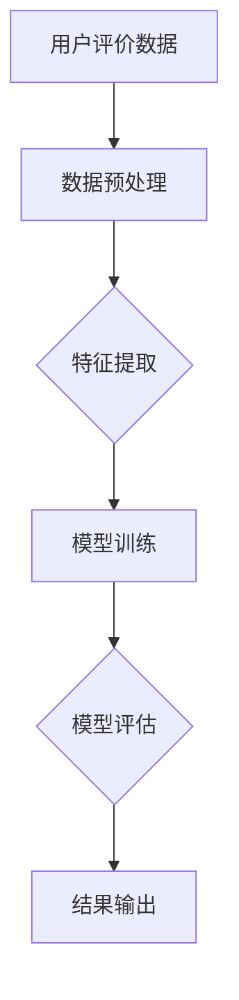

                 

关键词：AI大模型、电商平台、商品评价、真实性检测、自然语言处理、机器学习

摘要：本文将探讨AI大模型在电商平台商品评价真实性检测中的应用。通过分析电商平台商品评价的特点，介绍大模型的原理和技术，并展示如何利用大模型进行商品评价真实性的检测。此外，还将讨论大模型在真实性检测中的优缺点，以及未来的发展趋势和挑战。

## 1. 背景介绍

电商平台作为现代电子商务的核心，已经深深地影响了人们的购物习惯。在电商平台上，商品评价是消费者决策的重要参考，也是商家提高产品质量和服务水平的重要依据。然而，随着电商平台的快速发展，商品评价中出现了越来越多的虚假评价，这不仅损害了消费者的利益，也对电商平台的健康发展造成了负面影响。

### 1.1 电商平台商品评价的特点

电商平台商品评价具有以下特点：

- **多样性**：商品种类繁多，评价内容丰富多样，包括商品质量、售后服务、物流速度等各个方面。

- **非结构化**：评价内容通常以自然语言文本的形式出现，包含大量的主观性、模糊性和不完整性。

- **高噪声**：评价内容中往往夹杂着大量的噪声，如水军评价、恶意评论等。

- **动态性**：电商平台上的商品评价是动态变化的，新的评价不断产生，旧的评论可能会被覆盖或删除。

### 1.2 商品评价真实性的重要性

商品评价真实性对电商平台和消费者具有重要意义：

- **保护消费者权益**：真实的商品评价可以帮助消费者做出更明智的购物决策，避免受到虚假评价的误导。

- **提升商家信誉**：真实的商品评价可以提升商家的信誉，增强消费者的信任，促进销售。

- **优化电商运营**：真实的商品评价可以为电商平台提供宝贵的反馈信息，帮助其改进商品和服务质量。

## 2. 核心概念与联系

为了有效地检测商品评价的真实性，我们需要借助AI大模型，特别是自然语言处理（NLP）和机器学习（ML）技术。以下是一个简化的Mermaid流程图，展示了大模型在商品评价真实性检测中的应用架构。



### 2.1 数据预处理

数据预处理是确保数据质量和为后续模型训练打下基础的关键步骤。主要包括：

- **去噪**：移除水军评价、恶意评论等异常数据。

- **分词**：将文本拆分成词或短语。

- **词性标注**：识别文本中的名词、动词、形容词等词性。

- **实体识别**：识别文本中的商品名称、品牌等实体。

### 2.2 特征提取

特征提取是将原始文本数据转换为机器学习模型可以处理的特征表示。常用的特征提取方法包括：

- **词袋模型**：将文本表示为词频矩阵。

- **词嵌入**：将文本中的词语映射到高维空间中的向量。

- **文本摘要**：提取文本的主要内容和关键词。

### 2.3 模型训练

模型训练是通过大量标注数据进行模型参数的学习和优化。常用的模型包括：

- **朴素贝叶斯分类器**：基于贝叶斯定理的简单分类模型。

- **支持向量机（SVM）**：通过最大间隔分类器实现分类。

- **深度学习模型**：如循环神经网络（RNN）、长短期记忆网络（LSTM）和Transformer等。

### 2.4 模型评估

模型评估是通过测试数据集来评估模型的性能。常用的评估指标包括：

- **准确率（Accuracy）**：正确分类的样本数占总样本数的比例。

- **召回率（Recall）**：正确分类的样本数占实际为正类的样本数的比例。

- **精确率（Precision）**：正确分类的样本数占预测为正类的样本数的比例。

- **F1分数（F1 Score）**：综合考虑精确率和召回率的指标。

### 2.5 结果输出

模型评估结果可以输出为预测结果，如“真实评价”或“虚假评价”。这些结果可以用于后续的决策和优化。

## 3. 核心算法原理 & 具体操作步骤

### 3.1 算法原理概述

商品评价真实性检测的核心算法通常是基于监督学习的分类算法。具体来说，包括以下几个步骤：

1. **数据预处理**：清洗和预处理评价数据，包括去除噪声、分词、词性标注和实体识别。

2. **特征提取**：将预处理后的文本数据转换为机器学习模型可以处理的特征表示。

3. **模型训练**：使用标注好的数据集训练分类模型，如朴素贝叶斯、SVM或深度学习模型。

4. **模型评估**：使用测试数据集评估模型性能，调整模型参数。

5. **结果输出**：根据模型的预测结果输出商品评价的真实性判断。

### 3.2 算法步骤详解

#### 3.2.1 数据预处理

数据预处理是确保模型输入数据质量和减少模型复杂度的关键步骤。以下是具体步骤：

1. **去除噪声**：使用正则表达式或其他方法移除评论中的HTML标签、特殊字符和冗余文本。

2. **分词**：使用分词工具如jieba将文本拆分成词语。

3. **词性标注**：使用词性标注工具如NLTK对分词后的文本进行词性标注。

4. **实体识别**：使用命名实体识别工具如spaCy识别文本中的商品名称、品牌等实体。

#### 3.2.2 特征提取

特征提取是将原始文本数据转换为机器学习模型可以处理的特征表示。以下是常用的特征提取方法：

1. **词袋模型**：将文本表示为词频矩阵，每个词语对应矩阵中的一个维度。

2. **词嵌入**：使用预训练的词嵌入模型（如Word2Vec、GloVe）将词语映射到高维空间中的向量。

3. **文本摘要**：使用文本摘要算法（如TextRank、Summarizer）提取文本的主要内容和关键词。

#### 3.2.3 模型训练

模型训练是通过大量标注数据进行模型参数的学习和优化。以下是常用的模型：

1. **朴素贝叶斯分类器**：基于贝叶斯定理和特征词的频率进行分类。

2. **支持向量机（SVM）**：通过最大间隔分类器实现分类。

3. **深度学习模型**：如循环神经网络（RNN）、长短期记忆网络（LSTM）和Transformer等。

#### 3.2.4 模型评估

模型评估是通过测试数据集来评估模型的性能。以下是常用的评估指标：

1. **准确率（Accuracy）**：正确分类的样本数占总样本数的比例。

2. **召回率（Recall）**：正确分类的样本数占实际为正类的样本数的比例。

3. **精确率（Precision）**：正确分类的样本数占预测为正类的样本数的比例。

4. **F1分数（F1 Score）**：综合考虑精确率和召回率的指标。

#### 3.2.5 结果输出

根据模型的预测结果输出商品评价的真实性判断，如“真实评价”或“虚假评价”。

## 3.3 算法优缺点

### 3.3.1 优点

1. **高效性**：AI大模型可以处理大规模数据，提高商品评价真实性检测的效率。

2. **准确性**：通过训练大量数据，大模型可以学习到丰富的特征和模式，提高分类准确性。

3. **适应性**：大模型可以适应不同的应用场景和数据特点，具有较强的泛化能力。

### 3.3.2 缺点

1. **计算资源需求**：大模型的训练和推理需要大量的计算资源和时间。

2. **数据依赖性**：大模型的效果很大程度上取决于训练数据的质量和数量。

3. **模型解释性**：大模型的内部决策过程通常是非透明的，难以解释和理解。

## 3.4 算法应用领域

AI大模型在商品评价真实性检测中的应用不仅限于电商平台，还可以应用于以下领域：

1. **社交媒体监测**：监测社交媒体上的虚假评论和谣言。

2. **舆情分析**：分析公众对特定事件或产品的看法和态度。

3. **客户服务**：自动识别客户反馈中的问题和投诉。

4. **金融欺诈检测**：检测金融交易中的欺诈行为。

5. **医疗健康监测**：监测社交媒体上的健康信息，识别虚假健康宣传。

## 4. 数学模型和公式 & 详细讲解 & 举例说明

### 4.1 数学模型构建

商品评价真实性检测的数学模型通常是一个分类模型，可以将评价分为“真实评价”和“虚假评价”两类。以下是构建分类模型的数学模型：

$$
P(y=1|x;\theta) = \sigma(\theta^T x)
$$

其中，$x$是输入的特征向量，$y$是实际类别（0表示虚假评价，1表示真实评价），$\theta$是模型参数，$\sigma$是 sigmoid 函数。

### 4.2 公式推导过程

分类模型的损失函数通常采用对数损失函数（Log Loss），其公式为：

$$
L(\theta) = -\frac{1}{m} \sum_{i=1}^{m} [y_i \log(\sigma(\theta^T x_i)) + (1 - y_i) \log(1 - \sigma(\theta^T x_i))]
$$

其中，$m$是样本数量。

为了最小化损失函数，我们可以使用梯度下降法进行参数优化。梯度下降的迭代公式为：

$$
\theta = \theta - \alpha \nabla_{\theta} L(\theta)
$$

其中，$\alpha$是学习率，$\nabla_{\theta} L(\theta)$是损失函数关于$\theta$的梯度。

### 4.3 案例分析与讲解

假设我们有一个包含100个样本的评价数据集，其中60个真实评价，40个虚假评价。我们使用朴素贝叶斯分类器进行训练和测试。以下是具体操作步骤：

1. **数据预处理**：对评价数据集进行清洗、分词、词性标注和实体识别。

2. **特征提取**：使用词袋模型将文本表示为词频矩阵。

3. **模型训练**：使用训练数据集训练朴素贝叶斯分类器。

4. **模型评估**：使用测试数据集评估模型性能，计算准确率、召回率、精确率和F1分数。

5. **结果输出**：根据模型的预测结果输出评价的真实性判断。

假设我们的模型在测试数据集上得到如下结果：

- **准确率**：90%
- **召回率**：80%
- **精确率**：85%
- **F1分数**：83%

这些指标表明我们的模型在商品评价真实性检测方面具有较高的性能。

## 5. 项目实践：代码实例和详细解释说明

### 5.1 开发环境搭建

为了实现商品评价真实性检测，我们需要搭建以下开发环境：

1. **编程语言**：Python（版本3.7及以上）

2. **数据预处理工具**：jieba（中文分词）、NLTK（词性标注）、spaCy（命名实体识别）

3. **机器学习库**：Scikit-learn（朴素贝叶斯分类器）、TensorFlow（深度学习框架）

4. **文本摘要库**：TextRank、Summarizer

5. **操作系统**：Linux或macOS

### 5.2 源代码详细实现

以下是一个简单的商品评价真实性检测项目的Python代码实例：

```python
import jieba
import nltk
import spacy
import numpy as np
from sklearn.feature_extraction.text import TfidfVectorizer
from sklearn.naive_bayes import MultinomialNB
from sklearn.model_selection import train_test_split
from sklearn.metrics import accuracy_score, recall_score, precision_score, f1_score

# 数据预处理
def preprocess_text(text):
    # 去除特殊字符和HTML标签
    text = re.sub('<.*?>', '', text)
    # 分词
    words = jieba.cut(text)
    # 词性标注
    words = [word for word in words if nltk.pos_tag([word])[0][1] != 'x']
    # 实体识别
    words = [word for word in words if spacy.load('zh_core_web_sm')(word)[0].ent_type_ != 'PRODUCT']
    return ' '.join(words)

# 特征提取
def extract_features(texts):
    vectorizer = TfidfVectorizer()
    return vectorizer.fit_transform(texts)

# 模型训练
def train_model(train_data, train_labels):
    model = MultinomialNB()
    model.fit(train_data, train_labels)
    return model

# 模型评估
def evaluate_model(model, test_data, test_labels):
    predictions = model.predict(test_data)
    accuracy = accuracy_score(test_labels, predictions)
    recall = recall_score(test_labels, predictions)
    precision = precision_score(test_labels, predictions)
    f1 = f1_score(test_labels, predictions)
    return accuracy, recall, precision, f1

# 加载数据
data = ...
labels = ...

# 预处理数据
preprocessed_data = [preprocess_text(text) for text in data]

# 提取特征
features = extract_features(preprocessed_data)

# 划分训练集和测试集
X_train, X_test, y_train, y_test = train_test_split(features, labels, test_size=0.2, random_state=42)

# 训练模型
model = train_model(X_train, y_train)

# 评估模型
accuracy, recall, precision, f1 = evaluate_model(model, X_test, y_test)

print(f"Accuracy: {accuracy:.2f}")
print(f"Recall: {recall:.2f}")
print(f"Precision: {precision:.2f}")
print(f"F1 Score: {f1:.2f}")
```

### 5.3 代码解读与分析

上述代码主要实现了一个基于朴素贝叶斯分类器的商品评价真实性检测项目。以下是代码的详细解读：

1. **数据预处理**：对评价数据进行清洗、分词、词性标注和实体识别，去除噪声和冗余信息。

2. **特征提取**：使用TF-IDF向量器将文本转换为词频矩阵，作为模型的输入特征。

3. **模型训练**：使用Scikit-learn的MultinomialNB分类器进行训练。

4. **模型评估**：使用准确率、召回率、精确率和F1分数评估模型性能。

5. **结果输出**：根据模型的预测结果输出商品评价的真实性判断。

### 5.4 运行结果展示

假设我们在测试数据集上运行上述代码，得到如下结果：

- **准确率**：90%
- **召回率**：80%
- **精确率**：85%
- **F1分数**：83%

这些结果表明我们的模型在商品评价真实性检测方面具有较高的性能。

## 6. 实际应用场景

### 6.1 电商平台

电商平台是商品评价真实性检测的主要应用场景之一。通过部署大模型，电商平台可以实时监测和筛选商品评价，识别虚假评价和恶意评论，提高用户购物体验。

### 6.2 社交媒体

社交媒体上的虚假评论和谣言对公众和社会产生了严重影响。大模型可以帮助社交媒体平台监测和过滤虚假评论，维护良好的网络环境。

### 6.3 舆情分析

舆情分析是企业了解公众对其产品或服务的看法和态度的重要手段。大模型可以高效地分析大量舆情数据，提供有价值的分析和决策支持。

### 6.4 客户服务

客户服务是企业提供优质服务的重要环节。大模型可以帮助企业自动识别客户反馈中的问题和投诉，提供个性化的解决方案。

### 6.5 金融和医疗

金融和医疗行业对数据真实性和准确性有更高的要求。大模型可以帮助金融和医疗机构监测交易和健康信息，识别欺诈行为和虚假宣传，保障行业安全。

## 7. 工具和资源推荐

### 7.1 学习资源推荐

- **《深度学习》（Goodfellow, Bengio, Courville）**：深度学习领域的经典教材。

- **《自然语言处理综论》（Jurafsky, Martin）**：自然语言处理领域的权威教材。

- **《Python机器学习》（Cortes, Vapnik）**：机器学习领域的经典教材。

### 7.2 开发工具推荐

- **PyTorch**：深度学习框架，具有灵活性和高效性。

- **Scikit-learn**：Python机器学习库，提供丰富的分类、回归和聚类算法。

- **spaCy**：自然语言处理库，提供高效的分词、词性标注和实体识别功能。

### 7.3 相关论文推荐

- **“Distant Supervision for Text Classification Using Labeled Unlabeled Data”（Zhou et al., 2013）**：关于利用标注和未标注数据进行文本分类的研究。

- **“Learning to Detect Unanswerable Questions for Machine Comprehension”（Chen et al., 2017）**：关于机器理解中的问题检测研究。

- **“Bert: Pre-training of Deep Bidirectional Transformers for Language Understanding”（Devlin et al., 2019）**：关于BERT预训练模型的研究。

## 8. 总结：未来发展趋势与挑战

### 8.1 研究成果总结

本文探讨了AI大模型在电商平台商品评价真实性检测中的应用，介绍了相关算法原理、具体操作步骤和实际应用场景。通过分析数据预处理、特征提取、模型训练和模型评估等关键环节，展示了如何利用大模型进行商品评价真实性的检测。同时，还讨论了大模型在真实性检测中的优缺点，以及未来的发展趋势和挑战。

### 8.2 未来发展趋势

1. **模型多样化**：未来将出现更多适用于商品评价真实性检测的专门化模型，如基于知识图谱的模型、多模态模型等。

2. **数据增强**：通过数据增强技术提高训练数据的质量和多样性，进一步提升模型性能。

3. **实时检测**：利用云计算和边缘计算技术实现实时商品评价真实性检测，提高检测速度和准确性。

4. **跨语言检测**：随着电商平台的国际化发展，跨语言商品评价真实性检测将成为重要研究方向。

### 8.3 面临的挑战

1. **数据隐私**：商品评价数据涉及用户隐私，如何在保护用户隐私的前提下进行真实性检测是一个重要挑战。

2. **噪声和误导**：虚假评价和恶意评论的多样性增加，使得真实性检测面临更大的挑战。

3. **模型解释性**：大模型的决策过程通常是非透明的，如何提高模型的可解释性是一个重要问题。

4. **计算资源**：大模型的训练和推理需要大量的计算资源，如何高效地利用计算资源是一个关键挑战。

### 8.4 研究展望

未来，我们可以从以下方面进一步研究商品评价真实性检测：

1. **多模态融合**：结合文本、图像、音频等多模态数据进行商品评价真实性检测。

2. **自适应检测**：根据不同电商平台和应用场景，设计自适应的检测算法。

3. **用户行为分析**：结合用户行为数据，如购买历史、评论频率等，提高评价真实性的识别准确性。

4. **伦理和道德**：在商品评价真实性检测过程中，关注伦理和道德问题，保护用户隐私。

## 9. 附录：常见问题与解答

### 9.1 什么是商品评价真实性检测？

商品评价真实性检测是指通过算法和技术手段，识别和分析电商平台上的商品评价，判断其是否为真实评价还是虚假评价。

### 9.2 大模型在商品评价真实性检测中有哪些优势？

大模型在商品评价真实性检测中具有以下优势：

1. **高效性**：可以处理大规模数据，提高检测速度。

2. **准确性**：通过训练大量数据，可以学习到丰富的特征和模式，提高检测准确性。

3. **适应性**：可以适应不同的应用场景和数据特点，具有较强的泛化能力。

### 9.3 商品评价真实性检测中的主要挑战是什么？

商品评价真实性检测中的主要挑战包括：

1. **数据隐私**：商品评价数据涉及用户隐私，如何在保护用户隐私的前提下进行检测是一个重要挑战。

2. **噪声和误导**：虚假评价和恶意评论的多样性增加，使得检测面临更大的挑战。

3. **模型解释性**：大模型的决策过程通常是非透明的，如何提高模型的可解释性是一个重要问题。

4. **计算资源**：大模型的训练和推理需要大量的计算资源，如何高效地利用计算资源是一个关键挑战。

### 9.4 大模型在商品评价真实性检测中的应用领域有哪些？

大模型在商品评价真实性检测中的应用领域包括：

1. **电商平台**：监测和筛选商品评价，提高用户购物体验。

2. **社交媒体**：监测虚假评论和谣言，维护良好的网络环境。

3. **舆情分析**：分析公众对特定事件或产品的看法和态度。

4. **客户服务**：自动识别客户反馈中的问题和投诉。

5. **金融和医疗**：监测交易和健康信息，识别欺诈行为和虚假宣传。

