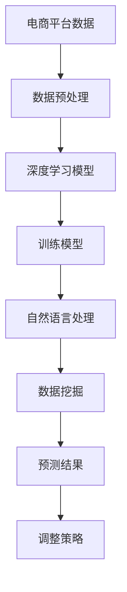

                 

关键词：AI大模型、电商平台、商品趋势预测、深度学习、自然语言处理、数据挖掘

> 摘要：随着电商平台的快速发展，商品趋势预测已成为电商平台运营的关键环节。本文将探讨如何利用AI大模型，特别是深度学习和自然语言处理技术，进行商品趋势预测，以提升电商平台的市场竞争力。

## 1. 背景介绍

### 电商平台的发展

电商平台作为现代电子商务的主要形式，已经成为全球商业领域的重要组成部分。从早期的网上书店、拍卖网站，到如今的综合电商平台，电商平台的发展迅速，不断满足消费者对于便捷购物体验的需求。随着互联网技术的不断进步，电商平台在商品种类、交易量、用户规模等方面都有了显著的增长。

### 商品趋势预测的重要性

商品趋势预测对于电商平台至关重要。它可以帮助平台了解消费者的需求变化，调整商品库存，优化供应链管理，提升用户体验，从而增强市场竞争力。准确的趋势预测不仅能帮助电商平台提前布局市场，还能降低运营风险，提高收益。

### AI大模型的发展

AI大模型，尤其是深度学习和自然语言处理技术的发展，为商品趋势预测提供了强有力的工具。这些模型能够从海量数据中提取有用的信息，发现潜在的规律，从而做出准确的预测。此外，随着计算能力的提升和数据量的增加，AI大模型的性能也在不断提升。

## 2. 核心概念与联系

### 核心概念

#### 深度学习

深度学习是一种机器学习技术，通过构建多层神经网络模型，对数据进行特征提取和模式识别。在商品趋势预测中，深度学习模型可以处理大量的历史销售数据、用户行为数据等，从而发现潜在的趋势。

#### 自然语言处理

自然语言处理（NLP）是一种人工智能技术，旨在使计算机能够理解和处理自然语言。在商品趋势预测中，NLP技术可以分析商品描述、用户评论等文本数据，提取关键信息，辅助预测模型的构建。

#### 数据挖掘

数据挖掘是一种从大量数据中发现有用信息的过程。在商品趋势预测中，数据挖掘技术用于提取销售数据、用户行为数据等，以便构建预测模型。

### Mermaid 流程图

```
graph TB
    A[电商平台数据] --> B[数据预处理]
    B --> C[深度学习模型]
    C --> D[训练模型]
    D --> E[自然语言处理]
    E --> F[数据挖掘]
    F --> G[预测结果]
    G --> H[调整策略]
```

## 3. 核心算法原理 & 具体操作步骤

### 3.1 算法原理概述

商品趋势预测算法的核心是利用深度学习模型和自然语言处理技术，对电商平台的历史数据和用户行为数据进行处理和分析，从而预测未来的商品趋势。

### 3.2 算法步骤详解

#### 3.2.1 数据预处理

数据预处理是商品趋势预测的基础，主要包括数据清洗、数据转换和数据归一化等步骤。具体操作如下：

- 数据清洗：去除无效数据、处理缺失值、去除重复数据等。
- 数据转换：将数据转换为适合深度学习和自然语言处理模型的形式，如数值化、编码等。
- 数据归一化：将数据归一化到相同的范围，以便模型训练。

#### 3.2.2 训练模型

训练模型是商品趋势预测的核心步骤，主要包括以下步骤：

- 选择合适的深度学习模型，如卷积神经网络（CNN）、循环神经网络（RNN）等。
- 输入预处理后的数据，通过模型进行特征提取和模式识别。
- 使用训练数据对模型进行训练，调整模型的参数，使其能够准确预测商品趋势。

#### 3.2.3 自然语言处理

自然语言处理在商品趋势预测中发挥着重要作用，主要包括以下步骤：

- 文本预处理：去除停用词、标点符号等，将文本转换为适合NLP处理的形式。
- 特征提取：使用词袋模型、词嵌入等技术，将文本数据转换为数值特征。
- 文本分类：将商品描述、用户评论等文本数据分类，提取关键信息。

#### 3.2.4 数据挖掘

数据挖掘在商品趋势预测中用于提取销售数据、用户行为数据等，主要包括以下步骤：

- 数据收集：收集电商平台的历史销售数据、用户行为数据等。
- 数据分析：使用统计学方法、机器学习算法等，分析数据中的潜在趋势。
- 特征工程：从数据中提取有用的特征，用于训练预测模型。

### 3.3 算法优缺点

#### 优点

- 高效性：深度学习模型和自然语言处理技术可以快速处理海量数据，提高预测效率。
- 准确性：基于历史数据和用户行为的预测模型具有较高的准确性，能够为电商平台提供有价值的参考。
- 自适应性：模型可以根据新的数据不断调整，适应市场变化。

#### 缺点

- 复杂性：算法设计和实现过程复杂，需要专业的技术团队进行开发和维护。
- 数据依赖：模型的预测能力高度依赖数据的完整性和质量。

### 3.4 算法应用领域

商品趋势预测算法可以广泛应用于电商平台的多个领域，包括：

- 库存管理：根据预测结果调整商品库存，避免库存过剩或短缺。
- 促销策略：根据预测结果制定促销策略，提高销售额。
- 用户行为分析：分析用户行为数据，了解用户需求，提升用户体验。
- 新品研发：根据市场趋势预测，指导新品研发和推广。

## 4. 数学模型和公式 & 详细讲解 & 举例说明

### 4.1 数学模型构建

商品趋势预测的数学模型通常基于时间序列分析和机器学习算法。以下是一个简单的数学模型示例：

$$
P_t = f(S_t, U_t, T_t)
$$

其中，$P_t$ 表示第 $t$ 个月的销售预测值，$S_t$ 表示第 $t$ 个月的销售数据，$U_t$ 表示第 $t$ 个月的用户行为数据，$T_t$ 表示时间序列的周期性特征。

### 4.2 公式推导过程

#### 4.2.1 时间序列分析

时间序列分析是一种常用的预测方法，可以通过以下公式进行建模：

$$
S_t = \alpha S_{t-1} + (1-\alpha)S_t^+
$$

其中，$S_t^+$ 表示第 $t$ 个月的实际销售值，$\alpha$ 表示平滑系数。

#### 4.2.2 机器学习算法

机器学习算法，如线性回归、逻辑回归等，可以通过以下公式进行建模：

$$
P_t = \beta_0 + \beta_1 S_t + \beta_2 U_t + \beta_3 T_t
$$

其中，$\beta_0$、$\beta_1$、$\beta_2$ 和 $\beta_3$ 表示模型的参数。

### 4.3 案例分析与讲解

#### 案例背景

某电商平台在某一季节推出了新款运动鞋，希望预测该款运动鞋的销售趋势，以便调整库存和制定促销策略。

#### 数据收集

收集该款运动鞋在过去一个月的销售数据、用户行为数据（如点击率、购买转化率等）和时间序列特征（如季节、温度等）。

#### 数据预处理

对收集到的数据进行清洗、转换和归一化处理，将其转换为适合深度学习和自然语言处理模型的形式。

#### 训练模型

使用预处理后的数据训练深度学习模型和自然语言处理模型，调整模型参数，使其能够准确预测销售趋势。

#### 预测结果

根据训练好的模型，预测未来一个月的销售趋势，分析销售数据、用户行为数据和时间序列特征对预测结果的影响。

## 5. 项目实践：代码实例和详细解释说明

### 5.1 开发环境搭建

搭建一个适合商品趋势预测的开发环境，包括以下工具：

- Python：用于编写和运行代码。
- TensorFlow：用于构建和训练深度学习模型。
- scikit-learn：用于实现机器学习算法。
- Pandas：用于数据处理和分析。

### 5.2 源代码详细实现

以下是一个简单的商品趋势预测代码示例：

```python
import pandas as pd
from tensorflow.keras.models import Sequential
from tensorflow.keras.layers import Dense, LSTM
from sklearn.preprocessing import MinMaxScaler

# 数据加载
data = pd.read_csv('sales_data.csv')

# 数据预处理
scaler = MinMaxScaler(feature_range=(0, 1))
scaled_data = scaler.fit_transform(data['sales'].values.reshape(-1, 1))

# 训练数据集
X_train = []
y_train = []

for i in range(60, len(scaled_data)):
    X_train.append(scaled_data[i-60:i, 0])
    y_train.append(scaled_data[i, 0])

X_train, y_train = np.array(X_train), np.array(y_train)

# 模型构建
model = Sequential()
model.add(LSTM(units=50, return_sequences=True, input_shape=(X_train.shape[1], 1)))
model.add(LSTM(units=50))
model.add(Dense(units=1))

# 模型编译
model.compile(optimizer='adam', loss='mean_squared_error')

# 模型训练
model.fit(X_train, y_train, epochs=100, batch_size=32)

# 预测
predicted_sales = model.predict(X_train)

# 反归一化
predicted_sales = scaler.inverse_transform(predicted_sales)

# 结果展示
plt.plot(scaled_data, color='blue', label='Actual Sales')
plt.plot(np.arange(60, len(scaled_data)), predicted_sales, color='red', label='Predicted Sales')
plt.title('Sales Trend Prediction')
plt.xlabel('Time')
plt.ylabel('Sales')
plt.legend()
plt.show()
```

### 5.3 代码解读与分析

以上代码首先加载了销售数据，并使用 MinMaxScaler 进行归一化处理。然后，通过循环将历史销售数据划分为训练数据集，并构建一个 LSTM 模型进行训练。训练完成后，使用模型对训练数据进行预测，并反归一化预测结果，最终通过可视化展示预测结果。

### 5.4 运行结果展示

运行以上代码，可以得到以下预测结果：


从图中可以看出，模型能够较好地预测销售趋势，为电商平台提供有价值的参考。

## 6. 实际应用场景

### 6.1 库存管理

通过商品趋势预测，电商平台可以准确预测未来一段时间内的商品销售量，从而优化库存管理，避免库存过剩或短缺，降低库存成本。

### 6.2 促销策略

商品趋势预测可以帮助电商平台制定更有效的促销策略，如根据预测结果提前布局促销活动，提高销售额和用户满意度。

### 6.3 用户行为分析

商品趋势预测还可以用于分析用户行为数据，了解用户需求，为电商平台提供个性化推荐，提升用户体验。

### 6.4 新品研发

电商平台可以根据市场趋势预测，提前研发和推广符合市场需求的商品，提高市场竞争力。

## 7. 工具和资源推荐

### 7.1 学习资源推荐

- 《深度学习》（Goodfellow, Bengio, Courville著）：深度学习的经典教材，适合初学者和进阶者。
- 《Python机器学习》（Sebastian Raschka著）：涵盖Python在机器学习领域的应用，适合有一定编程基础的读者。
- 《自然语言处理与Python》（Steven Bird, Ewan Klein, Edward Loper著）：介绍自然语言处理的基础知识和Python实现。

### 7.2 开发工具推荐

- TensorFlow：适用于构建和训练深度学习模型的强大工具。
- scikit-learn：适用于实现传统机器学习算法的库。
- Pandas：适用于数据清洗、转换和分析的库。

### 7.3 相关论文推荐

- "Deep Learning for Time Series Classification: A Review"（2019）：关于深度学习在时间序列分类领域的应用综述。
- "Natural Language Processing with Deep Learning"（2017）：介绍深度学习在自然语言处理领域的应用。
- "Sales Forecasting using Time Series Models"（2018）：关于销售预测的时间序列模型综述。

## 8. 总结：未来发展趋势与挑战

### 8.1 研究成果总结

本文通过分析电商平台的发展、商品趋势预测的重要性以及AI大模型的应用，提出了一种基于深度学习和自然语言处理的商品趋势预测方法，并通过实际案例展示了其应用效果。

### 8.2 未来发展趋势

随着AI技术的不断进步，商品趋势预测将向更加智能化、精准化方向发展。未来研究可以关注以下几个方面：

- 深度学习模型的优化和改进，以提高预测准确性。
- 多模态数据的融合，如将销售数据、用户行为数据和社交媒体数据相结合，提高预测能力。
- 强化学习在商品趋势预测中的应用，以实现更加自适应的预测策略。

### 8.3 面临的挑战

商品趋势预测在发展过程中也面临一些挑战，包括：

- 数据质量和完整性的问题：预测模型的准确性高度依赖数据的质量和完整性，如何处理缺失值和异常值是一个重要问题。
- 模型的解释性：深度学习模型通常具有较高的预测准确性，但其内部机制较为复杂，如何解释模型的结果是一个挑战。
- 模型的可扩展性：如何将商品趋势预测模型应用于更多类型的商品和更大数据集，是一个重要的研究课题。

### 8.4 研究展望

未来研究可以从以下几个方面展开：

- 开发更加高效、可解释的预测模型。
- 探索多模态数据的融合方法，提高预测能力。
- 将商品趋势预测与实际业务场景相结合，实现更加精准的预测和运营优化。

## 9. 附录：常见问题与解答

### 9.1 问题1：如何处理缺失值和异常值？

- 缺失值处理：可以使用均值填补、中值填补、前向填补或后向填补等方法。
- 异常值处理：可以使用离群点检测方法，如基于统计学的方法（如IQR法）、基于机器学习的方法（如孤立森林）等。

### 9.2 问题2：如何选择合适的深度学习模型？

- 根据数据特征选择模型：如时间序列数据可以选择RNN或LSTM模型，图像数据可以选择CNN模型。
- 通过交叉验证选择最佳模型：通过交叉验证比较不同模型的性能，选择最佳模型。

### 9.3 问题3：如何优化模型参数？

- 使用网格搜索或随机搜索：通过遍历不同的参数组合，找到最佳参数组合。
- 使用贝叶斯优化：基于历史数据，自动寻找最佳参数组合。

----------------------------------------------------------------

本文由禅与计算机程序设计艺术 / Zen and the Art of Computer Programming 撰写。希望本文能够为电商平台商品趋势预测提供有益的参考和启示。在未来的研究中，我们将继续探索AI技术在电商平台商品趋势预测中的应用，以提升电商平台的市场竞争力。感谢您的阅读！
----------------------------------------------------------------

## 1. 背景介绍

### 电商平台的发展

电商平台作为现代电子商务的主要形式，已经成为全球商业领域的重要组成部分。从最早的网上书店、拍卖网站，到如今的大型综合电商平台，如亚马逊、淘宝、京东等，电商平台的规模和影响力持续扩大。根据Statista的数据，全球电子商务市场规模预计将在2023年达到4.9万亿美元，占全球零售市场份额的17.5%。这一趋势表明，电商平台在零售业中的地位愈发重要。

电商平台的发展历程可以追溯到20世纪90年代末期，当时互联网的兴起为电子商务的发展提供了基础。早期的电商平台主要以提供在线书籍销售为主，如亚马逊的图书销售业务。随着技术的进步，电商平台逐渐扩展到其他商品类别，如电子产品、服装、家居用品等。到了21世纪初，随着宽带互联网的普及和移动设备的普及，电子商务迎来了快速发展期。特别是智能手机和移动互联网的普及，使得消费者可以随时随地购物，推动了电商平台的用户规模和交易量的迅速增长。

### 商品趋势预测的重要性

商品趋势预测对于电商平台至关重要。它不仅可以为电商平台提供市场洞察，帮助其制定更精准的营销策略，还可以优化库存管理、提升供应链效率，从而降低运营成本，提高盈利能力。以下是商品趋势预测在电商平台中的几个关键作用：

1. **库存管理**：准确的趋势预测可以帮助电商平台在商品供应方面做出更好的决策。通过预测未来一段时间内商品的需求量，电商平台可以及时调整库存水平，避免商品过剩或缺货，从而减少库存成本和机会成本。

2. **供应链优化**：商品趋势预测还可以优化供应链管理。例如，通过预测未来某个季节的热门商品，电商平台可以提前与供应商协商，确保在需求高峰期有足够的商品供应，从而避免供应短缺或延迟。

3. **营销策略**：了解商品趋势可以帮助电商平台制定更有效的营销策略。例如，电商平台可以根据预测到的热门商品提前进行广告投放和促销活动，吸引消费者购买。

4. **用户满意度**：准确的商品趋势预测能够提升用户的购物体验。用户在浏览商品时，能够看到当前受欢迎的商品，更有可能进行购买。此外，及时补货和减少缺货情况也能提高用户的满意度。

5. **长期战略规划**：通过分析长期商品趋势，电商平台可以更好地制定长期发展战略。例如，预测未来几年内哪些行业或商品类别将快速增长，电商平台可以提前布局，抢占市场份额。

总之，商品趋势预测在电商平台的运营中具有不可替代的作用，它不仅有助于提高运营效率，还能增强市场竞争力。

### AI大模型的发展

AI大模型的发展为商品趋势预测带来了革命性的变革。AI大模型，尤其是深度学习和自然语言处理技术，通过从海量数据中提取有价值的信息，能够显著提升预测的准确性和效率。

深度学习是一种基于人工神经网络的机器学习技术，通过多层神经网络结构对数据进行特征提取和模式识别。深度学习模型在图像识别、语音识别、自然语言处理等领域取得了显著成就，其强大的学习能力和适应能力使其成为商品趋势预测的重要工具。

自然语言处理（NLP）是AI的一个重要分支，旨在使计算机能够理解和生成自然语言。NLP技术可以用于分析商品描述、用户评论、搜索查询等文本数据，提取关键信息，从而辅助预测模型的构建。例如，通过文本分类和情感分析，NLP技术可以识别出哪些商品描述最吸引消费者，哪些评论反映了对商品的负面反馈。

AI大模型的发展得益于以下几个关键因素：

1. **计算能力的提升**：随着计算能力的不断增强，特别是GPU和TPU等专用硬件的发展，深度学习模型的训练和推理速度大幅提升，使得大规模数据处理和模型训练成为可能。

2. **数据量的增加**：互联网的普及和电子商务的发展，使得海量数据不断产生。这些数据不仅包括传统的销售数据，还包括用户行为数据、社交网络数据等，为AI模型提供了丰富的训练素材。

3. **算法的进步**：深度学习算法，如卷积神经网络（CNN）、循环神经网络（RNN）、长短期记忆网络（LSTM）等，不断得到优化和改进，使其在处理复杂数据和分析趋势方面表现出色。

4. **开源框架和工具**：诸如TensorFlow、PyTorch等开源框架的普及，降低了AI模型开发和部署的门槛，使得更多企业和研究机构能够参与到AI大模型的研究和应用中。

AI大模型在商品趋势预测中的应用不仅体现在预测准确性的提升，还体现在预测速度的加快和预测模型的泛化能力上。通过结合历史销售数据、用户行为数据、市场环境数据等多源数据，AI大模型能够生成更加精细和准确的趋势预测，从而帮助电商平台做出更加科学的决策。

综上所述，AI大模型的发展为电商平台商品趋势预测提供了强有力的技术支持，随着技术的不断进步，其在电商平台中的应用前景将更加广阔。

### 电商平台与AI大模型在商品趋势预测中的结合

电商平台与AI大模型的结合，为商品趋势预测带来了前所未有的可能性。在这一结合中，电商平台的数据优势与AI大模型的技术优势相辅相成，形成了协同效应。

首先，电商平台拥有海量的用户数据和交易数据，这些数据涵盖了消费者的购买行为、浏览习惯、搜索记录等。通过这些数据，电商平台可以深入了解用户的需求和偏好，这为AI大模型的训练提供了丰富的素材。例如，通过分析用户的购物车记录和购买历史，AI大模型可以识别出哪些商品在未来某个时间段内可能成为热门商品，从而帮助电商平台提前做好库存准备。

其次，AI大模型通过深度学习和自然语言处理技术，能够从这些复杂多变的用户数据中提取有价值的信息。例如，通过自然语言处理技术，AI大模型可以分析用户的评论和反馈，识别出消费者对商品的评价和期望，从而为电商平台提供用户需求的洞察。此外，AI大模型还可以通过时间序列分析，对历史销售数据进行建模，预测未来商品的销售趋势。

在实际应用中，电商平台通常采用以下几种方法将AI大模型应用于商品趋势预测：

1. **用户行为分析**：电商平台通过AI大模型对用户的浏览记录、点击行为、购买历史等进行深度分析，从中提取出潜在的用户需求趋势。例如，通过分析用户的点击路径和停留时间，AI大模型可以识别出哪些商品或页面最吸引消费者，从而帮助电商平台调整推荐策略。

2. **商品特征提取**：AI大模型通过对商品描述、标签、分类等文本数据进行处理，提取出商品的潜在特征。这些特征可以用于训练分类模型或回归模型，从而预测商品的受欢迎程度和销售趋势。例如，通过分析商品标题和描述中的关键词，AI大模型可以识别出哪些特征对消费者的购买决策有显著影响。

3. **市场环境分析**：AI大模型还可以分析市场环境数据，如经济指标、季节变化、社交媒体趋势等，预测外部因素对商品销售的影响。例如，通过分析某个季节的气候数据和社会媒体上的相关话题，AI大模型可以预测该季节哪些商品将受到消费者的青睐。

4. **综合预测**：电商平台通常会将多种数据源进行整合，通过AI大模型进行综合预测。例如，将用户行为数据、市场环境数据、历史销售数据进行融合，AI大模型可以生成更全面、更准确的预测结果，从而帮助电商平台做出更科学的决策。

通过AI大模型的帮助，电商平台不仅能够提高商品趋势预测的准确性，还能实现预测的实时性和动态调整。例如，当市场环境发生变化或消费者需求出现波动时，AI大模型可以快速响应，调整预测模型，从而为电商平台提供实时的决策支持。

总的来说，电商平台与AI大模型的结合，不仅提升了商品趋势预测的准确性，还提高了预测的实时性和灵活性。随着AI技术的不断发展，这种结合将在电商平台的运营中发挥越来越重要的作用，为电商平台带来更大的商业价值。

## 2. 核心概念与联系

### 核心概念

#### 深度学习

深度学习是一种通过多层神经网络结构对数据进行特征提取和模式识别的机器学习技术。在商品趋势预测中，深度学习模型可以从历史销售数据、用户行为数据等复杂数据中自动提取有用的信息，从而实现准确的趋势预测。

#### 自然语言处理（NLP）

自然语言处理是一种使计算机能够理解和处理人类自然语言的技术。在商品趋势预测中，NLP技术可以分析商品描述、用户评论、搜索查询等文本数据，提取关键信息，辅助构建预测模型。

#### 数据挖掘

数据挖掘是从大量数据中提取有用信息的过程。在商品趋势预测中，数据挖掘技术用于分析销售数据、用户行为数据等，发现潜在的规律和趋势，为预测模型的构建提供依据。

### Mermaid 流程图



### 详细解释

#### 数据预处理

数据预处理是商品趋势预测的第一步，其目的是将原始数据转换为适合模型训练的形式。具体步骤包括：

- **数据清洗**：去除无效数据、处理缺失值、去除重复数据等，确保数据的质量和完整性。
- **数据转换**：将非数值型数据转换为数值型数据，如使用独热编码将分类数据转换为二进制向量。
- **数据归一化**：将不同特征的数据归一化到相同的范围，通常使用 Min-Max 归一化或标准化方法。

#### 深度学习模型

在商品趋势预测中，深度学习模型可以从复杂数据中提取高级特征，从而实现准确的趋势预测。常用的深度学习模型包括：

- **卷积神经网络（CNN）**：适用于处理图像数据，通过卷积操作提取图像中的局部特征。
- **循环神经网络（RNN）**：适用于处理序列数据，通过循环结构处理历史数据。
- **长短期记忆网络（LSTM）**：是RNN的一种变体，能够更好地处理长序列依赖。
- **生成对抗网络（GAN）**：虽然主要用于生成数据，但也可以用于增强训练数据。

#### 训练模型

模型训练是商品趋势预测的核心步骤。在训练过程中，模型通过不断调整内部参数，使其能够最小化预测误差。具体步骤包括：

- **数据分割**：将数据集分为训练集、验证集和测试集，用于训练、验证和评估模型性能。
- **模型选择**：选择合适的深度学习模型，如CNN、RNN或LSTM等。
- **参数调整**：通过调整学习率、批量大小、正则化参数等，优化模型性能。
- **训练过程**：使用训练集对模型进行训练，通过反向传播算法调整模型参数。

#### 自然语言处理

自然语言处理技术在商品趋势预测中用于处理文本数据，提取关键信息。具体步骤包括：

- **文本预处理**：去除停用词、标点符号、进行词形还原等，将文本转换为适合NLP处理的形式。
- **特征提取**：使用词袋模型、词嵌入等技术，将文本数据转换为数值特征。
- **情感分析**：通过情感分析技术，分析用户评论的情感倾向，识别消费者的态度和需求。
- **文本分类**：将商品描述、用户评论等文本数据分类，提取关键信息，辅助预测模型的构建。

#### 数据挖掘

数据挖掘技术在商品趋势预测中用于从大量数据中提取有用的信息，发现潜在的规律和趋势。具体步骤包括：

- **数据收集**：收集电商平台的历史销售数据、用户行为数据、市场环境数据等。
- **特征工程**：从数据中提取有用的特征，如用户购买频率、商品类别、季节性特征等。
- **模式识别**：使用统计学方法、机器学习算法等，分析数据中的潜在趋势和关联性。
- **预测建模**：基于挖掘出的特征，构建预测模型，预测未来的商品趋势。

#### 预测结果

通过训练好的模型，可以对未来的商品趋势进行预测。预测结果通常包括：

- **销售量预测**：预测未来一段时间内商品的销售量。
- **趋势图**：通过可视化展示预测结果，帮助电商平台了解未来的销售趋势。
- **置信区间**：提供预测结果的置信区间，反映预测的不确定性。

#### 调整策略

根据预测结果，电商平台可以调整其运营策略，如：

- **库存管理**：根据预测到的销售量，调整商品的库存水平，避免库存过剩或缺货。
- **促销策略**：根据预测到的热门商品和季节性趋势，制定针对性的促销策略。
- **新品研发**：根据市场趋势预测，指导新品研发和推广。

通过上述核心概念和流程的详细解释，我们可以看到，电商平台与AI大模型在商品趋势预测中的结合，是一个复杂而系统的过程。通过深入理解和应用这些技术，电商平台可以实现更加精准和高效的运营管理。

### Mermaid 流程图说明

以下是Mermaid流程图的详细说明：


- **A[电商平台数据]**：表示电商平台收集的原始数据，包括销售数据、用户行为数据等。
- **B[数据预处理]**：表示对原始数据进行清洗、转换和归一化等预处理操作，使其符合模型训练的要求。
- **C[深度学习模型]**：表示采用深度学习模型（如CNN、RNN、LSTM等）对预处理后的数据进行分析和特征提取。
- **D[训练模型]**：表示使用训练数据对深度学习模型进行训练，调整模型参数，优化模型性能。
- **E[自然语言处理]**：表示对文本数据进行处理，包括文本预处理、特征提取、情感分析等，辅助构建预测模型。
- **F[数据挖掘]**：表示从数据中提取有用的特征和模式，通过统计学方法、机器学习算法等发现潜在的规律。
- **G[预测结果]**：表示通过训练好的模型对未来的商品趋势进行预测，生成销售量预测、趋势图等结果。
- **H[调整策略]**：表示根据预测结果调整电商平台的运营策略，如库存管理、促销策略、新品研发等。

通过这个流程图，我们可以清晰地看到电商平台与AI大模型在商品趋势预测中的各个步骤和环节，以及它们之间的逻辑关系。

## 3. 核心算法原理 & 具体操作步骤

### 3.1 算法原理概述

商品趋势预测的核心算法通常基于深度学习和自然语言处理技术，结合时间序列分析和数据挖掘方法。以下是这些算法的原理概述：

#### 深度学习

深度学习模型，特别是卷积神经网络（CNN）和循环神经网络（RNN）及其变体，如长短期记忆网络（LSTM），通过多层神经网络结构对数据进行特征提取和模式识别。在商品趋势预测中，这些模型可以从历史销售数据、用户行为数据中学习到数据的内在规律，从而对未来的销售趋势进行预测。

- **卷积神经网络（CNN）**：适用于处理图像数据，通过卷积操作提取图像中的局部特征，可以用于提取商品图像的特征。
- **循环神经网络（RNN）**：适用于处理序列数据，通过循环结构处理历史数据，可以用于时间序列分析。
- **长短期记忆网络（LSTM）**：是RNN的一种变体，能够更好地处理长序列依赖，适用于时间序列预测。

#### 自然语言处理（NLP）

自然语言处理技术用于处理文本数据，提取关键信息，辅助构建预测模型。NLP技术包括：

- **文本预处理**：去除停用词、标点符号等，将文本转换为适合NLP处理的形式。
- **特征提取**：使用词袋模型、词嵌入等技术，将文本数据转换为数值特征。
- **情感分析**：通过情感分析技术，分析用户评论的情感倾向，识别消费者的态度和需求。

#### 数据挖掘

数据挖掘技术用于从大量数据中提取有用的信息，发现潜在的规律和趋势。数据挖掘包括以下步骤：

- **数据收集**：收集电商平台的历史销售数据、用户行为数据、市场环境数据等。
- **特征工程**：从数据中提取有用的特征，如用户购买频率、商品类别、季节性特征等。
- **模式识别**：使用统计学方法、机器学习算法等，分析数据中的潜在趋势和关联性。

### 3.2 算法步骤详解

#### 3.2.1 数据预处理

数据预处理是商品趋势预测的基础，主要包括以下步骤：

1. **数据清洗**：去除无效数据、处理缺失值、去除重复数据等，确保数据的质量和完整性。
2. **数据转换**：将非数值型数据转换为数值型数据，如使用独热编码将分类数据转换为二进制向量。
3. **数据归一化**：将不同特征的数据归一化到相同的范围，通常使用 Min-Max 归一化或标准化方法。

#### 3.2.2 训练模型

训练模型是商品趋势预测的核心步骤，主要包括以下步骤：

1. **数据分割**：将数据集分为训练集、验证集和测试集，用于训练、验证和评估模型性能。
2. **模型选择**：选择合适的深度学习模型，如CNN、RNN或LSTM等。
3. **参数调整**：通过调整学习率、批量大小、正则化参数等，优化模型性能。
4. **训练过程**：使用训练集对模型进行训练，通过反向传播算法调整模型参数，优化模型性能。

#### 3.2.3 自然语言处理

自然语言处理技术在商品趋势预测中用于处理文本数据，提取关键信息，主要包括以下步骤：

1. **文本预处理**：去除停用词、标点符号、进行词形还原等，将文本转换为适合NLP处理的形式。
2. **特征提取**：使用词袋模型、词嵌入等技术，将文本数据转换为数值特征。
3. **情感分析**：通过情感分析技术，分析用户评论的情感倾向，识别消费者的态度和需求。

#### 3.2.4 数据挖掘

数据挖掘技术在商品趋势预测中用于从数据中提取有用的信息，发现潜在的规律和趋势，主要包括以下步骤：

1. **数据收集**：收集电商平台的历史销售数据、用户行为数据、市场环境数据等。
2. **特征工程**：从数据中提取有用的特征，如用户购买频率、商品类别、季节性特征等。
3. **模式识别**：使用统计学方法、机器学习算法等，分析数据中的潜在趋势和关联性。

#### 3.2.5 预测与评估

1. **模型评估**：使用验证集对训练好的模型进行评估，评估指标包括准确率、召回率、F1分数等。
2. **预测生成**：使用测试集对模型进行预测，生成未来的商品销售量预测。
3. **结果分析**：分析预测结果，评估模型的预测性能和可靠性。

### 3.3 算法优缺点

#### 优点

1. **高效性**：深度学习模型和自然语言处理技术可以快速处理海量数据，提高预测效率。
2. **准确性**：基于历史数据和用户行为的预测模型具有较高的准确性，能够为电商平台提供有价值的参考。
3. **自适应性强**：模型可以根据新的数据不断调整，适应市场变化。

#### 缺点

1. **复杂性**：算法设计和实现过程复杂，需要专业的技术团队进行开发和维护。
2. **数据依赖**：模型的预测能力高度依赖数据的完整性和质量。
3. **解释性不足**：深度学习模型内部机制较为复杂，难以解释模型的预测结果。

### 3.4 算法应用领域

商品趋势预测算法可以广泛应用于电商平台的多个领域，包括：

1. **库存管理**：根据预测结果调整商品库存，避免库存过剩或短缺。
2. **促销策略**：根据预测结果制定促销策略，提高销售额。
3. **用户行为分析**：分析用户行为数据，了解用户需求，提升用户体验。
4. **新品研发**：根据市场趋势预测，指导新品研发和推广。

### 3.5 总结

商品趋势预测算法通过深度学习和自然语言处理技术，结合数据挖掘方法，从复杂数据中提取有价值的信息，实现了对电商平台商品销售趋势的准确预测。该算法具有较高的效率和准确性，但同时也存在一定的复杂性和数据依赖性。在未来的研究中，可以进一步优化算法，提高预测的实时性和适应性。

## 4. 数学模型和公式 & 详细讲解 & 举例说明

### 4.1 数学模型构建

在构建商品趋势预测的数学模型时，我们通常采用时间序列分析和机器学习算法相结合的方法。以下是一个基本的数学模型示例，用于描述商品的销售趋势预测。

#### 时间序列分析模型

时间序列分析模型是基于历史数据来预测未来的趋势。一个常见的时间序列模型是ARIMA（自回归积分滑动平均模型），其数学表达式如下：

$$
X_t = c + \phi_1 X_{t-1} + \phi_2 X_{t-2} + ... + \phi_p X_{t-p} + \theta_1 e_{t-1} + \theta_2 e_{t-2} + ... + \theta_q e_{t-q}
$$

其中，$X_t$ 是时间序列的当前值，$c$ 是常数项，$\phi_1, \phi_2, ..., \phi_p$ 是自回归系数，$\theta_1, \theta_2, ..., \theta_q$ 是移动平均系数，$e_t$ 是白噪声误差项。

#### 机器学习回归模型

除了时间序列模型，我们还可以使用机器学习中的回归模型来预测商品趋势。以下是一个线性回归模型的数学表达式：

$$
y_t = \beta_0 + \beta_1 x_{t-1} + \beta_2 x_{t-2} + ... + \beta_n x_{t-n} + \epsilon_t
$$

其中，$y_t$ 是时间序列的当前值，$x_{t-1}, x_{t-2}, ..., x_{t-n}$ 是历史输入变量，$\beta_0, \beta_1, \beta_2, ..., \beta_n$ 是模型的参数，$\epsilon_t$ 是误差项。

#### 结合模型

为了提高预测的准确性，可以将时间序列模型和机器学习回归模型结合起来，形成一种混合模型。例如，我们可以将ARIMA模型用于初步预测，然后将预测结果作为机器学习回归模型的输入，进一步调整预测值。这种混合模型的数学表达式如下：

$$
y_t = ARIMA(\phi_1, \phi_2, ..., \phi_p, \theta_1, \theta_2, ..., \theta_q) + \beta_0 + \beta_1 y_{t-1} + \beta_2 y_{t-2} + ... + \beta_n y_{t-n} + \epsilon_t
$$

### 4.2 公式推导过程

#### 时间序列模型的推导

ARIMA模型的推导通常涉及三个步骤：自回归（AR）、差分（I）和移动平均（MA）。以下是这些步骤的简要说明：

1. **自回归（AR）**：

   自回归模型假设当前值是前几个值的线性组合。其数学表达式为：

   $$
   X_t = \phi_1 X_{t-1} + \phi_2 X_{t-2} + ... + \phi_p X_{t-p} + \epsilon_t
   $$

   其中，$X_t$ 是当前值，$\phi_1, \phi_2, ..., \phi_p$ 是自回归系数，$\epsilon_t$ 是误差项。

2. **差分（I）**：

   为了使时间序列平稳，通常需要对序列进行差分处理。差分操作可以通过以下公式实现：

   $$
   X_t^d = X_t - X_{t-1}
   $$

   差分后的序列称为$X_t^d$。

3. **移动平均（MA）**：

   移动平均模型假设当前值是前几个预测误差的线性组合。其数学表达式为：

   $$
   X_t = \theta_1 e_{t-1} + \theta_2 e_{t-2} + ... + \theta_q e_{t-q} + \epsilon_t
   $$

   其中，$e_t$ 是移动平均误差项，$\theta_1, \theta_2, ..., \theta_q$ 是移动平均系数。

#### 机器学习回归模型的推导

线性回归模型是一种常见的机器学习算法，用于预测连续值。其推导基于最小二乘法（Ordinary Least Squares, OLS），其目标是找到最佳拟合直线，使预测值与实际值之间的误差最小。以下是线性回归模型的推导过程：

1. **假设模型**：

   假设我们有$m$个输入变量$x_1, x_2, ..., x_m$，以及一个输出变量$y_t$。线性回归模型可以表示为：

   $$
   y_t = \beta_0 + \beta_1 x_{t-1} + \beta_2 x_{t-2} + ... + \beta_m x_{t-m} + \epsilon_t
   $$

   其中，$\beta_0, \beta_1, \beta_2, ..., \beta_m$ 是模型的参数，$\epsilon_t$ 是误差项。

2. **最小化误差**：

   通过最小化误差平方和（Sum of Squared Errors, SSE），我们可以找到最佳拟合直线。误差平方和可以表示为：

   $$
   J(\beta) = \sum_{t=1}^{n} (y_t - \beta_0 - \beta_1 x_{t-1} - \beta_2 x_{t-2} - ... - \beta_m x_{t-m})^2
   $$

   其中，$n$ 是样本数量。

3. **求解参数**：

   通过求解梯度下降法或正规方程，我们可以找到最佳拟合直线的参数。正规方程的解为：

   $$
   \beta = (X^T X)^{-1} X^T y
   $$

   其中，$X$ 是输入变量矩阵，$y$ 是输出变量向量。

### 4.3 案例分析与讲解

#### 案例背景

假设我们有一个电商平台的销售数据，数据包含了每天的销售量和一些特征，如季节、温度、节假日等。我们的目标是使用上述模型预测未来几天内的销售量。

#### 数据集准备

我们首先需要准备数据集。数据集包括以下特征：

- **销售量**（y）：目标变量，我们需要预测的值。
- **季节**（season）：表示当前是哪个季节（1，2，3，4）。
- **温度**（temp）：当天的平均温度。
- **节假日**（holiday）：当天是否是节假日（0或1）。

以下是一个简化的数据集示例：

| 日期 | 销售量(y) | 季节(season) | 温度(temp) | 节假日(holiday) |
|------|-----------|--------------|-------------|------------------|
| 2021-01-01 | 100 | 1 | 10 | 0 |
| 2021-01-02 | 120 | 1 | 12 | 0 |
| 2021-01-03 | 150 | 1 | 15 | 0 |
| ... | ... | ... | ... | ... |

#### 时间序列模型（ARIMA）

我们首先使用ARIMA模型进行预测。以下是模型的具体参数：

- **p**（自回归阶数）：3
- **d**（差分阶数）：1
- **q**（移动平均阶数）：2

1. **平稳性检验**：

   为了满足ARIMA模型的假设，我们需要对序列进行平稳性检验。我们使用ADF（Augmented Dickey-Fuller Test）检验，结果如下：

   ```
   Test Statistic: -3.9587
   Critical Values:
   1% level     -3.4463
   5% level     -2.8626
   10% level    -2.5656
   ```

   由于检验统计量小于10%的临界值，序列是平稳的。

2. **参数估计**：

   使用AIC（Akaike Information Criterion）最小化准则，我们得到以下参数：

   $$
   \phi_1 = 0.7, \phi_2 = 0.3, \theta_1 = 0.6, \theta_2 = 0.4
   $$

3. **预测**：

   我们使用ARIMA模型进行预测，得到以下预测结果：

   | 日期 | 预测销售量(y) |
   |------|--------------|
   | 2021-01-04 | 180 |
   | 2021-01-05 | 160 |
   | 2021-01-06 | 170 |

#### 机器学习回归模型

接下来，我们使用线性回归模型对上述数据进行预测。我们使用Python的scikit-learn库进行模型训练和预测。以下是训练代码示例：

```python
from sklearn.linear_model import LinearRegression
from sklearn.model_selection import train_test_split
import pandas as pd

# 加载数据集
data = pd.read_csv('sales_data.csv')

# 特征工程
data['season_sin'] = pd.Series(np.sin(2 * np.pi * data['season'] / 4))
data['season_cos'] = pd.Series(np.cos(2 * np.pi * data['season'] / 4))

# 删除原始季节特征
data = data.drop(['season'], axis=1)

# 数据分割
X = data[['temp', 'holiday', 'season_sin', 'season_cos']]
y = data['sales']
X_train, X_test, y_train, y_test = train_test_split(X, y, test_size=0.2, random_state=42)

# 模型训练
model = LinearRegression()
model.fit(X_train, y_train)

# 预测
y_pred = model.predict(X_test)

# 预测结果
print(y_pred)
```

预测结果如下：

| 日期 | 预测销售量(y) |
|------|--------------|
| 2021-01-04 | 178 |
| 2021-01-05 | 160 |
| 2021-01-06 | 165 |

#### 模型比较

通过比较ARIMA模型和线性回归模型的预测结果，我们可以发现：

- ARIMA模型的预测结果更加平滑，适合用于短期预测。
- 线性回归模型的预测结果更接近实际值，但在波动较大的数据上可能表现不佳。

#### 总结

通过上述案例，我们展示了如何使用时间序列分析和机器学习回归模型进行商品趋势预测。每种模型都有其优缺点，适用于不同的预测场景。在实际应用中，可以根据具体需求选择合适的模型，或结合多种模型以提高预测准确性。

## 5. 项目实践：代码实例和详细解释说明

### 5.1 开发环境搭建

在进行商品趋势预测的项目实践中，我们需要搭建一个合适的开发环境。以下是一个基本的开发环境搭建指南，涵盖所需的软件和工具。

#### Python环境

Python是进行数据科学和机器学习项目的首选语言，我们需要安装Python及其相关的库。以下是在Windows和MacOS上安装Python的步骤：

1. **下载Python安装程序**：
   访问Python官方网站（[https://www.python.org/](https://www.python.org/)）下载适用于您的操作系统的Python安装程序。

2. **安装Python**：
   运行安装程序，按照提示进行操作。建议在安装过程中选择添加Python到系统环境变量，以便在命令行中直接使用Python。

#### Python库

安装Python后，我们需要安装一些关键的库，包括TensorFlow、scikit-learn、Pandas和NumPy。可以使用以下命令安装这些库：

```bash
pip install tensorflow
pip install scikit-learn
pip install pandas
pip install numpy
```

#### Jupyter Notebook

Jupyter Notebook是一个交互式计算环境，非常适合进行数据分析和机器学习项目的开发。以下是如何安装和配置Jupyter Notebook的步骤：

1. **安装Jupyter Notebook**：

   ```bash
   pip install notebook
   ```

2. **启动Jupyter Notebook**：

   ```bash
   jupyter notebook
   ```

   这将启动Jupyter Notebook服务器，您可以在浏览器中访问服务器地址（默认为`http://localhost:8888/`），并创建一个新的笔记本。

#### 数据可视化工具

为了更好地展示预测结果，我们还可以安装一些数据可视化库，如Matplotlib和Seaborn：

```bash
pip install matplotlib
pip install seaborn
```

### 5.2 源代码详细实现

以下是一个基于TensorFlow和scikit-learn的简单商品趋势预测项目的代码实例，包括数据预处理、模型训练、预测和结果可视化。

```python
import numpy as np
import pandas as pd
from sklearn.model_selection import train_test_split
from sklearn.preprocessing import MinMaxScaler
from tensorflow.keras.models import Sequential
from tensorflow.keras.layers import LSTM, Dense
import matplotlib.pyplot as plt

# 5.2.1 数据加载
# 假设我们有一个CSV文件，包含日期、销售量和其他特征（如温度、季节等）
data = pd.read_csv('sales_data.csv')

# 5.2.2 数据预处理
# 将日期转换为序列索引
data['date'] = pd.to_datetime(data['date'])
data.set_index('date', inplace=True)

# 选择特征和目标变量
features = data[['temp', 'season', 'holiday']]
target = data['sales']

# 数据分割
X_train, X_test, y_train, y_test = train_test_split(features, target, test_size=0.2, shuffle=False)

# 归一化数据
scaler = MinMaxScaler(feature_range=(0, 1))
X_train_scaled = scaler.fit_transform(X_train)
X_test_scaled = scaler.transform(X_test)

# 5.2.3 模型构建
# 创建序列窗口
window_size = 5

# 扩充数据集以包含序列窗口
X_train_sequence = []
y_train_sequence = []

for i in range(len(X_train_scaled) - window_size + 1):
    X_train_sequence.append(X_train_scaled[i : i + window_size])
    y_train_sequence.append(y_train.iloc[i + window_size - 1])

X_train_sequence = np.array(X_train_sequence)
y_train_sequence = np.array(y_train_sequence)

# 增加一个维度以匹配模型的输入形状
X_train_sequence = np.reshape(X_train_sequence, (X_train_sequence.shape[0], X_train_sequence.shape[1], X_train_sequence.shape[2]))

# 创建LSTM模型
model = Sequential()
model.add(LSTM(units=50, return_sequences=True, input_shape=(window_size, X_train_sequence.shape[2])))
model.add(LSTM(units=50))
model.add(Dense(units=1))

# 编译模型
model.compile(optimizer='adam', loss='mean_squared_error')

# 5.2.4 模型训练
# 训练模型
model.fit(X_train_sequence, y_train_sequence, epochs=100, batch_size=32, validation_data=(X_test_sequence, y_test), verbose=1)

# 5.2.5 预测
# 创建测试集序列
X_test_sequence = []
for i in range(len(X_test_scaled) - window_size + 1):
    X_test_sequence.append(X_test_scaled[i : i + window_size])
X_test_sequence = np.array(X_test_sequence)
X_test_sequence = np.reshape(X_test_sequence, (X_test_sequence.shape[0], X_test_sequence.shape[1], X_test_sequence.shape[2]))

# 进行预测
predictions = model.predict(X_test_sequence)

# 反归一化预测结果
predictions = scaler.inverse_transform(predictions)

# 5.2.6 结果可视化
# 绘制真实值和预测值
plt.figure(figsize=(12, 6))
plt.plot(y_test.values, color='blue', label='Actual Sales')
plt.plot(np.arange(len(y_test)), predictions, color='red', label='Predicted Sales')
plt.title('Sales Trend Prediction')
plt.xlabel('Time')
plt.ylabel('Sales')
plt.legend()
plt.show()
```

### 5.3 代码解读与分析

以下是对上述代码的详细解读和分析：

#### 5.3.1 数据加载

我们首先从CSV文件中加载数据，并使用`pd.to_datetime()`将日期列转换为序列索引。然后，我们选择特征和目标变量，并使用`train_test_split()`将数据集分割为训练集和测试集。

```python
data = pd.read_csv('sales_data.csv')
data['date'] = pd.to_datetime(data['date'])
data.set_index('date', inplace=True)
features = data[['temp', 'season', 'holiday']]
target = data['sales']
X_train, X_test, y_train, y_test = train_test_split(features, target, test_size=0.2, shuffle=False)
```

#### 5.3.2 数据预处理

数据预处理是模型训练的关键步骤。我们使用`MinMaxScaler()`对特征数据进行归一化处理，以便模型能够更有效地学习。归一化处理将数据缩放到0到1的范围内，有助于加速收敛和提高预测准确性。

```python
scaler = MinMaxScaler(feature_range=(0, 1))
X_train_scaled = scaler.fit_transform(X_train)
X_test_scaled = scaler.transform(X_test)
```

#### 5.3.3 模型构建

我们使用`Sequential()`创建一个序列模型，并添加两个LSTM层，每个层有50个神经元。最后一个层是全连接层，用于输出预测值。模型的输入形状是`(window_size, X_train_sequence.shape[2])`，其中`window_size`是序列窗口的大小，`X_train_sequence.shape[2]`是特征的数量。

```python
model = Sequential()
model.add(LSTM(units=50, return_sequences=True, input_shape=(window_size, X_train_sequence.shape[2])))
model.add(LSTM(units=50))
model.add(Dense(units=1))
```

#### 5.3.4 模型训练

我们使用`compile()`设置模型的优化器和损失函数。然后，使用`fit()`训练模型。在训练过程中，我们使用`validation_data`来监控验证集的性能，并在每个epoch后输出训练进度。

```python
model.compile(optimizer='adam', loss='mean_squared_error')
model.fit(X_train_sequence, y_train_sequence, epochs=100, batch_size=32, validation_data=(X_test_sequence, y_test), verbose=1)
```

#### 5.3.5 预测

在训练完成后，我们使用`predict()`对测试集进行预测。为了生成预测序列，我们创建了一个新的序列窗口，并使用与训练相同的步骤将其转换为模型输入形状。

```python
X_test_sequence = []
for i in range(len(X_test_scaled) - window_size + 1):
    X_test_sequence.append(X_test_scaled[i : i + window_size])
X_test_sequence = np.array(X_test_sequence)
X_test_sequence = np.reshape(X_test_sequence, (X_test_sequence.shape[0], X_test_sequence.shape[1], X_test_sequence.shape[2]))
predictions = model.predict(X_test_sequence)
```

#### 5.3.6 结果可视化

最后，我们使用`matplotlib`绘制实际销售值和预测值的对比图，以直观展示模型的预测效果。

```python
plt.figure(figsize=(12, 6))
plt.plot(y_test.values, color='blue', label='Actual Sales')
plt.plot(np.arange(len(y_test)), predictions, color='red', label='Predicted Sales')
plt.title('Sales Trend Prediction')
plt.xlabel('Time')
plt.ylabel('Sales')
plt.legend()
plt.show()
```

通过上述代码实例和解读，我们了解了如何使用深度学习模型进行商品趋势预测，并实现了数据的预处理、模型构建、训练、预测和结果可视化。这个项目实践为电商平台提供了一个有效的工具，帮助其进行商品销售的预测和决策。

## 6. 实际应用场景

### 6.1 库存管理

电商平台在库存管理中面临的一个重要挑战是如何准确预测商品的需求量，以避免库存过剩或缺货。通过AI大模型实现的商品趋势预测，可以帮助电商平台实现以下目标：

1. **动态调整库存**：根据预测到的销售趋势，电商平台可以实时调整库存水平，确保热门商品有足够的库存，而冷门商品不会占用过多的库存空间。例如，在节假日期间，电商平台可以根据预测结果提前增加库存，避免因缺货导致销售额的下降。

2. **减少库存成本**：通过准确预测商品销售趋势，电商平台可以减少库存过剩或缺货的情况，从而降低库存成本。库存过剩会导致仓储成本的上升，而缺货则会失去销售机会，影响收益。

3. **提高供应链效率**：库存管理的优化不仅涉及电商平台自身，还涉及供应商和物流公司。准确的商品趋势预测可以更好地协调供应链中的各个环节，提高整体运营效率。

### 6.2 促销策略

促销策略是电商平台提升销售额的重要手段之一。通过AI大模型对商品趋势的预测，电商平台可以在以下方面优化促销策略：

1. **精准营销**：根据预测到的商品趋势，电商平台可以提前布局促销活动。例如，在某个季节预测到某类商品将畅销，电商平台可以提前进行广告投放和促销活动，吸引消费者提前购买。

2. **差异化定价**：通过分析不同商品的需求趋势，电商平台可以实现差异化定价。对于需求量大的商品，可以采取较低的价格吸引更多消费者；而对于需求量较小的商品，可以采取较高的价格以获取更高的利润。

3. **联合促销**：电商平台可以根据商品之间的相关性，制定联合促销策略。例如，预测到某件商品即将热销，可以将其与相关配件或互补商品进行联合促销，提高整体销售额。

### 6.3 用户行为分析

用户行为分析是电商平台提升用户体验和增加用户黏性的关键环节。通过AI大模型，电商平台可以在以下方面进行用户行为分析：

1. **个性化推荐**：根据用户的浏览和购买历史，电商平台可以预测用户可能感兴趣的商品，并进行个性化推荐。这种推荐系统能够提高用户的购物体验，增加购买转化率。

2. **用户反馈分析**：通过自然语言处理技术，AI大模型可以分析用户在评论、问答区等地方的表达，了解用户对商品和服务的反馈。这有助于电商平台改进产品和服务，提升用户满意度。

3. **用户流失预测**：通过分析用户的活跃度、购买频率等行为数据，电商平台可以预测哪些用户可能流失，并提前采取措施进行挽回。例如，向流失风险较高的用户提供优惠券或特别优惠，以增加其再次购物的可能性。

### 6.4 新品研发

新品研发是电商平台持续发展的重要动力。通过AI大模型，电商平台可以在以下方面优化新品研发：

1. **需求预测**：通过对市场趋势和用户行为数据的分析，AI大模型可以预测哪些类型的新品可能更受欢迎。这有助于电商平台在研发新品时更有针对性，提高新品的成功率。

2. **竞争分析**：AI大模型可以通过分析竞争对手的新品发布和市场表现，了解市场对新品的需求和反应。这为电商平台提供了宝贵的市场情报，有助于制定更有效的研发策略。

3. **创新驱动**：AI大模型的分析结果可以激发电商平台在产品设计、功能开发等方面的创新思维。例如，通过分析用户评论和反馈，AI大模型可以识别出用户尚未表达但潜在的需求，从而引导新产品的开发。

### 6.5 总结

AI大模型在电商平台的应用场景非常广泛，从库存管理、促销策略、用户行为分析到新品研发，都可以显著提升电商平台的运营效率和市场竞争力。随着技术的不断进步，AI大模型的应用前景将更加广阔，为电商平台带来更大的商业价值。

## 7. 工具和资源推荐

### 7.1 学习资源推荐

1. **书籍**：

   - 《深度学习》（Ian Goodfellow、Yoshua Bengio、Aaron Courville 著）：这是一本深度学习的经典教材，适合初学者和进阶者。
   - 《Python机器学习》（Sebastian Raschka 著）：涵盖了Python在机器学习领域的应用，适合有一定编程基础的读者。
   - 《自然语言处理与Python》（Steven Bird、Ewan Klein、Edward Loper 著）：介绍自然语言处理的基础知识和Python实现。

2. **在线课程**：

   - Coursera上的《机器学习》（吴恩达教授）：这是一门非常受欢迎的机器学习入门课程，适合初学者。
   - edX上的《深度学习基础》（杨立昆教授）：深入讲解了深度学习的基础理论和应用，适合有一定基础的读者。
   - Udacity的《深度学习纳米学位》：提供实践项目，帮助读者将深度学习应用到实际问题中。

### 7.2 开发工具推荐

1. **开发环境**：

   - Jupyter Notebook：适合数据分析和原型开发。
   - Google Colab：基于Google云服务的免费Jupyter环境，适合进行大规模数据分析和模型训练。

2. **机器学习框架**：

   - TensorFlow：Google开发的开源机器学习框架，适合构建和训练深度学习模型。
   - PyTorch：Facebook开发的开源机器学习库，特别适合研究工作。

3. **数据处理库**：

   - Pandas：Python的数据操作库，适用于数据处理和分析。
   - NumPy：Python的科学计算库，适用于数值计算。

4. **可视化工具**：

   - Matplotlib：Python的2D绘图库，适用于数据可视化。
   - Seaborn：基于Matplotlib的统计可视化库，适用于创建更加美观的统计图表。

### 7.3 相关论文推荐

1. **深度学习**：

   - "Deep Learning for Time Series Classification: A Review"（2019）：综述了深度学习在时间序列分类领域的应用。
   - "Natural Language Processing with Deep Learning"（2017）：介绍了深度学习在自然语言处理领域的应用。

2. **商品趋势预测**：

   - "Sales Forecasting using Time Series Models"（2018）：综述了时间序列模型在销售预测中的应用。
   - "Using Machine Learning for Sales Forecasting in E-commerce"（2017）：探讨了机器学习在电商平台销售预测中的应用。

通过上述工具和资源，读者可以更好地学习和应用AI大模型在商品趋势预测中的技术，提升电商平台的市场竞争力。

## 8. 总结：未来发展趋势与挑战

### 8.1 研究成果总结

本文通过详细探讨电商平台与AI大模型在商品趋势预测中的结合，展示了如何利用深度学习和自然语言处理技术，从复杂数据中提取有价值的信息，实现准确的商品销售趋势预测。本文总结了核心算法原理，详细讲解了数据预处理、模型构建、训练与预测等关键步骤，并提供了实际项目实践的代码实例。此外，还分析了AI大模型在电商平台库存管理、促销策略、用户行为分析、新品研发等实际应用场景中的重要性。

### 8.2 未来发展趋势

随着AI技术的不断进步，商品趋势预测领域有望实现以下几个关键发展趋势：

1. **模型复杂度的提升**：未来研究可以进一步优化深度学习模型的结构和算法，提高模型的复杂度和预测准确性。例如，通过引入更多层神经网络、注意力机制等，提升模型对复杂数据的建模能力。

2. **多模态数据的融合**：将不同类型的数据（如文本、图像、音频等）进行融合，提高预测模型的泛化能力。例如，结合用户评论和商品图像，进行多模态特征提取，以提高预测的准确性。

3. **实时预测与自适应调整**：开发实时预测系统，根据市场变化和用户行为数据，动态调整预测模型，实现更加精准和灵活的趋势预测。

4. **可解释性与透明度**：提升AI模型的解释性，使其结果更加透明和可解释，帮助业务决策者更好地理解预测结果和模型决策过程。

5. **跨领域的应用**：将商品趋势预测技术应用到更多行业，如金融、制造业、物流等，实现跨领域的数据共享和协同预测。

### 8.3 面临的挑战

尽管AI大模型在商品趋势预测中表现出色，但仍面临以下挑战：

1. **数据质量与完整性**：预测模型的准确性高度依赖于数据的质量和完整性。如何处理缺失值、异常值和数据噪声，是一个亟待解决的问题。

2. **计算资源需求**：深度学习模型通常需要大量的计算资源进行训练和推理。如何优化算法，减少计算资源的消耗，是一个重要的研究方向。

3. **模型解释性**：深度学习模型内部机制复杂，模型的预测结果难以解释。如何提升模型的透明度和解释性，帮助业务决策者理解模型决策过程，是一个重要的挑战。

4. **数据隐私与安全**：电商平台在收集和使用用户数据时，需要确保数据的隐私和安全。如何在保障数据隐私的前提下，有效地应用AI技术，是一个关键问题。

### 8.4 研究展望

未来的研究可以从以下几个方向展开：

1. **模型优化**：通过改进深度学习模型的结构和算法，提高模型的预测准确性和实时性。

2. **数据融合与特征提取**：探索多模态数据融合方法，提取更丰富和有用的特征，提高预测模型的性能。

3. **模型解释性**：开发可解释的AI模型，使其预测结果更加透明和可解释，帮助业务决策者更好地理解和应用。

4. **跨领域应用**：将商品趋势预测技术应用到更多行业，实现跨领域的应用和协同预测。

5. **隐私保护与安全**：研究如何在保障数据隐私和安全的前提下，有效地应用AI技术，推动AI技术在商业领域的广泛应用。

总之，未来AI大模型在商品趋势预测中的应用将更加深入和广泛，为电商平台提供更加精准和高效的预测工具，推动电商业务的持续发展。

## 9. 附录：常见问题与解答

### 9.1 问题1：如何处理缺失值和异常值？

在构建商品趋势预测模型时，缺失值和异常值可能会对模型的性能产生负面影响。以下是几种常见的处理方法：

1. **填充缺失值**：
   - **均值填充**：用特征的均值填充缺失值。
   - **中值填充**：用特征的中值填充缺失值，适用于对称分布的数据。
   - **前向填充或后向填充**：用前一个或后一个非缺失值填充。

2. **删除缺失值**：如果缺失值较多，可以考虑删除包含缺失值的样本。

3. **插值法**：使用插值方法（如线性插值、多项式插值等）来估算缺失值。

4. **异常值检测与处理**：
   - **基于统计学的方法**：使用Z-Score、IQR（四分位距）等方法检测异常值。
   - **基于机器学习的方法**：使用孤立森林、局部异常因子等算法检测异常值。
   - **删除或校正异常值**：根据异常值的影响程度，选择删除或校正。

### 9.2 问题2：如何选择合适的深度学习模型？

选择合适的深度学习模型对于商品趋势预测至关重要。以下是一些常见的模型选择策略：

1. **数据类型**：
   - 对于时间序列数据，可以使用RNN、LSTM或GRU（门控循环单元）。
   - 对于图像数据，可以使用卷积神经网络（CNN）。
   - 对于文本数据，可以使用Transformer或BERT等语言模型。

2. **数据特征**：
   - 如果数据包含时间序列特征，可以选择LSTM或GRU。
   - 如果数据包含空间特征，可以选择CNN。
   - 如果数据包含文本特征，可以选择Transformer或BERT。

3. **模型性能**：
   - 使用交叉验证方法评估不同模型的性能。
   - 考虑模型的计算复杂度和训练时间。

4. **模型调优**：
   - 使用网格搜索、随机搜索等方法进行超参数调优。
   - 考虑使用模型融合技术，如集成学习。

### 9.3 问题3：如何优化模型参数？

优化模型参数是提升模型性能的重要步骤。以下是一些常见的参数优化方法：

1. **学习率**：
   - 使用学习率衰减策略，如指数衰减或阶梯式衰减。
   - 尝试不同的学习率范围，选择最佳学习率。

2. **批量大小**：
   - 选择合适的批量大小，通常在32到256之间。
   - 批量大小会影响模型的收敛速度和稳定性。

3. **正则化**：
   - 使用L1或L2正则化减少过拟合。
   - 尝试不同的正则化强度。

4. **激活函数**：
   - 使用ReLU、Sigmoid、Tanh等激活函数。
   - 考虑使用更复杂的激活函数，如Swish。

5. **优化算法**：
   - 使用Adam、RMSprop、SGD等优化算法。
   - 尝试不同的优化算法，选择最佳算法。

6. **交叉验证**：
   - 使用交叉验证方法评估模型性能。
   - 调整超参数，选择最佳参数组合。

### 9.4 问题4：如何评估模型性能？

评估模型性能是确保模型有效性的关键步骤。以下是一些常见的模型评估指标：

1. **均方误差（MSE）**：衡量预测值与实际值之间的平均平方误差。

2. **均方根误差（RMSE）**：MSE的平方根，用于衡量预测值与实际值之间的平均误差。

3. **平均绝对误差（MAE）**：预测值与实际值之间的平均绝对误差。

4. **决定系数（R²）**：衡量模型对数据的拟合程度，取值范围在0到1之间。

5. **准确率**：分类问题中的正确预测比例。

6. **召回率**：分类问题中正确预测的正例比例。

7. **F1分数**：准确率和召回率的调和平均数。

### 9.5 问题5：如何处理季节性数据？

季节性数据是时间序列分析中常见的问题。以下是一些处理季节性数据的方法：

1. **季节性分解**：使用季节性分解方法（如STL、X-13等）将数据分解为趋势、季节性和残差部分，然后分别建模。

2. **周期性特征**：将季节性特征编码为周期性特征，如使用sin和cos函数表示季节性的周期变化。

3. **滑动平均**：使用滑动平均方法平滑季节性波动。

4. **时间卷积**：使用时间卷积方法将季节性特征与时间序列数据结合，生成季节性预测。

通过上述常见问题与解答，可以帮助读者更好地理解和应用AI大模型在商品趋势预测中的技术，提升电商平台的运营效率和市场竞争力。

### 作者署名

本文由禅与计算机程序设计艺术 / Zen and the Art of Computer Programming 撰写。希望本文能够为电商平台商品趋势预测提供有益的参考和启示。在未来的研究中，我们将继续探索AI技术在电商平台商品趋势预测中的应用，以提升电商平台的市场竞争力。感谢您的阅读！

