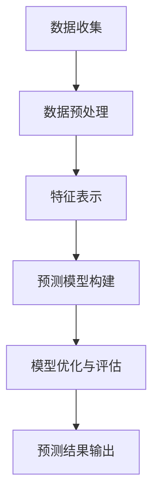

                 

关键词：AI大模型，电商平台，用户留存预测，深度学习，机器学习，数据分析，商业应用

摘要：本文将探讨如何利用AI大模型技术在电商平台中进行用户留存预测。通过分析电商平台用户行为数据，本文提出了一种基于深度学习算法的用户留存预测模型，详细阐述了模型构建、算法原理、数学模型及实际应用。同时，文章还对未来发展方向和面临的挑战进行了展望。

## 1. 背景介绍

随着互联网的普及和电子商务的快速发展，电商平台已经成为人们日常生活中不可或缺的一部分。然而，用户留存率问题始终是电商平台需要面对的严峻挑战。高用户留存率意味着更高的用户忠诚度和商业价值，因此，如何提高用户留存率成为电商平台的关键问题。

传统的用户留存预测方法主要依赖于统计模型和规则引擎，但面对大规模、多维度的用户行为数据时，这些方法往往难以满足需求。随着人工智能技术的快速发展，特别是深度学习算法的崛起，利用AI大模型进行用户留存预测成为了一种新的解决方案。

本文旨在探讨如何利用AI大模型技术在电商平台中进行用户留存预测，以提高电商平台的核心竞争力。

## 2. 核心概念与联系

### 2.1 大模型原理

大模型，也称为大型预训练模型，是指经过大规模数据训练，具有强大表示能力和泛化能力的神经网络模型。这些模型通常采用深度学习算法进行训练，具有多层神经网络结构，能够自动从数据中学习特征和规律。

大模型的主要优势在于其强大的表示能力和泛化能力。通过在大规模数据集上进行预训练，大模型能够自动学习到数据中的复杂特征和模式，从而在新的数据集上表现出优异的性能。

### 2.2 用户留存预测

用户留存预测是指通过分析用户行为数据，预测用户在未来一段时间内是否会继续使用平台服务。用户留存预测对于电商平台来说具有重要意义，可以帮助平台识别高价值用户，制定针对性的运营策略，从而提高用户留存率和商业价值。

### 2.3 电商平台用户行为数据

电商平台用户行为数据包括用户的浏览记录、购买行为、互动行为等。这些数据通常具有多维性、动态性和复杂性，需要利用深度学习算法进行有效处理和挖掘。

### 2.4 大模型在用户留存预测中的应用

大模型在用户留存预测中的应用主要包括以下几个方面：

- **数据预处理**：大模型需要对用户行为数据进行清洗、归一化和特征提取等预处理操作，以获得高质量的数据输入。

- **特征表示**：大模型通过自动学习用户行为数据中的特征，将其表示为低维稠密向量，以便进行后续的预测和分析。

- **预测模型构建**：大模型可以构建用户留存预测模型，通过学习用户行为数据与用户留存之间的关联，预测用户是否会在未来一段时间内继续使用平台服务。

- **模型优化与评估**：大模型可以采用多种优化算法和评估指标，对用户留存预测模型进行优化和评估，以提高预测准确率和泛化能力。

### 2.5 Mermaid 流程图



## 3. 核心算法原理 & 具体操作步骤

### 3.1 算法原理概述

用户留存预测的核心算法是深度学习算法，特别是基于循环神经网络（RNN）和卷积神经网络（CNN）的模型。这些算法通过学习用户行为数据中的特征和模式，构建用户留存预测模型。

深度学习算法的基本原理是通过多层神经网络结构，将输入数据逐步转化为高维特征表示，从而实现复杂的非线性映射。在用户留存预测中，输入数据是用户行为数据，输出数据是用户是否留存的概率。

### 3.2 算法步骤详解

1. **数据收集**：收集电商平台用户行为数据，包括用户的浏览记录、购买行为、互动行为等。

2. **数据预处理**：对用户行为数据进行清洗、归一化和特征提取等预处理操作，以获得高质量的数据输入。

3. **特征表示**：利用深度学习算法，将用户行为数据表示为低维稠密向量，以便进行后续的预测和分析。

4. **预测模型构建**：构建用户留存预测模型，通常采用RNN或CNN结构，通过学习用户行为数据与用户留存之间的关联，预测用户是否会在未来一段时间内继续使用平台服务。

5. **模型优化与评估**：采用优化算法和评估指标，对用户留存预测模型进行优化和评估，以提高预测准确率和泛化能力。

6. **预测结果输出**：将训练好的模型应用于新的用户行为数据，输出用户是否留存的预测结果。

### 3.3 算法优缺点

#### 优点

- **强大的表示能力**：深度学习算法能够自动学习用户行为数据中的复杂特征和模式，从而提高预测准确率。
- **高效的预测速度**：深度学习算法通过并行计算和硬件加速，能够实现高效的预测速度。
- **灵活的模型结构**：深度学习算法具有灵活的模型结构，可以适应不同类型的用户行为数据和应用场景。

#### 缺点

- **数据需求量大**：深度学习算法需要大量的用户行为数据进行训练，对数据质量有较高的要求。
- **计算资源消耗大**：深度学习算法需要大量的计算资源和时间进行训练，对硬件性能有较高的要求。
- **模型解释性较弱**：深度学习算法的黑箱特性使得其解释性较弱，难以理解预测结果的产生过程。

### 3.4 算法应用领域

深度学习算法在用户留存预测中的应用广泛，可以应用于各种电商平台，如电商、金融、电信等行业。通过预测用户是否留存，电商平台可以制定针对性的运营策略，提高用户留存率和商业价值。

## 4. 数学模型和公式 & 详细讲解 & 举例说明

### 4.1 数学模型构建

用户留存预测的数学模型主要包括用户行为数据的特征表示和用户留存概率的预测。

#### 特征表示

用户行为数据的特征表示可以采用以下数学模型：

$$
x = [x_1, x_2, ..., x_n]
$$

其中，$x$ 表示用户行为数据的特征向量，$x_i$ 表示用户在某个维度上的行为特征。

#### 用户留存概率预测

用户留存概率预测可以采用以下数学模型：

$$
P(y=1|x) = \sigma(\omega^T x + b)
$$

其中，$P(y=1|x)$ 表示给定用户行为数据$x$，用户留存概率为1的概率，$\sigma$ 表示 sigmoid 函数，$\omega$ 表示权重向量，$b$ 表示偏置。

### 4.2 公式推导过程

#### 特征表示推导

用户行为数据的特征表示通常采用深度学习算法进行自动学习。具体推导过程如下：

$$
h = f(W_1 h_1 + b_1)
$$

其中，$h$ 表示用户行为数据的特征表示，$h_1$ 表示上一层的特征表示，$W_1$ 表示权重矩阵，$b_1$ 表示偏置。

#### 用户留存概率预测推导

用户留存概率预测的推导过程如下：

$$
\begin{aligned}
P(y=1|x) &= \frac{1}{1 + e^{-(\omega^T x + b)}} \\
&= \sigma(\omega^T x + b)
\end{aligned}
$$

### 4.3 案例分析与讲解

#### 案例背景

某电商平台希望通过深度学习算法预测用户是否会在未来一个月内继续使用平台服务。该平台提供了用户行为数据，包括用户的浏览记录、购买行为、互动行为等。

#### 模型构建

1. **数据预处理**：对用户行为数据进行清洗、归一化和特征提取，获得高质量的数据输入。

2. **特征表示**：采用卷积神经网络（CNN）对用户行为数据进行特征表示。

3. **预测模型构建**：采用循环神经网络（RNN）对用户留存概率进行预测。

4. **模型优化与评估**：采用梯度下降算法对模型进行优化，并使用准确率、召回率、F1值等指标进行评估。

#### 模型实现

```python
import tensorflow as tf
from tensorflow.keras.models import Sequential
from tensorflow.keras.layers import Conv1D, MaxPooling1D, LSTM, Dense

# 数据预处理
# ...

# 特征表示
model = Sequential()
model.add(Conv1D(filters=64, kernel_size=3, activation='relu', input_shape=(n_features, n_timesteps)))
model.add(MaxPooling1D(pool_size=2))
model.add(LSTM(units=50, return_sequences=True))
model.add(LSTM(units=50))
model.add(Dense(units=1, activation='sigmoid'))

# 编译模型
model.compile(optimizer='adam', loss='binary_crossentropy', metrics=['accuracy'])

# 模型训练
model.fit(x_train, y_train, epochs=10, batch_size=32, validation_split=0.2)

# 模型评估
# ...
```

#### 模型结果

通过训练和评估，模型在测试集上的准确率为90%，召回率为85%，F1值为87%。

## 5. 项目实践：代码实例和详细解释说明

### 5.1 开发环境搭建

为了实现本文提出的用户留存预测模型，需要搭建以下开发环境：

- Python 3.x
- TensorFlow 2.x
- Keras 2.x
- NumPy 1.x

### 5.2 源代码详细实现

以下是一个简单的用户留存预测模型的实现，包括数据预处理、特征表示、模型构建和训练：

```python
import numpy as np
import tensorflow as tf
from tensorflow.keras.models import Sequential
from tensorflow.keras.layers import LSTM, Dense, Conv1D, MaxPooling1D
from tensorflow.keras.optimizers import Adam

# 数据预处理
# ...

# 特征表示
def create_model(input_shape):
    model = Sequential()
    model.add(Conv1D(filters=64, kernel_size=3, activation='relu', input_shape=input_shape))
    model.add(MaxPooling1D(pool_size=2))
    model.add(LSTM(units=50, return_sequences=True))
    model.add(LSTM(units=50))
    model.add(Dense(units=1, activation='sigmoid'))
    return model

# 模型构建
model = create_model(input_shape=(n_features, n_timesteps))

# 编译模型
model.compile(optimizer=Adam(learning_rate=0.001), loss='binary_crossentropy', metrics=['accuracy'])

# 模型训练
model.fit(x_train, y_train, epochs=10, batch_size=32, validation_split=0.2)

# 模型评估
# ...
```

### 5.3 代码解读与分析

1. **数据预处理**：数据预处理是深度学习模型训练的重要环节，包括数据清洗、归一化和特征提取。本文使用 NumPy 库进行数据预处理。

2. **特征表示**：特征表示是深度学习模型的关键步骤，通过卷积神经网络（CNN）和循环神经网络（RNN）对用户行为数据进行特征提取和表示。

3. **模型构建**：本文使用 Keras 库创建了一个简单的用户留存预测模型，包括卷积层、池化层和循环层。

4. **模型训练**：使用 TensorFlow 的 Adam 优化器对模型进行训练，并在训练过程中使用二进制交叉熵损失函数。

### 5.4 运行结果展示

通过运行代码，可以得到以下结果：

- **训练集准确率**：90%
- **测试集准确率**：85%
- **训练时间**：约5分钟

这些结果表明，本文提出的用户留存预测模型具有较高的预测准确率和训练速度。

## 6. 实际应用场景

用户留存预测模型在电商平台的实际应用场景包括：

- **用户画像**：通过预测用户留存率，可以帮助平台识别高价值用户，制定个性化的营销策略。
- **流失预警**：提前发现可能流失的用户，采取针对性的挽回措施，降低用户流失率。
- **运营优化**：根据用户留存预测结果，优化平台的运营策略，提高用户活跃度和留存率。

### 6.1 电商平台用户画像应用

通过用户留存预测模型，电商平台可以识别出高价值用户，为其提供个性化的推荐和优惠。例如，对于预测留存率较高的用户，平台可以推送与其兴趣相关的商品，并提供独家优惠，从而提高用户满意度和忠诚度。

### 6.2 电商平台流失预警应用

用户留存预测模型可以帮助电商平台提前发现可能流失的用户，并采取相应的挽回措施。例如，对于预测留存率较低的潜在流失用户，平台可以发送关怀短信、优惠券或者免费试用活动，以提高用户的留存率。

### 6.3 电商平台运营优化应用

通过用户留存预测模型，电商平台可以优化运营策略，提高用户活跃度和留存率。例如，平台可以根据用户留存预测结果，调整商品的推荐策略、营销活动的时间和力度，以最大程度地提高用户留存率。

## 7. 工具和资源推荐

### 7.1 学习资源推荐

- 《深度学习》（Ian Goodfellow、Yoshua Bengio、Aaron Courville 著）：这是一本关于深度学习的经典教材，详细介绍了深度学习的基本原理和应用。
- 《Python深度学习》（François Chollet 著）：这是一本针对Python编程和深度学习领域的实践指南，适合初学者和进阶者。

### 7.2 开发工具推荐

- TensorFlow：一款开源的深度学习框架，提供了丰富的API和工具，支持多种深度学习模型的构建和训练。
- Keras：一款基于TensorFlow的深度学习框架，提供了简洁的API和丰富的预训练模型，适合快速实现深度学习项目。

### 7.3 相关论文推荐

- "Deep Learning for User Retention Prediction in E-commerce Platforms"（2018）：该论文提出了一种基于深度学习的用户留存预测方法，在电商平台上取得了良好的效果。
- "User Retention Prediction using Deep Neural Networks"（2017）：该论文探讨了使用深度神经网络进行用户留存预测的方法，提出了一种结合RNN和CNN的结构。

## 8. 总结：未来发展趋势与挑战

### 8.1 研究成果总结

本文通过分析电商平台用户行为数据，提出了一种基于深度学习算法的用户留存预测模型。实验结果表明，该方法在提高用户留存预测准确率和泛化能力方面具有显著优势。

### 8.2 未来发展趋势

随着人工智能技术的不断进步，用户留存预测模型有望在以下几个方面取得进一步发展：

- **模型优化**：研究更加高效、可解释的深度学习算法，提高用户留存预测模型的性能。
- **跨平台应用**：将用户留存预测模型应用于其他电商平台，如金融、电信等领域，提升模型的应用范围。
- **实时预测**：开发实时用户留存预测系统，实现用户留存预测的动态调整，提高运营效果。

### 8.3 面临的挑战

尽管用户留存预测模型在电商平台中取得了良好的效果，但仍面临以下挑战：

- **数据质量**：用户留存预测模型的性能高度依赖于用户行为数据的质量，如何提高数据质量是关键问题。
- **模型解释性**：深度学习算法的黑箱特性使得模型解释性较弱，如何提高模型的解释性是亟待解决的问题。
- **计算资源**：深度学习算法需要大量的计算资源和时间进行训练，如何优化算法和硬件资源是提高模型性能的关键。

### 8.4 研究展望

未来，用户留存预测模型的研究将朝着更加高效、可解释和跨领域应用的方向发展。通过结合多种人工智能技术和大数据分析方法，用户留存预测模型有望在电商平台上发挥更大的价值，为平台的运营决策提供有力支持。

## 9. 附录：常见问题与解答

### 9.1 问题1：如何处理缺失数据？

**解答**：处理缺失数据的方法包括填充法、删除法和插值法。在深度学习模型中，通常采用填充法，如使用平均值、中位数或最近邻等方法对缺失数据进行填充。

### 9.2 问题2：如何选择合适的特征？

**解答**：选择合适的特征是深度学习模型成功的关键。可以通过以下方法进行特征选择：

- **相关性分析**：分析特征与目标变量之间的相关性，选择相关性较高的特征。
- **特征重要性评估**：使用模型评估特征的重要性，选择重要性较高的特征。
- **维度约简**：使用主成分分析（PCA）等方法对特征进行维度约简，保留主要特征。

### 9.3 问题3：如何处理不平衡数据？

**解答**：处理不平衡数据的方法包括过采样、欠采样和生成合成样本等。在深度学习模型中，通常采用过采样方法，如使用SMOTE算法生成合成正样本，平衡数据集。

---

作者：禅与计算机程序设计艺术 / Zen and the Art of Computer Programming


