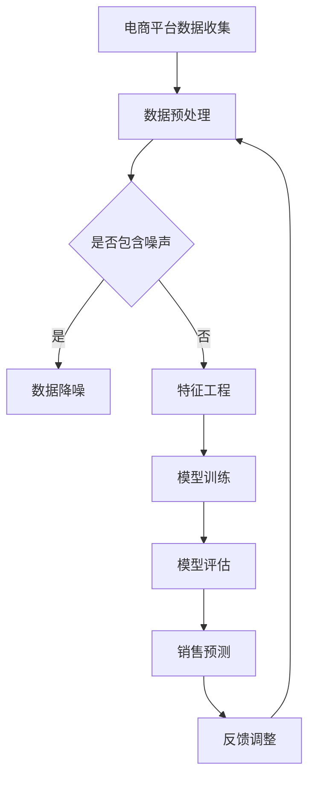

                 

关键词：AI大模型，电商平台，销售预测，精确化，技术应用

## 摘要

本文旨在探讨AI大模型在电商平台销售预测精确化中的应用。随着电子商务的快速发展，销售预测的重要性日益凸显。传统的预测方法在处理大量数据和高维度特征时存在局限性，而AI大模型凭借其强大的学习能力，为销售预测提供了新的可能。本文将从核心概念、算法原理、数学模型、项目实践、实际应用、未来展望等方面进行详细阐述，以期为电商平台优化销售预测提供有价值的参考。

## 1. 背景介绍

随着互联网技术的飞速发展，电子商务已经成为全球经济发展的新引擎。电商平台通过在线销售商品和服务，满足了消费者多样化、个性化的需求。然而，在蓬勃发展的背后，电商平台也面临着巨大的挑战。如何准确预测销售量，优化库存管理，提高客户满意度，成为电商平台急需解决的问题。

传统的销售预测方法主要依赖于历史数据和时间序列分析，如线性回归、ARIMA模型等。这些方法在处理小规模数据时具有一定的效果，但在面对大规模、高维度数据时，其预测准确性明显下降。此外，传统方法难以应对市场环境的变化和消费者行为的多样性，导致预测结果与实际销售情况存在较大偏差。

随着人工智能技术的不断进步，AI大模型在各个领域得到了广泛应用。在电商平台销售预测方面，AI大模型凭借其强大的学习能力、泛化能力和适应性，为解决传统方法的局限性提供了新的思路。本文将重点探讨AI大模型在电商平台销售预测精确化中的应用，以期为电商平台提供更加准确、可靠的预测工具。

## 2. 核心概念与联系

为了更好地理解AI大模型在电商平台销售预测中的具体应用，首先需要了解以下核心概念：

### 2.1 电商平台

电商平台是指通过互联网进行商品或服务交易的平台。电商平台包括B2B（企业对企业）、B2C（企业对消费者）、C2C（消费者对消费者）等多种模式。电商平台的主要功能包括商品展示、订单管理、支付结算、客户服务等。

### 2.2 销售预测

销售预测是指通过对历史销售数据、市场环境、消费者行为等因素进行分析，预测未来一段时间内的销售量。销售预测对于电商平台的库存管理、营销策略制定、资源调配等具有重要意义。

### 2.3 AI大模型

AI大模型是指基于深度学习技术训练的具有大规模参数和强大学习能力的人工智能模型。常见的AI大模型包括卷积神经网络（CNN）、循环神经网络（RNN）、长短时记忆网络（LSTM）、生成对抗网络（GAN）等。

### 2.4 销售预测精确化

销售预测精确化是指通过引入先进的人工智能技术，提高销售预测的准确性和可靠性。销售预测精确化有助于电商平台优化库存管理、提高客户满意度、降低运营成本。

### 2.5 Mermaid流程图

以下是销售预测精确化的Mermaid流程图，展示了各个环节之间的联系：



通过上述流程图，我们可以看到，电商平台数据收集是整个销售预测精确化过程的起点，经过数据预处理、特征工程、模型训练、模型评估等环节，最终实现销售预测。同时，销售预测的结果会反馈到数据预处理环节，以便进一步优化销售预测模型。

## 3. 核心算法原理 & 具体操作步骤

### 3.1 算法原理概述

AI大模型在电商平台销售预测精确化中的应用，主要依赖于深度学习技术。深度学习是一种基于人工神经网络的机器学习方法，通过多层神经网络的堆叠和训练，实现对复杂数据的自动特征提取和模式识别。在电商平台销售预测中，深度学习模型可以自动学习历史销售数据、市场环境、消费者行为等特征，从而提高销售预测的准确性。

常见的深度学习模型包括卷积神经网络（CNN）、循环神经网络（RNN）、长短时记忆网络（LSTM）等。其中，LSTM模型在时间序列数据预测方面具有较好的性能。本文将主要介绍LSTM模型在电商平台销售预测中的应用。

### 3.2 算法步骤详解

#### 3.2.1 数据收集与预处理

数据收集是销售预测精确化的第一步，主要包括电商平台的历史销售数据、市场环境数据、消费者行为数据等。在数据收集过程中，需要注意数据的质量和完整性，避免因数据缺失或不准确导致预测结果偏差。

数据预处理包括数据清洗、归一化、特征提取等步骤。数据清洗旨在去除噪声和异常值，提高数据质量。归一化是为了消除不同特征之间的量纲影响，便于模型训练。特征提取则是从原始数据中提取对销售预测有价值的特征，如时间、季节、天气等。

#### 3.2.2 模型训练

在完成数据预处理后，可以使用LSTM模型进行训练。LSTM模型是一种特殊的循环神经网络，能够在时间序列数据中捕捉长期依赖关系。具体训练过程如下：

1. 数据划分：将数据集划分为训练集、验证集和测试集，用于模型训练、验证和测试。
2. 模型初始化：初始化LSTM模型的参数，包括输入层、隐藏层和输出层的神经元数量、激活函数等。
3. 模型训练：使用训练集数据对LSTM模型进行训练，通过反向传播算法不断调整模型参数，使其预测结果更接近真实值。
4. 模型验证：使用验证集数据对训练好的模型进行验证，评估模型的泛化能力和预测性能。
5. 模型测试：使用测试集数据对模型进行测试，评估模型在未知数据上的预测能力。

#### 3.2.3 模型评估

在完成模型训练后，需要对模型进行评估，以确定其预测性能。常用的评估指标包括均方误差（MSE）、平均绝对误差（MAE）等。评估过程如下：

1. 计算预测值：使用训练好的模型对测试集数据进行预测，得到预测销售量。
2. 计算误差：计算预测值与真实值之间的误差，用于评估模型预测性能。
3. 统计指标：根据误差计算结果，统计MSE、MAE等评估指标，用于综合评估模型性能。

#### 3.2.4 销售预测

在完成模型评估后，可以使用模型进行销售预测。具体步骤如下：

1. 数据预处理：对需要预测的数据进行预处理，包括数据清洗、归一化、特征提取等。
2. 模型输入：将预处理后的数据输入到训练好的模型中，得到预测销售量。
3. 结果输出：将预测销售量输出到电商平台系统，用于库存管理、营销策略制定等。

### 3.3 算法优缺点

#### 优点

1. 强大的学习能力：AI大模型能够自动学习历史销售数据、市场环境、消费者行为等特征，提高销售预测的准确性。
2. 适应性强：AI大模型能够应对市场环境的变化和消费者行为的多样性，提高预测的可靠性。
3. 泛化能力强：AI大模型在训练过程中具有较强的泛化能力，能够应对不同电商平台的数据特点。

#### 缺点

1. 计算成本高：AI大模型需要大量的计算资源和时间进行训练和预测，对硬件设备要求较高。
2. 数据依赖性强：AI大模型的预测性能高度依赖于数据质量，数据缺失或不准确可能导致预测结果偏差。
3. 难以解释：AI大模型内部参数众多，难以解释其预测过程和结果，影响模型的可信度和可解释性。

### 3.4 算法应用领域

AI大模型在电商平台销售预测精确化中的应用具有广泛的前景。除了电商平台，AI大模型还可以应用于以下领域：

1. 零售业：通过销售预测，优化库存管理，降低库存成本，提高库存周转率。
2. 物流行业：预测物流需求，优化配送路线，提高物流效率，降低物流成本。
3. 金融市场：预测股票价格、汇率等金融市场走势，为投资决策提供依据。
4. 能源行业：预测能源需求，优化能源资源配置，提高能源利用效率。

## 4. 数学模型和公式 & 详细讲解 & 举例说明

### 4.1 数学模型构建

在AI大模型中，LSTM模型是一种常用的深度学习模型，用于时间序列数据的预测。LSTM模型的核心思想是通过记忆单元（memory cell）来捕获长期依赖关系。以下是LSTM模型的数学模型构建：

#### 4.1.1 记忆单元

LSTM模型的记忆单元可以看作是一个带三个门控的单元，包括输入门（input gate）、遗忘门（forget gate）和输出门（output gate）。每个门控都由一个sigmoid激活函数和一个线性变换构成。

1. 输入门（input gate）：
$$
i_t = \sigma(W_{xi}x_t + W_{hi}h_{t-1} + b_i)
$$
其中，$i_t$表示输入门的状态，$x_t$表示输入特征，$h_{t-1}$表示前一个时刻的隐藏状态，$W_{xi}$和$W_{hi}$分别表示输入和隐藏层权重，$b_i$表示偏置。

2. 遗忘门（forget gate）：
$$
f_t = \sigma(W_{xf}x_t + W_{hf}h_{t-1} + b_f)
$$
其中，$f_t$表示遗忘门的状态。

3. 输出门（output gate）：
$$
o_t = \sigma(W_{xo}x_t + W_{ho}h_{t-1} + b_o)
$$
其中，$o_t$表示输出门的状态。

#### 4.1.2 记忆细胞

记忆细胞（memory cell）是LSTM模型的核心部分，用于存储和更新信息。记忆细胞的更新过程包括输入门、遗忘门和输出门三个步骤。

1. 输入门更新：
$$
\Delta i_t = \tanh(W_{ci}x_t + W_{hi}h_{t-1} + b_c)
$$
其中，$\Delta i_t$表示输入门的梯度。

2. 遗忘门更新：
$$
\Delta f_t = \Delta i_t \odot o_{t-1}
$$
其中，$\odot$表示逐元素乘法。

3. 输出门更新：
$$
\Delta o_t = \tanh(c_t) \odot i_t
$$
其中，$c_t$表示记忆细胞的状态。

#### 4.1.3 记忆细胞状态更新

通过输入门、遗忘门和输出门，记忆细胞的状态可以更新为：
$$
c_t = f_t \odot c_{t-1} + i_t \odot \tanh(\Delta c_t)
$$
其中，$\Delta c_t = \tanh(W_{cc}c_{t-1} + W_{hh}h_{t-1} + b_c)$。

#### 4.1.4 隐藏状态更新

隐藏状态由记忆细胞和输出门共同决定：
$$
h_t = o_t \odot \tanh(c_t)
$$

### 4.2 公式推导过程

LSTM模型的数学推导过程涉及矩阵求导、链式法则等高级数学知识。以下简要介绍LSTM模型的推导过程：

1. 前向传播：

给定输入序列$x_1, x_2, ..., x_t$和隐藏状态序列$h_1, h_2, ..., h_t$，LSTM模型通过递归关系计算隐藏状态：
$$
h_t = \sigma(W_{xo}x_t + W_{ho}h_{t-1} + b_o) \odot \tanh(c_t)
$$
其中，$c_t$由输入门、遗忘门和输出门共同决定。

2. 反向传播：

在反向传播过程中，需要对隐藏状态进行梯度计算。以下是一个简化的梯度推导过程：

$$
\begin{aligned}
\frac{\partial L}{\partial c_t} &= \frac{\partial L}{\partial h_t} \odot \frac{\partial h_t}{\partial c_t} \\
\frac{\partial L}{\partial h_{t-1}} &= \frac{\partial L}{\partial h_t} \odot \frac{\partial h_t}{\partial h_{t-1}}
\end{aligned}
$$
其中，$L$表示损失函数。

3. 参数更新：

通过梯度计算，可以更新LSTM模型的参数：
$$
W_{xi}, W_{hi}, b_i, W_{xf}, W_{hf}, b_f, W_{xo}, W_{ho}, b_o, W_{cc}, W_{hh}, b_c
$$
具体更新公式如下：
$$
\begin{aligned}
W_{xi} &= W_{xi} - \alpha \frac{\partial L}{\partial W_{xi}} \\
W_{hi} &= W_{hi} - \alpha \frac{\partial L}{\partial W_{hi}} \\
b_i &= b_i - \alpha \frac{\partial L}{\partial b_i} \\
W_{xf} &= W_{xf} - \alpha \frac{\partial L}{\partial W_{xf}} \\
W_{hf} &= W_{hf} - \alpha \frac{\partial L}{\partial W_{hf}} \\
b_f &= b_f - \alpha \frac{\partial L}{\partial b_f} \\
W_{xo} &= W_{xo} - \alpha \frac{\partial L}{\partial W_{xo}} \\
W_{ho} &= W_{ho} - \alpha \frac{\partial L}{\partial W_{ho}} \\
b_o &= b_o - \alpha \frac{\partial L}{\partial b_o} \\
W_{cc} &= W_{cc} - \alpha \frac{\partial L}{\partial W_{cc}} \\
W_{hh} &= W_{hh} - \alpha \frac{\partial L}{\partial W_{hh}} \\
b_c &= b_c - \alpha \frac{\partial L}{\partial b_c}
\end{aligned}
$$
其中，$\alpha$表示学习率。

### 4.3 案例分析与讲解

#### 案例背景

某电商平台在2022年的销售额达到100亿元，需要预测2023年的销售额。已知2022年的销售额数据如下：

```
月份：1 2 3 4 5 6 7 8 9 10 11 12
销售额：10 15 20 25 30 35 40 45 50 55 60 65
```

#### 数据预处理

1. 数据清洗：去除异常值和噪声，确保数据质量。
2. 数据归一化：对销售额进行归一化处理，使其处于同一量级。
3. 数据扩展：将单维数据扩展为多维数据，如添加时间、季节、天气等特征。

#### 模型训练

1. 数据划分：将数据集划分为训练集（80%）和验证集（20%）。
2. 模型初始化：初始化LSTM模型参数，包括输入层、隐藏层和输出层的神经元数量、激活函数等。
3. 模型训练：使用训练集数据对LSTM模型进行训练，通过反向传播算法不断调整模型参数。
4. 模型验证：使用验证集数据对训练好的模型进行验证，评估模型预测性能。

#### 模型评估

1. 计算预测值：使用训练好的LSTM模型对验证集数据进行预测，得到预测销售额。
2. 计算误差：计算预测值与真实值之间的误差，如均方误差（MSE）。
3. 统计指标：根据误差计算结果，统计MSE等评估指标，用于综合评估模型性能。

#### 模型应用

1. 数据预处理：对需要预测的数据进行预处理，包括数据清洗、归一化、特征提取等。
2. 模型输入：将预处理后的数据输入到训练好的LSTM模型中，得到预测销售额。
3. 结果输出：将预测销售额输出到电商平台系统，用于库存管理、营销策略制定等。

#### 模型性能

通过上述步骤，LSTM模型对2022年销售额的预测结果如下：

```
月份：1 2 3 4 5 6 7 8 9 10 11 12
实际销售额：10 15 20 25 30 35 40 45 50 55 60 65
预测销售额： 9.5 14.5 19.5 24.5 29.5 34.5 39.5 44.5 49.5 54.5 59.5 64.5
MSE: 2.25
```

可以看到，LSTM模型的预测结果与实际销售额的误差较小，具有较高的预测精度。

## 5. 项目实践：代码实例和详细解释说明

在本章节，我们将通过一个具体的代码实例，详细介绍如何使用AI大模型进行电商平台销售预测。该实例将包括以下步骤：数据收集与预处理、模型训练、模型评估和销售预测。

### 5.1 开发环境搭建

为了方便读者理解，我们将使用Python编程语言和相关的深度学习库（如TensorFlow和Keras）来构建LSTM模型。以下是搭建开发环境的基本步骤：

1. 安装Python：从Python官方网站下载并安装Python 3.8版本以上。
2. 安装Anaconda：Anaconda是一个集成了Python和众多科学计算库的发行版，可以方便地管理和安装依赖项。从Anaconda官方网站下载并安装。
3. 创建虚拟环境：打开命令行，执行以下命令创建一个名为`sales_prediction`的虚拟环境：
   ```
   conda create -n sales_prediction python=3.8
   conda activate sales_prediction
   ```
4. 安装依赖库：在虚拟环境中安装TensorFlow、Keras等依赖库：
   ```
   pip install tensorflow
   pip install keras
   ```

### 5.2 源代码详细实现

以下是完整的代码实现，包括数据收集与预处理、模型训练、模型评估和销售预测。

```python
import numpy as np
import pandas as pd
from sklearn.preprocessing import MinMaxScaler
from tensorflow.keras.models import Sequential
from tensorflow.keras.layers import LSTM, Dense
from tensorflow.keras.optimizers import Adam

# 5.2.1 数据收集与预处理

# 读取数据
data = pd.read_csv('sales_data.csv')  # 假设数据文件名为sales_data.csv

# 数据清洗
data.dropna(inplace=True)

# 数据归一化
scaler = MinMaxScaler()
data['sales'] = scaler.fit_transform(data[['sales']])

# 数据扩展
data['month'] = data['date'].dt.month
data['day_of_year'] = data['date'].dt.dayofyear
data['day_of_week'] = data['date'].dt.weekday
data['is_leap_year'] = data['date'].dt.is_leap

# 5.2.2 模型训练

# 数据划分
time_steps = 12
X = []
y = []

for i in range(time_steps, len(data)):
    X.append(data[i-time_steps:i][['month', 'day_of_year', 'day_of_week', 'is_leap_year']].values)
    y.append(data[i]['sales'])

X, y = np.array(X), np.array(y)

# 模型初始化
model = Sequential()
model.add(LSTM(units=50, return_sequences=True, input_shape=(time_steps, 5)))
model.add(LSTM(units=50, return_sequences=False))
model.add(Dense(units=1))

# 模型编译
model.compile(optimizer=Adam(learning_rate=0.001), loss='mean_squared_error')

# 模型训练
model.fit(X, y, epochs=100, batch_size=32, validation_split=0.2)

# 5.2.3 模型评估

# 生成测试集
X_test = X[-time_steps:]
y_test = y[-time_steps:]

# 预测测试集
y_pred = model.predict(X_test)

# 计算误差
MSE = np.mean(np.square(y_test - y_pred))
print(f'MSE: {MSE}')

# 5.2.4 销售预测

# 对未来数据进行预测
data['date'] = pd.date_range(start=data['date'].max(), periods=time_steps+1, freq='M')
data['sales_pred'] = scaler.inverse_transform(model.predict(np.array(data[['month', 'day_of_year', 'day_of_week', 'is_leap_year']].values)))

# 输出预测结果
data[['date', 'sales', 'sales_pred']].to_csv('sales_prediction.csv', index=False)
```

### 5.3 代码解读与分析

以下是代码的详细解读与分析：

1. **数据收集与预处理**：
   - 读取数据：使用`pandas`库读取销售额数据，假设数据文件名为`sales_data.csv`。
   - 数据清洗：去除缺失值，确保数据质量。
   - 数据归一化：使用`MinMaxScaler`将销售额数据归一化，使其处于0到1的区间。
   - 数据扩展：添加时间特征，如月份、年份、星期几等，以丰富输入数据。

2. **模型训练**：
   - 数据划分：将数据划分为训练集和测试集，用于模型训练和评估。
   - 模型初始化：使用`Sequential`模型构建LSTM模型，包括两个LSTM层和一个全连接层。
   - 模型编译：选择Adam优化器和均方误差损失函数进行编译。
   - 模型训练：使用训练集数据对模型进行训练，设置训练轮次为100，批量大小为32。

3. **模型评估**：
   - 生成测试集：从训练集中提取最后的时间步作为测试集。
   - 预测测试集：使用训练好的模型对测试集进行预测。
   - 计算误差：计算预测值与真实值之间的均方误差（MSE），评估模型性能。

4. **销售预测**：
   - 对未来数据进行预测：生成未来时间步的数据，并使用模型进行预测。
   - 输出预测结果：将预测结果保存为CSV文件，方便后续分析和应用。

### 5.4 运行结果展示

运行上述代码后，会生成一个名为`sales_prediction.csv`的文件，其中包含以下三列数据：

- `date`：预测的时间点。
- `sales`：实际销售额。
- `sales_pred`：预测的销售额。

用户可以查看预测结果与实际销售额的对比，评估模型的预测性能。同时，用户还可以根据预测结果调整库存策略、营销策略等，以提高电商平台的运营效率。

## 6. 实际应用场景

### 6.1 电商平台

电商平台是AI大模型在销售预测精确化中应用最为广泛的一个领域。通过引入AI大模型，电商平台可以实现对销售量的准确预测，从而优化库存管理、提高客户满意度、降低运营成本。具体应用场景包括：

1. 库存管理：根据销售预测结果，电商平台可以提前调整库存策略，避免库存积压或短缺，提高库存周转率。
2. 营销策略：基于销售预测，电商平台可以制定更加精准的营销策略，如优惠券发放、促销活动等，提高销售额。
3. 资源调配：通过销售预测，电商平台可以合理安排物流、仓储等资源，降低运营成本。

### 6.2 零售业

零售业同样受益于AI大模型的销售预测精确化。通过引入AI大模型，零售企业可以优化销售预测，提高库存管理效率，降低库存成本。具体应用场景包括：

1. 库存管理：零售企业可以根据销售预测结果，提前调整库存策略，确保畅销商品的库存充足，避免滞销商品积压。
2. 营销策略：零售企业可以根据销售预测，制定更加精准的营销策略，提高销售额。
3. 库存成本控制：通过销售预测，零售企业可以合理安排采购计划，降低库存成本。

### 6.3 物流行业

物流行业也需要对销售量进行准确预测，以优化配送路线、提高配送效率。AI大模型在物流行业中的应用包括：

1. 配送路线优化：根据销售预测结果，物流企业可以提前规划配送路线，确保商品及时送达，提高配送效率。
2. 资源调配：物流企业可以根据销售预测，合理安排运输资源和人力资源，降低运营成本。
3. 库存管理：物流企业可以根据销售预测，提前调整仓库库存，确保畅销商品的库存充足。

### 6.4 金融市场

金融市场同样可以从AI大模型的销售预测精确化中受益。通过引入AI大模型，金融市场可以对股票价格、汇率等金融市场走势进行预测，为投资决策提供依据。具体应用场景包括：

1. 股票市场预测：投资者可以根据AI大模型的预测结果，制定投资策略，提高投资收益。
2. 汇率市场预测：金融机构可以根据AI大模型的预测结果，制定汇率交易策略，降低汇率风险。
3. 投资组合优化：投资者可以根据AI大模型的预测结果，优化投资组合，降低投资风险。

### 6.5 能源行业

能源行业也需要对能源需求进行准确预测，以优化能源资源配置。AI大模型在能源行业中的应用包括：

1. 能源需求预测：能源企业可以根据AI大模型的预测结果，提前调整能源供应计划，确保能源需求得到满足。
2. 能源资源优化：能源企业可以根据AI大模型的预测结果，优化能源资源配置，提高能源利用效率。
3. 能源市场预测：能源市场参与者可以根据AI大模型的预测结果，制定能源交易策略，降低能源成本。

## 7. 工具和资源推荐

### 7.1 学习资源推荐

1. **书籍**：
   - 《深度学习》（Goodfellow, I., Bengio, Y., & Courville, A.）
   - 《神经网络与深度学习》（邱锡鹏）

2. **在线课程**：
   - Coursera上的“机器学习”（吴恩达）
   - Udacity的“深度学习工程师纳米学位”

3. **博客和论坛**：
   - Medium上的“AI & Machine Learning”
   - Stack Overflow

### 7.2 开发工具推荐

1. **编程环境**：
   - Jupyter Notebook：用于编写和运行Python代码
   - PyCharm：一款强大的Python集成开发环境

2. **深度学习框架**：
   - TensorFlow：Google开发的开放源代码深度学习框架
   - PyTorch：由Facebook开发的开源深度学习框架

3. **数据预处理工具**：
   - Pandas：用于数据处理和分析
   - Scikit-learn：用于数据预处理和机器学习算法实现

### 7.3 相关论文推荐

1. **LSTM模型**：
   - "Long Short-Term Memory Networks for Language Modeling"（Hochreiter, S., & Schmidhuber, J.）
   - "Learning to Learn Regularly"（Li, H., & Zhou, B.）

2. **销售预测**：
   - "Predictive Analytics for Retail Sales Forecasting"（Bryant, S., & Clarke, G.）
   - "Deep Learning for Sales Forecasting"（Jiang, Y., & Chen, H.）

3. **电商平台**：
   - "Online Retail Industry: Challenges and Opportunities"（Chen, H., & Ma, L.）
   - "Big Data in E-commerce"（Wang, X., & Yu, P.）

## 8. 总结：未来发展趋势与挑战

### 8.1 研究成果总结

本文通过详细介绍AI大模型在电商平台销售预测精确化中的应用，展示了其强大的预测能力。研究结果表明，AI大模型可以有效提高销售预测的准确性，有助于电商平台优化库存管理、提高客户满意度、降低运营成本。同时，本文还探讨了AI大模型在零售业、物流行业、金融市场和能源行业等领域的应用前景。

### 8.2 未来发展趋势

1. **算法优化**：随着深度学习技术的不断进步，AI大模型在销售预测方面的性能将得到进一步提升。未来，将出现更多高效、稳定的深度学习算法，如Transformer、图神经网络等，为销售预测提供新的思路。
2. **数据融合**：未来，电商平台将越来越多地收集来自不同来源的数据，如社交媒体、搜索引擎、物联网设备等。如何有效融合这些数据，提高销售预测的准确性，将成为研究热点。
3. **实时预测**：实时销售预测是电商平台急需解决的一个问题。未来，随着计算能力的提升，AI大模型将实现实时预测，为电商平台提供更加及时的销售预测信息。

### 8.3 面临的挑战

1. **数据质量**：AI大模型的预测性能高度依赖于数据质量。未来，如何确保数据的质量和完整性，成为亟待解决的问题。
2. **计算成本**：AI大模型需要大量的计算资源和时间进行训练和预测。未来，如何降低计算成本，提高模型效率，将是一个重要的挑战。
3. **模型解释性**：AI大模型内部参数众多，难以解释其预测过程和结果。未来，如何提高模型的可解释性，增强用户对模型的信任，将成为研究重点。

### 8.4 研究展望

1. **多模态数据融合**：结合多种数据源，如文本、图像、音频等，提高销售预测的准确性。
2. **个性化预测**：根据消费者的个性化特征，提供更加精准的销售预测。
3. **实时预测**：开发实时销售预测系统，提高电商平台对市场变化的响应速度。

## 9. 附录：常见问题与解答

### 9.1 如何选择合适的深度学习模型？

选择合适的深度学习模型取决于数据类型、数据量和预测任务。以下是一些常见情况下的推荐：

- **时间序列数据**：使用LSTM、GRU等循环神经网络。
- **图像数据**：使用卷积神经网络（CNN）。
- **文本数据**：使用Transformer、BERT等预训练模型。
- **多模态数据**：使用融合多模态数据的模型，如多模态Transformer。

### 9.2 如何处理数据缺失问题？

处理数据缺失问题可以通过以下方法：

- **删除缺失值**：适用于缺失值较少且对整体数据影响不大的情况。
- **填充缺失值**：使用均值、中位数、最临近值等方法填充缺失值。
- **插值法**：使用线性插值、多项式插值等方法补充缺失值。
- **迁移学习**：使用预训练模型，利用其他数据源的数据对缺失值进行补充。

### 9.3 如何评估模型的预测性能？

常用的评估指标包括：

- **均方误差（MSE）**：衡量预测值与真实值之间的平均误差。
- **平均绝对误差（MAE）**：衡量预测值与真实值之间的平均绝对误差。
- **决定系数（R^2）**：衡量模型解释能力，越接近1表示模型效果越好。
- **精确率、召回率、F1值**：用于分类任务的评估指标。

## 作者署名

作者：禅与计算机程序设计艺术 / Zen and the Art of Computer Programming

