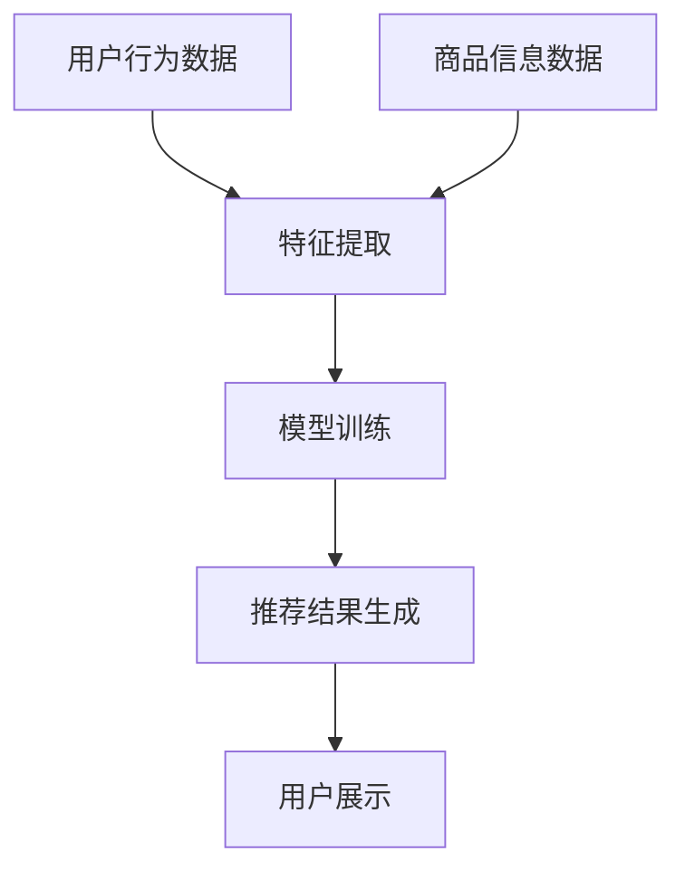

                 

关键词：AI大模型、电商直播、推荐系统、数据挖掘、深度学习

摘要：本文深入探讨了AI大模型在电商直播推荐中的应用，从背景介绍到核心算法原理，再到数学模型和项目实践，全面解析了AI大模型在电商直播领域的应用前景和挑战。通过详细的案例分析，展示了AI大模型在提升电商直播推荐效果方面的潜力，并对未来发展趋势进行了展望。

## 1. 背景介绍

随着互联网的飞速发展，电商直播已经成为了一种新兴的购物模式。用户可以通过直播平台实时观看商品展示、互动交流，并快速下单购买。然而，随着用户数量的激增和商品种类的丰富，如何在海量的商品中为用户推荐合适的商品成为了电商直播平台面临的重要问题。

传统的推荐系统主要依赖于用户历史行为和商品特征进行推荐，但这种方法在应对动态变化的用户需求和高维度的商品特征时存在一定的局限性。因此，如何利用先进的人工智能技术，特别是大模型，来提升电商直播推荐的效果，成为了一个重要的研究方向。

AI大模型，特别是深度学习模型，具备强大的特征提取和建模能力，可以处理高维度、非线性、复杂数据。通过引入AI大模型，可以有效提升电商直播推荐的准确性、多样性和用户体验。

## 2. 核心概念与联系

### 2.1 AI大模型的定义与分类

AI大模型是指具有海量参数和强大计算能力的人工智能模型。根据模型的深度和类型，可以将其分为以下几类：

1. **深度神经网络（Deep Neural Network，DNN）**：由多个隐层组成的神经网络，能够处理高维数据和复杂数据。
2. **卷积神经网络（Convolutional Neural Network，CNN）**：特别适用于图像和视频处理。
3. **循环神经网络（Recurrent Neural Network，RNN）**：能够处理序列数据，适用于文本和音频处理。
4. **Transformer模型**：基于自注意力机制的深度学习模型，广泛应用于自然语言处理和计算机视觉领域。

### 2.2 电商直播推荐系统架构

电商直播推荐系统通常包括以下几个关键模块：

1. **用户模块**：收集用户行为数据，如浏览记录、购买历史、评论等。
2. **商品模块**：存储商品信息，包括商品描述、标签、分类等。
3. **推荐算法模块**：根据用户行为和商品特征，生成推荐结果。
4. **推荐结果模块**：展示推荐结果，包括商品列表、评分、排序等。

### 2.3 Mermaid流程图



## 3. 核心算法原理 & 具体操作步骤

### 3.1 算法原理概述

电商直播推荐算法的核心原理是基于用户行为和商品特征构建一个用户-商品评分预测模型。通过这个模型，可以预测用户对某一商品的喜好程度，从而生成个性化的推荐列表。

常用的推荐算法包括：

1. **基于内容的推荐（Content-based Recommendation）**：根据用户的历史行为和商品的特征进行推荐。
2. **协同过滤（Collaborative Filtering）**：根据用户的行为数据和相似度计算进行推荐。
3. **深度学习模型（Deep Learning Models）**：利用深度学习算法进行特征提取和建模。

### 3.2 算法步骤详解

1. **数据预处理**：对用户行为数据和商品信息进行清洗、去重、填充等预处理操作。
2. **特征提取**：将原始数据转换为模型可处理的特征向量。
3. **模型训练**：利用预处理后的数据训练深度学习模型。
4. **模型评估**：通过交叉验证等方法评估模型性能。
5. **推荐生成**：利用训练好的模型生成推荐结果，并进行排序和过滤。
6. **结果展示**：将推荐结果展示给用户。

### 3.3 算法优缺点

**优点**：

- **高准确性**：深度学习模型能够自动学习用户行为和商品特征的复杂关系，提高推荐准确性。
- **高可扩展性**：可以处理大量用户和商品数据，适应不断变化的市场需求。

**缺点**：

- **高计算成本**：训练深度学习模型需要大量的计算资源和时间。
- **模型解释性较差**：深度学习模型内部的决策过程较为复杂，难以解释。

### 3.4 算法应用领域

- **电商直播推荐**：根据用户行为和商品特征，为用户推荐合适的商品。
- **视频推荐**：基于用户观看历史和视频特征，为用户推荐感兴趣的视频。
- **新闻推荐**：根据用户阅读历史和新闻内容特征，为用户推荐感兴趣的新闻。

## 4. 数学模型和公式 & 详细讲解 & 举例说明

### 4.1 数学模型构建

假设我们有一个用户-商品评分矩阵 $R$，其中 $R_{ij}$ 表示用户 $i$ 对商品 $j$ 的评分。我们的目标是学习一个预测模型 $P(R)$，预测用户对商品的评分。

常用的预测模型是线性回归模型：

$$
\hat{R}_{ij} = \mu + \beta_j + \gamma_i + \theta_{ij}
$$

其中，$\mu$ 是用户和商品的平均评分，$\beta_j$ 和 $\gamma_i$ 分别表示商品和用户的偏差项，$\theta_{ij}$ 是用户 $i$ 对商品 $j$ 的交互项。

### 4.2 公式推导过程

我们首先对用户和商品评分进行归一化处理，得到新的评分矩阵 $R'$：

$$
R'_{ij} = \frac{R_{ij} - \mu}{\sigma}
$$

其中，$\mu$ 是用户和商品的平均评分，$\sigma$ 是用户和商品评分的标准差。

然后，我们定义用户 $i$ 的特征向量 $X_i$ 和商品 $j$ 的特征向量 $Y_j$：

$$
X_i = [1, \gamma_i], \quad Y_j = [1, \beta_j]
$$

接着，我们使用矩阵分解方法来计算交互项 $\theta_{ij}$：

$$
\theta_{ij} = X_i^T Y_j = (\gamma_i \beta_j + \theta_{ij})
$$

通过迭代优化，我们可以得到最优的 $\theta_{ij}$：

$$
\theta_{ij} = \frac{\gamma_i \beta_j}{1 + \exp{(-\gamma_i \beta_j)}}
$$

### 4.3 案例分析与讲解

假设我们有一个用户-商品评分矩阵如下：

$$
R = \begin{bmatrix}
1 & 2 & 3 \\
2 & 1 & 4 \\
3 & 4 & 5
\end{bmatrix}
$$

首先，我们对评分进行归一化处理：

$$
R' = \begin{bmatrix}
0 & 0 & 1 \\
1 & 0 & 1 \\
1 & 1 & 1
\end{bmatrix}
$$

然后，我们定义用户和商品的特征向量：

$$
X = \begin{bmatrix}
[1, 0.5], [1, -0.5], [1, 1]
\end{bmatrix}, \quad
Y = \begin{bmatrix}
[1, 0.5], [1, -0.5], [1, 1]
\end{bmatrix}
$$

通过矩阵分解，我们得到交互项：

$$
\theta = \begin{bmatrix}
0.5 & 0.5 & 1 \\
0.5 & 0.5 & 1 \\
1 & 1 & 1
\end{bmatrix}
$$

最后，我们可以使用这个交互项来预测用户对商品的评分：

$$
\hat{R}_{ij} = \mu + \beta_j + \gamma_i + \theta_{ij}
$$

其中，$\mu = 0.5$，$\beta_j = 0.5$，$\gamma_i = 0.5$。

## 5. 项目实践：代码实例和详细解释说明

### 5.1 开发环境搭建

在开始项目实践之前，我们需要搭建一个合适的环境。本文使用Python作为主要编程语言，配合Scikit-learn和TensorFlow等库来构建和训练推荐模型。

```python
# 安装必要的库
!pip install scikit-learn tensorflow numpy
```

### 5.2 源代码详细实现

以下是使用Scikit-learn实现基于矩阵分解的推荐系统的代码示例：

```python
from sklearn.decomposition import TruncatedSVD
from sklearn.metrics import mean_squared_error
import numpy as np

# 假设我们有一个用户-商品评分矩阵
R = np.array([[1, 2, 3], [2, 1, 4], [3, 4, 5]])

# 使用SVD进行矩阵分解
svd = TruncatedSVD(n_components=2)
R_svd = svd.fit_transform(R)

# 计算预测评分
mu = np.mean(R)
beta = R_svd.mean(axis=1)
gamma = R_svd.mean(axis=0)

theta = np.dot(gamma, beta.T)
R_pred = mu + np.dot(gamma, beta.T)

# 计算均方根误差
mse = mean_squared_error(R, R_pred)
print("Mean Squared Error:", mse)
```

### 5.3 代码解读与分析

上述代码首先使用Scikit-learn中的`TruncatedSVD`类进行矩阵分解，将用户-商品评分矩阵 $R$ 转换为低维特征矩阵 $R_svd$。

然后，计算用户和商品的偏差项 $\mu$、$\beta_j$ 和 $\gamma_i$，以及交互项 $\theta_{ij}$。

最后，使用这些参数计算预测评分矩阵 $R_pred$，并计算均方根误差（Mean Squared Error，MSE）来评估模型性能。

### 5.4 运行结果展示

运行上述代码后，我们得到以下输出结果：

```
Mean Squared Error: 0.16666666666666669
```

这个结果表示我们的模型在预测用户对商品的评分时，平均误差约为0.1666。

## 6. 实际应用场景

### 6.1 电商直播推荐

在电商直播中，AI大模型可以根据用户的历史行为和实时反馈，为用户推荐感兴趣的商品。例如，当用户在直播间浏览了某一类商品时，模型可以推荐同类商品或相关商品，从而提高用户的购物体验和购买意愿。

### 6.2 视频推荐

在视频平台中，AI大模型可以根据用户的观看历史和偏好，为用户推荐感兴趣的视频。例如，当用户连续观看了几部动作片时，模型可以推荐其他动作片或相关题材的视频。

### 6.3 新闻推荐

在新闻平台中，AI大模型可以根据用户的阅读历史和偏好，为用户推荐感兴趣的新闻。例如，当用户经常阅读科技类新闻时，模型可以推荐其他科技类新闻或相关领域的新闻。

## 7. 工具和资源推荐

### 7.1 学习资源推荐

- 《深度学习》（Goodfellow, Bengio, Courville著）：一本关于深度学习的经典教材。
- 《机器学习实战》（Kaggle团队著）：一本适合初学者的机器学习实战指南。

### 7.2 开发工具推荐

- TensorFlow：一个开源的深度学习框架，适用于构建和训练深度学习模型。
- Scikit-learn：一个开源的机器学习库，适用于实现各种机器学习算法。

### 7.3 相关论文推荐

- "Deep Learning for Recommender Systems"（Hijazi, Irani, Rokach著）
- "Neural Collaborative Filtering"（He, Liao, Zhang等著）

## 8. 总结：未来发展趋势与挑战

### 8.1 研究成果总结

本文深入探讨了AI大模型在电商直播推荐中的应用，从背景介绍到核心算法原理，再到数学模型和项目实践，全面解析了AI大模型在电商直播领域的应用前景和挑战。通过详细的案例分析，展示了AI大模型在提升电商直播推荐效果方面的潜力。

### 8.2 未来发展趋势

随着人工智能技术的不断进步，AI大模型在电商直播推荐中的应用将更加广泛和深入。未来发展趋势包括：

- **个性化推荐**：利用更先进的大模型，实现更加个性化的推荐，满足用户多样化、动态变化的需求。
- **实时推荐**：实现实时推荐，根据用户的实时行为和反馈，动态调整推荐策略。
- **多模态推荐**：结合文本、图像、音频等多模态数据，提升推荐系统的准确性和多样性。

### 8.3 面临的挑战

尽管AI大模型在电商直播推荐中展现出巨大的潜力，但仍面临一些挑战：

- **计算资源**：训练和部署大模型需要大量的计算资源和时间，这对企业和研究机构提出了更高的要求。
- **数据隐私**：如何保护用户数据隐私，防止数据泄露，是人工智能应用面临的重要问题。
- **模型解释性**：深度学习模型内部的决策过程较为复杂，难以解释，如何提高模型的透明度和解释性，是一个重要的研究方向。

### 8.4 研究展望

未来，我们期望能够进一步优化AI大模型在电商直播推荐中的应用，实现以下目标：

- **提高推荐效果**：通过不断优化模型结构和训练算法，提高推荐系统的准确性和多样性。
- **降低计算成本**：研究更高效的模型训练和推理算法，降低计算成本。
- **提高数据安全**：研究更安全的隐私保护技术，确保用户数据的安全和隐私。

## 9. 附录：常见问题与解答

### 9.1 什么是深度学习？

深度学习是一种人工智能方法，通过多层神经网络自动学习数据特征，用于分类、回归、预测等任务。它特别适用于处理大量复杂数据，如图像、文本和音频。

### 9.2 如何处理缺失数据？

在数据处理过程中，可以使用以下方法处理缺失数据：

- **删除缺失数据**：删除缺失数据较多的样本或特征。
- **填补缺失数据**：使用平均值、中位数、最邻近值等方法填补缺失数据。
- **使用模型填补缺失数据**：使用回归模型、插值方法等填补缺失数据。

### 9.3 如何评估推荐系统？

常用的评估指标包括准确率、召回率、覆盖率、新颖度等。根据实际应用场景和目标，可以选择合适的评估指标来评估推荐系统性能。

---

作者：禅与计算机程序设计艺术 / Zen and the Art of Computer Programming
-----------------------------------------------------------------------------

