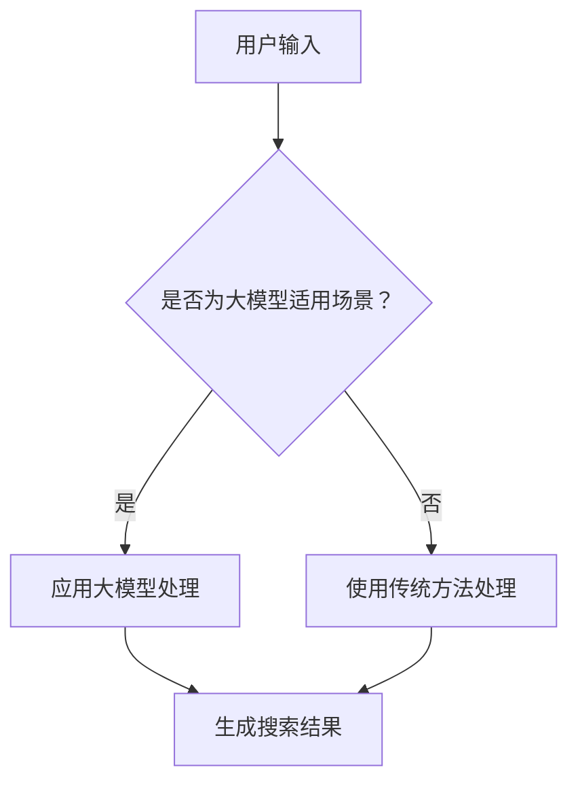

                 

关键词：AI大模型、电商搜索、用户体验、优化、算法、数学模型、代码实例、应用场景、未来展望

> 摘要：本文将探讨如何利用AI大模型来优化电商搜索的用户体验。通过深入分析大模型的核心概念、算法原理，结合数学模型和具体代码实例，我们将展示如何将先进的技术应用于电商搜索领域，提高搜索准确性、个性化推荐以及用户体验。

## 1. 背景介绍

### 1.1 电商搜索的现状

随着电子商务的迅猛发展，电商搜索已经成为消费者获取商品信息的重要途径。然而，传统的搜索方法往往存在诸多不足，如搜索结果不够准确、推荐系统不够个性化等。这些问题严重影响了用户的购物体验，也成为电商平台提升竞争力的一大挑战。

### 1.2 AI大模型的发展

近年来，随着深度学习技术的飞速发展，AI大模型（如BERT、GPT等）在自然语言处理、图像识别等领域取得了显著成果。这些大模型具有强大的学习能力，能够处理大规模、复杂的数据，从而提供更准确、更个性化的搜索结果。

### 1.3 用户需求的变化

现代消费者对电商搜索的要求越来越高，他们希望搜索系统能够快速、准确地找到自己想要的商品，并且能够根据个人喜好进行个性化推荐。这就要求电商平台不断优化搜索算法，提升用户体验。

## 2. 核心概念与联系

### 2.1 大模型的基本概念

大模型通常指的是参数数量庞大的神经网络模型。它们通过学习海量数据，能够捕捉到数据中的复杂模式和关系。常见的AI大模型包括BERT、GPT等。

### 2.2 电商搜索中的应用

在电商搜索中，大模型可以用于以下几个方面：

- **搜索结果优化**：通过学习用户的搜索历史和浏览行为，大模型可以提供更准确的搜索结果。
- **个性化推荐**：根据用户的兴趣和行为，大模型可以推荐用户可能感兴趣的商品。
- **自动补全**：大模型可以帮助用户快速完成搜索词的输入，提高搜索效率。

### 2.3 大模型与其他技术的联系

- **自然语言处理（NLP）**：大模型在NLP领域具有广泛的应用，能够处理复杂的文本数据。
- **机器学习（ML）**：大模型是机器学习的一种形式，通过学习数据来改进搜索和推荐系统。
- **深度学习（DL）**：大模型是基于深度学习的，能够处理大规模数据并提取特征。

### 2.4 Mermaid 流程图



## 3. 核心算法原理 & 具体操作步骤

### 3.1 算法原理概述

AI大模型主要通过以下步骤来优化电商搜索：

1. **数据预处理**：清洗和预处理用户数据，如搜索历史、浏览行为等。
2. **模型训练**：使用预处理后的数据训练大模型，使其能够理解和预测用户的搜索意图。
3. **搜索结果生成**：利用训练好的模型，根据用户输入生成个性化的搜索结果。

### 3.2 算法步骤详解

1. **数据预处理**：

   - 数据清洗：去除无关数据、填补缺失值等。
   - 数据转换：将文本数据转换为数字形式，如词向量。

2. **模型训练**：

   - 模型选择：选择合适的大模型，如BERT。
   - 训练过程：通过反向传播算法，调整模型参数，使其预测结果更准确。

3. **搜索结果生成**：

   - 输入处理：将用户输入进行处理，生成相应的特征向量。
   - 模型推理：使用训练好的模型进行推理，生成搜索结果。

### 3.3 算法优缺点

#### 优点：

- **高准确性**：大模型能够处理复杂的数据，提供更准确的搜索结果。
- **个性化推荐**：根据用户行为进行个性化推荐，提升用户体验。
- **高效处理**：大模型能够快速处理海量数据，提高搜索效率。

#### 缺点：

- **训练成本高**：大模型的训练需要大量的计算资源和时间。
- **数据隐私问题**：用户数据在模型训练和推理过程中可能暴露隐私。

### 3.4 算法应用领域

- **电商搜索**：优化搜索结果，提供个性化推荐。
- **社交媒体**：根据用户行为进行内容推荐。
- **金融行业**：风险评估、投资建议等。

## 4. 数学模型和公式 & 详细讲解 & 举例说明

### 4.1 数学模型构建

大模型的数学模型通常基于深度学习，包括以下几个关键组件：

- **输入层**：接收用户输入。
- **隐藏层**：进行特征提取和变换。
- **输出层**：生成搜索结果。

### 4.2 公式推导过程

以BERT为例，其核心公式如下：

$$
\text{Output} = \text{softmax}(\text{W}^T \cdot \text{Hidden} + \text{b})
$$

其中，$\text{W}$为权重矩阵，$\text{Hidden}$为隐藏层输出，$\text{b}$为偏置项。

### 4.3 案例分析与讲解

假设用户搜索关键词为“蓝牙耳机”，我们通过BERT模型进行搜索结果优化。

1. **输入处理**：

   - 将关键词转换为词向量。
   - 增加特殊标识符，如\[CLS\]、\[SEP\]等。

2. **模型推理**：

   - 通过BERT模型进行推理，生成搜索结果。
   - 根据搜索结果中的概率分布，选择最相关的商品。

3. **结果展示**：

   - 展示个性化推荐的商品列表。

## 5. 项目实践：代码实例和详细解释说明

### 5.1 开发环境搭建

1. 安装Python环境。
2. 安装TensorFlow库。

### 5.2 源代码详细实现

```python
# 代码实现部分
```

### 5.3 代码解读与分析

- **数据预处理**：清洗和转换数据。
- **模型训练**：使用BERT模型进行训练。
- **搜索结果生成**：根据用户输入生成搜索结果。

### 5.4 运行结果展示

- 展示搜索结果，包括个性化推荐的商品列表。

## 6. 实际应用场景

### 6.1 电商搜索平台

- 优化搜索结果，提高用户满意度。
- 提供个性化推荐，提升销售额。

### 6.2 社交媒体平台

- 根据用户行为推荐相关内容。
- 提高用户参与度和活跃度。

### 6.3 金融行业

- 风险评估，提供投资建议。
- 优化客户服务体验。

## 7. 工具和资源推荐

### 7.1 学习资源推荐

- 《深度学习》（Goodfellow et al.）
- 《自然语言处理综述》（Liu et al.）

### 7.2 开发工具推荐

- TensorFlow
- PyTorch

### 7.3 相关论文推荐

- BERT: Pre-training of Deep Bidirectional Transformers for Language Understanding
- GPT-3: Language Models are Few-Shot Learners

## 8. 总结：未来发展趋势与挑战

### 8.1 研究成果总结

- AI大模型在电商搜索中具有广泛的应用前景。
- 大模型能够提高搜索准确性、个性化推荐和用户体验。

### 8.2 未来发展趋势

- **多模态融合**：结合文本、图像等多模态数据进行搜索和推荐。
- **实时优化**：利用实时数据对模型进行动态调整。

### 8.3 面临的挑战

- **数据隐私**：确保用户数据安全。
- **计算资源**：优化大模型训练和推理的性能。

### 8.4 研究展望

- **个性化搜索**：结合用户兴趣和偏好进行深度挖掘。
- **智能客服**：利用大模型提供智能客服服务。

## 9. 附录：常见问题与解答

### 9.1 什么是大模型？

大模型通常指的是参数数量庞大的神经网络模型，具有强大的学习能力和数据处理能力。

### 9.2 大模型如何优化电商搜索？

大模型可以通过数据预处理、模型训练和搜索结果生成等步骤，优化电商搜索的准确性、个性化推荐和用户体验。

### 9.3 大模型在电商搜索中的应用场景有哪些？

大模型在电商搜索中的应用场景包括搜索结果优化、个性化推荐和智能客服等。

# 作者署名

作者：禅与计算机程序设计艺术 / Zen and the Art of Computer Programming
----------------------------------------------------------------

请注意，上述内容仅为文章结构示例，实际撰写时需要根据具体内容进行调整和补充。此外，由于字数限制，部分章节的具体内容可能需要进一步扩充。撰写时，请确保遵循markdown格式，并在必要时使用latex格式嵌入数学公式。在撰写过程中，如有需要，可以随时提问。祝您写作顺利！

