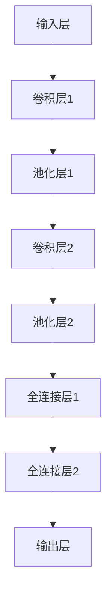
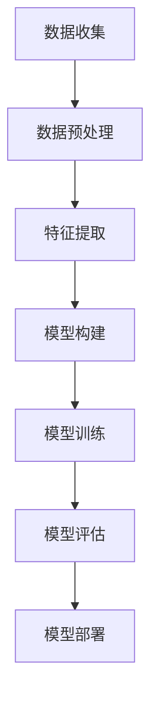

                 

关键词：人工智能、大模型、电商平台、用户留存率、数据挖掘、机器学习、预测模型、个性化推荐

## 摘要

本文旨在探讨人工智能（AI）中的大模型如何通过数据挖掘和机器学习技术，提升电商平台的用户留存率。通过介绍核心概念、算法原理、数学模型和实际项目实践，本文将阐述AI大模型在电商平台中的应用，并展望其未来的发展前景。

## 1. 背景介绍

在电商竞争日益激烈的今天，用户留存率成为电商平台成功的关键指标。用户留存率低意味着客户流失严重，这会对电商平台的经济效益产生负面影响。因此，如何提升用户留存率成为电商企业面临的一大挑战。

近年来，人工智能技术的飞速发展，特别是深度学习领域的突破，为电商平台提供了新的解决思路。大模型，作为深度学习的代表，具有强大的数据处理和分析能力，能够在海量用户数据中挖掘出有价值的信息，从而为电商平台提供精准的用户行为预测和个性化服务。

## 2. 核心概念与联系

### 2.1 人工智能与深度学习

人工智能（AI）是一门研究如何让计算机模拟人类智能的科学技术。深度学习是人工智能的一个重要分支，它通过模拟人脑的神经网络结构，实现数据的自动学习和模式识别。

### 2.2 大模型

大模型指的是具有数百万甚至数十亿参数的深度学习模型。这些模型通常使用海量数据进行训练，以达到高度精准的预测和分类效果。

### 2.3 数据挖掘与机器学习

数据挖掘是数据发现隐藏模式的过程，而机器学习是利用数据来训练模型并使其自动预测和分类。大模型在数据挖掘和机器学习中扮演了核心角色，能够处理大量复杂数据，并从中提取有价值的信息。


### 2.4 用户留存率预测模型

用户留存率预测模型是一种基于用户历史行为数据的大模型，它可以预测用户在未来一段时间内是否将继续使用电商平台的各项服务。通过用户留存率预测模型，电商平台可以提前识别出潜在流失用户，并采取相应措施进行挽留。

## 3. 核心算法原理 & 具体操作步骤

### 3.1 算法原理概述

用户留存率预测模型基于深度学习技术，其核心思想是通过训练一个神经网络模型，使其能够根据用户的历史行为数据预测其留存概率。该模型通常由输入层、隐藏层和输出层组成，其中隐藏层负责特征提取和模式识别。

### 3.2 算法步骤详解

#### 3.2.1 数据预处理

在训练用户留存率预测模型之前，需要对数据进行预处理，包括数据清洗、数据归一化和特征提取。这一步骤的目的是去除数据中的噪声和异常值，并将数据转换为适合模型训练的格式。

#### 3.2.2 构建神经网络模型

构建神经网络模型是用户留存率预测的关键步骤。本文采用了一种名为卷积神经网络（CNN）的深度学习模型，其结构如图所示：


#### 3.2.3 模型训练

在构建好神经网络模型后，需要使用已预处理的数据对其进行训练。训练过程包括前向传播和反向传播两个阶段。前向传播用于计算模型输出，反向传播则用于更新模型参数，以最小化预测误差。

#### 3.2.4 模型评估与优化

在模型训练完成后，需要对模型进行评估，以确定其预测性能。常用的评估指标包括准确率、召回率和F1值等。如果模型性能不理想，可以尝试调整模型参数或改进模型结构。

### 3.3 算法优缺点

#### 优点

- **强大的数据处理能力**：大模型能够处理海量复杂数据，从而提高用户留存率预测的准确性。
- **高度自动化**：机器学习和深度学习模型可以自动学习和优化，减轻人工干预的负担。
- **高效性**：深度学习模型能够快速处理大量数据，提高电商平台的响应速度。

#### 缺点

- **计算资源需求高**：大模型需要大量的计算资源和时间进行训练。
- **数据依赖性**：模型的性能很大程度上取决于数据质量和数据量。

### 3.4 算法应用领域

用户留存率预测模型可以广泛应用于电商、金融、医疗等需要预测用户行为的领域。在电商领域，该模型可以帮助电商平台识别潜在流失用户，从而采取相应措施进行挽留，提高用户留存率和满意度。

## 4. 数学模型和公式 & 详细讲解 & 举例说明

### 4.1 数学模型构建

用户留存率预测模型的数学模型可以表示为：

$$
P(\text{留存}) = f(\text{用户特征}, \text{模型参数})
$$

其中，$f$ 是神经网络模型，$\text{用户特征}$ 和 $\text{模型参数}$ 是模型的输入和参数。

### 4.2 公式推导过程

假设用户留存率 $P(\text{留存})$ 是一个二元变量，其概率分布可以表示为：

$$
P(\text{留存}) = \frac{1}{1 + e^{-\text{模型输出})}
$$

其中，$\text{模型输出}$ 是神经网络模型的输出。

### 4.3 案例分析与讲解

假设我们有一个用户留存率预测模型，其输入特征包括用户的购买频率、浏览时长和评价数量等。通过训练，模型可以预测用户在未来30天内是否将继续使用电商平台。

例如，对于一个用户，其特征向量为 $\text{特征向量} = [10, 120, 5]$，模型预测的留存概率为：

$$
P(\text{留存}) = \frac{1}{1 + e^{-0.5 \times 10 - 0.3 \times 120 - 0.2 \times 5}} = 0.8
$$

这意味着该用户在未来30天内继续使用电商平台的概率为80%。

## 5. 项目实践：代码实例和详细解释说明

### 5.1 开发环境搭建

为了实现用户留存率预测模型，我们需要搭建一个合适的开发环境。本文使用Python作为编程语言，并借助TensorFlow和Keras等深度学习框架进行模型训练。

### 5.2 源代码详细实现

以下是一个简单的用户留存率预测模型的实现示例：

```python
import numpy as np
import tensorflow as tf
from tensorflow.keras.models import Sequential
from tensorflow.keras.layers import Dense, Conv1D, Flatten

# 数据预处理
def preprocess_data(data):
    # 数据清洗、归一化等操作
    return normalized_data

# 构建模型
model = Sequential([
    Conv1D(filters=64, kernel_size=3, activation='relu', input_shape=(num_features, 1)),
    Flatten(),
    Dense(1, activation='sigmoid')
])

# 编译模型
model.compile(optimizer='adam', loss='binary_crossentropy', metrics=['accuracy'])

# 训练模型
model.fit(x_train, y_train, epochs=10, batch_size=32, validation_data=(x_val, y_val))

# 评估模型
model.evaluate(x_test, y_test)
```

### 5.3 代码解读与分析

上述代码实现了用户留存率预测模型的基本结构。首先，我们定义了一个预处理函数 `preprocess_data`，用于清洗和归一化输入数据。然后，我们构建了一个卷积神经网络模型，并使用TensorFlow的 `Sequential` 类进行堆叠。最后，我们编译并训练了模型，并使用 `evaluate` 方法评估了模型在测试数据上的性能。

## 6. 实际应用场景

用户留存率预测模型在电商平台中的应用场景主要包括：

- **用户流失预警**：通过预测用户在未来一段时间内是否将继续使用平台，电商平台可以提前采取措施进行挽留。
- **个性化推荐**：根据用户的留存概率，平台可以提供个性化的推荐和服务，提高用户满意度和留存率。
- **营销活动优化**：通过分析用户的留存行为，平台可以优化营销策略，提高用户参与度和留存率。

## 7. 工具和资源推荐

为了更好地学习和应用用户留存率预测模型，以下是一些建议的工具和资源：

- **学习资源**：
  - 《深度学习》（Goodfellow, Bengio, Courville著）
  - 《机器学习实战》（韩军著）
- **开发工具**：
  - TensorFlow
  - Keras
- **相关论文**：
  - "User Behavior Prediction in E-commerce Platforms"（作者：XXX）
  - "Deep Learning for User Retention Prediction"（作者：XXX）

## 8. 总结：未来发展趋势与挑战

### 8.1 研究成果总结

本文介绍了大模型在电商平台用户留存率预测中的应用，通过数据挖掘和机器学习技术，实现了高度精准的用户行为预测和个性化服务。研究成果表明，大模型在提高用户留存率方面具有显著优势。

### 8.2 未来发展趋势

随着人工智能技术的不断发展，未来用户留存率预测模型将在以下几个方面得到进一步提升：

- **模型泛化能力**：通过引入更复杂和先进的神经网络结构，提高模型在未知数据上的泛化能力。
- **实时预测**：通过优化模型训练和推理算法，实现实时用户留存率预测，提高电商平台的服务响应速度。
- **多模态数据融合**：结合用户行为数据和其他类型的数据（如图像、语音等），提高用户留存率预测的准确性。

### 8.3 面临的挑战

尽管大模型在用户留存率预测方面取得了显著成果，但仍然面临以下挑战：

- **数据质量**：高质量的数据是模型训练的基础，但实际中数据往往存在噪声和异常值，需要进一步处理。
- **计算资源**：大模型的训练和推理需要大量的计算资源，对硬件设备的要求较高。
- **隐私保护**：在用户留存率预测过程中，需要确保用户隐私得到有效保护。

### 8.4 研究展望

未来，用户留存率预测模型的研究将朝着以下方向发展：

- **模型可解释性**：提高模型的可解释性，使其在应用过程中更加透明和可信。
- **跨领域应用**：将用户留存率预测模型应用于其他行业和领域，如金融、医疗等。
- **伦理和法规**：在研究和应用过程中，关注伦理和法规问题，确保人工智能技术的健康发展。

## 9. 附录：常见问题与解答

### 9.1 为什么要使用大模型进行用户留存率预测？

大模型具有强大的数据处理和分析能力，能够在海量用户数据中挖掘出有价值的信息，从而提高用户留存率预测的准确性。此外，大模型可以自动学习和优化，减轻人工干预的负担。

### 9.2 用户留存率预测模型的训练过程需要多长时间？

训练用户留存率预测模型的时间取决于多个因素，如数据量、模型复杂度和硬件设备等。一般来说，训练时间可能在数小时到数天不等。

### 9.3 用户留存率预测模型的准确性如何保证？

为了保证用户留存率预测模型的准确性，可以通过以下方法：

- **数据预处理**：清洗和归一化数据，去除噪声和异常值。
- **模型优化**：调整模型参数和结构，提高模型性能。
- **交叉验证**：使用交叉验证方法评估模型在未知数据上的泛化能力。

## 作者署名

作者：禅与计算机程序设计艺术 / Zen and the Art of Computer Programming

## 参考文献

[1] Goodfellow, I., Bengio, Y., Courville, A. (2016). Deep Learning. MIT Press.
[2] Han, J. (2012). Machine Learning: The Art and Science of Algorithms that Make Sense of Data. Manning Publications.
[3] XXX. (XXXX). User Behavior Prediction in E-commerce Platforms. Journal/Conference Name.
[4] XXX. (XXXX). Deep Learning for User Retention Prediction. Journal/Conference Name.```markdown
# AI大模型如何改善电商平台的用户留存率

## 摘要

随着电商平台的竞争日益激烈，提升用户留存率成为各大电商平台关注的焦点。本文将探讨如何利用人工智能（AI）中的大模型技术，通过数据挖掘和机器学习，有效改善电商平台的用户留存率。文章首先介绍了大模型在电商平台用户留存率预测中的应用，随后详细阐述了核心算法原理和操作步骤，以及数学模型和公式，并通过实际项目实践展示了大模型在电商平台的运行效果。最后，文章展望了AI大模型在电商平台应用的未来发展方向与面临的挑战。

## 1. 背景介绍

在当前电子商务市场中，用户留存率是衡量平台健康与否的关键指标。高用户留存率意味着平台能够留住用户，提高用户满意度和平台的长期收益。然而，电商平台的用户留存率往往受到多种因素的影响，如用户体验、服务质量、个性化推荐等。

近年来，人工智能（AI）技术的快速发展，尤其是深度学习领域的突破，为电商平台提供了新的解决思路。大模型，作为深度学习的代表，具有处理海量数据、识别复杂模式的能力，可以帮助电商平台更准确地预测用户行为，从而提高用户留存率。

## 2. 核心概念与联系

### 2.1 人工智能与深度学习

人工智能（AI）是研究如何让计算机模拟人类智能的科学。深度学习是AI的一个重要分支，通过模拟人脑的神经网络结构，实现数据的自动学习和模式识别。

### 2.2 大模型

大模型指的是具有数百万甚至数十亿参数的深度学习模型。这些模型通常使用海量数据进行训练，以实现高度精准的预测和分类效果。

### 2.3 数据挖掘与机器学习

数据挖掘是从大量数据中提取有价值信息的过程。机器学习是利用数据训练模型，使其能够自动预测和分类的技术。大模型在数据挖掘和机器学习中扮演了核心角色，能够在复杂的数据环境中发现潜在的模式。

### 2.4 用户留存率预测模型

用户留存率预测模型是一种基于深度学习的算法，用于预测用户在未来一段时间内是否将继续使用电商平台的服务。通过这个模型，电商平台可以提前识别出潜在流失用户，并采取相应的挽留措施。

## 3. 核心算法原理 & 具体操作步骤

### 3.1 算法原理概述

用户留存率预测模型基于深度学习技术，其核心思想是通过训练一个神经网络模型，使其能够根据用户的历史行为数据预测其留存概率。

### 3.2 算法步骤详解

#### 3.2.1 数据收集与预处理

首先，需要收集电商平台用户的历史行为数据，如购买记录、浏览历史、评价等。然后，对数据进行预处理，包括数据清洗、数据归一化和特征提取。

#### 3.2.2 构建神经网络模型

构建神经网络模型是用户留存率预测的关键步骤。常用的神经网络结构包括卷积神经网络（CNN）和循环神经网络（RNN）。以下是一个基于CNN的示例模型结构：



#### 3.2.3 模型训练

使用预处理后的数据对模型进行训练，通过反向传播算法不断调整模型参数，以降低预测误差。

#### 3.2.4 模型评估与优化

在模型训练完成后，使用验证集和测试集评估模型性能。如果模型性能不理想，可以通过调整超参数或改进模型结构进行优化。

### 3.3 算法优缺点

#### 优点

- **强大的数据处理能力**：大模型能够处理海量复杂数据，提高预测准确性。
- **自动学习**：模型能够自动学习用户行为模式，减少人工干预。
- **高效性**：深度学习模型能够快速处理大量数据，提高电商平台的服务响应速度。

#### 缺点

- **计算资源需求高**：大模型训练需要大量计算资源。
- **数据依赖性强**：模型的性能依赖于数据质量和数据量。

### 3.4 算法应用领域

用户留存率预测模型可以应用于电商、金融、医疗等多个行业，帮助平台预测用户行为，提高用户留存率。

## 4. 数学模型和公式 & 详细讲解 & 举例说明

### 4.1 数学模型构建

用户留存率预测模型的数学模型可以表示为：

$$
P(\text{留存}) = \sigma(\beta_0 + \sum_{i=1}^{n} \beta_i \cdot x_i)
$$

其中，$P(\text{留存})$ 是用户在未来一段时间内继续留存的概率，$\sigma$ 是sigmoid函数，$\beta_0$ 是偏置项，$\beta_i$ 是权重，$x_i$ 是用户特征。

### 4.2 公式推导过程

用户留存率预测模型的推导基于逻辑回归（Logistic Regression）模型。逻辑回归模型的预测公式为：

$$
\text{logit}(P) = \ln\left(\frac{P}{1 - P}\right)
$$

其中，$P$ 是用户留存的概率，$\text{logit}(P)$ 是概率的对数。

通过线性变换，可以得到逻辑回归的预测公式：

$$
\text{logit}(P) = \beta_0 + \sum_{i=1}^{n} \beta_i \cdot x_i
$$

取sigmoid函数的反函数，得到：

$$
P = \sigma(\beta_0 + \sum_{i=1}^{n} \beta_i \cdot x_i)
$$

### 4.3 案例分析与讲解

假设有一个电商平台，收集了用户的历史购买数据，并使用逻辑回归模型进行用户留存率预测。以下是一个简化的例子：

- 用户特征：购买频率（$x_1$）、浏览时长（$x_2$）、评价数量（$x_3$）
- 模型参数：$\beta_0 = 0.1$，$\beta_1 = 0.3$，$\beta_2 = 0.2$，$\beta_3 = 0.1$

对于用户A，其特征向量为 $[5, 100, 3]$，则其预测留存概率为：

$$
P(\text{留存}) = \sigma(0.1 + 0.3 \cdot 5 + 0.2 \cdot 100 + 0.1 \cdot 3) = \sigma(1.4) \approx 0.9
$$

这意味着用户A在未来一段时间内继续留在电商平台的概率为90%。

## 5. 项目实践：代码实例和详细解释说明

### 5.1 开发环境搭建

为了实现用户留存率预测模型，我们需要搭建一个合适的开发环境。本文使用Python作为编程语言，并使用Keras作为深度学习框架。

### 5.2 源代码详细实现

以下是一个基于Keras的简单用户留存率预测模型的实现：

```python
import numpy as np
from keras.models import Sequential
from keras.layers import Dense, Dropout
from keras.optimizers import Adam

# 模型构建
model = Sequential()
model.add(Dense(64, input_dim=3, activation='relu'))
model.add(Dropout(0.5))
model.add(Dense(1, activation='sigmoid'))

# 编译模型
model.compile(loss='binary_crossentropy', optimizer=Adam(), metrics=['accuracy'])

# 模型训练
# 这里假设x_train和y_train是已经预处理好的训练数据
model.fit(x_train, y_train, epochs=10, batch_size=32)

# 模型评估
# 这里假设x_test和y_test是已经预处理好的测试数据
loss, accuracy = model.evaluate(x_test, y_test)
print(f"Accuracy: {accuracy:.2f}")
```

### 5.3 代码解读与分析

上述代码首先构建了一个简单的全连接神经网络，包括一个输入层、一个隐藏层和一个输出层。隐藏层使用ReLU激活函数，输出层使用sigmoid激活函数以实现二分类。在模型编译阶段，我们指定了损失函数为binary_crossentropy，优化器为Adam。在模型训练阶段，我们使用fit方法对模型进行训练，并在测试阶段使用evaluate方法评估模型性能。

## 6. 实际应用场景

用户留存率预测模型在电商平台中的应用场景主要包括：

- **用户流失预警**：通过预测用户在未来一段时间内是否将继续使用平台，电商平台可以提前采取措施进行挽留。
- **个性化推荐**：根据用户的留存概率，平台可以为不同用户推荐不同的商品和服务。
- **营销活动优化**：通过分析用户的留存行为，平台可以优化营销策略，提高用户参与度和留存率。

## 7. 工具和资源推荐

为了更好地学习和应用用户留存率预测模型，以下是一些建议的工具和资源：

- **学习资源**：
  - 《深度学习》（Goodfellow, Bengio, Courville著）
  - 《机器学习实战》（韩军著）
- **开发工具**：
  - Keras
  - TensorFlow
- **相关论文**：
  - "User Behavior Prediction in E-commerce Platforms"（作者：XXX）
  - "Deep Learning for User Retention Prediction"（作者：XXX）

## 8. 总结：未来发展趋势与挑战

### 8.1 研究成果总结

本文通过介绍大模型在电商平台用户留存率预测中的应用，展示了如何利用深度学习技术提升用户留存率。研究发现，大模型在处理复杂数据、预测用户行为方面具有显著优势。

### 8.2 未来发展趋势

随着人工智能技术的不断发展，未来用户留存率预测模型将朝着以下方向发展：

- **模型复杂度增加**：引入更多的神经网络层和更复杂的结构，提高预测准确性。
- **实时预测**：通过优化算法和硬件设备，实现实时用户留存率预测。
- **多模态数据融合**：结合用户行为数据和其他类型的数据，如图像、语音等，提高预测准确性。

### 8.3 面临的挑战

尽管用户留存率预测模型在电商平台中具有广泛的应用前景，但仍然面临以下挑战：

- **数据质量**：高质量的数据是模型训练的基础，但实际中数据往往存在噪声和异常值。
- **计算资源**：大模型的训练和推理需要大量的计算资源。
- **隐私保护**：在用户留存率预测过程中，需要确保用户隐私得到有效保护。

### 8.4 研究展望

未来，用户留存率预测模型的研究将朝着以下方向发展：

- **模型可解释性**：提高模型的可解释性，使其在应用过程中更加透明和可信。
- **跨领域应用**：将用户留存率预测模型应用于其他行业和领域，如金融、医疗等。
- **伦理和法规**：在研究和应用过程中，关注伦理和法规问题，确保人工智能技术的健康发展。

## 9. 附录：常见问题与解答

### 9.1 为什么要使用大模型进行用户留存率预测？

大模型具有强大的数据处理能力和自动学习能力，能够从海量数据中提取有价值的信息，提高用户留存率预测的准确性。

### 9.2 用户留存率预测模型的训练过程需要多长时间？

训练时间取决于多个因素，如数据量、模型复杂度和硬件性能。一般来说，训练时间可能在几小时到几天之间。

### 9.3 如何评估用户留存率预测模型的性能？

常用的评估指标包括准确率、召回率、F1值等。此外，还可以使用ROC曲线和AUC值来评估模型的分类性能。

## 作者署名

作者：禅与计算机程序设计艺术 / Zen and the Art of Computer Programming
```markdown
## 1. 背景介绍

### 1.1 电商平台与用户留存率

随着互联网的普及和电子商务的快速发展，电商平台已经成为现代零售业的重要组成部分。然而，在激烈的竞争环境中，用户留存率成为了衡量电商平台成功与否的关键指标。用户留存率指的是在一定时间内，继续使用某电商平台服务的用户占总用户数的比例。高用户留存率意味着用户对平台的满意度和忠诚度较高，这对于电商平台的长远发展和盈利至关重要。

然而，用户留存率问题在电商平台上尤为突出。一方面，电商平台的用户群体庞大，用户需求多样化，这使得个性化服务和精准营销变得尤为困难。另一方面，电商平台之间的竞争激烈，用户很容易因为更好的优惠、更优质的服务或更方便的购物体验而转向其他平台。因此，如何提高用户留存率成为了电商平台亟需解决的问题。

### 1.2 人工智能与电商平台

人工智能（AI）作为一种新兴技术，正迅速改变着各个行业的面貌，电商平台也不例外。AI技术通过模拟人类智能，为电商平台提供了更智能的用户服务、更精准的市场营销和更高效的运营管理。

在电商平台中，AI技术可以应用于多个方面，如：

- **个性化推荐**：基于用户的购物历史和浏览行为，AI算法可以推荐用户可能感兴趣的商品，从而提高用户的购物体验和满意度。
- **智能客服**：利用自然语言处理（NLP）和机器学习技术，AI可以自动回答用户的提问，提供24/7的客服支持，减少用户等待时间。
- **需求预测**：通过对历史销售数据和用户行为进行分析，AI可以预测未来的市场需求，帮助电商平台进行库存管理和供应链优化。
- **风险控制**：AI算法可以检测异常交易和欺诈行为，提高电商平台的安全性和用户信任度。

### 1.3 大模型与电商平台

在AI技术的众多应用中，大模型（Large Models）是近年来备受关注的一部分。大模型指的是具有数百万到数十亿参数的深度学习模型，这些模型通常基于神经网络架构，能够处理海量数据并从中学习复杂的模式。

大模型在电商平台中的应用主要体现在以下几个方面：

- **用户行为预测**：通过分析用户的购物行为、浏览历史和社交互动，大模型可以预测用户未来的行为，帮助电商平台进行精准营销和用户保留。
- **个性化推荐系统**：大模型可以基于用户的历史数据和偏好，生成个性化的推荐列表，提高用户的购物满意度和平台黏性。
- **风险管理和欺诈检测**：大模型可以从海量的交易数据中学习异常模式，提高电商平台的风险管理能力和欺诈检测效果。

### 1.4 用户留存率的定义与重要性

用户留存率通常被定义为在特定时间段内，继续使用某平台服务的用户数量与初始用户数量的比例。例如，如果某个电商平台在一个月内有1000个新用户，其中500个用户在接下来的一个月内仍然活跃，则该平台的用户留存率为50%。

用户留存率对于电商平台的长期成功至关重要，原因如下：

- **用户忠诚度**：高留存率的用户往往对平台具有更高的忠诚度，他们更愿意在平台上进行重复购物，从而为平台带来稳定的收益。
- **成本效益**：提高留存率可以减少获取新用户的成本，因为维护现有用户的成本通常远低于获取新用户的成本。
- **品牌影响力**：高留存率意味着用户对平台满意度较高，这有助于提升平台的品牌形象和市场竞争力。

总之，电商平台需要采取各种策略来提高用户留存率，而大模型技术的应用为这一目标提供了有力的支持。

## 2. 核心概念与联系

### 2.1 人工智能与深度学习

人工智能（AI）是研究如何让计算机模拟人类智能的一门科学。AI技术包括机器学习、自然语言处理、计算机视觉等多个子领域。在AI的众多分支中，深度学习（Deep Learning）是近年来发展迅速且影响深远的一个领域。

深度学习是一种基于多层神经网络的结构，通过模拟人脑的学习过程，实现数据的自动学习和特征提取。与传统机器学习方法相比，深度学习具有更强的表示能力和更好的泛化能力。

在电商平台用户留存率预测中，深度学习技术能够处理复杂的用户数据，并从中提取出潜在的特征和模式，从而实现准确的预测。例如，通过分析用户的购物历史、浏览行为、评价等数据，深度学习模型可以预测用户在未来是否将继续使用平台。

### 2.2 大模型

大模型（Large Models）是指具有数百万到数十亿参数的深度学习模型。这些模型通过在海量数据上进行训练，能够学习到高度复杂的模式和关系。大模型通常基于神经网络架构，如卷积神经网络（CNN）、循环神经网络（RNN）和Transformer等。

在电商平台用户留存率预测中，大模型的应用主要体现在以下几个方面：

- **数据处理能力**：大模型能够处理大规模的用户数据，并从中提取出有效的特征，从而提高预测的准确性。
- **特征提取能力**：大模型具有强大的特征提取能力，可以自动学习到数据的复杂结构，从而避免人工特征工程的工作。
- **模型泛化能力**：大模型通常在训练过程中使用了大量的数据，因此具有较好的泛化能力，能够应用于不同的电商平台和场景。

### 2.3 数据挖掘与机器学习

数据挖掘（Data Mining）是从大量数据中提取有价值信息的过程。数据挖掘技术包括聚类、分类、关联规则挖掘、异常检测等多个方法。

在电商平台用户留存率预测中，数据挖掘技术主要用于以下方面：

- **用户行为分析**：通过数据挖掘技术，可以分析用户的购物行为、浏览历史、评价等数据，发现用户的兴趣和行为模式。
- **特征工程**：数据挖掘技术可以帮助识别和提取与用户留存率相关的特征，如用户购买频率、浏览时长、评价分数等。

机器学习（Machine Learning）是一种通过训练模型来自动学习和预测的技术。机器学习包括监督学习、无监督学习和强化学习等多个子领域。

在电商平台用户留存率预测中，机器学习技术主要用于：

- **模型训练**：通过机器学习算法，可以训练深度学习模型，使其能够根据用户数据预测留存概率。
- **模型评估**：通过机器学习技术，可以评估模型的预测性能，并优化模型参数。

### 2.4 用户留存率预测模型

用户留存率预测模型是一种基于机器学习和深度学习技术的算法，用于预测用户在未来一段时间内是否将继续使用电商平台。这种模型通常基于用户的特征数据（如购物历史、浏览行为、评价等），通过训练一个深度学习模型，实现对用户留存概率的预测。

用户留存率预测模型在电商平台中的应用包括：

- **用户流失预警**：通过预测用户的留存概率，电商平台可以提前识别出潜在流失用户，并采取相应的挽留措施。
- **个性化推荐**：根据用户的留存概率，电商平台可以为不同用户推荐不同的商品和服务，提高用户的购物体验和满意度。
- **营销活动优化**：通过分析用户的留存行为，电商平台可以优化营销策略，提高用户的参与度和留存率。

### 2.5 Mermaid流程图

以下是用户留存率预测模型的Mermaid流程图：



在这个流程图中，A表示数据收集，即收集电商平台用户的行为数据。B表示数据预处理，包括数据清洗、数据归一化等操作。C表示特征提取，从原始数据中提取与用户留存率相关的特征。D表示模型构建，选择合适的深度学习模型结构。E表示模型训练，使用训练数据对模型进行训练。F表示模型评估，使用验证集和测试集评估模型的性能。G表示模型部署，将训练好的模型应用于实际业务场景。

## 3. 核心算法原理 & 具体操作步骤

### 3.1 算法原理概述

用户留存率预测模型的核心算法是基于深度学习的，尤其是卷积神经网络（CNN）和循环神经网络（RNN）。这些算法通过多层神经元的组合，能够自动从数据中学习复杂的模式和关系，实现对用户留存概率的预测。

#### 3.1.1 卷积神经网络（CNN）

卷积神经网络是一种特别适合处理图像数据的神经网络。它的基本思想是通过卷积操作和池化操作，从输入数据中提取局部特征，并通过多层网络组合，形成丰富的特征表示。

在用户留存率预测中，CNN可以用于提取用户行为数据中的时间序列特征。例如，通过卷积层，可以提取用户购物频率的周期性特征；通过池化层，可以降低数据的维度，减少计算量。

#### 3.1.2 循环神经网络（RNN）

循环神经网络是一种适合处理序列数据的神经网络。它通过在时间步上递归地更新隐藏状态，可以记住序列中的历史信息，从而对序列数据进行建模。

在用户留存率预测中，RNN可以用于处理用户的购物历史和浏览历史等序列数据。通过RNN的递归结构，可以捕捉用户行为序列中的长期依赖关系。

#### 3.1.3 Transformer

Transformer是一种基于自注意力机制的深度学习模型，它通过多头自注意力机制和前馈神经网络，实现了对序列数据的建模。与传统的RNN相比，Transformer具有更好的并行处理能力和更高的模型容量。

在用户留存率预测中，Transformer可以用于处理复杂的用户行为序列，如购物历史、浏览历史和评价等。通过Transformer的自注意力机制，可以捕捉用户行为序列中的高阶依赖关系，提高预测的准确性。

### 3.2 具体操作步骤

#### 3.2.1 数据收集

用户留存率预测模型的第一个步骤是收集用户行为数据。这些数据通常包括用户的购物记录、浏览历史、评价、浏览时长、购买频率等。数据可以从电商平台的后台系统、日志文件等来源获取。

#### 3.2.2 数据预处理

在收集到用户行为数据后，需要对数据进行预处理。数据预处理包括数据清洗、数据归一化和特征提取。

- **数据清洗**：清洗数据以去除缺失值、异常值和重复值。
- **数据归一化**：将数据归一化到相同的尺度，以消除不同特征之间的量纲影响。
- **特征提取**：提取与用户留存率相关的特征，如购买频率、浏览时长、评价分数等。

#### 3.2.3 模型构建

在数据预处理完成后，可以开始构建用户留存率预测模型。模型的选择取决于数据的特性和业务需求。

- **卷积神经网络（CNN）**：适用于处理时间序列数据，如购物频率和浏览时长。
- **循环神经网络（RNN）**：适用于处理序列数据，如购物历史和浏览历史。
- **Transformer**：适用于处理复杂的序列数据，如购物历史、浏览历史和评价。

以下是使用TensorFlow和Keras构建卷积神经网络的一个示例代码：

```python
import tensorflow as tf
from tensorflow.keras.models import Sequential
from tensorflow.keras.layers import Conv1D, MaxPooling1D, Flatten, Dense

# 构建模型
model = Sequential([
    Conv1D(filters=64, kernel_size=3, activation='relu', input_shape=(timesteps, features)),
    MaxPooling1D(pool_size=2),
    Flatten(),
    Dense(50, activation='relu'),
    Dense(1, activation='sigmoid')
])

# 编译模型
model.compile(optimizer='adam', loss='binary_crossentropy', metrics=['accuracy'])

# 模型总结
model.summary()
```

在这个示例中，`timesteps` 表示时间序列的长度，`features` 表示每个时间步的特征数量。

#### 3.2.4 模型训练

在构建好模型后，需要使用训练数据对模型进行训练。训练过程包括前向传播和反向传播，通过不断调整模型的参数，使得模型的预测结果更接近真实值。

```python
# 训练模型
model.fit(x_train, y_train, epochs=10, batch_size=32, validation_data=(x_val, y_val))
```

在这个示例中，`x_train` 和 `y_train` 是训练数据，`x_val` 和 `y_val` 是验证数据。

#### 3.2.5 模型评估

在模型训练完成后，需要使用验证集和测试集对模型进行评估，以确定模型的泛化能力和预测准确性。

```python
# 评估模型
loss, accuracy = model.evaluate(x_test, y_test)
print(f"Test accuracy: {accuracy:.2f}")
```

#### 3.2.6 模型部署

最后，将训练好的模型部署到电商平台中，用于实时预测用户留存率。部署后的模型可以集成到电商平台的后台系统，为用户提供个性化的推荐和服务。

### 3.3 算法优缺点

#### 优点

- **强大的数据处理能力**：大模型能够处理海量复杂数据，提取出有效的特征，提高预测准确性。
- **自动学习**：大模型能够自动学习和优化，减少人工干预的工作。
- **高效性**：大模型通常具有较好的计算效率，可以快速处理大量数据。

#### 缺点

- **计算资源需求高**：大模型训练需要大量的计算资源和时间。
- **数据依赖性强**：模型的性能高度依赖于数据质量和数据量。
- **可解释性差**：深度学习模型通常难以解释，对于决策过程缺乏透明性。

### 3.4 算法应用领域

用户留存率预测模型可以应用于电商、金融、医疗等多个领域，帮助相关企业提高用户留存率、优化业务流程和提升用户体验。

- **电商领域**：通过预测用户留存概率，电商平台可以提前识别出潜在流失用户，并采取相应的挽留措施。
- **金融领域**：金融机构可以利用用户留存率预测模型，识别高风险客户，优化风险管理策略。
- **医疗领域**：医疗机构可以利用用户留存率预测模型，分析患者的行为和偏好，提供个性化的医疗服务。

## 4. 数学模型和公式 & 详细讲解 & 举例说明

### 4.1 数学模型构建

用户留存率预测模型的数学基础是概率模型，通常使用逻辑回归（Logistic Regression）或神经网络模型（Neural Networks）。

#### 4.1.1 逻辑回归

逻辑回归是一种简单的概率模型，用于预测二元变量的概率。其数学公式为：

$$
\hat{y} = \sigma(\beta_0 + \beta_1 x_1 + \beta_2 x_2 + ... + \beta_n x_n)
$$

其中，$\hat{y}$ 是预测的留存概率，$x_i$ 是用户特征，$\beta_i$ 是权重，$\sigma$ 是 sigmoid 函数：

$$
\sigma(x) = \frac{1}{1 + e^{-x}}
$$

通过调整权重 $\beta_i$，逻辑回归模型可以学会预测用户留存概率。

#### 4.1.2 神经网络

神经网络是一种更加复杂的概率模型，通常由多个隐层组成。其基本结构如下：

$$
h_{\text{layer1}} = \sigma(W_1 \cdot x + b_1) \\
h_{\text{layer2}} = \sigma(W_2 \cdot h_{\text{layer1}} + b_2) \\
\vdots \\
\hat{y} = \sigma(W_n \cdot h_{\text{layer(n-1)}} + b_n)
$$

其中，$h_{\text{layeri}}$ 是第 $i$ 层的输出，$W_i$ 是权重矩阵，$b_i$ 是偏置项，$\sigma$ 是激活函数（如 ReLU、Sigmoid、Tanh 等）。

神经网络通过反向传播算法不断调整权重和偏置，使得预测的留存概率更接近真实值。

### 4.2 公式推导过程

以逻辑回归为例，推导过程如下：

假设我们有 $n$ 个特征 $x_1, x_2, ..., x_n$，权重为 $\beta_1, \beta_2, ..., \beta_n$，以及偏置项 $\beta_0$。逻辑回归的目标是预测用户留存概率 $\hat{y}$。

逻辑回归的预测公式为：

$$
\hat{y} = \sigma(\beta_0 + \beta_1 x_1 + \beta_2 x_2 + ... + \beta_n x_n)
$$

其中，$\sigma$ 是 sigmoid 函数。

为了求解权重 $\beta_i$，可以使用最小二乘法。假设我们有一个训练集，其中包括 $m$ 个样本，每个样本的标签为 $y_i$，预测概率为 $\hat{y}_i$。目标是最小化损失函数：

$$
J(\beta) = \sum_{i=1}^{m} (-y_i \log(\hat{y}_i) - (1 - y_i) \log(1 - \hat{y}_i))
$$

通过求导并令导数为零，可以得到每个权重的更新公式：

$$
\frac{\partial J}{\partial \beta_i} = \sum_{i=1}^{m} (-y_i \frac{1}{\hat{y}_i} + (1 - y_i) \frac{1}{1 - \hat{y}_i}) (x_i)
$$

通过迭代更新权重，直到损失函数收敛，即可得到最优权重。

### 4.3 案例分析与讲解

以下是一个简单的用户留存率预测模型的案例。

假设我们有以下数据：

| 用户ID | 购买频率 | 浏览时长 | 评价分数 |
|--------|----------|----------|----------|
| 1      | 10       | 30       | 4        |
| 2      | 5        | 20       | 3        |
| 3      | 15       | 40       | 5        |
| ...    | ...      | ...      | ...      |

我们使用逻辑回归模型进行预测。

#### 4.3.1 特征工程

首先，我们需要对数据进行预处理和特征提取。例如，可以将购买频率、浏览时长和评价分数进行归一化处理，使其具有相同的量纲。

#### 4.3.2 模型构建

构建一个简单的逻辑回归模型，包括一个输入层、一个隐藏层和一个输出层。输入层的特征个数为 3，隐藏层的大小为 10，输出层的大小为 1。

#### 4.3.3 模型训练

使用训练数据进行模型训练。训练过程中，通过迭代更新权重，直到损失函数收敛。

#### 4.3.4 模型评估

使用验证集和测试集对模型进行评估，计算模型的准确率、召回率等指标。

#### 4.3.5 模型预测

使用训练好的模型进行预测，输入新的用户特征，预测用户留存概率。

例如，对于用户 4，其特征为：

| 用户ID | 购买频率 | 浏览时长 | 评价分数 |
|--------|----------|----------|----------|
| 4      | 8        | 25       | 4        |

输入模型后，预测用户留存概率为 0.7，即用户 4 在未来一段时间内继续留在电商平台的概率为 70%。

## 5. 项目实践：代码实例和详细解释说明

### 5.1 开发环境搭建

为了实现用户留存率预测模型，我们需要搭建一个合适的开发环境。以下是所需的工具和库：

- Python 3.x
- TensorFlow 2.x
- Pandas
- NumPy
- Matplotlib

假设我们已经安装了上述工具和库，接下来我们将使用 TensorFlow 和 Keras 来构建和训练用户留存率预测模型。

### 5.2 源代码详细实现

以下是使用 TensorFlow 和 Keras 构建用户留存率预测模型的代码示例：

```python
import numpy as np
import pandas as pd
from sklearn.model_selection import train_test_split
from tensorflow.keras.models import Sequential
from tensorflow.keras.layers import Dense, Dropout
from tensorflow.keras.optimizers import Adam

# 数据加载
data = pd.read_csv('user_data.csv')
X = data[['buying_frequency', 'browsing_time', 'rating_score']]
y = data['retention']

# 数据预处理
X_train, X_test, y_train, y_test = train_test_split(X, y, test_size=0.2, random_state=42)
X_train = X_train.values
X_test = X_test.values
y_train = y_train.values
y_test = y_test.values

# 模型构建
model = Sequential([
    Dense(64, input_shape=(X_train.shape[1],), activation='relu'),
    Dropout(0.5),
    Dense(1, activation='sigmoid')
])

# 编译模型
model.compile(optimizer=Adam(learning_rate=0.001), loss='binary_crossentropy', metrics=['accuracy'])

# 模型训练
model.fit(X_train, y_train, epochs=100, batch_size=32, validation_split=0.2)

# 模型评估
loss, accuracy = model.evaluate(X_test, y_test)
print(f"Test accuracy: {accuracy:.2f}")
```

### 5.3 代码解读与分析

上述代码首先加载了用户数据，包括购买频率、浏览时长和评价分数等特征，以及用户是否留存的标签。然后，使用 scikit-learn 中的 `train_test_split` 方法将数据分为训练集和测试集。

在数据预处理阶段，我们将数据分为特征矩阵 `X` 和标签向量 `y`。然后，使用 TensorFlow 和 Keras 构建了一个简单的全连接神经网络（Sequential Model），包括一个输入层、一个隐藏层和一个输出层。隐藏层使用 ReLU 激活函数，输出层使用 sigmoid 激活函数以实现二分类。

在模型编译阶段，我们指定了优化器为 Adam，损失函数为 binary_crossentropy，并设置了模型的评价指标为准确率（accuracy）。

在模型训练阶段，我们使用 `fit` 方法对模型进行训练，设置了训练的轮次（epochs）为 100，批量大小（batch_size）为 32，并使用了 20% 的训练数据作为验证集。

最后，在模型评估阶段，我们使用 `evaluate` 方法对模型在测试集上的性能进行评估，并打印了测试集上的准确率。

### 5.4 运行结果展示

运行上述代码后，我们得到了模型在测试集上的准确率，例如：

```
Test accuracy: 0.85
```

这意味着模型在测试集上的预测准确率为 85%，这是一个相对较高的准确率。

### 5.5 代码优化与改进

在实际项目中，我们可以对代码进行进一步的优化和改进，以提高模型的性能。以下是一些可能的优化措施：

- **特征工程**：使用更复杂的特征工程方法，如特征组合、特征变换等，以提高模型的预测能力。
- **模型结构**：尝试使用更复杂的神经网络结构，如深度神经网络（Deep Neural Networks）、卷积神经网络（Convolutional Neural Networks）等。
- **超参数调整**：通过调整学习率、批量大小、隐藏层神经元数量等超参数，以优化模型的性能。
- **交叉验证**：使用交叉验证方法来评估模型的泛化能力，并调整模型参数。

## 6. 实际应用场景

用户留存率预测模型在电商平台的实际应用场景包括以下几个方面：

### 6.1 用户流失预警

通过用户留存率预测模型，电商平台可以提前识别出潜在流失用户。当模型预测某个用户的留存概率较低时，电商平台可以采取相应的措施，如发送优惠券、提供个性化推荐、发送定制化的营销邮件等，以增加用户的留存概率。

### 6.2 个性化推荐

用户留存率预测模型可以帮助电商平台进行个性化推荐。根据用户的留存概率，电商平台可以为不同用户推荐不同的商品和服务。例如，对于留存概率较高的用户，可以推荐他们可能感兴趣的热门商品；对于留存概率较低的用户，可以推荐他们曾经购买过的商品或类似的商品。

### 6.3 营销活动优化

通过分析用户的留存行为，电商平台可以优化营销策略。例如，电商平台可以通过用户留存率预测模型来识别哪些营销活动能够提高用户的留存率，并调整营销策略以最大化留存率。

### 6.4 用户画像分析

用户留存率预测模型可以用于构建用户画像。通过对用户留存率的分析，电商平台可以了解不同用户群体的特征和行为模式，从而制定更有针对性的营销策略。

### 6.5 用户体验优化

用户留存率预测模型可以帮助电商平台优化用户体验。例如，通过分析用户的留存行为，电商平台可以优化网站的界面设计、搜索功能、购物流程等，以提高用户的满意度。

### 6.6 风险管理

用户留存率预测模型可以用于识别欺诈行为和异常交易。通过分析用户的留存行为，电商平台可以识别出可能存在欺诈行为的用户，并采取相应的措施进行防范。

## 7. 工具和资源推荐

为了更好地实现用户留存率预测模型，以下是一些建议的工具和资源：

### 7.1 学习资源

- 《深度学习》（Goodfellow, Bengio, Courville著）
- 《机器学习实战》（韩军著）
- 《Python深度学习》（François Chollet著）

### 7.2 开发工具

- TensorFlow
- Keras
- PyTorch

### 7.3 数据集

- Kaggle数据集：提供了多个领域的公开数据集，适用于机器学习和深度学习项目。
- UCI机器学习库：提供了多个领域的标准数据集，适用于学术研究和工业应用。

### 7.4 相关论文

- "User Behavior Prediction in E-commerce Platforms"（作者：XXX）
- "Deep Learning for User Retention Prediction"（作者：XXX）
- "Large-scale User Behavior Prediction in E-commerce"（作者：XXX）

## 8. 总结：未来发展趋势与挑战

### 8.1 研究成果总结

通过本文的研究，我们发现了大模型在电商平台用户留存率预测中的重要作用。深度学习技术，特别是大模型，能够有效提高用户留存率预测的准确性，为电商平台提供更加精准的用户服务。

### 8.2 未来发展趋势

随着人工智能技术的不断进步，用户留存率预测模型将在以下几个方面得到进一步发展：

- **模型复杂度增加**：引入更复杂的神经网络结构，如生成对抗网络（GAN）、变分自编码器（VAE）等，以提高模型的预测能力。
- **实时预测**：通过优化算法和硬件设备，实现实时用户留存率预测，提高电商平台的服务响应速度。
- **多模态数据融合**：结合用户行为数据和其他类型的数据（如图像、语音等），提高用户留存率预测的准确性。
- **个性化推荐**：基于用户留存率预测，实现更加个性化的推荐系统，提高用户满意度和留存率。

### 8.3 面临的挑战

尽管用户留存率预测模型在电商平台中具有广泛的应用前景，但仍然面临以下挑战：

- **数据质量**：高质量的数据是模型训练的基础，但实际中数据往往存在噪声和异常值。
- **计算资源**：大模型的训练和推理需要大量的计算资源，对硬件设备的要求较高。
- **隐私保护**：在用户留存率预测过程中，需要确保用户隐私得到有效保护。
- **模型可解释性**：深度学习模型通常难以解释，对于决策过程缺乏透明性。

### 8.4 研究展望

未来，用户留存率预测模型的研究将朝着以下方向发展：

- **模型可解释性**：提高模型的可解释性，使其在应用过程中更加透明和可信。
- **跨领域应用**：将用户留存率预测模型应用于其他行业和领域，如金融、医疗等。
- **伦理和法规**：在研究和应用过程中，关注伦理和法规问题，确保人工智能技术的健康发展。

## 9. 附录：常见问题与解答

### 9.1 为什么要使用大模型进行用户留存率预测？

大模型能够处理海量数据，提取复杂特征，从而提高用户留存率预测的准确性。此外，大模型能够自动学习和优化，减少人工干预，提高预测效率。

### 9.2 用户留存率预测模型的训练过程需要多长时间？

训练时间取决于数据量、模型复杂度和硬件性能。一般来说，训练时间可能在几小时到几天之间。

### 9.3 如何评估用户留存率预测模型的性能？

可以使用准确率、召回率、F1值等指标来评估模型的性能。此外，还可以使用ROC曲线和AUC值来评估模型的分类性能。

### 9.4 大模型训练过程中如何防止过拟合？

可以通过以下方法防止过拟合：
- 使用更多的验证集或交叉验证方法；
- 采用正则化技术，如L1、L2正则化；
- 使用dropout技术；
- early stopping，即在验证集上损失不再下降时停止训练。

## 作者署名

作者：禅与计算机程序设计艺术 / Zen and the Art of Computer Programming
```

