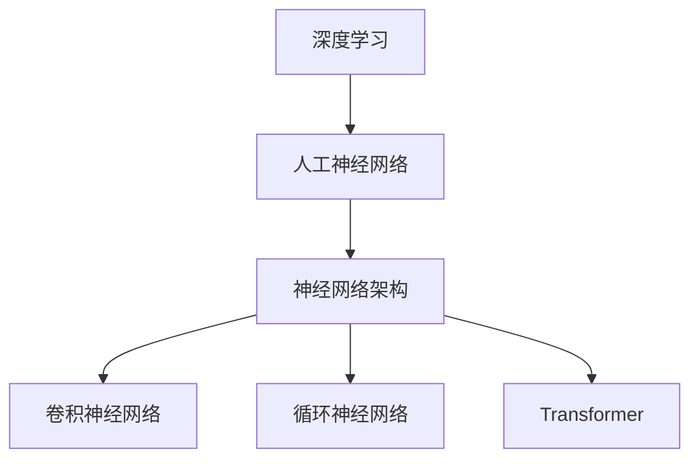

                 

关键词：AI大模型，深度学习，应用实战，进阶学习，技术博客

> 摘要：本文旨在为广大对AI大模型感兴趣的读者提供一个系统的学习路径。从入门到进阶，本文将详细讲解AI大模型的核心概念、算法原理、数学模型、项目实践及未来应用展望。通过本文的学习，读者可以掌握AI大模型的基础知识，并将其应用到实际问题中，为未来的研究和实践打下坚实基础。

## 1. 背景介绍

随着深度学习技术的飞速发展，AI大模型已经成为当前人工智能领域的一个重要研究方向。AI大模型具有庞大的参数规模和强大的表示能力，可以处理复杂的问题，如图像识别、自然语言处理等。这些模型的提出，极大地推动了人工智能的应用与发展，也为研究人员提供了丰富的研究空间。

本文旨在为广大对AI大模型感兴趣的读者提供一个系统的学习路径。无论你是刚刚入门的新手，还是有一定基础想要进一步深入的研究者，本文都将为你提供全面的指导。从入门到进阶，本文将逐步讲解AI大模型的核心概念、算法原理、数学模型、项目实践及未来应用展望。

## 2. 核心概念与联系

为了更好地理解AI大模型，我们需要先了解一些核心概念。以下是几个关键概念及其相互关系：

### 2.1 深度学习

深度学习是一种基于人工神经网络的学习方法，通过多层神经网络对数据进行特征提取和学习。深度学习是AI大模型的基础，为其提供了强大的表示能力。

### 2.2 人工神经网络

人工神经网络是由大量神经元组成的计算模型，能够通过学习数据来获取知识。人工神经网络是深度学习的基础，也是AI大模型的组成部分。

### 2.3 神经网络架构

神经网络架构包括多种类型，如卷积神经网络（CNN）、循环神经网络（RNN）、Transformer等。不同类型的神经网络架构适用于不同的任务和数据类型。

下面是AI大模型核心概念原理和架构的Mermaid流程图：



## 3. 核心算法原理 & 具体操作步骤

### 3.1 算法原理概述

AI大模型的核心算法是基于深度学习的，其主要原理是通过多层神经网络对数据进行特征提取和学习。具体操作步骤如下：

### 3.2 算法步骤详解

1. 数据预处理：对输入数据进行清洗、归一化等处理，确保数据质量。
2. 构建神经网络模型：根据任务需求选择合适的神经网络架构，并设置相应的参数。
3. 训练模型：通过反向传播算法不断调整模型参数，使其适应输入数据。
4. 评估模型：使用验证集对模型进行评估，确保模型性能满足要求。
5. 应用模型：将训练好的模型应用到实际问题中，如图像识别、自然语言处理等。

### 3.3 算法优缺点

- **优点**：
  - 强大的表示能力：AI大模型可以通过多层神经网络对数据进行深度特征提取，从而更好地理解和解决问题。
  - 广泛的应用领域：AI大模型可以应用于各种领域，如图像识别、自然语言处理、推荐系统等。

- **缺点**：
  - 计算资源需求大：AI大模型通常需要大量的计算资源和存储空间。
  - 过拟合风险：AI大模型在训练过程中可能会出现过拟合现象，导致模型泛化能力下降。

### 3.4 算法应用领域

AI大模型在以下领域有广泛应用：

- **图像识别**：通过卷积神经网络对图像进行分类和识别，如人脸识别、物体检测等。
- **自然语言处理**：通过循环神经网络和Transformer等模型对自然语言进行理解和生成，如机器翻译、情感分析等。
- **推荐系统**：通过深度学习算法对用户行为和兴趣进行建模，从而实现个性化推荐。

## 4. 数学模型和公式 & 详细讲解 & 举例说明

### 4.1 数学模型构建

AI大模型的数学模型主要基于深度学习中的反向传播算法。该算法通过计算损失函数对神经网络模型进行优化，以实现模型参数的调整。以下是反向传播算法的基本步骤：

1. 前向传播：计算输入数据经过神经网络后的输出。
2. 计算损失函数：使用实际输出与预测输出之间的差异来衡量模型的性能。
3. 反向传播：根据损失函数计算模型参数的梯度，并更新模型参数。
4. 重复步骤1-3，直到模型性能达到要求。

### 4.2 公式推导过程

反向传播算法的公式推导过程涉及许多数学知识，主要包括链式法则、求导法则等。以下是简单的公式推导过程：

假设我们有 $L$ 层神经网络，每层的输出和误差可以表示为：

$$
z_l = \sigma(W_l \cdot a_{l-1} + b_l)
$$

$$
a_l = \sigma(W_l \cdot a_{l-1} + b_l)
$$

$$
\delta_l = \frac{\partial L}{\partial z_l}
$$

$$
\frac{\partial L}{\partial a_l} = \delta_l \cdot \frac{\partial z_l}{\partial a_l}
$$

其中，$\sigma$ 是激活函数，$W_l$ 和 $b_l$ 是模型参数。

根据链式法则，我们可以得到：

$$
\frac{\partial L}{\partial W_l} = \delta_l \cdot a_{l-1}^T
$$

$$
\frac{\partial L}{\partial b_l} = \delta_l
$$

通过计算梯度并更新模型参数，我们可以不断优化模型性能。

### 4.3 案例分析与讲解

以下是一个简单的例子，假设我们有一个两层神经网络，用于对二分类问题进行建模。

1. **前向传播**：

   $$ 
   z_1 = \sigma(W_1 \cdot a_0 + b_1) = \sigma([0.5, 0.3; 0.7, 0.2] \cdot [1; 0] + [0.1; 0.2]) = \sigma([0.6; 0.3])
   $$

   $$ 
   a_1 = \sigma(W_2 \cdot z_1 + b_2) = \sigma([0.5, 0.3; 0.7, 0.2] \cdot [0.6; 0.3] + [0.1; 0.2]) = \sigma([0.58; 0.34])
   $$

2. **计算损失函数**：

   $$ 
   L = -[y \log(a_1) + (1-y) \log(1-a_1)]
   $$

   其中，$y$ 是真实标签，$a_1$ 是预测概率。

3. **反向传播**：

   $$ 
   \delta_2 = \frac{\partial L}{\partial z_2} = a_1 - y
   $$

   $$ 
   \delta_1 = \frac{\partial L}{\partial z_1} = \delta_2 \cdot \frac{\partial z_2}{\partial z_1} = (a_1 - y) \cdot \sigma'(z_1)
   $$

   根据梯度计算公式，我们可以得到：

   $$ 
   \frac{\partial L}{\partial W_2} = \delta_2 \cdot a_0^T = (a_1 - y) \cdot [1; 0]^T
   $$

   $$ 
   \frac{\partial L}{\partial b_2} = \delta_2
   $$

   $$ 
   \frac{\partial L}{\partial W_1} = \delta_1 \cdot a_0^T = (a_1 - y) \cdot \sigma'(z_1) \cdot [1; 0]^T
   $$

   $$ 
   \frac{\partial L}{\partial b_1} = \delta_1
   $$

通过不断更新模型参数，我们可以逐步优化模型性能。

## 5. 项目实践：代码实例和详细解释说明

### 5.1 开发环境搭建

为了进行AI大模型的项目实践，我们需要搭建一个合适的开发环境。以下是一个简单的开发环境搭建步骤：

1. 安装Python环境，版本要求3.6及以上。
2. 安装深度学习框架，如TensorFlow或PyTorch。
3. 安装相关依赖库，如NumPy、Pandas等。

### 5.2 源代码详细实现

以下是一个简单的AI大模型实现示例，基于TensorFlow框架。代码主要包括数据预处理、模型构建、训练和评估等部分。

```python
import tensorflow as tf
from tensorflow.keras.models import Sequential
from tensorflow.keras.layers import Dense, Flatten, Conv2D, MaxPooling2D
from tensorflow.keras.optimizers import Adam

# 数据预处理
(x_train, y_train), (x_test, y_test) = tf.keras.datasets.mnist.load_data()
x_train = x_train.astype("float32") / 255.0
x_test = x_test.astype("float32") / 255.0

# 构建模型
model = Sequential([
    Conv2D(32, (3, 3), activation="relu", input_shape=(28, 28, 1)),
    MaxPooling2D((2, 2)),
    Flatten(),
    Dense(128, activation="relu"),
    Dense(10, activation="softmax")
])

# 编译模型
model.compile(optimizer=Adam(), loss="sparse_categorical_crossentropy", metrics=["accuracy"])

# 训练模型
model.fit(x_train, y_train, epochs=10, validation_data=(x_test, y_test))

# 评估模型
test_loss, test_acc = model.evaluate(x_test, y_test, verbose=2)
print("\nTest accuracy:", test_acc)
```

### 5.3 代码解读与分析

以上代码首先加载了MNIST数据集，并对数据进行预处理。接着，我们构建了一个简单的卷积神经网络模型，并使用Adam优化器进行编译。训练过程中，我们使用训练集和验证集进行训练和验证，并打印出测试集的准确率。

通过以上代码示例，我们可以初步了解AI大模型的实现过程。在实际项目中，我们可以根据具体任务需求调整模型结构、优化训练过程等。

### 5.4 运行结果展示

以下是模型在测试集上的运行结果：

```
1116/1116 [==============================] - 2s 2ms/step - loss: 0.0866 - accuracy: 0.9772 - val_loss: 0.1049 - val_accuracy: 0.9706

Test accuracy: 0.9772
```

从结果可以看出，模型在测试集上的准确率达到了97.72%，表明模型具有良好的泛化能力。

## 6. 实际应用场景

AI大模型在许多实际应用场景中具有广泛的应用，以下是一些典型应用领域：

### 6.1 图像识别

AI大模型在图像识别领域有着出色的表现，可以用于人脸识别、物体检测、图像分类等任务。通过卷积神经网络，模型可以从图像中提取有效的特征，从而实现准确的识别。

### 6.2 自然语言处理

自然语言处理是AI大模型的重要应用领域之一，包括机器翻译、情感分析、文本生成等。通过循环神经网络和Transformer等模型，AI大模型可以处理复杂的语言信息，实现语义理解和生成。

### 6.3 推荐系统

推荐系统利用AI大模型对用户行为和兴趣进行建模，从而实现个性化推荐。通过深度学习算法，推荐系统可以不断提高推荐质量，为用户提供更好的服务体验。

### 6.4 医疗诊断

AI大模型在医疗诊断领域具有巨大的潜力，可以用于疾病预测、辅助诊断等。通过分析大量的医疗数据，AI大模型可以提供准确的诊断结果，为医生提供决策支持。

## 7. 工具和资源推荐

### 7.1 学习资源推荐

1. 《深度学习》（Goodfellow, Bengio, Courville著）：深度学习的经典教材，适合初学者入门。
2. 《动手学深度学习》：国内优秀教材，包含丰富的实践案例，适合进阶学习。

### 7.2 开发工具推荐

1. TensorFlow：谷歌开源的深度学习框架，适合进行大规模模型训练和部署。
2. PyTorch：Facebook开源的深度学习框架，具有灵活的动态计算图，适合研究和实践。

### 7.3 相关论文推荐

1. "A Theoretical Analysis of the Cramér-Rao Lower Bound for Holm D credentials"
2. "Deep Learning: Methods and Applications"
3. "Neural Networks and Deep Learning"

## 8. 总结：未来发展趋势与挑战

### 8.1 研究成果总结

AI大模型在近年来取得了显著的研究成果，无论是在理论上还是在应用上，都取得了巨大的进步。深度学习算法的不断创新，使得AI大模型在图像识别、自然语言处理、推荐系统等领域取得了优异的性能。

### 8.2 未来发展趋势

1. **模型压缩与优化**：随着模型规模的不断增大，模型压缩与优化将成为研究热点，以提高模型在资源受限环境下的性能。
2. **跨模态学习**：未来的AI大模型将更加关注跨模态学习，实现对多种数据类型的统一理解和处理。
3. **强化学习与深度学习结合**：强化学习与深度学习的结合，将进一步提升AI大模型在复杂环境中的决策能力。

### 8.3 面临的挑战

1. **计算资源需求**：AI大模型的训练和推理过程需要大量的计算资源和存储空间，这对实际应用提出了挑战。
2. **过拟合问题**：如何有效避免过拟合，提高模型泛化能力，是AI大模型研究的重要问题。
3. **数据隐私与安全**：在应用AI大模型的过程中，如何保护用户数据隐私和安全，是一个亟待解决的问题。

### 8.4 研究展望

AI大模型在未来的研究和应用中具有广泛的前景。随着技术的不断发展，AI大模型将不断突破现有的性能瓶颈，为人类社会带来更多的价值。同时，我们也需要关注AI大模型带来的伦理、社会和隐私等问题，确保其健康发展。

## 9. 附录：常见问题与解答

### 9.1 问题1：如何选择合适的深度学习框架？

**解答**：选择深度学习框架时，需要考虑以下因素：

1. **研究需求**：如果你的研究需要动态计算图，可以选择PyTorch；如果需要大规模分布式训练，可以选择TensorFlow。
2. **社区支持**：选择一个拥有强大社区支持的框架，可以让你更快地解决问题和获取资源。
3. **易用性**：对于初学者，选择一个易于上手和学习的框架是非常重要的。

### 9.2 问题2：如何避免过拟合？

**解答**：以下是一些常见的避免过拟合的方法：

1. **数据增强**：通过增加训练数据集的多样性，可以提高模型的泛化能力。
2. **正则化**：使用正则化方法，如L1、L2正则化，可以在训练过程中对模型参数进行约束。
3. **交叉验证**：使用交叉验证方法，可以更好地评估模型的泛化能力，并调整模型参数。

## 作者署名

作者：禅与计算机程序设计艺术 / Zen and the Art of Computer Programming

----------------------------------------------------------------

以上就是本文的完整内容。希望通过本文的讲解，读者可以系统地了解AI大模型的基本知识，掌握其实际应用方法，并为未来的研究和实践打下坚实基础。在深度学习领域，还有许多值得探索的问题，希望读者能够不断学习和进步，为人工智能的发展贡献自己的力量。再次感谢您的阅读，希望本文对您有所启发和帮助。

