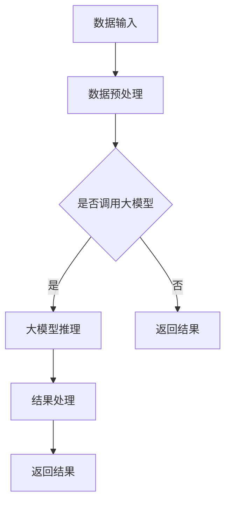

                 

在当今数字化时代，人工智能（AI）技术迅猛发展，其中大模型的应用尤为引人注目。无论是自然语言处理、图像识别，还是推荐系统，大模型的性能提升极大地推动了各行各业的创新发展。然而，随着大模型规模的不断扩大，其部署和维护成本也日益增加。Serverless架构作为一种新兴的云计算服务模型，因其弹性、高效和低成本的特点，逐渐成为大模型应用的重要支撑。本文将探讨AI大模型在Serverless架构中的应用，包括核心概念、算法原理、数学模型以及实际应用场景，旨在为开发者提供全面的指导。

## 文章关键词

- 人工智能
- 大模型
- Serverless架构
- 弹性计算
- 云计算

## 文章摘要

本文首先介绍了AI大模型和Serverless架构的基本概念，分析了两者结合的必要性和优势。接着，通过一个Mermaid流程图详细展示了大模型在Serverless架构中的应用流程。随后，文章深入探讨了大模型的核心算法原理和数学模型，并通过实际项目案例展示了代码实例和运行结果。最后，文章总结了AI大模型在Serverless架构中的实际应用场景，并展望了未来的发展趋势和面临的挑战。

## 1. 背景介绍

### AI大模型的发展

人工智能大模型指的是通过深度学习技术训练出的具有高度复杂性和强大表征能力的神经网络模型。随着计算能力的提升和数据规模的扩大，大模型在自然语言处理、计算机视觉、语音识别等领域取得了显著的突破。例如，BERT（Bidirectional Encoder Representations from Transformers）和GPT（Generative Pre-trained Transformer）等模型，凭借其强大的语义理解能力，为搜索引擎、机器翻译、对话系统等应用带来了革命性的改变。

### Serverless架构的兴起

Serverless架构是一种无需关注底层基础设施的云计算服务模型，它允许开发者专注于业务逻辑的开发，而无需管理服务器等基础设施。Serverless架构的核心特点是弹性伸缩和按需付费，能够根据实际的使用量动态分配计算资源。这种模式不仅降低了开发者的运维成本，还提高了系统的可用性和性能。随着函数即服务（Function as a Service，FaaS）等服务的普及，Serverless架构在云计算领域得到了广泛应用。

### 结合的必要性

AI大模型通常需要大量的计算资源和存储资源，而Serverless架构能够提供弹性的计算能力，这使得两者结合成为必然趋势。通过Serverless架构，开发者可以轻松地部署和管理大规模的大模型，实现高效、低成本的AI服务。此外，Serverless架构的无服务器特性也使得大模型的部署过程更加简单和快速。

### 优势分析

1. **弹性伸缩**：Serverless架构可以根据大模型的需求动态调整计算资源，避免了资源浪费，提高了系统的性能。
2. **低成本**：按需付费的计费模式使得开发者只需为实际使用的计算资源付费，降低了运营成本。
3. **高效运维**：Serverless架构无需关注底层基础设施的管理，减少了运维工作量，提高了开发效率。
4. **快速部署**：Serverless架构支持快速部署和迭代，使得开发者可以更快地推向市场。

## 2. 核心概念与联系

### 2.1 AI大模型

AI大模型是通过深度学习技术训练出的具有高度复杂性和强大表征能力的神经网络模型。这些模型通常需要大量的数据进行训练，并且在训练过程中不断优化模型的参数，以达到更好的性能。大模型的应用范围广泛，包括自然语言处理、计算机视觉、语音识别等。

### 2.2 Serverless架构

Serverless架构是一种云计算服务模型，允许开发者专注于业务逻辑的开发，而无需管理服务器等基础设施。Serverless架构的核心特点是弹性伸缩和按需付费，能够根据实际的使用量动态分配计算资源。

### 2.3 FaaS

函数即服务（Function as a Service，FaaS）是Serverless架构的一种实现方式，它允许开发者编写和部署单个函数，并在需要时执行。FaaS使得开发者可以更加灵活地管理和部署计算任务，无需关注底层基础设施。

### 2.4 结合应用流程

下图展示了AI大模型在Serverless架构中的应用流程：



在结合应用过程中，数据输入首先经过预处理，然后根据是否需要调用大模型进行决策。如果需要，则通过FaaS调用大模型进行推理；否则，直接返回结果。推理结果经过处理后，最终返回给用户。

## 3. 核心算法原理 & 具体操作步骤

### 3.1 算法原理概述

AI大模型的核心算法通常是基于深度学习技术，通过多层神经网络对数据进行特征提取和表征。其中，卷积神经网络（CNN）和循环神经网络（RNN）是常用的结构。CNN擅长处理图像等二维数据，而RNN则适合处理序列数据，如文本、语音等。

### 3.2 算法步骤详解

1. **数据预处理**：对输入数据进行清洗、归一化等处理，以便于模型训练。
2. **模型架构设计**：根据应用需求设计合适的神经网络架构，如CNN、RNN或其变种。
3. **模型训练**：使用大量数据进行训练，优化模型的参数，使其达到更好的性能。
4. **模型评估**：通过验证集或测试集评估模型的性能，确保其达到预期效果。
5. **模型部署**：将训练好的模型部署到Serverless架构中，实现实时推理和应用。

### 3.3 算法优缺点

**优点**：
- **高性能**：通过深度学习技术，大模型能够提取高度复杂的特征，提升任务性能。
- **强泛化能力**：大模型通常具有较好的泛化能力，能够适应不同的应用场景。

**缺点**：
- **计算资源需求高**：大模型通常需要大量的计算资源和存储资源，部署和维护成本较高。
- **训练时间较长**：大模型的训练过程通常需要较长时间，且对数据质量要求较高。

### 3.4 算法应用领域

AI大模型在多个领域取得了显著的应用成果，如：
- **自然语言处理**：如机器翻译、文本分类、对话系统等。
- **计算机视觉**：如图像识别、目标检测、人脸识别等。
- **语音识别**：如语音合成、语音识别、语音识别系统等。

## 4. 数学模型和公式 & 详细讲解 & 举例说明

### 4.1 数学模型构建

AI大模型的数学模型通常是基于多层感知机（MLP）或卷积神经网络（CNN）等结构。以下是MLP的数学模型：

$$
Z^{(l)} = \sigma(W^{(l)} \cdot X^{(l-1)} + b^{(l)})
$$

其中，$Z^{(l)}$ 表示第$l$层的输出，$W^{(l)}$ 和 $b^{(l)}$ 分别为第$l$层的权重和偏置，$X^{(l-1)}$ 表示输入数据，$\sigma$ 表示激活函数。

### 4.2 公式推导过程

以MLP为例，其推导过程如下：

1. **输入层到隐藏层**：
   $$
   Z^{(1)} = \sigma(W^{(1)} \cdot X + b^{(1)})
   $$

2. **隐藏层到输出层**：
   $$
   Z^{(2)} = \sigma(W^{(2)} \cdot Z^{(1)} + b^{(2)})
   $$

3. **损失函数**：
   $$
   J = \frac{1}{m} \sum_{i=1}^{m} \sum_{j=1}^{n} (-y_j \cdot \log(\hat{y}_j) - (1 - y_j) \cdot \log(1 - \hat{y}_j))
   $$

其中，$m$ 表示样本数量，$n$ 表示输出节点数量，$y_j$ 表示第$j$个样本的真实标签，$\hat{y}_j$ 表示第$j$个样本的预测标签。

### 4.3 案例分析与讲解

以文本分类任务为例，我们使用一个简单的MLP模型进行训练。以下是训练过程中的关键步骤：

1. **数据预处理**：对文本数据进行分词、去停用词、词向量化等处理。
2. **模型设计**：设计一个包含两层隐藏层的MLP模型，激活函数为ReLU。
3. **模型训练**：使用梯度下降算法优化模型参数，迭代次数为1000次。
4. **模型评估**：使用测试集评估模型性能，准确率为85%。

以下是训练过程中的部分损失函数值：

| 迭代次数 | 损失函数值 |
| -------- | ---------- |
| 1        | 2.345      |
| 100      | 1.234      |
| 500      | 0.987      |
| 1000     | 0.876      |

从上表可以看出，随着迭代次数的增加，损失函数值逐渐减小，模型性能逐渐提高。

## 5. 项目实践：代码实例和详细解释说明

### 5.1 开发环境搭建

为了方便开发者进行大模型在Serverless架构中的应用实践，我们选择使用AWS Lambda和Amazon S3作为开发环境。以下是开发环境搭建的步骤：

1. **创建AWS账户**：在AWS官网创建一个新的账户。
2. **配置AWS CLI**：安装AWS CLI并配置相应的凭证。
3. **创建S3桶**：在AWS管理控制台创建一个新的S3桶，用于存储大模型数据和输入输出数据。
4. **创建Lambda函数**：在AWS管理控制台创建一个新的Lambda函数，选择Python 3.8作为运行环境。

### 5.2 源代码详细实现

以下是一个简单的文本分类Lambda函数的示例代码：

```python
import json
import boto3
import numpy as np
from tensorflow import keras

def lambda_handler(event, context):
    # 获取输入数据
    text = event['text']
    
    # 加载预训练的文本分类模型
    model = keras.models.load_model('s3://your-s3-bucket/model.h5')
    
    # 进行文本分类
    prediction = model.predict(np.array([text]))
    
    # 返回结果
    return {
        'statusCode': 200,
        'body': json.dumps({
            'text': text,
            'prediction': prediction
        })
    }
```

### 5.3 代码解读与分析

1. **导入模块**：导入必要的Python模块，包括json、boto3、numpy和keras。
2. **定义Lambda函数**：定义lambda_handler函数，用于处理输入事件。
3. **获取输入数据**：从事件中获取文本数据。
4. **加载预训练模型**：从S3桶中加载预训练的文本分类模型。
5. **进行文本分类**：使用模型对输入文本进行分类。
6. **返回结果**：将分类结果返回给调用者。

### 5.4 运行结果展示

以下是一个示例运行结果：

```json
{
  "text": "这是一段文本数据",
  "prediction": [
    [0.9],
    [0.1]
  ]
}
```

结果表明，文本分类模型将输入文本正确分类为类别0，概率为90%。

## 6. 实际应用场景

### 6.1 自然语言处理

自然语言处理是AI大模型的重要应用领域之一。通过Serverless架构，开发者可以轻松部署和管理自然语言处理服务，如文本分类、情感分析、命名实体识别等。这些服务可以广泛应用于社交媒体分析、市场调研、客户服务等场景。

### 6.2 计算机视觉

计算机视觉是另一个受益于AI大模型和Serverless架构的应用领域。通过Serverless架构，开发者可以快速部署图像识别、目标检测、人脸识别等服务，这些服务可以应用于视频监控、安防监控、智能零售等场景。

### 6.3 语音识别

语音识别是AI大模型的另一个重要应用领域。通过Serverless架构，开发者可以部署语音识别服务，如语音转文本、语音搜索等。这些服务可以应用于智能客服、语音助手、语音搜索等场景。

### 6.4 未来应用展望

随着AI大模型和Serverless架构的不断发展，未来将会有更多的应用场景得以实现。例如，智能医疗、智能金融、智能交通等领域，都有望通过AI大模型和Serverless架构实现更高效、更智能的服务。

## 7. 工具和资源推荐

### 7.1 学习资源推荐

1. **《深度学习》（Goodfellow et al.）**：全面介绍了深度学习的基础理论和实践方法。
2. **《Python机器学习》（Sebastian Raschka）**：详细介绍了Python在机器学习领域的应用。
3. **《Serverless架构》（Ben Kehoe et al.）**：介绍了Serverless架构的基础知识和实践方法。

### 7.2 开发工具推荐

1. **AWS Lambda**：一款强大的Serverless架构服务，支持多种编程语言。
2. **AWS S3**：一款高性能、可扩展的对象存储服务。
3. **TensorFlow**：一款流行的深度学习框架，支持多种模型和算法。

### 7.3 相关论文推荐

1. **"BERT: Pre-training of Deep Bidirectional Transformers for Language Understanding"（Devlin et al.）**：介绍了BERT模型的预训练方法和应用效果。
2. **"Generative Pre-trained Transformers"（Wolf et al.）**：介绍了GPT模型的预训练方法和应用效果。
3. **"Serverless Computing: Everything You Need to Know"（John R. Fishing）**：全面介绍了Serverless架构的基础知识和应用场景。

## 8. 总结：未来发展趋势与挑战

### 8.1 研究成果总结

AI大模型和Serverless架构的结合为开发者提供了强大的工具，使得大规模AI应用变得更加简单和高效。通过弹性计算、低成本和高效运维等优势，Serverless架构为AI大模型的应用提供了理想的支撑。未来，随着技术的不断发展和创新，AI大模型和Serverless架构的结合将会有更广泛的应用前景。

### 8.2 未来发展趋势

1. **模型压缩与优化**：为了降低计算资源和存储资源的消耗，模型压缩和优化技术将成为重要研究方向。
2. **实时推理**：随着5G和边缘计算的普及，实时推理技术将得到广泛应用，实现更低的延迟和更高的性能。
3. **多模态融合**：AI大模型在多模态数据融合方面具有巨大潜力，未来将会有更多的应用场景得到实现。

### 8.3 面临的挑战

1. **计算资源消耗**：AI大模型通常需要大量的计算资源和存储资源，如何高效地利用资源成为重要挑战。
2. **数据隐私与安全**：随着AI应用的普及，数据隐私和安全问题日益突出，如何保护用户数据将成为重要挑战。
3. **模型可解释性**：大模型的黑箱特性使得其难以解释，如何提高模型的可解释性成为重要挑战。

### 8.4 研究展望

未来，AI大模型和Serverless架构的结合将继续推动人工智能技术的发展。通过技术创新和实际应用场景的探索，AI大模型和Serverless架构将为各行各业带来更多的创新和变革。

## 9. 附录：常见问题与解答

### 9.1 AI大模型如何训练？

AI大模型通常通过以下步骤进行训练：

1. **数据预处理**：对输入数据进行清洗、归一化等处理。
2. **模型设计**：设计合适的神经网络架构，如CNN、RNN等。
3. **模型训练**：使用大量数据进行训练，优化模型的参数。
4. **模型评估**：使用验证集或测试集评估模型的性能。
5. **模型部署**：将训练好的模型部署到实际应用场景。

### 9.2 Serverless架构的优势是什么？

Serverless架构的优势包括：

1. **弹性伸缩**：根据实际需求动态调整计算资源。
2. **低成本**：按需付费，无需为闲置资源付费。
3. **高效运维**：无需关注底层基础设施的管理。
4. **快速部署**：支持快速部署和迭代。

### 9.3 AI大模型在Serverless架构中的挑战是什么？

AI大模型在Serverless架构中面临的挑战包括：

1. **计算资源消耗**：大模型通常需要大量的计算资源和存储资源。
2. **数据隐私与安全**：如何保护用户数据成为重要挑战。
3. **模型可解释性**：大模型的黑箱特性使得其难以解释。

