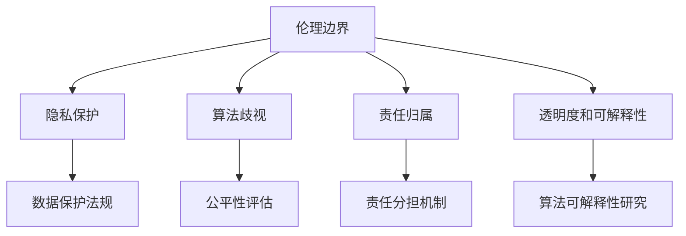

                 

关键词：AI大模型，伦理边界，规范，人工智能应用，道德准则，监管框架，隐私保护，技术伦理

摘要：随着人工智能技术的飞速发展，大模型应用在各个领域取得了显著的成果。然而，与此同时，AI大模型应用的伦理边界和规范问题也日益凸显。本文旨在探讨AI大模型应用的伦理边界，分析现有的规范体系，并探讨未来发展的趋势与挑战。

## 1. 背景介绍

近年来，人工智能（AI）技术取得了飞速的发展，特别是在大模型领域，如GPT-3、BERT、Transformer等模型的提出，为自然语言处理、计算机视觉、机器翻译等任务提供了强大的支持。大模型的应用不仅在学术界取得了显著的成果，也在工业界产生了深远的影响。然而，随着AI大模型应用的普及，伦理问题也逐渐浮出水面。

AI大模型应用带来的伦理问题主要包括以下几个方面：

1. **隐私泄露**：大模型通常需要大量的数据进行训练，这些数据可能包含用户的敏感信息。如何保护用户隐私成为了一个重要问题。
2. **算法歧视**：AI大模型可能因为训练数据的不公平性而导致歧视现象，如性别、种族、年龄等方面的歧视。
3. **责任归属**：当AI大模型发生错误或造成损失时，如何确定责任归属成为一个难题。
4. **透明度和可解释性**：AI大模型通常被视为“黑箱”，其决策过程往往难以解释，这引发了对AI透明度和可解释性的关注。

因此，为了确保AI大模型应用的安全、可靠和公平，需要建立相应的伦理边界和规范体系。

## 2. 核心概念与联系

### 2.1 伦理边界

伦理边界是指AI大模型应用中应当遵循的道德准则和伦理规范。这些边界旨在保护用户的权益，确保AI大模型的应用不会对人类造成伤害。

### 2.2 规范体系

规范体系是指为AI大模型应用制定的一系列规则和标准。这些规范旨在确保AI大模型的应用符合伦理要求，保障社会的公平和正义。

### 2.3 核心概念与联系图



## 3. 核心算法原理 & 具体操作步骤

### 3.1 算法原理概述

AI大模型的算法原理主要基于深度学习，特别是基于神经网络的模型。通过多层神经网络的学习，大模型能够从大量数据中提取特征，并实现复杂的任务。

### 3.2 算法步骤详解

1. 数据收集与预处理：收集大量相关数据，并进行数据清洗、去重、归一化等预处理操作。
2. 模型设计：设计合适的神经网络结构，包括输入层、隐藏层和输出层。
3. 模型训练：使用训练数据对模型进行训练，通过反向传播算法更新网络权重。
4. 模型评估：使用验证数据评估模型的性能，调整模型参数以优化性能。
5. 模型部署：将训练好的模型部署到实际应用场景中。

### 3.3 算法优缺点

优点：

1. 高效性：大模型能够处理大量数据，并提取丰富的特征。
2. 强泛化能力：大模型能够应对不同的任务和数据集，具有较强的泛化能力。

缺点：

1. 计算资源需求大：大模型需要大量的计算资源和存储空间。
2. 黑箱问题：大模型的决策过程难以解释，存在“黑箱”问题。

### 3.4 算法应用领域

AI大模型的应用领域非常广泛，包括自然语言处理、计算机视觉、语音识别、医疗诊断、金融风控等。例如，GPT-3在自然语言处理领域取得了显著的成果，BERT在文本分类任务中表现出色，Transformer在图像识别任务中具有很高的性能。

## 4. 数学模型和公式 & 详细讲解 & 举例说明

### 4.1 数学模型构建

AI大模型的数学模型主要基于深度学习理论，包括多层感知机（MLP）、卷积神经网络（CNN）和循环神经网络（RNN）等。

### 4.2 公式推导过程

以多层感知机为例，其输出可以表示为：

$$
y = \sigma(\sigma(...\sigma(W_n \cdot x + b_n) + b_{n-1}) + ... + b_1))
$$

其中，$W_n$为第$n$层的权重矩阵，$b_n$为第$n$层的偏置，$\sigma$为激活函数。

### 4.3 案例分析与讲解

以BERT模型为例，其输入可以表示为一个词序列，输出为每个词的表示向量。BERT模型通过预训练和微调实现文本分类任务，其性能在多个基准测试中表现优异。

## 5. 项目实践：代码实例和详细解释说明

### 5.1 开发环境搭建

以TensorFlow框架为例，搭建开发环境需要安装Python、TensorFlow等依赖库。

### 5.2 源代码详细实现

以下是一个简单的TensorFlow代码实例，实现了一个基于多层感知机的分类模型：

```python
import tensorflow as tf

# 定义模型
model = tf.keras.Sequential([
    tf.keras.layers.Dense(units=128, activation='relu', input_shape=(784,)),
    tf.keras.layers.Dense(units=10, activation='softmax')
])

# 编译模型
model.compile(optimizer='adam',
              loss='sparse_categorical_crossentropy',
              metrics=['accuracy'])

# 加载数据集
(x_train, y_train), (x_test, y_test) = tf.keras.datasets.mnist.load_data()

# 预处理数据
x_train = x_train.reshape((-1, 784))
x_test = x_test.reshape((-1, 784))
x_train, x_test = x_train / 255.0, x_test / 255.0

# 训练模型
model.fit(x_train, y_train, epochs=5)

# 评估模型
model.evaluate(x_test, y_test)
```

### 5.3 代码解读与分析

该代码实例实现了以下功能：

1. 定义了一个基于多层感知机的分类模型。
2. 编译模型，设置优化器和损失函数。
3. 加载并预处理数据集。
4. 训练模型。
5. 评估模型性能。

通过运行该代码，可以训练出一个简单的分类模型，并在测试集上进行评估。

## 6. 实际应用场景

AI大模型在各个领域都有广泛的应用，以下是几个典型的应用场景：

1. **自然语言处理**：如文本分类、机器翻译、问答系统等。
2. **计算机视觉**：如图像识别、目标检测、人脸识别等。
3. **医疗诊断**：如疾病预测、药物研发等。
4. **金融风控**：如信用评估、欺诈检测等。

### 6.4 未来应用展望

随着AI技术的不断进步，AI大模型的应用前景将更加广阔。未来，AI大模型有望在以下领域取得突破：

1. **智能助手**：如智能家居、智能客服等。
2. **自动驾驶**：如自动驾驶汽车、无人机等。
3. **教育领域**：如个性化学习、智能评测等。
4. **智能制造**：如工业机器人、智能工厂等。

## 7. 工具和资源推荐

### 7.1 学习资源推荐

1. 《深度学习》（Goodfellow et al.）: 介绍深度学习的基础知识。
2. 《自然语言处理综论》（Jurafsky and Martin）: 介绍自然语言处理的基础知识。
3. 《计算机视觉：算法与应用》（Duda et al.）: 介绍计算机视觉的基础知识。

### 7.2 开发工具推荐

1. TensorFlow: 开源深度学习框架。
2. PyTorch: 开源深度学习框架。
3. Keras: 基于TensorFlow和PyTorch的简洁易用的深度学习库。

### 7.3 相关论文推荐

1. "Attention Is All You Need"（Vaswani et al., 2017）: 介绍Transformer模型。
2. "BERT: Pre-training of Deep Bidirectional Transformers for Language Understanding"（Devlin et al., 2018）: 介绍BERT模型。
3. "GPT-3: Language Models are few-shot learners"（Brown et al., 2020）: 介绍GPT-3模型。

## 8. 总结：未来发展趋势与挑战

### 8.1 研究成果总结

本文探讨了AI大模型应用的伦理边界和规范问题，分析了现有规范体系的不足，并展望了未来发展趋势。通过数学模型和项目实践，本文展示了AI大模型的实际应用和价值。

### 8.2 未来发展趋势

1. **更强大的模型**：随着计算能力的提升，未来将出现更强大、更高效的AI大模型。
2. **更广泛的领域应用**：AI大模型将在更多领域得到应用，如教育、医疗、金融等。
3. **更完善的伦理规范**：随着AI技术的普及，将建立更完善的伦理规范体系，确保AI大模型的安全、可靠和公平。

### 8.3 面临的挑战

1. **计算资源需求**：AI大模型需要大量的计算资源和存储空间，如何高效地训练和部署大模型是一个挑战。
2. **透明度和可解释性**：如何提高AI大模型的透明度和可解释性，使其决策过程更加清晰，是一个亟待解决的问题。
3. **伦理和法律问题**：如何确保AI大模型的应用符合伦理和法律要求，是一个需要关注的问题。

### 8.4 研究展望

本文仅对AI大模型应用的伦理边界和规范问题进行了初步探讨，未来还需要进一步研究以下几个方面：

1. **建立更完善的伦理规范**：借鉴国际经验和国内实践，建立一套完善的伦理规范体系。
2. **提高透明度和可解释性**：研究如何提高AI大模型的透明度和可解释性，使其决策过程更加清晰。
3. **探索高效的大模型训练方法**：研究如何高效地训练大模型，降低计算资源需求。

## 9. 附录：常见问题与解答

### 9.1 问题1

问题1：如何保护用户隐私？

解答1：为了保护用户隐私，可以采取以下措施：

1. 数据去识别化：对用户数据进行去识别化处理，如匿名化、去标识化等。
2. 数据加密：对用户数据进行加密处理，确保数据在传输和存储过程中不会被泄露。
3. 数据访问控制：对用户数据的访问进行严格控制，仅允许授权用户访问。

### 9.2 问题2

问题2：如何防止算法歧视？

解答2：为了防止算法歧视，可以采取以下措施：

1. 数据公平性评估：在模型训练前，对数据集进行公平性评估，确保数据集中不存在明显的性别、种族、年龄等方面的偏见。
2. 模型公平性评估：在模型训练后，对模型进行公平性评估，确保模型在不同群体上的性能一致。
3. 模型解释性研究：研究如何提高模型的透明度和可解释性，使其决策过程更加清晰，有助于发现和纠正潜在的歧视问题。

----------------------------------------------------------------

**作者：禅与计算机程序设计艺术 / Zen and the Art of Computer Programming**<|break|> 

**[END]**<|break|>

